<Info>
Please note the difference between roles and permissions. A role is a grouping of permissions and is managed from the [roles page](/en/admin/user-access-management/roles). For detailed role permission matrices, see the [Role Permission Details](/en/admin/user-access-management/role-permission-details) page.
</Info>

## Current Authorization Model

Apinizer's authorization system is based on the **asset category + action** model. Each asset category groups components with similar functions, and specific actions are defined for each category.

### Asset Categories

Apinizer has 12 different asset categories. Each category covers specific components and functions:

| Category | Covered Components | Supported Actions | Auto-Deploy |
|----------|-------------------|-------------------|-------------|
| **API Management** | API Proxy, Proxy Group, Routing, Policy | View, Manage, Deploy/Undeploy, Export/Import | - |
| **API Creator** | DB to API, Script to API, Mock API | View, Manage, Export/Import | - |
| **API Integrator** | Task Flow Manager, Integration Server | View, Manage, Execute | - |
| **Global Settings** | Policy Settings, Predefined Values, IP Groups | View, Manage, Export/Import | ✓ |
| **Connections** | Database, LDAP, Kafka, RabbitMQ, Email, Webhook, FTP, etc. | View, Manage, Export/Import | ✓ |
| **Identity & Access Control** | Credential, Certificate, Key, JWK, KeyStore | View, Manage, Export/Import | ✓ |
| **Secrets & Certificates** | Encrypted values, secret information | View, Manage, Export/Import | ✓ |
| **Monitoring** | Uptime Monitor, Anomaly Detector, Custom Queries, Filters | View, Manage | - |
| **Analytics & Reports** | Reports, Dashboards, Traffic Logs, Custom Queries, Filters | View, Manage | - |
| **Audit & Application Logs** | Audit Logs, History Records | View | - |
| **Testing** | Test Console, Test Collections | View, Execute | - |
| **Project Management** | Project, Members, Roles, Teams | View, Manage, Export/Import | - |

### Actions

Five different actions are defined for each asset category:

- **View**: Permission to view components
- **Manage**: Permission to create, edit, and delete components. In auto-deploy categories, Manage permission also includes automatic deployment of changes to workers
- **Deploy/Undeploy**: Permission to deploy and remove API Proxies and Proxy Groups to/from workers
- **Execute**: Permission to run test operations
- **Export/Import**: Permission to export and import components

### Auto-Deploy Categories

Some asset categories have the **auto-deploy** feature. Users with MANAGE permission in these categories can automatically deploy their changes to workers. Categories with auto-deploy feature:

- **Global Settings**: Global policy settings and predefined values
- **Connections**: Connection configurations
- **Identity & Access Control**: Identity management components (Credential, Certificate, Key, JWK)
- **Secrets & Certificates**: Secret information and encrypted values

### Asset Categories and Actions Relationship Diagram

**Note**: 🔵 indicates auto-deploy categories. In these categories, Manage permission also includes automatic deployment of changes to workers.

**Diagram Explanation:**

- **Purple boxes**: Asset categories (with their included components)
- **Orange boxes**: Actions
- **Blue borders**: Auto-deploy categories (Manage action also includes deployment)
- **Arrows**: Category-action relationships (which category supports which actions)

## Permission Control Hierarchy

Permission control in Apinizer follows a specific hierarchy. System-level roles are higher than project-level roles.

### System-Level Roles

System-level roles are valid system-wide and are assigned by System Admin:

#### System Admin (sysAdmin)

- **Admin Project**: Can perform all operations (all categories, all actions)
- **Normal Projects**: 
  - Must be a project member and pass role-based permission control
  - Cannot perform operations if no permission (checked like a normal user)
  - Can perform operations if permission exists

#### Project Manager (sysProjectManager)

- **All Projects**: Project Owner level permissions
- Has all actions in all categories
- Project membership check is not performed (automatically passes)

#### System Analyzer (sysAnalyzer)

- **In Admin Menu**: View permission for Analytics & Reports, Monitoring, Audit & Application Logs categories (special case - no role required)
- **In Normal Projects**: Role-based permission control required (subject to same rules as normal users)

### Project-Level Roles

Project-level roles are assigned on a project basis and managed by the project owner. These roles provide authorization based on asset categories and actions.

#### Permission Control Process

1. **Project Membership Check**: User must be a member of the project
2. **Role-Based Permission Check**: User's roles in the project are checked
3. **Category + Action Check**: Permission is checked through each role's assetPermissions list by category and action

### Permission Control Flow

The following diagram shows how a permission control request is processed:

```mermaid
flowchart TD
    Start([Permission Control Request]) --> AdminCheck{Admin Project?}
    
    AdminCheck -->|Yes| SystemAdminCheck{System Admin?}
    SystemAdminCheck -->|Yes| Allow1[✅ ALLOW]
    SystemAdminCheck -->|No| Deny1[❌ DENY]
    
    AdminCheck -->|No| ProjectManagerCheck{Project Manager?}
    ProjectManagerCheck -->|Yes| Allow2[✅ ALLOW]
    
    ProjectManagerCheck -->|No| AnalyzerCheck{System Analyzer?}
    AnalyzerCheck -->|Yes| AdminMenuCheck{In Admin Menu?}
    AdminMenuCheck -->|Yes| AnalyticsCheck{Analytics/Monitoring/Audit View?}
    AnalyticsCheck -->|Yes| Allow3[✅ ALLOW]
    AnalyticsCheck -->|No| Deny2[❌ DENY]
    
    AdminMenuCheck -->|No| MemberCheck{Project Member?}
    AnalyzerCheck -->|No| MemberCheck
    
    MemberCheck -->|No| Deny3[❌ DENY]
    MemberCheck -->|Yes| RoleCheck{Role-Based Permission?}
    
    RoleCheck -->|Yes| Allow4[✅ ALLOW]
    RoleCheck -->|No| Deny4[❌ DENY]
    
    style Allow1 fill:#4caf50,color:#fff
    style Allow2 fill:#4caf50,color:#fff
    style Allow3 fill:#4caf50,color:#fff
    style Allow4 fill:#4caf50,color:#fff
    style Deny1 fill:#f44336,color:#fff
    style Deny2 fill:#f44336,color:#fff
    style Deny3 fill:#f44336,color:#fff
    style Deny4 fill:#f44336,color:#fff
```

## Predefined Roles

Apinizer has seven predefined roles for project-level access. Each role is designed to perform specific tasks:

| Role | Description | Main Permissions |
|------|-------------|------------------|
| **Project Owner** | Role with all permissions in the project. Cannot be deleted or edited. | All actions in all categories |
| **API Developer** | Role that can manage API Proxies, deploy, and perform integration operations. | API Management, API Creator, API Integrator, Global Settings, Connections, Identity & Access Control, Secrets & Certificates, Monitoring, Analytics & Reports |
| **API Manager** | Role that can manage APIs, perform analysis and monitoring. | API Management, Monitoring, Analytics & Reports, Project Management |
| **API Creator** | Role that can perform API creation operations such as DB to API, Script to API, Mock API. | API Creator, API Management (View), Testing |
| **API Security** | Role that manages identity management, credentials, certificates, and connection security. | Identity & Access Control, Secrets & Certificates, Connections, Global Settings |
| **API Analytics** | Role that can perform analysis and reporting operations. | Analytics & Reports, Monitoring, Audit & Application Logs |
| **API Tester** | Role that can perform test operations. | Testing, API Management (View), API Creator (View) |

For detailed permission matrices, see the [Role Permission Details](/en/admin/user-access-management/role-permission-details) page.

## System-Level Roles

System-level roles are valid system-wide and are assigned by System Admin:

| Role | Description | Main Permissions |
|------|-------------|------------------|
| **System Admin** | System administrator - has full authority system-wide. | All operations in admin project, role-based control in normal projects |
| **Project Manager** | Has access to all projects and menus related to project management. | Project Owner level permissions in all projects |
| **System Analyzer** | Has access to analysis menus system-wide. | Analytics & Reports, Monitoring, Audit & Application Logs (View) in admin menu |
| **API Portal Manager** | Has full management authority in API Portal. | Portal settings, API products, account management |
| **API Portal Business User** | Has business process and viewing permissions in API Portal. | API product reviews, approval processes |
| **API Portal Developer User** | Has permission to view and use APIs as a portal developer user. | API product development, application management |
