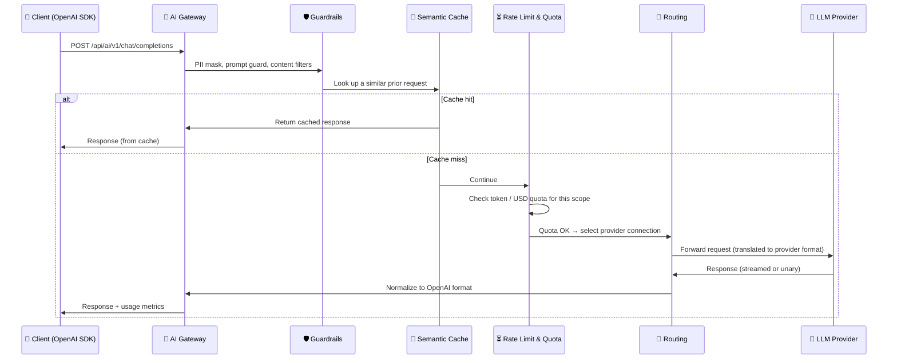

import {Card, CardGroup} from '@site/src/components/Card';
import {Steps, Step} from '@site/src/components/Steps';

## What Apinizer AI Gateway Gives You

<CardGroup cols={2}>
  <Card title="Single, OpenAI-Compatible Endpoint" icon="plug">
    Point any OpenAI SDK (or compatible client) at one `base_url` and reach every LLM provider you've connected — no per-provider integration code.
  </Card>
  <Card title="Multi-Provider Routing" icon="route">
    Route requests to OpenAI, Anthropic, Google Vertex/Gemini, AWS Bedrock, and OpenAI-compatible self-hosted engines from the same interface. Non-OpenAI responses are normalized back to the OpenAI format automatically.
  </Card>
  <Card title="Built-in Guardrails and Cost Controls" icon="shield">
    PII masking, prompt-injection guards, semantic caching, token quotas, and per-model cost tracking are available out of the box — no separate tooling to wire up.
  </Card>
  <Card title="Enterprise Visibility" icon="chart-bar">
    Usage and cost reports broken down by person, team, project, model, and deployment type (cloud vs. on-premise) give you a single source of truth for AI spend.
  </Card>
</CardGroup>

True streaming is supported end-to-end: responses are relayed to the client chunk-by-chunk as they arrive from the provider, with no artificial buffering.

:::info
New to LLM terms like tokens, embeddings, or RAG? See [AI Fundamentals](/en/concepts/core-concepts/ai-fundamentals) for a primer — this page focuses on what Apinizer AI Gateway does with them.
:::

## Supported LLM Providers

- **Cloud**: OpenAI, Anthropic (Claude), Azure OpenAI, Google Vertex AI (Gemini), AWS Bedrock
- **Self-hosted**: vLLM, Ollama, Hugging Face TGI
- **Custom**: any OpenAI-compatible API endpoint

Each provider is configured once as a **connection**, with encrypted credentials and a deployment type. See [LLM Providers and Connections](/en/ai-gateway/llm-providers) for the full list and setup steps.

## Request Flow

Every request to the gateway flows through the same pipeline, whether it targets OpenAI or a self-hosted model:



1. **Intake** — the request is validated and parsed as OpenAI-format JSON
2. **Guardrails** *(optional)* — PII masking, prompt-injection checks, content filters
3. **Semantic cache** *(optional)* — a similar recent request short-circuits the call and returns a cached response
4. **Rate limiting** — token and USD quotas are checked for the request's scope
5. **Routing** — a provider connection is selected based on the requested model and your routing/failover configuration
6. **Inference** — the request is translated to the provider's native format and forwarded
7. **Response** — the provider's response is normalized back to OpenAI format and streamed to the client along with usage metrics

## Deployment Type

Every provider connection is tagged **Cloud** or **On-Premise**, so usage and cost reports can distinguish provider-hosted traffic from traffic served by infrastructure you run yourself. See [LLM Providers and Connections](/en/ai-gateway/llm-providers#deployment-type) for details.

## Try It: OpenAI SDK Quickstart

Use Apinizer AI Gateway with the Python OpenAI SDK or any compatible client — no client-side code changes beyond `base_url` and the API key:

```python
from openai import OpenAI

client = OpenAI(
    api_key="your-apinizer-credential-key",
    base_url="https://your-apinizer-gateway.com/api/ai/v1"
)

response = client.chat.completions.create(
    model="gpt-4o",
    messages=[{"role": "user", "content": "Hello"}],
    stream=True
)

for chunk in response:
    print(chunk.choices[0].delta.content, end="")
```

:::note Request and response format
The client interface is always OpenAI-format — there is no separate Anthropic Messages or Gemini inbound format to learn. Apinizer translates each request into the target provider's native format and normalizes the response back to the OpenAI canonical format, so the same client code works against OpenAI, Anthropic, Google Vertex/Gemini, AWS Bedrock, or any OpenAI-compatible endpoint.
:::

For a full step-by-step walkthrough — connecting a provider, creating a virtual API key, and sending your first request — see the [AI Gateway Quickstart](/en/ai-gateway/quickstart).

## Next Steps

<CardGroup cols={2}>
  <Card title="AI Gateway Quickstart" icon="rocket" href="/en/ai-gateway/quickstart">
    Connect a provider and send your first request
  </Card>
  <Card title="LLM Providers and Connections" icon="plug" href="/en/ai-gateway/llm-providers">
    Configure provider connections and deployment types
  </Card>
  <Card title="Model Catalog and Pricing" icon="database" href="/en/ai-gateway/model-catalog">
    Bundled models, pricing, and cost tracking
  </Card>
  <Card title="Virtual API Keys" icon="key" href="/en/ai-gateway/virtual-api-keys">
    Issue scoped keys that hide real provider credentials
  </Card>
  <Card title="Routing and Failover" icon="route" href="/en/ai-gateway/routing-and-failover">
    Failover chains, cost- and latency-aware routing
  </Card>
  <Card title="Token Quotas and Rate Limiting" icon="gauge" href="/en/ai-gateway/token-quotas">
    Set up quota rules and monitoring
  </Card>
  <Card title="AI Cost Settings" icon="dollar-sign" href="/en/ai-gateway/cost-settings">
    Configure pricing and multi-currency display
  </Card>
  <Card title="Reports and Analytics" icon="chart-bar" href="/en/ai-gateway/reports">
    View usage and cost breakdowns
  </Card>
  <Card title="A2A Gateway" icon="share-2" href="/en/ai-gateway/a2a-gateway">
    Configure inbound/outbound Agent2Agent communication
  </Card>
  <Card title="Advanced Guardrails" icon="shield" href="/en/ai-gateway/advanced-guardrails">
    Add DLP, loop, off-topic, and oversized guards
  </Card>
  <Card title="Multi-Modal Endpoints" icon="mic" href="/en/ai-gateway/multi-modal-endpoints">
    Use audio (STT/TTS) and image generation endpoints
  </Card>
  <Card title="Tracing and Replay" icon="history" href="/en/ai-gateway/tracing-and-replay">
    Inspect the request chain in a timeline and re-execute it
  </Card>
</CardGroup>
