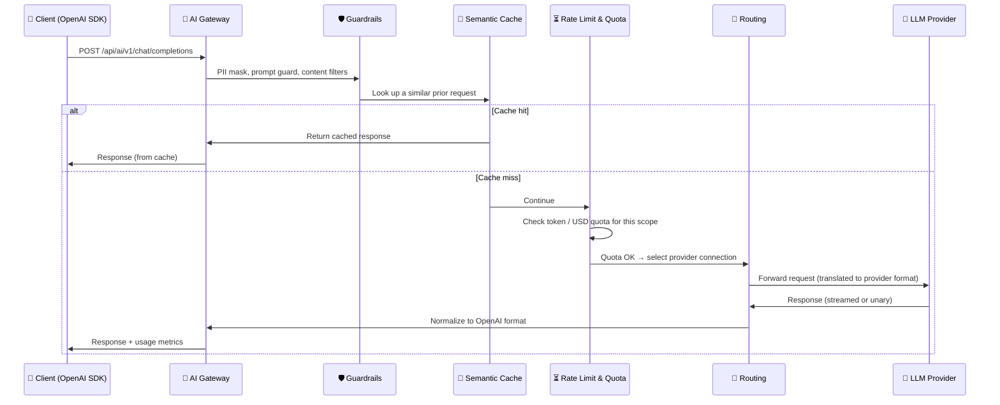

import {Card, CardGroup} from '@site/src/components/Card';
import {Steps, Step} from '@site/src/components/Steps';

## What Apinizer AI Gateway Gives You

<CardGroup cols={2}>
  <Card title="Single, OpenAI-Compatible Endpoint" icon="plug">
    Point any OpenAI SDK (or compatible client) at one `base_url` and reach every LLM provider you've connected — no per-provider integration code.
  </Card>
  <Card title="Multi-Provider Routing" icon="route">
    Route requests to OpenAI, Anthropic, Google Vertex/Gemini, AWS Bedrock, and OpenAI-compatible self-hosted engines from the same interface. Non-OpenAI responses are normalized back to the OpenAI format automatically.
  </Card>
  <Card title="Built-in Guardrails and Cost Controls" icon="shield">
    PII masking, prompt-injection guards, semantic caching, token quotas, and per-model cost tracking are available out of the box — no separate tooling to wire up.
  </Card>
  <Card title="Enterprise Visibility" icon="chart-bar">
    Usage and cost reports broken down by person, team, project, model, and deployment type (cloud vs. on-premise) give you a single source of truth for AI spend.
  </Card>
</CardGroup>

True streaming is supported end-to-end: responses are relayed to the client chunk-by-chunk as they arrive from the provider, with no artificial buffering.

:::note Streaming setting overrides the client's request flag
Each AI proxy has its own **Streaming** setting on the **AI Proxy Routing** screen. When it's off, the gateway always processes requests as a single, non-streaming response — even if the client sets `stream: true` in the request body, the gateway overrides it to `false` (and drops `stream_options`) before forwarding to the provider. This keeps token counts and cost accurate in the Traffic report regardless of what an individual client sends. When **Streaming** is on, the request is unaffected and relayed via server-sent events as described above.
:::

:::info
New to LLM terms like tokens, embeddings, or RAG? See [AI Fundamentals](/en/concepts/core-concepts/ai-fundamentals) for a primer — this page focuses on what Apinizer AI Gateway does with them.
:::

## Supported LLM Providers

- **Cloud**: OpenAI, Anthropic (Claude), Azure OpenAI, Google Vertex AI (Gemini), AWS Bedrock
- **Self-hosted**: vLLM, Ollama, Hugging Face TGI
- **Custom**: any OpenAI-compatible API endpoint

Each provider is configured once as a **connection**, with encrypted credentials and a deployment type. See [LLM Providers and Connections](/en/ai-gateway/llm-providers) for the full list and setup steps.

## Request Flow

Every request to the gateway flows through the same pipeline, whether it targets OpenAI or a self-hosted model:


```mermaid
sequenceDiagram
    participant Client as 👤 Client (OpenAI SDK)
    participant Gateway as 🚪 AI Gateway
    participant Guardrails as 🛡️ Guardrails
    participant Cache as 🧠 Semantic Cache
    participant Quota as ⏳ Rate Limit & Quota
    participant Router as 🔀 Routing
    participant Provider as 🤖 LLM Provider

    Client->>Gateway: POST /api/ai/v1/chat/completions
    Gateway->>Guardrails: PII mask, prompt guard, content filters
    Guardrails->>Cache: Look up a similar prior request

    alt Cache hit
        Cache->>Gateway: Return cached response
        Gateway->>Client: Response (from cache)
    else Cache miss
        Cache->>Quota: Continue
        Quota->>Quota: Check token / USD quota for this scope
        Quota->>Router: Quota OK → select provider connection
        Router->>Provider: Forward request (translated to provider format)
        Provider->>Router: Response (streamed or unary)
        Router->>Gateway: Normalize to OpenAI format
        Gateway->>Client: Response + usage metrics
    end
```

1. **Intake** — the request is validated and parsed as OpenAI-format JSON
2. **Guardrails** *(optional)* — PII masking, prompt-injection checks, content filters
3. **Semantic cache** *(optional)* — a similar recent request short-circuits the call and returns a cached response
4. **Rate limiting** — token and USD quotas are checked for the request's scope
5. **Routing** — a provider connection is selected based on the requested model and your routing/failover configuration
6. **Inference** — the request is translated to the provider's native format and forwarded
7. **Response** — the provider's response is normalized back to OpenAI format and streamed to the client along with usage metrics

## Deployment Type

Every provider connection is tagged **Cloud** or **On-Premise**, so usage and cost reports can distinguish provider-hosted traffic from traffic served by infrastructure you run yourself. See [LLM Providers and Connections](/en/ai-gateway/llm-providers#deployment-type) for details.

## AI Gateway vs. Classic API Proxy

An AI Gateway is **the same `ApiProxy` entity** in Apinizer — it goes through the same create/deploy/undeploy flow, the same environment management, the same proxy list, and the same endpoints as a classic API proxy. The difference is how the request is routed to the backend:

- **Classic API proxy** → the `routing` object (address list, circuit breaker, mTLS, proxy server, NTLM, etc.)
- **AI Gateway** → the `aiRouting` object (LLM provider connection, model, primary pool, conditional routing, failover chain) — see [Routing and Failover](/en/ai-gateway/routing-and-failover)

The AI Gateway runtime **never reads** the classic `routing` object, so settings tied to it don't apply to an AI Gateway.

:::warning Behavior Change
The following 12 settings endpoints (`PATCH .../apiProxies/{apiProxyName}/settings/<X>/`) now return **HTTP 400** when called on an AI Gateway. Previously they returned HTTP 200 but **had no effect at all** (a silent no-op) — that's now an explicit rejection:

`circuit-breaker` · `proxy-server` · `mtls` · `ntlm` · `connection` · `error-handling` · `custom-message` · `grpc` · `websocket` · `addresses` · `routing-status` · `metadata`

On an AI Gateway, settings like mTLS, proxy server, and circuit breaker live under `aiRouting` instead — the correct endpoint is `PUT .../apiProxies/{apiProxyName}/ai-routing/`. The `metadata` endpoint's 400 check is conditional: it only triggers when the request body sets `fixSoapApiPortType` (a field meaningful only for classic routing) — a plain metadata update keeps working on an AI Gateway.
:::

11 type-agnostic settings endpoints — CORS, cache, idempotency, XML/JSON error templates, forwarded-ip-header, spec-access-type, client-route, keys, maintenance mode, trace, and traffic log — continue to work on AI Gateways unchanged.

See [API Reference: API Proxy Settings](/api-reference/api-proxies/settings) for full details.

## Try It: OpenAI SDK Quickstart

Use Apinizer AI Gateway with the Python OpenAI SDK or any compatible client — no client-side code changes beyond `base_url` and the API key:

```python
from openai import OpenAI

client = OpenAI(
    api_key="your-apinizer-credential-key",
    base_url="https://your-apinizer-gateway.com/api/ai/v1"
)

response = client.chat.completions.create(
    model="gpt-4o",
    messages=[{"role": "user", "content": "Hello"}],
    stream=True
)

for chunk in response:
    print(chunk.choices[0].delta.content, end="")
```

:::note Request and response format
The client interface is always OpenAI-format — there is no separate Anthropic Messages or Gemini inbound format to learn. Apinizer translates each request into the target provider's native format and normalizes the response back to the OpenAI canonical format, so the same client code works against OpenAI, Anthropic, Google Vertex/Gemini, AWS Bedrock, or any OpenAI-compatible endpoint.
:::

For a full step-by-step walkthrough — connecting a provider and sending your first request — see the [AI Gateway Quickstart](/en/ai-gateway/quickstart).

## Model Discovery: GET /v1/models

The gateway serves an OpenAI-compatible model-listing endpoint at `GET /v1/models`, so `client.models.list()` in the OpenAI Python SDK — and OpenAI-compatible tooling built on it, such as LangChain and LiteLLM — can discover which models are available instead of having the model name hardcoded:

```python
models = client.models.list()
for model in models:
    print(model.id)
```

The response body:

```json
{
  "object": "list",
  "data": [
    { "id": "gpt-4o", "object": "model", "created": 0, "owned_by": "openai" },
    { "id": "claude-3-5-sonnet", "object": "model", "created": 0, "owned_by": "anthropic" }
  ]
}
```

:::info `created` is always `0`
Apinizer's model catalog carries no creation timestamp for a model — OpenAI SDKs parse the field but don't attach meaning to it. Extra catalog detail such as context window, pricing, and capabilities is **deliberately** left out of this response as well; the discovery endpoint isn't a surface for exposing that.
:::

### The List Is This Proxy's Serving Surface, Not the Provider Catalog

The response is not the LLM provider's full catalog — it's the union of models this specific AI proxy's `aiRouting` configuration can actually serve (the primary model, plus any [primary pool](/en/ai-gateway/routing-and-failover#load-balancing-across-equal-priority-primaries), [conditional routing](/en/ai-gateway/routing-and-failover#conditional-routing), and [failover chain](/en/ai-gateway/routing-and-failover#failover-chains) entries), after three elimination checks run in order:

1. A candidate whose provider connection is **not deployed or disabled** is dropped.
2. A candidate whose model id isn't in that provider connection's own allow-list (when one is configured) is dropped.
3. A candidate past its catalog **sunset date** is dropped — a model that would already fail with a 400 at request time isn't advertised here. A model merely flagged deprecated, with no sunset date reached, still appears.

An empty result is not an error: `{"object":"list","data":[]}` with HTTP 200 is a valid response when nothing survives the checks above.

This endpoint only **lists**; OpenAI's single-model retrieval endpoint (`GET /v1/models/{model_id}`, `client.models.retrieve(...)` in the SDK) is out of scope and does not match here.

### Authentication and the Normal Policy Chain Still Apply

Discovery is not a `.well-known`-style authentication-exempt path — the proxy's normal policy chain, including any auth policy and its **block anonymous requests** setting, runs on this request exactly as it does on any other, so an unauthenticated discovery call against a proxy with that setting on still gets a 401.

:::note No Upstream Call, No Metering
A discovery request never reaches an LLM provider, so no token or cost usage is recorded for it. The call still shows up in the Traffic report, but its usage and cost columns stay empty. The endpoint accepts `GET` only — any other method returns 405.
:::

## Advanced Search on the AI Proxy List

The **Advanced Search** panel on the **AI Development → AI Proxies** list adds three fields that appear only for AI proxies, alongside the classic proxy filters (name, description, path, category, environment, status):

- **AI keyword** — Free text. Matches the model identifier of the proxy's target, or the name or type of its LLM provider. Typing `openai` returns every proxy routed to an OpenAI-type provider; typing `gpt-4o` returns the proxies using that model.
- **Model type** — The modality recorded in the model catalog (Text, Vision, Audio, Embedding, Rerank, Multimodal, Image Generation). Lists the proxies that use a model of the selected type.
- **LLM Provider** — Chosen from the providers defined in your project or shared by an administrator.

The search scans **all of a proxy's routing targets**: the single primary target, the primary pool, conditional routing variants, and the provider failover chain. A proxy therefore appears in the results even when it uses the provider you searched for only in its failover chain.

:::note Combining the fields
Different fields combine with AND, but the matches need not land on the same routing entry. Selecting "Provider = OpenAI" together with "Model type = Image Generation" also lists a proxy that uses OpenAI as its primary target and an image-generation model in its failover chain. This is deliberate: pool and conditional-routing entries may leave the model field empty and inherit the primary model, and a stricter match would miss those entries.
:::

Because the filter is applied in the database query, the page count and total record count reflect the narrowed result correctly. If the provider you selected has been deleted, or belongs to a project you cannot access, the search returns no results.

## Next Steps

<CardGroup cols={2}>
  <Card title="AI Gateway Quickstart" icon="rocket" href="/en/ai-gateway/quickstart">
    Connect a provider and send your first request
  </Card>
  <Card title="LLM Providers and Connections" icon="plug" href="/en/ai-gateway/llm-providers">
    Configure provider connections and deployment types
  </Card>
  <Card title="Model Catalog and Pricing" icon="database" href="/en/ai-gateway/model-catalog">
    Bundled models, pricing, and cost tracking
  </Card>
  <Card title="Routing and Failover" icon="route" href="/en/ai-gateway/routing-and-failover">
    Failover chains, cost- and latency-aware routing
  </Card>
  <Card title="Prompt Decorator" icon="list-plus" href="/en/ai-gateway/prompt-decorator">
    Inject fixed system instructions into every request
  </Card>
  <Card title="Prompt Templates" icon="braces" href="/en/ai-gateway/prompt-templates">
    Let clients reference a reusable, parameterized prompt by name
  </Card>
  <Card title="Token Quotas and Rate Limiting" icon="gauge" href="/en/ai-gateway/token-quotas">
    Set up quota rules and monitoring
  </Card>
  <Card title="AI Cost Settings" icon="dollar-sign" href="/en/ai-gateway/cost-settings">
    Configure pricing and multi-currency display
  </Card>
  <Card title="Reports and Analytics" icon="chart-bar" href="/en/ai-gateway/reports">
    View usage and cost breakdowns
  </Card>
  <Card title="A2A Gateway" icon="share-2" href="/en/ai-gateway/a2a-gateway">
    Configure inbound/outbound Agent2Agent communication
  </Card>
  <Card title="Advanced Guardrails" icon="shield" href="/en/ai-gateway/advanced-guardrails">
    Add DLP, loop, off-topic, and oversized guards
  </Card>
  <Card title="Multi-Modal Endpoints" icon="mic" href="/en/ai-gateway/multi-modal-endpoints">
    Use audio (STT/TTS) and image generation endpoints
  </Card>
  <Card title="Tracing and Replay" icon="history" href="/en/ai-gateway/tracing-and-replay">
    Inspect the request chain in a timeline and re-execute it
  </Card>
</CardGroup>
