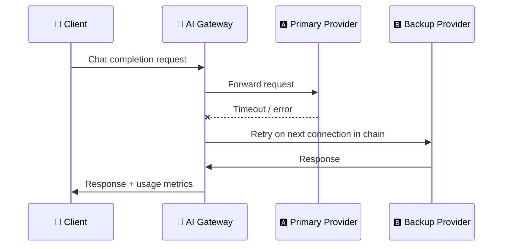

import {Card, CardGroup} from '@site/src/components/Card';

## Failover Chains

When you configure an AI proxy, you can list more than one provider connection for a model — a **primary** and one or more **backups**. If a request to the primary fails (timeout, error response, or the primary is unavailable), Apinizer automatically retries it against the next connection in the chain, without the client seeing the failure.

## Routing Strategies

<CardGroup cols={2}>
  <Card title="Sequential" icon="list">
    Always try connections in the order listed; move to the next one only on failure.
  </Card>
  <Card title="Round-Robin" icon="repeat">
    Distribute requests evenly across all connections in the chain.
  </Card>
  <Card title="Priority" icon="star">
    The primary handles all traffic; backups activate only when the primary is unavailable.
  </Card>
  <Card title="Conditional" icon="git-branch">
    Choose the next connection based on the type of failure — for example, fail over only on a rate-limit response, not on every error.
  </Card>
  <Card title="Least-Cost" icon="dollar-sign">
    Send the request to whichever candidate connection has the lowest catalog price for the requested model.
  </Card>
  <Card title="Least-Latency" icon="gauge">
    Send the request to whichever candidate connection has the lowest recently measured response latency.
  </Card>
</CardGroup>

## Cost-Aware and Latency-Aware Routing

Two of the six strategies route dynamically instead of following a fixed order:

- **Least-Cost** routing looks up each candidate connection's price in the [Model Catalog](/en/ai-gateway/model-catalog) and sends the request to the cheapest option.
- **Least-Latency** routing uses periodic health-check probes against each connection and sends the request to the fastest responder; a connection with no recent probe result is skipped for this comparison rather than blocking the request.

## Per-Leg Cost Cap

You can set a maximum cost for an individual failover leg. Before forwarding a request to a connection, Apinizer estimates its cost from the input tokens and the requested maximum output tokens, using catalog pricing. If the projected cost exceeds that leg's cap, the leg is skipped and the next one in the chain is tried. A connection whose model isn't in the pricing catalog is **not** skipped by this check — the request goes through rather than being blocked by an unknown price.

## Reliable Retries and Billing

Failover retries are billed correctly: a failed attempt against one connection is never counted against your usage or budget — only the connection that actually served the response is billed and logged.

## Tool-Call Loop (Agentic Requests)

When a model's response includes a tool call, Apinizer can dispatch it to the tools configured for the proxy and feed the result back to the model automatically, continuing the exchange until the model returns a final answer or a configurable turn limit is reached (5 turns by default). Usage and cost are tracked per turn, so multi-step tool use shows up in reports the same way a single request would.

## Next Steps

<CardGroup cols={2}>
  <Card title="LLM Providers and Connections" icon="plug" href="/en/ai-gateway/llm-providers">
    Add the connections you want to chain together
  </Card>
  <Card title="Model Catalog and Pricing" icon="database" href="/en/ai-gateway/model-catalog">
    See the pricing that cost-aware routing uses
  </Card>
  <Card title="Token Quotas and Rate Limiting" icon="gauge" href="/en/ai-gateway/token-quotas">
    Cap spend alongside per-leg cost caps
  </Card>
  <Card title="Reports and Analytics" icon="chart-bar" href="/en/ai-gateway/reports">
    Monitor failover activity and cost
  </Card>
</CardGroup>
