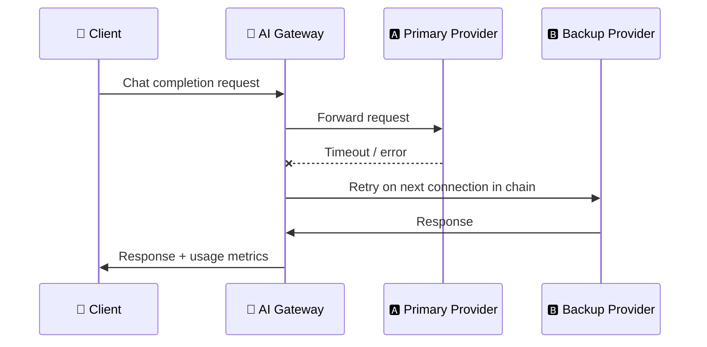

import {Card, CardGroup} from '@site/src/components/Card';

## How the AI Routing Screen Is Organized

The AI Routing tab lays out an AI Gateway's configuration as a decision chain that mirrors the order a request is actually evaluated in. A summary band at the top of the screen — **Request → Conditional Gate → Target Selection → Failover → Provider** — is clickable: selecting a step scrolls the screen to the matching section and highlights which stage the current configuration is in.

Wherever a step resolves to a specific provider and model — a conditional route, a load-balancing pool entry, the primary itself, or a failover chain entry — an expandable row shows the same **model metadata panel**: the provider's endpoint, deployment type, and live health status; the model's context window, max output tokens, and per-million-token pricing (input, output, cached); and a deprecation warning with sunset date when the model is scheduled for retirement. This standard panel appears at every selection point, so you can check a model's limits and pricing without leaving the screen.

:::warning A Default Target Is Always Required
Every AI Gateway needs a provider and model selected as its **default target**, even when you intend all traffic to be steered by conditional routes or a load-balancing pool. The gateway resolves the default target *before* it evaluates any route or pool; it is what a request falls back to when no conditional route matches, and a route or pool entry that leaves its own provider or model blank inherits it. Saving a proxy without one is rejected with *"Select an LLM provider and model on the AI Routing tab."*

You do not normally set it by hand. Adding the first load-balancing pool entry — or the first conditional route that names both a provider and a model — fills the default target from that entry while it is still empty. The resulting target is shown in the read-only **Default Target** table on the routing screen.
:::

## Conditional Routing

A **Conditional Route** overrides the primary provider and model for requests that match a rule, a semantic pattern, or both — evaluated before the primary or the load-balancing pool. Routes are evaluated in order and the first match wins; if a matching route leaves its provider or model blank, it inherits the primary's. If no route matches, routing falls through to the load-balancing pool or the single primary as usual.

| Field | Description |
|---|---|
| **Route Name** | A label for the route, shown in the routing screen's summary table (for example, "Code questions → DeepSeek"). |
| **Condition** | A rule built from Apinizer's condition editor. Left empty, the route always matches on the rule side. |
| **Target Provider · Model** | The provider connection and model this route sends matching requests to. Leave either blank to inherit the primary's value. |

### Semantic Matching

In addition to (or instead of) a rule, a route can match by **meaning**: define a list of example utterances that represent the route's intent, and Apinizer embeds the incoming prompt and compares it against them by cosine similarity.

- **Similarity Threshold** — the minimum cosine similarity an utterance must reach for the route to match. Default `0.75`.
- **Embedding Provider and Model** — configured once per proxy and shared by every route's utterance list; the inbound prompt is embedded **once per request**, not once per route.
- **Rule + Semantic Combined** — when a route defines both a condition and utterances, **both must match (AND)**: the rule is checked first, and semantic evaluation only runs once the rule has already passed.
- **No Route Matches** — if none of the conditional routes match, the request falls through to the load-balancing pool or the single primary; this is expected behavior, not an error.
- **No Embedding Provider Configured** — a route cannot carry utterances unless the proxy also has a semantic embedding provider selected. Saving is rejected with *"A conditional route uses semantic utterances, so the AI Routing tab must also have an embedding provider."* Earlier versions saved such a proxy successfully and then evaluated every semantic route on its rule alone, with no signal on screen. Once a provider *is* selected, request-time behavior is unchanged and deliberately fail-open: if the provider is unreachable, the route is treated as "not matched" and routing continues.

### Environment Variables in Routing Text

The utterances that drive semantic matching, and the header name the affinity strategies read their key from, both accept an [environment variable](/en/develop/environment-variables) reference in `${VARIABLE_NAME}` form, so one routing configuration can carry per-environment wording or header naming.

:::note
Utterance resolution happens once, when the route's embeddings are first built and cached — not per request. That is why only `${...}` environment variables are accepted here and `#{...}` context variables are not: a per-request value would be embedded on the first request and those same vectors would then be served to every later one.
:::

## Failover Chains

When you configure an AI Gateway, you can list more than one provider connection for a model — a **primary** and one or more **backups**. If a request to the primary fails (timeout, error response, or the primary is unavailable), Apinizer automatically retries it against the next connection in the chain, without the client seeing the failure.

```mermaid
sequenceDiagram
    participant Client as 👤 Client
    participant Gateway as 🚪 AI Gateway
    participant Primary as 🅰️ Primary Provider
    participant Backup as 🅱️ Backup Provider

    Client->>Gateway: Chat completion request
    Gateway->>Primary: Forward request
    Primary--xGateway: Timeout / error
    Gateway->>Backup: Retry on next connection in chain
    Backup->>Gateway: Response
    Gateway->>Client: Response + usage metrics
```

## Load Balancing Across Equal-Priority Primaries

Instead of a single primary connection, you can define a **pool** of equal-priority primaries and let Apinizer choose which one handles each request. This choice is made once, before the request is attempted — a different, earlier stage than the failover chain below, which only activates once the chosen primary has already failed. A pool member that isn't selected still becomes a failover sibling, tried ahead of the explicit Provider Failover Chain if the selected member fails.

Configure the pool from **Target Selection → Load Balancing** on the routing screen. Seven algorithms are available:

Every pool entry must name a provider. Its model is optional and inherits the default target's model when left blank — the same rule applies to failover chain entries. An entry with no provider is skipped by the gateway at request time, so saving one is rejected rather than left on screen as configuration that never runs.

<CardGroup cols={2}>
  <Card title="Round Robin" icon="repeat">
    Distributes requests evenly across the pool, in turn.
  </Card>
  <Card title="Weighted" icon="scale">
    Distributes requests proportionally to a configured weight per pool member — a higher weight receives more traffic.
  </Card>
  <Card title="Random" icon="shuffle">
    Picks a pool member at random for each request.
  </Card>
  <Card title="Least Recently Used (LRU)" icon="history">
    Sends the request to whichever member has gone the longest without being selected.
  </Card>
  <Card title="Least Cost" icon="dollar-sign">
    Picks the member whose model has the lowest catalog price, weighted as input price + output price × the configurable output ratio (default `0.25`, reflecting that a typical chat workload generates far more input tokens than output). A member with no catalog price is excluded from the comparison; if none of the pool has a known price, the pool falls back to Round Robin.
  </Card>
  <Card title="Least Latency" icon="gauge">
    Picks the fastest-responding member. The signal is prioritized: real traffic (an exponentially-weighted moving average of measured time-to-first-token for streaming requests, or total latency for unary requests) is used whenever at least one member has a recent sample; otherwise Apinizer falls back to the periodic health-check probe; with no signal at all, it falls back to Round Robin.
  </Card>
  <Card title="Prefix Affinity (Sticky)" icon="link">
    Routes the same conversation to the same pool member every time, to keep that member's prompt/KV cache warm on a self-hosted LLM farm (vLLM, SGLang, Ollama). The affinity key is the value of a configurable request header (default `session_id`) when present, otherwise a hash of the system message plus the first user message; if neither is available, falls back to Round Robin.
  </Card>
</CardGroup>

:::warning Do not combine Prefix Affinity with a cache-aware upstream router
If the pool members sit behind a layer that already makes its own KV-cache routing decision — such as llm-d or a GKE Inference Gateway — do not select Prefix Affinity. Pinning requests from Apinizer's side conflicts with that layer's own decision.
:::

**Least Cost** and **Least Latency** only take effect with **2 or more** pool members; with fewer, the pool silently uses Round Robin instead (the routing screen shows a warning when this applies to the current configuration).

**Bounded-load protection**: for Prefix Affinity, if the target member's current load exceeds the pool average by more than the configurable **Bounded Load Factor** (default `1.25`), the request shifts to the next member instead — this keeps one popular conversation from overloading a single pool member.

## Routing Strategies

These strategies control how Apinizer iterates the **Provider Failover Chain** once the active primary — whether a single primary or one selected from the pool above — has failed:

<CardGroup cols={2}>
  <Card title="Sequential" icon="list">
    Always try connections in the order listed; move to the next one only on failure.
  </Card>
  <Card title="Round-Robin" icon="repeat">
    Distribute requests evenly across all connections in the chain.
  </Card>
  <Card title="Priority" icon="star">
    The primary handles all traffic; backups activate only when the primary is unavailable.
  </Card>
  <Card title="Conditional" icon="git-branch">
    Choose the next connection based on the type of failure — for example, fail over only on a rate-limit response, not on every error.
  </Card>
</CardGroup>

:::note Looking for cost- or latency-based selection?
That's **Least Cost** and **Least Latency** — two of the seven algorithms available for [load balancing across a pool of equal-priority primaries](#load-balancing-across-equal-priority-primaries) above, not a Provider Failover Chain strategy. The chain above only runs after a primary has already failed.
:::

## Per-Leg Cost Cap

You can set a maximum cost for an individual failover leg. Before forwarding a request to a connection, Apinizer estimates its cost from the input tokens and the requested maximum output tokens, using catalog pricing. If the projected cost exceeds that leg's cap, the leg is skipped and the next one in the chain is tried. A connection whose model isn't in the pricing catalog is **not** skipped by this check — the request goes through rather than being blocked by an unknown price.

## Reliable Retries and Billing

Failover retries are billed correctly: a failed attempt against one connection is never counted against your usage or budget — only the connection that actually served the response is billed and logged.

## Tool-Call Loop (Agentic Requests)

When a model's response includes a tool call, Apinizer can dispatch it to the tools configured for the proxy and feed the result back to the model automatically, continuing the exchange until the model returns a final answer or a configurable turn limit is reached (5 turns by default). Usage and cost are tracked per turn, so multi-step tool use shows up in reports the same way a single request would.

## Endpoints Panel

Below the decision-chain sections, the AI Routing tab lists an **Endpoints** panel: one row for every environment configured in the installation, showing the data-plane address to call in that environment, with a copy icon next to it.

:::warning Rows are not filtered by deployment status
The panel lists every environment defined in the installation, not just the ones the proxy has actually been deployed to. Running **Test** against a row for an environment the proxy hasn't been deployed to returns an error from the gateway — the proxy isn't running there to answer the request.
:::

Each row also has a **Test** button that opens the [Test Console](/en/develop/test-debug-tools/test-console) pre-filled with a ready-to-send request against that row's address: `POST` to the address with `/v1/chat/completions` appended, and a JSON body containing the proxy's primary route model, a single `ping` user message, and `max_tokens: 16`.

:::warning This test call reaches your real LLM provider
Sending the pre-filled request from a row's **Test** button goes to the actual configured LLM provider, the same way a real client request would — and consumes cost/quota accordingly. `max_tokens` is kept at 16 to keep a test call cheap, but it is not free, and a cost/quota warning is shown both on the panel and in the test dialog.
:::

The panel is hidden when the proxy is embedded in an A2A agent (its traffic doesn't go through `/v1/chat/completions`), and the **Test** button is disabled unless you hold manage permission on the proxy.

Testing a streaming response, a token/cost summary for the test call, and ready-made request templates for embedding, audio, or image requests are not covered by this panel — use a full API client for those.

## Next Steps

<CardGroup cols={2}>
  <Card title="LLM Providers and Connections" icon="plug" href="/en/ai-gateway/llm-providers">
    Add the connections you want to chain together
  </Card>
  <Card title="Model Catalog and Pricing" icon="database" href="/en/ai-gateway/model-catalog">
    See the pricing that cost-aware routing uses
  </Card>
  <Card title="Token Quotas and Rate Limiting" icon="gauge" href="/en/ai-gateway/token-quotas">
    Cap spend alongside per-leg cost caps
  </Card>
  <Card title="Reports and Analytics" icon="chart-bar" href="/en/ai-gateway/reports">
    Monitor failover activity and cost
  </Card>
</CardGroup>
