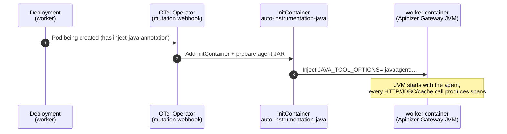
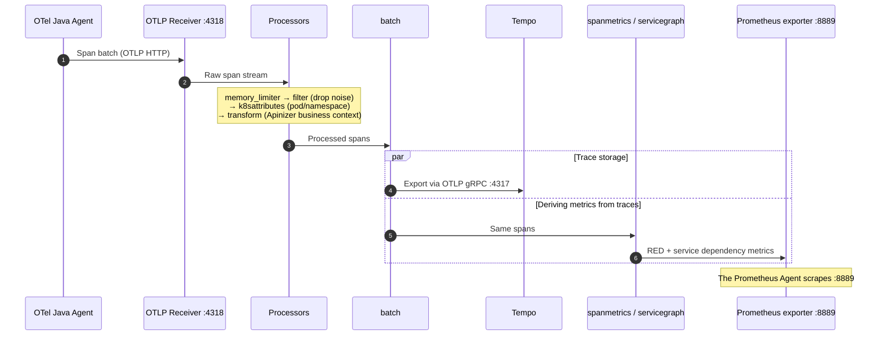

import {Card, CardGroup} from '@site/src/components/Card';
import {Steps, Step} from '@site/src/components/Steps';
import {Accordion, AccordionGroup} from '@site/src/components/Accordion';
import {Frame} from '@site/src/components/Frame';

:::info About the Series
This is the first part of a four-part series on the Apinizer API Gateway and OpenTelemetry. In this part we'll walk through the architecture, setup, and verification of the integration together.

1. **OpenTelemetry Apinizer API Gateway integration:** architecture, setup, verification (this part)
2. **Three Grafana dashboards:** APM/RED, Collector Health, Tempo Ops
3. **SLI/SLO definitions:** error budget and alerting
4. **Service graph:** trace/metric/log correlation
:::

## Why Observability, Why OpenTelemetry?

You probably know this scenario: an alert fires, p95 latency has jumped to 800 ms. You look at the dashboard; yes, something is slow. But *where*? Did the upstream slow down, is the cache missing, or is the gateway itself the problem? Classic monitoring can't answer that question, because it only collects metrics: "requests per second", "error rate percentage", "p95 latency in ms". This data tells you that a problem exists, but not where it is.

An API Gateway is the most critical point traffic passes through: every request goes through it, and every slowdown or error becomes visible there first. OpenTelemetry (OTel) closes exactly this gap with distributed tracing. It is the vendor-neutral observability standard under the CNCF umbrella: with a single standard it collects three signals (traces, metrics, logs) and carries them to any backend you choose.

<CardGroup cols={2}>
  <Card title="Instrumentation without code changes" icon="magic">
    The OpenTelemetry Operator injects a Java agent into the gateway pod. Incoming requests, upstream calls, cache accesses, and database queries all turn into spans automatically, without writing a single line of code.
  </Card>
  <Card title="Vendor independence" icon="unlock">
    Telemetry data is not locked to a single product. You can use Tempo + Prometheus today and switch to a different backend tomorrow; the agent and Collector layers stay the same.
  </Card>
  <Card title="CNCF standard (OTLP)" icon="certificate">
    The OTLP protocol, W3C Trace Context propagation, and semantic conventions are widely accepted across the industry. They provide a common observability language across teams.
  </Card>
  <Card title="Trace-to-metric bridge" icon="exchange-alt">
    The Collector generates RED metrics (Rate, Errors, Duration) and a service dependency graph from trace data, reducing the need for a separate APM tool.
  </Card>
</CardGroup>

:::note Apinizer's native metrics and OpenTelemetry complement each other
The Apinizer gateway continues to expose its own business metrics on port `:9091` (request count, error rate, API proxy labels). OpenTelemetry makes the steps within a request (upstream call, cache access, DB query) visible at span level. In this integration the Collector gathers both sources; they work as complements, not replacements.
:::

## What Is a Trace and Why Does It Matter?

Metrics answer "how much?". Traces answer "why is it slow?" and "at which step did it break?". A trace is the complete record of a single request's journey through the system; each step in that journey is a span.

| Concept | Meaning | Example |
| --- | --- | --- |
| **Trace** | End-to-end record of a single request | One API call's journey through gateway → cache → upstream |
| **Span** | A single step within a trace | The SERVER span for `GET /orders`, the CLIENT span to upstream |
| **Trace ID** | Identifier linking all spans | The 32-character value in the `traceparent` header |
| **Context propagation** | Carrying the Trace ID across steps | The `traceparent` header sent from gateway to upstream |
| **Attribute** | Key-value pair on a span | `apinizer.correlation_id`, `http.status_code`, `peer.service` |

Without traces you only see "p95 latency is 800 ms". With traces you see on one screen where those 800 ms went: 650 ms to upstream, 100 ms to a cache miss, 50 ms to the gateway pipeline. This breakdown cuts root cause analysis (RCA) time from hours to minutes.

<Frame caption="Span breakdown of a single request: how the 800 ms of latency is distributed on the timeline">
  
</Frame>

All of the spans above are linked under the same Trace ID; that is how you see the latency breakdown on a single waterfall.

## How OpenTelemetry Actually Works

We can think of OpenTelemetry as three layers with clearly separated responsibilities. This separation keeps the "data producer" and "data storage" sides independent; that is exactly what enables true vendor independence.

<Frame caption="The three layers of OpenTelemetry: instrumentation, collection/processing, and storage/visualization">
  
</Frame>

OpenTelemetry produces three signals:

- **Traces:** the request journey (the focus of this article)
- **Metrics:** time-series numeric data (RED, JVM, Apinizer native metrics)
- **Logs:** structured log records (disabled in this setup; no separate log backend is used)

These signals are carried over OTLP (OpenTelemetry Protocol). Standard ports: `:4318` for HTTP, `:4317` for gRPC.

The Collector is the heart of the architecture, a processing pipeline made of four component types:

| Component | Role |
| --- | --- |
| **Receiver** | Ingests data (spans arriving over OTLP, scraped Prometheus metrics) |
| **Processor** | Transforms data (noise filtering, adding k8s labels, business-context enrichment, batching) |
| **Connector** | Produces one signal from another (trace-to-metric: `spanmetrics`, `servicegraph`) |
| **Exporter** | Writes data out (traces to Tempo, Prometheus metrics on port `:8889`) |

## The Big Picture: The Apinizer Integration Architecture

The diagram below shows the full path a request takes from entering the gateway to reaching Tempo and the central Prometheus. The namespace the gateway runs in varies by environment; we denote it as `<worker-namespace>` in the diagram and commands.

<Frame caption="Apinizer OpenTelemetry integration architecture: trace and metric pipelines">
  
</Frame>

The data travels along two separate pipelines and meets in Grafana:

- **Trace pipeline:** Gateway → Java agent → OTLP → Collector → Tempo → Grafana (Explore)
- **Metric pipeline:** Gateway native `:9091` and trace-derived metrics → Collector `:8889` → Prometheus Agent (scrape) → `remote_write` → Central Prometheus → Grafana

### Who Does What?

| Component | Namespace | Role |
| --- | --- | --- |
| **OTel Operator** | `monitoring` | Reads the Instrumentation CR and injects a Java agent init container into the gateway deployment |
| **OTel Java Agent** | `<worker-namespace>` (worker pod) | Turns HTTP/JDBC/cache calls into spans without changing gateway code |
| **OTel Collector** | `monitoring` | Processes spans and writes them to Tempo; derives RED/service-graph metrics from traces; collects native `:9091` metrics; publishes all on `:8889` |
| **Tempo** | `monitoring` | Trace store (WAL + blocks); the trace source for Grafana Explore |
| **Prometheus Agent** | `monitoring` | Scrapes the Collector's `:8889` and forwards via `remote_write` to the central Prometheus (keeps no local TSDB) |
| **Central Prometheus** | Central/remote | Metric TSDB; the `remote_write` receiver; Grafana's metric source |
| **Grafana** | Central/remote | Visualizes traces (Tempo) and metrics (Prometheus) |

### How Does the Agent Get into the Gateway Pod?

Here's the nice part: the OpenTelemetry Operator does not even add a separate sidecar container next to the gateway. Instead, it injects an init container that runs before the pod starts. This init container writes the agent JAR to a shared volume and passes the required JVM settings to the worker container.



So what triggers this whole mechanism? A single annotation on the deployment's pod template:

```yaml
metadata:
  annotations:
    instrumentation.opentelemetry.io/inject-java: "apinizer-instr"
```

:::warning
The annotation must live under `spec.template.metadata.annotations`. If you write it in the deployment's top-level `metadata`, the webhook will not mutate the pod and the agent will not be injected.
:::

### What Does a Span Go Through inside the Collector?

Every span leaving the gateway passes through the Collector's traces pipeline. The diagram below shows a single span's journey from the receiver to Tempo and to the derived metrics.



The role of each processor in the traces pipeline:

| Processor | What does it do? | Why is it needed in Apinizer? |
| --- | --- | --- |
| `memory_limiter` | Protects Collector memory, prevents OOM | Under load the gateway can produce thousands of spans/second |
| `filter/drop_mongo_polling` | Drops MongoDB polling and management endpoint spans | Reduces noise; lets you focus on real API traffic |
| `k8sattributes` | Adds pod, namespace, node, deployment labels | You can see which pod is slow from the trace |
| `resourcedetection` | Adds host/OS info | Environment-based filtering |
| `transform/apinizer-traces` | Writes Apinizer business context into span attributes | Correlation ID, API proxy name, upstream address |
| `batch` | Groups spans and sends in bulk | Reduces network overhead, efficient writes to Tempo |

Connectors generate metrics within the same Collector without exporting spans externally:

- **`spanmetrics`:** derives request count, error count, and a duration histogram (RED metrics) from each span.
- **`servicegraph`:** derives service dependency metrics from CLIENT→SERVER span relationships; Grafana Service Graph uses these.

## Before We Start

Here's what we need in place before diving in:

<CardGroup cols={2}>
  <Card title="Kubernetes cluster" icon="server">
    A cluster where you can use `kubectl` and `helm` with admin access.
  </Card>
  <Card title="Apinizer Gateway" icon="network-wired">
    A gateway (worker) deployment running in a namespace.
  </Card>
  <Card title="Central Prometheus & Grafana" icon="chart-line">
    A central Prometheus with the remote-write receiver enabled, and a Grafana connected to it.
  </Card>
  <Card title="Storage" icon="database">
    A static PV/PVC or a StorageClass for Tempo.
  </Card>
</CardGroup>

:::tip Namespace naming
We install the observability components into the `monitoring` namespace. The gateway runs in its own namespace, which we denote as `<worker-namespace>` in the commands. Don't forget to replace this value with your own gateway namespace as you go.
:::

## Let's Build It

Enough theory; time to get our hands dirty. We'll bring the whole chain up in seven steps.

<Steps>
  <Step title="First, the monitoring namespace">

```bash
kubectl create namespace monitoring
```

  </Step>
  <Step title="The OpenTelemetry Operator (via Helm)">

No cert-manager in the cluster? No problem: we can let Helm generate the webhook certificate itself:

```bash
helm repo add open-telemetry https://open-telemetry.github.io/opentelemetry-helm-charts
helm repo update

helm install opentelemetry-operator open-telemetry/opentelemetry-operator \
  --namespace monitoring \
  --set admissionWebhooks.certManager.enabled=false \
  --set admissionWebhooks.autoGenerateCert.enabled=true \
  --set admissionWebhooks.autoGenerateCert.recreate=true
```

Then we wait until the operator pod is `Running` and the CRDs show up:

```bash
kubectl get pods -n monitoring -l app.kubernetes.io/name=opentelemetry-operator
kubectl get crd | grep opentelemetry
```

  </Step>
  <Step title="Tempo is next">

Tempo stores traces on a persistent disk. The manifest below uses a static PV/PVC and solves the `hostPath` permission issue up front with an initContainer (more on that in the problems section at the end).

<Accordion title="tempo.yaml (full manifest)">

```yaml
apiVersion: v1
kind: PersistentVolume
metadata:
  name: tempo-pv
spec:
  capacity:
    storage: 5Gi
  accessModes: [ReadWriteOnce]
  persistentVolumeReclaimPolicy: Retain
  storageClassName: ""
  hostPath:
    path: /data/tempo
---
apiVersion: v1
kind: PersistentVolumeClaim
metadata:
  name: tempo-pvc
  namespace: monitoring
spec:
  accessModes: [ReadWriteOnce]
  storageClassName: ""
  resources:
    requests:
      storage: 5Gi
  volumeName: tempo-pv
---
apiVersion: v1
kind: ConfigMap
metadata:
  name: tempo-config
  namespace: monitoring
data:
  tempo.yaml: |
    server:
      http_listen_port: 3200
      grpc_listen_port: 9095
    distributor:
      receivers:
        otlp:
          protocols:
            grpc:
              endpoint: 0.0.0.0:4317
            http:
              endpoint: 0.0.0.0:4318
    ingester:
      max_block_duration: 5m
    compactor:
      compaction:
        block_retention: 48h
    storage:
      trace:
        backend: local
        wal:
          path: /var/tempo/wal
        local:
          path: /var/tempo/blocks
    usage_report:
      reporting_enabled: false
---
apiVersion: apps/v1
kind: Deployment
metadata:
  name: tempo
  namespace: monitoring
  labels: { app: tempo }
spec:
  replicas: 1
  strategy:
    type: Recreate
  selector:
    matchLabels: { app: tempo }
  template:
    metadata:
      labels: { app: tempo }
    spec:
      securityContext:
        fsGroup: 10001
        runAsUser: 10001
        runAsGroup: 10001
      initContainers:
        - name: init-chown
          image: busybox:1.36
          command:
            - sh
            - -c
            - mkdir -p /var/tempo/wal /var/tempo/blocks && chown -R 10001:10001 /var/tempo
          securityContext:
            runAsUser: 0
          volumeMounts:
            - { name: storage, mountPath: /var/tempo }
      containers:
        - name: tempo
          image: grafana/tempo:2.7.1
          args: ["-config.file=/etc/tempo/tempo.yaml"]
          ports:
            - { containerPort: 3200, name: http }
            - { containerPort: 4317, name: otlp-grpc }
            - { containerPort: 4318, name: otlp-http }
          volumeMounts:
            - { name: config, mountPath: /etc/tempo }
            - { name: storage, mountPath: /var/tempo }
      volumes:
        - name: config
          configMap: { name: tempo-config }
        - name: storage
          persistentVolumeClaim:
            claimName: tempo-pvc
---
apiVersion: v1
kind: Service
metadata:
  name: tempo
  namespace: monitoring
  labels: { app: tempo }
spec:
  selector: { app: tempo }
  ports:
    - { name: http, port: 3200, targetPort: 3200 }
    - { name: otlp-grpc, port: 4317, targetPort: 4317 }
    - { name: otlp-http, port: 4318, targetPort: 4318 }
```

</Accordion>

```bash
kubectl apply -f tempo.yaml
kubectl get pvc -n monitoring
kubectl get pods -n monitoring -l app=tempo
```

  </Step>
  <Step title="The heart of it all: the OpenTelemetry Collector">

The Collector is the busiest piece of this setup: it processes the spans coming from the gateway, enriches them with business context, writes traces to Tempo, derives RED/service-graph metrics from spans, and collects the gateway's native `:9091` metrics, publishing everything on port `:8889` for Prometheus.

<Accordion title="otel-collector.yaml (full manifest)">

```yaml
apiVersion: opentelemetry.io/v1beta1
kind: OpenTelemetryCollector
metadata:
  name: otel
  namespace: monitoring
spec:
  image: ghcr.io/open-telemetry/opentelemetry-collector-releases/opentelemetry-collector-contrib:0.153.0
  mode: deployment
  replicas: 1
  config:
    connectors:
      servicegraph:
        dimensions: [server.address, http.request.method]
        latency_histogram_buckets: [10ms, 50ms, 100ms, 250ms, 1s, 5s]
      spanmetrics:
        dimensions:
          - name: apinizer.apiproxy.name
          - name: server.address
          - name: peer.service
          - name: apinizer.span.role
          - name: http.request.method
        exemplars: { enabled: true }
        histogram:
          explicit:
            buckets: [10ms, 25ms, 50ms, 100ms, 250ms, 500ms, 1s, 2s, 5s]
        metrics_flush_interval: 15s
        namespace: apinizer.trace
    receivers:
      otlp:
        protocols:
          grpc: { endpoint: 0.0.0.0:4317 }
          http: { endpoint: 0.0.0.0:4318 }
      prometheus/apinizer-native:
        config:
          scrape_configs:
            - job_name: apinizer-worker-native
              scrape_interval: 15s
              kubernetes_sd_configs:
                - role: pod
                  namespaces:
                    names: [<worker-namespace>]
              relabel_configs:
                - action: keep
                  regex: "9091"
                  source_labels: [__meta_kubernetes_pod_container_port_number]
                - source_labels: [__meta_kubernetes_namespace]
                  target_label: k8s_namespace
                - source_labels: [__meta_kubernetes_pod_name]
                  target_label: k8s_pod
    processors:
      batch: { send_batch_size: 1024, timeout: 5s }
      memory_limiter: { check_interval: 1s, limit_percentage: 80, spike_limit_percentage: 25 }
      resourcedetection: { detectors: [env, system], timeout: 5s }
      k8sattributes:
        auth_type: serviceAccount
        extract:
          metadata: [k8s.namespace.name, k8s.pod.name, k8s.node.name, k8s.deployment.name]
      filter/drop_mongo_polling:
        error_mode: ignore
        traces:
          span:
            - IsRootSpan() and (attributes["db.system"] == "mongodb" or attributes["db.system.name"] == "mongodb")
            - IsMatch(attributes["http.route"], "^/apinizer/management")
      transform/apinizer-traces:
        error_mode: ignore
        trace_statements:
          - context: span
            statements:
              - set(attributes["apinizer.correlation_id"], attributes["http.response.header.apinizer-correlation-id"][0]) where attributes["http.response.header.apinizer-correlation-id"] != nil
              - set(attributes["apinizer.correlation_id"], attributes["http.request.header.apinizer-correlation-id"][0]) where attributes["apinizer.correlation_id"] == nil and attributes["http.request.header.apinizer-correlation-id"] != nil
              - set(attributes["apinizer.correlation_id"], attributes["http.response.header.apinizer_correlation_id"][0]) where attributes["apinizer.correlation_id"] == nil and attributes["http.response.header.apinizer_correlation_id"] != nil
              - set(attributes["apinizer.apiproxy.name"], attributes["http.response.header.x-apinizer-apiproxy-name"][0]) where attributes["http.response.header.x-apinizer-apiproxy-name"] != nil
              - set(attributes["apinizer.apiproxy.path"], attributes["url.path"]) where attributes["url.path"] != nil
              - set(attributes["apinizer.routing.address"], attributes["url.full"]) where kind == SPAN_KIND_CLIENT and attributes["url.full"] != nil
              - set(attributes["peer.service"], attributes["server.address"]) where kind == SPAN_KIND_CLIENT and attributes["server.address"] != nil
              - set(attributes["apinizer.span.role"], "elasticsearch-logging") where kind == SPAN_KIND_CLIENT and IsMatch(attributes["server.address"], ".*(elastic|9200).*")
              - set(attributes["apinizer.span.role"], "upstream-routing") where kind == SPAN_KIND_CLIENT and attributes["apinizer.span.role"] == nil
    exporters:
      debug: { verbosity: basic }
      otlp/tempo:
        endpoint: tempo.monitoring.svc.cluster.local:4317
        tls: { insecure: true }
      prometheus:
        enable_open_metrics: true
        endpoint: 0.0.0.0:8889
        resource_to_telemetry_conversion: { enabled: true }
    service:
      telemetry:
        logs: { level: info }
        metrics:
          readers:
            - pull:
                exporter:
                  prometheus: { host: 0.0.0.0, port: 8888 }
      pipelines:
        traces:
          receivers: [otlp]
          processors: [memory_limiter, filter/drop_mongo_polling, k8sattributes, resourcedetection, transform/apinizer-traces, batch]
          exporters: [otlp/tempo, spanmetrics, servicegraph]
        metrics:
          receivers: [otlp, prometheus/apinizer-native, spanmetrics, servicegraph]
          processors: [memory_limiter, batch]
          exporters: [prometheus]
```

</Accordion>

:::note
Don't forget to set the `namespaces.names` field of the `prometheus/apinizer-native` receiver to your gateway's namespace (`<worker-namespace>`). The operator creates a service named `otel-collector` from this manifest; the agent and Prometheus Agent will connect to it.
:::

```bash
kubectl apply -f otel-collector.yaml
kubectl get pods -n monitoring -l app.kubernetes.io/name=otel-collector
```

  </Step>
  <Step title="The Instrumentation CR">

This resource tells the agent where to send telemetry. We use the OTLP HTTP port `4318` and disable the log signal (avoiding unnecessary 404 noise up front, since there is no log backend). We create the CR in the gateway's namespace.

```yaml
# instrumentation.yaml
apiVersion: opentelemetry.io/v1alpha1
kind: Instrumentation
metadata:
  name: apinizer-instr
  namespace: <worker-namespace>
spec:
  exporter:
    endpoint: http://otel-collector.monitoring.svc.cluster.local:4318
  propagators: [tracecontext, baggage]
  sampler:
    type: parentbased_traceidratio
    argument: "1"
  env:
    - name: OTEL_LOGS_EXPORTER
      value: "none"
```

```bash
kubectl apply -f instrumentation.yaml
kubectl get instrumentation -n <worker-namespace>
```

:::warning The traceparent header is also added to requests going to your backends
Once the agent is active, you will see a header like this on the gateway's outgoing calls:

```text
traceparent: 00-062ad6a79d1b48e4372ac9a5c042e8e7-c3feb0b529b5ed40-03
```

This comes from the `propagators: [tracecontext, baggage]` setting in the Instrumentation CR and is the W3C Trace Context standard itself. Its purpose is context propagation: carrying the trace ID to the upstream, so that if the backend is also instrumented, its spans join the gateway's trace under the same record. The format reads as `version-traceId-parentSpanId-flags`; the last part carries flags such as sampling.

If the backend is not instrumented, the header is harmless and usually ignored. Still, be careful: services with strict header validation, WAFs/proxies enforcing header whitelists, or legacy services that include headers in signature calculations may reject the request because of this unexpected header. If you run into this, narrow the `propagators` list or strip the header with a gateway policy on requests going to the affected backend.
:::

  </Step>
  <Step title="The injection annotation on the gateway">

All it takes to trigger agent injection is adding the annotation to the deployment's pod template:

```bash
kubectl patch deployment worker -n <worker-namespace> --type merge -p \
'{"spec":{"template":{"metadata":{"annotations":{"instrumentation.opentelemetry.io/inject-java":"apinizer-instr"}}}}}'

kubectl rollout status deployment worker -n <worker-namespace>
```

:::warning
The annotation must live under `spec.template.metadata.annotations`; if you place it in the deployment's top-level `metadata`, injection will not happen.
:::

  </Step>
  <Step title="The last link: the Prometheus Agent (with a ServiceMonitor)">

To forward gateway metrics to a central Prometheus without storing them locally, we run Prometheus in agent mode. We do target discovery declaratively with a `ServiceMonitor` rather than `scrape_configs`; this requires the Prometheus Operator's CRDs. If `kube-prometheus-stack` is installed in your cluster, these CRDs already exist; otherwise you'll need to install the Prometheus Operator separately.

First, the service account and RBAC for the agent:

<Accordion title="prometheus-agent-rbac.yaml">

```yaml
apiVersion: v1
kind: ServiceAccount
metadata:
  name: prometheus-agent
  namespace: monitoring
---
apiVersion: rbac.authorization.k8s.io/v1
kind: ClusterRole
metadata:
  name: prometheus-agent
rules:
  - apiGroups: [""]
    resources: [nodes, nodes/metrics, services, endpoints, pods]
    verbs: [get, list, watch]
  - nonResourceURLs: ["/metrics"]
    verbs: [get]
---
apiVersion: rbac.authorization.k8s.io/v1
kind: ClusterRoleBinding
metadata:
  name: prometheus-agent
roleRef:
  apiGroup: rbac.authorization.k8s.io
  kind: ClusterRole
  name: prometheus-agent
subjects:
  - kind: ServiceAccount
    name: prometheus-agent
    namespace: monitoring
```

</Accordion>

Then the PrometheusAgent CR and the ServiceMonitor that discovers the Collector:

```yaml
# prometheus-agent.yaml
apiVersion: monitoring.coreos.com/v1alpha1
kind: PrometheusAgent
metadata:
  name: gateway-agent
  namespace: monitoring
spec:
  replicas: 1
  serviceAccountName: prometheus-agent
  externalLabels:
    cluster: apinizer-gw          # to distinguish this cluster in the central Prometheus
  serviceMonitorSelector:
    matchLabels:
      release: gateway-agent      # the ServiceMonitor below matches this label
  remoteWrite:
    - url: http://<central-prometheus-host>:9090/api/v1/write
      # if needed:
      # basicAuth: { username: {...}, password: {...} }
---
apiVersion: monitoring.coreos.com/v1
kind: ServiceMonitor
metadata:
  name: otel-collector
  namespace: monitoring
  labels:
    release: gateway-agent
spec:
  namespaceSelector:
    matchNames: [monitoring]
  selector:
    matchLabels:
      app.kubernetes.io/name: otel-collector   # label of the collector service
  endpoints:
    - port: prometheus            # name of the Collector's :8889 port
      interval: 15s
```

```bash
kubectl apply -f prometheus-agent-rbac.yaml
kubectl apply -f prometheus-agent.yaml
kubectl get pods -n monitoring -l app.kubernetes.io/name=prometheus-agent
```

:::warning The remote-write receiver must be enabled on the central Prometheus
Prometheus does not accept `remote_write` by default. If the central Prometheus is not started with the `--web.enable-remote-write-receiver` flag, the agent will get a `404` on every send. We cover the details below, in the problems-we-hit section.
:::

:::tip Worth double-checking the ServiceMonitor target
`spec.selector.matchLabels` and `endpoints.port` must match the Collector service's actual labels and port name. To check: look at `kubectl get svc -n monitoring --show-labels` and the `:8889` port name in `kubectl get svc otel-collector -n monitoring -o yaml`.
:::

  </Step>
</Steps>

## Does It Actually Work?

The setup is done, but we're not finished yet; we test the chain at four points: agent injection, export health, traces in Tempo, and metric flow to the central Prometheus.

### 1. Was the agent really injected?

```bash
# the initContainer should appear (opentelemetry-auto-instrumentation-java)
kubectl describe pod -n <worker-namespace> -l app=worker | grep -A3 -i "init container"

# the worker container env should contain agent settings
kubectl exec -n <worker-namespace> deploy/worker -c worker -- env | grep -i -E "otel_exporter|java_tool"
```

The output we expect looks like this:

```text
JAVA_TOOL_OPTIONS=-javaagent:/otel-auto-instrumentation-java/agent.jar
OTEL_EXPORTER_OTLP_ENDPOINT=http://otel-collector.monitoring.svc.cluster.local:4318
OTEL_LOGS_EXPORTER=none
```

### 2. Are the exports healthy?

```bash
kubectl logs -n <worker-namespace> deploy/worker -c worker | grep -i -E "otel.javaagent|Failed to export"
```

The log should show the `opentelemetry-javaagent` banner; there should be no `Failed to export spans` or `Failed to export logs ... 404` lines.

### 3. Are traces showing up in Tempo?

Let's send a few requests through the gateway and open Explore → Tempo in Grafana:

```
{resource.service.name="worker"}
```

Each row is an end-to-end trace record for a request. Clicking a row opens its spans as a waterfall; each span represents a processing step:

| Span type | What does it show? |
| --- | --- |
| **SERVER** span | Gateway receiving and processing the request (policy, routing pipeline) |
| **CLIENT** span | Outgoing call from the gateway to upstream, cache, or Elasticsearch |
| **INTERNAL** span | In-JVM operations (serialization, thread pool) |

### 4. Are metrics reaching the central Prometheus?

We verify that the Prometheus Agent actually forwards metrics remotely from two vantage points.

**a) `remote_write` health on the agent side:** Let's look at the `remote_storage` counters on the agent's own `/metrics` endpoint:

```bash
kubectl port-forward -n monitoring pod/prometheus-gateway-agent-0 9090:9090
# in another terminal:
curl -s localhost:9090/metrics | grep -E "prometheus_remote_storage_(samples_failed_total|sent_batch_duration_seconds_count|queue_highest_sent_timestamp_seconds)"
```

In a healthy output:

- `prometheus_remote_storage_sent_batch_duration_seconds_count` should be increasing (sending is ongoing),
- `prometheus_remote_storage_samples_failed_total` should be stable (a non-increasing counter = no permanent rejections),
- `queue_highest_sent_timestamp_seconds` should be close to the current time (no lag).

**b) Definitive confirmation on the central Prometheus side:** Let's query with the `cluster` label we added via `externalLabels`:

```promql
up{cluster="apinizer-gw"}
count by (job) ({cluster="apinizer-gw"})
traces_service_graph_request_total{cluster="apinizer-gw"}
```

If `up{cluster="apinizer-gw"} == 1` and `traces_service_graph_*` metrics are arriving, the gateway metrics are reaching the central Prometheus; the integration is working end to end.

:::note Where we've landed
At the end of this setup: the gateway is instrumented without code changes, every API request's trace appears in Tempo, and gateway metrics are collected by the Prometheus Agent and written via `remote_write` to the central Prometheus. A stable `samples_failed_total` and `up{cluster="apinizer-gw"} == 1` on the central Prometheus are the definitive proof that the metric flow is healthy.
:::

## A Closer Look at the Collector Configuration

The `service.pipelines` block in the manifest translates the Collector internals from the architecture diagram into YAML:

```yaml
pipelines:
  traces:
    receivers: [otlp]
    processors: [memory_limiter, filter/drop_mongo_polling, k8sattributes, resourcedetection, transform/apinizer-traces, batch]
    exporters: [otlp/tempo, spanmetrics, servicegraph]
  metrics:
    receivers: [otlp, prometheus/apinizer-native, spanmetrics, servicegraph]
    processors: [memory_limiter, batch]
    exporters: [prometheus]
```

The traces pipeline manages only the span flow. Although `spanmetrics` and `servicegraph` appear here as exporters, they are actually connectors: they generate metrics from spans without exporting them externally and feed the metrics pipeline.

The metrics pipeline gathers metrics from four sources:

| Source | What does it provide? |
| --- | --- |
| `prometheus/apinizer-native` | Native Apinizer metrics from the gateway's `:9091` port |
| `spanmetrics` (connector) | RED metrics derived from traces |
| `servicegraph` (connector) | Service dependency metrics |
| `otlp` | Direct metrics from the agent (if any) |

All metrics are published on port `:8889` via the `prometheus` exporter; the Prometheus Agent scrapes this port through the ServiceMonitor.

### Transforms That Add Business Context

The `transform/apinizer-traces` processor adds Apinizer-specific meaning to raw spans, so trace search, dashboards, and the service graph become business-aware:

<AccordionGroup>
  <Accordion title="How is the correlation ID resolved?">
    The first three statements build an `apinizer.correlation_id` value by priority: first the response header, then the request header, then the underscore variant of the header. This lets you find a request by its business identifier.
  </Accordion>
  <Accordion title="API proxy name and path">
    `apinizer.apiproxy.name` is derived from a custom response header, and `apinizer.apiproxy.path` from the request path. This lets you break down metrics and traces per API proxy.
  </Accordion>
  <Accordion title="Upstream address and peer service">
    On outgoing (CLIENT) spans, `apinizer.routing.address` records the full target address and `peer.service` marks the downstream service node. `peer.service` is used as the dependency node in the service graph and span metrics.
  </Accordion>
  <Accordion title="Span role (logging or routing?)">
    Calls to Elasticsearch are tagged `elasticsearch-logging`, and all remaining CLIENT calls `upstream-routing`. This lets you separate log-writing traffic from real backend traffic.
  </Accordion>
</AccordionGroup>

## The Problems We Hit Along the Way (and How We Fixed Them)

We ran into four classic traps while setting this up; chances are you'll hit at least one of them too. Here they are, so you don't have to rediscover them:

<AccordionGroup>
  <Accordion title="Spans are produced but do not appear in Tempo (OTLP port/protocol)">
    The OpenTelemetry Java agent's default OTLP protocol is http/protobuf, which expects HTTP port 4318. If you point the endpoint at the gRPC port 4317, the agent connects but every export fails, and you see the log warning `port is likely incorrect for protocol version "http/protobuf"`. Fix: set the endpoint to 4318 in the Instrumentation CR (or set the protocol to gRPC and keep 4317).
  </Accordion>
  <Accordion title="Continuous HTTP 404 warnings for logs">
    The agent sends the log signal by default. If the Collector has no `logs` pipeline, the request to `/v1/logs` returns 404 and the log stream keeps showing `Failed to export logs ... 404 Not Found`. Traces and metrics are unaffected. If you are not using a log backend, add `OTEL_LOGS_EXPORTER=none` to the Instrumentation CR to remove this noise.
  </Accordion>
  <Accordion title="Tempo won't start: mkdir /var/tempo/blocks permission denied">
    The `grafana/tempo` image runs as a non-root user (uid 10001). For `hostPath` volumes, the kubelet does not apply ownership based on `fsGroup`, so if the node directory is owned by root, Tempo cannot write. Fix: add an initContainer that runs `chown` as root (present in the manifest above), or run `chown -R 10001:10001 /data/tempo` on the node.
  </Accordion>
  <Accordion title="remote_write fails: 404 remote write receiver needs to be enabled">
    In the agent logs you see: `server returned HTTP status 404 Not Found: remote write receiver needs to be enabled with --web.enable-remote-write-receiver`. This tells you the error is not in the agent, but in the central Prometheus: the remote-write receiver endpoint (`/api/v1/write`) is disabled. Prometheus does not accept remote-write by default. Fix: start the central Prometheus with the `--web.enable-remote-write-receiver` flag (add it to the deployment's container `args` list). Once added, the `samples_failed_total` growth stops and the `up{cluster="apinizer-gw"}` data appears on the central side.
  </Accordion>
</AccordionGroup>

:::note
Even if the `remote_write` data looks current (`queue_highest_sent_timestamp` appears to advance), the definitive source of truth is the agent logs. Timestamps can be misleading; the `non-recoverable error` line in the log tells you the real state.
:::

## Wiring Up Grafana

We define two data sources in Grafana:

- **Tempo:** Connections → Data sources → Add data source → Tempo, URL: `http://tempo.monitoring.svc.cluster.local:3200`. You query traces from the Explore screen.
- **Prometheus:** the address of your central Prometheus. Because metrics are written here by the agent via `remote_write`, all dashboards and the service graph query this source (in agent mode the local Prometheus cannot be queried).

## Wrapping Up

In this part we first talked about why and how OpenTelemetry works: the three signals, the Collector's receiver/processor/connector/exporter structure, and how traces differ from metrics. We then instrumented the Apinizer API Gateway with the Operator without code changes, streamed traces to Tempo through the Collector, and collected gateway metrics with a Prometheus Agent, forwarding them to the central Prometheus via `remote_write`. Finally we verified the setup at four points and worked through the typical issues we hit along the way (OTLP port/protocol, log 404, Tempo permissions, remote-write receiver).

In the next part we'll make this data visible: APM/RED dashboards, a Collector health panel, and Tempo operational metrics in Grafana. See you there!

## Resources

- [OpenTelemetry Operator](https://opentelemetry.io/docs/kubernetes/operator/)
- [OpenTelemetry Collector](https://opentelemetry.io/docs/collector/)
- [Grafana Tempo](https://grafana.com/docs/tempo/latest/)
- [Prometheus remote write](https://prometheus.io/docs/practices/remote_write/)
- [Prometheus Operator: PrometheusAgent & ServiceMonitor](https://prometheus-operator.dev/docs/)
