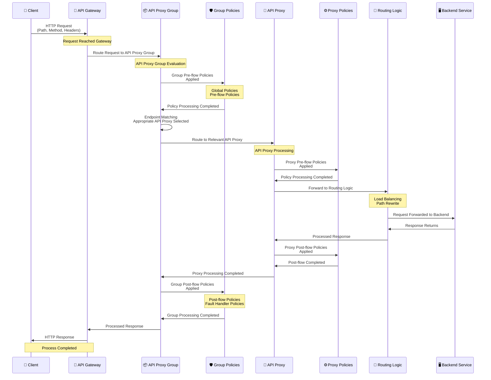

## API Proxy Group Concept

API Proxy Group enables logical grouping of related API Proxies. Policies and settings defined at the group level are automatically applied to all API Proxies included in the group.

<CardGroup cols={2}>
  <Card title="Centralized Management" icon="gear">
    Policies and settings are defined at the group level
  </Card>
  <Card title="Common Policies" icon="shield">
    Group policies are applied to all API Proxies
  </Card>
  <Card title="Easy Management" icon="users">
    Multiple API Proxies are managed under a single group
  </Card>
  <Card title="ACL Management" icon="lock">
    Group-based access control is provided
  </Card>
</CardGroup>

## API Proxy Group and API Proxy Relationship

API Proxy Group logically brings together multiple API Proxies. Policies and settings defined at the group level are automatically applied to all API Proxies included in the group.

<CardGroup cols={2}>
  <Card title="Group-Level Policies" icon="shield">
    Policies defined at the group level are applied to all group members
    
    * Global Policies
    * Pre-flow Policies
    * Post-flow Policies
    * Fault Handler Policies
  </Card>
  
  <Card title="Group-Level Settings" icon="gear">
    Settings defined at the group level are applied to all group members
    
    * CORS Settings
    * Error Messages
    * Timeout Settings
    * Retry Settings
  </Card>
</CardGroup>

<Info>
Each API Proxy within an API Proxy Group can also define its own specific policies and settings. API Proxy level settings take priority over group level settings.
</Info>

### Request Flow and Policy Application

The following diagram shows how request and response flow occurs through the Gateway with the API Proxy Group mechanism:

When a request arrives at the API Proxy Group, **policies on the API Proxy Group** are executed first. Then the relevant API Proxy's policies are applied.

<CardGroup cols={3}>
  <Card title="1. Request Arrival" icon="arrow-right">
    Request arrives at API Proxy Group
    
    Client request is routed to the API Proxy Group endpoint.
  </Card>
  
  <Card title="2. Group Policies" icon="shield">
    API Proxy Group policies are executed
    
    All policies defined at the group level are applied.
  </Card>
  
  <Card title="3. API Proxy Policies" icon="network-wired">
    API Proxy policies are executed
    
    The relevant API Proxy's own policies are applied.
  </Card>
</CardGroup>

### Multiple Group Membership

An API Proxy can be added to multiple API Proxy Groups. This allows the same API Proxy to be used in different configurations for different groups.

<Warning>
When an API Proxy is a member of multiple groups, separate endpoints and policies are applied for each group. Group-based management and isolation are provided.
</Warning>

### Direct Access Control

By prohibiting direct access through the API Proxy, it can be ensured that access is only possible through the API Proxy Group. This enables:

* **Centralized Management**: All access is controlled through the group
* **Security**: Direct API Proxy access is prevented
* **Consistency**: All requests pass through group policies

<Info>
When direct access is prohibited, the API Proxy can only be accessed through the group. This ensures that group-level policies and settings are always applied.
</Info>

### Endpoint Matching Logic

When an API Proxy Group has the same endpoint due to different API Proxies, the request **falls to the first matching endpoint**.

<AccordionGroup>
  <Accordion title="Endpoint Matching Priority">
    Endpoint matching order:
    
    1. **First Matching Endpoint**: Request is routed to the first matching endpoint
    2. **API Proxy Order**: The order of API Proxies within the group is important
    3. **Path and Method Match**: Path and HTTP method matching is checked
    
    <Tip>
    If there are multiple API Proxies with the same endpoint, the order within the group is important. The first matching endpoint is used.
    </Tip>
  </Accordion>
  
  <Accordion title="Definition File Creation">
    The API Proxy Group definition file is created by combining the definition files of all API Proxies it contains:
    
    * **Combination Process**: Definition files of all group members are combined
    * **Endpoint Combination**: All endpoints are collected in a single definition file
    * **Policy Combination**: Group and API Proxy policies are combined
    * **Swagger Combination**: Swagger definitions are combined to create group Swagger
    
    <Tip>
    The definition file combination process is performed automatically. Definitions of all API Proxies within the group are collected in a single file.
    </Tip>
  </Accordion>
</AccordionGroup>

## API Proxy Group Features

<AccordionGroup>
  <Accordion title="Group-Level Policies">
    Policies defined at the group level:
    
    * **Global Policies**: Policies applied to all group members
    * **Pre-flow Policies**: Pre-request group policies
    * **Post-flow Policies**: Post-response group policies
    * **Fault Handler Policies**: Error handling group policies
    
    <Tip>
    Group policies are automatically applied to all API Proxies within the group. This enables centralized management of common security and business logic policies.
    </Tip>
  </Accordion>
  
  <Accordion title="Group-Level Settings">
    Settings defined at the group level:
    
    * **CORS Settings**: Cross-Origin Resource Sharing settings
    * **Error Messages**: Error message templates
    * **Timeout Settings**: Timeout settings
    * **Retry Settings**: Retry settings
    * **Cache Settings**: Cache settings
    * **Client Route Settings**: Common client route settings
    
    <Tip>
    Group settings are common configurations valid for all API Proxies within the group. This ensures consistent configuration.
    </Tip>
  </Accordion>
  
  <Accordion title="Deployment Management">
    API Proxy Groups are deployed environment-based:
    
    * **Group-Based Deployment**: All group members are deployed together
    * **Environment Management**: Different deployment strategies for different environments
    * **Versioning**: Version management at the group level
    * **Rollback**: Group-based rollback operations
    
    <Tip>
    Group-based deployment enables related API Proxies to be managed together and provides a consistent deployment process.
    </Tip>
  </Accordion>
</AccordionGroup>

## API Proxy Group Usage Scenarios

<CardGroup cols={2}>
  <Card title="Microservice Groups" icon="sitemap">
    Managing related microservices under a group. For example:
    * Product Service Group
    * Order Service Group
    * Payment Service Group
  </Card>
  <Card title="Version Groups" icon="code-branch">
    Managing different API versions as a group. For example:
    * API v1 Group
    * API v2 Group
  </Card>
  <Card title="Customer Groups" icon="building">
    Customer-based API groups. For example:
    * Customer A APIs
    * Customer B APIs
  </Card>
  <Card title="Functional Groups" icon="puzzle-piece">
    Grouping functionally related APIs. For example:
    * Authentication APIs
    * Reporting APIs
    * Integration APIs
  </Card>
</CardGroup>

## API Proxy Group Configuration

### Group Creation

When creating a new API Proxy Group:

<CardGroup cols={2}>
  <Card title="Basic Information" icon="info-circle">
    * **Group Name**: Unique name identifying the group
    * **Description**: Purpose and scope of the group
    * **Tags**: Tags for the group (optional)
  </Card>
  
  <Card title="Group Content" icon="list">
    * **API Proxies**: API Proxies to be included in the group
    * **Policies**: Group-level policies
    * **Settings**: Group-level settings
  </Card>
</CardGroup>

### Group Management

<AccordionGroup>
  <Accordion title="Overview">
    General information about the group:
    
    * **Group Members**: List of API Proxies included in the group
    * **Group Statistics**: Traffic, error rates, performance metrics
    * **Group Status**: Deployment status and health information
    * **Recent Changes**: Recent updates made on the group
    
    <Tip>
    The Overview tab provides a quick summary about the group and allows you to track the group status.
    </Tip>
  </Accordion>
  
  <Accordion title="Settings">
    Group-level settings:
    
    * **CORS Settings**: Cross-Origin Resource Sharing configuration
    * **Error Message Templates**: Customizable error messages
    * **Timeout Settings**: Request and response timeout values
    * **Retry Settings**: Retry strategies
    * **Cache Settings**: Cache configuration
    
    <Tip>
    Group settings are common configurations valid for all API Proxies within the group.
    </Tip>
  </Accordion>
  
  <Accordion title="Design">
    Group-level policies:
    
    * **Pre-flow Policies**: Policies that run before requests
    * **Post-flow Policies**: Policies that run after responses
    * **Fault Handler Policies**: Policies that run in error conditions
    * **Global Policies**: Policies that run in all flows
    
    <Tip>
    Group policies are automatically applied to all API Proxies within the group. This enables centralized management of common security and business logic policies.
    </Tip>
  </Accordion>
  
  <Accordion title="Deployment">
    Group deployment management:
    
    * **Environment Selection**: Environments where deployment will be performed
    * **Deployment Status**: Current deployment statuses
    * **Version Management**: Group versions and history
    * **Rollback**: Rollback operations
    
    <Tip>
    Group-based deployment enables related API Proxies to be managed together and provides a consistent deployment process.
    </Tip>
  </Accordion>
</AccordionGroup>

## API Proxy Group and ACL

Group-based access control enables ACLs defined at the group level to be automatically applied to group members.

<CardGroup cols={2}>
  <Card title="Group-Based ACL" icon="lock">
    Access control is defined at the group level
    
    Group ACLs are valid for all API Proxies within the group.
  </Card>
  <Card title="Inheritance" icon="arrow-down">
    Group ACLs are inherited by group members
    
    Group members automatically inherit group ACLs.
  </Card>
  <Card title="Bulk Management" icon="list">
    Bulk ACL management for multiple API Proxies
    
    Group-based ACL enables access control for multiple API Proxies at once.
  </Card>
  <Card title="Priority" icon="arrow-up">
    API Proxy level ACL takes priority over group ACL
    
    ACLs defined at the API Proxy level override group ACLs.
  </Card>
</CardGroup>

<AccordionGroup>
  <Accordion title="ACL Priority Order">
    Access control priority order:
    
    1. **API Proxy Level ACL**: Highest priority
    2. **API Proxy Group Level ACL**: Second priority
    3. **Project Level ACL**: Third priority
    
    <Info>
    ACLs defined at the API Proxy level take priority over group-level ACLs. This allows defining special access control for API Proxies.
    </Info>
  </Accordion>
  
  <Accordion title="Bulk ACL Management">
    Advantages of group-based ACL management:
    
    * Defining ACL for multiple API Proxies at once
    * Consistent access control policies
    * Centralized ACL management
    * Easy update and maintenance
    
    <Tip>
    Group-based ACL management enables applying consistent access control policies for related API Proxies.
    </Tip>
  </Accordion>
</AccordionGroup>

## API Proxy Group and API Documentation

API Proxy Groups produce and display documentation in Swagger and OpenAPI formats.

<CardGroup cols={3}>
  <Card title="Group Swagger/OpenAPI" icon="file-code">
    Swagger and OpenAPI documentation at the group level
    
    Combined Swagger and OpenAPI documentation of all group members.
  </Card>
  <Card title="Member Swagger/OpenAPI" icon="file-lines">
    Swagger and OpenAPI documentation of group members
    
    Each API Proxy's own Swagger and OpenAPI documentation.
  </Card>
  <Card title="Combined View" icon="layer-group">
    Combined view of all group members
    
    Combined Swagger and OpenAPI view of all API Proxies within the group.
  </Card>
</CardGroup>

<AccordionGroup>
  <Accordion title="Swagger Documentation">
    API Proxy Groups produce documentation in Swagger format:
    
    * **Group Swagger**: Combined Swagger documentation of all group members
    * **Member Swagger**: Each API Proxy's own Swagger documentation
    * **Swagger UI**: Display in Swagger UI interface
    
    <Tip>
    Swagger documentation allows you to view APIs of all API Proxies within the group from a single place.
    </Tip>
  </Accordion>
  
  <Accordion title="OpenAPI Documentation">
    API Proxy Groups produce documentation in OpenAPI format:
    
    * **Group OpenAPI**: Combined OpenAPI documentation of all group members
    * **Member OpenAPI**: Each API Proxy's own OpenAPI documentation
    * **OpenAPI Spec**: Download in OpenAPI specification format
    
    <Tip>
    OpenAPI documentation allows you to view APIs of all API Proxies within the group in standard OpenAPI format.
    </Tip>
  </Accordion>
</AccordionGroup>

<Info>
Swagger and OpenAPI documentation for API Proxy Groups allows you to view APIs of all API Proxies within the group from a single place and use them in standard formats.
</Info>

## API Proxy Group Advantages

<AccordionGroup>
  <Accordion title="Centralized Management">
    * Common policies are managed from a single place
    * Changes are automatically applied to all group members
    * Consistency is ensured
  </Accordion>
  
  <Accordion title="Easy Management">
    * Multiple API Proxies are managed under a single group
    * Bulk operations can be performed
    * Management complexity is reduced
  </Accordion>
  
  <Accordion title="ACL Management">
    * Group-based access control
    * Inherited permissions
    * Bulk ACL management
  </Accordion>
</AccordionGroup>

## Next Steps

<CardGroup cols={2}>
  <Card title="What is API Proxy?" icon="network-wired" href="/en/concepts/core-concepts/what-is-api-proxy">
    Learn about the API Proxy concept
  </Card>
  <Card title="What is Policy?" icon="shield" href="/en/concepts/core-concepts/what-is-policy">
    Learn about the Policy concept
  </Card>
  <Card title="API List Management" icon="gear" href="/en/develop/api-listesi-yonetimi">
    API Proxy management
  </Card>
  <Card title="ACL Management" icon="lock" href="/en/admin/identity-management/api-proxy-grup-acl">
    ACL management
  </Card>
</CardGroup>

