## Client Route Features

Apinizer's Client Route feature enables more flexible and dynamic routing of incoming requests in the API Gateway:

<CardGroup cols={2}>
  <Card title="Multiple Paths" icon="layer-group">
    Multiple relative paths can be defined for an API Proxy
  </Card>
  <Card title="Host-Based Routing" icon="globe">
    Routing to different API Proxies based on host information
  </Card>
  <Card title="Header-Based Routing" icon="file-lines">
    Routing rules can be created based on HTTP header values
  </Card>
  <Card title="Method-Based Routing" icon="code">
    Method-based routing can be performed
  </Card>
</CardGroup>

<Info>
Before this feature was developed, only a single unique relative path could be defined for each API Proxy. With the new feature, multiple API Proxies with the same relative path can be created and dynamic routing can be performed between them based on host, header, or method information.
</Info>

## How Does Client Route Work?

The Client Route feature evaluates incoming requests according to a specific priority order and routes them to the correct API Proxy.

### Workflow

The following diagram shows how request and response flow occurs through the Gateway:

```mermaid
sequenceDiagram
    participant Client as 👤 Client
    participant Gateway as 🚪 API Gateway
    participant ClientRoute as 🔀 Client Route
    participant Proxy as 📦 API Proxy
    participant Backend as 🖥️ Backend Service
    
    Client->>Gateway: HTTP Request<br/>(Path, Host, Headers, Method)
    
    Note over Gateway: Request Reached Gateway
    
    Gateway->>ClientRoute: Route Request to Client Route
    
    Note over ClientRoute: Client Route Evaluation
    
    ClientRoute->>ClientRoute: 1️⃣ Path Check<br/>(Highest Priority)
    ClientRoute->>ClientRoute: 2️⃣ Host Check<br/>(OR Logic)
    ClientRoute->>ClientRoute: 3️⃣ Header Check<br/>(AND Logic)
    ClientRoute->>ClientRoute: 4️⃣ Method Check<br/>(Lowest Priority)
    
    alt All Conditions Met
        ClientRoute->>Proxy: Route to Appropriate API Proxy
        Note over Proxy: Policy Processing<br/>Message Transformation
        Proxy->>Backend: Request Forwarded to Backend
        Backend->>Proxy: Response Returns
        Proxy->>Gateway: Processed Response
        Gateway->>Client: HTTP Response
    else Conditions Not Met
        ClientRoute->>Gateway: Proxy Not Found
        Gateway->>Client: 404 Not Found
    end
    
    Note over Client,Gateway: Process Completed
```



### Routing Priority Order

The Gateway evaluates incoming requests according to the following priority order:

<CardGroup cols={4}>
  <Card title="1. Relative Path" icon="1">
    Highest priority
  </Card>
  <Card title="2. Hosts" icon="2">
    Host header check
  </Card>
  <Card title="3. Headers" icon="3">
    Header check
  </Card>
  <Card title="4. Methods" icon="4">
    Lowest priority
  </Card>
</CardGroup>

### Matching Logic

<AccordionGroup>
  <Accordion title="Hosts (OR Logic)">
    When multiple hosts are defined, it works with **OR** logic. That is, matching **any one** of the defined hosts is sufficient.
    
    **Example:**
    ```
    Hosts: hostname_x.com, hostname_y.com
    ```
    
    If the Host header value in the request is `hostname_x.com` or `hostname_y.com`, the condition is met.
  </Accordion>
  
  <Accordion title="Headers (AND Logic)">
    When multiple headers are defined, it works with **AND** logic. That is, **all** defined headers must match.
    
    **Example:**
    ```
    Headers: testmode:true, test:true
    ```
    
    Both `testmode: true` and `test: true` headers must be present in the request.
  </Accordion>
  
  <Accordion title="Path Matching">
    * Relative path matching has the highest priority
    * More specific (longer) paths are evaluated before more general (shorter) paths
    * If exact match is not found, the closest parent path is used
  </Accordion>
  
  <Accordion title="Method Matching">
    * Method check has the lowest priority
    * If not specified, all HTTP methods are accepted
  </Accordion>
</AccordionGroup>

## Wildcard Hostname Usage

Apinizer supports **wildcard (joker character)** usage in host definitions to provide flexibility. Wildcard hostnames allow all Host header values matching a specific pattern to meet the condition and thus match with the relevant Route.

### Wildcard Rules

<Warning>
**Wildcard Rules:**
* Can contain only **one** asterisk (*) in the **leftmost** or **rightmost** label of the domain
* Asterisk can be used at the beginning or end of the domain
</Warning>

### Wildcard Examples

<CardGroup cols={2}>
  <Card title="Left Side Wildcard" icon="arrow-left">
    ```
    *.example.com
    ```
    
    **Matching Hosts:**
    * a.example.com
    * x.y.example.com
    * api.example.com
    * test.subdomain.example.com
  </Card>
  <Card title="Right Side Wildcard" icon="arrow-right">
    ```
    example.*
    ```
    
    **Matching Hosts:**
    * example.com
    * example.org
    * example.net
    * example.io
  </Card>
</CardGroup>

## Example Scenario

The following table shows 5 different API Proxies and their configured Client Route configurations:

<Tip>
This scenario will be used to understand the priority order and matching logic of Client Route.
</Tip>

| Proxy ID | Relative Path | Methods | Hosts (OR) | Headers (AND) |
|----------|---------------|---------|------------|---------------|
| 1 | `/jokes` | - | - | `testmode:true`, `test:true` |
| 2 | `/jokes` | - | `hostname_x.com`, `hostname_y.com` | - |
| 3 | `/jokes1/endpoint_x` | - | - | - |
| 4 | `/jokes1` | - | - | - |
| 5 | `/jokes` | - | - | - |

## Routing Examples

According to this configuration, incoming requests are routed as follows:

<AccordionGroup>
  <Accordion title="Example 1: Basic Routing">
    **Request:**
    ```
    GET https://<ACCESS_URL>/jokes
    ```
    
    **Result:** Routed to Proxy 5 (default proxy since no conditions are met)
    
    <Tip>
    Path matched but host and header conditions were not met, so Proxy 5 with the simplest configuration is selected.
    </Tip>
  </Accordion>
  
  <Accordion title="Example 2: Host-Based Routing">
    **Request:**
    ```
    GET https://<ACCESS_URL>/jokes
    Host: hostname_x.com
    ```
    
    **Result:** Routed to Proxy 2 (host condition met)
    
    <Tip>
    Proxy 2 is selected because host priority is higher than header.
    </Tip>
  </Accordion>
  
  <Accordion title="Example 3: Routing with Missing Header">
    **Request:**
    ```
    GET https://<ACCESS_URL>/jokes
    testmode: true
    ```
    
    **Result:** Routed to Proxy 5 (Proxy 1 requires both headers, only one provided)
    
    <Tip>
    Since headers work with AND logic, all headers must match. In case of missing headers, the next appropriate proxy is selected.
    </Tip>
  </Accordion>
  
  <Accordion title="Example 4: Complete Header Match">
    **Request:**
    ```
    GET https://<ACCESS_URL>/jokes
    testmode: true
    test: true
    ```
    
    **Result:** Routed to Proxy 1 (all header conditions met)
    
    <Tip>
    Proxy 1 is selected because all header conditions are met.
    </Tip>
  </Accordion>
  
  <Accordion title="Example 5: Path Priority - Basic Path">
    **Request:**
    ```
    GET https://<ACCESS_URL>/jokes1
    ```
    
    **Result:** Routed to Proxy 4 (exact path match)
    
    <Tip>
    Proxy 4 with exact matching path is selected because path priority is highest.
    </Tip>
  </Accordion>
  
  <Accordion title="Example 6: Path Priority - Long Path">
    **Request:**
    ```
    GET https://<ACCESS_URL>/jokes1/endpoint_x
    ```
    
    **Result:** Routed to Proxy 3 (more specific path prioritized)
    
    <Tip>
    More specific (longer) paths are evaluated before more general (shorter) paths.
    </Tip>
  </Accordion>
  
  <Accordion title="Example 7: Path with Sub-path">
    **Request:**
    ```
    GET https://<ACCESS_URL>/jokes1/endpoint_x/endpoint_y
    ```
    
    **Result:** Routed to Proxy 3 (closest parent path match)
    
    <Tip>
    If exact match is not found, the closest parent path is used.
    </Tip>
  </Accordion>
  
  <Accordion title="Example 8: Path Match - Different Sub-path">
    **Request:**
    ```
    GET https://<ACCESS_URL>/jokes1/endpoint_y
    ```
    
    **Result:** Routed to Proxy 4 (parent path `/jokes1` matched)
    
    <Tip>
    There is no exact match for `/jokes1/endpoint_y` path, so the parent path `/jokes1` match is used.
    </Tip>
  </Accordion>
  
  <Accordion title="Example 9: Host and Header Combination">
    **Request:**
    ```
    GET https://<ACCESS_URL>/jokes
    Host: hostname_x.com
    testmode: true
    test: true
    ```
    
    **Result:** Routed to Proxy 2 (host has higher priority than header)
    
    <Tip>
    Since host priority is higher than header, when host condition is met, header conditions are ignored and Proxy 2 is selected.
    </Tip>
  </Accordion>
  
  <Accordion title="Example 10: Different Path with Host and Header">
    **Request:**
    ```
    GET https://<ACCESS_URL>/jokes1
    Host: hostname_x.com
    testmode: true
    test: true
    ```
    
    **Result:** Routed to Proxy 4 (path priority is highest, host and headers are ignored)
    
    <Tip>
    Since path priority is highest, when path match is met, host and header conditions are ignored.
    </Tip>
  </Accordion>
</AccordionGroup>

## Important Notes

<AccordionGroup>
  <Accordion title="Path Matching">
    * Relative path matching has the highest priority
    * More specific (longer) paths are evaluated before more general (shorter) paths
    * If exact match is not found, the closest parent path is used
  </Accordion>
  
  <Accordion title="Host Matching">
    * Multiple hosts can be defined
    * Hosts work with **OR** logic
    * If the host value in the request matches any of the defined hosts, the condition is met
  </Accordion>
  
  <Accordion title="Header Matching">
    * Multiple headers can be defined
    * Headers work with **AND** logic
    * All defined headers must be present in the request
    * In case of missing or incorrect headers, proceed to the next appropriate proxy
  </Accordion>
  
  <Accordion title="Method Matching">
    * Method check has the lowest priority
    * If not specified, all HTTP methods are accepted
  </Accordion>
</AccordionGroup>

## Routing Combination Table

This table shows how the API Proxy is selected from the API Proxy's perspective:

<Tip>
This table can be used as a reference to understand how Client Route evaluates different conditions.
</Tip>

| Status | Description |
|--------|-------------|
| **None** | Not present in the API proxy definition. What the client sends is not checked. |
| **Matched** | Present in the API proxy definition. What the client sends is checked, and it sent the expected value. |
| **Not Matched** | Present in the API proxy definition. What the client sends is checked, but it did not send the expected value. |

<Info>
The Client Route feature allows you to easily manage complex routing scenarios in your API Gateway. By correctly understanding the priority order and matching logic, you can create flexible and powerful API routing configurations.
</Info>

## Next Steps

<CardGroup cols={2}>
  <Card title="Client Route Settings" icon="gear" href="/en/develop/api-proxy-creation/client-route-settings">
    Configure Client Route settings
  </Card>
  <Card title="Routing and Upstream" icon="route" href="/en/concepts/core-concepts/routing-and-upstream">
    Learn about Routing and Upstream concepts
  </Card>
  <Card title="HTTP Routing" icon="globe" href="/en/develop/routing/http-routing">
    HTTP Routing configuration
  </Card>
  <Card title="Message Processing and Policy Application" icon="diagram-project" href="/en/concepts/core-concepts/message-processing-and-policy-application">
    Learn about message flow and policy application process
  </Card>
  <Card title="What is API Proxy?" icon="server" href="/en/concepts/core-concepts/what-is-api-proxy">
    Learn about the API Proxy concept
  </Card>
</CardGroup>

