<Info>
Conditions are part of policy configuration as explained on the [What is Policy?](/en/concepts/core-concepts/what-is-policy) page. Condition definitions are made from the conditions section when creating or editing a policy.
</Info>

## Conditional Policy Execution Concept

Conditional policy execution enables policies to be executed based on specific conditions. In Apinizer, conditions are created **without writing code, using [Variable](/en/concepts/core-concepts/variable) and form-based configuration**.

The following diagram shows how conditional policy execution occurs through the Gateway:

```mermaid
sequenceDiagram
    participant Client as 👤 Client
    participant Gateway as 🚪 API Gateway
    participant Proxy as 🔀 API Proxy
    participant Condition as 🔍 Condition Evaluation
    participant Variables as 📊 Variables
    participant Policy1 as 🛡️ Policy 1
    participant Policy2 as 🛡️ Policy 2
    participant Backend as 🖥️ Backend Service
    
    Client->>Gateway: HTTP Request<br/>(Path, Headers, Query, Body)
    
    Note over Gateway: Request Reached Gateway
    
    Gateway->>Proxy: Route Request to API Proxy
    
    Note over Proxy: API Proxy Processing Started
    
    Proxy->>Condition: Conditional Policy<br/>Evaluation
    
    Note over Condition: Condition Check
    
    Condition->>Variables: Variable Values<br/>Extracted
    
    Note over Variables: Variable Sources:<br/>Header, Query Param,<br/>Message Content (JSONPath/XPath),<br/>Context, System Variable
    
    Variables->>Condition: Variable Values Returned
    
    Condition->>Condition: Condition Evaluation<br/>(Operator: EQ, NE, GT, LT,<br/>CONTAINS, IN, etc.)
    
    alt Condition 1 Met
        Condition->>Policy1: Condition 1 Met<br/>Policy 1 Executed
        
        Note over Policy1: Example: Content-Type == "application/json"<br/>→ JSON Schema Validation
        
        Policy1->>Proxy: Policy 1 Completed
    else Condition 2 Met
        Condition->>Policy2: Condition 2 Met<br/>Policy 2 Executed
        
        Note over Policy2: Example: Content-Type == "application/xml"<br/>→ XML Schema Validation
        
        Policy2->>Proxy: Policy 2 Completed
    else Condition Not Met
        Condition->>Proxy: Condition Not Met<br/>Alternative Policy or<br/>Continue
    end
    
    Proxy->>Backend: Processed Request<br/>Forwarded to Backend
    
    Backend->>Proxy: Response Returns
    
    Note over Proxy: Post-flow Policies<br/>(Can be conditional)
    
    Proxy->>Gateway: Processed Response
    
    Gateway->>Client: HTTP Response
    
    Note over Client,Gateway: Process Completed
```

### Form-Based Condition Creation

When creating conditional policies, the following steps are followed:

<Steps>
  <Step title="First Variable Selection">
    You select the variable on the left side of the comparison. This variable can be:
    - Header variable
    - Query parameter variable
    - Message content variable (with JSONPath/XPath)
    - Context variable
    - System variable
    - Custom variable
  </Step>
  <Step title="Data Type Determination">
    You select the data type of the variable:
    - **STRING**: For text comparisons
    - **NUMERIC**: For numeric comparisons
    - **DATE**: For date comparisons (date format must be specified)
  </Step>
  <Step title="Comparison Operator Selection">
    You select the comparison operator from the dropdown menu:
    - Comparison operators such as equality, greater than, less than
    - Text operators such as contains, starts with, ends with
    - Existence check operators such as exists, not exists, empty
  </Step>
  <Step title="Second Value Source Determination">
    You determine the source of the second value:
    - **Constant Value**: A constant value entered directly
    - **Variable**: Selection of another variable (variable-to-variable comparison)
  </Step>
  <Step title="Nested Conditions (Optional)">
    You combine conditions with AND, OR, NOT operators by adding sub-conditions for complex logic.
  </Step>
</Steps>

This approach allows you to create conditional policies without writing code, by filling form fields and selecting [Variable](/en/concepts/core-concepts/variable)s.

## Condition Types and Variable Usage

Conditions are created using [Variable](/en/concepts/core-concepts/variable). Variables can get values from message content, headers, query parameters, or context.

### Message Content Conditions

To create conditions based on message content, variables are defined using JSONPath or XPath:

<CardGroup cols={2}>
  <Card title="JSONPath Variable" icon="code">
    To extract values from JSON messages:
    - **Variable Type**: Message Content (JSONPath)
    - **JSONPath Expression**: `$.user.role` or `$.products[*].price`
    - **Data Type**: STRING or NUMERIC
  </Card>
  <Card title="XPath Variable" icon="file-code">
    To extract values from XML messages:
    - **Variable Type**: Message Content (XPath)
    - **XPath Expression**: `/user/role` or `//product/@price`
    - **Data Type**: STRING or NUMERIC
  </Card>
  <Card title="Header Variable" icon="file-lines">
    Based on HTTP header values:
    - **Variable Type**: Header
    - **Header Name**: `Content-Type` or `X-API-Version`
    - **Data Type**: STRING
  </Card>
  <Card title="Query Parameter Variable" icon="link">
    Based on query parameters:
    - **Variable Type**: Query Parameter
    - **Parameter Name**: `version` or `format`
    - **Data Type**: STRING
  </Card>
</CardGroup>

### Client Conditions

To create conditions based on client information, relevant variables are used:

<AccordionGroup>
  <Accordion title="IP Address">
    For control based on IP address:
    - **Variable Type**: Client IP
    - **Data Type**: STRING
    - **Operator**: IN or NOT_IN
    - **Value**: `192.168.1.0/24#10.0.0.0/8` (list values separated by #)
    
    Used for IP whitelist/blacklist control.
  </Accordion>
  
  <Accordion title="User Agent">
    For control based on User-Agent header:
    - **Variable Type**: Header
    - **Header Name**: `User-Agent`
    - **Data Type**: STRING
    - **Operator**: CONTAINS or STARTS_WITH
    
    Used for browser or mobile device control.
  </Accordion>
  
  <Accordion title="API Key">
    For control based on API Key value:
    - **Variable Type**: Header
    - **Header Name**: `X-API-Key` or `Authorization`
    - **Data Type**: STRING
    - **Operator**: EQ or IN
    
    Different policies can be applied based on API Key type or value.
  </Accordion>
  
  <Accordion title="Context Values">
    For control based on user information in context:
    - **Variable Type**: Context Variable
    - **Variable Name**: `context.user.role` or `context.user.id`
    - **Data Type**: STRING
    - **Operator**: EQ, IN, etc.
    
    Used for authorization based on user role or identity information.
  </Accordion>
</AccordionGroup>

### Time Conditions

System variables are used for time-based conditions:

<CardGroup cols={2}>
  <Card title="Date Range" icon="calendar">
    - **Variable Type**: System Variable (date variable)
    - **Data Type**: DATE
    - **Date Format**: `yyyy-MM-dd` (must be specified)
    - **Operator**: GE, LE, GT, LT
    
    Used for access control within a specific date range.
  </Card>
  <Card title="Time Range" icon="clock">
    - **Variable Type**: System Variable (time variable)
    - **Data Type**: STRING or DATE (according to time format)
    - **Operator**: GE, LE
    
    Used for business hours control.
  </Card>
  <Card title="Day-Based" icon="calendar-days">
    - **Variable Type**: System Variable (day variable)
    - **Data Type**: STRING
    - **Operator**: EQ or IN
    
    Used for access control on specific days of the week.
  </Card>
  <Card title="Time Zone" icon="globe">
    - **Variable Type**: System Variable (timezone variable)
    - **Data Type**: STRING
    - **Operator**: EQ
    
    Used for timezone-based control.
  </Card>
</CardGroup>

### System and Environment Conditions

Conditions based on system and environment variables:

<AccordionGroup>
  <Accordion title="Environment Variable">
    For control based on [environment variables](/en/develop/environment-variables):
    - **Variable Type**: Environment Variable
    - **Variable Name**: `ENVIRONMENT` or `FEATURE_FLAG`
    - **Data Type**: STRING
    - **Operator**: EQ, NE, etc.
    
    Used for environment-based (development, test, production) control.
  </Accordion>
  
  <Accordion title="System Property">
    For control based on system properties:
    - **Variable Type**: System Property
    - **Property Name**: `app.version` or `system.property`
    - **Data Type**: STRING
    - **Operator**: EQ, NE, etc.
    
    Used for system version or feature control.
  </Accordion>
  
  <Accordion title="Cache Value">
    For control based on values in cache:
    - **Variable Type**: Cache Variable
    - **Cache Key**: `user.status` or cache key
    - **Data Type**: STRING
    - **Operator**: EQ, IS_EXISTS, etc.
    
    Used for dynamic control based on values in cache.
  </Accordion>
</AccordionGroup>

## Condition Configuration

Conditions are created using [Variable](/en/concepts/core-concepts/variable) and form-based configuration. Each condition consists of the following components:

### Condition Components

1. **First Variable**: Variable on the left side of the comparison
   - Header variable
   - Query parameter variable
   - Message content variable (JSONPath/XPath)
   - Context variable
   - Custom variable

2. **Data Type**: Data type of the variable
   - **STRING**: For text comparisons
   - **NUMERIC**: For numeric comparisons
   - **DATE**: For date comparisons (date format must be specified)

3. **Comparison Operator**: Type of comparison between two values

4. **Second Value Source**: 
   - **Constant Value**: A constant value entered directly
   - **Variable**: Selection of another variable

5. **Logical Operator**: To combine multiple conditions
   - **AND**: All conditions must be met
   - **OR**: At least one condition must be met
   - **NOT**: Condition must not be met

## Comparison Operators

Comparison operators that can be used in conditions:

### Text (STRING) Operators

| Operator | Description | Usage Scenario |
|----------|-------------|----------------|
| **Equals (EQ)** | Are two values exactly equal? | `Content-Type == "application/json"` |
| **Not Equals (NE)** | Are two values not equal? | `version != "v1"` |
| **Less Than (LT)** | Smaller in alphabetical order? | `"apple" < "banana"` |
| **Less Than or Equal (LE)** | Less than or equal? | `"apple" <= "banana"` |
| **Greater Than (GT)** | Larger in alphabetical order? | `"zebra" > "apple"` |
| **Greater Than or Equal (GE)** | Greater than or equal? | `"zebra" >= "apple"` |
| **Contains (CONTAINS)** | Does it appear in the text? | `userAgent contains "Mobile"` |
| **Not Contains (NOT_CONTAINS)** | Does it not appear in the text? | `path NOT_CONTAINS "/admin"` |
| **Starts With (STARTS_WITH)** | Does it start with the specified text? | `path STARTS_WITH "/api/v2"` |
| **Ends With (ENDS_WITH)** | Does it end with the specified text? | `filename ENDS_WITH ".json"` |
| **In (IN)** | Is it in the specified list? | `role IN ["admin", "user"]` |
| **Not In (NOT_IN)** | Is it not in the specified list? | `status NOT_IN ["deleted", "archived"]` |

### Numeric (NUMERIC) Operators

| Operator | Description | Usage Scenario |
|----------|-------------|----------------|
| **Equals (EQ)** | Are two numbers equal? | `price == 100` |
| **Not Equals (NE)** | Are two numbers not equal? | `count != 0` |
| **Less Than (LT)** | Is the first number less than the second? | `age < 18` |
| **Less Than or Equal (LE)** | Less than or equal? | `quantity <= 10` |
| **Greater Than (GT)** | Is the first number greater than the second? | `score > 80` |
| **Greater Than or Equal (GE)** | Greater than or equal? | `balance >= 1000` |
| **In (IN)** | Is it in the specified number list? | `statusCode IN [200, 201, 204]` |
| **Not In (NOT_IN)** | Is it not in the specified number list? | `errorCode NOT_IN [404, 500]` |

### Date (DATE) Operators

Date format must be specified for date comparisons (e.g., `yyyy-MM-dd`, `dd/MM/yyyy`).

| Operator | Description | Usage Scenario |
|----------|-------------|----------------|
| **Equals (EQ)** | Are two dates the same? | `expiryDate == "2024-12-31"` |
| **Not Equals (NE)** | Are two dates different? | `startDate != "2024-01-01"` |
| **Less Than (LT)** | Is the first date before the second? | `createdDate < "2024-06-01"` |
| **Less Than or Equal (LE)** | Before or the same? | `deadline <= "2024-12-31"` |
| **Greater Than (GT)** | Is the first date after the second? | `expiryDate > "2024-01-01"` |
| **Greater Than or Equal (GE)** | After or the same? | `startDate >= "2024-01-01"` |

### Existence Check Operators

These operators do not require a second value, they only check the status of the variable:

| Operator | Description | Usage Scenario |
|----------|-------------|----------------|
| **Exists (IS_EXISTS)** | Is the variable defined and not null? | `apiKey IS_EXISTS` |
| **Not Exists (IS_NOT_EXISTS)** | Is the variable not defined or null? | `optionalHeader IS_NOT_EXISTS` |
| **Empty (IS_EMPTY)** | Is the variable empty string or null? | `queryParam IS_EMPTY` |
| **Not Empty (IS_NOT_EMPTY)** | Is the variable filled? | `requestBody IS_NOT_EMPTY` |

<Info>
**List Values:** For `IN` and `NOT_IN` operators, list values are separated by `#` character. Example: `admin#user#guest` or `100#200#300`
</Info>

### Null Value Handling

Null values are handled specially in conditions:

| Status | Operator | Result |
|--------|----------|--------|
| First value null, second value null | EQ | `true` (null == null) |
| First value null, second value null | NE | `false` (null != null is not) |
| First value null, second value filled | EQ | `false` |
| First value null, second value filled | NE | `true` |
| First value filled, second value null | EQ | `false` |
| First value filled, second value null | NE | `true` |
| First value null | GT, LT, GE, LE, CONTAINS, IN, STARTS_WITH, ENDS_WITH | `false` |
| First value null | NOT_CONTAINS, NOT_IN | `true` |

<Tip>
Use **IS_EXISTS**, **IS_NOT_EXISTS**, **IS_EMPTY**, **IS_NOT_EMPTY** operators for null value checking. These operators handle null values correctly.
</Tip>

## Condition Creation Examples

The following examples show how conditions are created with the form-based approach:

### Example 1: Content-Type Based Validation

**Scenario**: Different validation policies will be applied based on Content-Type header.

**Form Configuration**:
- **First Variable**: Header variable selected → `Content-Type`
- **Data Type**: STRING
- **Operator**: Equals (EQ)
- **Second Value Source**: Constant value
- **Second Value**: `application/json`

**Result**: If Content-Type header is `application/json`, JSON Schema Validation Policy runs.

**Alternative Conditions** (nested conditions):
- **Condition 1**: If Content-Type is `application/xml` → XML Schema Validation Policy
  - First Variable: Header → `Content-Type`
  - Operator: EQ
  - Second Value: `application/xml`
- **Condition 2**: Other cases → Reject Request (400 Bad Request)
  - ELSE case

### Example 2: API Version Based Routing

**Scenario**: Routing to different backends based on version value in query parameter.

**Form Configuration**:
- **First Variable**: Query Parameter variable selected → `version`
- **Data Type**: STRING
- **Operator**: Equals (EQ)
- **Second Value Source**: Constant value
- **Second Value**: `v1`

**Result**: If query parameter `version=v1`, routed to Backend v1.

**Alternative Conditions**:
- **Condition 1**: If version is `v2` → Route to Backend v2
  - First Variable: Query Parameter → `version`
  - Operator: EQ
  - Second Value: `v2`
- **Condition 2**: Other cases → Route to Default Backend
  - ELSE case

### Example 3: User Role Based Authorization

**Scenario**: Different policy will be applied based on user role.

**Form Configuration**:
- **First Variable**: Context Variable selected → `context.user.role`
- **Data Type**: STRING
- **Operator**: Equals (EQ)
- **Second Value Source**: Constant value
- **Second Value**: `admin`

**Result**: If user role is `admin`, all operations are allowed.

**Alternative Conditions**:
- **Condition 1**: If role is `user` → Rate Limiting Policy (100 req/min)
  - First Variable: Context Variable → `context.user.role`
  - Operator: EQ
  - Second Value: `user`
- **Condition 2**: Other cases → Reject Request (403 Forbidden)
  - ELSE case

### Example 4: IP Based Rate Limiting

**Scenario**: Different rate limit values will be applied based on IP address.

**Form Configuration**:
- **First Variable**: Client IP variable selected
- **Data Type**: STRING
- **Operator**: In (IN)
- **Second Value Source**: Constant value
- **Second Value**: `192.168.1.0/24#10.0.0.0/8` (list values separated by #)

**Result**: If IP address is in one of the specified ranges, Rate Limiting Policy (1000 req/min) is applied.

**Alternative Condition**:
- **Condition 2**: Other cases → Rate Limiting Policy (100 req/min)
  - ELSE case

### Example 5: Time-based Access Control (Nested Conditions)

**Scenario**: Access permission will be given during business hours.

**Form Configuration** (Nested conditions with AND logic):
- **Logical Operator**: AND selected
- **First Sub-Condition**:
  - First Variable: System Variable → `current.time`
  - Data Type: STRING or DATE (according to time format)
  - Operator: Greater Than or Equal (GE)
  - Second Value: `09:00`
- **Second Sub-Condition**:
  - First Variable: System Variable → `current.time`
  - Data Type: STRING or DATE
  - Operator: Less Than or Equal (LE)
  - Second Value: `17:00`

**Result**: If time is between 09:00-17:00, request is accepted, otherwise rejected (503 Service Unavailable).

## Nested Conditions (Condition Combinations)

You can create nested conditions for complex logic. In the form-based approach, you combine conditions by adding sub-conditions:

### AND Operator

**Form Configuration**:
- **Logical Operator**: AND selected
- **First Sub-Condition**:
  - First Variable: Header → `Content-Type`
  - Data Type: STRING
  - Operator: Equals (EQ)
  - Second Value: `application/json`
- **Second Sub-Condition**:
  - First Variable: Header → `X-API-Key`
  - Data Type: STRING
  - Operator: Equals (EQ)
  - Second Value: `premium-key`

**Result**: If both conditions are met, Premium JSON Processing Policy runs.

### OR Operator

**Form Configuration**:
- **Logical Operator**: OR selected
- **First Sub-Condition**:
  - First Variable: Client IP
  - Data Type: STRING
  - Operator: In (IN)
  - Second Value: `192.168.1.0/24#10.0.0.0/8`
- **Second Sub-Condition**:
  - First Variable: Header → `X-API-Key`
  - Data Type: STRING
  - Operator: Equals (EQ)
  - Second Value: `internal-key`

**Result**: If one of the conditions is met, Internal Access Policy runs.

### NOT Operator

**Form Configuration**:
- **Logical Operator**: NOT selected
- **Sub-Condition**:
  - First Variable: Client IP
  - Data Type: STRING
  - Operator: In (IN)
  - Second Value: `10.0.0.0/8`

**Result**: If IP is not in the specified range, External Access Rate Limiting is applied.

### Variable Comparison

In conditions, you can perform **variable-to-variable comparison** as well as comparisons with constant values:

**Form Configuration**:
- **First Variable**: Header → `Content-Type`
- **Data Type**: STRING
- **Operator**: Equals (EQ)
- **Second Value Source**: Variable selected
- **Second Variable**: Context Variable → `context.preferred.contentType`

**Result**: If two variables are equal, policy runs. This approach is used for dynamic comparisons.

## Conditional Policy Best Practices

<CardGroup cols={2}>
  <Card title="Variable Selection" icon="list-check">
    - Use existing [Variable](/en/concepts/core-concepts/variable)s, don't create unnecessary new variables
    - Select variable types correctly (Header, Query Parameter, Message Content, Context Variable)
    - Write and test JSONPath/XPath expressions correctly
  </Card>
  <Card title="Data Type Selection" icon="code">
    - Use STRING for text comparisons
    - Use NUMERIC for numeric comparisons
    - Use DATE for date comparisons and specify date format
  </Card>
  <Card title="Condition Ordering" icon="list-ol">
    - Add most specific conditions first
    - Leave general conditions last
    - Always define ELSE case
  </Card>
  <Card title="Nested Conditions" icon="sitemap">
    - Use nested conditions for complex logic
    - Select AND/OR/NOT operators correctly
    - Keep condition depth reasonable (for readability)
  </Card>
  <Card title="Value Source" icon="arrows-left-right">
    - Use constant value option for constant values
    - Use variable option for dynamic comparisons
    - Ensure data types are compatible when doing variable-to-variable comparison
  </Card>
  <Card title="List Values" icon="list">
    - Separate list values with `#` character for IN and NOT_IN operators
    - Example: `admin#user#guest` or `100#200#300`
  </Card>
  <Card title="Existence Check" icon="circle-check">
    - Use IS_EXISTS or IS_NOT_EXISTS to check variable existence
    - Use IS_EMPTY or IS_NOT_EMPTY for empty value check
    - These operators do not require a second value
  </Card>
  <Card title="Performance" icon="gauge">
    - Check simple conditions first
    - Leave heavy operations (JSONPath/XPath) last
    - Consider cache usage
  </Card>
  <Card title="Test and Validation" icon="flask">
    - Test all condition branches
    - Test edge cases (empty values, null, etc.)
    - Ensure variable values are available at runtime
    - Understand how null values are handled
  </Card>
</CardGroup>

## Next Steps

<CardGroup cols={2}>
  <Card title="Variables" icon="code" href="/en/concepts/core-concepts/variable">
    Learn about the Variable concept and usage
  </Card>
  <Card title="Message Processing and Policy Application" icon="diagram-project" href="/en/concepts/core-concepts/message-processing-and-policy-application">
    Learn about message flow and policy application process
  </Card>
  <Card title="What is Policy?" icon="shield" href="/en/concepts/core-concepts/what-is-policy">
    Learn about the Policy concept and conditions section in detail
  </Card>
  <Card title="Routing and Upstream" icon="route" href="/en/concepts/core-concepts/routing-and-upstream">
    Learn about conditional routing and upstream selection
  </Card>
</CardGroup>

