## Connection Features

A connection is a configuration containing information necessary to access an external system. Connections are defined once and can be used by multiple API Proxies or tasks.

<CardGroup cols={2}>
  <Card title="Reusable" icon="recycle">
    A connection can be used by multiple API Proxies or tasks
  </Card>
  <Card title="Centralized Management" icon="gear">
    Connections are managed and updated centrally
  </Card>
  <Card title="Security" icon="lock">
    Connection information is stored encrypted
  </Card>
  <Card title="Testable" icon="flask">
    Connections can be tested and validated
  </Card>
</CardGroup>

## Connection Usage Flow

The following diagram shows how connections are used by API Proxies and policies:

```mermaid
sequenceDiagram
    participant Client as 👤 Client
    participant Gateway as 🚪 API Gateway
    participant Proxy as 🔀 API Proxy
    participant Policy as 🛡️ Policy/DB-2-API
    participant Connection as 🔌 Connection
    participant ExternalSystem as 🖥️ External System<br/>(DB, Kafka, Email, etc.)
    
    Client->>Gateway: HTTP Request
    
    Note over Gateway: Request Reached Gateway
    
    Gateway->>Proxy: Route Request to API Proxy
    
    Note over Proxy: API Proxy Processing
    
    Proxy->>Policy: Policy or DB-2-API<br/>Executed
    
    Note over Policy: External System Access Required
    
    Policy->>Connection: Connection Usage<br/>(Centralized Configuration)
    
    Note over Connection: Connection Information<br/>(Encrypted)<br/>Host, Port, Credentials
    
    Connection->>ExternalSystem: Secure Connection<br/>Established (SSL/TLS)
    
    Note over ExternalSystem: External System Types:<br/>Database (MongoDB, MySQL, etc.)<br/>Message Queue (Kafka, RabbitMQ)<br/>Email (SMTP)<br/>Search (Elasticsearch)
    
    ExternalSystem->>Connection: Operation Result<br/>Returns
    
    Connection->>Policy: Connection Result
    
    Policy->>Proxy: Policy Processing Completed
    
    Proxy->>Gateway: Processed Response
    
    Gateway->>Client: HTTP Response
    
    Note over Client,Gateway: Process Completed
    
    Note over Connection,ExternalSystem: Connection Pool<br/>Management and<br/>Reuse
```

## Connection Types

The Apinizer platform provides support for connections to a wide variety of external systems:

### Database Connections

<CardGroup cols={3}>
  <Card title="MongoDB" icon="database">
    MongoDB NoSQL database connections
  </Card>
  <Card title="MySQL" icon="database">
    MySQL database connections
  </Card>
  <Card title="PostgreSQL" icon="database">
    PostgreSQL database connections
  </Card>
  <Card title="Oracle" icon="database">
    Oracle database connections
  </Card>
  <Card title="MSSQL" icon="database">
    Microsoft SQL Server connections
  </Card>
  <Card title="DB2" icon="database">
    IBM DB2 connections
  </Card>
  <Card title="Sybase" icon="database">
    Sybase database connections
  </Card>
  <Card title="Apache Hive" icon="database">
    Apache Hive database connections
  </Card>
  <Card title="Apache Impala" icon="database">
    Apache Impala database connections
  </Card>
  <Card title="Trino" icon="database">
    Trino (PrestoSQL) database connections
  </Card>
</CardGroup>

### Message Queue Connections

<CardGroup cols={3}>
  <Card title="Kafka" icon="message">
    Apache Kafka connections
  </Card>
  <Card title="RabbitMQ" icon="message">
    RabbitMQ connections
  </Card>
  <Card title="ActiveMQ" icon="message">
    Apache ActiveMQ connections
  </Card>
</CardGroup>

### Search and Data Connections

<CardGroup cols={3}>
  <Card title="Elasticsearch" icon="magnifying-glass">
    Elasticsearch cluster connections
  </Card>
  <Card title="LDAP/AD" icon="users">
    LDAP/Active Directory connections
  </Card>
  <Card title="Webhook" icon="link">
    HTTP webhook connections
  </Card>
</CardGroup>

### Communication Connections

<CardGroup cols={3}>
  <Card title="SMTP/Email" icon="envelope">
    Email server connections
  </Card>
  <Card title="FTP/SFTP" icon="folder">
    FTP/SFTP server connections
  </Card>
  <Card title="Linux Script" icon="terminal">
    Linux script execution connections
  </Card>
</CardGroup>

### Logging and Monitoring Connections

<CardGroup cols={3}>
  <Card title="Graylog" icon="file-lines">
    Graylog GELF connections
  </Card>
  <Card title="Syslog" icon="file-lines">
    Syslog connections
  </Card>
  <Card title="Logback" icon="file-lines">
    Logback logging connections
  </Card>
  <Card title="SNMP" icon="network-wired">
    SNMP connections
  </Card>
</CardGroup>

## Connection Configuration

When creating a connection, the following information is defined:

<AccordionGroup>
  <Accordion title="Basic Information">
    * **Connection Name**: Unique name identifying the connection
    * **Connection Type**: Database, message queue, etc.
    * **Description**: Descriptive information about the connection (optional)
  </Accordion>
  
  <Accordion title="Connection Information">
    * **Host/URL**: Server address or connection URL
    * **Port**: Connection port (varies by connection type)
    * **Database Name**: Database name (for database connections)
  </Accordion>
  
  <Accordion title="Authentication">
    * **Username**: Username for the connection
    * **Password**: Password for the connection (stored encrypted)
    * **Credential Usage**: Whether credentials will be used
  </Accordion>
  
  <Accordion title="Advanced Settings">
    * **Connection Pool**: Connection pool settings (min/max pool size, etc.)
    * **Timeout**: Connection timeout settings
    * **SSL/TLS**: Secure connection settings
    * **Deploy to Worker**: Whether to deploy to Worker
    * **Enabled**: Whether the connection is active
  </Accordion>
</AccordionGroup>

## Connection Usage

Connections are used in the following situations:

<CardGroup cols={2}>
  <Card title="API Proxy" icon="server">
    **DB-2-API** can perform database queries
    
    SQL queries can be executed using database connections and results can be returned as API responses.
  </Card>
  
  <Card title="API Integrator" icon="diagram-project">
    Access to external systems is provided in **Task Flow**s
    
    Connections are used in Task Flows for operations such as database queries, message queue operations, and email sending.
  </Card>
  
  <Card title="Connectors" icon="puzzle-piece">
    Used for connectors to connect to external systems
    
    Connectors use connections to access different systems and exchange data.
  </Card>
  
  <Card title="Policies" icon="shield">
    Can be used for access to external systems within policies
    
    Some policies can communicate with external systems using connections.
  </Card>
</CardGroup>

## Connection Security

<Warning>
**Important Security Notes:**
* Connection information (username, password) is stored encrypted
* Secure connections (SSL/TLS) must be used in production environments
* Connection information is never written to log files
* Connection information should be updated regularly
</Warning>

<Info>
Since connections are managed centrally, when a connection's information changes, all API Proxies and tasks using this connection automatically use the updated information.
</Info>

## Connection Management

After connections are created:

* **Testable**: Connections can be tested and validated
* **Updatable**: Connection information can be updated
* **Deletable**: Connections that are no longer used can be deleted
* **Environment-Based**: Connections can be assigned to specific environments

<Tip>
When creating connections, optimize connection pool settings according to your system load. Use low pool size for small systems and high pool size for high-traffic systems.
</Tip>

## Next Steps

<CardGroup cols={2}>
  <Card title="Connector" icon="puzzle-piece" href="/en/concepts/core-concepts/connector">
    Learn about the connector concept
  </Card>
  <Card title="Endpoint" icon="location-dot" href="/en/concepts/core-concepts/endpoint">
    Learn about the endpoint concept
  </Card>
  <Card title="Connection Management" icon="gear" href="/en/integrations/connection-management/overview">
    Connection management details
  </Card>
  <Card title="API Integrator" icon="diagram-project" href="/en/integrations/api-integrator-task-flow-builder/task-flow-design">
    API Integrator usage
  </Card>
  <Card title="DB-2-API" icon="database" href="/en/develop/api-proxy-creation/api-creator-db-api-creation">
    Database queries with DB-2-API
  </Card>
</CardGroup>

