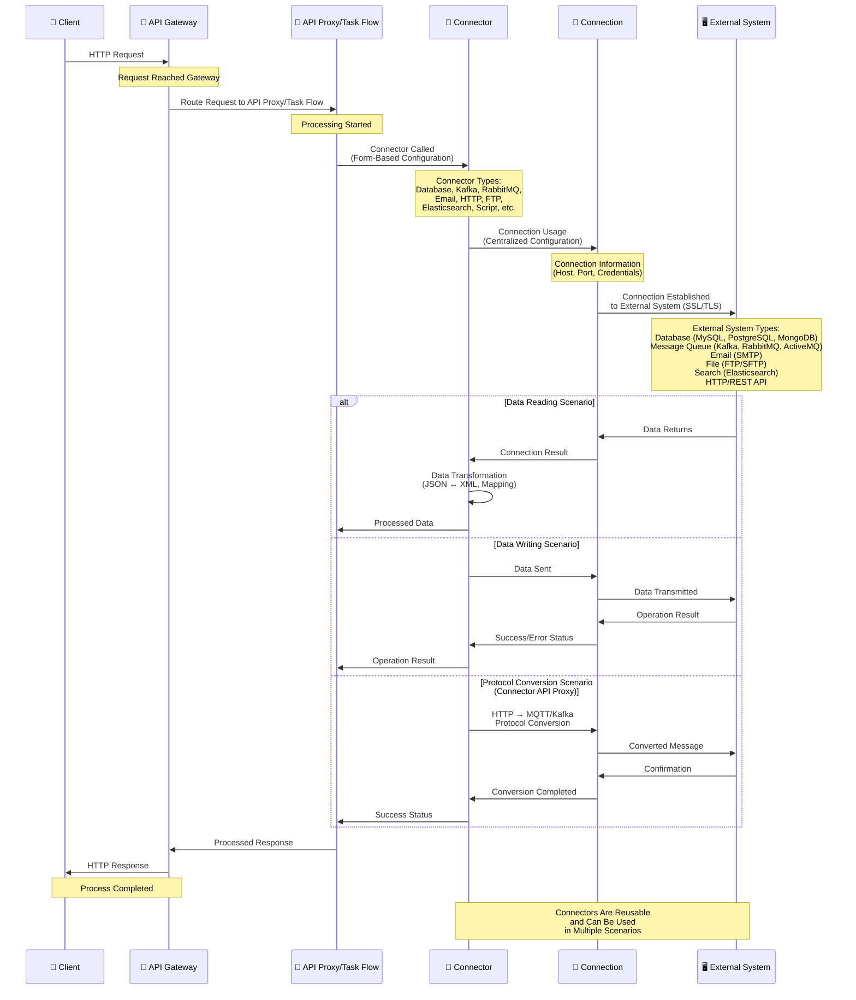

## Connector Features

<CardGroup cols={2}>
  <Card title="Diversity" icon="puzzle-piece">
    15+ different connector types available
  </Card>
  <Card title="Easy to Use" icon="wand-magic-sparkles">
    Form-based configuration, no code writing required
  </Card>
  <Card title="Reusable" icon="recycle">
    Connectors can be used in multiple Task Flows and different areas
  </Card>
  <Card title="Flexible Configuration" icon="sliders">
    Connectors can be configured to suit different scenarios
  </Card>
</CardGroup>

## Connector Usage Flow

The following diagram shows how connectors are used in API Proxies and Task Flows:

## Connector Types

### Database Connectors

<CardGroup cols={2}>
  <Card title="Database Connector" icon="database">
    Connection to SQL databases (MySQL, PostgreSQL, Oracle, MSSQL, DB2)
    
    SQL queries can be executed and database operations can be performed using database connections.
  </Card>
</CardGroup>

### Message Queue Connectors

<CardGroup cols={3}>
  <Card title="Kafka Connector" icon="layer-group">
    Apache Kafka integration
    
    Message publishing operations to message queue. Message publishing for event-driven architectures.
  </Card>
  <Card title="RabbitMQ Connector" icon="inbox">
    RabbitMQ integration
    
    Message publishing to message queue and asynchronous messaging operations.
  </Card>
  <Card title="ActiveMQ Connector" icon="server">
    Apache ActiveMQ integration
    
    Message publishing to message broker and message queue management.
  </Card>
</CardGroup>

### Communication Connectors

<CardGroup cols={3}>
  <Card title="Email Connector" icon="envelope">
    Email sending
    
    Email sending and notification operations with SMTP server configuration.
  </Card>
  <Card title="HTTP/REST Connector" icon="globe">
    HTTP/REST API calls
    
    Communicating with REST APIs and sending/receiving HTTP requests.
  </Card>
  <Card title="Webhook Connector" icon="plug">
    Webhook sending
    
    Webhook listening, sending, and performing event-driven operations.
  </Card>
</CardGroup>

### File and Data Connectors

<CardGroup cols={3}>
  <Card title="FTP Connector" icon="folder">
    FTP/SFTP file transfer
    
    File reading, listing, and transfer operations using FTP connections.
  </Card>
  <Card title="Elasticsearch Connector" icon="magnifying-glass">
    Elasticsearch queries
    
    Data indexing, search queries, and analytics operations with Elasticsearch connections.
  </Card>
  <Card title="Script Connector" icon="code">
    JavaScript/Groovy script execution
    
    Programmatic operations and custom business logic addition using Groovy or JavaScript.
  </Card>
</CardGroup>

### Monitoring and Notification Connectors

<CardGroup cols={2}>
  <Card title="Notification Connector" icon="bell">
    Notification sending
    
    Sending notifications to users when tasks run and notification management.
  </Card>
  <Card title="SNMP Connector" icon="network-wired">
    SNMP trap sending
    
    Trap sending with SNMP protocol and network monitoring operations.
  </Card>
  <Card title="Syslog Connector" icon="file-lines">
    Syslog message sending
    
    Log message sending with Syslog protocol and centralized logging.
  </Card>
  <Card title="Logback Connector" icon="file-code">
    Log record sending
    
    Log record sending with Logback framework and log management.
  </Card>
</CardGroup>

### System Connectors

<CardGroup cols={2}>
  <Card title="Linux Script Connector" icon="terminal">
    Linux command execution
    
    Command and script execution on remote Linux servers via SSH.
  </Card>
</CardGroup>

<Tip>
**Elasticsearch Connector** is particularly important. Querying and visualizing API Traffic analytically in the Apinizer Management Console is only possible by adding the Elasticsearch Connector to the relevant environment.
</Tip>

## Connector Usage Areas

Connectors are used in four main areas in the Apinizer platform:

<CardGroup cols={2}>
  <Card title="In API Integrator Task Flows" icon="diagram-project">
    
    Connections to different systems are established in Task Flows and data exchange is provided. Connectors are visually connected to create integration scenarios.
  </Card>
  
  <Card title="API Proxy Creation" icon="server">
    
    API Proxies can be created with connectors. This enables protocol conversion such as HTTP to MQTT. For example, data can be placed in a message queue via HTTP protocol.
  </Card>
  
  <Card title="Alarm, Monitoring and Anomaly Detection" icon="bell">
    
    Used when executing actions when alarms, monitoring, and anomaly detection situations occur. Operations such as sending notifications and logging in error situations are performed.
  </Card>
  
  <Card title="API Traffic Logs" icon="file-lines">
    
    Used to send API traffic logs to other systems. Logs are sent to logging systems such as Elasticsearch, Graylog, Syslog.
  </Card>
</CardGroup>

## Usage Scenarios

Connectors can be used in various integration scenarios:

<CardGroup cols={2}>
  <Card title="Data Synchronization" icon="arrows-rotate">
    Retrieving data from source system (Database Connector), transforming data, and sending to target system (HTTP Connector)
  </Card>
  <Card title="Publishing to Message Queue" icon="bolt">
    Sending operation results to message queue (Kafka/RabbitMQ/ActiveMQ Connector) and event publishing
  </Card>
  <Card title="File Processing" icon="file">
    Getting file from FTP (FTP Connector), parsing (Script Connector), and saving to database (Database Connector)
  </Card>
  <Card title="Notification and Logging" icon="bell">
    Sending email in alarm and monitoring situations (Email Connector) and logging (Logback/Syslog Connector)
  </Card>
  <Card title="API Traffic Logging" icon="file-lines">
    Sending API traffic logs to systems such as Elasticsearch, Graylog (Elasticsearch/Graylog Connector)
  </Card>
  <Card title="Protocol Conversion" icon="arrows-rotate">
    Providing protocol conversion such as HTTP to MQTT. Placing data in message queue via HTTP protocol (Connector API Proxy)
  </Card>
</CardGroup>

## Connector Configuration

When configuring connectors, the following information is defined:

<AccordionGroup>
  <Accordion title="Connection Selection">
    The connection (Connection) to be used by the connector is selected. The connection must have been defined previously.
  </Accordion>
  
  <Accordion title="Parameters">
    Different parameters are defined according to connector type:
    * SQL queries for database connectors
    * URL, method, headers for HTTP connectors
    * Recipient, subject, content for email connectors
  </Accordion>
  
  <Accordion title="Data Transformation">
    Some connectors can perform data transformation:
    * JSON ↔ XML conversion
    * Data mapping and transformation
    * Format conversions
  </Accordion>
  
  <Accordion title="Error Management">
    Connectors can manage error situations:
    * Retry mechanism
    * Error handling
    * Fallback strategies
  </Accordion>
</AccordionGroup>

## Next Steps

<CardGroup cols={2}>
  <Card title="Connections" icon="plug" href="/en/concepts/core-concepts/connections">
    Learn about the connection concept
  </Card>
  <Card title="API Integrator" icon="diagram-project" href="/en/integrations/api-integrator-task-flow-builder/task-flow-design">
    API Integrator usage
  </Card>
  <Card title="Connectors" icon="list" href="/en/integrations/connectors/overview">
    Review all connector types
  </Card>
  <Card title="Connector API Proxy" icon="server" href="/en/develop/api-proxy-creation/connector-api-proxy-creation">
    Creating Connector API Proxy
  </Card>
  <Card title="Alarm and Monitoring" icon="bell" href="/en/monitor/alarm">
    Alarm and monitoring usage
  </Card>
</CardGroup>

