## Endpoint Features

<CardGroup cols={2}>
  <Card title="Path" icon="route">
    The URL path of the endpoint. For example: `/api/v1/products`
  </Card>
  <Card title="Method" icon="code">
    HTTP method. GET, POST, PUT, DELETE, PATCH, etc.
  </Card>
  <Card title="Operation" icon="gear">
    The operation performed by the endpoint. For example: "Get product list"
  </Card>
  <Card title="Backend Mapping" icon="arrow-right">
    The corresponding endpoint in the backend
  </Card>
</CardGroup>

## Endpoint Processing Flow

The following diagram shows how the endpoint works in the request and response flow and the path rewriting process:

```mermaid
sequenceDiagram
    participant Client as 👤 Client
    participant Gateway as 🚪 API Gateway
    participant ClientRoute as 🔀 Client Route
    participant Endpoint as 📍 Endpoint
    participant Policies as 🛡️ Endpoint Policies
    participant PathRewrite as 🔄 Path Rewriting
    participant Routing as ⚙️ Routing Logic
    participant Upstream as 🎯 Upstream Target
    participant Backend as 🖥️ Backend API
    
    Client->>Gateway: HTTP Request<br/>GET /api/v1/products
    
    Note over Gateway: Request Reached Gateway
    
    Gateway->>ClientRoute: Route to Client Route<br/>Path: /api/v1/*
    
    Note over ClientRoute: Client Route Evaluation<br/>Path, Host, Header, Method
    
    ClientRoute->>Endpoint: Appropriate Endpoint Found<br/>GET /api/v1/products
    
    Note over Endpoint: Endpoint Processing Started
    
    Endpoint->>Policies: Endpoint-Based Policies<br/>Applied
    
    Note over Policies: Endpoint-Specific Policies:<br/>Security, Rate Limiting,<br/>Validation, Transformation
    
    Policies->>PathRewrite: Path Rewriting<br/>Process
    
    Note over PathRewrite: Path Transformation:<br/>Client Path: /api/v1/products<br/>↓ (Path Rewrite)<br/>Backend Path: /products<br/>or<br/>Backend Path: /v2/products
    
    PathRewrite->>Routing: Transformed Path<br/>Forwarded to Routing Logic
    
    Note over Routing: Routing Operations:<br/>Load Balancing<br/>Failover<br/>Path Rewrite Applied
    
    Routing->>Upstream: Upstream Target Selected<br/>With Backend Path
    
    Note over Upstream: Backend Mapping:<br/>Backend Path: /products<br/>Backend Method: GET
    
    Upstream->>Backend: Request Forwarded to Backend<br/>GET http://backend:8080/products
    
    Backend->>Upstream: Response Returns<br/>200 OK
    
    Upstream->>Routing: Processed Response
    
    Routing->>Endpoint: Routing Completed
    
    Endpoint->>Policies: Post-flow Policies<br/>(For Response)
    
    Policies->>ClientRoute: Endpoint Processing Completed
    
    ClientRoute->>Gateway: Processed Response
    
    Gateway->>Client: HTTP Response<br/>200 OK
    
    Note over Client,Gateway: Process Completed
    
    Note over PathRewrite,Backend: Path Rewriting:<br/>Transforms Client Path to Backend Path<br/>and Provides<br/>API Versioning,<br/>Path Simplification
```



## Endpoint Structure

An endpoint contains the following information:

```
GET /api/v1/products
│   │   │  │
│   │   │  └─ Resource
│   │   └─ Version
│   └─ Base Path
└─ HTTP Method
```

### Example Endpoints

<CardGroup cols={2}>
  <Card title="GET /api/v1/products" icon="list">
    Get product list
  </Card>
  <Card title="GET /api/v1/products/{id}" icon="eye">
    Get single product detail
  </Card>
  <Card title="POST /api/v1/products" icon="plus">
    Create new product
  </Card>
  <Card title="PUT /api/v1/products/{id}" icon="pencil">
    Update product
  </Card>
  <Card title="DELETE /api/v1/products/{id}" icon="trash">
    Delete product
  </Card>
</CardGroup>

## Endpoint and Client Route Relationship

Endpoints are defined under Client Route:

```
Client Route: /api/v1/*
│
├─ GET /api/v1/products
├─ GET /api/v1/products/{id}
├─ POST /api/v1/products
├─ PUT /api/v1/products/{id}
└─ DELETE /api/v1/products/{id}
```

<Info>
Client Route is the top-level configuration for endpoints. Multiple endpoints can be defined under a Client Route. Endpoints are specific path and method combinations within the Client Route's path.
</Info>

## Endpoint Configuration

When creating an endpoint, the following information is defined:

<AccordionGroup>
  <Accordion title="Basic Information">
    * **Path**: The URL path of the endpoint
    * **Method**: HTTP method (GET, POST, PUT, DELETE, etc.)
    * **Operation ID**: Unique identifier of the endpoint
    * **Description**: Description of the endpoint
  </Accordion>
  
  <Accordion title="Parameters">
    * **Query Parameters**: Query string parameters in the URL
    * **Path Parameters**: Dynamic parameters in the URL path (e.g., `{id}`)
    * **Header Parameters**: HTTP header parameters
  </Accordion>
  
  <Accordion title="Request and Response">
    * **Request Body**: Request body schema (JSON, XML, etc.)
    * **Response**: Response schema and status codes
    * **Content-Type**: Request and response content types
  </Accordion>
  
  <Accordion title="Backend Mapping">
    * **Backend Path**: Corresponding path in the backend
    * **Backend Method**: HTTP method in the backend
    * **Path Rewrite**: Path transformation rules
  </Accordion>
</AccordionGroup>

## Endpoint Types

<CardGroup cols={2}>
  <Card title="REST Endpoint" icon="code">
    Endpoints for REST APIs
    
    Data exchange in JSON format. Endpoints compliant with RESTful design principles.
  </Card>
  <Card title="SOAP Endpoint" icon="file-code">
    Endpoints for SOAP Web Services
    
    Data exchange in XML format. Configured with WSDL definitions.
  </Card>
  <Card title="gRPC Endpoint" icon="network-wired">
    Endpoints for gRPC services
    
    Data exchange in Protobuf format. High-performance RPC calls.
  </Card>
  <Card title="WebSocket Endpoint" icon="globe">
    Endpoints for WebSocket connections
    
    Real-time communication. Provides bidirectional data exchange.
  </Card>
</CardGroup>

## Endpoint and Policy Relationship

Endpoint-specific policies can be applied:

<CardGroup cols={2}>
  <Card title="Endpoint-Based Security" icon="shield">
    Different security policies for each endpoint
    
    Security mechanisms such as OAuth2, JWT, API Key can be configured at the endpoint level.
  </Card>
  <Card title="Endpoint-Based Rate Limiting" icon="gauge">
    Different rate limit for each endpoint
    
    Request count and bandwidth limits can be defined at the endpoint level.
  </Card>
  <Card title="Endpoint-Based Transformation" icon="arrows-rotate">
    Different transformation rules for each endpoint
    
    JSON ↔ XML conversion, data mapping and transformation can be performed at the endpoint level.
  </Card>
  <Card title="Endpoint-Based Validation" icon="check-circle">
    Different validation rules for each endpoint
    
    Request/Response validation, schema validation can be configured at the endpoint level.
  </Card>
</CardGroup>

## Endpoint Versioning

Endpoints can be versioned:

<CardGroup cols={3}>
  <Card title="Version 1" icon="1">
    `/api/v1/products`
    
    First version. Basic functionality.
  </Card>
  <Card title="Version 2" icon="2">
    `/api/v2/products`
    
    Enhanced version. New features.
  </Card>
  <Card title="Version 3" icon="3">
    `/api/v3/products`
    
    Latest version. Current API.
  </Card>
</CardGroup>

<AccordionGroup>
  <Accordion title="Backward Compatibility">
    Backward compatibility is maintained. Old versions continue to work and new versions do not affect old versions.
  </Accordion>
  
  <Accordion title="Gradual Migration">
    Gradual migration can be performed. Clients can migrate to the new version at their own pace.
  </Accordion>
  
  <Accordion title="Version Management">
    Different versions can be deployed to different environments and can run simultaneously. Versioning enables API lifecycle management.
  </Accordion>
</AccordionGroup>

## Endpoint and Routing Relationship

Endpoints serve as a bridge between Client Route and Upstream Target:

```
Client Request
   │
   ▼
Client Route (/api/v1/*)
   │
   ▼
Endpoint (GET /api/v1/products)
   │
   │ Routing Logic
   │ (Load Balancing, Failover)
   │
   ▼
Upstream Target (http://backend:8080/products)
   │
   ▼
Backend API
```

<Info>
While routing requests from Client Route to Upstream Target, the endpoint applies routing logic and policies.
</Info>

## Next Steps

<CardGroup cols={2}>
  <Card title="Client Route" icon="arrow-right" href="/en/concepts/core-concepts/client-route">
    Learn about the Client Route concept
  </Card>
  <Card title="Routing and Upstream" icon="route" href="/en/concepts/core-concepts/routing-and-upstream">
    Learn about Routing and Upstream concepts
  </Card>
  <Card title="API Proxy Creation" icon="plus" href="/en/develop/api-proxy-olusturma/rest-api-proxy-olusturma">
    API Proxy creation
  </Card>
  <Card title="Policies" icon="shield" href="/en/concepts/core-concepts/what-is-policy">
    Learn about the Policy concept
  </Card>
</CardGroup>

