## Environment Variable Concept

Environment variables are used to securely store sensitive information (passwords, API keys, certificates) or configuration values. In Apinizer, environment variables are defined at the project level and can be of two types:

* **Global (All Environments)**: Uses the same value in all environments
* **Environment-Specific**: Different values can be defined for each environment

<CardGroup cols={2}>
  <Card title="Encryption Support" icon="lock">
    Sensitive information can be stored encrypted
  </Card>
  <Card title="Level-Based" icon="layer-group">
    Can be defined at environment or project level
  </Card>
  <Card title="Security" icon="shield">
    Encrypted variables are stored securely
  </Card>
  <Card title="Reusability" icon="recycle">
    Can be used in multiple API Proxies or Task Flows
  </Card>
</CardGroup>

## Environment Variable Resolution Flow

The following diagram shows how environment variables are resolved at runtime and how values are retrieved according to the environment:

```mermaid
sequenceDiagram
    participant Client as 👤 Client
    participant Gateway as 🚪 API Gateway
    participant Proxy as 🔀 API Proxy
    participant Config as ⚙️ Configuration
    participant VarResolver as 🔍 Variable Resolver
    participant EnvStore as 📦 Environment Store
    participant ProjectStore as 📁 Project Store
    participant Decrypt as 🔐 Decryption
    participant Backend as 🖥️ Backend API
    
    Client->>Gateway: HTTP Request
    
    Gateway->>Proxy: Route Request to API Proxy<br/>(Environment: Production)
    
    Note over Proxy: Reading Configuration
    
    Proxy->>Config: Variable Usage Detected<br/>in Configuration<br/>${BACKEND_URL}
    
    Config->>VarResolver: Variable Resolution<br/>Request
    
    Note over VarResolver: Environment Variable<br/>Resolution Started<br/>Variable: BACKEND_URL<br/>Environment: Production
    
    VarResolver->>EnvStore: 1️⃣ Environment-Level<br/>Encrypted Check
    
    alt Environment-Level Encrypted Found
        EnvStore->>Decrypt: Encrypted Value<br/>Decrypted
        Decrypt->>VarResolver: Value Decrypted<br/>prod-api.example.com
        VarResolver->>Config: ✅ Value Returned<br/>(Highest Priority)
    else Environment-Level Encrypted Not Found
        VarResolver->>EnvStore: 2️⃣ Environment-Level<br/>Unencrypted Check
        
        alt Environment-Level Unencrypted Found
            EnvStore->>VarResolver: Value Returned<br/>prod-api.example.com
            VarResolver->>Config: ✅ Value Returned<br/>(Second Priority)
        else Environment-Level Unencrypted Not Found
            VarResolver->>ProjectStore: 3️⃣ Project-Level<br/>Encrypted Check
            
            alt Project-Level Encrypted Found
                ProjectStore->>Decrypt: Encrypted Value<br/>Decrypted
                Decrypt->>VarResolver: Value Decrypted<br/>api.example.com
                VarResolver->>Config: ✅ Value Returned<br/>(Third Priority)
            else Project-Level Encrypted Not Found
                VarResolver->>ProjectStore: 4️⃣ Project-Level<br/>Unencrypted Check
                
                alt Project-Level Unencrypted Found
                    ProjectStore->>VarResolver: Value Returned<br/>api.example.com
                    VarResolver->>Config: ✅ Value Returned<br/>(Lowest Priority)
                else Variable Not Found
                    VarResolver->>Config: ❌ Error: Variable Not Found
                end
            end
        end
    end
    
    Config->>Proxy: Configuration Resolved<br/>Backend URL: prod-api.example.com
    
    Note over Proxy: Processing Continues<br/>with Resolved Value
    
    Proxy->>Backend: Request Forwarded to Backend<br/>https://prod-api.example.com/api/products
    
    Backend->>Proxy: Response Returns<br/>200 OK
    
    Proxy->>Gateway: Processed Response
    
    Gateway->>Client: HTTP Response<br/>200 OK
    
    Note over Client,Gateway: Process Completed
    
    Note over VarResolver,Decrypt: Priority Order:<br/>1. Environment-Level Encrypted<br/>2. Environment-Level Unencrypted<br/>3. Project-Level Encrypted<br/>4. Project-Level Unencrypted<br/><br/>Encrypted values<br/>are decrypted at runtime
```

## Environment Variable Types

<CardGroup cols={2}>
  <Card title="Encrypted" icon="lock">
    Used for sensitive information
    
    Sensitive information such as passwords, API keys, certificates, and tokens are stored encrypted.
    
    <Warning>
    **Important**: Encrypted variables are encrypted irreversibly. Values are only decrypted during use.
    </Warning>
  </Card>
  
  <Card title="Unencrypted" icon="unlock">
    Used for configuration values
    
    URLs, port numbers, flags, and other configuration values are stored unencrypted.
  </Card>
</CardGroup>

<AccordionGroup>
  <Accordion title="Encrypted Variables">
    * **Passwords**: Database passwords, API keys
    * **Certificates**: SSL/TLS certificates
    * **Tokens**: OAuth tokens, JWT secrets
    * **Other Sensitive Information**: All values requiring security
  </Accordion>
  
  <Accordion title="Unencrypted Variables">
    * **URLs**: Backend API URLs
    * **Port Numbers**: Port values
    * **Flags**: Boolean values
    * **Other Configurations**: General configuration values
  </Accordion>
</AccordionGroup>

## Environment Variable Levels

<CardGroup cols={2}>
  <Card title="Environment-Level" icon="server">
    Valid in a specific environment
    
    Can be used by all API Proxies and Task Flows in that environment. Has higher priority than project-level variables.
  </Card>
  
  <Card title="Project-Level" icon="folder">
    Valid in a specific project
    
    Can be used by all API Proxies and Task Flows in that project. Has lower priority than environment-level variables.
  </Card>
</CardGroup>

<AccordionGroup>
  <Accordion title="Environment-Level Usage Scenarios">
    * Environment-based backend URLs
    * Environment-based API keys
    * Environment-based configuration values
    * Environment-based database connection information
  </Accordion>
  
  <Accordion title="Project-Level Usage Scenarios">
    * Project-based configuration values
    * Project-based API keys
    * Project-based general settings
    * Project-based common values
  </Accordion>
</AccordionGroup>

## Environment Variable Priority Order

Variable resolution order (from highest to lowest):

<CardGroup cols={2}>
  <Card title="1. Environment-Level Encrypted" icon="lock" color="#e74c3c">
    Highest priority
    
    Environment-level encrypted variables.
  </Card>
  <Card title="2. Environment-Level Unencrypted" icon="unlock" color="#f39c12">
    Second priority
    
    Environment-level unencrypted variables.
  </Card>
  <Card title="3. Project-Level Encrypted" icon="lock" color="#3498db">
    Third priority
    
    Project-level encrypted variables.
  </Card>
  <Card title="4. Project-Level Unencrypted" icon="unlock" color="#95a5a6">
    Lowest priority
    
    Project-level unencrypted variables.
  </Card>
</CardGroup>

<Info>
**Note**: If a variable with the same name is defined at both environment and project levels, the environment-level variable is used.
</Info>

## Working Logic

<CardGroup cols={3}>
  <Card title="1. Definition" icon="plus-circle">
    Environment variables are defined at the project level
    
    * **Global**: Same value in all environments
    * **Environment-Specific**: Different value for each environment
  </Card>
  
  <Card title="2. Usage" icon="code">
    Used in configuration fields in `${variableName}` format
    
    * Backend address: `${BACKEND_URL}`
    * Database: `jdbc:mysql://${DB_HOST}:${DB_PORT}/${DB_NAME}`
    * API key: `${API_KEY}`
  </Card>
  
  <Card title="3. Runtime Resolution" icon="play">
    Automatically resolved when API Proxy runs
    
    * Variable expressions are detected
    * Environment value is retrieved
    * Secrets are decrypted
    * Replaced with actual value
  </Card>
</CardGroup>

<AccordionGroup>
  <Accordion title="Example Scenario">
    **Configuration:**
    * Development: `BACKEND_URL = dev-api.example.com`
    * Production: `BACKEND_URL = api.example.com`
    * In configuration: `${BACKEND_URL}`
    
    **Runtime Results:**
    * In Development environment: `dev-api.example.com`
    * In Production environment: `api.example.com`
  </Accordion>
</AccordionGroup>

## Environment Variable Usage Format

Environment variables are referenced in configuration fields using a special format.

### Format Structure

| Format | Description | Example |
|--------|-------------|---------|
| `${variableName}` | Basic usage format | `${BACKEND_URL}` |
| `text${variableName}` | Combining with text | `https://${API_HOST}` |
| `${variableName}text` | Combining with text | `${API_PORT}/api` |
| `text${variable1}text${variable2}` | Multiple variables | `jdbc:mysql://${DB_HOST}:${DB_PORT}/${DB_NAME}` |

### Format Rules

<CardGroup cols={2}>
  <Card title="Start Character" icon="arrow-right">
    Must start with `${`
  </Card>
  <Card title="End Character" icon="arrow-left">
    Must end with `}`
  </Card>
  <Card title="Variable Name" icon="tag">
    Variable name in the middle (without spaces)
  </Card>
  <Card title="Case Sensitivity" icon="text-height">
    Variable name is case-sensitive
  </Card>
</CardGroup>

## Environment Variable Usage Locations

Environment variables can be used in various configuration fields in the Apinizer platform. **Environment Variable Selection Dialog** is only available in certain fields.

<CardGroup cols={3}>
  <Card title="API Proxy - Routing" icon="route">
    Upstream Routing addresses
    
    **Location:** API Proxy > Upstream/Routing Tab > Define Address(es)
    
    Used for environment-based routing in Backend API addresses.
  </Card>
  
  <Card title="Database Connection" icon="database">
    Database connection configuration
    
    **Location:** Administration > Connection Management > Database Connection Pool
    
    Environment-based management in JDBC URL, Username, Password fields.
  </Card>
  
  <Card title="LDAP Connection" icon="users">
    LDAP connection configuration
    
    **Location:** Administration > Connection Management > LDAP Connection Pool
    
    Environment-based management in LDAP URL, Bind DN, Bind Password fields.
  </Card>
</CardGroup>

<AccordionGroup>
  <Accordion title="API Proxy - Routing Details">
    | Feature | Description |
    |---------|-------------|
    | **Location** | API Proxy > Upstream/Routing Tab > Define Address(es) |
    | **Field** | Backend API address input field |
    | **Usage** | Environment-based routing in Backend API addresses |
    | **Access** | By clicking the list icon button on the right side of the address input field |
    
    **Usage Scenario:** To use different backend addresses in different environments
  </Accordion>
  
  <Accordion title="Database Connection Details">
    | Feature | Description |
    |---------|-------------|
    | **Location** | Administration > Connection Management > Connection Pool Def DB |
    | **Fields** | JDBC URL, Username, Password |
    | **Usage** | Environment-based management in database connection information |
    | **Dialog Access** | By clicking the list icon button on the right side of each field |
    | **Secret Usage** | Password field must be marked as secret |
    
    **Usage Scenario:** To use different database connection information in different environments
  </Accordion>
  
  <Accordion title="LDAP Connection Details">
    | Feature | Description |
    |---------|-------------|
    | **Location** | Administration > Connection Management > Connection Pool Def LDAP |
    | **Fields** | LDAP URL, Bind DN, Bind Password |
    | **Usage** | Environment-based management in LDAP connection information |
    | **Dialog Access** | By clicking the list icon button on the right side of each field |
    | **Secret Usage** | Bind Password must be marked as secret |
    
    **Usage Scenario:** To use different LDAP connection information in different environments
  </Accordion>
</AccordionGroup>

## Usage Scenarios and Examples

<AccordionGroup>
  <Accordion title="Backend API Address Management">
    **Problem:** Different backend API addresses are used in different environments.
    
    **Solution:**
    
    **Creating Environment Variable:**
    * Key Name: `BACKEND_API_URL`
    * Type: Environment-Specific
    * Development: `https://dev-api.example.com`
    * Test: `https://test-api.example.com`
    * Production: `https://api.example.com`
    
    **Usage in Routing:**
    * Address: `${BACKEND_API_URL}`
    
    **Result:**
    * In Development environment, requests go to `https://dev-api.example.com`
    * In Test environment, requests go to `https://test-api.example.com`
    * In Production environment, requests go to `https://api.example.com`
  </Accordion>
  
  <Accordion title="Database Connection Management">
    **Problem:** Different databases are used in each environment.
    
    **Solution:**
    
    **Environment Variables:**
    * `DB_HOST`: Development=`dev-db.example.com`, Production=`prod-db.example.com`
    * `DB_PORT`: Global=`3306`
    * `DB_NAME`: Development=`dev_db`, Production=`prod_db`
    * `DB_USER`: Development=`dev_user`, Production=`prod_user`
    * `DB_PASSWORD`: Development=`dev_pass`, Production=`prod_pass` (Secret)
    
    **Usage in Connector:**
    * Connection String: `jdbc:mysql://${DB_HOST}:${DB_PORT}/${DB_NAME}`
    * Username: `${DB_USER}`
    * Password: `${DB_PASSWORD}`
    
    **Result:**
    * Development: `jdbc:mysql://dev-db.example.com:3306/dev_db`
    * Production: `jdbc:mysql://prod-db.example.com:3306/prod_db`
  </Accordion>
  
  <Accordion title="API Key Management">
    **Problem:** Different API keys are used for external services.
    
    **Solution:**
    
    **Environment Variable:**
    * Key Name: `EXTERNAL_SERVICE_API_KEY`
    * Type: Environment-Specific
    * Development: `dev-key-abc123` (Secret)
    * Production: `prod-key-xyz789` (Secret)
    
    **Usage in Policy:**
    * Header Name: `X-API-Key`
    * Header Value: `${EXTERNAL_SERVICE_API_KEY}`
    
    **Result:**
    * Development: `X-API-Key: dev-key-abc123`
    * Production: `X-API-Key: prod-key-xyz789`
  </Accordion>
</AccordionGroup>

## Environment Variable Creation

Environment variable creation steps:

<AccordionGroup>
  <Accordion title="Step 1: Adding New Environment Variable">
    * Go to **Environment Variables** page
    * Click the **"Create"** button in the upper right corner
    * Environment Variable editing window opens
  </Accordion>
  
  <Accordion title="Step 2: Entering Basic Information">
    * **Key Name (Variable Name)**:
      * Required field
      * Must be unique within the project
      * Name check is performed automatically
      * Valid name: Green checkmark
      * Existing name: Red warning sign
      
    * **Description**:
      * Optional field
      * Describes what the variable is used for
  </Accordion>
  
  <Accordion title="Step 3: Type Selection">
    * **Environment-Specific**:
      * Different values can be defined for each environment
      * Selected when creating new record
      * Cannot be changed after record is created
      
    * **Global (All Environments)**:
      * Same value used in all environments
      * Selected when creating new record
      * Cannot be changed after record is created
    
    <Info>
    **Important**: Type selection can only be done when creating a new record. The type of existing records cannot be changed.
    </Info>
  </Accordion>
  
  <Accordion title="Step 4: Value Definition">
    **For Environment-Specific Variables:**
    
    * **Adding Environment**: Click "Add Environment" button to add new environment
    * **Environment Selection**: Select an environment for each value
      * Existing environments are selected from the list
      * Custom environment name can be entered with "Custom..." option
    * **Entering Value**: Enter value for each environment
    * **Secret Setting**: Check "Secret" checkbox for sensitive information
      * Secret values are masked after saving (`***********`)
      * Secret values are stored encrypted
      * If value is not changed during update, existing value is preserved
    
    **For Global Variables:**
    
    * **Global Value**: Enter a single value (valid for all environments)
    * **Secret Setting**: Check "Secret" checkbox for sensitive information
  </Accordion>
  
  <Accordion title="Step 5: Saving and Deployment">
    * **Form Validation**: All required fields must be filled and name must be valid
    * Click **"Save and Deploy"** button
    * **Confirmation Dialog**:
      * You are asked to enter the variable name again (for security)
      * Affected components are listed:
        * API Proxy Routing settings
        * Policy Configuration settings
        * Connector settings
        * Other configuration settings
    * **Deployment Result**:
      * Automatically deployed to all running environments
      * Deployment results are shown
    
    <Warning>
    **Important**: Values marked as Secret cannot be viewed again after saving.
    </Warning>
  </Accordion>
</AccordionGroup>

## Environment Variable Editing

### Opening the Edit Modal

The edit modal can be opened in the following ways:

| Method | Description |
|--------|-------------|
| **Clicking from List** | Click on the environment variable name |
| **Selecting from Menu** | Select "Edit" from the menu at the end of the row |

### Differences in Edit Modal

| Feature | New Record | Edit |
|---------|------------|------|
| **Modal Title** | "Add Environment Variable" | "Edit Environment Variable" |
| **Type Selection** | Active (can be changed) | Inactive (cannot be changed) |
| **Secret Values** | Visible normally | Visible masked (`***********`) |
| **Secret Checkbox** | Active | Inactive for saved secrets |

## Best Practices

<AccordionGroup>
  <Accordion title="Security">
    * Always store sensitive information encrypted
    * Use encrypted for passwords, API keys, certificates
    * Regularly change passwords
  </Accordion>
  
  <Accordion title="Organization">
    * Name variables consistently
    * Properly separate environment and project level variables
    * Create documentation
  </Accordion>
  
  <Accordion title="Management">
    * Clean up unused variables
    * Regularly review variable usage
    * Perform version control
  </Accordion>
</AccordionGroup>

## Next Steps

<CardGroup cols={2}>
  <Card title="Variable" icon="code" href="/en/concepts/core-concepts/variable">
    Learn about the Variable concept
  </Card>
  <Card title="Environment Variables" icon="gear" href="/en/develop/environment-variables">
    Environment Variables management
  </Card>
  <Card title="Secret Manager" icon="lock" href="/en/admin/secrets-management/sertifikalar">
    Secret Manager usage
  </Card>
  <Card title="API Proxy Configuration" icon="network-wired" href="/en/develop/api-proxy-konfigurasyonu/settings">
    API Proxy configuration
  </Card>
</CardGroup>

