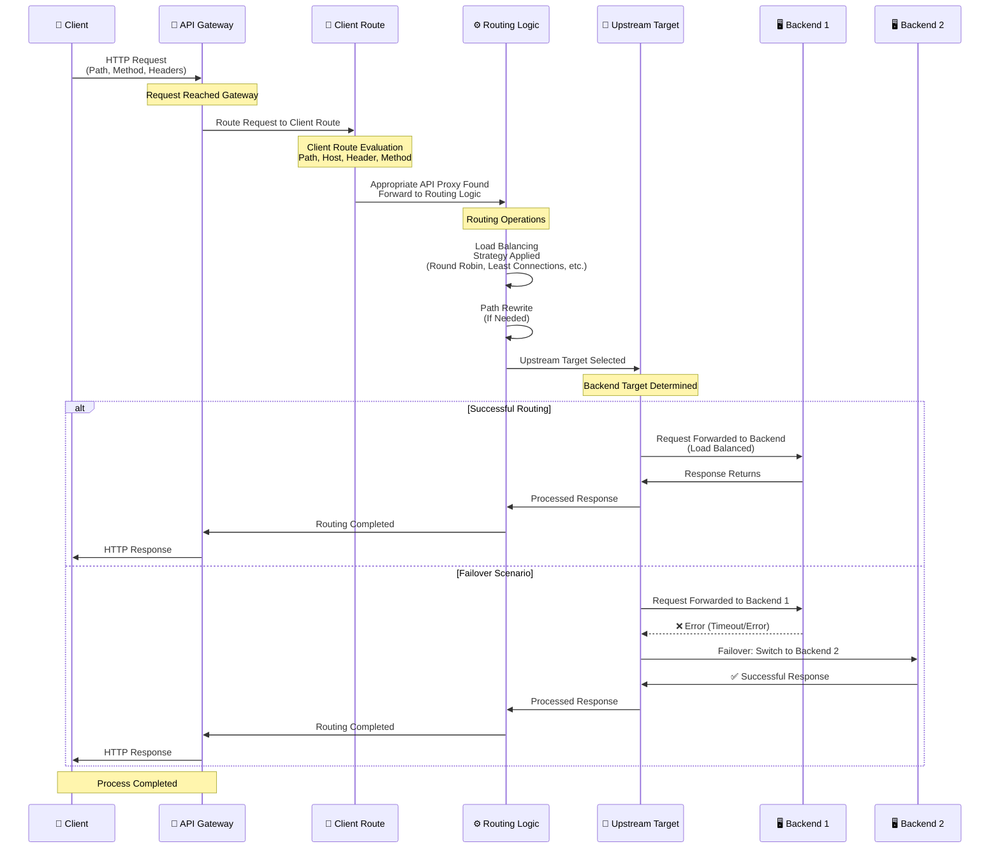

## Routing Concept

Routing consists of two fundamental components in an API Proxy:

<CardGroup cols={2}>
  <Card title="Client Route" icon="arrow-right" href="/en/concepts/core-concepts/client-route">
    The entry point where requests enter the API Proxy. Clients send requests to this endpoint.
  </Card>
  <Card title="Upstream Target" icon="arrow-left" href="#upstream-target">
    The backend API where requests are routed. The API Proxy sends requests to this address.
  </Card>
</CardGroup>

## Routing Flow

The following diagram shows how request and response flow occurs through the Gateway with the Routing and Upstream mechanism:



<CardGroup cols={1}>
  <Card title="1. Client Request" icon="arrow-right">
    Client sends request to API Proxy
  </Card>
  <Card title="2. Client Route" icon="network-wired">
    Entry point where requests enter the API Proxy<br/>
    Path, Method, Protocol and Port definitions
  </Card>
  <Card title="3. Routing Logic" icon="route">
    Load Balancing, Failover and routing logic is applied
  </Card>
  <Card title="4. Upstream Target" icon="arrow-left">
    Backend API where requests are routed<br/>
    Backend address, protocol and configuration
  </Card>
  <Card title="5. Backend API" icon="server">
    Processed request is sent to backend API
  </Card>
</CardGroup>

## Upstream Target

Upstream Target is the address of the backend API to which requests from clients in an API Proxy are routed. Upstream Target is the point where the API Proxy communicates with the backend.

### Upstream Target Overview

Upstream and target concepts are fundamental concepts used when routing to backend services in API Proxies. Upstream Target represents the physical or logical address of the backend API. The API Proxy routes requests coming from Client Route to this target.

<CardGroup cols={2}>
  <Card title="Backend Address" icon="server">
    URL or IP address of the Backend API
  </Card>
  <Card title="Protocol" icon="globe">
    HTTP, HTTPS, gRPC, WebSocket protocols
  </Card>
  <Card title="Load Balancing" icon="scale-balanced">
    Load balancing between multiple backend instances
  </Card>
  <Card title="Failover" icon="heart-pulse">
    Switching to alternative backend in error conditions
  </Card>
</CardGroup>

### Upstream and Target

**Upstream**: Configuration where backend services to which the API Proxy routes requests are defined. An upstream can contain multiple targets.

**Target**: Backend service addresses defined within an upstream. Each target contains a URL and necessary configuration information.

### Upstream Target Structure

An Upstream Target contains the following information:

```
http://backend-service:8080/api/products
│     │                │    │
│     │                │    └─ Backend Path
│     │                └─ Port
│     └─ Host/Service Name
└─ Protocol
```

### Example Upstream Targets

<CardGroup cols={2}>
  <Card title="HTTP Target" icon="globe">
    ```
    http://product-service:8080
    ```
  </Card>
  <Card title="HTTPS Target" icon="lock">
    ```
    https://api.backend.com/v1
    ```
  </Card>
  <Card title="gRPC Target" icon="network-wired">
    ```
    grpc://backend-service:50051
    ```
  </Card>
  <Card title="WebSocket Target" icon="plug">
    ```
    ws://websocket-service:8080
    ```
  </Card>
</CardGroup>

### Upstream Target Configuration

When creating an Upstream Target, the following information is defined:

<AccordionGroup>
  <Accordion title="Basic Configuration">
    * **URL**: Address of the Backend API
    * **Protocol**: HTTP, HTTPS, gRPC, WebSocket
    * **Host**: Backend server name or IP
    * **Port**: Backend port number
    * **Path**: Backend path (optional)
    * **Path Rewrite**: Changing backend path (optional)
  </Accordion>
  
  <Accordion title="Path Rewrite">
    Path rewrite can be performed in Upstream Target:
    
    ```
    Client Route: /api/v1/products
       │
       ▼ (Path Rewrite)
    Upstream Target: /products
       │
       ▼
    Backend API: http://backend:8080/products
    ```
    
    **Path Rewrite Examples:**
    * `/api/v1/products` → `/products` (prefix removal)
    * `/api/v1/products` → `/v2/products` (version change)
    * `/api/products/{id}` → `/products/{id}` (path simplification)
  </Accordion>
  
  <Accordion title="Timeout Settings">
    * **Connection Timeout**: Connection timeout
    * **Read Timeout**: Read timeout
    * **Write Timeout**: Write timeout
  </Accordion>
</AccordionGroup>

### Upstream Target Types

<CardGroup cols={2}>
  <Card title="Single Target" icon="server">
    Single backend instance:
    ```
    http://backend:8080
    ```
  </Card>
  <Card title="Multiple Targets" icon="layer-group">
    Multiple backend instances (Load Balanced):
    ```
    http://backend1:8080
    http://backend2:8080
    http://backend3:8080
    ```
  </Card>
  <Card title="Dynamic Target" icon="arrows-rotate">
    Backend determined dynamically:
    ```
    Variable-based target selection
    ```
  </Card>
</CardGroup>

## Routing Types

The Apinizer platform provides routing support for different protocols:

<CardGroup cols={3}>
  <Card title="HTTP Routing" icon="globe" href="#http-routing">
    Routing for HTTP/HTTPS protocol. Used for REST APIs.
  </Card>
  <Card title="gRPC Routing" icon="network-wired" href="#grpc-routing">
    Routing for gRPC protocol. Used for microservice architectures.
  </Card>
  <Card title="WebSocket Routing" icon="plug" href="#websocket-routing">
    Routing for WebSocket protocol. Used for real-time communication.
  </Card>
</CardGroup>

## HTTP Routing

HTTP Routing is routing support for REST APIs using HTTP/HTTPS protocol.

### HTTP Routing Features

<CardGroup cols={2}>
  <Card title="Protocol Support" icon="globe">
    * HTTP/1.1
    * HTTP/2
    * HTTPS (TLS/SSL)
  </Card>
  <Card title="Method Support" icon="code">
    * GET, POST, PUT, DELETE
    * PATCH, HEAD, OPTIONS
    * Custom methods
  </Card>
  <Card title="Content-Type" icon="file">
    * application/json
    * application/xml
    * application/x-www-form-urlencoded
    * multipart/form-data
  </Card>
  <Card title="Features" icon="star">
    * Path matching (exact, prefix, regex)
    * Query parameter handling
    * Header manipulation
    * Body transformation
    * Host-based routing
    * Method-based routing
  </Card>
</CardGroup>

### HTTP Routing Configuration

```yaml
client_route:
  path: /api/v1/*
  method: GET, POST, PUT, DELETE
  protocol: https
  port: 443

upstream_target:
  url: http://backend-service:8080
  protocol: http
```

### HTTP Routing Usage Scenarios

* **REST API Gateway**: Management of REST APIs
* **API Versioning**: API versioning
* **Legacy System Integration**: Integration with legacy systems
* **Public API Exposure**: Exposing APIs to the outside world

For detailed information, see the [HTTP Routing](/en/develop/routing/http-routing) page.

## gRPC Routing

gRPC Routing is routing support for microservices using gRPC protocol.

### gRPC Routing Features

<CardGroup cols={2}>
  <Card title="Protocol Support" icon="network-wired">
    * gRPC (over HTTP/2)
    * gRPC-Web
    * TLS/SSL support
  </Card>
  <Card title="Service Definition" icon="file-code">
    * Protocol Buffers (Protobuf)
    * Service definition
    * Method routing
  </Card>
  <Card title="Features" icon="star">
    * Unary calls
    * Server streaming
    * Client streaming
    * Bidirectional streaming
  </Card>
  <Card title="Load Balancing" icon="scale-balanced">
    * gRPC-aware load balancing
    * Failover
  </Card>
</CardGroup>

### gRPC Routing Configuration

```yaml
client_route:
  path: /com.example.ProductService/*
  protocol: grpc
  port: 50051

upstream_target:
  url: grpc://backend-service:50051
  protocol: grpc
  service: com.example.ProductService
```

### gRPC Routing Usage Scenarios

* **Microservice Communication**: Communication between microservices
* **High Performance APIs**: High performance requirements
* **Streaming APIs**: Real-time data streaming
* **Internal APIs**: Internal system APIs

For detailed information, see the [gRPC Routing](/en/develop/routing/grpc-routing) page.

## WebSocket Routing

WebSocket Routing is routing support for real-time applications using WebSocket protocol.

### WebSocket Routing Features

<CardGroup cols={2}>
  <Card title="Protocol Support" icon="globe">
    * WebSocket (ws://)
    * Secure WebSocket (wss://)
    * HTTP Upgrade
  </Card>
  <Card title="Connection Management" icon="plug">
    * Connection establishment
    * Connection persistence
    * Connection pooling
  </Card>
  <Card title="Message Processing" icon="message">
    * Text messages
    * Binary messages
    * Message routing
  </Card>
  <Card title="Features" icon="star">
    * Subprotocol support
    * Ping/Pong frames
    * Connection timeout
  </Card>
</CardGroup>

### WebSocket Routing Configuration

```yaml
client_route:
  path: /ws/*
  protocol: wss
  port: 443

upstream_target:
  url: ws://backend-service:8080
  protocol: ws
  subprotocol: chat
```

### WebSocket Routing Usage Scenarios

* **Real-time Chat**: Real-time chat applications
* **Live Updates**: Live updates
* **Gaming**: Gaming applications
* **IoT**: Communication with IoT devices

For detailed information, see the [WebSocket Routing](/en/develop/routing/websocket-routing) page.

## Protocol Comparison

| Feature | HTTP | gRPC | WebSocket |
|---------|------|------|------------|
| **Protocol** | HTTP/1.1, HTTP/2 | HTTP/2 | WebSocket |
| **Data Format** | JSON, XML | Protobuf | Text, Binary |
| **Communication** | Request-Response | Request-Response, Streaming | Bidirectional |
| **Performance** | Medium | High | High (persistent) |
| **Usage** | REST APIs | Microservices | Real-time apps |
| **Browser Support** | ✅ | ⚠️ (gRPC-Web) | ✅ |

## Protocol Selection Guide

<AccordionGroup>
  <Accordion title="When Should HTTP Be Used?">
    * For REST APIs
    * For browser-based applications
    * For wide compatibility requirements
    * For JSON/XML data formats
  </Accordion>
  
  <Accordion title="When Should gRPC Be Used?">
    * For microservice architectures
    * For high performance requirements
    * For streaming requirements
    * For internal system APIs
  </Accordion>
  
  <Accordion title="When Should WebSocket Be Used?">
    * For real-time communication
    * For live updates
    * For bidirectional communication
    * For low latency requirements
  </Accordion>
</AccordionGroup>

## Load Balancing Strategies

If there are multiple instances in the backend, load balancing strategies are used. Load balancing ensures equal traffic distribution, high availability, and performance improvement.

### Load Balancing Strategies

<CardGroup cols={3}>
  <Card title="Round Robin" icon="rotate">
    Requests are distributed to all backend instances in order. It is a simple and understandable strategy, suitable for situations where all backends have similar capacity.
  </Card>
  <Card title="Least Connections" icon="users">
    Request is sent to the backend with the least connections. Distributes load better and is suitable for long-running requests.
  </Card>
  <Card title="Weighted Round Robin" icon="scale-balanced">
    Weights are assigned to backends and requests are distributed accordingly. Suitable for backends with different capacities.
  </Card>
</CardGroup>

### Strategy Comparison

| Strategy | Load Distribution | Complexity | Usage |
|----------|-------------------|------------|-------|
| **Round Robin** | Equal | Low | General use |
| **Least Connections** | Good | Medium | Variable durations |
| **Weighted Round Robin** | Weighted | Medium | Different capacities |


### Best Practices

<AccordionGroup>
  <Accordion title="Strategy Selection">
    * Select strategy according to backend capacities
    * Analyze traffic patterns
    * Evaluate request durations
  </Accordion>
  
  <Accordion title="Monitoring">
    * Monitor backend load distribution
    * Track performance metrics
    * Regularly check backend statuses
  </Accordion>
</AccordionGroup>


## Routing Configuration

### Client Route Configuration

Client Route defines the endpoint where requests from clients are received:

<CardGroup cols={2}>
  <Card title="Path" icon="link">
    `/api/v1/products`
  </Card>
  <Card title="Method" icon="code">
    GET, POST, PUT, DELETE, etc.
  </Card>
  <Card title="Protocol" icon="globe">
    HTTP, HTTPS
  </Card>
  <Card title="Port" icon="network-wired">
    443, 80, etc.
  </Card>
</CardGroup>

### Upstream Target Configuration

Upstream Target defines the address of the backend API:

<CardGroup cols={2}>
  <Card title="URL" icon="link">
    `http://backend-service:8080`
  </Card>
  <Card title="Protocol" icon="globe">
    HTTP, HTTPS, gRPC, WebSocket
  </Card>
  <Card title="Timeout" icon="clock">
    Request timeout
  </Card>
</CardGroup>

## Routing Features

### Dynamic Routing

Thanks to Apinizer's Client Route feature, dynamic routing can be performed:

<CardGroup cols={2}>
  <Card title="Host-Based Routing" icon="globe">
    Routing to different proxies based on Host header value:
    ```
    Host: api.example.com → Proxy A
    Host: test.example.com → Proxy B
    ```
  </Card>
  <Card title="Header-Based Routing" icon="file-lines">
    Routing based on HTTP header values:
    ```
    X-Environment: production → Proxy A
    X-Environment: test → Proxy B
    ```
  </Card>
  <Card title="Method-Based Routing" icon="code">
    Routing based on HTTP method:
    ```
    GET /api/products → Proxy A
    POST /api/products → Proxy B
    ```
  </Card>
  <Card title="Combination-Based Routing" icon="puzzle-piece">
    Routing based on host, header and method combinations
  </Card>
</CardGroup>

### Routing Priority Order

The Gateway evaluates incoming requests according to the following priority order:

<CardGroup cols={4}>
  <Card title="1. Relative Path" icon="1">
    Highest priority
  </Card>
  <Card title="2. Hosts" icon="2">
    Host header check
  </Card>
  <Card title="3. Headers" icon="3">
    Header check
  </Card>
  <Card title="4. Methods" icon="4">
    Lowest priority
  </Card>
</CardGroup>

<Info>
  **Matching Logic:**
  * **Hosts**: When multiple hosts are defined, it works with **OR** logic (any one matching is sufficient)
  * **Headers**: When multiple headers are defined, it works with **AND** logic (all must match)
</Info>

<AccordionGroup>
  <Accordion title="Path Matching">
    * Exact match: Exact matching
    * Prefix match: Prefix matching (more specific paths are prioritized)
    * Regex match: Regular expression matching
    
    **Path Priority:**
    ```
    /api/v1/products/{id} → More specific (prioritized)
    /api/v1/products      → More general
    ```
  </Accordion>
  
  <Accordion title="Method Matching">
    * HTTP method check (GET, POST, PUT, DELETE)
    * Method-based routing
    * Method override support
    * If method is not defined, all methods are accepted
  </Accordion>
  
  <Accordion title="Header Matching">
    * Header-based routing
    * Content-Type based routing
    * Custom header based routing
    * **AND logic**: All headers must match
  </Accordion>
  
  <Accordion title="Host Matching">
    * Host header based routing
    * Wildcard hostname support (*.example.com, example.*)
    * **OR logic**: Any host matching is sufficient
  </Accordion>
  
  <Accordion title="Query Parameter Matching">
    * Query parameter based routing
    * Parameter value based routing
  </Accordion>
</AccordionGroup>

## Failover and Retry

### Failover

When one of the backend instances gives an error:

<CardGroup cols={3}>
  <Card title="Automatic Failover" icon="arrows-rotate">
    Automatic switch to another instance
  </Card>
  <Card title="Circuit Breaker" icon="shield">
    Temporarily disabling in error conditions
  </Card>
</CardGroup>

### Retry

Retry mechanism for temporary errors:

<CardGroup cols={3}>
  <Card title="Retry Count" icon="repeat">
    Retry count
  </Card>
  <Card title="Retry Delay" icon="clock">
    Retry interval
  </Card>
  <Card title="Retry Conditions" icon="list-check">
    Which errors retry will be performed for
  </Card>
</CardGroup>


## Usage Scenarios

<CardGroup cols={2}>
  <Card title="Load Balancing" icon="scale-balanced">
    Load balancing can be performed by defining multiple targets
  </Card>
  <Card title="Different Upstreams" icon="layer-group">
    Different upstreams can be used to route to different backend services
  </Card>
  <Card title="Path Rewrite" icon="arrows-rotate">
    API versioning and path transformations can be performed with path rewrite
  </Card>
  <Card title="Failover" icon="heart-pulse">
    High availability can be provided with failover mechanisms
  </Card>
</CardGroup>

## Next Steps

<CardGroup cols={2}>
  <Card title="Client Route" icon="arrow-right" href="/en/concepts/core-concepts/client-route">
    Learn about the Client Route concept
  </Card>
  <Card title="HTTP Routing" icon="globe" href="/en/develop/routing/http-routing">
    HTTP Routing configuration
  </Card>
  <Card title="Message Processing and Policy Application" icon="diagram-project" href="/en/concepts/core-concepts/message-processing-and-policy-application">
    Learn about message flow and policy application process
  </Card>
</CardGroup>

