## API Proxy Concept

API Proxy is an intermediary layer that receives requests from clients, applies various policies to these requests, and then routes them to backend APIs. It stands in front of backend APIs, providing API management and security functions from a central point.

<CardGroup cols={2}>
  <Card title="Security Layer" icon="shield">
    API Proxy creates a security layer in front of backend APIs. Security controls such as authentication, authorization, and rate limiting are performed here.
  </Card>
  <Card title="Traffic Management" icon="network-wired">
    Traffic management functions such as request routing, load balancing, and failover are provided by API Proxy.
  </Card>
  <Card title="Message Transformation" icon="arrows-rotate">
    Message format transformations (JSON ↔ XML, SOAP ↔ REST) are performed on API Proxy.
  </Card>
  <Card title="Validation and Enrichment" icon="check-circle">
    Message content validation and enrichment occur in API Proxy.
  </Card>
</CardGroup>

## How Does API Proxy Work?

The following diagram shows how request and response flow occurs through API Proxy:

```mermaid
sequenceDiagram
    participant Client as 👤 Client
    participant Gateway as 🚪 API Gateway
    participant Proxy as 🔀 API Proxy
    participant Policies as 🛡️ Policies
    participant Backend as 🖥️ Backend API
    
    Client->>Gateway: HTTPS Request<br/>(Path, Method, Headers, Body)
    
    Note over Gateway: Request Reached Gateway
    
    Gateway->>Proxy: Route Request to API Proxy
    
    Note over Proxy: API Proxy Processing Started
    
    Proxy->>Policies: Pre-flow Policies<br/>Applied
    
    Note over Policies: Request Processing Policies
    
    Policies->>Policies: 1️⃣ Security<br/>Authentication & Authorization
    
    Policies->>Policies: 2️⃣ Validation<br/>Message & Schema Check
    
    Policies->>Policies: 3️⃣ Transformation<br/>Format Transformation<br/>(JSON ↔ XML, SOAP ↔ REST)
    
    Policies->>Policies: 4️⃣ Enrichment<br/>Header & Data Addition
    
    Policies->>Proxy: Request Processing Completed
    
    Proxy->>Proxy: 5️⃣ Routing<br/>Routing Logic Applied
    
    Proxy->>Backend: Processed Request<br/>Forwarded to Backend API
    
    Backend->>Proxy: Response Returns
    
    Note over Proxy: Response Processing Started
    
    Proxy->>Policies: Post-flow Policies<br/>Applied
    
    Note over Policies: Response Processing Policies
    
    Policies->>Policies: 1️⃣ Transformation<br/>Format Transformation
    
    Policies->>Policies: 2️⃣ Masking<br/>Sensitive Data Masking
    
    Policies->>Policies: 3️⃣ Logging<br/>Transaction Record
    
    Policies->>Proxy: Response Processing Completed
    
    Proxy->>Gateway: Processed Response
    
    Gateway->>Client: HTTPS Response
    
    Note over Client,Gateway: Process Completed
```



### Request Flow

A request coming to API Proxy goes through the following steps:

**1. Client → API Proxy**
- Client sends HTTPS request
- API Proxy receives the request (Policy Enforcement Point)

**2. Operations Within API Proxy:**

<CardGroup cols={1}>
  <Card title="1. Security" icon="shield">
    * Authentication
    * Authorization
  </Card>
  <Card title="2. Validation" icon="check-circle">
    * Message validation
    * Schema check
  </Card>
  <Card title="3. Transformation" icon="arrows-rotate">
    * Format transformation (JSON ↔ XML, SOAP ↔ REST)
  </Card>
  <Card title="4. Enrichment" icon="wand-magic-sparkles">
    * Header addition
    * Data addition
  </Card>
  <Card title="5. Routing" icon="route">
    * Routing to Backend API
  </Card>
</CardGroup>

**3. API Proxy → Backend API**
- Processed request is sent to Backend API

### Response Flow

A response returning from Backend API goes through the following steps:

**1. Backend API → API Proxy**
- Backend API sends response
- API Proxy receives response

**2. Operations Within API Proxy:**

<CardGroup cols={1}>
  <Card title="1. Transformation" icon="arrows-rotate">
    * Format transformation (JSON ↔ XML, SOAP ↔ REST)
  </Card>
  <Card title="2. Masking" icon="eye-slash">
    * Sensitive data masking
  </Card>
  <Card title="3. Logging" icon="file-lines">
    * Transaction record
  </Card>
  <Card title="4. Response" icon="reply">
    * Processed response is prepared
  </Card>
</CardGroup>

**3. API Proxy → Client**
- Processed response is sent to client over HTTPS

## API Proxy Types

<CardGroup cols={2}>
  <Card title="REST API Proxy" icon="code">
    Proxy for REST APIs. JSON format message processing.
  </Card>
  <Card title="SOAP API Proxy" icon="file-code">
    Proxy for SOAP Web Services. XML format message processing.
  </Card>
  <Card title="gRPC API Proxy" icon="network-wired">
    Proxy for gRPC services. Protobuf format message processing.
  </Card>
  <Card title="WebSocket Proxy" icon="globe">
    Proxy for WebSocket connections. Real-time communication.
  </Card>
  <Card title="DB-2-API" icon="database">
    Creating API from database. Exposing SQL queries as API.
  </Card>
  <Card title="Script-2-API" icon="file-code">
    Creating API from JavaScript/Groovy scripts.
  </Card>
  <Card title="Mock API" icon="wand-magic-sparkles">
    Creating Mock API. For testing and development.
  </Card>
  <Card title="Connector API Proxy" icon="plug">
    Creating API Proxy from connectors. Enables converting HTTP to different protocols (Kafka, Email, etc.).
  </Card>
</CardGroup>

## API Proxy Creation

When creating an API Proxy, the following steps are followed:

1. **Project Selection**: The project where the API Proxy will be created is selected
2. **API Definition**: One of the options is selected: import from OpenAPI/Swagger, WSDL file, or Reverse Proxy, No-Spec API, gRPC, WebSocket, DB-2-API, Script-2-API, Mock API
3. **Client Route Configuration**: Path, method, and host definitions that clients will access
4. **Upstream Target Definition**: Backend API address and routing settings
5. **Policy Addition**: Security, validation, transformation policies
6. **Settings**: CORS, Timeout, Retry policies and error message templates
7. **Test**: Testing with Test Console
8. **Deployment**: Uploading to environment(s)

<Info>
  For detailed API Proxy creation and management, you can refer to the [API Proxy Creation](/en/develop/api-proxy-creation/api-proxy-creation) page.
</Info>

## API Proxy Components

### Client Route

Client Route is the routing information that clients will use to access API Proxy. It is the gateway of API Proxy to the outside world. At least one option (Path, Method, or Header-based) must be selected for Client Route configuration.

**Client Route Components:**

* **Relative Paths**: Relative URL paths that will be routed to API Proxy. Each path must start with "/" and must be unique per project. Example: `/petstoreProxy`, `/api/v1/users`
* **Methods**: HTTP methods allowed for this API Proxy (GET, POST, PUT, DELETE, PATCH, OPTIONS, HEAD)
* **Hosts**: Host addresses of backend services. Multiple hosts can be added to provide load balancing and failover
* **Headers**: HTTP headers to be added or modified at API Proxy level. Defined as key-value pairs

### Upstream Target

Backend API address. It is the target where API Proxy routes requests. Multiple upstream targets can be defined to provide load balancing and failover.

### Policies

Policies applied to API Proxy:

* **Security policies**: OAuth2, JWT, mTLS, API Key
* **Traffic management policies**: Rate Limiting, Quota, Throttling
* **Transformation policies**: JSON Transform, XML Transform, SOAP to REST
* **Validation policies**: JSON Schema, XML Schema, Request/Response Validation
* **Enrichment policies**: Header addition, data addition, message transformation

### Settings

Settings that control the general behavior of API Proxy:

* **CORS Settings**: Cross-Origin Resource Sharing configuration
* **Timeout Settings**: Request and response timeout values
* **Retry Policies**: Retry for failed requests
* **Error Messages**: Customizable error message templates
* **Backend API Settings**: Backend API configuration

### Versioning

API Proxies can be versioned. Different versions can be deployed to different environments and run simultaneously. Versioning enables API lifecycle management.

## API Proxy and Project/Environment Relationship

API Proxies are created within projects and deployed to environments:

* **Project**: API Proxies are created within projects. Each project contains its own API Proxies and provides project-based isolation.
* **Environment**: API Proxies can be deployed to one or more environments. The same API Proxy can run with different versions in different environments.

```
Project: E-Commerce APIs
└─ Product API Proxy
   ├─ Development Environment → Product API v1.0
   ├─ Test Environment → Product API v1.1
   ├─ Sandbox Environment → Product API v1.2
   └─ Production Environment → Product API v1.2
```

<Info>
  For more information about the relationship of API Proxies with projects and environments, you can refer to the [What is Project?](/en/concepts/core-concepts/what-is-project) and [What is Environment?](/en/concepts/core-concepts/what-is-environment) pages.
</Info>

## Deployment

API Proxies must be deployed to environments after creation. The deployment process:

* **Environment Selection**: Environment(s) where the API Proxy will be deployed are selected
* **Version Management**: Version information is stored for each deployment
* **Status Tracking**: Deployment status (deployed, undeployed, redeploy required) is tracked
* **Rollback**: Can revert to previous version if needed

<Warning>
  **Important**: For clients to access API Proxy, it must be deployed to at least one environment.
</Warning>

<Info>
  For detailed deployment information, you can refer to the [Deployment Models](/en/concepts/deployment/deployment-models) page.
</Info>

## API Proxy Advantages

<AccordionGroup>
  <Accordion title="Security">
    * Centralized security management
    * Protection of backend APIs
    * Masking of sensitive data
    * Audit logging
  </Accordion>
  
  <Accordion title="Performance">
    * Caching
    * Load balancing
    * Connection pooling
    * Response compression
  </Accordion>
  
  <Accordion title="Manageability">
    * Centralized configuration
    * Versioning
    * Monitoring and analytics
    * Lifecycle management
  </Accordion>
  
  <Accordion title="Integration">
    * Format transformation (SOAP ↔ REST)
    * Protocol transformation
    * Data enrichment
    * Backend abstraction
  </Accordion>
</AccordionGroup>

## Next Steps

<CardGroup cols={2}>
  <Card title="What is Project?" icon="folder" href="/en/concepts/core-concepts/what-is-project">
    Learn about the project concept
  </Card>
  <Card title="What is Environment?" icon="server" href="/en/concepts/core-concepts/what-is-environment">
    Learn about the environment concept
  </Card>
  <Card title="What is Policy?" icon="shield" href="/en/concepts/core-concepts/what-is-policy">
    Learn about the policy concept
  </Card>
  <Card title="Routing and Upstream" icon="route" href="/en/concepts/core-concepts/routing-and-upstream">
    Learn about routing and upstream concepts
  </Card>
  <Card title="API Proxy Creation" icon="plus" href="/en/develop/api-proxy-creation/rest-api-proxy-creation">
    API Proxy creation steps
  </Card>
  <Card title="Policy Management" icon="gear" href="/en/develop/api-proxy-configuration/policy-management">
    Policy management
  </Card>
</CardGroup>

