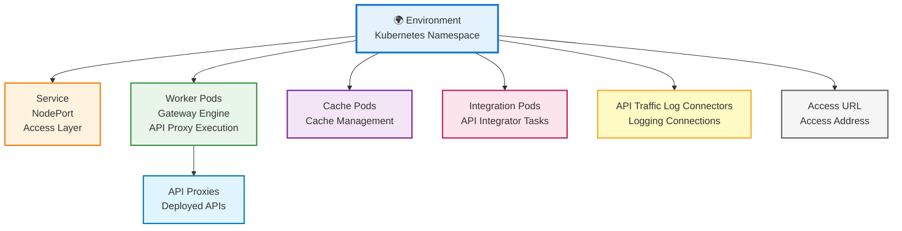

## Environment Concept

Environment corresponds to the **Namespace** concept in Kubernetes. Kubernetes clusters can manage large amounts of disconnected workloads simultaneously. Kubernetes uses a concept called Namespace to reduce the complexity of objects within the cluster.

<Info>
  **Namespaces** allow objects to be grouped together and these groups to be filtered and controlled as a unit. This enables purposes such as applying customized access control policies or separating all units from each other for a test environment.
</Info>

## Environment Features

<CardGroup cols={2}>
  <Card title="Isolation" icon="lock">
    Each environment is completely isolated from other environments. API Proxies in one environment cannot directly communicate with API Proxies in other environments.
  </Card>
  <Card title="Resource Allocation" icon="server">
    Each environment has dedicated resources such as CPU and RAM. These resources are not shared with other environments.
  </Card>
  <Card title="Access Address" icon="globe">
    Each environment has its own access address (URL). API Proxies in the environment can be accessed through this address.
  </Card>
  <Card title="Settings" icon="gear">
    Each environment has its own specific settings. These settings are independent of other environments.
  </Card>
</CardGroup>

## Environment Structure

The following diagram shows what an environment contains at a high level:



## Why Use Multiple Environments?

It is recommended to use multiple environments for two main reasons:

### 1. Lifecycle Management

Managing the API lifecycle by creating environments for different purposes such as Development, Test, Sandbox, and Production.

<CardGroup cols={2}>
  <Card title="Development" icon="code">
    Development environment. The environment where new features are developed and tested.
  </Card>
  <Card title="Test" icon="flask">
    Test environment. The environment where comprehensive tests of developed features are performed. Also used to measure the adequacy of hardware resources.
  </Card>
  <Card title="Sandbox" icon="box">
    Sandbox environment. Used to simulate real users before the product is finished and released to end users. Provides the ability to perform safe testing without affecting the production process and close to the production process.
  </Card>
  <Card title="Production" icon="rocket">
    Production environment. The environment where the live system runs. Designed for end-user use and configured to handle client load.
  </Card>
</CardGroup>

<Warning>
  **Important Differences:**

  - **Difference between test environment and sandbox environment**: The product (API Proxy or Application) is enabled on **test environment** to test during development, and on **sandbox environment** to simulate real users before the product is finished and released to end users.
  - Installation is performed on the relevant role environment according to the usage purpose of the API Proxy. The same API Proxy can be enabled on different environments for different purposes.
  - Each environment operates independently of the others.
</Warning>

### 2. Resource Isolation

Grouping resource-intensive APIs to run in isolation, thus preventing other APIs' performance from being adversely affected.

<Info>
  For example, high-traffic APIs can run in one environment, while low-traffic APIs can run in another environment. This optimizes resource usage.
</Info>

## Environment Components

An environment contains the following components:

<AccordionGroup>
  <Accordion title="Namespace" icon="folder">
    The environment concept in the Apinizer Platform corresponds to the Namespace concept in Kubernetes. Each environment is created as a Namespace in Kubernetes.
  </Accordion>

  <Accordion title="Worker Pods (Gateway Engine)" icon="server">
    Pods where API Proxies run. It is the core module of the Apinizer Platform, responsible for routing all API requests to Backend APIs and operates as a Policy Enforcement Point.
  </Accordion>

  <Accordion title="Cache Pods" icon="database">
    Distributed cache pods. The environment where cache values required in Apinizer are stored.
  </Accordion>

  <Accordion title="Integration Pods" icon="network-wired">
    Pods where API Integrator tasks run. Manages integration operations.
  </Accordion>

  <Accordion title="Service" icon="globe">
    Environment Service is created to access the Apinizer Worker pod in the Environment Deployment. The service is the layer that handles requests coming to all pods. It is located in front of the pods. NodePort is used by default, and other service types are not supported by Apinizer.
  </Accordion>

  <Accordion title="API Traffic Log Connectors" icon="file-lines">
    Connectors that provide connection to log servers (e.g., Elasticsearch cluster) where all API Traffic and requests in the created environment will be logged.
  </Accordion>

  <Accordion title="Access URL (Access Address)" icon="link">
    Access URL is the external access address of the Proxy. It is specified as `https://<your-IP-address>`. Messages can be sent to Proxies using the external access address information.
  </Accordion>
</AccordionGroup>

## Environment Types and Protocols

### Environment Types

When creating an environment, either **Test** or **Production** type is selected. This type is important in terms of license management and resource allocation.

### Communication Protocol Types

When creating an environment, one of the following communication protocols can be selected:

* **HTTP**: Standard HTTP protocol
* **gRPC**: High-performance RPC protocol
* **HTTP+WebSocket**: Combined use of HTTP and WebSocket protocols

## Environment Access Address

An API Proxy can be accessed through the access address of the environment where it is deployed.

### Access Address Structure

An API Proxy's access address is as follows:

```
http://demo.apinizer.com/apigateway/myproxy
```

| Component | Description |
|-----------|-------------|
| `http://demo.apinizer.com/` | Environment Access Address |
| `apigateway/` | Root Context |
| `myproxy` | API Proxy Relative Path |

### Access Address Configuration

The access address to be defined for the environment is usually a DNS address defined in a load balancer such as WAF or Nginx. Environments defined in Apinizer correspond to a namespace in Kubernetes. A Kubernetes service of NodePort type is automatically created by Apinizer to access Apinizer Workers running within the namespace.

## Environment Management

### Creating an Environment

When creating a new environment, the following information is defined:

* **Type**: Test or Production
* **Communication Protocol Type**: HTTP, gRPC, or HTTP+WebSocket
* **Environment Name**: Unique name identifying the environment (corresponds to namespace in Kubernetes)
* **Key**: A shortened key specific to the environment
* **Node List**: Which Kubernetes servers the environment will run on
* **Project**: Projects where the environment can be used (if left empty, it can be used in all projects)
* **Access URL Address**: External access address of API Proxies running in the environment
* **Gateway Server Access URL**: NodePort or ingress type service access address required for configurations made in the Apinizer Management Console to be loaded into Gateway Pods
* **Resource Limits**: CPU and RAM limits
* **Settings**: Configuration specific to the environment
* **Description**: Can be used for management convenience and important notes

<Info>
  For detailed environment creation and management, you can refer to the [Environment Management](/en/admin/server-management/gateway-environments) page.
</Info>

### API Proxy Deployment

API Proxies can be deployed to one or more environments. The same API Proxy can run with different versions in different environments.

<Warning>
  **Important Notes:**
  
  - For a client to access an API Proxy, it must be deployed to at least one environment.
  - All environments where installation is performed are located within a cluster and run on servers where the Apinizer Platform is installed.
</Warning>

## Project and Environment Relationship

Projects and environments are different concepts:

* **Project**: Logical organization unit (which APIs work together?)
* **Environment**: Physical/resource unit (where do APIs run?)

API Proxies in a project can be deployed to different environments:

```
Project: E-Commerce APIs
├─ Development Environment
│  ├─ Product API v1.0
│  └─ Order API v1.0
├─ Test Environment
│  ├─ Product API v1.1
│  └─ Order API v1.1
├─ Sandbox Environment
│  ├─ Product API v1.2
│  └─ Order API v1.2
└─ Production Environment
   ├─ Product API v1.2
   └─ Order API v1.2
```

When creating an environment, it can be determined which projects the environment can be used in. If the project selection is left empty, the environment can be used in all projects.

## Environment and Kubernetes Namespace Relationship

All environments created with the Apinizer Platform run on Kubernetes infrastructure. Each environment corresponds to a Namespace in Kubernetes:

```
Apinizer Environment → Kubernetes Namespace
├─ Development → apinizer-dev
├─ Test → apinizer-test
├─ Sandbox → apinizer-sandbox
└─ Production → apinizer-prod
```

This structure enables:
* Isolation between environments
* Resource usage control
* Access control
* Scalability management

## Next Steps

<CardGroup cols={2}>
  <Card title="What is Project?" icon="folder" href="/en/concepts/core-concepts/what-is-project">
    Learn about the project concept
  </Card>
  <Card title="What is API Proxy?" icon="network-wired" href="/en/concepts/core-concepts/what-is-api-proxy">
    Learn about the API Proxy concept
  </Card>
  <Card title="Environment Management" icon="gear" href="/en/admin/server-management/gateway-environments">
    Environment creation and management
  </Card>
  <Card title="Deployment Models" icon="sitemap" href="/en/concepts/deployment/deployment-models">
    Review deployment models
  </Card>
</CardGroup>

