## Policy Concept

Policy is a configurable component used in API Gateway to process requests from clients and responses from Backend APIs according to specific rules. Policies work based on configuration and do not require writing code.

Through policies, you can perform the following operations:

- Apply security rules. Authentication (Basic Auth, OAuth2, OIDC, JWT, etc.) and authorization (role-based access control) mechanisms are defined through policies.
- Perform traffic management. You can protect your APIs from overloads with quota (number of requests that can be made within a certain period) and rate limiting policies per user or application.
- Provide data transformation. You can transform incoming requests or outgoing responses into different formats (e.g., converting XML to JSON, reformatting data structure).
- Customize error messages. You can translate error messages returned by the system into corporate standards or user-friendly language.
- Apply business logic. You can define simple business rules at the API Gateway level using scripting languages such as JavaScript or Groovy or conditional logic policies.
- Enrich message content. You can add headers to requests or responses, add metadata, or mask sensitive data.

Policies define the operations applied during message processing in an API Proxy. Each policy performs a specific function and runs at a specific point in the message flow. You can instantly enable, update, or disable policies through drag-and-drop, parameter entry, or configuration selections in the interface.

<CardGroup cols={2}>
  <Card title="Configurable" icon="gear">
    Policies are configured through form-based interfaces. No code writing is required.
  </Card>
  <Card title="Reusable" icon="recycle">
    Policies can be defined globally and used in multiple API Proxies.
  </Card>
  <Card title="Conditional Execution" icon="code-branch">
    Policies can be executed conditionally.
  </Card>
  <Card title="Sequential Processing" icon="list">
    Policies run sequentially in a pipeline.
  </Card>
</CardGroup>

## Policy Application Flow

The following diagram shows how policies are applied in the message flow at a high level:

```mermaid
sequenceDiagram
    participant Client as 👤 Client
    participant Gateway as 🚪 API Gateway
    participant PreFlow as 🛡️ Pre-flow Policies
    participant Routing as 🎯 Routing
    participant Backend as 🖥️ Backend API
    participant PostFlow as 📤 Post-flow Policies
    participant FaultHandler as 🚨 Fault Handler
    
    Client->>Gateway: HTTP Request
    
    Gateway->>PreFlow: Pre-flow Policies<br/>Applied
    
    Note over PreFlow: Policy Levels:<br/>Group → Proxy → Endpoint<br/><br/>Policy Types:<br/>Security, Traffic Management,<br/>Validation, Transformation
    
    PreFlow->>Routing: Routing Step
    
    Routing->>Backend: Processed Request<br/>Forwarded to Backend
    
    alt Successful Response
        Backend->>PostFlow: Response Returns
        
        Note over PostFlow: Post-flow Policies:<br/>Transformation, Enrichment,<br/>Masking, Logging
        
        PostFlow->>Gateway: Processed Response
        
        Gateway->>Client: HTTP Response
    else Error Condition
        Backend-->>Routing: ❌ Error Occurred
        
        Routing->>FaultHandler: Fault Handler<br/>Policies
        
        Note over FaultHandler: Error Handling,<br/>Error Message Transformation,<br/>Customized Error Response
        
        FaultHandler->>Gateway: Error Response
        
        Gateway->>Client: HTTP Error Response
    end
    
    Note over Client,Gateway: Process Completed
```



## Purpose and Benefits of Policies

**Centralized Control**

API behavior, security, and performance are managed from a single point. This ensures consistency in distributed systems and reduces management complexity.

**Access Control Policies**

Authentication, authorization, and access permissions to API resources are defined through policies. This prevents unauthorized access and ensures security.

**Reusability**

A policy defined once can be used by multiple APIs, endpoints, or services. This simplifies policy management and speeds up the development process.

**Reducing Code Maintenance Burden**

Security, data transformation, and validation operations are performed in gateway configuration, not in code. This reduces complexity in application code and lowers maintenance costs.

**Consistency**

Since all APIs are subject to the same policies, enterprise-wide security and performance standards are applied consistently. Exceptions remain minimal.

**Rapid Response and Flexibility**

Policies can be instantly disabled, updated, or redeployed. This enables rapid response to security threats, resolution of performance issues, or adaptation to business rule changes.

## Policy Types

### Security Policies

<CardGroup cols={2}>
  <Card title="Authentication" icon="key">
    * OAuth2
    * OIDC
    * JWT
    * Basic Authentication
    * Digest Authentication
    * mTLS
  </Card>
  <Card title="Authorization" icon="lock">
    * IP Whitelist/Blacklist
    * API Key
    * Role-based Access Control
  </Card>
</CardGroup>

### Traffic Management Policies

<CardGroup cols={2}>
  <Card title="Rate Limiting" icon="gauge">
    * API-Based Throttling
    * API-Based Quota
    * Time Limitation
  </Card>
  <Card title="Load Balancing" icon="scale-balanced">
    * Load balancing strategies
    * Failover
  </Card>
</CardGroup>

### Message Processing Policies

<CardGroup cols={2}>
  <Card title="Validation" icon="check-circle">
    * JSON Schema Validation
    * XML Schema Validation
    * Min/Max Message
  </Card>
  <Card title="Transformation" icon="arrows-rotate">
    * JSON Transformation (Jolt)
    * XML Transformation (XSLT)
    * Plain Text
  </Card>
</CardGroup>

### Message Enrichment and Business Logic Policies

<CardGroup cols={2}>
  <Card title="Enrichment" icon="wand-magic-sparkles">
    * Header addition
    * Data addition
    * Script (Groovy/JavaScript)
  </Card>
  <Card title="Business Rule" icon="code-branch">
    * Conditional business logic
    * Action chain
    * Data manipulation
  </Card>
  <Card title="API Call" icon="network-wired">
    * External API calls
    * Data retrieval
    * Integration
  </Card>
  <Card title="Security" icon="shield">
    * Encryption/Decryption
    * Digital Signature
    * Redaction (Masking)
  </Card>
</CardGroup>

<Info>
  For all policy types and detailed descriptions, you can refer to the [Policies](/en/develop/policies/api-based-throttling) page.
</Info>

## Policy Pipeline

Policies run sequentially in a pipeline:

```
Request Pipeline:
├─ Pre-flow Policies (Before request)
├─ Conditional Policies
├─ Routing Step
├─ Post-flow Policies (After request)
└─ Response Pipeline:
   └─ Post-flow Policies (After response)
   └─ Fault Handler Policies (In error condition)
```

### Pipeline Stages

<AccordionGroup>
  <Accordion title="Pre-flow Policies">
    Policies that run before the request is sent to the backend:
    * Authentication
    * Authorization
    * Rate limiting
    * Message validation
  </Accordion>
  
  <Accordion title="Conditional Policies">
    Policies that run based on conditions:
    * IF-THEN-ELSE logic
    * Execution based on message content
    * Execution based on header values
  </Accordion>
  
  <Accordion title="Routing Step">
    Step where the request is routed to the backend:
    * Upstream target selection
    * Load balancing
    * Failover
  </Accordion>
  
  <Accordion title="Post-flow Policies">
    Policies that run after the response comes from the backend:
    * Response transformation
    * Masking
    * Logging
    * Header addition
  </Accordion>
  
  <Accordion title="Fault Handler Policies">
    Policies that run in error conditions:
    * Error handling (Connection Error, Timeout Error, 4xx/5xx Errors)
    * Error classification
    * Error message transformation
    * Error logging
    * Customized error response
  </Accordion>
</AccordionGroup>

## Policy Usage Types

### Local Policy

Valid only in the API Proxy or API Proxy Group where it was created. If the API Proxy or API Proxy Group where it is located is deleted, the policy is also deleted.

Export, import, activate, and deactivate operations can be performed where it is located.

### Global Policy

Policies created on the Global Policies page. Can be used by multiple API Proxies or API Proxy Groups.

If a change is made to a global policy, all API Proxies and API Proxy Groups using the policy enter the "Redeploy Required" state.

All related API Proxies/API Proxy Groups can be deployed together through the bulk deploy operation on this screen.

Additionally, policy export, import, activate, and deactivate operations can also be performed from these screens.

**Localizing Global Policy:**

A policy created globally may need to be customized when used in an API Proxy/API Proxy Group.

In this case, click on the policy added to the API Proxy/API Proxy Group and click the "Localize" button in the upper right corner to make it local with a single click.

**Where Global Policy is Used:**

Tracking where a global policy is used in which API proxies, API proxy groups, or policy groups is critical in management and update processes.

On each policy detail page, policy usage information is displayed:

* **Used in API Proxies Panel:** This section displays the list of API Proxies using the policy.
* **Used in API Proxy Groups Panel:** This section displays the list of API Proxy groups using the policy.
* **Used in Policy Groups Panel:** This section displays the list of policy groups containing this policy.

### Global and Local Policy Comparison

| Global Policy | Local Policy |
|---------------|--------------|
| Can be used in multiple API Proxies | Used only in one API Proxy |
| Centrally managed | Managed per proxy |
| Updated once, all usages are affected | Separate update required for each proxy |
| High reusability | Low reusability |

## Policy Application Points

Policies can be applied at three different levels:

| Application Point | Description |
|-------------------|-------------|
| API Proxy Group | Applied to all API Proxies in a group |
| API Proxy | Applied to all methods/endpoints within a specific API Proxy |
| Method/Endpoint | Valid only for the relevant method or endpoint |

For detailed information about the application order of policies in the message flow, the working logic at API Proxy Group/API Proxy/Endpoint levels, and the visual flow diagram, refer to the [Message Processing and Policy Application](/en/concepts/core-concepts/message-processing-and-policy-application) page.

## Policy Structure

Policies share the same basic structure despite their functional differences.

### General Information Panel

Each policy's name, description, and whether it is active are common fields.

After the common fields, policy-specific configuration fields are located.

### Conditions

Policies can be customized to run only when certain conditions are met.

**Example:**

- Run if `status` parameter is `"pending"`.
- Execute if `userId` field is in the list `#user1#user2#user3`.

This feature enables policies to work **dynamically and context-aware**.

When "in list" or "not in list" is selected as the condition value comparison operator, the # sign should be used to separate list values. For example, user1#user2#user3.

### Error Message Customization

Messages returned for errors that may occur during policy execution can be customized. This allows developers to customize error messages returned to clients in corporate or understandable formats.

Each policy can customize messages to be returned when an error occurs:

| Field | Description |
|-------|-------------|
| HTTP Status Code | Default system code |
| Error Code | Default error code |
| Original Message | Default error message |
| Customized HTTP Status Code | A different HTTP status code is returned |
| Customized Error Code | A different error code is determined |
| Customized Error Message | Custom error message is written |

**Note:** While error codes and messages can be customized specifically for that policy in the policy definition interface, error customization can also be done platform-wide.

#### Error Descriptions (Tooltip)

Each error message row includes an info icon (info-circle) next to the **Original Message** field. When you hover over this icon, a short description explaining when the error occurs is displayed as a tooltip. This allows you to quickly understand which error is triggered under which condition.

#### Per-Error Custom Message Builder

Beyond simple customizations made with inline fields (Customized HTTP Status Code, Customized Error Code, Customized Error Message), you can define a separate **template-based custom message builder** for each individual error message row.

When you click the **Customize** (gear icon) button at the end of an error message row, a dialog opens. This dialog contains the following fields:

| Field | Description |
|-------|-------------|
| Toggle | Enables or disables the custom error message builder |
| Available Variables | Variables listed in accordion format under error, request, message, dateTime categories. Can be copied to clipboard and pasted into the template |
| Code Editor | Message template (in JSON format). `#{...}` placeholders can be used |
| Content Type | Content-Type of the response. Default: `application/json;charset=utf-8` |
| HTTP Status Code | HTTP status code of the response. If left empty, it is automatically assigned based on the error type |

This feature allows you to create a more specific response for a particular error type, instead of the policy-level general template.

### Error Message Priority Order

When an error occurs, the Gateway determines the response according to the following priority order:

| Priority | Source | Description |
|----------|--------|-------------|
| 1 (Highest) | Per-error custom message template | Template-based custom message defined for a specific error type |
| 2 | Policy-level custom message template | Template-based custom message defined at the policy level |
| 3 | Per-error field customization | Per-row Customized Message, Customized Error Code, Customized HTTP Status Code fields |
| 4 | Platform-wide error message customization | Customization made from System Settings > [Error Messages](/en/admin/system-settings/error-messages) page |
| 5 (Lowest) | Default error message | Default system error message |

<Warning>
If a higher-priority source is defined, lower-priority ones are not evaluated. For example, if a per-error custom message template is active for an error row, the policy-level template or per-error field customizations are not considered.
</Warning>

### Template-Based (Dynamic) Error Messages

You can fully customize messages returned in error cases. In the free-text template field, you can use `#{...}` placeholders to automatically include request and error information in the message.

**Example template:** `Error occurred: #{error.effectiveErrorCode} - Request path: #{request.uri}`

Available placeholder groups (many placeholders in total):

| Group | Example placeholders |
|-------|----------------------|
| Error information | Error code, message, HTTP status |
| Request information | HTTP method, URI, IP address, query parameters |
| Time information | Date, time, timestamp |
| API information | API Proxy ID and name |
| Message information | Correlation ID |

You can customize the HTTP status code (e.g. 400, 500, 503) and Content-Type (JSON, XML, plain text) in the HTTP response settings.

Template-based error messages can be defined both **at the policy level** (a single template for all errors) and **per-row** (a separate template for a specific error type).

**Usage areas:** Global policies, API Proxy, [Routing](/en/develop/routing/http-routing), [Business Rule STOP](/en/develop/policies/business-rule) action.

**Example (Business Rule STOP):**

Template:
```
Your API call failed.
Error Code: #{error.effectiveErrorCode}
Time: #{dateTime.formattedText}
Request ID: #{message.correlationId}
```

Example result:
```
Your API call failed.
Error Code: BUSINESS_RULE_STOP
Time: 2024-01-29 14:30:45
Request ID: 12345-67890-abcde
```

<Note>This feature is optional. Your existing error messages continue to work as before.</Note>

## Policy Configuration

Policies are configured through form-based interfaces. Each policy type has its own configuration options.

### Global Policies

Policies can be defined globally and used in multiple API Proxies. This enables:

* Prevention of policy duplication
* Centralized management
* Consistency maintenance

### Policy Groups

Policy Groups enable grouping and managing related policies together. Through Policy Groups:

* **Centralized Management**: Related policies are collected under a single group
* **Easy Application**: When a Policy Group is added to an API Proxy, all policies in the group are automatically applied
* **Reusability**: The same policy combination can be used in multiple API Proxies
* **Versioning**: Policy Groups can be versioned and different versions can be used in different API Proxies

<Info>
  For detailed Policy Groups information, you can refer to the [Policy Management](/en/develop/api-proxy-configuration/policy-management) page.
</Info>

## Policy and API Proxy Relationship

Policies are fundamental components of API Proxies:

* **Within API Proxy**: Each API Proxy contains its own policies. These policies are specific to the API Proxy.
* **Within API Proxy Group**: Policy Groups are policy collections that can be used in multiple API Proxies.
* **Global Policies**: Policies defined globally can be used in multiple API Proxies.

Policies can be added to an API Proxy at the following levels:

```
API Proxy Group
├─ Group Pre-flow Policies
├─ Group Post-flow Policies
└─ Group Fault Handler Policies
    │
    └─ API Proxy
        ├─ Proxy Pre-flow Policies
        ├─ Proxy Conditional Policies
        ├─ Proxy Post-flow Policies
        └─ Proxy Fault Handler Policies
            │
            └─ Endpoint/Method
                ├─ Endpoint Pre-flow Policies
                ├─ Endpoint Post-flow Policies
                └─ Endpoint Fault Handler Policies
```

<Info>
  For detailed information about policy application levels and execution order, you can refer to the [Message Processing and Policy Application](/en/concepts/core-concepts/message-processing-and-policy-application) page.
</Info>

## Policy Creation and Management

### Policy Creation

When creating a policy, the following steps are followed:

1. **Policy Type Selection**: The type of policy to be created is selected
2. **Configuration**: Policy parameters are configured through form-based interface
3. **Conditions**: Conditions are optionally defined
4. **Error Message Customization**: Custom messages are defined for error conditions
5. **Activation**: Policy is activated
6. **Deployment**: API Proxy is redeployed for changes to take effect

<Info>
  For detailed policy creation and management, you can refer to the [Policy Management](/en/develop/api-proxy-configuration/policy-management) page.
</Info>

## Policy Execution Order

Policies run in the order they are defined. This order is important because:

* Security checks must be performed first
* Validation should be performed next
* Transformation should be performed last

The policy execution order is as follows:

1. **API Proxy Group Pre-flow Policies**
2. **API Proxy Pre-flow Policies**
3. **Endpoint Pre-flow Policies**
4. **Conditional Policies**
5. **Routing Step**
6. **Post-flow Policies (Request)**
7. **Backend API Request**
8. **Post-flow Policies (Response)**
9. **Fault Handler Policies** (In error condition)

## Best Practices

- Create policies to be reusable
- Prefer global policy when possible
- Make error messages user-friendly
- Don't unnecessarily complicate policy conditions
- Perform redeploy operation after changes

## Next Steps

<CardGroup cols={2}>
  <Card title="What is API Proxy?" icon="network-wired" href="/en/concepts/core-concepts/what-is-api-proxy">
    Learn about the API Proxy concept
  </Card>
  <Card title="Message Processing and Policy Application" icon="diagram-project" href="/en/concepts/core-concepts/message-processing-and-policy-application">
    Learn about message flow and policy pipeline
  </Card>
  <Card title="Message Processing and Policy Application" icon="diagram-project" href="/en/concepts/core-concepts/message-processing-and-policy-application">
    Learn about message flow and policy application process
  </Card>
  <Card title="Policies" icon="list" href="/en/develop/policies/api-based-throttling">
    Review all policy types
  </Card>
  <Card title="Policy Management" icon="gear" href="/en/develop/api-proxy-configuration/policy-management">
    Policy creation and management
  </Card>
  <Card title="Conditional Policy Execution" icon="code-branch" href="/en/concepts/core-concepts/conditional-policy-execution">
    Learn about conditional policy execution
  </Card>
</CardGroup>

