## Project Concept

<CardGroup cols={2}>
  <Card title="Organization" icon="folder">
    Logical grouping of API Proxies
  </Card>
  <Card title="Access Control" icon="lock">
    Project-based user and role management
  </Card>
  <Card title="Collaboration" icon="users">
    Team members working together
  </Card>
  <Card title="Isolation" icon="shield">
    Data and setting isolation between projects
  </Card>
</CardGroup>

## Project Structure

The following diagram shows what a project contains at a high level:


## Project and Environment Relationship

The following diagram shows the relationship between project and environment concepts:

```mermaid
flowchart TB
    Project[📁 Project<br/>Logical Organizational Unit<br/>Which APIs work together?]
    
    Project --> API1[Product API]
    Project --> API2[Order API]
    Project --> API3[Payment API]
    
    API1 -->|Deploy| DevEnv[🔵 Development Environment<br/>v1.0]
    API1 -->|Deploy| TestEnv[🟡 Test Environment<br/>v1.1]
    API1 -->|Deploy| ProdEnv[🟢 Production Environment<br/>v1.2]
    
    API2 -->|Deploy| DevEnv
    API2 -->|Deploy| TestEnv
    API2 -->|Deploy| ProdEnv
    
    API3 -->|Deploy| DevEnv
    API3 -->|Deploy| TestEnv
    API3 -->|Deploy| ProdEnv
    
    DevEnv -.->|Physical/Resource Unit| EnvNote[🌍 Environment<br/>Where do APIs run?<br/>Kubernetes Namespace]
    TestEnv -.-> EnvNote
    ProdEnv -.-> EnvNote
    
    style Project fill:#e3f2fd,stroke:#1976d2,stroke-width:3px
    style API1 fill:#e8f5e9,stroke:#388e3c,stroke-width:2px
    style API2 fill:#e8f5e9,stroke:#388e3c,stroke-width:2px
    style API3 fill:#e8f5e9,stroke:#388e3c,stroke-width:2px
    style DevEnv fill:#e3f2fd,stroke:#1976d2,stroke-width:2px
    style TestEnv fill:#fff3e0,stroke:#f57c00,stroke-width:2px
    style ProdEnv fill:#e8f5e9,stroke:#388e3c,stroke-width:2px
    style EnvNote fill:#f5f5f5,stroke:#616161,stroke-width:2px,stroke-dasharray: 5 5
```



## Project Features

### Project Contents

A project can contain:

* **[API Proxies](/en/concepts/core-concepts/what-is-api-proxy)**: All API Proxies belonging to the project
* **[Policies](/en/concepts/core-concepts/what-is-policy)**: Project-specific policy definitions
* **[Connections](/en/concepts/core-concepts/connections)**: Database, message queue, etc. connections
* **[Connectors](/en/concepts/core-concepts/connector)**: Integration connectors
* **[Variables](/en/concepts/core-concepts/variable)**: Project-level variables
* **Gateway Address (Relative Path)**: The prefix that all API Proxy gateway addresses within the project will start with. For example, when the project gateway address is "account", the API proxy gateway address appears as `/account/proxy1`.
* **Settings**: Project-specific configurations

<Tip>
  Apinizer provides a **Default** project upon initial setup. This Default project cannot be edited or deleted.
</Tip>

### Project Management

<AccordionGroup>
  <Accordion title="Project Creation">
    When creating a new project, the following information is defined:
    
    * **Project Name**: Unique name that identifies the project
    * **Activate Gateway Address**: Activated if a common prefix is desired for all gateway addresses within the project
    * **Gateway Address (Relative Path)**: The prefix expression that all API Proxy gateway addresses to be defined within the project will start with. An automatic UUID is provided by the system
    * **Description**: Purpose and scope of the project
    * **Members**: Users with access to the project and their roles
    * **Visibility**: Project visibility settings
    
    A project can be created in two ways:
    * **New (Create)**: New project definition
    * **Import Project**: Loading a project from an existing project configuration file
    
    <Info>
      For detailed project creation and management, you can refer to the [Project Management](/en/admin/project-management/proje-olusturma) page.
    </Info>
  </Accordion>
  
  <Accordion title="Project Members and Roles">
    Each project can have members with different roles:
    
    * **Project Owner**: Owner of the project. Has the authority to manage, edit, and delete the project. If the user with the Project Owner role is removed from the project, the Admin user automatically becomes the Project Owner.
    * **Project Administrator**: Authority to manage the project
    * **Developer**: Authority to create and edit [API Proxy](/en/concepts/core-concepts/what-is-api-proxy)
    * **Viewer**: View-only authority
    
    These roles provide project-based access control.
  </Accordion>
  
   
</AccordionGroup>

## Project and Environment Relationship

Projects and environments are different concepts:

* **Project**: Logical organizational unit (which APIs work together?)
* **[Environment](/en/concepts/core-concepts/what-is-environment)**: Physical/resource unit (where do APIs run?)

[API Proxies](/en/concepts/core-concepts/what-is-api-proxy) in a project can be deployed to different [environments](/en/concepts/core-concepts/what-is-environment):

```
Project: E-Commerce APIs
├─ Development Environment
│  ├─ Product API v1.0
│  └─ Order API v1.0
├─ Test Environment
│  ├─ Product API v1.1
│  └─ Order API v1.1
├─ Sandbox Environment
│  ├─ Product API v1.2
│  └─ Order API v1.2
└─ Production Environment
   ├─ Product API v1.2
   └─ Order API v1.2
```

When creating an [Environment](/en/concepts/core-concepts/what-is-environment), you can determine which projects the environment can be used in. If the project selection is left empty, the environment can be used in all projects. If a project is selected, it means that only [API Proxies](/en/concepts/core-concepts/what-is-api-proxy) within that project can be deployed to this environment.

## Project Use Cases

<CardGroup cols={2}>
  <Card title="Team-Based Organization" icon="users">
    Different teams working in their own projects. For example:
    * E-Commerce Team → E-Commerce Project
    * Payment Team → Payment Project
    * Reporting Team → Reporting Project
  </Card>
  <Card title="Customer-Based Organization" icon="building">
    Separate projects for different customers. For example:
    * Customer A → Customer A Project
    * Customer B → Customer B Project
  </Card>
  <Card title="Product-Based Organization" icon="box">
    Separate projects for different products. For example:
    * Mobile Application → Mobile API Project
    * Web Application → Web API Project
  </Card>
  <Card title="Version-Based Organization" icon="code-branch">
    Separate projects for different API versions. For example:
    * API v1 → API v1 Project
    * API v2 → API v2 Project
  </Card>
</CardGroup>

## Project Operations

### Project Export/Import

Projects can be exported and moved to other environments or systems:

* **Export**: Exporting all project content in JSON/YAML format
* **Import**: Importing the exported project to another environment or system
* **Cross-Environment Migration**: Moving projects between different environments

### Project Templates

Frequently used project configurations can be saved as templates and used when creating new projects.

### Project Deletion

Project deletion can be performed by users with the **Project Owner** or **System Administrator** role.

<Warning>
  **Important**: When you delete a project, all assets belonging to that project (API Proxies, Connection Configurations, Credentials, etc.) and configuration information will be deleted. This operation cannot be undone.
</Warning>

<Info>
  The Default project cannot be deleted or edited.
</Info>

## Next Steps

<CardGroup cols={2}>
  <Card title="What is Environment?" icon="server" href="/en/concepts/core-concepts/what-is-environment">
    Learn about the environment concept
  </Card>
  <Card title="What is API Proxy?" icon="network-wired" href="/en/concepts/core-concepts/what-is-api-proxy">
    Learn about the API Proxy concept
  </Card>
  <Card title="Project Management" icon="gear" href="/en/admin/project-management/proje-olusturma">
    Project creation and management
  </Card>
  <Card title="Export/Import" icon="arrow-right-arrow-left" href="/en/admin/secrets-management/export-import">
    Project export/import operations
  </Card>
</CardGroup>

