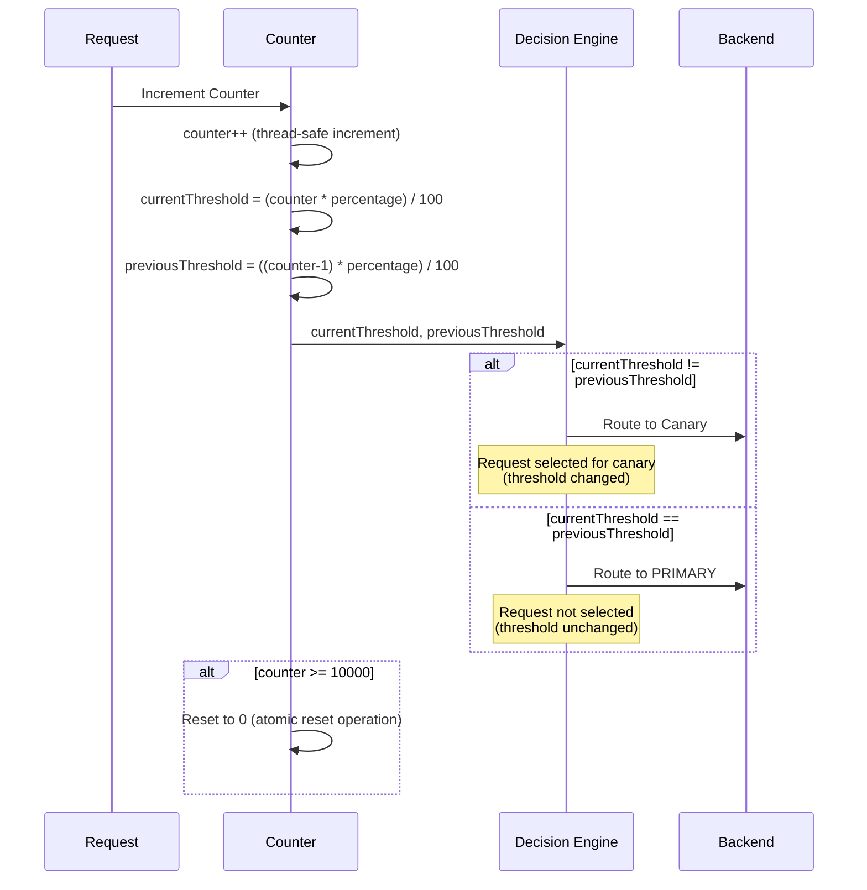
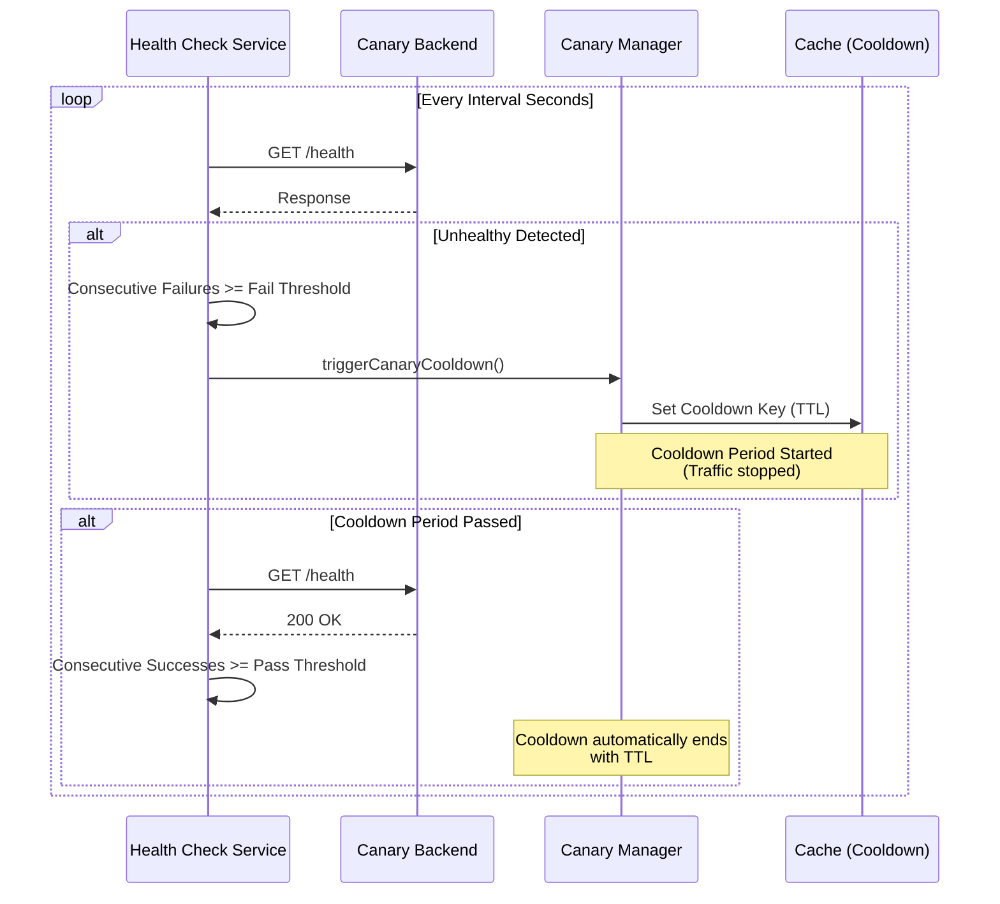
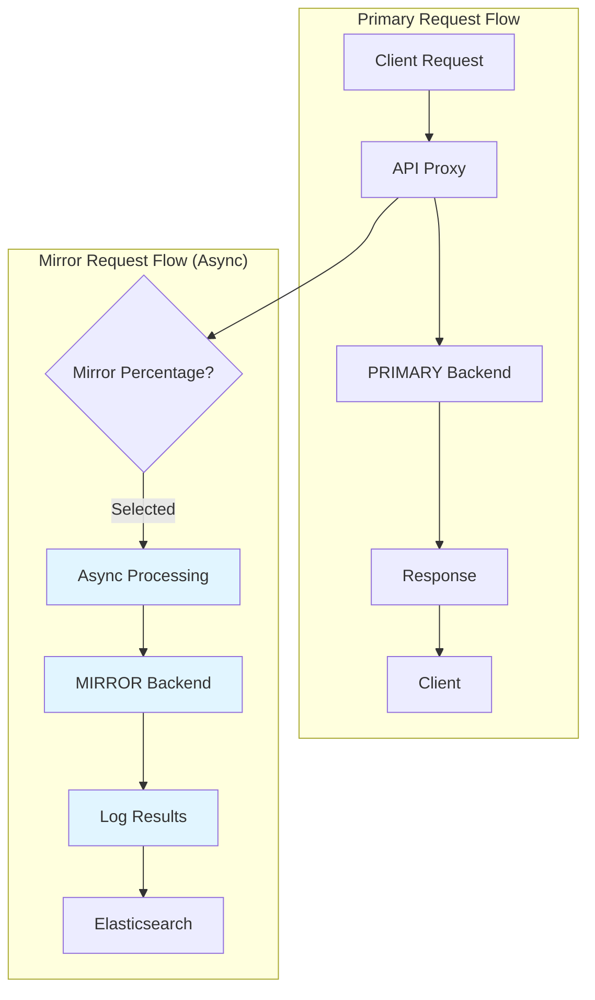
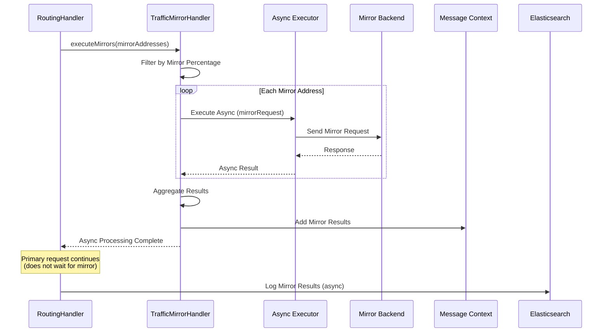

<Warning>
These features are only available for HTTP type API Proxies. These settings are not valid for gRPC and WebSocket type API Proxies.
</Warning>

## Canary Release

**Canary Release** is a deployment strategy used to minimize risk by deploying a new backend version to production with a small percentage of traffic. This allows you to test the performance and stability of the new version on real traffic.

### How Does Canary Release Work?

The canary release mechanism works as follows:

1. **Traffic Percentage:** A certain percentage of traffic (e.g., 10%) is routed to the canary backend
2. **Counter-Based Routing:** A counter is used for deterministic routing (with mod 100)
3. **Health Check Integration:** When the canary backend becomes unhealthy, a cooldown period is automatically started
4. **Cooldown Period:** During the cooldown period, no traffic is sent to canary, all traffic is routed to the stable backend

### Canary Release Parameters

| Parameter | Description |
|-----------|-------------|
| **Traffic Percentage** | Percentage of traffic to be routed to the canary backend (0-100). |
| **Cooldown Period (Seconds)** | Duration during which traffic is stopped when the canary backend becomes unhealthy. Default: 300 seconds (5 minutes). |

### Canary Routing Decision Flow

The canary routing decision mechanism works as follows:

1. **When a request arrives**, it is checked if canary release is enabled:
   - If canary release is not enabled: Request is routed directly to PRIMARY backend

2. **If canary release is enabled**, cooldown period is checked:
   - If cooldown period is active: All traffic is routed to PRIMARY backend (no traffic is sent to canary)
   - If cooldown period is not active: Traffic distribution is performed

3. **Traffic distribution** (Bresenham-style distribution algorithm):
   - Counter is incremented for each request
   - Distribution threshold is calculated: `floor(counter * percentage / 100)`
   - If threshold changes from previous request: Request is routed to CANARY backend
   - If threshold remains the same: Request is routed to PRIMARY backend
   - This ensures even distribution across requests (e.g., for 50%: 1st→PRIMARY, 2nd→CANARY, 3rd→PRIMARY, 4th→CANARY, ...)

4. **After routing to canary backend**:
   - If request is successful: Operation is completed
   - If request fails: Automatic failover to PRIMARY backend is performed

### Bresenham-Style Distribution Algorithm

Canary release uses **Bresenham-style distribution** to evenly distribute traffic across requests:

#### How Does Bresenham Distribution Work?

Unlike simple modulo-based approaches that create traffic bursts (e.g., first 50 requests to canary, next 50 to primary), Bresenham distribution ensures even spacing:

**Example for 50% traffic:**
- 1st request → PRIMARY
- 2nd request → CANARY
- 3rd request → PRIMARY
- 4th request → CANARY
- ... (alternating pattern continues)

**Example for 33% traffic:**
- 1st, 2nd → PRIMARY
- 3rd → CANARY
- 4th, 5th → PRIMARY
- 6th → CANARY
- ... (evenly spaced pattern continues)

#### Algorithm Details

1. **Counter Increment:** Counter is incremented for each request (using thread-safe atomic counter)
2. **Threshold Calculation:** 
   - Current threshold = `floor(counter × percentage / 100)`
   - Previous threshold = `floor((counter-1) × percentage / 100)`
3. **Decision Making:** If current threshold ≠ previous threshold, route to canary
4. **Overflow Prevention:** When counter reaches 10,000, it is automatically reset to 0

<Info>
**Why Bresenham?** This algorithm is named after Bresenham's line algorithm used in computer graphics. It ensures even distribution without clumping, providing a smooth traffic distribution pattern that's ideal for testing and monitoring.
</Info>

#### Distribution Quality

The Bresenham distribution provides:
- **Even Spacing:** Requests are evenly distributed, not clustered
- **Deterministic:** Same counter value always produces same decision
- **Thread-Safe:** Works correctly in multi-threaded environments
- **Accurate:** Over any 100-request window, exactly the specified percentage routes to canary

### Automatic Failback with Health Check

The health status of the canary backend is continuously monitored by the active health check mechanism:

- **Unhealthy Detection:** When health check fail threshold is exceeded, canary backend is marked as unhealthy
- **Cooldown Start:** When unhealthy is detected, cooldown period is automatically started
- **Traffic Stop:** During cooldown period, no traffic is sent to canary
- **Automatic Recovery:** After cooldown period passes, if health check becomes successful again, canary becomes active again

## Traffic Mirroring

**Traffic Mirroring** is a mechanism used to send a copy of live traffic to a test environment. Mirror requests work asynchronously and do not affect the main request.

### How Does Traffic Mirroring Work?

The traffic mirroring mechanism works as follows:

1. **Main Request:** Sent normally to PRIMARY backend
2. **Mirror Request:** A copy of a certain percentage of traffic is sent asynchronously to MIRROR backend
3. **Asynchronous Processing:** Mirror requests do not block the main request
4. **Result Irrelevance:** Success/failure of mirror requests does not affect the main request

### Traffic Mirroring Parameters

| Parameter | Description |
|-----------|-------------|
| **Traffic Mirror Enabled** | Whether traffic mirroring is enabled. |
| **Mirror Percentage** | Percentage of traffic to be mirrored (0-100). Determined with counter-based routing. |

### Traffic Mirroring Architecture

### Asynchronous Mirror Processing

Mirror requests are processed asynchronously:

1. **Async Task Creation:** An asynchronous task is created for each mirror address
2. **Async Execution:** Mirror requests run on async executor
3. **Result Aggregation:** All mirror results are collected and added to message context
4. **Logging:** Mirror results are logged to Elasticsearch (by LogHandler)

<Warning>
If mirror requests fail, the main request is not affected. Mirror results are only used for logging and monitoring purposes.
</Warning>

### Percentage-Based Router

Both Canary Release and Traffic Mirroring use the same `PercentageBasedRouter` utility class for traffic distribution.

#### Counter Management

- **Local Counter:** Independent counter is maintained in each pod (using thread-safe map)
- **Thread-Safety:** Thread-safe operations are performed using atomic counter
- **Overflow Prevention:** When counter reaches 100, it is automatically reset to 0 using atomic reset operation

#### Counter Reset Mechanism

The counter reset mechanism prevents Long overflow:

1. **When counter reaches 10,000**, it is reset to 0 using atomic operation

2. **Atomic reset operation**:
   - If counter value is 10,000, it is attempted to be reset to 0 using `compareAndSet`
   - If reset operation succeeds: Counter becomes 0 and distribution continues
   - If reset operation fails (another thread has already reset): Distribution continues with current value

3. **Why 10,000?**: This threshold provides:
   - Sufficient range for accurate percentage distribution
   - Protection against Long.MAX_VALUE overflow
   - Minimal performance overhead from reset operations

This mechanism ensures Long overflow never occurs while maintaining accurate traffic distribution.

### Lifecycle Management

When an API Proxy is deployed, updated, or undeployed, canary and mirror counters are automatically cleaned up:

- **Deploy/Update:** Counters are reset (fresh start)
- **Undeploy:** All counters are cleaned up

<Note>
Resetting counters ensures a consistent start with the new configuration. For example, when traffic percentage changes, counters need to be reset.
</Note>

## Canary vs Mirror Comparison

| Feature | Canary Release | Traffic Mirroring |
|---------|---------------|-------------------|
| **Purpose** | Test new version with small traffic | Copy live traffic to test environment |
| **Backend Type** | CANARY | MIRROR |
| **Traffic Impact** | Selected traffic goes to canary | Main traffic to PRIMARY, copy to MIRROR |
| **Failure Impact** | If canary fails, failover to PRIMARY | If mirror fails, main request is not affected |
| **Health Check** | If canary unhealthy, cooldown starts | Health check not performed for mirror |
| **Synchronization** | Synchronous (main request waits for canary) | Asynchronous (main request does not wait for mirror) |

## Related Topics

- [Retry and Failover](/en/develop/routing/retry-and-failover) - Health check and circuit breaker integration
- [Load Balancing](/en/develop/routing/http-routing#load-balancing) - Load distribution among backend addresses

