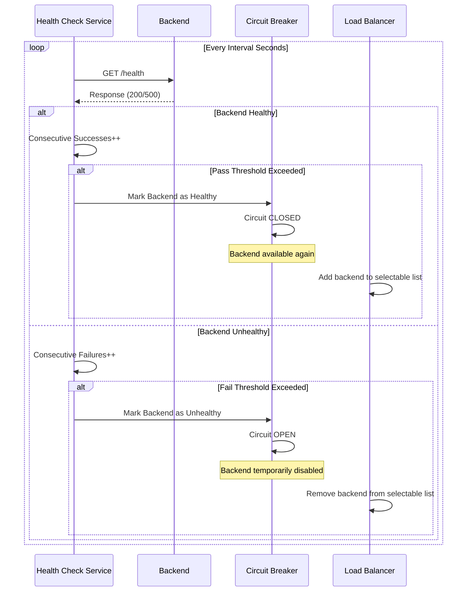

<Note>
If API type is HTTP, this tab is visible.
</Note>

## Enabling Routing/Upstream Settings

The visual containing the enabling settings for routing/upstream settings is shown below:

The parameters used for enabling routing/upstream settings are shown below.

| Field | Description |
|------|-------------|
| **If enabled, the routing/upstream settings can be made.** *(If enabled, the routing/upstream settings can be made.)* | By enabling this setting, how traffic will be routed is managed. If closed, requests do not go to backend, if open, backend information to go to can be entered. |
| **If enabled, mirroring is activated; otherwise, sample response from the specification is returned.** *(If enabled, mirroring is activated; otherwise, sample response from the specification is returned.)* | This setting appears only if the above setting is inactive, i.e., requests are not going to any backend. With this setting, mock data can be returned or the request can be returned by copying it to the response. When enabled, the request message is copied to the response message and the response line is executed; when disabled, the result expected to return in code 200 in the definition file is returned. |

Routing Tab settings are shown in the following image:

## Managing Backend API Addresses

When creating an API Proxy, the Backend API's access address can be obtained in different ways:

* If an API Definition File is used, at least one of the addresses in this file is selected by the user.
* If an API Proxy is created with the No-Spec API option (for example, for a Backend API developed with code-first approach), the Backend API's address is entered by the user.
* If an API Proxy is created for an API created with API Creator (DB-2-API, Mock API or Script-2-API), address is not requested, it is managed by Apinizer. The Routing Tab is closed for these types of APIs.

The address information obtained during creation can be changed later, new addresses can be defined, or existing ones can be deleted. For this, the **Addresses (Addresses)** section in the Routing Tab is used.

### Adding New Address

A new address can be added from the window that opens when the ➕ button in the column header area at the far right of the window opened with the Configure button is clicked.

**In the new address addition window:**

* Backend API address is entered in the Address field or environment variable is used
* Environment Variables Selection Dialog can be opened by clicking the list icon button on the right of the Address field
* Selected environment variable is copied to clipboard and pasted into the Address field
* Conditional routing can be defined with the Condition section

### Updating Address

The address can be updated in the window that opens when the **Configure** button in the **Address (Address)** column of the table showing addresses is clicked.

If this value is desired to change automatically according to the environment it is in, selection can be made from Environment Variables (Environment Variable).

When the list icon button on the right of the address input field is clicked, the Environment Variables Selection Dialog opens. Through this dialog, all environment variables (Environment Variables) defined in the project can be viewed and selected.

When the list icon button on the right of the address input field is clicked, the Environment Variables Selection Dialog opens. Through this dialog, all environment variables (Environment Variables) defined in the project can be viewed and selected.

**In the Environment Variables Selection Dialog:**

* All environment variables are listed (Global and Environment-Specific)
* Filtering can be done by variable name or description with the search box
* Key Name, Description, Type information is displayed for each variable
* The format of the selected variable (`${variableName}`) is automatically copied to clipboard with the Copy button
* The copied value can be used by pasting it into the Address field

**Example Usage:**

* Environment variable: `BACKEND_URL = dev-api.example.com` (for Development environment)
* Environment variable: `BACKEND_URL = api.example.com` (for Production environment)
* Value entered in Address field: `${BACKEND_URL}`
* At runtime in Development environment: `dev-api.example.com`
* At runtime in Production environment: `api.example.com`

<Info>
If the API Proxy's type is SOAP; the SOAP Type information added/edited in this section is reflected to the port information in the WSDL.
</Info>

### Conditional Routing

The **Condition** section in the window opened for address update or addition operations provides the ability to define conditions for messages from clients to be sent to this address. Thus, for example, requests that do not come with a special header or parameter value can be routed to only certain one or more of the defined addresses.

A practical usage scenario example could be routing requests coming with "test=true" parameter to the test server, and requests that do not contain this parameter to the production server. Another scenario could be routing requests to servers in different regions according to the IP value of the requests.

### Deleting Address

The address is deleted by selecting the **Remove** option from the dropdown menu at the end of the row of the address to be deleted.

<Warning>
At least one address is required for the API Proxy to route. Therefore, after deleting the last address, the save button becomes inactive and does not allow saving.
</Warning>

## Load Balancing

When the load on the Backend API increases, it is possible to distribute the load by loading the same API/Web Service to another server as well.

No network settings need to be made for the new server to be accessible to clients, it is sufficient to add it to the **Addresses (Addresses)** section on Apinizer. Apinizer distributes the load among these addresses if multiple addresses are defined for a Backend API.

Which algorithm to use among the algorithms that can be used for load balancing can be determined by the user.

| Algorithm | Description |
|----------|-------------|
| **Round Robin** | Request messages are sent to addresses in the list in order. When the end of the list is reached, it returns to the beginning of the list and the same cycle continues. |
| **LRU** | Request messages are routed to the server that has been unused for the longest time among the addresses in the list. |
| **Weighted** | Weights are assigned to addresses by the user. Requests are routed to servers in order considering these weight values. For example; if one of two addresses has a weight of 1 and the other has a weight of 2, while 1 request is routed to the address with weight 1, 2 requests are routed to the address with weight 2. |
| **Random** | Request messages are routed to randomly selected addresses. |
| **Load Balancing Type** | Apinizer can be configured to run multiple Workers in each [Environment](/en/concepts/core-concepts/what-is-environment). Thus, the load is distributed among API Proxies in that Environment. In this case, API Proxies on each Worker must know the Backend API addresses. The **Load Balancing Type** parameter determines how information about how many times or when each Backend API address was accessed will be maintained when load balancing is performed among Backend API addresses. If **Simple (Single)** is selected, each Worker operates the load balancing address independently from other Workers, while when **Distributed** is selected, Workers perform load balancing through the same single access data using distributed cache. Accordingly, **Simple (Single)** works faster, while **Distributed** works in a way that guarantees the load balancing algorithm is executed correctly. |

## Sticky Session

The **Sticky Session** mechanism ensures that the same client is always routed to the same backend. This mechanism can be used in scenarios such as session state, cache locality, or backend-specific data consistency.

Apinizer supports three different sticky session types: **COOKIE_ONLY**, **IP_HASH**, and **HYBRID**. Cookie-based sticky session uses secure cookies signed with HMAC-SHA256 and works integrated with circuit breaker to automatically skip unhealthy backends.

<Info>
For detailed information, see the [Sticky Session](/en/develop/routing/sticky-session) page.
</Info>

## Connection Settings Definition

The parameters used for connection settings configuration are shown below.

| Field | Description |
|------|-------------|
| **Connection Timeout** | Maximum waiting time determined to connect to the Backend API and send the request message. Given in seconds. If the Backend API cannot be accessed during this time; a new request can be sent to the same address or other addresses in the list if any, or an error can be returned to the client, according to the values of **Retry Count** and **Failover Retry Count** parameters. |
| **Read Timeout** | Maximum waiting time determined to receive the response message from the Backend API. Given in seconds. If no response is received from the Backend API during this time; a new request can be sent to the same address or other addresses in the list if any, or an error can be returned to the client, according to the values of **Retry Count** and **Failover Retry Count** parameters. |
| **Connection Request Timeout** | Timeout duration used when requesting a connection from the connection manager. Given in milliseconds. |
| **Activate Redirect** | Instead of immediately returning an error to the client when timeout durations are exceeded or an error is returned from the Backend API, it is attempted to make the operation successful by sending the request again to the same address or other addresses. |
| **Activate Relative Redirect** | When this feature is enabled, redirect operations are performed to relative addresses. |
| **Max Redirect Count** | Maximum redirect count is determined. |
| **Disable Content Compression** | Content compression is disabled. |
| **Do Not Forward Content-Length Header with Zero Value** | If the Content-Length value is zero, the Content-Length header is not sent to the back-end server. |
| **Retry Count** | If a timeout occurs for the request sent to the Backend API or the expected response message, or if an error is returned from the Backend API, the value of the **Retry Count** parameter is checked before returning an error message to the client. If this value is greater than 0, the request is sent again to the Backend API. This operation is repeated this parameter's value times. |
| **Retry Count on Error** | If a timeout still occurs or an error message is still returned from the Backend API even though messages have been sent to the Backend API **Retry Count** times, the value of the **Failover Retry Count** parameter is checked. If this value is greater than 0, requests are sent to other Backend API addresses. The operation of trying different addresses is repeated this parameter's value times. A single attempt is made for each new address, and if a successful result cannot be obtained, it moves to the next address. If the number of defined addresses is less than the value of the **Failover Retry Count** parameter, the operation is terminated and an error is returned to the client because there are no new addresses to try. |
| **Apply Response Template When Error is Received from Backend API** | With the configuration made in the **XML/JSON Error Response Template** section in the [Overview](/en/develop/api-proxy-configuration/overview) tab for an API Proxy, templates that determine how an error message will be returned to the client in error situations can be defined. These error templates allow customization by also handling errors related to applied policies. However, sometimes the error message returned from the Backend API may contain meaningful data for the client, and therefore it may be desired to return this message to the client as is. In such a case, the box of the **Ignore Error Response Template In Case Of Error On Backend API** parameter is checked. When this parameter is checked, the templates defined in the Error Response Template section are not processed only when an error message is returned from the Backend API. However, for example, these templates will be used for error responses originating from any policy. |
| **Error Handling Type** | Error Handling is used to determine whether the result returned from the Backend address will be evaluated as Successful or Erroneous. There are three options to decide on the status of the message; **default settings**, **advanced settings** and **status code list**. If default settings are selected, in this case it is checked whether the status of the returned message is "HTTP status code >= 400". If the condition is met, the status of the message is evaluated as erroneous. If advanced settings are selected, in this case it is checked whether the condition specified on the returned message is met. If the condition is met, the status of the message is evaluated as erroneous. For example; a condition can be written as "(HTTP status code = 500 or HTTP status code = 501) and (message body contains "error") ..etc". If status code list is selected, in this case it is checked whether the HTTP status code of the returned message is in the specified list. If the condition is met, the status of the message is evaluated as erroneous. <Warning> Policies on the response line are not executed for unexpected situations (i.e., returns that meet the error condition). </Warning> |
| **Connection Pool Management Type** | Connection Pool Management options: **General**: Existing General Connection Pool settings for the Environment (Environment) it is in are applied. **Custom**: Used to create a Connection Pool specific to this API Proxy. **None**: If None option is selected, Connection Pool is not created. |
| **Fix SOAP Action and Namespace information** | With this option active in SOAP and Rest2Soap services, the process of fixing SOAP actions and namespaces according to WSDL by default is performed. You can visit [this page](/en/develop/api-proxy-creation/soap-api-proxy-creation#soap-version-determination) for more detailed information. If the setting is disabled, no change is made on the request sent by the client. |
| **Hop-by-hop headers to delete** | Determines the information to be deleted from the header information coming during the request sent from client to backend. |
| **Send User Agent to Backend** | Information that User Agent information will be sent when sending request to Backend. When this option is enabled, the User-Agent value can be customized. |
| **Disable SSL/TLS Verification** | Server certificate is not verified when sending request to Backend. |

## Circuit Breaker

Requests made from clients to APIs can fail due to temporary errors such as slow network connections, timeouts, and overloading or temporary disabling of resources. The causes of such errors can disappear on their own in a short time. However, servers need time for the causes of errors to disappear. **Circuit Breaker**, a microservice architecture pattern, serves this purpose.

Circuit Breaker monitors existing endpoints in a load-balanced system and stops access to the relevant endpoint for a while if there is any abnormality in endpoint responses.

At least two addresses must be defined for the Backend API in the addresses section for Circuit Breaker to be usable.

The parameters used for Circuit Breaker configuration are shown below.

| Field | Description |
|------|-------------|
| **Activate Circuit Breaker** | Enables entering configuration parameters by activating the Circuit Breaker. |
| **Error Window** | Specifies the monitoring duration for errors for Backend API addresses. Entered in seconds. |
| **Error Threshold Value** | Specifies how many errors will be accepted within the monitored duration. When the error threshold is exceeded, no new requests are sent to that Backend API address for the duration specified by the **Sleep Window** parameter. |
| **Error Threshold Type** | Specifies how the error count will be handled. Let the number of errors occurring during **Error Window**: HS, Total message count coming during **Error Window**: TMS, **Error Threshold Value**: HED. Accordingly, COUNT: HS >= HED condition is checked. PERCENT: HS >= (TMS * HED) / 100 condition is checked. |
| **Sleep Window** | Specifies how long no new request will be sent to the Backend API address where errors are received and **Error Threshold Value** is exceeded. During this time, incoming requests are routed to other address or addresses. After this time ends, requests start to be sent to this address again. |
| **Activate Half-Open** | If this option is checked, after the duration specified by the **Sleep Window** parameter passes, 1 request is sent to the relevant address to check if the problem at that address has been resolved. If the returned result is erroneous, this address is closed to new requests again for the **Sleep Window** duration. If this option is not checked, after the duration specified by the **Sleep Window** parameter passes, the values of the relevant address are reset and monitoring starts again for this address for the **Error Window** duration. |

Circuit Breaker is applied separately for each address. When the error threshold and duration are exceeded, the circuit breaker only blocks access to the endpoint at the relevant address.

## Automatic Failback with Health Check

The **Active Health Check** mechanism periodically checks the health status of backends and works integrated with circuit breaker to provide automatic failback. This mechanism automatically removes unhealthy backends from traffic and re-includes them when they become healthy again.

### How Does Health Check Work?

The health check mechanism works as follows:

1. **Periodic Check:** A request is sent to the health check endpoint for each backend at the specified interval (default: 30 seconds)
2. **Health Status Tracking:** The backend's health status is tracked based on each health check result
3. **Unhealthy Detection:** When consecutive failure count exceeds the fail threshold (default: 3), the backend is marked as unhealthy
4. **Automatic Disabling:** Unhealthy backends are automatically removed from traffic via circuit breaker
5. **Automatic Recovery:** When consecutive success count exceeds the pass threshold (default: 2), the backend is marked as healthy again and included in traffic

### Health Check Parameters

Health check parameters are configured at routing level and apply to all backend addresses:

| Parameter | Description |
|-----------|-------------|
| **Health Path** | The backend's health check endpoint. Must be specified at address level for each address. Must be specified as a full URL (e.g., `https://backend.example.com/health`). |
| **Interval (Seconds)** | How often health checks are performed. Default: 30 seconds. |
| **Timeout (Seconds)** | Timeout duration for health check requests. Default: 5 seconds. |
| **Fail Threshold** | Number of consecutive failures required to mark backend as unhealthy. Default: 3. |
| **Pass Threshold** | Number of consecutive successes required to mark backend as healthy. Default: 2. |

<Info>
If Health Path is empty or null, health check is not performed for that backend and backend health status is not monitored. Health check is only performed for PRIMARY and FAILOVER_ONLY type addresses (if failover is enabled). For CANARY type addresses, health check is performed if canary release is enabled. Health check is not performed for MIRROR type addresses.
</Info>

### Health Check → Circuit Breaker Coordination

The health check mechanism works coordinated with circuit breaker to automatically disable and re-enable backends based on their health status:

- **Backend Unhealthy:** When health check fail threshold is exceeded, circuit breaker automatically transitions to OPEN state and backend is removed from traffic
- **Backend Healthy:** When health check pass threshold is exceeded, circuit breaker automatically transitions to CLOSED state and backend is re-included in traffic
- **Load Balancing Integration:** During load balancing, only healthy backends are selected, unhealthy backends are automatically filtered out

### Health Check Lifecycle Management

When an API Proxy is deployed, updated, or undeployed, health check records are automatically managed:

- **Deploy/Update:** New backends are added, removed backends are deleted, unchanged backends' config is updated (health status preserved)
- **Undeploy:** All backends' health check records are cleaned up

## Retry and Failover

When requests sent to backend APIs fail, automatic retry and failover mechanisms are activated. These mechanisms automatically handle temporary errors and provide high availability.

### Retry Mechanism

The **Retry** mechanism ensures that when requests sent to backend fail, they are retried a certain number of times to the same backend address.

#### Retry Parameters

| Parameter | Description |
|-----------|-------------|
| **Retry Count** | When a request sent to the backend API fails, it is retried this many times. If the value is 0, no retry is performed. |
| **Retry Delay Type** | Type of waiting time between retry attempts. Options: NO_DELAY, FIXED_DELAY, or EXPONENTIAL_BACKOFF. |
| **Retry Fixed Delay (ms)** | If fixed delay is used, the waiting time between each retry attempt (milliseconds). |
| **Retry Initial Delay (ms)** | If exponential backoff is used, the waiting time for the first retry attempt (milliseconds). |
| **Retry Max Delay (ms)** | If exponential backoff is used, the maximum delay duration (milliseconds). |
| **Retry Backoff Multiplier** | Exponential backoff multiplier (e.g., 2.0 = delay doubles with each attempt). |

#### Retry Flow

The retry mechanism is triggered in the following situations:

- **Timeout:** When connection timeout or read timeout occurs
- **Error Codes:** When HTTP error codes (4xx, 5xx) are returned from the backend
- **Connection Errors:** When connection errors such as UnknownHostException, MalformedURLException occur

The retry mechanism works as follows:

1. **Initial request is sent** and result is checked:
   - If request is successful: Operation is completed
   - If request fails: Retry mechanism is activated

2. **Retry mechanism**:
   - If retry count is 0: Failover mechanism is activated
   - If retry count is greater than 0: Retry loop is entered

3. **Retry loop** (from i = 1 to retry count):
   - If retry delay is active: Specified duration is waited (exponential backoff or fixed delay)
   - Request is retried
   - If request is successful: Operation is completed
   - If request fails and i < retry count: i is incremented and loop continues
   - If request fails and i = retry count: Failover mechanism is activated

### Failover Mechanism

The **Failover** mechanism automatically redirects requests to other backend addresses (addresses of type FAILOVER_ONLY) when one backend address fails.

#### Failover Logic

The failover mechanism works with a simple and clear logic:

1. **Initial Request:** Sent to PRIMARY addresses (with load balancing)
2. **Failure Condition:** If the initial request fails and `failoverOnlyEnabled=true`
3. **Failover Addresses:** Requests are sent sequentially to addresses of type FAILOVER_ONLY
4. **Failover Retry:** Each failover address is tried `failoverRetryCount` times

<Warning>
If `failoverOnlyEnabled=false` or `null`, the failover mechanism does not activate. In this case, after the retry mechanism is completed, an error is returned to the client.
</Warning>

#### Failover Flow

The failover mechanism works as follows:

1. **Request is sent to PRIMARY backend** and retry count attempts are made:
   - If request is successful: Operation is completed
   - If all attempts fail: Failover check is performed

2. **Failover check**:
   - If `failoverOnlyEnabled = false` or `null`: Error is returned
   - If `failoverOnlyEnabled = true`: FAILOVER_ONLY type addresses are used

3. **FAILOVER_ONLY addresses** (tried sequentially):
   - First failover address is selected (from health check filtered healthy addresses)
   - Failover retry count attempts are made
   - If request is successful: Operation is completed
   - If request fails: Next failover address is tried

4. **Until all failover addresses are tried**:
   - Each failover address is tried failover retry count times
   - First successful address is used and operation is completed
   - If all failover addresses fail: Error is returned

#### Address Types

| Address Type | Description |
|--------------|-------------|
| **PRIMARY** | Backend addresses used for normal traffic. Initial requests are sent to these addresses. |
| **FAILOVER_ONLY** | Addresses used only in failover situations. Activated when `failoverOnlyEnabled=true`. |
| **CANARY** | Addresses used for canary release. Not included in the failover mechanism. |
| **MIRROR** | Addresses used for traffic mirroring. Not included in the failover mechanism. |

<Info>
For detailed information, see the [Retry and Failover](/en/develop/routing/retry-and-failover) page.
</Info>

## Server Side Streaming (SSE)

When the Server Side Streaming feature is activated in response settings, it enables responses from APIs that return HTTP responses as Stream, especially like OpenAI, Claude, Gemini, to be transmitted to the client piece by piece rather than in bulk. With this method, the client can receive the response faster and without interruption.

When the SSE feature is enabled, connection pool (Connection Pool) and retry (Retry) mechanisms are disabled. Also, partial data sent on the response line is not recorded and cannot be viewed in log traffic.

Since SSE creates long-term open connections, connection timeout settings should be configured carefully.

## Download

If it is desired for the data to be returned as a result of the API Proxy to be downloadable, this feature is activated.

Which response message is downloadable is decided by looking at the Content-Type header value in the return value. If the values here are in the list on the Byte Array Content Types page in system settings, it is decided that the returned value is downloadable.

If the download option is activated:

* If the response content type of the accessed endpoint is downloadable content, it is downloaded as a file.
* If the response content type of the accessed endpoint is not downloadable content, the request is not affected, normal flow continues.

If the download option is not activated:

* If the response content type of the accessed endpoint is downloadable content, the content is encoded with Base64 and returned as String.
* If the response content type of the accessed endpoint is not downloadable content, the request is not affected, normal flow continues.

## Proxy Server

In some cases, the Backend API address may be behind a proxy server. In such a scenario, the necessary Proxy server settings are made from the Proxy Server section of the Routing tab.

The parameters used for Proxy Server configuration are shown below.

| Field | Description |
|------|-------------|
| **Use Proxy Server** | Enables entering configuration parameters by activating Proxy Server settings. |
| **Get information from request message header** | **"X-Proxy-Host"** and **"X-Proxy-Port"** headers are used for proxy server, and if authorization is required, **"Proxy-Authorization"** header is used. **"Proxy-Authorization"** header is used in the authorization of the user used to connect to the proxy server. It is created by combining username and password with a colon and encoding with Base64. |
| **Host** | The name or IP of the proxy server is entered. |
| **Port** | The port of the proxy server is entered. |
| **Authorization Required for Proxy Server** * | Activated if authorization is required for proxy server access. |
| **Username** | The username with access permission to the proxy server is entered. |
| **Password** | The password of the username with access permission to the proxy server is entered. |

## mTLS Setting

When this setting is enabled, the selected mTLS settings are applied to the request.

Thus, the Apinizer client that will send from Apinizer to the target service verifies the target service's certificate and indicates that it also has a certificate and must be verified by the target service.

The target service also verifies the client's certificate, and thus secure communication is established with the client.

The parameters used for mTLS configuration are shown below.

| Field | Description |
|------|-------------|
| **Keystore** | Keystore is used to authenticate the client side. Keystore content should contain: If there is no mTLS verification at the server address, it should be empty. If there is mTLS verification at the server address: client privatekey, Client certificate (with public key), Certificate chain (if any intermediate and root CA certificates) should be present. |
| **Truststore** | Truststore is used to verify the server certificate. Truststore content should contain: The root CA certificate of the target server, Intermediate CA certificates (if any) should be present. |
| **Supported Protocol List** | Supported protocols are selected. Options: TLSv1.3, TLSv1.2, TLSv1.1, TLSv1, SSLv3 |
| **Hostname Verifier Type** | **Noop Hostname Verification** disables hostname verification that could pose a security risk in SSL/TLS connections. To prevent man-in-the-middle (MITM) attacks where an attacker could intercept SSL/TLS communication and impersonate the server, it is important to verify the server's hostname. Instead of using Noop Hostname Verification, you can use one of the following hostname verification implementations provided by the Apache HttpComponents client framework: **Default Hostname Verification**: This implementation performs standard hostname verification according to rules defined in RFC 2818 and RFC 6125. It checks the common name (CN) of the server certificate and subject alternative names (SANs) to ensure the hostname matches. **Strict Hostname Verification**: This implementation performs stricter hostname verification than Default Hostname Verification. It requires an exact match between the hostname and the CN or SANs of the server certificate. It also checks whether the hostname is a fully qualified domain name (FQDN) and is not an IP address or wildcard domain name. **Browser Compat Hostname Verification**: This implementation performs relaxed hostname verification based on rules used by popular web browsers. It allows a wildcard domain name to match any subdomain of the domain name and ignores case sensitivity of the hostname. |

<Info>
When mTLS settings are active, the existing "http connection pool" in routing, whose values are specified in environment settings, is disabled.
</Info>

## NTLM Setting

When this setting is enabled, the selected NTLM settings are applied to the request.

The parameters used for NTLM configuration are shown below.

| Field | Description |
|------|-------------|
| **Domain** | Domain information belonging to the NTLM setting. |
| **Username** | Username information belonging to the NTLM setting. |
| **Password** | Password information belonging to the NTLM setting. |
| **Workstation** | Workstation information belonging to the NTLM setting. |

## Customize Error Messages

When an error is thrown from policies, Apinizer sends the default error message to the user if it has not been customized. Click to learn more about customizing error messages.

## Important Notes

* If the Content-Encoding, Transfer-Encoding headers coming from the client contain one of the values "gzip,deflate,br,zstd,compress", the message body is opened with the first found algorithm and after all request line policies are applied, it is sent to the Backend API again with the first found compression algorithm applied.
* If the Content-Encoding, Transfer-Encoding response headers returned from the Backend API contain one of the values "gzip,deflate,br,zstd,compress", the message body is opened with the first found algorithm and after all response line policies are applied, it is sent to the client again with the first found compression algorithm applied.
* Thus, policies work on uncompressed data.

