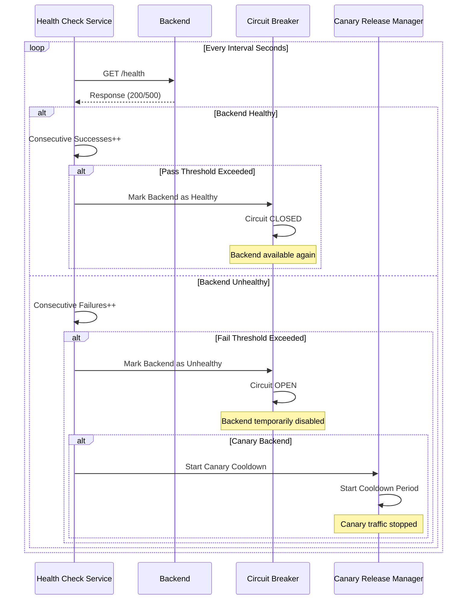
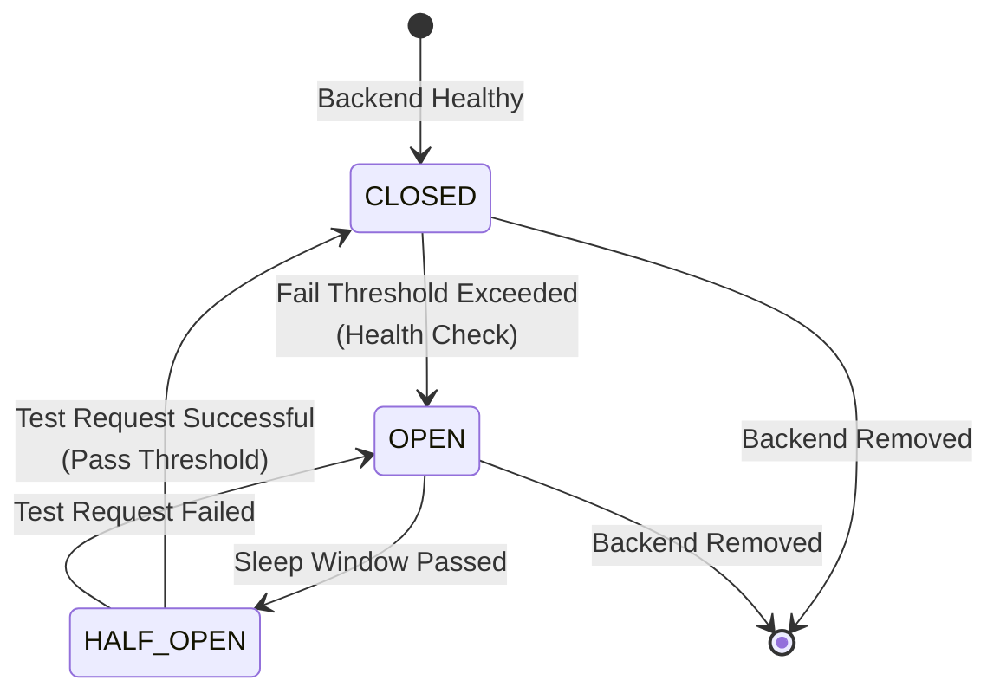

<Warning>
These features are only available for HTTP type API Proxies. These settings are not valid for gRPC and WebSocket type API Proxies.
</Warning>

## Retry Mechanism

Requests sent to backend APIs may fail due to timeouts, connection errors, or temporary errors. The **Retry** mechanism ensures that such temporary errors are automatically retried.

### Retry Parameters

| Parameter | Description |
|-----------|-------------|
| **Retry Count** | When a request sent to the backend API fails, it is retried this many times. If the value is 0, no retry is performed. |
| **Retry Delay** | Waiting time between each retry attempt. Exponential backoff or fixed delay can be used. |

### Retry Flow

The retry mechanism is triggered in the following situations:

- **Timeout:** When connection timeout or read timeout occurs
- **Error Codes:** When HTTP error codes (4xx, 5xx) are returned from the backend
- **Connection Errors:** When connection errors such as UnknownHostException, MalformedURLException occur

The retry mechanism works as follows:

1. **Initial request is sent** and result is checked:
   - If request is successful: Operation is completed
   - If request fails: Retry mechanism is activated

2. **Retry mechanism**:
   - If retry count is 0: Error is returned
   - If retry count is greater than 0: Retry loop is entered

3. **Retry loop** (from i = 1 to retry count):
   - If retry delay is active: Specified duration is waited
   - Request is retried
   - If request is successful: Operation is completed
   - If request fails and i < retry count: i is incremented and loop continues
   - If request fails and i = retry count: Failover mechanism is activated

## Failover Mechanism

The **Failover** mechanism automatically redirects requests to other backend addresses when one backend address fails.

### Failover Logic

The failover mechanism works with a simple and clear logic:

1. **Initial Request:** Sent to PRIMARY addresses (with load balancing)
2. **Failure Condition:** If the initial request fails and `failoverOnlyEnabled=true`
3. **Failover Addresses:** Requests are sent sequentially to addresses of type FAILOVER
4. **Failover Retry:** Each failover address is tried `failoverRetryCount` times

<Warning>
If `failoverOnlyEnabled=false` or `null`, the failover mechanism does not activate. In this case, after the retry mechanism is completed, an error is returned to the client.
</Warning>

### Failover Flow

The failover mechanism works as follows:

1. **Request is sent to PRIMARY backend** and retry count attempts are made:
   - If request is successful: Operation is completed
   - If all attempts fail: Failover check is performed

2. **Failover check**:
   - If `failoverOnlyEnabled = false` or `null`: Error is returned
   - If `failoverOnlyEnabled = true`: FAILOVER addresses are used

3. **FAILOVER addresses** (tried sequentially):
   - First failover address is selected
   - Failover retry count attempts are made
   - If request is successful: Operation is completed
   - If request fails: Next failover address is tried

4. **Until all failover addresses are tried**:
   - Each failover address is tried failover retry count times
   - First successful address is used and operation is completed
   - If all failover addresses fail: Error is returned

### Address Types

| Address Type | Description |
|--------------|-------------|
| **PRIMARY** | Backend addresses used for normal traffic. Initial requests are sent to these addresses. |
| **FAILOVER** | Addresses used only in failover situations. Activated when `failoverOnlyEnabled=true`. |
| **CANARY** | Addresses used for canary release. Not included in the failover mechanism. |
| **MIRROR** | Addresses used for traffic mirroring. Not included in the failover mechanism. |

## Active Health Check

The **Active Health Check** mechanism periodically checks the health status of backends and works integrated with circuit breaker to provide automatic failover.

### Health Check Parameters

| Parameter | Description |
|-----------|-------------|
| **Health Path** | The backend's health check endpoint. Must be specified as a full URL (e.g., `https://backend.example.com/health`). |
| **Interval (Seconds)** | How often health checks are performed. Default: 30 seconds. |
| **Timeout (Seconds)** | Timeout duration for health check requests. Default: 5 seconds. |
| **Fail Threshold** | Number of consecutive failures required to mark backend as unhealthy. Default: 3. |
| **Pass Threshold** | Number of consecutive successes required to mark backend as healthy. Default: 3. |

<Info>
If Health Path is empty or null, health check is not performed for that backend and backend health status is not monitored.
</Info>

### Health Check → Circuit Breaker Coordination

The health check mechanism works coordinated with circuit breaker to automatically disable and re-enable backends based on their health status.

### Health Check Lifecycle Management

When an API Proxy is deployed, updated, or undeployed, health check records are automatically managed:

- **Deploy/Update:** New backends are added, removed backends are deleted, unchanged backends' config is updated (health status preserved)
- **Undeploy:** All backends' health check records are cleaned up

## Circuit Breaker Integration

Circuit breaker works integrated with the health check mechanism to automatically activate or deactivate based on backend health status.

### Circuit Breaker States

### Circuit Breaker Parameters

| Parameter | Description |
|-----------|-------------|
| **Error Window** | Duration for which backend is monitored for errors. Specified in seconds. |
| **Error Threshold Value** | Maximum number or percentage of errors accepted during the error window. |
| **Error Threshold Type** | How error count is calculated (COUNT or PERCENT). |
| **Sleep Window** | Duration during which no requests are sent to backend after circuit opens. |
| **Half-Open** | After sleep window passes, a test request is sent to check backend status. |

### Circuit Breaker and Health Check Coordination

The health check mechanism automatically manages the circuit breaker:

- **Backend Unhealthy:** When health check fail threshold is exceeded, circuit breaker automatically transitions to OPEN state
- **Backend Healthy:** When health check pass threshold is exceeded, circuit breaker automatically transitions to CLOSED state

<Note>
Circuit breaker works coordinated with health check. If health check is not active, circuit breaker only works based on errors in actual requests.
</Note>

## Rollback Mechanism

During retry and failover operations, a rollback mechanism is used to preserve the message context state.

### Rollback Logic

The rollback mechanism works with a simple logic:

- **Initial Request (Primary):** No rollback is performed
- **Retry Requests (i > 1):** Rollback is performed before each retry
- **Failover Requests:** Rollback is performed for each failover address (because we're coming after the previous address)

This ensures that each new attempt starts with a clean message context.

## Related Topics

- [Load Balancing](/en/develop/routing/http-routing#load-balancing) - Load distribution among backend addresses
- [Canary Release](/en/develop/routing/canary-and-traffic-mirroring#canary-release) - Canary release mechanism integrated with health check
- [Circuit Breaker](/en/develop/routing/http-routing#circuit-breaker) - Detailed circuit breaker configuration

