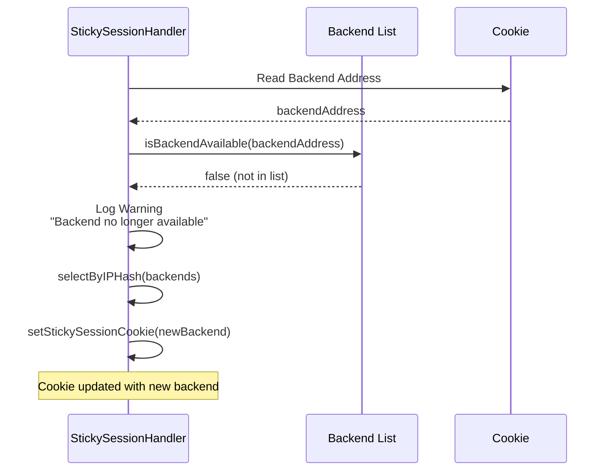
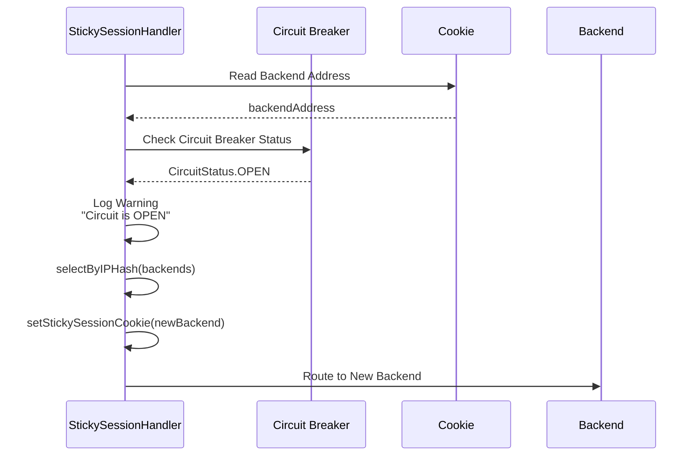

<Warning>
These features are only available for HTTP type API Proxies. These settings are not valid for gRPC and WebSocket type API Proxies.
</Warning>

## What is Sticky Session?

**Sticky Session** is a mechanism that ensures the same client is always routed to the same backend. This can be used in scenarios such as session state, cache locality, or backend-specific data consistency.

### Use Cases

- **Session State:** If session state is maintained in the backend, the same client must always be routed to the same backend
- **Cache Locality:** If there is client-specific cache in the backend, sticky session can be used to increase cache hit rate
- **Backend-Specific Data:** If backend-specific data is maintained for the client, sticky session may be required for consistency

## Sticky Session Types

Apinizer supports three different sticky session types:

| Type | Description |
|------|-------------|
| **COOKIE_ONLY** | Only cookie is used. If cookie is missing or invalid, IP hash fallback is performed. |
| **IP_HASH** | Only consistent hash based on client IP is used. Cookie is not used. |
| **HYBRID** | Cookie is checked first, if missing or invalid, IP hash is used. |

### Sticky Session Flow

The sticky session mechanism works as follows:

1. **When a request arrives**, the sticky session type is checked:
   - **IP_HASH**: Backend is selected directly by IP hash and request is sent (cookie is not set)
   - **COOKIE_ONLY or HYBRID**: Cookie check is performed

2. **Cookie check** (for COOKIE_ONLY or HYBRID):
   - If cookie is missing or invalid: Backend is selected by IP hash and cookie is set
   - If cookie exists: Cookie is read and validated

3. **After cookie validation**:
   - If backend address in cookie is not in current backend list: Warning is logged, new backend is selected by IP hash, and cookie is updated
   - If circuit breaker status of backend in cookie is OPEN: Warning is logged, new backend is selected by IP hash, and cookie is updated
   - If backend in cookie is valid and healthy: Backend from cookie is used

4. **After backend selection is complete**:
   - If sticky type is not IP_HASH: Cookie is set
   - Request is sent to selected backend

## Cookie Management

Cookie-based sticky session uses secure cookies signed with HMAC-SHA256.

### Cookie Format

The cookie format is as follows:

```
Cookie: sticky-session-name=base64(backendAddress:signature)
```

- **backendAddress:** Backend URL address
- **signature:** Signature calculated with HMAC-SHA256
- **Encoding:** Base64 URL-safe encoding (no padding)

### Cookie Validation

Cookie validation process:

1. **Cookie Reading:** Cookie value is read from request header
2. **Base64 Decode:** Cookie value is decoded
3. **Signature Verification:** Signature is verified with HMAC-SHA256
4. **Backend Address Extraction:** Backend address is extracted from valid cookie

<Warning>
If cookie signature validation fails, the cookie is considered invalid and IP hash fallback is performed. This prevents cookie manipulation attacks.
</Warning>

### Setting Cookie

Cookie is added to response header using the response header management mechanism:

```mermaid
sequenceDiagram
    participant SH as StickySessionHandler
    participant MC as Message Context
    participant R as Response
    
    SH->>SH: Calculate HMAC-SHA256 Signature
    SH->>SH: Build Cookie String<br/>(Name=Value; Path=/; Max-Age=TTL; HttpOnly; Secure; SameSite=Lax)
    SH->>MC: Get Existing Cookies
    MC-->>SH: Existing Cookies (if any)
    
    alt Existing Cookies Exist
        SH->>SH: Append with Delimiter (#)
        SH->>MC: Add Cookie to Response Header<br/>("Set-Cookie", existing + "#" + new)
    else No Existing Cookies
        SH->>MC: Add Cookie to Response Header<br/>("Set-Cookie", new)
    end
    
    MC->>R: Add Set-Cookie Header
```

<Info>
Thanks to the response header management mechanism, multiple cookies (e.g., PolicyOIDC and StickySession) can be added to the response simultaneously. Existing cookies are preserved.
</Info>

### Cookie Parameters

| Parameter | Description |
|-----------|-------------|
| **Sticky Cookie Name** | Name of the cookie. No default value, must be specified. |
| **Sticky Cookie TTL** | Cookie validity duration (seconds). If not specified, becomes a session cookie. |
| **Sticky Cookie HttpOnly** | Whether the cookie can be accessed from JavaScript. |
| **Sticky Cookie Secure** | Whether the cookie is sent only over HTTPS. |
| **Sticky Hash Secret** | Secret key used for HMAC-SHA256 signature. If not specified, default value is used. |

## Backend Availability and Circuit Breaker

Sticky session checks backend availability and circuit breaker status.

### Backend Availability Check

If the backend address in the cookie is not in the current backend list:

1. **Warning Logged:** Warning that backend is no longer available
2. **IP Hash Fallback:** New backend is selected by IP hash
3. **Cookie Updated:** New backend address is written to cookie



### Circuit Breaker Integration

The circuit breaker status of the backend in the cookie is checked:

- **Circuit CLOSED:** Backend is healthy, backend from cookie is used
- **Circuit OPEN:** Backend is unhealthy, new backend is selected and cookie is updated



<Note>
Circuit breaker check is performed after cookie validation and backend availability check. This ensures that requests are not sent to unhealthy backends.
</Note>

## IP Hash Fallback

If cookie is missing, invalid, or backend is not available, backend is selected by IP hash.

### Consistent Hashing

IP hash performs consistent hashing based on client IP:

1. **IP Hash Calculation:** `Math.abs(clientIp.hashCode())`
2. **Backend Selection:** `hash % backends.size()`
3. **Consistency:** Same IP always routes to the same backend

<Info>
IP hash selects the same backend as long as the client IP does not change. This provides sticky session-like behavior without cookies.
</Info>

## Sticky Session and Load Balancing

Sticky session can be used together with load balancing algorithms:

- **Initial Request:** Backend is selected with load balancing algorithm (Round Robin, Weighted, LRU, Random)
- **Subsequent Requests:** Backend from cookie is used (after availability and circuit breaker checks)

<Warning>
When sticky session is active, load balancing is only valid for the initial request. Subsequent requests are routed to the backend in the cookie.
</Warning>

## Related Topics

- [Load Balancing](/en/develop/routing/http-routing#load-balancing) - Backend selection for initial request
- [Retry and Failover](/en/develop/routing/retry-and-failover) - Circuit breaker and health check mechanisms

