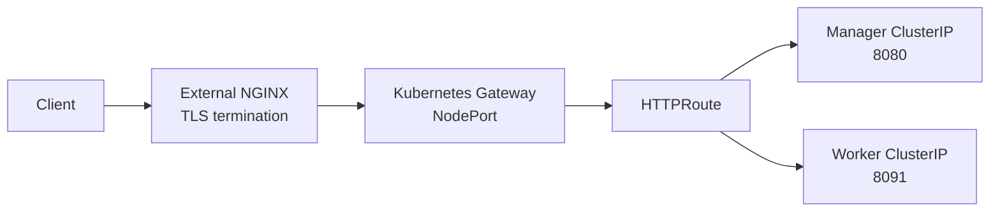

For a long time, external traffic in Kubernetes was managed first with **Services (NodePort / LoadBalancer)** and then with **Ingress**. Gateway API does not replace Ingress; it is the official next-generation traffic layer that addresses Ingress's limitations.

This document explains why Gateway API was introduced, how it differs from Ingress, and how to place NGINX Gateway Fabric in front of an **existing Apinizer environment**.

:::info

You do not need to delete Apinizer Manager or Worker pods, change their images, or move them to another namespace. Only the routing layer for HTTP traffic entering the cluster changes.

:::

:::warning Two different "Gateways"

**Apinizer Gateway (Worker)** is the Apinizer component that manages APIs (typically on port `8091`).

**Kubernetes Gateway API** is the Kubernetes layer that routes HTTP/TCP/UDP traffic entering the cluster using standard CRDs.

This page installs the latter and connects it to existing Apinizer services.

:::

## The Evolution of Traffic Management in Kubernetes

When Kubernetes was first released, external traffic was managed with **Services** (`NodePort` or `LoadBalancer`). As the need for HTTP-based host and path routing grew, **Ingress** was introduced.

Ingress is sufficient for simple scenarios, but falls short in environments with multiple teams, namespaces, and access-control requirements. Advanced features such as traffic splitting, header modification, redirects, and rewrites are not available in the standard API; each Ingress Controller handles them with its own **annotations**. Kubernetes cannot validate these annotations, so behavior becomes vendor-specific.

Kubernetes SIG-Network developed **Gateway API** as an official project to make Layer 4 (TCP/UDP) and Layer 7 (HTTP/HTTPS/gRPC) routing **standardized, role-oriented, and extensible**.

## A Brief Refresher on Ingress

Ingress is a Kubernetes API object used to expose HTTP/HTTPS traffic. Its basic capabilities include:

- Host-based routing
- Path-based routing

It has limitations in enterprise and multi-tenant environments:

- Weak namespace isolation and role separation with RBAC
- A single Ingress resource can control traffic for different teams
- Traffic splitting, header manipulation, redirects/rewrites, and rate limiting are not standardized
- Validation is left to the controller at runtime

## What Is Gateway API?

Gateway API is an official family of APIs added to Kubernetes as CRDs. It brings the Ingress, L4 load balancer, and service mesh routing approaches together under **a single API framework**.

It provides:

- Support for HTTP, HTTPS, TCP, UDP, and gRPC
- Role-based separation: `GatewayClass` (infrastructure), `Gateway` (cluster operator), and `HTTPRoute` (application team)
- Namespace-based isolation and suitability for multi-tenant use
- Vendor independence and resources validated by Kubernetes
- Native filters instead of annotations (redirect, rewrite, header, traffic split, and request mirror)

Gateway API is only an **API definition**. A **Gateway Controller** is required to carry actual traffic. This guide uses **NGINX Gateway Fabric** as the controller; the resources described (`Gateway`, `HTTPRoute`) are controller-independent.

## Ingress vs. Gateway API

| Feature | Ingress | Gateway API |
| --- | --- | --- |
| Protocol | HTTP/HTTPS | HTTP/HTTPS/TCP/UDP/gRPC |
| Multi-tenancy | No | Yes |
| RBAC / role separation | Limited | `GatewayClass`, `Gateway`, `Route` |
| Traffic splitting | No (annotation) | Native |
| Header manipulation | Annotation | Native |
| Validation | Runtime, controller-dependent | At the API level |
| Vendor lock-in | High (annotations) | Low (standard API) |

Gateway API is installed in Kubernetes as **CRDs**, so it can be updated independently of the Kubernetes version. This guide uses the Gateway API CRDs provided with **NGINX Gateway Fabric v2.7.2**.

## Traffic Flow in an Apinizer Environment

If Apinizer is already running in the cluster, you do not reinstall the Worker. You add the Gateway API layer in front of the cluster:



In on-premises environments that cannot obtain a LoadBalancer VIP (without MetalLB), a typical setup is:

```
Internet
  → existing external NGINX (TLS)
    → Kubernetes Gateway (NodePort)
      → HTTPRoute
        → Manager Service (e.g., qa.apinizer.com)
        → Worker Service (e.g., apiqa.apinizer.com)
```

If you have a cloud LoadBalancer or MetalLB, the Gateway Service receives a `LoadBalancer` VIP directly; an external NGINX layer is not required.

## Required and Not Required for Installation

The initial installation requires:

- Gateway API CRDs
- NGINX Gateway Fabric
- One `Gateway`
- An `HTTPRoute` for Manager
- An `HTTPRoute` for each Worker environment
- If there is no VIP, updating the upstream NGINX to point to the new NodePort

The initial installation **does not require** traffic splitting, request mirroring, path rewriting, TCP/UDP, or gRPC. These can be added with `HTTPRoute` filters after the system is up and running.

Do not create new Manager or Worker Services; use the existing service names. Do not remove the old Ingress or NodePort routes until the Gateway has been verified.

## Step 1 – Document the Existing Environment

Connect to the cluster and run:

```bash
kubectl get ns
kubectl get deploy,svc,ing -A | grep -E 'apimanager|worker|manager|ingress|nginx'
helm list -A
kubectl get gatewayclass,gateway,httproute -A
```

Record:

- Which namespace contains Manager? (commonly `apinizer`)
- Which namespaces contain Workers? (for example, `prod`, `test`)
- Manager Service name and port (usually `8080`)
- Worker Service name and port (usually `8091`)
- Which domains receive external traffic?
- Is there already an Ingress or external NGINX in front?

An example Apinizer cluster might look like this:

| Component | Namespace | Service | Type | Port |
| --- | --- | --- | --- | --- |
| Manager | `apinizer` | `apimanager` | NodePort (`32080`) | `8080` |
| Worker (prod) | `prod` | `worker-management-api-http-service` | ClusterIP | `8091` |
| Worker (test) | `test` | `worker-management-api-http-service` | ClusterIP | `8091` |

There may also be **NodePort** Services named `worker-http-service` in the same namespaces (`30080`, `30090`). Do not use these as HTTPRoute backends; use the **ClusterIP** `worker-management-api-http-service`.

Not having Helm is not a problem; this guide installs the resources using `kubectl` manifests.

Set the following values according to your environment:

```bash
MANAGER_NS=apinizer
MANAGER_SVC=apimanager
MANAGER_PORT=8080
MANAGER_HOST=qa.apinizer.com

WORKER_PROD_NS=prod
WORKER_TEST_NS=test
WORKER_SVC=worker-management-api-http-service
WORKER_PORT=8091
WORKER_PROD_HOST=apiqa.apinizer.com
WORKER_TEST_HOST=apitest.apinizer.com

GATEWAY_NS=default
GATEWAY_NAME=nginx-gateway
DOMAIN_WILDCARD="*.apinizer.com"
```

## Step 2 – Install the Gateway API CRDs

Gateway API is not a built-in Kubernetes resource; it is added to the cluster as CRDs. HTTP is sufficient for Apinizer Manager and Worker; TCP/UDP is not needed for now.

Install the **standard** channel compatible with the NGINX Gateway Fabric version:

```bash
kubectl kustomize "https://github.com/nginx/nginx-gateway-fabric/config/crd/gateway-api/standard?ref=v2.7.2" | kubectl apply --server-side -f -
```

Verify:

```bash
kubectl get crd | grep gateway.networking.k8s.io
```

You should see: `gatewayclasses`, `gateways`, `httproutes`, `grpcroutes`, and `referencegrants`.

:::warning

Do not apply `standard-install.yaml` and `experimental-install.yaml` one after the other. The CRD version must match the NGINX Gateway Fabric version you install. Switch to the experimental channel later if you need TCP/UDP.

:::

## Step 3 – Install NGINX Gateway Fabric

Gateway API only defines the resources. A controller is required to carry traffic. If you do not use Helm, the official NodePort manifest is sufficient. You do not need to install cert-manager; the certificate job included in the manifest is sufficient.

```bash
kubectl create namespace nginx-gateway
kubectl apply --server-side -f https://raw.githubusercontent.com/nginx/nginx-gateway-fabric/v2.7.2/deploy/crds.yaml
kubectl apply -f https://raw.githubusercontent.com/nginx/nginx-gateway-fabric/v2.7.2/deploy/nodeport/deploy.yaml
```

If you can obtain a VIP through a cloud LoadBalancer or MetalLB, use `default/deploy.yaml` (LoadBalancer) instead of `nodeport/deploy.yaml`.

Alternative if you use Helm:

```bash
helm install ngf oci://ghcr.io/nginx/charts/nginx-gateway-fabric \
  --create-namespace -n nginx-gateway \
  --set nginx.service.type=NodePort
```

Verify:

```bash
kubectl get pods -n nginx-gateway
kubectl get gatewayclass
```

The pod should be `Running`. The `GatewayClass` is usually named `nginx`; the manifest or Helm creates it automatically.

:::warning

Do not manually create a `GatewayClass` with `controllerName: nginx.org/gateway-controller`. NGINX Gateway Fabric expects:

```
gateway.nginx.org/nginx-gateway-controller
```

Use the pre-created `nginx` class.

:::

## Step 4 – Define a Gateway

`Gateway` defines where traffic enters the cluster. It is part of the platform layer and is defined once.

Replace the hostname with your own domain. If Manager and Worker use separate subdomains, a wildcard hostname is sufficient.

```yaml
apiVersion: gateway.networking.k8s.io/v1
kind: Gateway
metadata:
  name: nginx-gateway
  namespace: default
spec:
  gatewayClassName: nginx
  listeners:
  - name: http
    protocol: HTTP
    port: 80
    hostname: "*.apinizer.com"
    allowedRoutes:
      namespaces:
        from: All
```

Fields:

- `gatewayClassName`: Which controller manages this Gateway (`nginx`)
- `listeners.protocol` / `port`: HTTP, port 80
- `hostname`: Hosts accepted by this listener
- `allowedRoutes.namespaces.from: All`: Allows `HTTPRoute` resources from all namespaces to use this Gateway

Apply:

```bash
kubectl apply -f gateway.yaml
kubectl get gateway -n default
kubectl describe gateway nginx-gateway -n default
```

Expected status:

- `Accepted=True`
- `Programmed=True`
- A Service is created at the same time (`NodePort` or `LoadBalancer`)

After a Gateway is defined, NGINX Gateway Fabric provisions the data-plane pods and Service. Get the NodePort:

```bash
kubectl get svc -A | grep -i nginx
```

For example, `80:32476/TCP` means the port to configure on the external NGINX is `32476`. This is not one of the existing Apinizer NodePorts (`32080`, `30080`, `30090`).

## Step 5 – Connect to Apinizer Services with HTTPRoute

`HTTPRoute` is the Gateway API equivalent of Ingress's "host + path → backend". The Route is placed **in the application's namespace**; it connects to the Gateway with `parentRefs.namespace: default`, even though the Gateway is in the `default` namespace.

If the existing ClusterIP Service is available, do not create a new Service. Do not guess the selector; an empty endpoint list results in `502`.

To verify selectors and endpoints:

```bash
kubectl get deploy,po -n apinizer --show-labels
kubectl get endpoints -n apinizer apimanager
kubectl get endpoints -n prod worker-management-api-http-service
kubectl get endpoints -n test worker-management-api-http-service
```

Do not attach an HTTPRoute if `ENDPOINTS` is empty.

### Manager

```yaml
apiVersion: gateway.networking.k8s.io/v1
kind: HTTPRoute
metadata:
  name: apinizer-manager-route
  namespace: apinizer
spec:
  parentRefs:
  - name: nginx-gateway
    namespace: default
  hostnames:
  - qa.apinizer.com
  rules:
  - matches:
    - path:
        type: PathPrefix
        value: /
    backendRefs:
    - name: apimanager
      port: 8080
```

Requests to `qa.apinizer.com` go through the Gateway to the `apimanager` Service (`8080`).

### Worker (prod)

```yaml
apiVersion: gateway.networking.k8s.io/v1
kind: HTTPRoute
metadata:
  name: apinizer-worker-prod-route
  namespace: prod
spec:
  parentRefs:
  - name: nginx-gateway
    namespace: default
  hostnames:
  - apiqa.apinizer.com
  rules:
  - matches:
    - path:
        type: PathPrefix
        value: /
    backendRefs:
    - name: worker-management-api-http-service
      port: 8091
```

### Worker (test)

```yaml
apiVersion: gateway.networking.k8s.io/v1
kind: HTTPRoute
metadata:
  name: apinizer-worker-test-route
  namespace: test
spec:
  parentRefs:
  - name: nginx-gateway
    namespace: default
  hostnames:
  - apitest.apinizer.com
  rules:
  - matches:
    - path:
        type: PathPrefix
        value: /
    backendRefs:
    - name: worker-management-api-http-service
      port: 8091
```

Apply the resources and check their status:

```bash
kubectl apply -f manager-httproute.yaml
kubectl apply -f worker-prod-httproute.yaml
kubectl apply -f worker-test-httproute.yaml
kubectl get httproute -A
kubectl describe httproute apinizer-manager-route -n apinizer
kubectl describe httproute apinizer-worker-prod-route -n prod
kubectl describe httproute apinizer-worker-test-route -n test
```

`parentRefs` should be **Accepted**. If `Accepted=False`, common causes include:

- Incorrect Gateway name or namespace
- The HTTPRoute hostname does not match the Gateway listener hostname (a host outside `*.apinizer.com`)
- `allowedRoutes` does not allow that namespace

## Step 6 – Point the External NGINX to the Gateway NodePort

If there is no LoadBalancer VIP, TLS terminates at the NGINX in front of the cluster, not inside the cluster. This layer acts as a temporary L7 proxy in front of Gateway API.

1. Get the Gateway NodePort (`NODEPORT`).
2. Get the node IP or VIP (`NODE_IP`).
3. In the external NGINX, set `proxy_pass` to the Gateway NodePort, **not the old Apinizer NodePort**.

Worker example (`/etc/nginx/sites-enabled/apiqa.apinizer.com`):

```nginx
server {
    server_name apiqa.apinizer.com;
    listen 443 ssl;
    ssl_certificate     /etc/letsencrypt/live/apiqa.apinizer.com/fullchain.pem;
    ssl_certificate_key /etc/letsencrypt/live/apiqa.apinizer.com/privkey.pem;
    underscores_in_headers on;

    location / {
        proxy_set_header Host $host;
        proxy_set_header X-Real-IP $remote_addr;
        proxy_set_header X-Forwarded-For $proxy_add_x_forwarded_for;
        client_max_body_size 100M;

        proxy_http_version 1.1;
        proxy_set_header Upgrade $http_upgrade;
        proxy_set_header Connection "upgrade";

        proxy_pass http://NODE_IP:NODEPORT;
    }
}
```

The Manager domain (`qa.apinizer.com`) uses the **same** `NODE_IP:NODEPORT` destination. The Host header distinguishes the domains; Gateway API selects the appropriate `HTTPRoute` based on `Host`.

```bash
nginx -t
systemctl reload nginx
```

:::note

Separate `location` blocks for `/auth/` and `/credential/` are not required. If the Worker HTTPRoute already matches `/`, the same NodePort is sufficient. If you keep separate locations, they must all use the same `NODE_IP:NODEPORT`.

:::

:::info X-Forwarded-For

In Apinizer 2024.05.4 and later, the Management Console checks client IP information. The external NGINX must forward the `X-Forwarded-For` and `Host` headers. See the XFF section on the [Accessing Apinizer with Kubernetes Ingress](/en/operations/administrator-guides/kubernetes-ingress-apinizer-access) page for details.

:::

## Step 7 – Verify

Test with a Host header from inside the cluster or through the NodePort without waiting for DNS:

```bash
kubectl get gatewayclass
kubectl get gateway -n default
kubectl get httproute -A
kubectl get pods -n nginx-gateway
kubectl get nodes -o wide
kubectl get svc -A | grep -i nginx
```

```bash
NODE_IP=<node-ip>
GW_PORT=<gateway-nodeport>

curl -sI -H "Host: qa.apinizer.com"      http://$NODE_IP:$GW_PORT/
curl -sI -H "Host: apiqa.apinizer.com"   http://$NODE_IP:$GW_PORT/
curl -sI -H "Host: apitest.apinizer.com" http://$NODE_IP:$GW_PORT/
```

From outside, after updating NGINX:

```bash
curl -I https://qa.apinizer.com
curl -I https://apiqa.apinizer.com
```

Expected results:

- Manager UI opens
- Worker API endpoint responds

Do not disable the old `32080` / `30080` / `30090` routes (or the existing Ingress) until the new route returns `200`.

## Optional: Terminate TLS Inside the Cluster

For the initial setup, TLS can remain at the external NGINX. To terminate it at the Gateway later, add an HTTPS listener. The Secret must be in the **same namespace** as the Gateway (`default`):

```yaml
listeners:
- name: https
  protocol: HTTPS
  port: 443
  hostname: "*.apinizer.com"
  tls:
    mode: Terminate
    certificateRefs:
    - kind: Secret
      name: tls-secret
  allowedRoutes:
    namespaces:
      from: All
```

Example command to create the Secret:

```bash
kubectl create secret tls tls-secret --key tls.key --cert tls.crt -n default
```

## Native HTTPRoute Features (After Installation)

Tasks handled by annotations in Ingress are native filters in Gateway API. Do not configure them on day one; add them after the HTTPRoute is up and running.

HTTP → HTTPS redirect:

```yaml
filters:
- type: RequestRedirect
  requestRedirect:
    scheme: https
```

Path rewrite (`/old` → `/new`):

```yaml
filters:
- type: URLRewrite
  urlRewrite:
    path:
      replacePrefixMatch: /new
```

Add a header:

```yaml
filters:
- type: RequestHeaderModifier
  requestHeaderModifier:
    add:
    - name: X-Env
      value: staging
```

Traffic splitting (canary / A-B):

```yaml
backendRefs:
- name: v1-service
  port: 80
  weight: 80
- name: v2-service
  port: 80
  weight: 20
```

Official guides:

- [HTTP routing](https://gateway-api.sigs.k8s.io/guides/http-routing/)
- [Redirect and rewrite](https://gateway-api.sigs.k8s.io/guides/http-redirect-rewrite/)
- [Traffic splitting](https://gateway-api.sigs.k8s.io/guides/traffic-splitting/)
- [TLS](https://gateway-api.sigs.k8s.io/guides/tls/)
- [NGINX Gateway Fabric Helm](https://docs.nginx.com/nginx-gateway-fabric/install/helm/)

## Common Mistakes

- Manually creating a `GatewayClass` with an incorrect `controllerName`
- Assuming an HTTPRoute must be in the same namespace as the Gateway and forgetting `parentRefs.namespace: default`
- Creating a new ClusterIP and guessing its selector (empty endpoints → `502`)
- Using `worker-http-service` (NodePort) as the HTTPRoute backend
- Leaving the external NGINX pointing to the old Worker/Manager NodePort
- Setting up TCP/UDP/gRPC examples on day one
- Removing a working Ingress or old NodePort before verifying the Gateway

## Conclusion

Gateway API makes ingress and traffic routing in Kubernetes standardized, role-based, and extensible. In practice for Apinizer, the Manager and Worker pods remain unchanged; external traffic reaches their respective ClusterIP Services through `Gateway` + `HTTPRoute`.

If there is no VIP, the external NGINX only forwards TLS and WebSocket traffic; Kubernetes Gateway API handles host-based routing.
