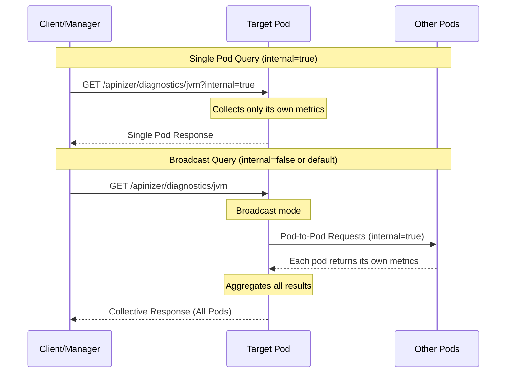
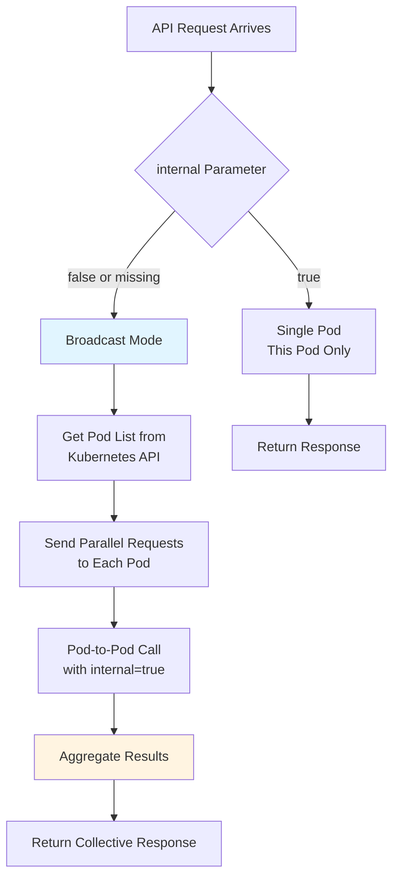

## Overview

Diagnostic endpoints provide the ability to collect detailed information about the operational status of Worker and Cache modules. With these endpoints, you can access JVM metrics, thread information, connection states, environment variables, and more.

### Use Cases

<CardGroup cols={2}>
<Card title="Performance Analysis" icon="chart-line">
You can monitor JVM memory usage, thread counts, and system resources in real-time.
</Card>

<Card title="Troubleshooting" icon="bug">
You can detect memory leaks and deadlock issues by taking thread dumps and heap dumps.
</Card>

<Card title="Capacity Planning" icon="gauge">
You can make scaling decisions by monitoring system resource usage.
</Card>

<Card title="Centralized Monitoring" icon="eye">
You can perform cluster-wide status analysis by querying all pods collectively.
</Card>
</CardGroup>

### Access Methods

You can access diagnostic endpoints in two different ways:

<Tabs>
<Tab title="Server Management Screen">

You can access diagnostic information of all pods through the visual interface from the **System → Server Management** screen in API Manager. This method is suitable for manual control and quick analysis.

</Tab>
<Tab title="API Access">

You can access endpoints directly with HTTP requests. This method is ideal for automation, monitoring systems, and script-based controls.

</Tab>
</Tabs>

## Workflow

The operational logic of diagnostic endpoints is shown in the diagram below:



### Broadcast Mechanism

When `internal=false` (or when the parameter is not provided), the requested pod forwards requests to all other pods in the cluster and collects the results:



## Authorization

All diagnostic endpoints require authorization. **Environment ID** is used in requests:

<Steps>
<Step title="Add Authorization Header">
You must send the active environment ID in the `Authorization` header in the request.

```bash
Authorization: <ENVIRONMENT_ID>
```
</Step>

<Step title="Validation">
Worker and Cache pods compare the incoming token with their own environment IDs.
</Step>

<Step title="Access">
If the token matches, the request is processed; otherwise, `401 Unauthorized` is returned.
</Step>
</Steps>

<Warning>
You can obtain the Environment ID from **Environment** settings in API Manager or from your system administrator. Requests made with incorrect or missing authorization information will be rejected.
</Warning>

## Worker Diagnostic Endpoints

Available endpoints for Worker module:

### JVM Metrics

JVM memory usage, heap/non-heap information, garbage collection statistics.

<Tabs>
<Tab title="From Within Kubernetes">

```bash
# Single pod
kubectl exec -it <any_pod_name> -n <namespace> -- curl -X GET \
  -H "Authorization: <ENVIRONMENT_ID>" \
  "http://worker-http-service.prod.svc.cluster.local:8091/apinizer/diagnostics/jvm?internal=true"

# All pods (broadcast)
kubectl exec -it <any_pod_name> -n <namespace> -- curl -X GET \
  -H "Authorization: <ENVIRONMENT_ID>" \
  "http://worker-http-service.prod.svc.cluster.local:8091/apinizer/diagnostics/jvm"
```

</Tab>
<Tab title="From Outside Kubernetes">

```bash
# Single pod
curl -X GET \
  -H "Authorization: <ENVIRONMENT_ID>" \
  "http://<WORKER_ACCESS_URL>/apinizer/diagnostics/jvm?internal=true"

# All pods (broadcast)
curl -X GET \
  -H "Authorization: <ENVIRONMENT_ID>" \
  "http://<WORKER_ACCESS_URL>/apinizer/diagnostics/jvm"
```

</Tab>
</Tabs>

### Thread Information

Active thread count, thread states, thread pool usage.

<Tabs>
<Tab title="From Within Kubernetes">

```bash
kubectl exec -it <any_pod_name> -n <namespace> -- curl -X GET \
  -H "Authorization: <ENVIRONMENT_ID>" \
  "http://worker-http-service.prod.svc.cluster.local:8091/apinizer/diagnostics/threads?internal=true"
```

</Tab>
<Tab title="From Outside Kubernetes">

```bash
curl -X GET \
  -H "Authorization: <ENVIRONMENT_ID>" \
  "http://<WORKER_ACCESS_URL>/apinizer/diagnostics/threads"
```

</Tab>
</Tabs>

### Thread Dump

Detailed stack trace information of all threads. Used for deadlock detection.

<Tabs>
<Tab title="From Within Kubernetes">

```bash
kubectl exec -it <any_pod_name> -n <namespace> -- curl -X GET \
  -H "Authorization: <ENVIRONMENT_ID>" \
  "http://worker-http-service.prod.svc.cluster.local:8091/apinizer/diagnostics/threaddump?internal=true"
```

</Tab>
<Tab title="From Outside Kubernetes">

```bash
curl -X GET \
  -H "Authorization: <ENVIRONMENT_ID>" \
  "http://<WORKER_ACCESS_URL>/apinizer/diagnostics/threaddump"
```

</Tab>
</Tabs>

### Heap Dump

Binary dump of JVM heap memory. Used for memory analysis.

<Info>
The heap dump endpoint **does not support broadcast** and returns a binary file (.hprof) as output. Therefore, the `internal` parameter is not used, and the result should be saved to a file.
</Info>

<Tabs>
<Tab title="From Within Kubernetes">

```bash
kubectl exec -it <any_pod_name> -n <namespace> -- curl -X GET \
  -H "Authorization: <ENVIRONMENT_ID>" \
  "http://worker-http-service.prod.svc.cluster.local:8091/apinizer/diagnostics/heapdump" \
  --output heapdump-$(date +%Y%m%d-%H%M%S).hprof
```

</Tab>
<Tab title="From Outside Kubernetes">

```bash
curl -X GET \
  -H "Authorization: <ENVIRONMENT_ID>" \
  "http://<WORKER_ACCESS_URL>/apinizer/diagnostics/heapdump" \
  --output heapdump-$(date +%Y%m%d-%H%M%S).hprof
```

</Tab>
</Tabs>

### Connection Information

Active HTTP connections, connection pool states, backend connections.

<Tabs>
<Tab title="From Within Kubernetes">

```bash
kubectl exec -it <any_pod_name> -n <namespace> -- curl -X GET \
  -H "Authorization: <ENVIRONMENT_ID>" \
  "http://worker-http-service.prod.svc.cluster.local:8091/apinizer/diagnostics/connections?internal=true"
```

</Tab>
<Tab title="From Outside Kubernetes">

```bash
curl -X GET \
  -H "Authorization: <ENVIRONMENT_ID>" \
  "http://<WORKER_ACCESS_URL>/apinizer/diagnostics/connections"
```

</Tab>
</Tabs>

### Environment Variables

System and JVM environment variables, system properties.

<Tabs>
<Tab title="From Within Kubernetes">

```bash
kubectl exec -it <any_pod_name> -n <namespace> -- curl -X GET \
  -H "Authorization: <ENVIRONMENT_ID>" \
  "http://worker-http-service.prod.svc.cluster.local:8091/apinizer/diagnostics/env?internal=true"
```

</Tab>
<Tab title="From Outside Kubernetes">

```bash
curl -X GET \
  -H "Authorization: <ENVIRONMENT_ID>" \
  "http://<WORKER_ACCESS_URL>/apinizer/diagnostics/env"
```

</Tab>
</Tabs>

### Health Status

Pod health status, uptime, basic system information.

<Tabs>
<Tab title="From Within Kubernetes">

```bash
kubectl exec -it <any_pod_name> -n <namespace> -- curl -X GET \
  -H "Authorization: <ENVIRONMENT_ID>" \
  "http://worker-http-service.prod.svc.cluster.local:8091/apinizer/diagnostics/health?internal=true"
```

</Tab>
<Tab title="From Outside Kubernetes">

```bash
curl -X GET \
  -H "Authorization: <ENVIRONMENT_ID>" \
  "http://<WORKER_ACCESS_URL>/apinizer/diagnostics/health"
```

</Tab>
</Tabs>

### All Metrics

Collects all metrics except heap dump in a single call.

<Tabs>
<Tab title="From Within Kubernetes">

```bash
kubectl exec -it <any_pod_name> -n <namespace> -- curl -X GET \
  -H "Authorization: <ENVIRONMENT_ID>" \
  "http://worker-http-service.prod.svc.cluster.local:8091/apinizer/diagnostics/all?internal=true"
```

</Tab>
<Tab title="From Outside Kubernetes">

```bash
curl -X GET \
  -H "Authorization: <ENVIRONMENT_ID>" \
  "http://<WORKER_ACCESS_URL>/apinizer/diagnostics/all"
```

</Tab>
</Tabs>

## Cache Diagnostic Endpoints

Available endpoints for Cache module:

### JVM Metrics

<Tabs>
<Tab title="From Within Kubernetes">

```bash
# Single pod
kubectl exec -it <any_pod_name> -n <namespace> -- curl -X GET \
  -H "Authorization: <ENVIRONMENT_ID>" \
  "http://cache-http-service.prod.svc.cluster.local:8090/apinizer/diagnostics/jvm?internal=true"

# All pods (broadcast)
kubectl exec -it <any_pod_name> -n <namespace> -- curl -X GET \
  -H "Authorization: <ENVIRONMENT_ID>" \
  "http://cache-http-service.prod.svc.cluster.local:8090/apinizer/diagnostics/jvm"
```

</Tab>
<Tab title="From Outside Kubernetes">

```bash
curl -X GET \
  -H "Authorization: <ENVIRONMENT_ID>" \
  "http://<CACHE_ACCESS_URL>/apinizer/diagnostics/jvm"
```

</Tab>
</Tabs>

### Thread Information

<Tabs>
<Tab title="From Within Kubernetes">

```bash
kubectl exec -it <any_pod_name> -n <namespace> -- curl -X GET \
  -H "Authorization: <ENVIRONMENT_ID>" \
  "http://cache-http-service.prod.svc.cluster.local:8090/apinizer/diagnostics/threads?internal=true"
```

</Tab>
<Tab title="From Outside Kubernetes">

```bash
curl -X GET \
  -H "Authorization: <ENVIRONMENT_ID>" \
  "http://<CACHE_ACCESS_URL>/apinizer/diagnostics/threads"
```

</Tab>
</Tabs>

### Thread Dump

<Tabs>
<Tab title="From Within Kubernetes">

```bash
kubectl exec -it <any_pod_name> -n <namespace> -- curl -X GET \
  -H "Authorization: <ENVIRONMENT_ID>" \
  "http://cache-http-service.prod.svc.cluster.local:8090/apinizer/diagnostics/threaddump?internal=true"
```

</Tab>
<Tab title="From Outside Kubernetes">

```bash
curl -X GET \
  -H "Authorization: <ENVIRONMENT_ID>" \
  "http://<CACHE_ACCESS_URL>/apinizer/diagnostics/threaddump"
```

</Tab>
</Tabs>

### Heap Dump

<Tabs>
<Tab title="From Within Kubernetes">

```bash
kubectl exec -it <any_pod_name> -n <namespace> -- curl -X GET \
  -H "Authorization: <ENVIRONMENT_ID>" \
  "http://cache-http-service.prod.svc.cluster.local:8090/apinizer/diagnostics/heapdump" \
  --output cache-heapdump-$(date +%Y%m%d-%H%M%S).hprof
```

</Tab>
<Tab title="From Outside Kubernetes">

```bash
curl -X GET \
  -H "Authorization: <ENVIRONMENT_ID>" \
  "http://<CACHE_ACCESS_URL>/apinizer/diagnostics/heapdump" \
  --output cache-heapdump-$(date +%Y%m%d-%H%M%S).hprof
```

</Tab>
</Tabs>

### Environment Variables

<Tabs>
<Tab title="From Within Kubernetes">

```bash
kubectl exec -it <any_pod_name> -n <namespace> -- curl -X GET \
  -H "Authorization: <ENVIRONMENT_ID>" \
  "http://cache-http-service.prod.svc.cluster.local:8090/apinizer/diagnostics/env?internal=true"
```

</Tab>
<Tab title="From Outside Kubernetes">

```bash
curl -X GET \
  -H "Authorization: <ENVIRONMENT_ID>" \
  "http://<CACHE_ACCESS_URL>/apinizer/diagnostics/env"
```

</Tab>
</Tabs>

### Health Status

<Tabs>
<Tab title="From Within Kubernetes">

```bash
kubectl exec -it <any_pod_name> -n <namespace> -- curl -X GET \
  -H "Authorization: <ENVIRONMENT_ID>" \
  "http://cache-http-service.prod.svc.cluster.local:8090/apinizer/diagnostics/health?internal=true"
```

</Tab>
<Tab title="From Outside Kubernetes">

```bash
curl -X GET \
  -H "Authorization: <ENVIRONMENT_ID>" \
  "http://<CACHE_ACCESS_URL>/apinizer/diagnostics/health"
```

</Tab>
</Tabs>

### Hazelcast Metrics

Hazelcast cluster information, cache statistics, distributed map metrics.

<Info>
This endpoint is **only available in the Cache module** and shows the detailed status of the Hazelcast cluster.
</Info>

<Tabs>
<Tab title="From Within Kubernetes">

```bash
kubectl exec -it <any_pod_name> -n <namespace> -- curl -X GET \
  -H "Authorization: <ENVIRONMENT_ID>" \
  "http://cache-http-service.prod.svc.cluster.local:8090/apinizer/diagnostics/hazelcast?internal=true"
```

</Tab>
<Tab title="From Outside Kubernetes">

```bash
curl -X GET \
  -H "Authorization: <ENVIRONMENT_ID>" \
  "http://<CACHE_ACCESS_URL>/apinizer/diagnostics/hazelcast"
```

</Tab>
</Tabs>

### All Metrics

<Tabs>
<Tab title="From Within Kubernetes">

```bash
kubectl exec -it <any_pod_name> -n <namespace> -- curl -X GET \
  -H "Authorization: <ENVIRONMENT_ID>" \
  "http://cache-http-service.prod.svc.cluster.local:8090/apinizer/diagnostics/all?internal=true"
```

</Tab>
<Tab title="From Outside Kubernetes">

```bash
curl -X GET \
  -H "Authorization: <ENVIRONMENT_ID>" \
  "http://<CACHE_ACCESS_URL>/apinizer/diagnostics/all"
```

</Tab>
</Tabs>

## Endpoint Comparison Table

| Endpoint | Worker | Cache | Broadcast | Description |
|----------|--------|-------|-----------|-------------|
| `/jvm` | ✅ | ✅ | ✅ | JVM memory and GC metrics |
| `/threads` | ✅ | ✅ | ✅ | Thread information and states |
| `/threaddump` | ✅ | ✅ | ✅ | Detailed thread stack trace |
| `/heapdump` | ✅ | ✅ | ❌ | Binary heap dump file |
| `/connections` | ✅ | ❌ | ✅ | HTTP connection pool information |
| `/env` | ✅ | ✅ | ✅ | Environment variables |
| `/health` | ✅ | ✅ | ✅ | Health status and uptime |
| `/hazelcast` | ❌ | ✅ | ✅ | Hazelcast cluster metrics |
| `/all` | ✅ | ✅ | ✅ | All metrics (except heapdump) |

## Use Case Scenarios

<AccordionGroup>
<Accordion title="Memory Leak Detection">

1. Regularly monitor memory usage with the `/jvm` endpoint
2. Detect continuous increase in heap memory
3. Take a heap dump with `/heapdump`
4. Analyze with Eclipse MAT or VisualVM

```bash
# Monitor memory usage
curl -X GET -H "Authorization: <ENV_ID>" \
  "http://<WORKER_URL>/apinizer/diagnostics/jvm" | jq '.pods[].jvm.memory'

# Take heap dump
curl -X GET -H "Authorization: <ENV_ID>" \
  "http://<WORKER_URL>/apinizer/diagnostics/heapdump" \
  --output analysis.hprof
```

</Accordion>

<Accordion title="Deadlock Analysis">

You can detect deadlock situations by taking thread dumps:

```bash
# Take thread dump
curl -X GET -H "Authorization: <ENV_ID>" \
  "http://<WORKER_URL>/apinizer/diagnostics/threaddump" \
  | jq '.pods[].threadDump' > threaddump.txt

# Search for "deadlock" in the file
grep -i "deadlock" threaddump.txt
```

</Accordion>

<Accordion title="Cluster-Wide Performance Analysis">

You can check the status of all pods in a single call:

```bash
# Get all metrics of all pods
curl -X GET -H "Authorization: <ENV_ID>" \
  "http://<WORKER_URL>/apinizer/diagnostics/all" \
  | jq '.' > cluster-diagnostics.json

# List memory usage of each pod
cat cluster-diagnostics.json | jq '.pods[] | {pod: .podName, heapUsed: .jvm.memory.heap.used, heapMax: .jvm.memory.heap.max}'
```

</Accordion>

<Accordion title="Automated Monitoring Integration">

You can integrate with Prometheus, Grafana, or custom monitoring systems:

```bash
#!/bin/bash
# monitoring-script.sh
while true; do
  RESPONSE=$(curl -s -X GET -H "Authorization: $ENV_ID" \
    "http://$WORKER_URL/apinizer/diagnostics/jvm")
  
  echo "$RESPONSE" | jq -r '.pods[] | "\(.podName) - Heap: \(.jvm.memory.heap.used)/\(.jvm.memory.heap.max)"'
  
  sleep 60
done
```

</Accordion>

<Accordion title="Connection Pool Monitoring">

You can check connection pool states in Worker pods:

```bash
# Connection pool metrics
curl -X GET -H "Authorization: <ENV_ID>" \
  "http://<WORKER_URL>/apinizer/diagnostics/connections" \
  | jq '.pods[] | {pod: .podName, activeConnections: .connections.active, idleConnections: .connections.idle}'
```

</Accordion>
</AccordionGroup>

## Best Practices

<CardGroup cols={2}>
<Card title="Regular Monitoring" icon="clock">
Perform proactive troubleshooting by periodically checking `/health` and `/jvm` endpoints.
</Card>

<Card title="Broadcast Usage" icon="tower-broadcast">
Use broadcast mode (without `internal` parameter) to check all pods in production environment.
</Card>

<Card title="Heap Dump Size" icon="hard-drive">
Heap dumps can create large files. Ensure sufficient disk space is available.
</Card>

<Card title="Authorization Security" icon="shield">
Store Environment ID securely and do not display it in logs.
</Card>
</CardGroup>

<Warning>
**Performance Note**: Heap dump and thread dump operations can create load on the pod. It is recommended to perform these operations during low-traffic hours in production environments.
</Warning>

## Related Resources

For more information, you can check the following pages:

- [Healthcheck and Version Addresses](/en/operations/healthcheck-version-addresses)
- [Prometheus and Grafana Integration](/en/operations/administrator-guides/prometheus-grafana-integration)
- [Gateway Metrics Integration](/en/operations/administrator-guides/gateway-metrics-integration/gateway-metrics-overview)
- [Cache Metrics Integration](/en/operations/administrator-guides/cache-metrics-integration/cache-metrics-overview)

