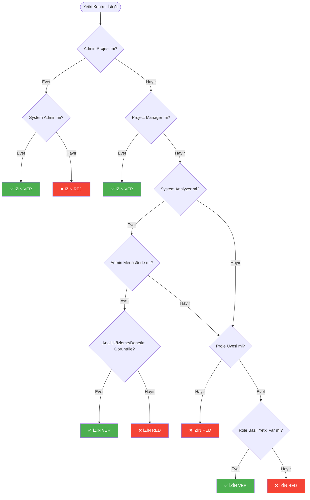

<Info>
Lütfen rol ve yetki arasındaki farka dikkat ediniz. Rol yetkilerin gruplandırılmış halidir ve [roller sayfasından](/tr/admin/user-access-management/rol) yönetilir. Detaylı rol yetki matrisleri için [Rol Yetki Detayları](/tr/admin/user-access-management/rol-yetki-detaylari) sayfasına bakabilirsiniz.
</Info>

## Mevcut Yetkilendirme Modeli

Apinizer'da yetkilendirme sistemi **asset kategorisi + aksiyon** modeline dayalıdır. Her asset kategorisi, benzer işlevlere sahip bileşenleri gruplar ve her kategori için belirli aksiyonlar tanımlanmıştır.

### Asset Kategorileri

Apinizer'da 12 farklı asset kategorisi bulunmaktadır. Her kategori, belirli bileşenleri ve işlevleri kapsar:

| Kategori | Kapsadığı Bileşenler | Desteklenen Aksiyonlar | Auto-Deploy |
|----------|---------------------|----------------------|-------------|
| **API Yönetimi** | API Proxy, Proxy Group, Routing, Policy | Görüntüle, Yönet, Dağıt/Kaldır, Dışa/İçe Aktar | - |
| **API Oluşturucu** | DB to API, Script to API, Mock API | Görüntüle, Yönet, Dışa/İçe Aktar | - |
| **API Entegratör** | Task Flow Manager, Integration Server | Görüntüle, Yönet, Çalıştır | - |
| **Global Ayarlar** | Policy Settings, Predefined Values, IP Groups | Görüntüle, Yönet, Dışa/İçe Aktar | ✓ |
| **Bağlantılar** | Database, LDAP, Kafka, RabbitMQ, Email, Webhook, FTP, vb. | Görüntüle, Yönet, Dışa/İçe Aktar | ✓ |
| **Kimlik ve Erişim Kontrolü** | Credential, Certificate, Key, JWK, KeyStore | Görüntüle, Yönet, Dışa/İçe Aktar | ✓ |
| **Gizli Anahtarlar ve Sertifikalar** | Şifreli değerler, gizli bilgiler | Görüntüle, Yönet, Dışa/İçe Aktar | ✓ |
| **İzleme** | Uptime Monitor, Anomaly Detector, Custom Queries, Filters | Görüntüle, Yönet | - |
| **Analitik ve Raporlar** | Reports, Dashboards, Traffic Logs, Custom Queries, Filters | Görüntüle, Yönet | - |
| **Denetim ve Uygulama Kayıtları** | Audit Logs, History Records | Görüntüle | - |
| **Test** | Test Console, Test Collections | Görüntüle, Çalıştır | - |
| **Proje Yönetimi** | Project, Members, Roles, Teams | Görüntüle, Yönet, Dışa/İçe Aktar | - |

### Aksiyonlar

Her asset kategorisi için beş farklı aksiyon tanımlanmıştır:

- **Görüntüle**: Bileşenleri görüntüleme yetkisi
- **Yönet**: Bileşenleri oluşturma, düzenleme ve silme yetkisi. Auto-deploy kategorilerinde Yönet yetkisi aynı zamanda değişikliklerin otomatik olarak worker'lara deploy edilmesini de içerir
- **Dağıt/Kaldır**: API Proxy ve Proxy Group'ları worker'lara deploy etme ve kaldırma yetkisi
- **Çalıştır**: Test işlemlerini çalıştırma yetkisi
- **Dışa/İçe Aktar**: Bileşenleri export ve import etme yetkisi

### Auto-Deploy Kategorileri

Bazı asset kategorileri **auto-deploy** özelliğine sahiptir. Bu kategorilerde MANAGE yetkisine sahip kullanıcılar, yaptıkları değişikliklerin otomatik olarak worker'lara deploy edilmesini sağlayabilirler. Auto-deploy özelliğine sahip kategoriler:

- **Global Ayarlar**: Global policy ayarları ve ön tanımlı değerler
- **Bağlantılar**: Bağlantı konfigürasyonları
- **Kimlik ve Erişim Kontrolü**: Kimlik yönetimi bileşenleri (Credential, Certificate, Key, JWK)
- **Gizli Anahtarlar ve Sertifikalar**: Gizli bilgiler ve şifreli değerler

### Asset Kategorileri ve Aksiyonlar İlişki Tablosu

Aşağıdaki tablo, her asset kategorisinin hangi aksiyonları desteklediğini gösterir. ✓ işareti desteklenen aksiyonları, - işareti desteklenmeyen aksiyonları belirtir.

**Not**: 🔵 işareti auto-deploy kategorilerini gösterir. Bu kategorilerde Yönet yetkisi aynı zamanda değişikliklerin otomatik olarak worker'lara deploy edilmesini de içerir.

| Asset Kategorisi | Görüntüle | Yönet | Deploy/Undeploy | Çalıştır | Dışa/İçe Aktar |
|-----------------|-----------|-------|--------------|----------|----------------|
| **API Yönetimi** | ✓ | ✓ | ✓ | - | ✓ |
| **API Oluşturucu** | ✓ | ✓ | - | - | ✓ |
| **API Entegratör** | ✓ | ✓ | - | ✓ | - |
| **Global Ayarlar** 🔵 | ✓ | ✓ | - | - | ✓ |
| **Bağlantılar** 🔵 | ✓ | ✓ | - | - | ✓ |
| **Kimlik ve Erişim Kontrolü** 🔵 | ✓ | ✓ | - | - | ✓ |
| **Gizli Anahtarlar ve Sertifikalar** 🔵 | ✓ | ✓ | - | - | ✓ |
| **İzleme** | ✓ | ✓ | - | - | - |
| **Analitik ve Raporlar** | ✓ | ✓ | - | - | - |
| **Denetim ve Uygulama Kayıtları** | ✓ | - | - | - | - |
| **Test** | ✓ | - | - | ✓ | - |
| **Proje Yönetimi** | ✓ | ✓ | - | - | ✓ |

## Yetki Kontrol Hiyerarşisi

Apinizer'da yetki kontrolü belirli bir hiyerarşiye göre yapılır. Sistem seviyesi roller, proje seviyesi rollerden daha üst seviyededir.

### Sistem Seviyesi Roller

Sistem seviyesi roller, tüm sistem genelinde geçerlidir ve System Admin tarafından atanır:

#### System Admin (sysAdmin)

- **Admin Projesi**: Tüm işlemleri yapabilir (tüm kategoriler, tüm aksiyonlar)
- **Normal Projeler**: 
  - Proje üyesi olmalı ve role bazlı yetki kontrolünden geçmelidir
  - Yetkisi yoksa işlem yapamaz (normal kullanıcı gibi kontrol edilir)
  - Yetkisi varsa işlem yapabilir

#### Project Manager (sysProjectManager)

- **Tüm Projeler**: Project Owner seviyesinde yetki
- Tüm kategorilerde tüm aksiyonlara sahip
- Proje üyeliği kontrolü yapılmaz (otomatik geçer)

#### System Analyzer (sysAnalyzer)

- **Admin Menüsünde**: Analitik ve Raporlar, İzleme, Denetim ve Uygulama Kayıtları kategorilerinde Görüntüle yetkisi (özel durum - role gerekmez)
- **Normal Projelerde**: Role bazlı permission kontrolü gerekir (normal kullanıcı ile aynı kurallara tabi)

### Proje Seviyesi Roller

Proje seviyesi roller, proje bazında atanır ve proje sahibi tarafından yönetilir. Bu roller, asset kategorileri ve aksiyonlar bazında yetkilendirme sağlar.

#### Yetki Kontrol Süreci

1. **Proje Üyeliği Kontrolü**: Kullanıcının projede üye olması gerekir
2. **Role Bazlı Yetki Kontrolü**: Kullanıcının projedeki rolleri kontrol edilir
3. **Category + Action Kontrolü**: Her rolün assetPermissions listesi üzerinden kategori ve aksiyon kontrolü yapılır

### Yetki Kontrol Akışı

Aşağıdaki diyagram, bir yetki kontrol isteğinin nasıl işlendiğini gösterir:

## Önceden Tanımlı Roller

Apinizer'da proje seviyesi için yedi önceden tanımlı rol bulunmaktadır. Her rol, belirli görevleri yerine getirmek için tasarlanmıştır:

| Rol | Açıklama | Ana Yetkiler |
|-----|----------|--------------|
| **Project Owner** | Projede tüm yetkilere sahip rol. Silinemez ve düzenlenemez. | Tüm kategorilerde tüm aksiyonlar |
| **API Developer** | API Proxy'leri yönetme, deploy etme ve entegrasyon işlemleri yapabilen rol. | API Yönetimi, API Oluşturucu, API Entegratör, Global Ayarlar, Bağlantılar, Kimlik ve Erişim Kontrolü, Gizli Anahtarlar ve Sertifikalar, İzleme, Analitik ve Raporlar |
| **API Manager** | API'leri yönetme, analiz ve izleme yapabilen rol. | API Yönetimi, İzleme, Analitik ve Raporlar, Proje Yönetimi |
| **API Creator** | DB to API, Script to API, Mock API gibi API oluşturma işlemleri yapabilen rol. | API Oluşturucu, API Yönetimi (Görüntüle), Test |
| **API Security** | Kimlik yönetimi, credential, certificate ve bağlantı güvenliği yöneten rol. | Kimlik ve Erişim Kontrolü, Gizli Anahtarlar ve Sertifikalar, Bağlantılar, Global Ayarlar |
| **API Analytics** | Analiz ve raporlama işlemleri yapabilen rol. | Analitik ve Raporlar, İzleme, Denetim ve Uygulama Kayıtları |
| **API Tester** | Test işlemleri yapabilen rol. | Test, API Yönetimi (Görüntüle), API Oluşturucu (Görüntüle) |

Detaylı yetki matrisleri için [Rol Yetki Detayları](/tr/admin/user-access-management/rol-yetki-detaylari) sayfasına bakabilirsiniz.

## Sistem Seviyesi Roller

Sistem seviyesi roller, tüm sistem genelinde geçerlidir ve System Admin tarafından atanır:

| Rol | Açıklama | Ana Yetkiler |
|-----|----------|--------------|
| **System Admin** | Sistem yöneticisi - sistem kapsamında tam yetkiye sahiptir. | Admin projesinde tüm işlemler, normal projelerde role bazlı kontrol |
| **Project Manager** | Tüm projelere ve proje yönetimiyle ilgili menülere erişim sahibidir. | Tüm projelerde Project Owner seviyesinde yetki |
| **System Analyzer** | Sistem genelince analiz menülerine erişim sahibidir. | Admin menüsünde Analitik ve Raporlar, İzleme, Denetim ve Uygulama Kayıtları (Görüntüle) |
| **API Portal Manager** | API Portal'da tam yönetim sahibidir. | Portal ayarları, API ürünleri, hesap yönetimi |
| **API Portal Business User** | API Portal'da iş süreçleri ve görüntüleme yetkisine sahiptir. | API ürün incelemeleri, onay süreçleri |
| **API Portal Developer User** | Portal geliştirici kullanıcısı olarak API'leri görüntüleme ve kullanma yetkisine sahiptir. | API ürün geliştirme, uygulama yönetimi |
