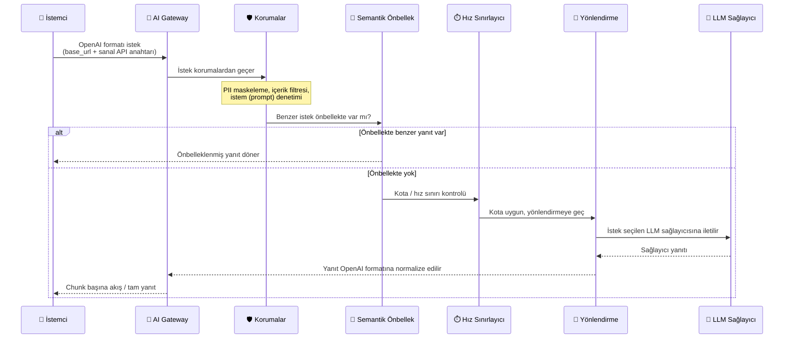

import {Card, CardGroup} from '@site/src/components/Card';

## Apinizer AI Gateway Nedir?

Apinizer AI Gateway, uygulamalarınız ile birden fazla büyük dil modeli (LLM) sağlayıcısı arasında konumlanmış, OpenAI-uyumlu bir proxy ve gateway'dir. Her sağlayıcıya ayrı bağlantı yönetmek yerine, Apinizer'a bir kez bağlanıp istemci kodunuzda değişiklik yapmadan istekleri herhangi bir desteklenen LLM'ye yönlendirebilirsiniz.

:::info
LLM, token, embedding gibi temel yapay zeka kavramlarına buradan girmiyoruz — bunlar için [Yapay Zeka Temel Kavramları](/tr/concepts/temel-kavramlar/yapay-zeka-temel-kavramlari) sayfasına bakabilirsiniz. Bu sayfa, Apinizer'ın AI Gateway modülünün ne yaptığına odaklanır.
:::

Temel faydalar:

- **Tek uç nokta** — Python OpenAI SDK ile uyumlu, yapılandırılabilir `base_url` üzerinden entegrasyon
- **Çoklu sağlayıcı desteği ve yanıt normalizasyonu** — OpenAI-uyumlu hizmetlerin yanı sıra native formatlı Anthropic, Google Vertex (Gemini) ve AWS Bedrock sağlayıcılarına da bağlanırsınız; tüm sağlayıcı yanıtları OpenAI canonical formatına normalize edilir
- **Gerçek akış (streaming)** — Sunucu Tarafından Gönderilen Olaylar (SSE) ile chunk başına iletim
- **Yerleşik kontroller** — İstek filtreleme, kişisel veri (PII) maskeleme, semantik önbellekleme, token kotaları ve maliyet takibi
- **Kurumsal görünürlük** — Kullanıcı, ekip, model ve dağıtım türüne (bulut vs. şirket içi) göre ayrıntılı kullanım raporları

## Desteklenen LLM Sağlayıcıları

- **Bulut**: OpenAI, Anthropic (Claude), Azure OpenAI, Google Vertex AI, AWS Bedrock
- **Şirket içi**: vLLM, Ollama, Hugging Face TGI
- **Özel**: OpenAI-uyumlu herhangi bir API uç noktası

Her sağlayıcı, şifreli API kimlik bilgileri ve dağıtım meta verileri içeren bir **bağlantı** aracılığıyla yapılandırılır.

:::info
Sağlayıcı bağlantısı oluşturma ve dağıtım türü ayarları için [LLM Sağlayıcıları ve Bağlantılar](/tr/ai-gateway/llm-saglayicilari) sayfasına bakın.
:::

:::note İstek ve Yanıt Formatı
İstemci tarafında **her zaman OpenAI formatı** kullanılır — Apinizer'a native Anthropic Messages veya Gemini formatıyla giriş yapmazsınız; tek arayüz OpenAI'dir. Sağlayıcı yanıtları OpenAI canonical formatına normalize edilir; böylece mevcut OpenAI istemci kodunuz, hangi sağlayıcıya yönlendirildiğinden bağımsız olarak çalışır.
:::

## Nasıl Çalışır?

### İstek Akışı

Her istek aşağıdaki aşamalardan geçer:



1. **Alım** — İstek OpenAI formatı JSON olarak doğrulanır ve ayrıştırılır
2. **Korumalar** (isteğe bağlı) — Kişisel veri maskeleme, içerik filtreleri, istem denetimi; bkz. [Gelişmiş Korumalar](/tr/ai-gateway/gelismis-korumalar)
3. **Semantik Önbellek** (isteğe bağlı) — Benzer istekler önbelleğe alınmış yanıtları yeniden kullanır
4. **Hız Sınırlaması** — Token kota uygulanması (dakika, saat, gün, ay başına veya USD bütçe); bkz. [Token Kotaları ve Hız Sınırlaması](/tr/ai-gateway/token-kotalari)
5. **Yönlendirme** — Model kimliğine göre sağlayıcı bağlantısı (ve varsa yedek hedefler) seçilir; bkz. [Yönlendirme ve Failover](/tr/ai-gateway/yonlendirme-failover)
6. **Çıkarım** — İstek LLM sağlayıcısına iletilir
7. **Yanıt** — Kullanım metrikleri ile chunk başına geri akışı yapılır

### OpenAI SDK Entegrasyonu

Apinizer AI Gateway'i Python OpenAI SDK veya uyumlu herhangi bir istemci ile kullanın:

```python
from openai import OpenAI

client = OpenAI(
    api_key="apinizer-kimlik-bilgisi-anahtarınız",
    base_url="https://apinizer-gateway-adresiniz.com/api/ai/v1"
)

response = client.chat.completions.create(
    model="gpt-4o",
    messages=[{"role": "user", "content": "Merhaba"}],
    stream=True
)

for chunk in response:
    print(chunk.choices[0].delta.content, end="")
```

İstemci tarafı kod değişikliği gerekmez — sadece `base_url`'yi Apinizer gateway'inize, `api_key`'i ise bir [sanal API anahtarına](/tr/ai-gateway/sanal-api-anahtarlari) işaret edin. Uçtan uca ilk kurulum için [AI Gateway Hızlı Başlangıç](/tr/ai-gateway/hizli-baslangic) sayfasına bakın.

## Temel Kavramlar

<CardGroup cols={2}>
  <Card title="Dağıtım Türü" icon="server">
    Her sağlayıcı bağlantısının **Bulut** (sağlayıcı barındırır) veya **Şirket içi** (kendi altyapınızda çalışır) olarak işaretlenen bir dağıtım türü vardır; maliyet atfı ve kapasite planlamasında kullanılır.
  </Card>
  <Card title="Sanal API Anahtarları" icon="key">
    İstemciler gerçek sağlayıcı anahtarını değil, kullanıcı/rol/proje/takım kapsamında tanımlanan bir **sanal anahtarı** kullanır; gerçek kimlik bilgisi hiç istemciye ulaşmaz.
  </Card>
  <Card title="Token Kotaları ve Maliyet" icon="dollar-sign">
    Model başına ve kapsam başına (dakika/saat/gün/ay veya USD bütçe) kotalarla kullanımı ve harcamayı sınırlarsınız.
  </Card>
  <Card title="Raporlar ve Analitik" icon="chart-bar">
    Kullanımı kişi, ekip, model, sağlayıcı ve dağıtım türüne göre; maliyeti isteğe bağlı çoklu para birimiyle izlersiniz.
  </Card>
</CardGroup>

## Sonraki Adımlar

<CardGroup cols={3}>
  <Card title="Hızlı Başlangıç" icon="rocket" href="/tr/ai-gateway/hizli-baslangic">
    İlk AI proxy'nizi uçtan uca kurun
  </Card>
  <Card title="LLM Sağlayıcıları ve Bağlantılar" icon="plug" href="/tr/ai-gateway/llm-saglayicilari">
    Sağlayıcı bağlantılarını yapılandırın
  </Card>
  <Card title="Model Kataloğu ve Fiyatlandırma" icon="database" href="/tr/ai-gateway/model-katalogu">
    Hazır model kataloğunu ve birim fiyatları görün
  </Card>
  <Card title="Sanal API Anahtarları" icon="key" href="/tr/ai-gateway/sanal-api-anahtarlari">
    Kapsam ve rotasyonu öğrenin
  </Card>
  <Card title="Yönlendirme ve Failover" icon="route" href="/tr/ai-gateway/yonlendirme-failover">
    Failover zinciri ve yönlendirme stratejileri
  </Card>
  <Card title="Token Kotaları ve Hız Sınırlaması" icon="gauge" href="/tr/ai-gateway/token-kotalari">
    Kota kurallarını ve izlemeyi ayarlayın
  </Card>
  <Card title="AI Maliyet Ayarları" icon="dollar-sign" href="/tr/ai-gateway/maliyet-ayarlari">
    Fiyatlandırma ve çoklu para birimi görüntüsünü yapılandırın
  </Card>
  <Card title="Raporlar ve Analitik" icon="chart-bar" href="/tr/ai-gateway/raporlar">
    Kullanım ve maliyet dağılımlarını görüntüleyin
  </Card>
  <Card title="Gelişmiş Korumalar" icon="shield" href="/tr/ai-gateway/gelismis-korumalar">
    DLP, döngü, konu-dışı ve aşırı boyut korumalarını ekleyin
  </Card>
  <Card title="Çok-Modaliteli Uç Noktalar" icon="wand-magic-sparkles" href="/tr/ai-gateway/coklu-modalite">
    Ses (STT/TTS) ve görsel üretim uç noktalarını kullanın
  </Card>
  <Card title="A2A Gateway" icon="network-wired" href="/tr/ai-gateway/a2a-gateway">
    Ajanlar arası (Agent2Agent) iletişimi yapılandırın
  </Card>
  <Card title="İzleme ve Tekrar Oynatma" icon="route" href="/tr/ai-gateway/izleme-ve-tekrar-oynatma">
    İstek zincirini zaman çizelgesinde inceleyin ve yeniden çalıştırın
  </Card>
</CardGroup>
