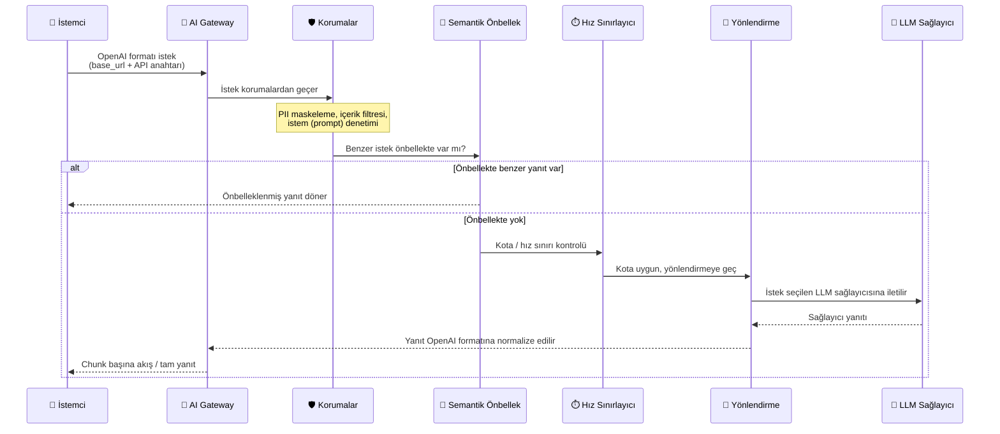

import {Card, CardGroup} from '@site/src/components/Card';

## Apinizer AI Gateway Nedir?

Apinizer AI Gateway, uygulamalarınız ile birden fazla büyük dil modeli (LLM) sağlayıcısı arasında konumlanmış, OpenAI-uyumlu bir proxy ve gateway'dir. Her sağlayıcıya ayrı bağlantı yönetmek yerine, Apinizer'a bir kez bağlanıp istemci kodunuzda değişiklik yapmadan istekleri herhangi bir desteklenen LLM'ye yönlendirebilirsiniz.

:::info
LLM, token, embedding gibi temel yapay zeka kavramlarına buradan girmiyoruz — bunlar için [Yapay Zeka Temel Kavramları](/tr/concepts/temel-kavramlar/yapay-zeka-temel-kavramlari) sayfasına bakabilirsiniz. Bu sayfa, Apinizer'ın AI Gateway modülünün ne yaptığına odaklanır.
:::

Temel faydalar:

- **Tek uç nokta** — Python OpenAI SDK ile uyumlu, yapılandırılabilir `base_url` üzerinden entegrasyon
- **Çoklu sağlayıcı desteği ve yanıt normalizasyonu** — OpenAI-uyumlu hizmetlerin yanı sıra native formatlı Anthropic, Google Vertex (Gemini) ve AWS Bedrock sağlayıcılarına da bağlanırsınız; tüm sağlayıcı yanıtları OpenAI canonical formatına normalize edilir
- **Gerçek akış (streaming)** — Sunucu Tarafından Gönderilen Olaylar (SSE) ile chunk başına iletim
- **Yerleşik kontroller** — İstek filtreleme, kişisel veri (PII) maskeleme, semantik önbellekleme, token kotaları ve maliyet takibi
- **Kurumsal görünürlük** — Kullanıcı, ekip, model ve dağıtım türüne (bulut vs. şirket içi) göre ayrıntılı kullanım raporları

:::note Streaming ayarı istemcinin isteğindeki alanı ezer
Her AI proxy'nin **AI Proxy Routing** ekranında kendine ait bir **Streaming** ayarı bulunur. Bu ayar kapalıyken gateway, istemci istek gövdesinde `stream: true` gönderse bile isteği her zaman tekil (non-streaming) bir yanıt olarak işler — sağlayıcıya iletmeden önce bu alanı `false` olarak değiştirir (ve `stream_options` alanını kaldırır). Böylece token sayıları ve maliyet, istemcinin ne gönderdiğinden bağımsız olarak Trafik raporunda doğru görünür. **Streaming** açıkken istek etkilenmez ve yukarıda anlatıldığı gibi sunucu tarafından gönderilen olaylarla (SSE) iletilir.
:::

## Desteklenen LLM Sağlayıcıları

- **Bulut**: OpenAI, Anthropic (Claude), Azure OpenAI, Google Vertex AI, AWS Bedrock
- **Şirket içi**: vLLM, Ollama, Hugging Face TGI
- **Özel**: OpenAI-uyumlu herhangi bir API uç noktası

Her sağlayıcı, şifreli API kimlik bilgileri ve dağıtım meta verileri içeren bir **bağlantı** aracılığıyla yapılandırılır.

:::info
Sağlayıcı bağlantısı oluşturma ve dağıtım türü ayarları için [LLM Sağlayıcıları ve Bağlantılar](/tr/ai-gateway/llm-saglayicilari) sayfasına bakın.
:::

:::note İstek ve Yanıt Formatı
İstemci tarafında **her zaman OpenAI formatı** kullanılır — Apinizer'a native Anthropic Messages veya Gemini formatıyla giriş yapmazsınız; tek arayüz OpenAI'dir. Sağlayıcı yanıtları OpenAI canonical formatına normalize edilir; böylece mevcut OpenAI istemci kodunuz, hangi sağlayıcıya yönlendirildiğinden bağımsız olarak çalışır.
:::

## Nasıl Çalışır?

### İstek Akışı

Her istek aşağıdaki aşamalardan geçer:


```mermaid
sequenceDiagram
    participant Client as 👤 İstemci
    participant Gateway as 🚪 AI Gateway
    participant Guard as 🛡️ Korumalar
    participant Cache as 🧠 Semantik Önbellek
    participant Limiter as ⏱️ Hız Sınırlayıcı
    participant Router as 🔀 Yönlendirme
    participant Provider as 🤖 LLM Sağlayıcı

    Client->>Gateway: OpenAI formatı istek<br/>(base_url + API anahtarı)
    Gateway->>Guard: İstek korumalardan geçer
    Note over Guard: PII maskeleme, içerik filtresi,<br/>istem (prompt) denetimi

    Guard->>Cache: Benzer istek önbellekte var mı?

    alt Önbellekte benzer yanıt var
        Cache-->>Client: Önbelleklenmiş yanıt döner
    else Önbellekte yok
        Cache->>Limiter: Kota / hız sınırı kontrolü
        Limiter->>Router: Kota uygun, yönlendirmeye geç
        Router->>Provider: İstek seçilen LLM sağlayıcısına iletilir
        Provider-->>Router: Sağlayıcı yanıtı
        Router-->>Gateway: Yanıt OpenAI formatına normalize edilir
        Gateway-->>Client: Chunk başına akış / tam yanıt
    end
```

1. **Alım** — İstek OpenAI formatı JSON olarak doğrulanır ve ayrıştırılır
2. **Korumalar** (isteğe bağlı) — Kişisel veri maskeleme, içerik filtreleri, istem denetimi; bkz. [Gelişmiş Korumalar](/tr/ai-gateway/gelismis-korumalar)
3. **Semantik Önbellek** (isteğe bağlı) — Benzer istekler önbelleğe alınmış yanıtları yeniden kullanır
4. **Hız Sınırlaması** — Token kota uygulanması (dakika, saat, gün, ay başına veya USD bütçe); bkz. [Token Kotaları ve Hız Sınırlaması](/tr/ai-gateway/token-kotalari)
5. **Yönlendirme** — Model kimliğine göre sağlayıcı bağlantısı (ve varsa yedek hedefler) seçilir; bkz. [Yönlendirme ve Failover](/tr/ai-gateway/yonlendirme-failover)
6. **Çıkarım** — İstek LLM sağlayıcısına iletilir
7. **Yanıt** — Kullanım metrikleri ile chunk başına geri akışı yapılır

### OpenAI SDK Entegrasyonu

Apinizer AI Gateway'i Python OpenAI SDK veya uyumlu herhangi bir istemci ile kullanın:

```python
from openai import OpenAI

client = OpenAI(
    api_key="apinizer-kimlik-bilgisi-anahtarınız",
    base_url="https://apinizer-gateway-adresiniz.com/api/ai/v1"
)

response = client.chat.completions.create(
    model="gpt-4o",
    messages=[{"role": "user", "content": "Merhaba"}],
    stream=True
)

for chunk in response:
    print(chunk.choices[0].delta.content, end="")
```

İstemci tarafı kod değişikliği gerekmez — sadece `base_url`'yi Apinizer gateway'inize, `api_key`'i ise kimlik bilgisi anahtarınıza işaret edin. Uçtan uca ilk kurulum için [AI Gateway Hızlı Başlangıç](/tr/ai-gateway/hizli-baslangic) sayfasına bakın.

## Model Keşfi: GET /v1/models {#model-kesfi}

Gateway, OpenAI'nin model listeleme ucunu (`GET /v1/models`) uyumlu şekilde sunar — OpenAI Python SDK'sında `client.models.list()`, LangChain ve LiteLLM gibi OpenAI-uyumlu araçlar model adını elle sabitlemek yerine bu uçtan otomatik keşfedebilir:

```python
models = client.models.list()
for model in models:
    print(model.id)
```

Yanıt gövdesi:

```json
{
  "object": "list",
  "data": [
    { "id": "gpt-4o", "object": "model", "created": 0, "owned_by": "openai" },
    { "id": "claude-3-5-sonnet", "object": "model", "created": 0, "owned_by": "anthropic" }
  ]
}
```

:::info `created` her zaman `0`'dır
Apinizer'ın model kataloğunda bir oluşturma zaman damgası tutulmaz; OpenAI SDK'ları bu alanı ayrıştırır ama anlam yüklemez. Bağlam penceresi, fiyatlandırma, yetenek (capability) gibi ek katalog detayları da **bilerek** dönülmez — keşif ucu bir bilgi ifşası yüzeyi değildir.
:::

### Liste bu proxy'nin servis yüzeyidir, sağlayıcı kataloğu DEĞİL

Dönen liste, o LLM sağlayıcısının **tüm kataloğu değildir** — yalnızca bu AI proxy'nin `aiRouting` yapılandırmasında (birincil model + birincil havuz + koşullu yönlendirme + failover zinciri, bkz. [Yönlendirme ve Failover](/tr/ai-gateway/yonlendirme-failover)) tanımlı, **gerçekten servis edilebilir** modellerin birleşimidir. Üç eleme kuralı sırayla uygulanır:

1. Aday modelin bağlı olduğu sağlayıcı bağlantısı **deploy edilmemiş veya pasif** ise düşürülür.
2. Sağlayıcı bağlantısının kendi izin-verilen-model listesi varsa ve model bu listede **değilse** düşürülür.
3. Model, kataloğunda tanımlı **sunset tarihi geçmiş** ise düşürülür — çalışma anında zaten 400 hatası alacak bir model listede reklam edilmez. Kullanımdan kaldırıldı (deprecated) işareti tek başına eleme sebebi **değildir**; deprecated bir model hâlâ çalışıyorsa listede görünür.

Hiçbir model hayatta kalmazsa bu bir hata değildir: `{"object":"list","data":[]}` ile HTTP 200 döner.

Bu uç yalnız **listeleme** yapar; OpenAI'nin tekil model getirme ucu (`GET /v1/models/{model_id}`, SDK'da `client.models.retrieve(...)`) kapsam dışıdır ve eşleşmez.

### Kimlik doğrulama ve normal politika zinciri aynen işler

Keşif ucu bir `.well-known` benzeri kimlik-doğrulama-muaf yol **değildir** — proxy'nin normal politika zinciri (auth politikaları dahil) bu istekte de aynen çalışır ve `blockAnonymousRequests` açık bir proxy'de kimliksiz bir keşif isteği de 401 alır.

:::note Upstream çağrısı yok → ölçüm de yok
Keşif isteği hiçbir sağlayıcıya çıkmaz; bu yüzden token/maliyet ölçümü tetiklenmez. Trafik raporunda bu istek görünür, ama kullanım ve maliyet sütunları boş kalır. Uç yalnız `GET` kabul eder — başka bir HTTP metoduyla çağrılırsa 405 döner.
:::

## AI Gateway ile Klasik API Proxy Farkı

Bir AI Gateway, Apinizer'da **aynı `ApiProxy` varlığıdır** — aynı oluşturma/deploy/undeploy akışından, aynı ortam yönetiminden ve aynı proxy listesinden geçer, aynı uçlarla yönetilir. Fark, isteğin backend'e nasıl yönlendirildiğindedir:

- **Klasik API proxy** → `routing` nesnesi (adres listesi, circuit breaker, mTLS, proxy sunucu, NTLM vb.)
- **AI Gateway** → `aiRouting` nesnesi (LLM sağlayıcı bağlantısı, model, birincil havuz, koşullu yönlendirme, failover zinciri) — bkz. [Yönlendirme ve Failover](/tr/ai-gateway/yonlendirme-failover)

AI Gateway çalışma zamanı klasik `routing` nesnesini **hiç okumaz**; bu nedenle `routing`'e bağlı ayarlar bir AI Gateway üzerinde anlamsızdır.

:::warning Davranış Değişikliği
Aşağıdaki 12 ayar ucu (`PATCH .../apiProxies/{apiProxyName}/settings/<X>/`), bir AI Gateway'ine uygulandığında artık **HTTP 400** döner. Önceden bu uçlar HTTP 200 dönüyordu ama **hiçbir etkisi olmuyordu** (sessiz no-op) — bu davranış artık açıkça reddediliyor:

`circuit-breaker` · `proxy-server` · `mtls` · `ntlm` · `connection` · `error-handling` · `custom-message` · `grpc` · `websocket` · `addresses` · `routing-status` · `metadata`

AI Gateway'de mTLS, proxy sunucu ve circuit breaker gibi ayarlar `aiRouting` üzerinden yapılır — doğru yol `PUT .../apiProxies/{apiProxyName}/ai-routing/`'dir. `metadata` ucunun 400 kontrolü koşulludur: yalnızca gövdede `fixSoapApiPortType` alanı gönderildiğinde tetiklenir (bu alan yalnızca klasik routing'e özgüdür) — düz bir metadata güncellemesi AI Gateway'de sorunsuz çalışmaya devam eder.
:::

Proxy tipinden bağımsız 11 ayar ucu — CORS, önbellek, idempotency, XML/JSON hata şablonu, forwarded-ip-header, spec-access-type, client-route, keys, bakım modu, iz kaydı (trace), trafik log — AI Gateway'de de **çalışmaya devam eder**, dokunulmadı.

Detaylar için bkz. [API Referansı: API Proxy Settings](/api-reference/api-proxies/settings).

## AI Proxy Listesinde Gelişmiş Arama

**AI Development → AI Proxies** listesindeki **Gelişmiş Arama** panelinde, klasik proxy alanlarına (ad, açıklama, adres, kategori, ortam, durum) ek olarak yalnız AI proxy'lerde görünen üç alan bulunur:

- **AI anahtar kelime** — Serbest metin. Proxy'nin hedefindeki model kimliğiyle ya da LLM sağlayıcısının adı veya tipiyle eşleşir. Örneğin `openai` yazmak, OpenAI tipindeki sağlayıcılara giden tüm proxy'leri getirir; `gpt-4o` yazmak o modeli kullananları getirir.
- **Model tipi** — Model kataloğundaki modality değeri (Metin, Görüntü, Ses, Gömme, Yeniden Sıralama, Çok Modlu, Görsel Üretim). Seçilen tipteki modelleri kullanan proxy'ler listelenir.
- **LLM Sağlayıcı** — Projenizde tanımlı ya da yönetici tarafından paylaşılmış sağlayıcılar arasından seçim.

Arama, proxy'nin **tüm yönlendirme hedeflerini** tarar: tekil birincil hedef, birincil havuz (primary pool), koşullu yönlendirme varyantları ve sağlayıcı failover zinciri. Bu nedenle bir proxy, aranan sağlayıcıyı yalnızca failover zincirinde kullanıyor olsa bile sonuçta görünür.

:::note Alanlar birlikte kullanıldığında
Farklı alanlar VE ile birleşir, ancak eşleşmenin aynı yönlendirme girdisinde olması gerekmez. "Sağlayıcı = OpenAI" ve "Model tipi = Görsel Üretim" birlikte seçildiğinde, OpenAI'ı birincil hedefte, görsel üretim modelini ise failover zincirinde kullanan bir proxy de listelenir. Bunun nedeni havuz ve koşullu yönlendirme girdilerinde model alanının boş bırakılıp birincil modelin miras alınabilmesidir; daha dar bir eşleştirme bu girdileri gözden kaçırırdı.
:::

Filtre veritabanı sorgusuna uygulandığı için sayfa sayısı ve toplam kayıt adedi de daralan sonuca göre doğru hesaplanır. Seçtiğiniz sağlayıcı silinmişse ya da erişiminiz olmayan bir projeye aitse arama boş sonuç döner.

## Temel Kavramlar

<CardGroup cols={2}>
  <Card title="Dağıtım Türü" icon="server">
    Her sağlayıcı bağlantısının **Bulut** (sağlayıcı barındırır) veya **Şirket içi** (kendi altyapınızda çalışır) olarak işaretlenen bir dağıtım türü vardır; maliyet atfı ve kapasite planlamasında kullanılır.
  </Card>
  <Card title="Token Kotaları ve Maliyet" icon="dollar-sign">
    Model başına ve kapsam başına (dakika/saat/gün/ay veya USD bütçe) kotalarla kullanımı ve harcamayı sınırlarsınız.
  </Card>
  <Card title="Raporlar ve Analitik" icon="chart-bar">
    Kullanımı kişi, ekip, model, sağlayıcı ve dağıtım türüne göre; maliyeti isteğe bağlı çoklu para birimiyle izlersiniz.
  </Card>
</CardGroup>

## Sonraki Adımlar

<CardGroup cols={3}>
  <Card title="Hızlı Başlangıç" icon="rocket" href="/tr/ai-gateway/hizli-baslangic">
    İlk AI Gateway'inizi uçtan uca kurun
  </Card>
  <Card title="LLM Sağlayıcıları ve Bağlantılar" icon="plug" href="/tr/ai-gateway/llm-saglayicilari">
    Sağlayıcı bağlantılarını yapılandırın
  </Card>
  <Card title="Model Kataloğu ve Fiyatlandırma" icon="database" href="/tr/ai-gateway/model-katalogu">
    Hazır model kataloğunu ve birim fiyatları görün
  </Card>
  <Card title="Yönlendirme ve Failover" icon="route" href="/tr/ai-gateway/yonlendirme-failover">
    Failover zinciri ve yönlendirme stratejileri
  </Card>
  <Card title="Token Kotaları ve Hız Sınırlaması" icon="gauge" href="/tr/ai-gateway/token-kotalari">
    Kota kurallarını ve izlemeyi ayarlayın
  </Card>
  <Card title="AI Maliyet Ayarları" icon="dollar-sign" href="/tr/ai-gateway/maliyet-ayarlari">
    Fiyatlandırma ve çoklu para birimi görüntüsünü yapılandırın
  </Card>
  <Card title="Raporlar ve Analitik" icon="chart-bar" href="/tr/ai-gateway/raporlar">
    Kullanım ve maliyet dağılımlarını görüntüleyin
  </Card>
  <Card title="Gelişmiş Korumalar" icon="shield" href="/tr/ai-gateway/gelismis-korumalar">
    DLP, döngü, konu-dışı ve aşırı boyut korumalarını ekleyin
  </Card>
  <Card title="Çok-Modaliteli Uç Noktalar" icon="wand-magic-sparkles" href="/tr/ai-gateway/coklu-modalite">
    Ses (STT/TTS) ve görsel üretim uç noktalarını kullanın
  </Card>
  <Card title="A2A Gateway" icon="network-wired" href="/tr/ai-gateway/a2a-gateway">
    Ajanlar arası (Agent2Agent) iletişimi yapılandırın
  </Card>
  <Card title="İzleme ve Tekrar Oynatma" icon="route" href="/tr/ai-gateway/izleme-ve-tekrar-oynatma">
    İstek zincirini zaman çizelgesinde inceleyin ve yeniden çalıştırın
  </Card>
</CardGroup>
