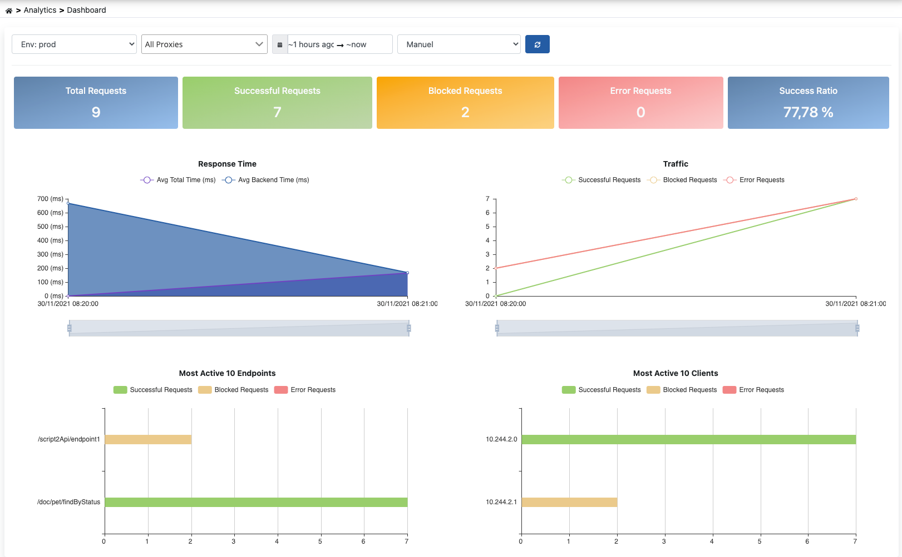

Analytics Panosu, proje içerisinde yer alan API Proxy'lerin log verilerinden oluşturulan metrikleri görselleştirir. Pano, API Proxy'lerin genel durumunu izlemeyi ve performans analizini sağlar.

  

<Warning>
Apinizer Yönetim Konsolunda API Trafiğinin sorgulanması ve analitik olarak görselleştirilmesi ancak ilgili ortama [Elasticsearch Konnektörü](/tr/entegrasyon/baglanti-yonetimi/elasticsearch-monitor) eklenmesi ile mümkün olmaktadır.
</Warning>

<Info>
Bir API Proxy birden fazla [Ortam](/tr/apinizer-anlama/temel-kavramlar/ortam-nedir)'a yüklenebildiği için metrikler, **ortam bazlı sorgulanmaktadır**. Sayfanın üst kısmından ortam seçimi yapılmalıdır.
</Info>

## Özellikler

<CardGroup cols={2}>
  <Card title="Genel Durum İzleme" icon="gauge">
    API Proxy'lerin genel durumunu, toplam istek sayısını, başarı/hata oranlarını görüntüleyebilirsiniz
  </Card>
  <Card title="Performans Metrikleri" icon="chart-line">
    Yanıt süreleri, işlem süreleri ve backend performans metriklerini analiz edebilirsiniz
  </Card>
  <Card title="Trafik Analizi" icon="chart-bar">
    API trafiğini zaman içinde izleyebilir, yoğunluk dönemlerini tespit edebilirsiniz
  </Card>
  <Card title="Hata Takibi" icon="triangle-exclamation">
    Hata oranlarını, hata tiplerini ve hatalı endpoint'leri izleyebilirsiniz
  </Card>
  <Card title="Otomatik Yenileme" icon="arrows-rotate">
    Sayfanın otomatik yenileme özelliğini aktifleştirerek metrikleri canlı olarak takip edebilirsiniz
  </Card>
  <Card title="Ortam Bazlı Filtreleme" icon="filter">
    Farklı ortamlar için ayrı ayrı metrikler görüntüleyebilirsiniz
  </Card>
</CardGroup>

<Tip>
Sayfanın üst kısmında yer alan **Otomatik Yenileme** seçeneği ile ekrandaki metrikler otomatik olarak yenilenebilir.
</Tip>

## Pano Metrikleri

Pano, aşağıdaki ana metrik kategorilerini içerir:

### Genel Metrikler

| Metrik | Açıklama |
|--------|----------|
| **Toplam İstek Sayısı** | Seçilen zaman aralığında gelen toplam API isteği sayısı |
| **Başarılı İstek Sayısı** | HTTP 2xx status code ile dönen istekler |
| **Başarısız İstek Sayısı** | HTTP 4xx ve 5xx status code ile dönen istekler |
| **Başarı Oranı** | Başarılı isteklerin toplam isteklere oranı (%) |
| **Hata Oranı** | Başarısız isteklerin toplam isteklere oranı (%) |
| **Ortalama Yanıt Süresi** | Tüm isteklerin ortalama yanıt süresi (ms) |

### Trafik Metrikleri

<CardGroup cols={2}>
  <Card title="Zamana Göre İstek Sayısı" icon="chart-line">
    - Zaman içinde istek sayısının değişimi (line chart)
    - Yoğunluk dönemlerinin tespiti
    - Trend analizi
  </Card>
  <Card title="API Proxy Bazında İstek Dağılımı" icon="chart-pie">
    - Hangi API Proxy'lerin ne kadar kullanıldığı
    - Kullanım yoğunluğu karşılaştırması
    - En çok kullanılan API'ler
  </Card>
  <Card title="Endpoint Bazında İstek Dağılımı" icon="chart-bar">
    - En çok çağrılan endpoint'ler
    - Endpoint kullanım istatistikleri
    - Çağrı sayısı sıralaması
  </Card>
  <Card title="HTTP Metod Dağılımı" icon="code">
    - GET, POST, PUT, DELETE metodlarının kullanım oranları
    - Metod bazında istek sayıları
  </Card>
</CardGroup>

### Performans Metrikleri

<CardGroup cols={2}>
  <Card title="Ortalama Yanıt Süresi" icon="gauge">
    - Tüm isteklerin ortalama yanıt süresi
    - Zaman içinde yanıt süresinin değişimi
    - Performans trend analizi
  </Card>
  <Card title="Yanıt Süresi Dağılımı" icon="chart-area">
    - Farklı zaman aralıklarında yanıt süreleri
    - P50, P95, P99 percentile değerleri
    - Min/Max yanıt süreleri
  </Card>
  <Card title="Backend Performansı" icon="server">
    - Backend API'lerin yanıt süreleri
    - Backend bağlantı süreleri
    - Upstream performans metrikleri
  </Card>
  <Card title="En Yavaş Endpoint'ler" icon="turtle">
    - En yüksek yanıt süresine sahip endpoint'ler
    - Optimizasyon gerektiren API'ler
  </Card>
</CardGroup>

### Hata Metrikleri

<CardGroup cols={2}>
  <Card title="Durum Kodu Dağılımı" icon="circle-exclamation">
    - 2xx, 4xx, 5xx status code oranları
    - Başarı/Hata dağılımı (pie chart)
  </Card>
  <Card title="Hata Tipleri" icon="bug">
    - Authentication errors
    - Routing errors
    - Policy errors
    - Backend errors
  </Card>
  <Card title="En Çok Hata Veren API'ler" icon="triangle-exclamation">
    - Yüksek hata oranına sahip API Proxy'ler
    - Sorunlu endpoint'ler
  </Card>
  <Card title="Zamana Göre Hata Oranı" icon="chart-line">
    - Hata oranının zaman içindeki değişimi
    - Hata spike'larının tespiti
  </Card>
</CardGroup>

### İstemci Metrikleri

<CardGroup cols={2}>
  <Card title="En Aktif İstemciler" icon="users">
    - En çok istek gönderen istemciler
    - İstemci bazında istek sayıları
    - Client IP/Key bazında analiz
  </Card>
  <Card title="İstemci Durum Dağılımı" icon="user-check">
    - İstemci bazında başarı/hata oranları
    - Blocked/Throttled istemciler
  </Card>
</CardGroup>

## Otomatik Yenileme

Pano, otomatik yenileme özelliği ile metriklerin canlı olarak takip edilmesini sağlar.

<Steps>
  <Step title="Otomatik Yenileme Seçeneğini Aktifleştirin">
    Sayfanın üst kısmında yer alan **Otomatik Yenileme** dropdown menüsünden yenileme aralığını seçin
  </Step>
  <Step title="Yenileme Aralığı Seçin">
    - 10 saniye
    - 30 saniye
    - 1 dakika
    - 5 dakika
  </Step>
  <Step title="Canlı İzleme">
    Seçilen aralıkta ekrandaki metrikler otomatik olarak yenilenir
  </Step>
</Steps>

<Tip>
Otomatik yenileme aktif olduğunda, sayfa değiştirilene kadar metrikler belirli aralıklarla güncellenmeye devam eder.
</Tip>

<Warning>
Çok kısa yenileme aralıkları (10-30 saniye) Elasticsearch üzerinde ek yük oluşturabilir. Üretim ortamlarında 1-5 dakika aralıkları önerilir.
</Warning>

## Ortam Bazlı Sorgulama

Pano metrikleri ortam bazlı sorgulanır. Her ortam için ayrı metrikler görüntülenir.

### Ortam Seçimi

<Steps>
  <Step title="Ortam Dropdown'ını Açın">
    Sayfanın üst kısmında yer alan ortam seçici dropdown'ı açın
  </Step>
  <Step title="İlgili Ortamı Seçin">
    Metrikleri görmek istediğiniz ortamı seçin (Development, Test, Production, vb.)
  </Step>
  <Step title="Metrikler Yüklenir">
    Seçilen ortam için metrikler otomatik olarak yüklenir ve gösterilir
  </Step>
</Steps>

<Info>
Farklı ortamlar farklı Elasticsearch konnektörlerine bağlı olabilir. Eğer birden fazla Elasticsearch Konnektörü tanımlanmışsa, Apinizer Yönetim Konsolunda **ilk** eklenen Elasticsearch Konnektöründeki veriler görüntülenir.
</Info>

### Zaman Aralığı Filtreleme

Metrikler için zaman aralığı seçimi yapabilirsiniz:

| Zaman Aralığı | Açıklama |
|---------------|----------|
| **Son 15 Dakika** | Gerçek zamanlı izleme için ideal |
| **Son 1 Saat** | Kısa vadeli performans analizi |
| **Son 24 Saat** | Günlük trafik analizi |
| **Son 7 Gün** | Haftalık trend analizi |
| **Son 30 Gün** | Aylık kullanım istatistikleri |
| **Özel Aralık** | Başlangıç ve bitiş tarihi seçimi |

<Tip>
Kısa zaman aralıkları (15 dakika - 1 saat) gerçek zamanlı izleme için, uzun zaman aralıkları (7-30 gün) ise trend analizi ve kapasite planlaması için uygundur.
</Tip>

## Metrik Yorumlama ve Kullanım

Pano metriklerini doğru yorumlayarak API'lerinizin sağlığını izleyebilirsiniz.

### Başarı Oranı Yorumlama

| Başarı Oranı | Durum | Önerilen Aksiyonlar |
|--------------|-------|---------------------|
| **> 99%** | Çok İyi | Normal izleme devam etsin |
| **95-99%** | İyi | Hataları izleyin, küçük iyileştirmeler yapın |
| **90-95%** | Dikkat | Hata nedenlerini analiz edin, düzeltmeler planlayın |
| **< 90%** | Kritik | Acil müdahale gerekli, detaylı analiz yapın |

### Yanıt Süresi Yorumlama

| Ortalama Yanıt Süresi | Durum | Önerilen Aksiyonlar |
|-----------------------|-------|---------------------|
| **< 100ms** | Mükemmel | Mevcut performansı koruyun |
| **100-500ms** | İyi | Optimizasyon fırsatlarını değerlendirin |
| **500ms-2s** | Yavaş | Performans optimizasyonu yapın |
| **> 2s** | Kritik | Acil optimizasyon gerekli, cache kullanımı |

### Trafik Analizi

**Yoğunluk Dönemleri:**
- Hangi saatlerde trafik yoğun?
- Hangi günler daha fazla istek alınıyor?
- Kapasite planlaması yapılmalı mı?

**Ani Artışlar (Spike):**
- Beklenmeyen trafik artışları var mı?
- DDoS saldırısı şüphesi var mı?
- Rate limiting yeterli mi?

**Trend Değişiklikleri:**
- Trafik artıyor mu / azalıyor mu?
- Mevsimsel değişiklikler var mı?
- Yeni özellik lansmanı etkisi nasıl?

## Problemlerin Tespiti ve Çözümü

Pano ile yaygın problemleri tespit edebilir ve çözüm üretebilirsiniz.

### Yüksek Hata Oranı

**Sorun Tespiti:**
- Hata oranı %5'in üzerinde
- Durum Kodu Dağılımında yüksek 4xx/5xx oranı
- Belirli endpoint'lerde yoğunlaşmış hatalar

**Analiz Adımları:**
1. **En Çok Hata Veren API'ler** metriğine bakın
2. [API Trafiği](/tr/analytic/api-trafigi) sayfasından hatalı istekleri filtreleyin
3. [Tracing](/tr/analytic/tracing) ile detaylı hata analizi yapın

**Olası Çözümler:**
- Backend API sorunları → Backend ekibini bilgilendirin
- Authentication hataları → Credential'ları kontrol edin
- Validation hataları → İstek formatını düzeltin

### Yavaş Performans

**Sorun Tespiti:**
- Ortalama yanıt süresi arttı
- En Yavaş Endpoint'ler listesinde sorunlu API'ler var
- Backend performansı düşük

**Analiz Adımları:**
1. **En Yavaş Endpoint'ler** metriğini inceleyin
2. [Tracing](/tr/analytic/tracing) ile politika performansını analiz edin
3. Backend yanıt sürelerini kontrol edin

**Olası Çözümler:**
- Cache politikası ekleyin
- Database sorgularını optimize edin
- Backend timeout değerlerini ayarlayın
- Yavaş politikaları optimize edin veya kaldırın

### Anormal Trafik Artışı

**Sorun Tespiti:**
- Ani ve beklenmeyen istek artışı
- Belirli IP'lerden yoğun istek
- Rate limit aşımları

**Analiz Adımları:**
1. **Zamana Göre İstek Sayısı** grafiğinde spike'ları tespit edin
2. **En Aktif İstemciler** metriğini kontrol edin
3. [API Trafiği](/tr/analytic/api-trafigi) ile şüpheli istekleri inceleyin

**Olası Çözümler:**
- Rate limiting ve throttling politikaları ekleyin
- IP blacklist/whitelist uygulayın
- DDoS koruması aktifleştirin

## Kullanım Senaryoları

### Senaryo 1: Günlük Operasyonel İzleme

**Amaç:** Günlük olarak API'lerin sağlığını kontrol etmek.

<Steps>
  <Step title="Sabah Kontrolü Yapın">
    - Genel metrikler: Başarı oranı, toplam istek sayısı
    - Gece boyunca herhangi bir sorun var mı?
  </Step>
  <Step title="Hata Oranını Kontrol Edin">
    - Hata oranı normal seviyelerde mi?
    - Yeni hata tipleri var mı?
  </Step>
  <Step title="Performans Metriklerini İnceleyin">
    - Yanıt süreleri normal mi?
    - Yavaşlamalar var mı?
  </Step>
  <Step title="Anormal Durumları Tespit Edin">
    - Beklenmeyen trafik artışları
    - Yeni hata spike'ları
  </Step>
</Steps>

**Önerilen Ayarlar:**
- Zaman Aralığı: Son 24 Saat
- Otomatik Yenileme: 5 Dakika

### Senaryo 2: Haftalık Performans Analizi

**Amaç:** Haftalık trend analizi ve kapasite planlaması.

<Steps>
  <Step title="Trafik Trendlerini İnceleyin">
    - Trafik arttı mı / azaldı mı?
    - Hangi günler daha yoğun?
  </Step>
  <Step title="Performans Değişikliklerini Analiz Edin">
    - Yanıt süreleri değişti mi?
    - Backend performansı nasıl?
  </Step>
  <Step title="En Çok Kullanılan API'leri Belirleyin">
    - Hangi API'ler en çok kullanılıyor?
    - Optimizasyon ihtiyacı var mı?
  </Step>
  <Step title="Kapasite Planlaması Yapın">
    - Mevcut kapasite yeterli mi?
    - Scaling gerekli mi?
  </Step>
</Steps>

**Önerilen Ayarlar:**
- Zaman Aralığı: Son 7 Gün
- Karşılaştırma: Önceki hafta ile

### Senaryo 3: İnsident Sonrası Analiz

**Amaç:** Bir problem yaşandıktan sonra kök neden analizi.

<Steps>
  <Step title="Problem Zamanını Belirleyin">
    - Özel zaman aralığı seçin (incident zamanı)
    - Spike veya anomali görülebiliyor mu?
  </Step>
  <Step title="Etkilenen API'leri Tespit Edin">
    - Hangi API'ler etkilendi?
    - Hata tipi neydi?
  </Step>
  <Step title="Kök Neden Analizi">
    - Backend problemi mi?
    - Politika hatası mı?
    - Trafik artışı mı?
  </Step>
  <Step title="Tracing ile Detaylı İnceleme">
    - Problematik istekleri [Tracing](/tr/analytic/tracing) ile inceleyin
    - Hangi adımda hata oluştu?
  </Step>
</Steps>

**Önerilen Ayarlar:**
- Zaman Aralığı: Özel (incident zamanı ±1 saat)
- Fokus: Hata metrikleri ve etkilenen endpoint'ler

## En İyi Uygulamalar

<CardGroup cols={2}>
  <Card title="Düzenli İzleme Yapın" icon="calendar-check">
    - Günlük operasyonel kontroller
    - Haftalık trend analizleri
    - Aylık kapasite planlaması değerlendirmesi
  </Card>
  <Card title="Baseline Oluşturun" icon="chart-line">
    - Normal performans metriklerini kaydedin
    - Baseline'dan sapmaları izleyin
    - Alarm threshold'ları belirleyin
  </Card>
  <Card title="Otomatik Yenileme Kullanın" icon="arrows-rotate">
    - Gerçek zamanlı izleme için otomatik yenileme
    - Uygun yenileme aralığı seçimi (1-5 dakika)
    - Elasticsearch yükünü göz önünde bulundurun
  </Card>
  <Card title="Ortam Bazlı İzleme" icon="layer-group">
    - Her ortam için ayrı ayrı izleme
    - Production'ı öncelikli takip edin
    - Ortamlar arası karşılaştırma yapın
  </Card>
  <Card title="Metrik Yorumlamayı Öğrenin" icon="graduation-cap">
    - Başarı oranı threshold'larını bilin
    - Yanıt süresi beklentilerini belirleyin
    - Anormal durumları hızla tespit edin
  </Card>
  <Card title="Detaylı Analiz Araçlarını Kullanın" icon="magnifying-glass-chart">
    - Pano'dan problem tespit edin
    - [API Trafiği](/tr/analytic/api-trafigi) ile detaylı inceleyin
    - [Tracing](/tr/analytic/tracing) ile kök neden bulun
  </Card>
</CardGroup>

## Sınırlamalar ve Dikkat Edilmesi Gerekenler

<Warning>
**Elasticsearch Konnektörü Gerekli:**
- Pano metriklerinin görüntülenebilmesi için ortama Elasticsearch Konnektörü eklenmiş olmalıdır
- Birden fazla Elasticsearch Konnektörü varsa, ilk eklenen konnektörün verileri görüntülenir
</Warning>

<Info>
**Veri Güncellik Süresi:**
- Metrikler Elasticsearch'teki verilerden oluşturulur
- Log kayıtlarının Elasticsearch'e ulaşması birkaç saniye sürebilir
- Gerçek zamanlı değil, near real-time (yakın gerçek zamanlı) veri gösterir
</Info>

<Tip>
**Performans İpuçları:**
- Çok uzun zaman aralıkları (>30 gün) sorgu performansını etkileyebilir
- Gereksiz sık yenileme Elasticsearch yükünü artırır
- Filtreleme yaparak daha hızlı sonuçlar alabilirsiniz
</Tip>

## İlgili Kaynaklar

<CardGroup cols={2}>
  <Card title="API Trafiği" icon="chart-network" href="/tr/analytic/api-trafigi">
    Tüm API Proxy'lerin detaylı trafik analizi
  </Card>
  <Card title="İzleme (Tracing)" icon="magnifying-glass" href="/tr/analytic/tracing">
    Detaylı trace ve debug işlemleri
  </Card>
  <Card title="Sorgu Editörü" icon="code" href="/tr/analytic/query-editor/sorgular-queries">
    Gelişmiş sorgu ve filtre tanımları
  </Card>
  <Card title="Raporlar" icon="file-chart-line" href="/tr/analytic/analytics-reports/raporlar">
    Özelleştirilmiş analitik raporlar
  </Card>
  <Card title="API Traffic Log Ayarları" icon="cog" href="/tr/analytic/api-traffic-log-ayarlari">
    Log kayıt yapılandırmaları
  </Card>
  <Card title="Analytics Engine" icon="chart-pie" href="/tr/apinizer-anlama/temel-bilesenler/analytics-engine">
    Analytics mimarisi ve bileşenler
  </Card>
</CardGroup>
