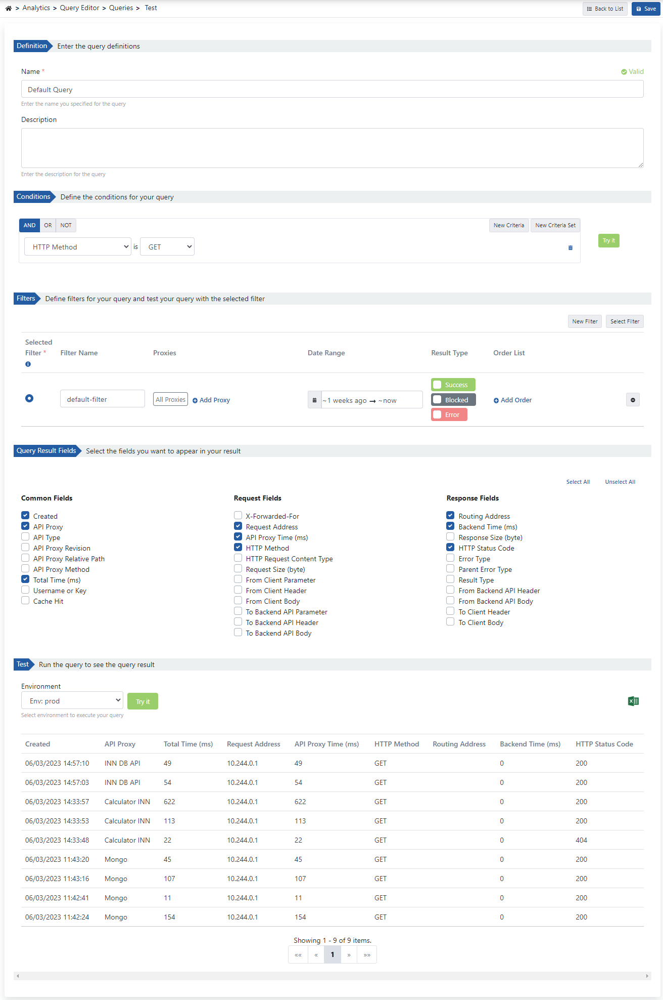

## Sorgu Editörü Özellikleri

Sorgu Editörü ile log kayıtları üzerinde analiz yapmak için sorgu ve filtre tanımları oluşturabilir ve yönetebilirsiniz.

<CardGroup cols={2}>
  <Card title="Sorgu Tanımlama" icon="code">
    Log kayıtları üzerinde analiz yapmak için sorgu tanımları oluşturabilir ve yönetebilirsiniz.
  </Card>
  <Card title="Filtre Yönetimi" icon="filter">
    Zaman aralığı, API Proxy ve sonuç tipi gibi kriterlere göre filtre tanımları yapabilirsiniz.
  </Card>
  <Card title="Test ve Doğrulama" icon="flask">
    Oluşturulan sorguları test edebilir ve sonuçlarını görüntüleyebilirsiniz.
  </Card>
  <Card title="Globalleştirme" icon="globe">
    Sorgu tanımlarını Admin sayfasına taşıyarak tüm projelerde kullanılabilir hale getirebilirsiniz.
  </Card>
</CardGroup>

## Kullanım Alanları

Sorgu Editörü'nde yapılan tanımlar aşağıdaki ekranlarda kullanılabilir:

* **Anomali Dedektörü**: Anormal durumları tespit etmek için sorgu tanımlarını kullanır
* **Rapor Üretici**: Özelleştirilmiş raporlar oluşturmak için sorgu ve filtre tanımlarını kullanır
* **Grafik Oluşturucu**: Veri görselleştirmeleri için sorgu sonuçlarını kullanır

<Info>
Tüm sorgu tanımları **"Globalleştir"** seçeneği ile Admin sayfasına taşınabilir. Globalleştirilen sorgular bu listeden kalkar, tüm projelerde kullanılabilir hale gelir ve yönetimi Admin kullanıcısına bırakılır.
</Info>

## Sorgu Oluşturma ve Test Etme

Sorgu oluşturulduktan sonra yeni bir filtre ekleyerek ya da ön tanımlı filtrelerden seçim yapılarak, sorgu test edilip sonuçları görüntülenebilir.

  

## Konfigürasyon Alanları

Sorgu konfigürasyonu için kullanılan alanlar aşağıdaki tabloda görülmektedir.

| Alan                                              | Açıklama                                                                                                                                                          |
| ------------------------------------------------- | ----------------------------------------------------------------------------------------------------------------------------------------------------------------- |
| **Ad**                                    | Oluşturulan sorgu için adı yazılır.                                                                                                                               |
| **Açıklama**                       | Oluşturulan sorgu ile ilgili yönetimi kolaylaştırmak için açıklama yazılabilir.                                                                                   |
| **Koşullar** _(Conditions)_                       | Sorgunun log verilerinde eşleşmesi gereken koşullar oluşturulur.                                                                                                  |
| **Filtreler** _(Filters)_                         | Oluşturulan sorguya eklenecek filtre bilgisidir. Sadece test amaçlı kullanımı vardır. Detaylı bilgi almak için [bakınız](/tr/analytic/query-editor/filtreler-filters). |
| **Sorgu Sonucu Alanları** _(Query Result Fields)_ | Test edilen sorgu sonucunda hangi alanların görüntüleneceği seçimi yapılır.                                                                                       |
| **Test**                                          | Oluşturulan sorguyu test etmek ve sorgunun sonucunu görmek için ortam bilgisi seçilerek ve **Sorguyu Çalıştır (Execute Query)** butonuna tıklanır.                |

## Sorgu Kriterleri

Sorgu tanımı, log kayıtlarıyla eşleşecek olan belirli alanlardan beklenen durumlar ile aşağıdaki kriter tiplerinin birleşiminden oluşur:

<CardGroup cols={3}>
  <Card title="Ve (Must)" icon="check-double">
    Tüm koşulların sağlanması gereken kriterler
  </Card>
  <Card title="Ya da (Should)" icon="check">
    Koşullardan en az birinin sağlanması gereken kriterler
  </Card>
  <Card title="Değil (Must Not)" icon="xmark">
    Koşulların sağlanmaması gereken kriterler
  </Card>
</CardGroup>

## İlgili Konular

<CardGroup cols={2}>
  <Card title="Filtreler" icon="filter" href="/tr/analytic/query-editor/filtreler-filters">
    Filtre oluşturma ve yönetimi hakkında bilgi edinin
  </Card>
  <Card title="Anomali Dedektörü" icon="triangle-exclamation" href="/tr/izleme/anomali-tespit-edici">
    Sorguları anomali tespiti için kullanma
  </Card>
  <Card title="Rapor Üretici" icon="file-chart-line" href="/tr/analytic/analytics-reports/rapor-uretici">
    Sorguları rapor oluşturmak için kullanma
  </Card>
  <Card title="Analytics" icon="chart-bar" href="/tr/analytic/analytics">
    Analytics modülü hakkında genel bilgi
  </Card>
</CardGroup>