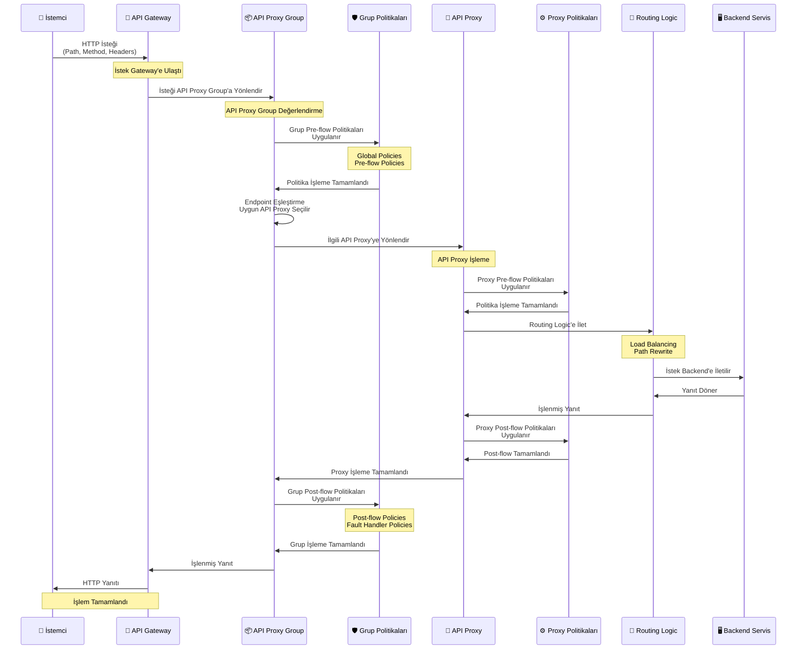

## API Proxy Group Kavramı

API Proxy Group, ilgili API Proxy'lerin mantıksal olarak gruplandırılmasını sağlar. Grup seviyesinde tanımlanan politikalar ve ayarlar, gruba dahil olan tüm API Proxy'lere otomatik olarak uygulanır.

<CardGroup cols={2}>
  <Card title="Merkezi Yönetim" icon="gear">
    Grup seviyesinde politikalar ve ayarlar tanımlanır
  </Card>
  <Card title="Ortak Politikalar" icon="shield">
    Grup politikaları tüm API Proxy'lere uygulanır
  </Card>
  <Card title="Kolay Yönetim" icon="users">
    Birden fazla API Proxy tek bir grup altında yönetilir
  </Card>
  <Card title="ACL Yönetimi" icon="lock">
    Grup bazlı erişim kontrolü sağlanır
  </Card>
</CardGroup>

## API Proxy Group ve API Proxy İlişkisi

API Proxy Group, birden fazla API Proxy'yi mantıksal olarak bir araya getirir. Grup seviyesinde tanımlanan politikalar ve ayarlar, gruba dahil olan tüm API Proxy'lere otomatik olarak uygulanır.

<CardGroup cols={2}>
  <Card title="Grup Seviyesi Politikalar" icon="shield">
    Grup seviyesinde tanımlanan politikalar tüm grup üyelerine uygulanır
    
    * Global Policies
    * Pre-flow Policies
    * Post-flow Policies
    * Fault Handler Policies
  </Card>
  
  <Card title="Grup Seviyesi Ayarlar" icon="gear">
    Grup seviyesinde tanımlanan ayarlar tüm grup üyelerine uygulanır
    
    * CORS Settings
    * Error Messages
    * Timeout Settings
    * Retry Settings
  </Card>
</CardGroup>

<Info>
API Proxy Group içindeki her API Proxy, kendi özel politikalarını ve ayarlarını da tanımlayabilir. API Proxy seviyesi ayarlar grup seviyesi ayarlardan önceliklidir.
</Info>

### İstek Akışı ve Politika Uygulama

Aşağıdaki diyagram, istek ve yanıt akışının Gateway üzerinden API Proxy Group mekanizması ile nasıl gerçekleştiğini gösterir:

İstek API Proxy Group'a geldiğinde, önce **API Proxy Group üzerindeki politikalar** işletilir. Ardından ilgili API Proxy'nin politikaları uygulanır.

<CardGroup cols={3}>
  <Card title="1. İstek Gelişi" icon="arrow-right">
    İstek API Proxy Group'a gelir
    
    Client isteği API Proxy Group endpoint'ine yönlendirilir.
  </Card>
  
  <Card title="2. Grup Politikaları" icon="shield">
    API Proxy Group politikaları işletilir
    
    Grup seviyesinde tanımlanan tüm politikalar uygulanır.
  </Card>
  
  <Card title="3. API Proxy Politikaları" icon="network-wired">
    API Proxy politikaları işletilir
    
    İlgili API Proxy'nin kendi politikaları uygulanır.
  </Card>
</CardGroup>

### Çoklu Grup Üyeliği

Bir API Proxy birden fazla API Proxy Group'a eklenebilir. Bu sayede aynı API Proxy farklı gruplar için farklı yapılandırmalarda kullanılabilir.

<Warning>
Bir API Proxy birden fazla grup üyesi olduğunda, her grup için ayrı endpoint'ler ve politikalar uygulanır. Grup bazlı yönetim ve izolasyon sağlanır.
</Warning>

### Doğrudan Erişim Kontrolü

API Proxy üzerinden doğrudan erişim yasaklanarak, sadece API Proxy Group üzerinden erişilebilmesi sağlanabilir. Bu sayede:

* **Merkezi Yönetim**: Tüm erişimler grup üzerinden kontrol edilir
* **Güvenlik**: Doğrudan API Proxy erişimi engellenir
* **Tutarlılık**: Tüm istekler grup politikalarından geçer

<Info>
Doğrudan erişim yasaklandığında, API Proxy'ye sadece grup üzerinden erişilebilir. Bu sayede grup seviyesi politikalar ve ayarlar her zaman uygulanır.
</Info>

### Endpoint Eşleştirme Mantığı

API Proxy Group'da aynı endpoint'e farklı API Proxy'lerden dolayı sahip olması durumunda, istek **eşleşen ilk endpoint'e** düşer.

<AccordionGroup>
  <Accordion title="Endpoint Eşleştirme Önceliği">
    Endpoint eşleştirme sırası:
    
    1. **İlk Eşleşen Endpoint**: İstek eşleşen ilk endpoint'e yönlendirilir
    2. **API Proxy Sırası**: Grup içindeki API Proxy'lerin sırası önemlidir
    3. **Path ve Method Eşleşmesi**: Path ve HTTP method eşleşmesi kontrol edilir
    
    <Tip>
    Aynı endpoint'e sahip birden fazla API Proxy varsa, grup içindeki sıralama önemlidir. İlk eşleşen endpoint kullanılır.
    </Tip>
  </Accordion>
  
  <Accordion title="Tanım Dosyası Oluşturma">
    API Proxy Group tanım dosyası, sahip olduğu tüm API Proxy'lerin tanım dosyaları birleştirilerek oluşturulur:
    
    * **Birleştirme İşlemi**: Tüm grup üyelerinin tanım dosyaları birleştirilir
    * **Endpoint Birleştirme**: Tüm endpoint'ler tek bir tanım dosyasında toplanır
    * **Politika Birleştirme**: Grup ve API Proxy politikaları birleştirilir
    * **Swagger Birleştirme**: Swagger tanımları birleştirilerek grup Swagger'ı oluşturulur
    
    <Tip>
    Tanım dosyası birleştirme işlemi otomatik olarak yapılır. Grup içindeki tüm API Proxy'lerin tanımları tek bir dosyada toplanır.
    </Tip>
  </Accordion>
</AccordionGroup>

## API Proxy Group Özellikleri

<AccordionGroup>
  <Accordion title="Grup Seviyesi Politikalar">
    Grup seviyesinde tanımlanan politikalar:
    
    * **Global Policies**: Tüm grup üyelerine uygulanan politikalar
    * **Pre-flow Policies**: İstek öncesi grup politikaları
    * **Post-flow Policies**: Yanıt sonrası grup politikaları
    * **Fault Handler Policies**: Hata yakalama grup politikaları
    
    <Tip>
    Grup politikaları, grup içindeki tüm API Proxy'lere otomatik olarak uygulanır. Bu sayede ortak güvenlik ve iş mantığı politikaları merkezi bir yerden yönetilir.
    </Tip>
  </Accordion>
  
  <Accordion title="Grup Seviyesi Ayarlar">
    Grup seviyesinde tanımlanan ayarlar:
    
    * **CORS Settings**: Cross-Origin Resource Sharing ayarları
    * **Error Messages**: Hata mesajı şablonları
    * **Timeout Settings**: Zaman aşımı ayarları
    * **Retry Settings**: Tekrar deneme ayarları
    * **Cache Settings**: Önbellek ayarları
    * **Client Route Settings**: Ortak client route ayarları
    
    <Tip>
    Grup ayarları, grup içindeki tüm API Proxy'ler için geçerli olan ortak yapılandırmalardır. Bu sayede tutarlı bir yapılandırma sağlanır.
    </Tip>
  </Accordion>
  
  <Accordion title="Deployment Yönetimi">
    API Proxy Group'lar ortam bazlı deploy edilir:
    
    * **Grup Bazlı Deployment**: Tüm grup üyeleri birlikte deploy edilir
    * **Ortam Yönetimi**: Farklı ortamlara farklı deployment stratejileri
    * **Versiyonlama**: Grup seviyesinde versiyon yönetimi
    * **Rollback**: Grup bazlı geri alma işlemleri
    
    <Tip>
    Grup bazlı deployment sayesinde ilgili API Proxy'ler birlikte yönetilir ve tutarlı bir deployment süreci sağlanır.
    </Tip>
  </Accordion>
</AccordionGroup>

## API Proxy Group Kullanım Senaryoları

<CardGroup cols={2}>
  <Card title="Mikroservis Grupları" icon="sitemap">
    İlgili mikroservislerin bir grup altında yönetilmesi. Örneğin:
    * Product Service Group
    * Order Service Group
    * Payment Service Group
  </Card>
  <Card title="Versiyon Grupları" icon="code-branch">
    Farklı API versiyonlarının grup halinde yönetilmesi. Örneğin:
    * API v1 Group
    * API v2 Group
  </Card>
  <Card title="Müşteri Grupları" icon="building">
    Müşteri bazlı API grupları. Örneğin:
    * Customer A APIs
    * Customer B APIs
  </Card>
  <Card title="Fonksiyonel Gruplar" icon="puzzle-piece">
    Fonksiyonel olarak ilgili API'lerin gruplandırılması. Örneğin:
    * Authentication APIs
    * Reporting APIs
    * Integration APIs
  </Card>
</CardGroup>

## API Proxy Group Yapılandırması

### Grup Oluşturma

Yeni bir API Proxy Group oluştururken:

<CardGroup cols={2}>
  <Card title="Temel Bilgiler" icon="info-circle">
    * **Grup Adı**: Grubu tanımlayan benzersiz isim
    * **Açıklama**: Grubun amacı ve kapsamı
    * **Etiketler**: Grup için etiketler (opsiyonel)
  </Card>
  
  <Card title="Grup İçeriği" icon="list">
    * **API Proxy'ler**: Gruba dahil edilecek API Proxy'ler
    * **Politikalar**: Grup seviyesi politikalar
    * **Ayarlar**: Grup seviyesi ayarlar
  </Card>
</CardGroup>

### Grup Yönetimi

<AccordionGroup>
  <Accordion title="Genel Bakış">
    Grup hakkında genel bilgiler:
    
    * **Grup Üyeleri**: Gruba dahil olan API Proxy'lerin listesi
    * **Grup İstatistikleri**: Trafik, hata oranları, performans metrikleri
    * **Grup Durumu**: Deployment durumu ve sağlık bilgileri
    * **Son Değişiklikler**: Grup üzerinde yapılan son güncellemeler
    
    <Tip>
    Genel Bakış sekmesi, grup hakkında hızlı bir özet sunar ve grup durumunu takip etmenizi sağlar.
    </Tip>
  </Accordion>
  
  <Accordion title="Ayarlar ">
    Grup seviyesi ayarlar:
    
    * **CORS Ayarları**: Cross-Origin Resource Sharing yapılandırması
    * **Hata Mesajı Şablonları**: Özelleştirilebilir hata mesajları
    * **Timeout Ayarları**: İstek ve yanıt zaman aşımı değerleri
    * **Retry Ayarları**: Tekrar deneme stratejileri
    * **Cache Ayarları**: Önbellek yapılandırması
    
    <Tip>
    Grup ayarları, grup içindeki tüm API Proxy'ler için geçerli olan ortak yapılandırmalardır.
    </Tip>
  </Accordion>
  
  <Accordion title="Geliştirme (Design)">
    Grup seviyesi politikalar:
    
    * **Pre-flow Politikaları**: İstek öncesi çalışan politikalar
    * **Post-flow Politikaları**: Yanıt sonrası çalışan politikalar
    * **Fault Handler Politikaları**: Hata durumlarında çalışan politikalar
    * **Global Politikalar**: Tüm akışlarda çalışan politikalar
    
    <Tip>
    Grup politikaları, grup içindeki tüm API Proxy'lere otomatik olarak uygulanır. Bu sayede ortak güvenlik ve iş mantığı politikaları merkezi bir yerden yönetilir.
    </Tip>
  </Accordion>
  
  <Accordion title="Deployment">
    Grup deployment yönetimi:
    
    * **Ortam Seçimi**: Deployment yapılacak ortamlar
    * **Deployment Durumu**: Mevcut deployment durumları
    * **Versiyon Yönetimi**: Grup versiyonları ve geçmiş
    * **Rollback**: Geri alma işlemleri
    
    <Tip>
    Grup bazlı deployment sayesinde ilgili API Proxy'ler birlikte yönetilir ve tutarlı bir deployment süreci sağlanır.
    </Tip>
  </Accordion>
</AccordionGroup>

## API Proxy Group ve ACL

Grup bazlı erişim kontrolü, grup seviyesinde tanımlanan ACL'lerin grup üyelerine otomatik olarak uygulanmasını sağlar.

<CardGroup cols={2}>
  <Card title="Grup Bazlı ACL" icon="lock">
    Grup seviyesinde erişim kontrolü tanımlanır
    
    Grup ACL'leri grup içindeki tüm API Proxy'ler için geçerlidir.
  </Card>
  <Card title="Miras Alma" icon="arrow-down">
    Grup ACL'leri grup üyelerine miras alınır
    
    Grup üyeleri otomatik olarak grup ACL'lerini devralır.
  </Card>
  <Card title="Toplu Yönetim" icon="list">
    Birden fazla API Proxy için toplu ACL yönetimi
    
    Grup bazlı ACL sayesinde tek seferde birden fazla API Proxy için erişim kontrolü yapılır.
  </Card>
  <Card title="Öncelik" icon="arrow-up">
    API Proxy seviyesi ACL grup ACL'den önceliklidir
    
    API Proxy seviyesinde tanımlanan ACL'ler grup ACL'lerini geçersiz kılar.
  </Card>
</CardGroup>

<AccordionGroup>
  <Accordion title="ACL Öncelik Sırası">
    Erişim kontrolü öncelik sırası:
    
    1. **API Proxy Seviyesi ACL**: En yüksek öncelik
    2. **API Proxy Group Seviyesi ACL**: İkinci öncelik
    3. **Proje Seviyesi ACL**: Üçüncü öncelik
    
    <Info>
    API Proxy seviyesinde tanımlanan ACL'ler, grup seviyesi ACL'lerden önceliklidir. Bu sayede API Proxy'ler için özel erişim kontrolü tanımlanabilir.
    </Info>
  </Accordion>
  
  <Accordion title="Toplu ACL Yönetimi">
    Grup bazlı ACL yönetimi avantajları:
    
    * Birden fazla API Proxy için tek seferde ACL tanımlama
    * Tutarlı erişim kontrolü politikaları
    * Merkezi ACL yönetimi
    * Kolay güncelleme ve bakım
    
    <Tip>
    Grup bazlı ACL yönetimi sayesinde ilgili API Proxy'ler için tutarlı erişim kontrolü politikaları uygulanabilir.
    </Tip>
  </Accordion>
</AccordionGroup>

## API Proxy Group ve API Dokümantasyonu

API Proxy Group'lar Swagger ve OpenAPI formatlarında dokümantasyon üretir ve görüntülenebilir.

<CardGroup cols={3}>
  <Card title="Grup Swagger/OpenAPI" icon="file-code">
    Grup seviyesinde Swagger ve OpenAPI dokümantasyonu
    
    Tüm grup üyelerinin birleşik Swagger ve OpenAPI dokümantasyonu.
  </Card>
  <Card title="Üye Swagger/OpenAPI" icon="file-lines">
    Grup üyelerinin Swagger ve OpenAPI dokümantasyonları
    
    Her API Proxy'nin kendi Swagger ve OpenAPI dokümantasyonu.
  </Card>
  <Card title="Birleşik Görünüm" icon="layer-group">
    Tüm grup üyelerinin birleşik görünümü
    
    Grup içindeki tüm API Proxy'lerin birleşik Swagger ve OpenAPI görünümü.
  </Card>
</CardGroup>

<AccordionGroup>
  <Accordion title="Swagger Dokümantasyonu">
    API Proxy Group'lar Swagger formatında dokümantasyon üretir:
    
    * **Grup Swagger**: Tüm grup üyelerinin birleşik Swagger dokümantasyonu
    * **Üye Swagger**: Her API Proxy'nin kendi Swagger dokümantasyonu
    * **Swagger UI**: Swagger UI arayüzünde görüntüleme
    
    <Tip>
    Swagger dokümantasyonu, grup içindeki tüm API Proxy'lerin API'lerini tek bir yerden görüntülemenizi sağlar.
    </Tip>
  </Accordion>
  
  <Accordion title="OpenAPI Dokümantasyonu">
    API Proxy Group'lar OpenAPI formatında dokümantasyon üretir:
    
    * **Grup OpenAPI**: Tüm grup üyelerinin birleşik OpenAPI dokümantasyonu
    * **Üye OpenAPI**: Her API Proxy'nin kendi OpenAPI dokümantasyonu
    * **OpenAPI Spec**: OpenAPI spesifikasyonu formatında indirme
    
    <Tip>
    OpenAPI dokümantasyonu, grup içindeki tüm API Proxy'lerin API'lerini standart OpenAPI formatında görüntülemenizi sağlar.
    </Tip>
  </Accordion>
</AccordionGroup>

<Info>
API Proxy Group'lar için Swagger ve OpenAPI dokümantasyonu, grup içindeki tüm API Proxy'lerin API'lerini tek bir yerden görüntülemenizi ve standart formatlarda kullanmanızı sağlar.
</Info>

## API Proxy Group Avantajları

<AccordionGroup>
  <Accordion title="Merkezi Yönetim">
    * Ortak politikalar tek bir yerden yönetilir
    * Değişiklikler tüm grup üyelerine otomatik uygulanır
    * Tutarlılık sağlanır
  </Accordion>
  
  <Accordion title="Kolay Yönetim">
    * Birden fazla API Proxy tek bir grup altında yönetilir
    * Toplu işlemler yapılabilir
    * Yönetim karmaşıklığı azalır
  </Accordion>
  
  <Accordion title="ACL Yönetimi">
    * Grup bazlı erişim kontrolü
    * Miras alınan izinler
    * Toplu ACL yönetimi
  </Accordion>
</AccordionGroup>

## Sonraki Adımlar

<CardGroup cols={2}>
  <Card title="API Proxy Nedir?" icon="network-wired" href="/tr/apinizer-anlama/temel-kavramlar/api-proxy-nedir">
    API Proxy kavramını öğrenin
  </Card>
  <Card title="Politika Nedir?" icon="shield" href="/tr/apinizer-anlama/temel-kavramlar/politika-nedir">
    Politika kavramını öğrenin
  </Card>
  <Card title="API Listesi Yönetimi" icon="gear" href="/tr/gelistirici/api-listesi-yonetimi">
    API Proxy yönetimi
  </Card>
  <Card title="ACL Yönetimi" icon="lock" href="/tr/admin/kimlik-yonetimi-identity-management/credential-management/api-proxy-group-acl">
    ACL yönetimi
  </Card>
</CardGroup>
