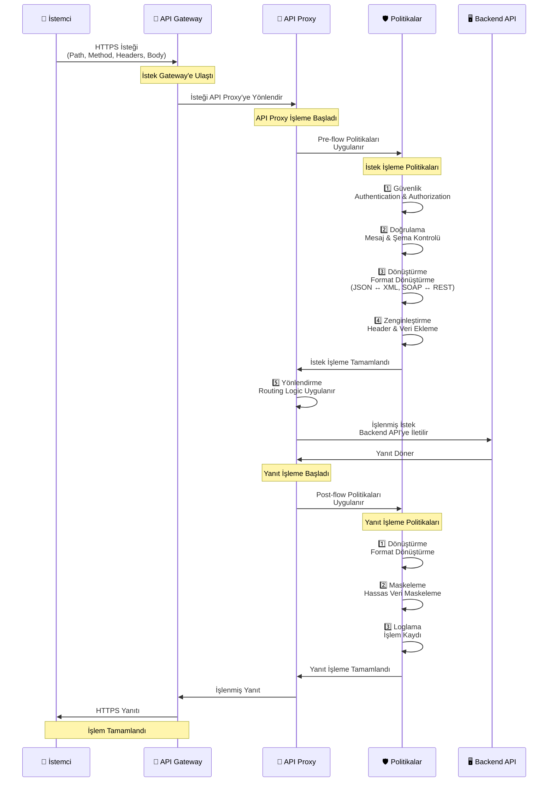

## API Proxy Kavramı

API Proxy, istemcilerden gelen istekleri alan, bu isteklere çeşitli politikalar uygulayan ve ardından backend API'lere yönlendiren bir ara katmandır. Backend API'lerin önünde durarak, API yönetimi ve güvenlik işlevlerini merkezi bir noktadan sağlar.

<CardGroup cols={2}>
  <Card title="Güvenlik Katmanı" icon="shield">
    API Proxy, backend API'lerin önünde bir güvenlik katmanı oluşturur. Kimlik doğrulama, yetkilendirme, rate limiting gibi güvenlik kontrolleri burada yapılır.
  </Card>
  <Card title="Trafik Yönetimi" icon="network-wired">
    İsteklerin yönlendirilmesi, yük dengeleme, failover gibi trafik yönetimi işlevleri API Proxy tarafından sağlanır.
  </Card>
  <Card title="Mesaj Dönüştürme" icon="arrows-rotate">
    Mesaj formatlarının dönüştürülmesi (JSON ↔ XML, SOAP ↔ REST) API Proxy üzerinde yapılır.
  </Card>
  <Card title="Doğrulama ve Zenginleştirme" icon="check-circle">
    Mesaj içeriğinin doğrulanması ve zenginleştirilmesi API Proxy'de gerçekleşir.
  </Card>
</CardGroup>

## API Proxy Nasıl Çalışır?

Aşağıdaki diyagram, istek ve yanıt akışının API Proxy üzerinden nasıl gerçekleştiğini gösterir:



### İstek Akışı

API Proxy'ye gelen bir istek şu adımlardan geçer:

**1. İstemci → API Proxy**
- İstemci HTTPS isteği gönderir
- API Proxy isteği alır (Policy Enforcement Point)

**2. API Proxy İçinde İşlemler:**

<CardGroup cols={1}>
  <Card title="1. Güvenlik" icon="shield">
    * Kimlik doğrulama (Authentication)
    * Yetkilendirme (Authorization)
  </Card>
  <Card title="2. Doğrulama" icon="check-circle">
    * Mesaj doğrulama
    * Şema kontrolü
  </Card>
  <Card title="3. Dönüştürme" icon="arrows-rotate">
    * Format dönüştürme (JSON ↔ XML, SOAP ↔ REST)
  </Card>
  <Card title="4. Zenginleştirme" icon="wand-magic-sparkles">
    * Header ekleme
    * Veri ekleme
  </Card>
  <Card title="5. Yönlendirme" icon="route">
    * Backend API'ye yönlendirme
  </Card>
</CardGroup>

**3. API Proxy → Backend API**
- İşlenmiş istek Backend API'ye gönderilir

### Yanıt Akışı

Backend API'den dönen yanıt şu adımlardan geçer:

**1. Backend API → API Proxy**
- Backend API yanıt gönderir
- API Proxy yanıtı alır

**2. API Proxy İçinde İşlemler:**

<CardGroup cols={1}>
  <Card title="1. Dönüştürme" icon="arrows-rotate">
    * Format dönüştürme (JSON ↔ XML, SOAP ↔ REST)
  </Card>
  <Card title="2. Maskeleme" icon="eye-slash">
    * Hassas veri maskeleme
  </Card>
  <Card title="3. Loglama" icon="file-lines">
    * İşlem kaydı
  </Card>
  <Card title="4. Yanıt" icon="reply">
    * İşlenmiş yanıt hazırlanır
  </Card>
</CardGroup>

**3. API Proxy → İstemci**
- İşlenmiş yanıt HTTPS üzerinden istemciye gönderilir

## API Proxy Türleri

<CardGroup cols={2}>
  <Card title="REST API Proxy" icon="code">
    REST API'ler için proxy. JSON formatında mesaj işleme.
  </Card>
  <Card title="SOAP API Proxy" icon="file-code">
    SOAP Web Servisleri için proxy. XML formatında mesaj işleme.
  </Card>
  <Card title="gRPC API Proxy" icon="network-wired">
    gRPC servisleri için proxy. Protobuf formatında mesaj işleme.
  </Card>
  <Card title="WebSocket Proxy" icon="globe">
    WebSocket bağlantıları için proxy. Gerçek zamanlı iletişim.
  </Card>
  <Card title="DB-2-API" icon="database">
    Veritabanından API oluşturma. SQL sorgularını API olarak expose etme.
  </Card>
  <Card title="Script-2-API" icon="file-code">
    JavaScript/Groovy script'lerinden API oluşturma.
  </Card>
  <Card title="Mock API" icon="wand-magic-sparkles">
    Mock API oluşturma. Test ve geliştirme için.
  </Card>
  <Card title="Connector API Proxy" icon="plug">
    Konnektörlerden API Proxy oluşturma. HTTP'yi farklı protokollere (Kafka, E-posta vb.) dönüştürme imkanı sağlar.
  </Card>
</CardGroup>

## API Proxy Oluşturma

API Proxy oluştururken şu adımlar izlenir:

1. **Proje Seçimi**: API Proxy'nin oluşturulacağı proje seçilir
2. **API Tanımı**: OpenAPI/Swagger, WSDL dosyasından import veya Reverse Proxy, No-Spec API, gRPC, WebSocket, DB-2-API, Script-2-API, Mock API gibi seçeneklerden biri seçilir
3. **Client Route Yapılandırması**: İstemcilerin erişeceği path, method ve host tanımları
4. **Upstream Target Tanımlama**: Backend API'nin adresi ve yönlendirme ayarları
5. **Politika Ekleme**: Güvenlik, doğrulama, dönüştürme politikaları
6. **Ayarlar**: CORS, Timeout, Retry politikaları ve hata mesajı şablonları
7. **Test**: Test Console ile test etme
8. **Deployment**: Ortam(lar)a yükleme

<Info>
  Detaylı API Proxy oluşturma ve yönetimi için [API Proxy Oluşturma](/tr/gelistirici/api-proxy-olusturma/api-proxy-olusturma) sayfasına bakabilirsiniz.
</Info>

## API Proxy Bileşenleri

### Client Route

Client Route, istemcilerin API Proxy'ye erişmek için kullanacağı yönlendirme bilgisidir. API Proxy'nin dış dünyaya açılan kapısıdır. Client Route yapılandırması için en az bir seçenek (Path, Method veya Header bazlı) seçilmelidir.

**Client Route Bileşenleri:**

* **Relative Paths**: API Proxy'ye yönlendirilecek relative URL path'leri. Her path "/" ile başlamalıdır ve proje bazında benzersiz olmalıdır. Örnek: `/petstoreProxy`, `/api/v1/users`
* **Methods**: Bu API Proxy için izin verilen HTTP metodları (GET, POST, PUT, DELETE, PATCH, OPTIONS, HEAD)
* **Hosts**: Backend servislerin host adresleri. Birden fazla host eklenerek load balancing ve failover sağlanabilir
* **Headers**: API Proxy seviyesinde eklenecek veya değiştirilecek HTTP header'ları. Key-value çiftleri olarak tanımlanır

### Upstream Target

Backend API'nin adresi. API Proxy'nin istekleri yönlendirdiği hedeftir. Birden fazla upstream target tanımlanarak yük dengeleme ve failover sağlanabilir.

### Policies

API Proxy'ye uygulanan politikalar:

* **Güvenlik politikaları**: OAuth2, JWT, mTLS, API Key
* **Trafik yönetimi politikaları**: Rate Limiting, Quota, Throttling
* **Dönüştürme politikaları**: JSON Transform, XML Transform, SOAP to REST
* **Doğrulama politikaları**: JSON Schema, XML Schema, Request/Response Validation
* **Zenginleştirme politikaları**: Header ekleme, veri ekleme, mesaj dönüştürme

### Settings

API Proxy'nin genel davranışını kontrol eden ayarlar:

* **CORS Ayarları**: Cross-Origin Resource Sharing yapılandırması
* **Timeout Ayarları**: İstek ve yanıt timeout değerleri
* **Retry Politikaları**: Başarısız istekler için yeniden deneme
* **Hata Mesajları**: Özelleştirilebilir hata mesajı şablonları
* **Backend API Ayarları**: Backend API yapılandırması

### Versiyonlama

API Proxy'ler versiyonlanabilir. Farklı versiyonlar farklı ortamlara deploy edilebilir ve aynı anda çalışabilir. Versiyonlama sayesinde API yaşam döngüsü yönetilebilir.

## API Proxy ve Proje/Ortam İlişkisi

API Proxy'ler projeler içinde oluşturulur ve ortamlara deploy edilir:

* **Proje**: API Proxy'ler projeler içinde oluşturulur. Her proje kendi API Proxy'lerini içerir ve proje bazında izolasyon sağlanır.
* **Ortam**: API Proxy'ler bir veya birden fazla ortama deploy edilebilir. Aynı API Proxy farklı ortamlarda farklı versiyonlarıyla çalışabilir.

```
Proje: E-Ticaret API'leri
└─ Product API Proxy
   ├─ Development Ortamı → Product API v1.0
   ├─ Test Ortamı → Product API v1.1
   ├─ Sandbox Ortamı → Product API v1.2
   └─ Production Ortamı → Product API v1.2
```

<Info>
  API Proxy'lerin proje ve ortam ile ilişkisi hakkında daha fazla bilgi için [Proje Nedir?](/tr/apinizer-anlama/temel-kavramlar/proje-nedir) ve [Ortam Nedir?](/tr/apinizer-anlama/temel-kavramlar/ortam-nedir) sayfalarına bakabilirsiniz.
</Info>

## Deployment (Dağıtım)

API Proxy'ler oluşturulduktan sonra ortamlara deploy edilmelidir. Deployment işlemi:

* **Ortam Seçimi**: API Proxy'nin deploy edileceği ortam(lar) seçilir
* **Versiyon Yönetimi**: Her deployment için versiyon bilgisi saklanır
* **Durum Takibi**: Deployment durumu (deployed, undeployed, redeploy required) takip edilir
* **Rollback**: Gerekirse önceki versiyona geri dönülebilir

<Warning>
  **Önemli**: İstemcinin API Proxy'e erişebilmesi için en az bir ortama deploy edilmiş olması gerekir.
</Warning>

<Info>
  Detaylı deployment bilgisi için [Deployment Modelleri](/tr/apinizer-anlama/deployment/deployment-modelleri) sayfasına bakabilirsiniz.
</Info>

## API Proxy Avantajları

<AccordionGroup>
  <Accordion title="Güvenlik">
    * Merkezi güvenlik yönetimi
    * Backend API'lerin korunması
    * Hassas verilerin maskeleme
    * Audit logging
  </Accordion>
  
  <Accordion title="Performans">
    * Caching
    * Load balancing
    * Connection pooling
    * Response compression
  </Accordion>
  
  <Accordion title="Yönetilebilirlik">
    * Merkezi konfigürasyon
    * Versiyonlama
    * Monitoring ve analytics
    * Lifecycle management
  </Accordion>
  
  <Accordion title="Entegrasyon">
    * Format dönüştürme (SOAP ↔ REST)
    * Protokol dönüştürme
    * Veri zenginleştirme
    * Backend abstraction
  </Accordion>
</AccordionGroup>

## Sonraki Adımlar

<CardGroup cols={2}>
  <Card title="Proje Nedir?" icon="folder" href="/tr/apinizer-anlama/temel-kavramlar/proje-nedir">
    Proje kavramını öğrenin
  </Card>
  <Card title="Ortam Nedir?" icon="server" href="/tr/apinizer-anlama/temel-kavramlar/ortam-nedir">
    Ortam kavramını öğrenin
  </Card>
  <Card title="Politika Nedir?" icon="shield" href="/tr/apinizer-anlama/temel-kavramlar/politika-nedir">
    Politika kavramını öğrenin
  </Card>
  <Card title="Routing ve Upstream" icon="route" href="/tr/apinizer-anlama/temel-kavramlar/routing-ve-upstream">
    Routing ve Upstream kavramlarını öğrenin
  </Card>
  <Card title="API Proxy Oluşturma" icon="plus" href="/tr/gelistirici/api-proxy-olusturma/rest-api-proxy-olusturma">
    API Proxy oluşturma adımları
  </Card>
  <Card title="Politika Yönetimi" icon="gear" href="/tr/gelistirici/api-proxy-konfigurasyonu/politika-yonetimi">
    Politika yönetimi
  </Card>
</CardGroup>
