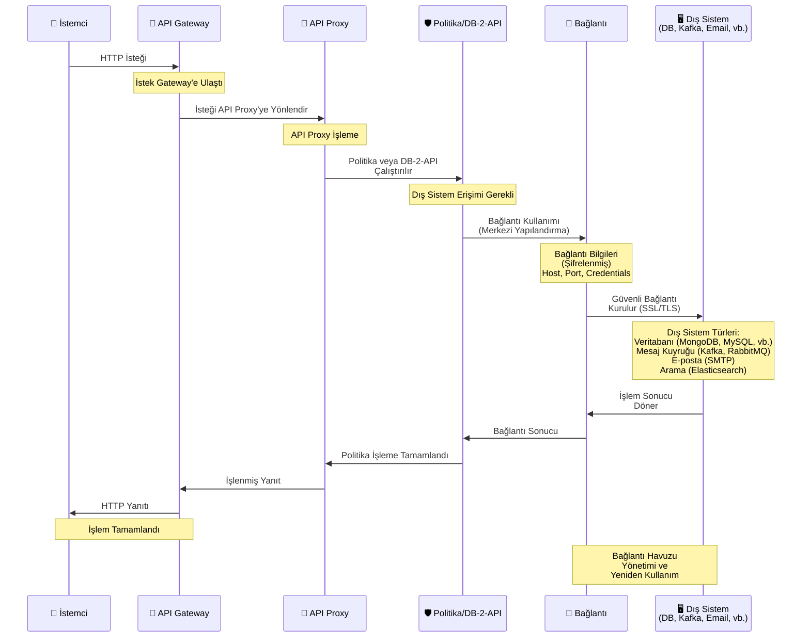

## Bağlantı Özellikleri

Bağlantı, bir dış sisteme erişim için gerekli bilgileri içeren yapılandırmadır. Bağlantılar bir kez tanımlanır ve birden fazla API Proxy veya görev tarafından kullanılabilir.

<CardGroup cols={2}>
  <Card title="Yeniden Kullanılabilir" icon="recycle">
    Bir bağlantı birden fazla API Proxy veya görev tarafından kullanılabilir
  </Card>
  <Card title="Merkezi Yönetim" icon="gear">
    Bağlantılar merkezi olarak yönetilir ve güncellenir
  </Card>
  <Card title="Güvenlik" icon="lock">
    Bağlantı bilgileri şifrelenmiş olarak saklanır
  </Card>
  <Card title="Test Edilebilir" icon="flask">
    Bağlantılar test edilebilir ve doğrulanabilir
  </Card>
</CardGroup>

## Bağlantı Kullanım Akışı

Aşağıdaki diyagram, bağlantıların API Proxy ve politikalar tarafından nasıl kullanıldığını gösterir:

## Bağlantı Türleri

Apinizer platformu çok çeşitli dış sistemlere bağlantı desteği sağlar:

### Veritabanı Bağlantıları

<CardGroup cols={3}>
  <Card title="MongoDB" icon="database">
    MongoDB NoSQL veritabanı bağlantıları
  </Card>
  <Card title="MySQL" icon="database">
    MySQL veritabanı bağlantıları
  </Card>
  <Card title="PostgreSQL" icon="database">
    PostgreSQL veritabanı bağlantıları
  </Card>
  <Card title="Oracle" icon="database">
    Oracle veritabanı bağlantıları
  </Card>
  <Card title="MSSQL" icon="database">
    Microsoft SQL Server bağlantıları
  </Card>
  <Card title="DB2" icon="database">
    IBM DB2 bağlantıları
  </Card>
  <Card title="Sybase" icon="database">
    Sybase veritabanı bağlantıları
  </Card>
  <Card title="Apache Hive" icon="database">
    Apache Hive veritabanı bağlantıları
  </Card>
  <Card title="Apache Impala" icon="database">
    Apache Impala veritabanı bağlantıları
  </Card>
  <Card title="Trino" icon="database">
    Trino (PrestoSQL) veritabanı bağlantıları
  </Card>
</CardGroup>

### Mesaj Kuyruğu Bağlantıları

<CardGroup cols={3}>
  <Card title="Kafka" icon="message">
    Apache Kafka bağlantıları
  </Card>
  <Card title="RabbitMQ" icon="message">
    RabbitMQ bağlantıları
  </Card>
  <Card title="ActiveMQ" icon="message">
    Apache ActiveMQ bağlantıları
  </Card>
</CardGroup>

### Arama ve Veri Bağlantıları

<CardGroup cols={3}>
  <Card title="Elasticsearch" icon="magnifying-glass">
    Elasticsearch cluster bağlantıları
  </Card>
  <Card title="LDAP/AD" icon="users">
    LDAP/Active Directory bağlantıları
  </Card>
  <Card title="Webhook" icon="link">
    HTTP webhook bağlantıları
  </Card>
</CardGroup>

### İletişim Bağlantıları

<CardGroup cols={3}>
  <Card title="SMTP/Email" icon="envelope">
    E-posta sunucu bağlantıları
  </Card>
  <Card title="FTP/SFTP" icon="folder">
    FTP/SFTP sunucu bağlantıları
  </Card>
  <Card title="Linux Script" icon="terminal">
    Linux script çalıştırma bağlantıları
  </Card>
</CardGroup>

### Logging ve Monitoring Bağlantıları

<CardGroup cols={3}>
  <Card title="Graylog" icon="file-lines">
    Graylog GELF bağlantıları
  </Card>
  <Card title="Syslog" icon="file-lines">
    Syslog bağlantıları
  </Card>
  <Card title="Logback" icon="file-lines">
    Logback logging bağlantıları
  </Card>
  <Card title="SNMP" icon="network-wired">
    SNMP bağlantıları
  </Card>
</CardGroup>

## Bağlantı Yapılandırması

Bir bağlantı oluştururken şu bilgiler tanımlanır:

<AccordionGroup>
  <Accordion title="Temel Bilgiler">
    * **Bağlantı Adı**: Bağlantıyı tanımlayan benzersiz isim
    * **Bağlantı Türü**: Veritabanı, mesaj kuyruğu, vb.
    * **Açıklama**: Bağlantı hakkında açıklayıcı bilgi (opsiyonel)
  </Accordion>
  
  <Accordion title="Bağlantı Bilgileri">
    * **Host/URL**: Sunucu adresi veya bağlantı URL'si
    * **Port**: Bağlantı portu (bağlantı türüne göre değişir)
    * **Database Name**: Veritabanı adı (veritabanı bağlantıları için)
  </Accordion>
  
  <Accordion title="Kimlik Doğrulama">
    * **Kullanıcı Adı**: Bağlantı için kullanıcı adı
    * **Şifre**: Bağlantı için şifre (şifrelenmiş olarak saklanır)
    * **Kimlik Bilgisi Kullanımı**: Kimlik bilgisi kullanılıp kullanılmayacağı
  </Accordion>
  
  <Accordion title="Gelişmiş Ayarlar">
    * **Connection Pool**: Bağlantı havuzu ayarları (min/max pool size, vb.)
    * **Timeout**: Bağlantı zaman aşımı ayarları
    * **SSL/TLS**: Güvenli bağlantı ayarları
    * **Deploy to Worker**: Worker'a deploy edilip edilmeyeceği
    * **Enabled**: Bağlantının aktif olup olmadığı
  </Accordion>
</AccordionGroup>

## Bağlantı Kullanımı

Bağlantılar şu durumlarda kullanılır:

<CardGroup cols={2}>
  <Card title="API Proxy" icon="server">
    **DB-2-API** ile veritabanı sorguları yapılabilir
    
    Veritabanı bağlantıları kullanılarak SQL sorguları çalıştırılabilir ve sonuçlar API yanıtı olarak döndürülebilir.
  </Card>
  
  <Card title="API Integrator" icon="diagram-project">
    **Task Flow**'larda dış sistemlere erişim sağlanır
    
    Task Flow'larda veritabanı sorguları, mesaj kuyruğu işlemleri, e-posta gönderme gibi işlemler için bağlantılar kullanılır.
  </Card>
  
  <Card title="Konnektörler" icon="puzzle-piece">
    Konnektörlerin dış sistemlere bağlanması için kullanılır
    
    Konnektörler, bağlantıları kullanarak farklı sistemlere erişim sağlar ve veri alışverişi yapar.
  </Card>
  
  <Card title="Politikalar" icon="shield">
    Politikalar içinde dış sistemlere erişim için kullanılabilir
    
    Bazı politikalar, bağlantıları kullanarak dış sistemlerle iletişim kurabilir.
  </Card>
</CardGroup>

## Bağlantı Güvenliği

<Warning>
**Önemli Güvenlik Notları:**
* Bağlantı bilgileri (kullanıcı adı, şifre) şifrelenmiş olarak saklanır
* Production ortamlarında mutlaka güvenli bağlantılar (SSL/TLS) kullanılmalıdır
* Bağlantı bilgileri asla log dosyalarına yazılmaz
* Düzenli olarak bağlantı bilgileri güncellenmelidir
</Warning>

<Info>
Bağlantılar, merkezi olarak yönetildiği için bir bağlantı bilgisi değiştiğinde, bu bağlantıyı kullanan tüm API Proxy'ler ve görevler otomatik olarak güncellenmiş bilgileri kullanır.
</Info>

## Bağlantı Yönetimi

Bağlantılar oluşturulduktan sonra:

* **Test Edilebilir**: Bağlantılar test edilerek doğrulanabilir
* **Güncellenebilir**: Bağlantı bilgileri güncellenebilir
* **Silinebilir**: Artık kullanılmayan bağlantılar silinebilir
* **Ortam Bazlı**: Bağlantılar belirli ortamlara (Environment) atanabilir

<Tip>
Bağlantıları oluştururken, bağlantı havuzu ayarlarını sistem yükünüze göre optimize edin. Küçük sistemler için düşük pool size, yüksek trafikli sistemler için yüksek pool size kullanın.
</Tip>

## Sonraki Adımlar

<CardGroup cols={2}>
  <Card title="Konnektör" icon="puzzle-piece" href="/tr/apinizer-anlama/temel-kavramlar/konnektor">
    Konnektör kavramını öğrenin
  </Card>
  <Card title="Endpoint" icon="location-dot" href="/tr/apinizer-anlama/temel-kavramlar/endpoint">
    Endpoint kavramını öğrenin
  </Card>
  <Card title="Bağlantı Yönetimi" icon="gear" href="/tr/admin/entegrasyon-otomasyon/baglanti-yonetimi/connection-types-overview">
    Bağlantı yönetimi detayları
  </Card>
  <Card title="API Integrator" icon="diagram-project" href="/tr/entegrasyon-otomasyon/api-integrator-task-flow-builder/task-flow-tasarimi">
    API Integrator kullanımı
  </Card>
  <Card title="DB-2-API" icon="database" href="/tr/gelistirici/api-proxy-turleri/db-2-api">
    DB-2-API ile veritabanı sorguları
  </Card>
</CardGroup>
