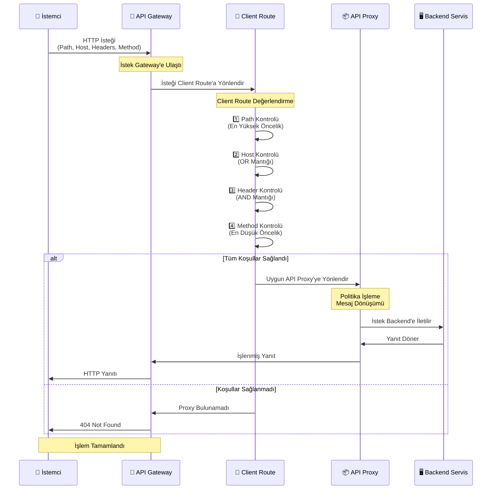

## Client Route Özellikleri

Apinizer'ın Client Route özelliği, API Gateway'de gelen isteklerin daha esnek ve dinamik bir şekilde yönlendirilmesini sağlar:

<CardGroup cols={2}>
  <Card title="Çoklu Path" icon="layer-group">
    Bir API Proxy'ye birden fazla relative path tanımlanabilir
  </Card>
  <Card title="Host Bazlı Yönlendirme" icon="globe">
    Host bilgisine göre farklı API Proxy'lere yönlendirme yapılabilir
  </Card>
  <Card title="Header Bazlı Yönlendirme" icon="file-lines">
    HTTP header değerlerine göre yönlendirme kuralları oluşturulabilir
  </Card>
  <Card title="Method Bazlı Yönlendirme" icon="code">
    Method bazlı yönlendirme yapılabilir
  </Card>
</CardGroup>

<Info>
Bu özellik geliştirilmeden önce, her API Proxy için yalnızca tek bir benzersiz (unique) relative path tanımlanabiliyordu. Yeni özellik ile aynı relative path'e sahip birden fazla API Proxy oluşturulabilir ve bunlar arasında host, header veya method bilgilerine göre dinamik yönlendirme yapılabilir.
</Info>

## Client Route Nasıl Çalışır?

Client Route özelliği, gelen istekleri belirli bir öncelik sırasına göre değerlendirerek doğru API Proxy'ye yönlendirir.

### İş Akışı

Aşağıdaki diyagram, istek ve yanıt akışının Gateway üzerinden nasıl gerçekleştiğini gösterir:



### Yönlendirme Öncelik Sırası

Gateway, gelen istekleri aşağıdaki öncelik sırasına göre değerlendirir:

<CardGroup cols={4}>
  <Card title="1. Relative Path" icon="1">
    En yüksek öncelik
  </Card>
  <Card title="2. Hosts" icon="2">
    Host header kontrolü
  </Card>
  <Card title="3. Headers" icon="3">
    Header kontrolü
  </Card>
  <Card title="4. Methods" icon="4">
    En düşük öncelik
  </Card>
</CardGroup>

### Eşleştirme Mantığı

<AccordionGroup>
  <Accordion title="Hosts (OR Mantığı)">
    Birden fazla host tanımlandığında **OR** mantığı ile çalışır. Yani tanımlanan hostlardan **herhangi birinin** eşleşmesi yeterlidir.
    
    **Örnek:**
    ```
    Hosts: hostname_x.com, hostname_y.com
    ```
    
    İstekteki Host header değeri `hostname_x.com` veya `hostname_y.com` ise koşul sağlanır.
  </Accordion>
  
  <Accordion title="Headers (AND Mantığı)">
    Birden fazla header tanımlandığında **AND** mantığı ile çalışır. Yani tanımlanan **tüm header'ların** eşleşmesi gerekir.
    
    **Örnek:**
    ```
    Headers: testmode:true, test:true
    ```
    
    İstekte hem `testmode: true` hem de `test: true` header'ları mevcut olmalıdır.
  </Accordion>
  
  <Accordion title="Path Eşleştirme">
    * Relative path eşleştirmesi en yüksek önceliğe sahiptir
    * Daha spesifik (uzun) path'ler, daha genel (kısa) path'lerden önce değerlendirilir
    * Tam eşleşme bulunamazsa, en yakın parent path kullanılır
  </Accordion>
  
  <Accordion title="Method Eşleştirme">
    * Method kontrolü en düşük önceliğe sahiptir
    * Belirtilmezse tüm HTTP methodları kabul edilir
  </Accordion>
</AccordionGroup>

## Wildcard Hostname Kullanımı

Apinizer, host tanımlamalarında esneklik sağlamak için **wildcard (joker karakter)** kullanımını destekler. Wildcard hostname'ler, belirli bir pattern'e uyan tüm Host header değerlerinin koşulu sağlamasına ve böylece ilgili Route ile eşleşmesine olanak tanır.

### Wildcard Kuralları

<Warning>
**Wildcard Kuralları:**
* Domain'in **en solundaki** veya **en sağındaki** label'ında yalnızca **bir adet** asterisk (*) içerebilir
* Asterisk, domain'in başında veya sonunda kullanılabilir
</Warning>

### Wildcard Örnekleri

<CardGroup cols={2}>
  <Card title="Sol Taraf Wildcard" icon="arrow-left">
    ```
    *.example.com
    ```
    
    **Eşleşen Host'lar:**
    * a.example.com
    * x.y.example.com
    * api.example.com
    * test.subdomain.example.com
  </Card>
  <Card title="Sağ Taraf Wildcard" icon="arrow-right">
    ```
    example.*
    ```
    
    **Eşleşen Host'lar:**
    * example.com
    * example.org
    * example.net
    * example.io
  </Card>
</CardGroup>

## Örnek Senaryo

Aşağıdaki tabloda 5 farklı API Proxy ve bunlara tanımlanmış Client Route yapılandırmaları gösterilmektedir:

<Tip>
Bu senaryo, Client Route'un öncelik sırası ve eşleştirme mantığını anlamak için kullanılacaktır.
</Tip>

| Proxy ID | Relative Path | Methods | Hosts (OR) | Headers (AND) |
|----------|---------------|---------|------------|---------------|
| 1 | `/jokes` | - | - | `testmode:true`, `test:true` |
| 2 | `/jokes` | - | `hostname_x.com`, `hostname_y.com` | - |
| 3 | `/jokes1/endpoint_x` | - | - | - |
| 4 | `/jokes1` | - | - | - |
| 5 | `/jokes` | - | - | - |

## Yönlendirme Örnekleri

Bu yapılandırmaya göre gelen istekler şu şekilde yönlendirilir:

<AccordionGroup>
  <Accordion title="Örnek 1: Temel Yönlendirme">
    **İstek:**
    ```
    GET https://<ACCESS_URL>/jokes
    ```
    
    **Sonuç:** Proxy 5'e yönlendirilir (herhangi bir koşul sağlanmadığı için varsayılan proxy)
    
    <Tip>
    Path eşleşti ancak host ve header koşulları sağlanmadığı için en basit yapılandırmaya sahip Proxy 5 seçilir.
    </Tip>
  </Accordion>
  
  <Accordion title="Örnek 2: Host Bazlı Yönlendirme">
    **İstek:**
    ```
    GET https://<ACCESS_URL>/jokes
    Host: hostname_x.com
    ```
    
    **Sonuç:** Proxy 2'ye yönlendirilir (host koşulu sağlandı)
    
    <Tip>
    Host önceliği header'dan yüksek olduğu için Proxy 2 seçilir.
    </Tip>
  </Accordion>
  
  <Accordion title="Örnek 3: Eksik Header ile Yönlendirme">
    **İstek:**
    ```
    GET https://<ACCESS_URL>/jokes
    testmode: true
    ```
    
    **Sonuç:** Proxy 5'e yönlendirilir (Proxy 1 için her iki header gerekli, sadece biri sağlandı)
    
    <Tip>
    Header'lar AND mantığı ile çalıştığı için tüm header'ların eşleşmesi gerekir. Eksik header durumunda bir sonraki uygun proxy seçilir.
    </Tip>
  </Accordion>
  
  <Accordion title="Örnek 4: Tam Header Eşleşmesi">
    **İstek:**
    ```
    GET https://<ACCESS_URL>/jokes
    testmode: true
    test: true
    ```
    
    **Sonuç:** Proxy 1'e yönlendirilir (tüm header koşulları sağlandı)
    
    <Tip>
    Tüm header koşulları sağlandığı için Proxy 1 seçilir.
    </Tip>
  </Accordion>
  
  <Accordion title="Örnek 5: Path Önceliği - Temel Path">
    **İstek:**
    ```
    GET https://<ACCESS_URL>/jokes1
    ```
    
    **Sonuç:** Proxy 4'e yönlendirilir (path tam eşleşme)
    
    <Tip>
    Path önceliği en yüksek olduğu için tam eşleşen path'e sahip Proxy 4 seçilir.
    </Tip>
  </Accordion>
  
  <Accordion title="Örnek 6: Path Önceliği - Uzun Path">
    **İstek:**
    ```
    GET https://<ACCESS_URL>/jokes1/endpoint_x
    ```
    
    **Sonuç:** Proxy 3'e yönlendirilir (daha spesifik path öncelikli)
    
    <Tip>
    Daha spesifik (uzun) path'ler, daha genel (kısa) path'lerden önce değerlendirilir.
    </Tip>
  </Accordion>
  
  <Accordion title="Örnek 7: Path ile Alt Yol">
    **İstek:**
    ```
    GET https://<ACCESS_URL>/jokes1/endpoint_x/endpoint_y
    ```
    
    **Sonuç:** Proxy 3'e yönlendirilir (en yakın parent path eşleşmesi)
    
    <Tip>
    Tam eşleşme bulunamazsa, en yakın parent path kullanılır.
    </Tip>
  </Accordion>
  
  <Accordion title="Örnek 8: Path Eşleşmesi - Farklı Alt Yol">
    **İstek:**
    ```
    GET https://<ACCESS_URL>/jokes1/endpoint_y
    ```
    
    **Sonuç:** Proxy 4'e yönlendirilir (parent path olarak /jokes1 eşleşti)
    
    <Tip>
    `/jokes1/endpoint_y` path'i için tam eşleşme yok, bu yüzden parent path olan `/jokes1` eşleşmesi kullanılır.
    </Tip>
  </Accordion>
  
  <Accordion title="Örnek 9: Host ve Header Kombinasyonu">
    **İstek:**
    ```
    GET https://<ACCESS_URL>/jokes
    Host: hostname_x.com
    testmode: true
    test: true
    ```
    
    **Sonuç:** Proxy 2'ye yönlendirilir (host, header'dan daha yüksek önceliğe sahip)
    
    <Tip>
    Host önceliği header'dan yüksek olduğu için, host koşulu sağlandığında header koşulları göz ardı edilir ve Proxy 2 seçilir.
    </Tip>
  </Accordion>
  
  <Accordion title="Örnek 10: Farklı Path ile Host ve Header">
    **İstek:**
    ```
    GET https://<ACCESS_URL>/jokes1
    Host: hostname_x.com
    testmode: true
    test: true
    ```
    
    **Sonuç:** Proxy 4'e yönlendirilir (path önceliği en yüksek, host ve header'lar göz ardı edilir)
    
    <Tip>
    Path önceliği en yüksek olduğu için, path eşleşmesi sağlandığında host ve header koşulları göz ardı edilir.
    </Tip>
  </Accordion>
</AccordionGroup>

## Önemli Notlar

<AccordionGroup>
  <Accordion title="Path Eşleştirme">
    * Relative path eşleştirmesi en yüksek önceliğe sahiptir
    * Daha spesifik (uzun) path'ler, daha genel (kısa) path'lerden önce değerlendirilir
    * Tam eşleşme bulunamazsa, en yakın parent path kullanılır
  </Accordion>
  
  <Accordion title="Host Eşleştirme">
    * Birden fazla host tanımlanabilir
    * Hostlar **OR** mantığı ile çalışır
    * İstekteki host değeri, tanımlanan hostlardan herhangi biriyle eşleşirse koşul sağlanır
  </Accordion>
  
  <Accordion title="Header Eşleştirme">
    * Birden fazla header tanımlanabilir
    * Header'lar **AND** mantığı ile çalışır
    * İstekte tanımlanan tüm header'lar mevcut olmalıdır
    * Eksik veya hatalı header durumunda bir sonraki uygun proxy'ye geçilir
  </Accordion>
  
  <Accordion title="Method Eşleştirme">
    * Method kontrolü en düşük önceliğe sahiptir
    * Belirtilmezse tüm HTTP methodları kabul edilir
  </Accordion>
</AccordionGroup>

## Routing Kombinasyon Tablosu

Bu tablo API Proxy açısından, API Proxy'nin nasıl seçildiğini göstermektedir:

<Tip>
Bu tablo, Client Route'un farklı koşulları nasıl değerlendirdiğini anlamak için referans olarak kullanılabilir.
</Tip>

| Durum | Açıklama |
|-------|----------|
| **Yok** | API proxy tanımında bulunmamaktadır. Client'ın gönderdiği kontrol edilmez. |
| **Eşleşti** | API proxy tanımında bulunmaktadır. Client'ın gönderdiği kontrol edilir, beklenen değeri gönderdi. |
| **Eşleşmedi** | API proxy tanımında bulunmaktadır. Client'ın gönderdiği kontrol edilir, beklenen değeri göndermedi. |

<Info>
Client Route özelliği, API Gateway'inizde karmaşık yönlendirme senaryolarını kolayca yönetmenizi sağlar. Öncelik sırası ve eşleştirme mantığını doğru anlayarak, esnek ve güçlü API yönlendirme yapılandırmaları oluşturabilirsiniz.
</Info>

## Sonraki Adımlar

<CardGroup cols={2}>
  <Card title="Client Route Ayarları" icon="gear" href="/tr/gelistirici/api-proxy-olusturma/client-route-ayarlari">
    Client Route ayarlarını yapılandırma
  </Card>
  <Card title="Routing ve Upstream" icon="route" href="/tr/apinizer-anlama/temel-kavramlar/routing-ve-upstream">
    Routing ve Upstream kavramlarını öğrenin
  </Card>
  <Card title="HTTP Yönlendirme" icon="globe" href="/tr/gelistirici/yonlendirme/http-yonlendirme">
    HTTP Routing yapılandırması
  </Card>
  <Card title="Mesaj İşleme ve Politika Uygulama" icon="diagram-project" href="/tr/apinizer-anlama/temel-kavramlar/mesaj-isleme-ve-politika-uygulama">
    Mesaj akışı ve politika uygulama sürecini öğrenin
  </Card>
  <Card title="API Proxy Nedir?" icon="server" href="/tr/apinizer-anlama/temel-kavramlar/api-proxy-nedir">
    API Proxy kavramını öğrenin
  </Card>
</CardGroup>
