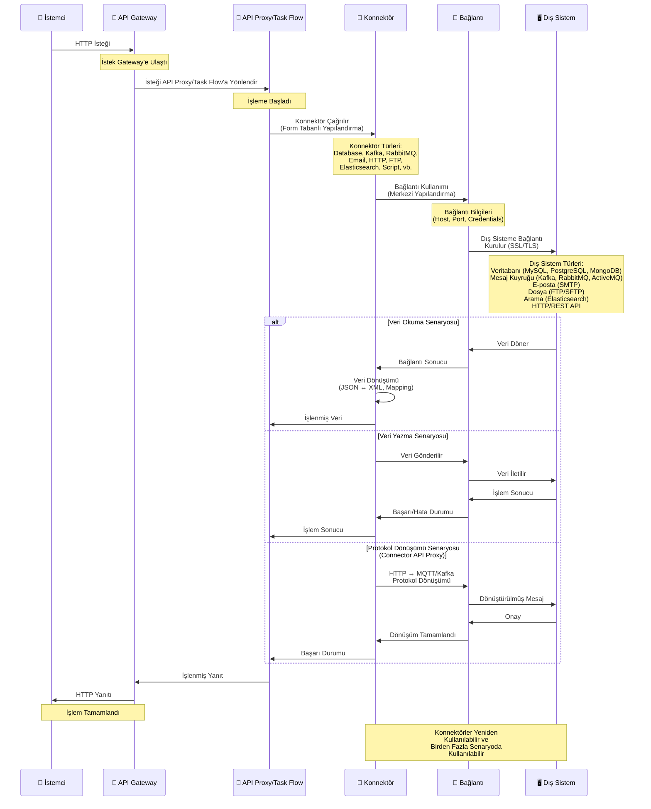

## Konnektör Özellikleri

<CardGroup cols={2}>
  <Card title="Çeşitlilik" icon="puzzle-piece">
    15+ farklı konnektör türü mevcuttur
  </Card>
  <Card title="Kolay Kullanım" icon="wand-magic-sparkles">
    Form tabanlı yapılandırma, kod yazmaya gerek yok
  </Card>
  <Card title="Yeniden Kullanılabilir" icon="recycle">
    Konnektörler birden fazla Task Flow'da ve farklı alanlarda kullanılabilir
  </Card>
  <Card title="Esnek Yapılandırma" icon="sliders">
    Konnektörler farklı senaryolara uygun şekilde yapılandırılabilir
  </Card>
</CardGroup>

## Konnektör Kullanım Akışı

Aşağıdaki diyagram, konnektörlerin API Proxy ve Task Flow'larda nasıl kullanıldığını gösterir:

## Konnektör Türleri

### Veritabanı Konnektörleri

<CardGroup cols={2}>
  <Card title="Database Connector" icon="database">
    SQL veritabanlarına bağlantı (MySQL, PostgreSQL, Oracle, MSSQL, DB2)
    
    Veritabanı bağlantıları kullanılarak SQL sorguları çalıştırılabilir ve veritabanı işlemleri gerçekleştirilebilir.
  </Card>
</CardGroup>

### Mesaj Kuyruğu Konnektörleri

<CardGroup cols={3}>
  <Card title="Kafka Connector" icon="layer-group">
    Apache Kafka entegrasyonu
    
    Mesaj kuyruğuna mesaj gönderme işlemleri. Event-driven mimariler için mesaj yayınlama.
  </Card>
  <Card title="RabbitMQ Connector" icon="inbox">
    RabbitMQ entegrasyonu
    
    Mesaj kuyruğuna mesaj gönderme ve asenkron mesajlaşma işlemleri.
  </Card>
  <Card title="ActiveMQ Connector" icon="server">
    Apache ActiveMQ entegrasyonu
    
    Mesaj broker'a mesaj gönderme ve mesaj kuyruğu yönetimi.
  </Card>
</CardGroup>

### İletişim Konnektörleri

<CardGroup cols={3}>
  <Card title="Email Connector" icon="envelope">
    E-posta gönderme
    
    SMTP sunucu yapılandırması ile e-posta gönderme ve bildirim işlemleri.
  </Card>
  <Card title="HTTP/REST Connector" icon="globe">
    HTTP/REST API çağrıları
    
    REST API'ler ile iletişim kurma ve HTTP istekleri gönderme/alma.
  </Card>
  <Card title="Webhook Connector" icon="plug">
    Webhook gönderme
    
    Webhook dinleme, gönderme ve event-driven işlemler gerçekleştirme.
  </Card>
</CardGroup>

### Dosya ve Veri Konnektörleri

<CardGroup cols={3}>
  <Card title="FTP Connector" icon="folder">
    FTP/SFTP dosya transferi
    
    FTP bağlantıları kullanarak dosya okuma, listeleme ve transfer işlemleri.
  </Card>
  <Card title="Elasticsearch Connector" icon="magnifying-glass">
    Elasticsearch sorguları
    
    Elasticsearch bağlantıları ile veri indeksleme, arama sorguları ve analitik işlemler.
  </Card>
  <Card title="Script Connector" icon="code">
    JavaScript/Groovy script çalıştırma
    
    Groovy veya JavaScript kullanarak programatik işlemler ve özel iş mantığı ekleme.
  </Card>
</CardGroup>

### Monitoring ve Bildirim Konnektörleri

<CardGroup cols={2}>
  <Card title="Notification Connector" icon="bell">
    Bildirim gönderme
    
    İş tanımları çalıştığında kullanıcılara bildirim gönderme ve bildirim yönetimi.
  </Card>
  <Card title="SNMP Connector" icon="network-wired">
    SNMP trap gönderme
    
    SNMP protokolü ile trap gönderme ve network monitoring işlemleri.
  </Card>
  <Card title="Syslog Connector" icon="file-lines">
    Syslog mesajları gönderme
    
    Syslog protokolü ile log mesajları gönderme ve merkezi loglama.
  </Card>
  <Card title="Logback Connector" icon="file-code">
    Log kayıtları gönderme
    
    Logback framework'ü ile log kayıtları gönderme ve log yönetimi.
  </Card>
</CardGroup>

### Sistem Konnektörleri

<CardGroup cols={2}>
  <Card title="Linux Script Connector" icon="terminal">
    Linux komutları çalıştırma
    
    SSH üzerinden uzak Linux sunucularında komut ve betik çalıştırma.
  </Card>
</CardGroup>

<Tip>
**Elasticsearch Konnektörü** özellikle önemlidir. Apinizer Yönetim Konsolunda API Trafiğinin sorgulanması ve analitik olarak görselleştirilmesi ancak ilgili ortama Elasticsearch Konnektörü eklenmesi ile mümkün olmaktadır.
</Tip>

## Konnektör Kullanım Alanları

Konnektörler Apinizer platformunda dört ana alanda kullanılır:

<CardGroup cols={2}>
  <Card title="API Integrator Task Flow'larda" icon="diagram-project">
    
    Task Flow'larda farklı sistemlere bağlantı kurulur ve veri alışverişi sağlanır. Konnektörler görsel olarak bağlanarak entegrasyon senaryoları oluşturulur.
  </Card>
  
  <Card title="API Proxy Oluşturma" icon="server">
    
    Konnektörler ile API Proxy oluşturulabilir. Bu sayede HTTP to MQTT gibi protokol dönüşümü sağlanır. Örneğin HTTP protokolü ile mesaj kuyruğuna veri bırakılabilir.
  </Card>
  
  <Card title="Alarm, Monitoring ve Anomaly Detection" icon="bell">
    
    Alarmlar, monitoring ve anomaly detection durumlarının oluşması durumunda action çalıştırırken kullanılır. Hata durumlarında bildirim gönderme, log kaydetme gibi işlemler gerçekleştirilir.
  </Card>
  
  <Card title="API Trafik Logları" icon="file-lines">
    
    API trafiğinin logunun başka sistemlere gönderilebilmesi için kullanılır. Elasticsearch, Graylog, Syslog gibi loglama sistemlerine log gönderimi yapılır.
  </Card>
</CardGroup>

## Kullanım Senaryoları

Konnektörler çeşitli entegrasyon senaryolarında kullanılabilir:

<CardGroup cols={2}>
  <Card title="Veri Senkronizasyonu" icon="arrows-rotate">
    Kaynak sistemden veri çekme (Database Connector), veri dönüştürme ve hedef sisteme gönderme (HTTP Connector)
  </Card>
  <Card title="Mesaj Kuyruğuna Mesaj Gönderme" icon="bolt">
    İşlem sonuçlarını mesaj kuyruğuna gönderme (Kafka/RabbitMQ/ActiveMQ Connector) ve event yayınlama
  </Card>
  <Card title="File Processing" icon="file">
    FTP'den dosya alma (FTP Connector), parse etme (Script Connector) ve veritabanına kaydetme (Database Connector)
  </Card>
  <Card title="Bildirim ve Loglama" icon="bell">
    Alarm ve monitoring durumlarında e-posta gönderme (Email Connector) ve log kaydetme (Logback/Syslog Connector)
  </Card>
  <Card title="API Trafik Loglama" icon="file-lines">
    API trafik loglarını Elasticsearch, Graylog gibi sistemlere gönderme (Elasticsearch/Graylog Connector)
  </Card>
  <Card title="Protokol Dönüşümü" icon="arrows-rotate">
    HTTP to MQTT gibi protokol dönüşümü sağlama. HTTP protokolü ile mesaj kuyruğuna veri bırakma (Connector API Proxy)
  </Card>
</CardGroup>

## Konnektör Yapılandırması

Konnektörler yapılandırılırken şu bilgiler tanımlanır:

<AccordionGroup>
  <Accordion title="Bağlantı Seçimi">
    Konnektörün kullanacağı bağlantı (Connection) seçilir. Bağlantı daha önce tanımlanmış olmalıdır.
  </Accordion>
  
  <Accordion title="Parametreler">
    Konnektör türüne göre farklı parametreler tanımlanır:
    * Veritabanı konnektörleri için SQL sorguları
    * HTTP konnektörleri için URL, method, header'lar
    * E-posta konnektörleri için alıcı, konu, içerik
  </Accordion>
  
  <Accordion title="Veri Dönüşümü">
    Bazı konnektörler veri dönüşümü yapabilir:
    * JSON ↔ XML dönüşümü
    * Veri mapping ve transformation
    * Format dönüşümleri
  </Accordion>
  
  <Accordion title="Hata Yönetimi">
    Konnektörler hata durumlarını yönetebilir:
    * Retry mekanizması
    * Error handling
    * Fallback stratejileri
  </Accordion>
</AccordionGroup>

## Sonraki Adımlar

<CardGroup cols={2}>
  <Card title="Bağlantılar" icon="plug" href="/tr/apinizer-anlama/temel-kavramlar/baglantilar">
    Bağlantı kavramını öğrenin
  </Card>
  <Card title="API Integrator" icon="diagram-project" href="/tr/entegrasyon/api-integrator-task-flow-builder/task-flow-tasarimi">
    API Integrator kullanımı
  </Card>
  <Card title="Konnektörler" icon="list" href="/tr/entegrasyon/konnektorler/genel-bakis">
    Tüm konnektör türlerini inceleyin
  </Card>
  <Card title="Connector API Proxy" icon="server" href="/tr/gelistirici/api-proxy-olusturma/connector-api-proxy-olusturma">
    Connector API Proxy oluşturma
  </Card>
  <Card title="Alarm ve Monitoring" icon="bell" href="/tr/izleme/alarm">
    Alarm ve monitoring kullanımı
  </Card>
</CardGroup>
