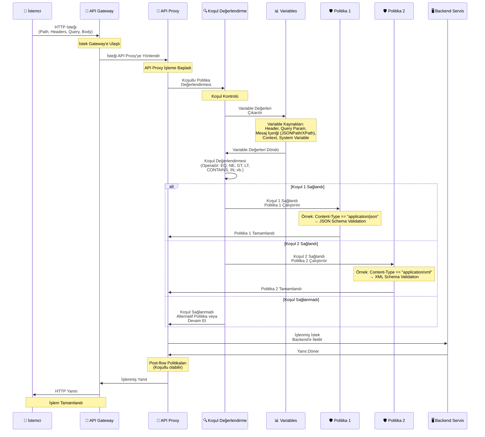

<Info>
Koşullar, [Politika Nedir?](/tr/apinizer-anlama/temel-kavramlar/politika-nedir) sayfasında açıklandığı gibi, politika yapılandırmasının bir parçasıdır. Politika oluştururken veya düzenlerken koşullar bölümünden koşul tanımları yapılır.
</Info>

## Koşullu Politika Çalıştırma Kavramı

Koşullu politika çalıştırma, politikaların belirli koşullara göre çalıştırılmasını sağlar. Apinizer'da koşullar kod yazmadan, **[Variable](/tr/apinizer-anlama/temel-kavramlar/variable) kullanarak ve form tabanlı yapılandırma** ile oluşturulur.

Aşağıdaki diyagram, koşullu politika çalıştırmanın Gateway üzerinden nasıl gerçekleştiğini gösterir:

### Form Tabanlı Koşul Oluşturma

Koşullu politika oluştururken aşağıdaki adımlar izlenir:

<Steps>
  <Step title="İlk Değişken Seçimi">
    Karşılaştırmanın sol tarafındaki değişkeni seçersiniz. Bu değişken:
    - Header değişkeni olabilir
    - Query parametre değişkeni olabilir
    - Mesaj içeriği değişkeni olabilir (JSONPath/XPath ile)
    - Context değişkeni olabilir
    - Sistem değişkeni olabilir
    - Özel bir değişken olabilir
  </Step>
  <Step title="Veri Tipi Belirleme">
    Değişkenin veri tipini seçersiniz:
    - **STRING**: Metin karşılaştırmaları için
    - **NUMERIC**: Sayısal karşılaştırmalar için
    - **DATE**: Tarih karşılaştırmaları için (tarih formatı belirtilmelidir)
  </Step>
  <Step title="Karşılaştırma Operatörü Seçimi">
    Dropdown menüden karşılaştırma operatörünü seçersiniz:
    - Eşitlik, büyüktür, küçüktür gibi karşılaştırma operatörleri
    - İçerir, başlar, biter gibi metin operatörleri
    - Var, yok, boş gibi varlık kontrolü operatörleri
  </Step>
  <Step title="İkinci Değer Kaynağı Belirleme">
    İkinci değerin kaynağını belirlersiniz:
    - **Sabit Değer**: Doğrudan girilen sabit bir değer
    - **Değişken**: Başka bir değişken seçimi (değişkenler arası karşılaştırma)
  </Step>
  <Step title="Nested Koşullar (Opsiyonel)">
    Karmaşık mantık için alt koşullar ekleyerek AND, OR, NOT operatörleriyle koşulları birleştirirsiniz.
  </Step>
</Steps>

Bu yaklaşım sayesinde kod yazmadan, form alanlarını doldurarak ve [Variable](/tr/apinizer-anlama/temel-kavramlar/variable)'ları seçerek koşullu politikalar oluşturabilirsiniz.

## Koşul Türleri ve Değişken Kullanımı

Koşullar, [Variable](/tr/apinizer-anlama/temel-kavramlar/variable) kullanılarak oluşturulur. Değişkenler mesaj içeriğinden, header'lardan, query parametrelerinden veya context'ten değer alabilir.

### Mesaj İçeriği Koşulları

Mesaj içeriğine göre koşullar oluşturmak için JSONPath veya XPath kullanarak değişken tanımlanır:

<CardGroup cols={2}>
  <Card title="JSONPath Değişkeni" icon="code">
    JSON mesajlarında değer çıkarmak için:
    - **Değişken Tipi**: Mesaj İçeriği (JSONPath)
    - **JSONPath İfadesi**: `$.user.role` veya `$.products[*].price`
    - **Veri Tipi**: STRING veya NUMERIC
  </Card>
  <Card title="XPath Değişkeni" icon="file-code">
    XML mesajlarında değer çıkarmak için:
    - **Değişken Tipi**: Mesaj İçeriği (XPath)
    - **XPath İfadesi**: `/user/role` veya `//product/@price`
    - **Veri Tipi**: STRING veya NUMERIC
  </Card>
  <Card title="Header Değişkeni" icon="file-lines">
    HTTP header değerlerine göre:
    - **Değişken Tipi**: Header
    - **Header Adı**: `Content-Type` veya `X-API-Version`
    - **Veri Tipi**: STRING
  </Card>
  <Card title="Query Parametre Değişkeni" icon="link">
    Query parametrelerine göre:
    - **Değişken Tipi**: Query Parameter
    - **Parametre Adı**: `version` veya `format`
    - **Veri Tipi**: STRING
  </Card>
</CardGroup>

### İstemci Koşulları

İstemci bilgilerine göre koşullar oluşturmak için ilgili değişkenler kullanılır:

<AccordionGroup>
  <Accordion title="IP Adresi">
    IP adresine göre kontrol için:
    - **Değişken Tipi**: Client IP
    - **Veri Tipi**: STRING
    - **Operatör**: IN veya NOT_IN
    - **Değer**: `192.168.1.0/24#10.0.0.0/8` (liste değerleri # ile ayrılır)
    
    IP whitelist/blacklist kontrolü için kullanılır.
  </Accordion>
  
  <Accordion title="User Agent">
    User-Agent header'ına göre kontrol için:
    - **Değişken Tipi**: Header
    - **Header Adı**: `User-Agent`
    - **Veri Tipi**: STRING
    - **Operatör**: CONTAINS veya STARTS_WITH
    
    Browser veya mobile device kontrolü için kullanılır.
  </Accordion>
  
  <Accordion title="API Key">
    API Key değerine göre kontrol için:
    - **Değişken Tipi**: Header
    - **Header Adı**: `X-API-Key` veya `Authorization`
    - **Veri Tipi**: STRING
    - **Operatör**: EQ veya IN
    
    API Key tipine veya değerine göre farklı politikalar uygulanabilir.
  </Accordion>
  
  <Accordion title="Context Değerleri">
    Context'teki kullanıcı bilgilerine göre kontrol için:
    - **Değişken Tipi**: Context Variable
    - **Değişken Adı**: `context.user.role` veya `context.user.id`
    - **Veri Tipi**: STRING
    - **Operatör**: EQ, IN, vb.
    
    Kullanıcı rolü veya kimlik bilgilerine göre yetkilendirme için kullanılır.
  </Accordion>
</AccordionGroup>

### Zaman Koşulları

Zaman bazlı koşullar için sistem değişkenleri kullanılır:

<CardGroup cols={2}>
  <Card title="Tarih Aralığı" icon="calendar">
    - **Değişken Tipi**: System Variable (tarih değişkeni)
    - **Veri Tipi**: DATE
    - **Tarih Formatı**: `yyyy-MM-dd` (belirtilmelidir)
    - **Operatör**: GE, LE, GT, LT
    
    Belirli tarih aralığında erişim kontrolü için kullanılır.
  </Card>
  <Card title="Saat Aralığı" icon="clock">
    - **Değişken Tipi**: System Variable (saat değişkeni)
    - **Veri Tipi**: STRING veya DATE (saat formatına göre)
    - **Operatör**: GE, LE
    
    Çalışma saatleri kontrolü için kullanılır.
  </Card>
  <Card title="Gün Bazlı" icon="calendar-days">
    - **Değişken Tipi**: System Variable (gün değişkeni)
    - **Veri Tipi**: STRING
    - **Operatör**: EQ veya IN
    
    Haftanın belirli günlerinde erişim kontrolü için kullanılır.
  </Card>
  <Card title="Zaman Dilimi" icon="globe">
    - **Değişken Tipi**: System Variable (timezone değişkeni)
    - **Veri Tipi**: STRING
    - **Operatör**: EQ
    
    Zaman dilimi bazlı kontrol için kullanılır.
  </Card>
</CardGroup>

### Sistem ve Ortam Koşulları

Sistem ve ortam değişkenlerine göre koşullar:

<AccordionGroup>
  <Accordion title="Environment Variable">
    [Ortam değişkenlerine](/tr/gelistirici/environment-variables) göre kontrol için:
    - **Değişken Tipi**: Environment Variable
    - **Değişken Adı**: `ENVIRONMENT` veya `FEATURE_FLAG`
    - **Veri Tipi**: STRING
    - **Operatör**: EQ, NE, vb.
    
    Ortam bazlı (development, test, production) kontrol için kullanılır.
  </Accordion>
  
  <Accordion title="System Property">
    Sistem özelliklerine göre kontrol için:
    - **Değişken Tipi**: System Property
    - **Property Adı**: `app.version` veya `system.property`
    - **Veri Tipi**: STRING
    - **Operatör**: EQ, NE, vb.
    
    Sistem versiyonu veya özellik kontrolü için kullanılır.
  </Accordion>
  
  <Accordion title="Cache Değeri">
    Cache'deki değerlere göre kontrol için:
    - **Değişken Tipi**: Cache Variable
    - **Cache Key**: `user.status` veya cache key'i
    - **Veri Tipi**: STRING
    - **Operatör**: EQ, IS_EXISTS, vb.
    
    Cache'deki değerlere göre dinamik kontrol için kullanılır.
  </Accordion>
</AccordionGroup>

## Koşul Yapılandırması

Koşullar, [Variable](/tr/apinizer-anlama/temel-kavramlar/variable) kullanılarak ve form tabanlı yapılandırma ile oluşturulur. Her koşul aşağıdaki bileşenlerden oluşur:

### Koşul Bileşenleri

1. **İlk Değişken (First Variable)**: Karşılaştırmanın sol tarafındaki değişken
   - Header değişkeni
   - Query parametre değişkeni
   - Mesaj içeriği değişkeni (JSONPath/XPath)
   - Context değişkeni
   - Özel değişken

2. **Veri Tipi (Variable Data Type)**: Değişkenin veri tipi
   - **STRING**: Metin karşılaştırmaları için
   - **NUMERIC**: Sayısal karşılaştırmalar için
   - **DATE**: Tarih karşılaştırmaları için (tarih formatı belirtilmelidir)

3. **Karşılaştırma Operatörü (Comparison Operator)**: İki değer arasındaki karşılaştırma türü

4. **İkinci Değer Kaynağı (Second Value Source)**: 
   - **Sabit Değer**: Doğrudan girilen sabit bir değer
   - **Değişken**: Başka bir değişken seçimi

5. **Mantıksal Operatör (Condition Criteria)**: Birden fazla koşulu birleştirmek için
   - **AND**: Tüm koşulların sağlanması gerekir
   - **OR**: Koşullardan en az birinin sağlanması gerekir
   - **NOT**: Koşulun sağlanmaması gerekir

## Karşılaştırma Operatörleri

Koşullarda kullanılabilecek karşılaştırma operatörleri:

### Metin (STRING) Operatörleri

| Operatör | Açıklama | Kullanım Senaryosu |
|----------|----------|-------------------|
| **Eşittir (EQ)** | İki değer tam olarak eşit mi? | `Content-Type == "application/json"` |
| **Eşit Değildir (NE)** | İki değer eşit değil mi? | `version != "v1"` |
| **Küçüktür (LT)** | Alfabetik sıralamada küçük mü? | `"apple" < "banana"` |
| **Küçük Eşittir (LE)** | Küçük veya eşit mi? | `"apple" <= "banana"` |
| **Büyüktür (GT)** | Alfabetik sıralamada büyük mü? | `"zebra" > "apple"` |
| **Büyük Eşittir (GE)** | Büyük veya eşit mi? | `"zebra" >= "apple"` |
| **İçerir (CONTAINS)** | Metin içinde geçiyor mu? | `userAgent contains "Mobile"` |
| **İçermez (NOT_CONTAINS)** | Metin içinde geçmiyor mu? | `path NOT_CONTAINS "/admin"` |
| **İle Başlar (STARTS_WITH)** | Belirtilen metinle başlıyor mu? | `path STARTS_WITH "/api/v2"` |
| **İle Biter (ENDS_WITH)** | Belirtilen metinle bitiyor mu? | `filename ENDS_WITH ".json"` |
| **İçinde (IN)** | Belirtilen listede var mı? | `role IN ["admin", "user"]` |
| **İçinde Değil (NOT_IN)** | Belirtilen listede yok mu? | `status NOT_IN ["deleted", "archived"]` |

### Sayısal (NUMERIC) Operatörleri

| Operatör | Açıklama | Kullanım Senaryosu |
|----------|----------|-------------------|
| **Eşittir (EQ)** | İki sayı eşit mi? | `price == 100` |
| **Eşit Değildir (NE)** | İki sayı eşit değil mi? | `count != 0` |
| **Küçüktür (LT)** | İlk sayı ikincisinden küçük mü? | `age < 18` |
| **Küçük Eşittir (LE)** | Küçük veya eşit mi? | `quantity <= 10` |
| **Büyüktür (GT)** | İlk sayı ikincisinden büyük mü? | `score > 80` |
| **Büyük Eşittir (GE)** | Büyük veya eşit mi? | `balance >= 1000` |
| **İçinde (IN)** | Belirtilen sayı listesinde var mı? | `statusCode IN [200, 201, 204]` |
| **İçinde Değil (NOT_IN)** | Belirtilen sayı listesinde yok mu? | `errorCode NOT_IN [404, 500]` |

### Tarih (DATE) Operatörleri

Tarih karşılaştırmaları için tarih formatı belirtilmelidir (örn: `yyyy-MM-dd`, `dd/MM/yyyy`).

| Operatör | Açıklama | Kullanım Senaryosu |
|----------|----------|-------------------|
| **Eşittir (EQ)** | İki tarih aynı mı? | `expiryDate == "2024-12-31"` |
| **Eşit Değildir (NE)** | İki tarih farklı mı? | `startDate != "2024-01-01"` |
| **Küçüktür (LT)** | İlk tarih ikincisinden önce mi? | `createdDate < "2024-06-01"` |
| **Küçük Eşittir (LE)** | Önce veya aynı mı? | `deadline <= "2024-12-31"` |
| **Büyüktür (GT)** | İlk tarih ikincisinden sonra mı? | `expiryDate > "2024-01-01"` |
| **Büyük Eşittir (GE)** | Sonra veya aynı mı? | `startDate >= "2024-01-01"` |

### Varlık Kontrolü Operatörleri

Bu operatörler ikinci değer gerektirmez, sadece değişkenin durumunu kontrol eder:

| Operatör | Açıklama | Kullanım Senaryosu |
|----------|----------|-------------------|
| **Var (IS_EXISTS)** | Değişken tanımlı ve null değil mi? | `apiKey IS_EXISTS` |
| **Yok (IS_NOT_EXISTS)** | Değişken tanımlı değil veya null mı? | `optionalHeader IS_NOT_EXISTS` |
| **Boş (IS_EMPTY)** | Değişken boş string veya null mı? | `queryParam IS_EMPTY` |
| **Boş Değil (IS_NOT_EMPTY)** | Değişken dolu mu? | `requestBody IS_NOT_EMPTY` |

<Info>
**Liste Değerleri:** `IN` ve `NOT_IN` operatörleri için liste değerleri `#` karakteri ile ayrılır. Örnek: `admin#user#guest` veya `100#200#300`
</Info>

### Null Değer İşleme

Koşullarda null değerler özel şekilde işlenir:

| Durum | Operatör | Sonuç |
|-------|----------|-------|
| İlk değer null, ikinci değer null | EQ | `true` (null == null) |
| İlk değer null, ikinci değer null | NE | `false` (null != null değil) |
| İlk değer null, ikinci değer dolu | EQ | `false` |
| İlk değer null, ikinci değer dolu | NE | `true` |
| İlk değer dolu, ikinci değer null | EQ | `false` |
| İlk değer dolu, ikinci değer null | NE | `true` |
| İlk değer null | GT, LT, GE, LE, CONTAINS, IN, STARTS_WITH, ENDS_WITH | `false` |
| İlk değer null | NOT_CONTAINS, NOT_IN | `true` |

<Tip>
Null değer kontrolü için **IS_EXISTS**, **IS_NOT_EXISTS**, **IS_EMPTY**, **IS_NOT_EMPTY** operatörlerini kullanın. Bu operatörler null değerleri doğru şekilde işler.
</Tip>

## Koşul Oluşturma Örnekleri

Aşağıdaki örneklerde, form tabanlı yaklaşımla koşulların nasıl oluşturulduğu gösterilmektedir:

### Örnek 1: Content-Type Bazlı Validation

**Senaryo**: Content-Type header'ına göre farklı validation politikaları uygulanacak.

**Form Yapılandırması**:
- **İlk Değişken**: Header değişkeni seçilir → `Content-Type`
- **Veri Tipi**: STRING
- **Operatör**: Eşittir (EQ)
- **İkinci Değer Kaynağı**: Sabit değer
- **İkinci Değer**: `application/json`

**Sonuç**: Content-Type header'ı `application/json` ise JSON Schema Validation Policy çalışır.

**Alternatif Koşullar** (nested koşullar):
- **Koşul 1**: Content-Type `application/xml` ise → XML Schema Validation Policy
  - İlk Değişken: Header → `Content-Type`
  - Operatör: EQ
  - İkinci Değer: `application/xml`
- **Koşul 2**: Diğer durumlar → Reject Request (400 Bad Request)
  - ELSE durumu

### Örnek 2: API Version Bazlı Routing

**Senaryo**: Query parametresindeki version değerine göre farklı backend'lere yönlendirme yapılacak.

**Form Yapılandırması**:
- **İlk Değişken**: Query Parameter değişkeni seçilir → `version`
- **Veri Tipi**: STRING
- **Operatör**: Eşittir (EQ)
- **İkinci Değer Kaynağı**: Sabit değer
- **İkinci Değer**: `v1`

**Sonuç**: Query parametresi `version=v1` ise Backend v1'e route edilir.

**Alternatif Koşullar**:
- **Koşul 1**: Version `v2` ise → Backend v2'ye route
  - İlk Değişken: Query Parameter → `version`
  - Operatör: EQ
  - İkinci Değer: `v2`
- **Koşul 2**: Diğer durumlar → Default Backend'e route
  - ELSE durumu

### Örnek 3: User Role Bazlı Authorization

**Senaryo**: Kullanıcı rolüne göre farklı politika uygulanacak.

**Form Yapılandırması**:
- **İlk Değişken**: Context Variable seçilir → `context.user.role`
- **Veri Tipi**: STRING
- **Operatör**: Eşittir (EQ)
- **İkinci Değer Kaynağı**: Sabit değer
- **İkinci Değer**: `admin`

**Sonuç**: Kullanıcı rolü `admin` ise tüm işlemlere izin verilir.

**Alternatif Koşullar**:
- **Koşul 1**: Role `user` ise → Rate Limiting Policy (100 req/min)
  - İlk Değişken: Context Variable → `context.user.role`
  - Operatör: EQ
  - İkinci Değer: `user`
- **Koşul 2**: Diğer durumlar → Reject Request (403 Forbidden)
  - ELSE durumu

### Örnek 4: IP Bazlı Rate Limiting

**Senaryo**: IP adresine göre farklı rate limit değerleri uygulanacak.

**Form Yapılandırması**:
- **İlk Değişken**: Client IP değişkeni seçilir
- **Veri Tipi**: STRING
- **Operatör**: İçinde (IN)
- **İkinci Değer Kaynağı**: Sabit değer
- **İkinci Değer**: `192.168.1.0/24#10.0.0.0/8` (liste değerleri # ile ayrılır)

**Sonuç**: IP adresi belirtilen aralıklardan birinde ise Rate Limiting Policy (1000 req/min) uygulanır.

**Alternatif Koşul**:
- **Koşul 2**: Diğer durumlar → Rate Limiting Policy (100 req/min)
  - ELSE durumu

### Örnek 5: Time-based Access Control (Nested Koşullar)

**Senaryo**: Çalışma saatleri içinde erişim izni verilecek.

**Form Yapılandırması** (Nested koşullarla AND mantığı):
- **Mantıksal Operatör**: AND seçilir
- **İlk Alt Koşul**:
  - İlk Değişken: System Variable → `current.time`
  - Veri Tipi: STRING veya DATE (saat formatına göre)
  - Operatör: Büyük Eşittir (GE)
  - İkinci Değer: `09:00`
- **İkinci Alt Koşul**:
  - İlk Değişken: System Variable → `current.time`
  - Veri Tipi: STRING veya DATE
  - Operatör: Küçük Eşittir (LE)
  - İkinci Değer: `17:00`

**Sonuç**: Saat 09:00-17:00 arası ise istek kabul edilir, aksi halde reddedilir (503 Service Unavailable).

## Nested Koşullar (Koşul Kombinasyonları)

Karmaşık mantık için nested koşullar oluşturabilirsiniz. Form tabanlı yaklaşımda alt koşullar ekleyerek koşulları birleştirirsiniz:

### AND Operatörü

**Form Yapılandırması**:
- **Mantıksal Operatör**: AND seçilir
- **İlk Alt Koşul**:
  - İlk Değişken: Header → `Content-Type`
  - Veri Tipi: STRING
  - Operatör: Eşittir (EQ)
  - İkinci Değer: `application/json`
- **İkinci Alt Koşul**:
  - İlk Değişken: Header → `X-API-Key`
  - Veri Tipi: STRING
  - Operatör: Eşittir (EQ)
  - İkinci Değer: `premium-key`

**Sonuç**: Her iki koşul da sağlanırsa Premium JSON Processing Policy çalışır.

### OR Operatörü

**Form Yapılandırması**:
- **Mantıksal Operatör**: OR seçilir
- **İlk Alt Koşul**:
  - İlk Değişken: Client IP
  - Veri Tipi: STRING
  - Operatör: İçinde (IN)
  - İkinci Değer: `192.168.1.0/24#10.0.0.0/8`
- **İkinci Alt Koşul**:
  - İlk Değişken: Header → `X-API-Key`
  - Veri Tipi: STRING
  - Operatör: Eşittir (EQ)
  - İkinci Değer: `internal-key`

**Sonuç**: Koşullardan biri sağlanırsa Internal Access Policy çalışır.

### NOT Operatörü

**Form Yapılandırması**:
- **Mantıksal Operatör**: NOT seçilir
- **Alt Koşul**:
  - İlk Değişken: Client IP
  - Veri Tipi: STRING
  - Operatör: İçinde (IN)
  - İkinci Değer: `10.0.0.0/8`

**Sonuç**: IP belirtilen aralıkta değilse External Access Rate Limiting uygulanır.

### Değişken Karşılaştırması

Koşullarda sadece sabit değerlerle değil, **değişkenler arası karşılaştırma** da yapabilirsiniz:

**Form Yapılandırması**:
- **İlk Değişken**: Header → `Content-Type`
- **Veri Tipi**: STRING
- **Operatör**: Eşittir (EQ)
- **İkinci Değer Kaynağı**: Değişken seçilir
- **İkinci Değişken**: Context Variable → `context.preferred.contentType`

**Sonuç**: İki değişken birbirine eşitse politika çalışır. Bu yaklaşım dinamik karşılaştırmalar için kullanılır.

## Koşullu Politika Best Practices

<CardGroup cols={2}>
  <Card title="Değişken Seçimi" icon="list-check">
    - Mevcut [Variable](/tr/apinizer-anlama/temel-kavramlar/variable)'ları kullanın, gereksiz yeni değişken oluşturmayın
    - Değişken tiplerini doğru seçin (Header, Query Parameter, Mesaj İçeriği, Context Variable)
    - JSONPath/XPath ifadelerini doğru yazın ve test edin
  </Card>
  <Card title="Veri Tipi Seçimi" icon="code">
    - Metin karşılaştırmaları için STRING kullanın
    - Sayısal karşılaştırmalar için NUMERIC kullanın
    - Tarih karşılaştırmaları için DATE kullanın ve tarih formatını belirtin
  </Card>
  <Card title="Koşul Sıralaması" icon="list-ol">
    - En spesifik koşulları önce ekleyin
    - Genel koşulları en sona bırakın
    - ELSE durumunu mutlaka tanımlayın
  </Card>
  <Card title="Nested Koşullar" icon="sitemap">
    - Karmaşık mantık için nested koşulları kullanın
    - AND/OR/NOT operatörlerini doğru seçin
    - Koşul derinliğini makul tutun (okunabilirlik için)
  </Card>
  <Card title="Değer Kaynağı" icon="arrows-left-right">
    - Sabit değerler için sabit değer seçeneğini kullanın
    - Dinamik karşılaştırmalar için değişken seçeneğini kullanın
    - Değişkenler arası karşılaştırma yaparken veri tiplerinin uyumlu olduğundan emin olun
  </Card>
  <Card title="Liste Değerleri" icon="list">
    - IN ve NOT_IN operatörleri için liste değerlerini `#` karakteri ile ayırın
    - Örnek: `admin#user#guest` veya `100#200#300`
  </Card>
  <Card title="Varlık Kontrolü" icon="circle-check">
    - Değişkenin varlığını kontrol etmek için IS_EXISTS veya IS_NOT_EXISTS kullanın
    - Boş değer kontrolü için IS_EMPTY veya IS_NOT_EMPTY kullanın
    - Bu operatörler ikinci değer gerektirmez
  </Card>
  <Card title="Performans" icon="gauge">
    - Basit koşulları önce kontrol edin
    - Ağır işlemleri (JSONPath/XPath) sona bırakın
    - Cache kullanımını değerlendirin
  </Card>
  <Card title="Test ve Doğrulama" icon="flask">
    - Tüm koşul dallarını test edin
    - Edge case'leri test edin (boş değerler, null, vb.)
    - Değişken değerlerinin runtime'da mevcut olduğundan emin olun
    - Null değerlerin nasıl işlendiğini anlayın
  </Card>
</CardGroup>

## Sonraki Adımlar

<CardGroup cols={2}>
  <Card title="Değişkenler (Variables)" icon="code" href="/tr/apinizer-anlama/temel-kavramlar/variable">
    Değişken kavramını ve kullanımını öğrenin
  </Card>
  <Card title="Mesaj İşleme ve Politika Uygulama" icon="diagram-project" href="/tr/apinizer-anlama/temel-kavramlar/mesaj-isleme-ve-politika-uygulama">
    Mesaj akışı ve politika uygulama sürecini öğrenin
  </Card>
  <Card title="Politika Nedir?" icon="shield" href="/tr/apinizer-anlama/temel-kavramlar/politika-nedir">
    Politika kavramını ve koşullar bölümünü detaylı öğrenin
  </Card>
  <Card title="Routing ve Upstream" icon="route" href="/tr/apinizer-anlama/temel-kavramlar/routing-ve-upstream">
    Koşullu routing ve upstream seçimi hakkında bilgi edinin
  </Card>
</CardGroup>

