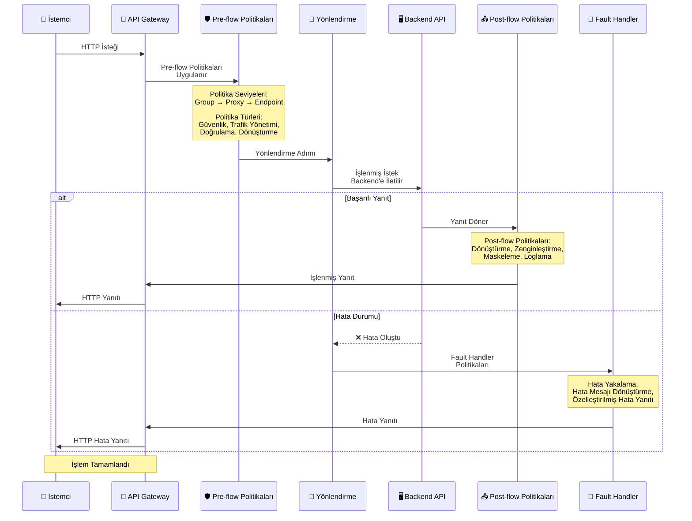

## Politika Kavramı

Politika, API Gateway'de istemciden gelen istekleri ve Backend API'den dönen yanıtları belirli kurallara göre işlemek için kullanılan yapılandırılabilir bir bileşendir. Politikalar konfigürasyon temelli çalışır ve kod yazmaya gerek yoktur.

Politikalar aracılığıyla aşağıdaki işlemleri gerçekleştirebilirsiniz:

- Güvenlik kuralları uygulayabilirsiniz. Kimlik doğrulama (Basic Auth, OAuth2, OIDC, JWT vb.) ve yetkilendirme (role-based access control) mekanizmalarını politikalar ile tanımlarız.
- Trafik yönetimi yapabilirsiniz. Kullanıcılar veya uygulamalar başına düşen kota (belirli dönem içinde yapılabilecek istek sayısı) ve hız sınırı (rate limiting) politikaları ile API'lerinizi aşırı yüklenmelerden koruyabilirsiniz.
- Veri dönüşümü sağlayabilirsiniz. Gelen istekleri veya dönen yanıtları farklı formatlara dönüştürebilirsiniz (örneğin XML'i JSON'a çevirme, veri yapısını yeniden biçimlendirme).
- Hata mesajlarını özelleştirebilirsiniz. Sistem tarafından dönen hata mesajlarını, kurumsal standartlara veya kullanıcı dostu bir dile çevirebilirsiniz.
- İş mantığı uygulayabilirsiniz. JavaScript veya Groovy gibi betik dilleri veya koşullu mantık politikaları kullanarak basit iş kurallarını API Gateway seviyesinde tanımlayabilirsiniz.
- Mesaj içeriğini zenginleştirebilirsiniz. İstek veya yanıta header ekleyebilir, metadata ekleyebilir veya hassas verileri maskeyleyebilirsiniz.

Politikalar, bir API Proxy'de mesajların işlenmesi sırasında uygulanan işlemleri tanımlar. Her politika belirli bir işlevi yerine getirir ve mesaj akışı içinde belirli bir noktada çalıştırılır. Arayüzde sürükle-bırak, parametre girişi veya konfigürasyon seçimleriyle politikaları anında etkinleştirebilir, güncelleyebilir veya devre dışı bırakabilirsiniz.

<CardGroup cols={2}>
  <Card title="Yapılandırılabilir" icon="gear">
    Politikalar form tabanlı arayüzlerle yapılandırılır. Kod yazmaya gerek yoktur.
  </Card>
  <Card title="Yeniden Kullanılabilir" icon="recycle">
    Politikalar global olarak tanımlanabilir ve birden fazla API Proxy'de kullanılabilir.
  </Card>
  <Card title="Koşullu Çalıştırma" icon="code-branch">
    Politikalar koşullara bağlı olarak çalıştırılabilir.
  </Card>
  <Card title="Sıralı İşleme" icon="list">
    Politikalar bir pipeline içinde sırayla çalıştırılır.
  </Card>
</CardGroup>

## Politika Uygulama Akışı

Aşağıdaki diyagram, politikaların mesaj akışında nasıl uygulandığını high-level olarak gösterir:



## Politikanın Amacı ve Faydaları

**Merkezi Kontrol**

API'lerin davranışı, güvenliği ve performansı tek bir noktadan yönetilir. Bu sayede dağıtık sistemlerde tutarlılık sağlanır ve yönetim karmaşıklığı azalır.

**Erişim Denetimi (Access Control) Politikaları**

Kimlik doğrulama, yetkilendirme ve API kaynaklarına erişim izinleri politikalar aracılığıyla tanımlanır. Böylece yetkisiz erişimler önlenir ve güvenlik sağlanır.

**Yeniden Kullanılabilirlik**

Bir kez tanımlanan politika, birden fazla API, endpoint veya servis tarafından kullanılabilir. Bu, politika yönetimini basitleştirir ve geliştirme sürecini hızlandırır.

**Kod Bakım Yükünü Azaltma**

Güvenlik, veri dönüşümü ve doğrulama işlemleri kod içinde değil, gateway konfigürasyonunda yapılır. Bu, uygulamaların kodundaki karmaşıklığı azaltır ve bakım maliyetlerini düşürür.

**Tutarlılık**

Tüm API'ler aynı politikalara tabi olduğundan, enterprise-wide güvenlik ve performans standartları tutarlı şekilde uygulanır. İstisnalar minimal düzeyde kalır.

**Hızlı Müdahale ve Esneklik**

Politikalar anında devre dışı bırakılabilir, güncellenebilir veya yeniden deploy edilebilir. Böylece güvenlik tehditlerine hızlı yanıt verilir, performans sorunları çözülür veya iş kuralları değişikliğe uyum sağlanır.

## Politika Türleri

### Güvenlik Politikaları

<CardGroup cols={2}>
  <Card title="Kimlik Doğrulama" icon="key">
    * OAuth2
    * OIDC
    * JWT
    * Basic Authentication
    * Digest Authentication
    * mTLS
  </Card>
  <Card title="Yetkilendirme" icon="lock">
    * IP Whitelist/Blacklist
    * API Key
    * Role-based Access Control
  </Card>
</CardGroup>

### Trafik Yönetimi Politikaları

<CardGroup cols={2}>
  <Card title="Rate Limiting" icon="gauge">
    * API Bazlı Daraltma
    * API Bazlı Kota
    * Zaman Kısıtlaması
  </Card>
  <Card title="Load Balancing" icon="scale-balanced">
    * Yük dengeleme stratejileri
    * Failover
  </Card>
</CardGroup>

### Mesaj İşleme Politikaları

<CardGroup cols={2}>
  <Card title="Doğrulama" icon="check-circle">
    * JSON Schema Doğrulama
    * XML Schema Doğrulama
    * Min/Max Mesaj
  </Card>
  <Card title="Dönüştürme" icon="arrows-rotate">
    * JSON Dönüştürme (Jolt)
    * XML Dönüştürme (XSLT)
    * Plain Text
  </Card>
</CardGroup>

### Mesaj Zenginleştirme ve İş Mantığı Politikaları

<CardGroup cols={2}>
  <Card title="Zenginleştirme" icon="wand-magic-sparkles">
    * Header ekleme
    * Veri ekleme
    * Script (Groovy/JavaScript)
  </Card>
  <Card title="İş Kuralı" icon="code-branch">
    * Koşullu iş mantığı
    * Aksiyon zinciri
    * Veri manipülasyonu
  </Card>
  <Card title="API Çağrısı" icon="network-wired">
    * Harici API çağrıları
    * Veri çekme
    * Entegrasyon
  </Card>
  <Card title="Güvenlik" icon="shield">
    * Şifreleme/Şifre Açma
    * Dijital İmza
    * Redaction (Maskeleme)
  </Card>
</CardGroup>

<Info>
  Tüm politika türleri ve detaylı açıklamaları için [Politikalar](/tr/gelistirici/politikalar/api-bazli-daraltma.mdx) sayfasına bakabilirsiniz.
</Info>

## Politika Pipeline

Politikalar bir pipeline içinde sırayla çalıştırılır:

```
Request Pipeline:
├─ Pre-flow Politikaları (İstek öncesi)
├─ Koşullu Politikalar
├─ Yönlendirme Adımı
├─ Post-flow Politikaları (İstek sonrası)
└─ Response Pipeline:
   └─ Post-flow Politikaları (Yanıt sonrası)
   └─ Fault Handler Politikaları (Hata durumunda)
```

### Pipeline Aşamaları

<AccordionGroup>
  <Accordion title="Pre-flow Politikaları">
    İstek backend'e gönderilmeden önce çalışan politikalar:
    * Kimlik doğrulama
    * Yetkilendirme
    * Rate limiting
    * Mesaj doğrulama
  </Accordion>
  
  <Accordion title="Koşullu Politikalar">
    Koşullara bağlı olarak çalışan politikalar:
    * IF-THEN-ELSE mantığı
    * Mesaj içeriğine göre çalıştırma
    * Header değerlerine göre çalıştırma
  </Accordion>
  
  <Accordion title="Yönlendirme Adımı">
    İsteğin backend'e yönlendirildiği adım:
    * Upstream target seçimi
    * Load balancing
    * Failover
  </Accordion>
  
  <Accordion title="Post-flow Politikaları">
    Backend'den yanıt geldikten sonra çalışan politikalar:
    * Yanıt dönüştürme
    * Maskeleme
    * Loglama
    * Header ekleme
  </Accordion>
  
  <Accordion title="Fault Handler Politikaları">
    Hata durumlarında çalışan politikalar:
    * Hata yakalama (Connection Error, Timeout Error, 4xx/5xx Errors)
    * Hata sınıflandırma
    * Hata mesajı dönüştürme
    * Hata loglama
    * Özelleştirilmiş hata yanıtı
  </Accordion>
</AccordionGroup>

## Politika Kullanım Tipleri

### Yerel Politika

Yalnızca oluşturulduğu API Proxy'de veya API Proxy Grupta geçerlidir. Bulunduğu API Proxy veya API Proxy Grup silinirse politika da silinir.

Bulunduğu yerde export, import, activate, deactivate işlemleri yapılabilir.

### Global Politika

Global Politikalar sayfasında oluşturulan politikalardır. Birden fazla API Proxy veya API Proxy Grup tarafından kullanılabilir.

Global politikada değişiklik yapılırsa, politikayı kullanan tüm API Proxy'ler ve API Proxy Gruplar "Redeploy Required" durumuna geçer.

Bu ekrandaki toplu deploy işlemi ile ilgili tüm API Proxy/API Proxy Gruplar birlikte deploy edilebilir.

Ayrıca bu ekranlardan politika export, import, activate, deactivate işlemleri de gerçekleştirilebilir.

**Global Politikayı Yerelleştirme:**

Global olarak oluşturulmuş politika bir API Proxy/API proxy Group'da kullanımı sırasında özelleştirilmesi gerekebilir.

Bu durumda API Proxy/API proxy Group'a eklenen politikaya tıklanır ve sağ üst köşedeki "Yerelleştir" tuşuna basılarak tek tıklama ile yerel hâle getirilebilir.

**Global Politikanın Kullanıldığı Yerler:**

Bir global politikanın hangi API proxylerde, API proxy gruplarında veya politika gruplarında kullanıldığını takip etmek, yönetim ve güncelleme süreçlerinde kritik öneme sahiptir.

Her politika detay sayfasında, politikanın kullanım bilgileri görüntülenir:

* **Kullanıldığı API Proxy'ler Paneli:** Bu bölümde, politikayı kullanan API Proxy'lerin listesi görüntülenir.
* **Kullanıldığı API Proxy Grupları Paneli:** Bu bölümde, politikayı kullanan API Proxy gruplarının listesi görüntülenir.
* **Kullanıldığı Politika Grupları Paneli:** Bu bölümde, bu politikayı içeren politika gruplarının listesi görüntülenir.

### Global ve Yerel Politika Karşılaştırması

| Global Politika | Local Politika |
|----------------|----------------|
| Birden fazla API Proxy'de kullanılabilir | Sadece bir API Proxy'de kullanılır |
| Merkezi yönetilir | Proxy bazında yönetilir |
| Bir kez güncellenir, tüm kullanımlar etkilenir | Her proxy için ayrı güncelleme gerekir |
| Yeniden kullanılabilirliği yüksek | Yeniden kullanılabilirliği düşük |

## Politika Uygulama Noktaları

Politikalar üç farklı seviyede uygulanabilir:

| Uygulama Noktası | Açıklama |
|------------------|----------|
| API Proxy Grubu | Bir gruptaki tüm API Proxy'lere uygulanır |
| API Proxy | Belirli bir API Proxy içindeki tüm metot/endpoint'lere uygulanır |
| Metot/Endpoint | Yalnızca ilgili metot veya endpoint için geçerlidir |

Politikaların mesaj akışındaki uygulama sırası, API Proxy Group/API Proxy/Endpoint seviyelerindeki çalışma mantığı ve görsel akış diyagramı hakkında detaylı bilgi için [Mesaj İşleme ve Politika Uygulama](/tr/apinizer-anlama/temel-kavramlar/mesaj-isleme-ve-politika-uygulama) sayfasına bakınız.

## Politika Yapısı

Politikalar, fonksiyonel farklarına rağmen aynı temel yapıyı paylaşır.

### Genel Bilgi Paneli

Her politikanın adı, açıklaması aktif olup olmadığı bilgileri ortak alanlarıdır.

Ortak alanlar sonrasında politikaya özel konfigürasyon alanları yer alır.

### Koşullar

Politikalar, yalnızca belirli koşullar sağlandığında çalışacak şekilde özelleştirilebilir.

**Örnek:**

- `status` parametresi `"pending"` ise çalış.
- `userId` alanı `#user1#user2#user3` listesindeyse işlet.

Bu özellik, politikaların **dinamik ve bağlama duyarlı** şekilde çalışmasını sağlar.

Koşul değer kıyaslama operatörü olarak "listede olsun" veya "listede olmasın" seçeneği seçildiğinde, liste değerlerinin ayrımı için # işareti kullanılmalıdır. Örneğin user1#user2#user3 gibi.

### Hata Mesajı Özelleştirme (Error Message Customization)

Politika çalışması sırasında oluşabilecek hatalar için dönen mesajlar özelleştirilebilir. Bu sayede geliştiriciler, istemcilere dönen hata mesajlarını kurumsal veya anlaşılır biçimde özelleştirebilir.

Her politika, hata oluştuğunda dönecek mesajları özelleştirebilir:

| Alan | Açıklama |
|------|----------|
| HTTP Status Code | Varsayılan sistem kodu |
| Error Code | Varsayılan hata kodu |
| Original Message | Varsayılan hata mesajı |
| Customized HTTP Status Code | Farklı bir HTTP durum kodu döndürülür |
| Customized Error Code | Farklı hata kodu belirlenir |
| Customized Error Message | Özel hata mesajı yazılır |

**Not:** Politika tanımlama arayüzünde o politika özelinde hata kodları ve mesajları özelleştirilebileceği gibi, platform genelinde de hata özelleştirme yapılabilir.

## Politika Yapılandırması

Politikalar form tabanlı arayüzlerle yapılandırılır. Her politika türünün kendine özgü yapılandırma seçenekleri vardır.

### Global Politikalar

Politikalar global olarak tanımlanabilir ve birden fazla API Proxy'de kullanılabilir. Bu sayede:

* Politika tekrarı önlenir
* Merkezi yönetim sağlanır
* Tutarlılık korunur

### Politika Grupları

Politika Grupları, ilgili politikaların gruplandırılarak birlikte yönetilmesini sağlar. Politika Grupları sayesinde:

* **Merkezi Yönetim**: İlgili politikalar tek bir grup altında toplanır
* **Kolay Uygulama**: Politika Grubu bir API Proxy'ye eklendiğinde, grubun içindeki tüm politikalar otomatik olarak uygulanır
* **Yeniden Kullanım**: Aynı politika kombinasyonu birden fazla API Proxy'de kullanılabilir
* **Versiyonlama**: Politika Grupları versiyonlanabilir ve farklı versiyonlar farklı API Proxy'lerde kullanılabilir

<Info>
  Detaylı Politika Grupları bilgisi için [Politika Yönetimi](/tr/gelistirici/api-proxy-konfigurasyonu/politika-yonetimi) sayfasına bakabilirsiniz.
</Info>

## Politika ve API Proxy İlişkisi

Politikalar API Proxy'lerin temel bileşenleridir:

* **API Proxy İçinde**: Her API Proxy kendi politikalarını içerir. Bu politikalar API Proxy'ye özeldir.
* **API Proxy Grubu İçinde**: Politika Grupları, birden fazla API Proxy'de kullanılabilen politika koleksiyonlarıdır.
* **Global Politikalar**: Global olarak tanımlanan politikalar birden fazla API Proxy'de kullanılabilir.

Bir API Proxy'ye politikalar şu seviyelerde eklenebilir:

```
API Proxy Group
├─ Group Pre-flow Politikaları
├─ Group Post-flow Politikaları
└─ Group Fault Handler Politikaları
    │
    └─ API Proxy
        ├─ Proxy Pre-flow Politikaları
        ├─ Proxy Conditional Politikaları
        ├─ Proxy Post-flow Politikaları
        └─ Proxy Fault Handler Politikaları
            │
            └─ Endpoint/Method
                ├─ Endpoint Pre-flow Politikaları
                ├─ Endpoint Post-flow Politikaları
                └─ Endpoint Fault Handler Politikaları
```

<Info>
  Politika uygulama seviyeleri ve çalışma sırası hakkında detaylı bilgi için [Mesaj İşleme ve Politika Uygulama](/tr/apinizer-anlama/temel-kavramlar/mesaj-isleme-ve-politika-uygulama) sayfasına bakabilirsiniz.
</Info>

## Politika Oluşturma ve Yönetimi

### Politika Oluşturma

Politika oluştururken şu adımlar izlenir:

1. **Politika Türü Seçimi**: Oluşturulacak politika türü seçilir
2. **Yapılandırma**: Politika parametreleri form tabanlı arayüzle yapılandırılır
3. **Koşullar**: İsteğe bağlı olarak koşullar tanımlanır
4. **Hata Mesajı Özelleştirme**: Hata durumları için özel mesajlar tanımlanır
5. **Aktivasyon**: Politika aktif hale getirilir
6. **Deployment**: Değişikliklerin etkili olması için API Proxy redeploy edilir

<Info>
  Detaylı politika oluşturma ve yönetimi için [Politika Yönetimi](/tr/gelistirici/api-proxy-konfigurasyonu/politika-yonetimi) sayfasına bakabilirsiniz.
</Info>

## Politika Çalıştırma Sırası

Politikalar tanımlandıkları sırayla çalıştırılır. Bu sıra önemlidir çünkü:

* Önce güvenlik kontrolleri yapılmalı
* Sonra doğrulama yapılmalı
* En son dönüştürme yapılmalı

Politika çalıştırma sırası şu şekildedir:

1. **API Proxy Group Pre-flow Politikaları**
2. **API Proxy Pre-flow Politikaları**
3. **Endpoint Pre-flow Politikaları**
4. **Koşullu Politikalar**
5. **Yönlendirme Adımı**
6. **Post-flow Politikaları (İstek)**
7. **Backend API İsteği**
8. **Post-flow Politikaları (Yanıt)**
9. **Fault Handler Politikaları** (Hata durumunda)

## En İyi Uygulamalar

- Politikaları yeniden kullanılabilir olacak şekilde oluşturun
- Mümkünse global politika tercih edin
- Hata mesajlarını kullanıcı dostu hâle getirin
- Politika koşullarını gereksiz yere karmaşıklaştırmayın
- Değişiklik sonrası redeploy işlemini gerçekleştirin

## Sonraki Adımlar

<CardGroup cols={2}>
  <Card title="API Proxy Nedir?" icon="network-wired" href="/tr/apinizer-anlama/temel-kavramlar/api-proxy-nedir">
    API Proxy kavramını öğrenin
  </Card>
  <Card title="Mesaj İşleme ve Politika Uygulama" icon="diagram-project" href="/tr/apinizer-anlama/temel-kavramlar/mesaj-isleme-ve-politika-uygulama">
    Mesaj akışı ve politika pipeline'ı öğrenin
  </Card>
  <Card title="Mesaj İşleme ve Politika Uygulama" icon="diagram-project" href="/tr/apinizer-anlama/temel-kavramlar/mesaj-isleme-ve-politika-uygulama">
    Mesaj akışı ve politika uygulama sürecini öğrenin
  </Card>
  <Card title="Politikalar" icon="list" href="/tr/gelistirici/politikalar/api-bazli-daraltma.mdx">
    Tüm politika türlerini inceleyin
  </Card>
  <Card title="Politika Yönetimi" icon="gear" href="/tr/gelistirici/api-proxy-konfigurasyonu/politika-yonetimi">
    Politika oluşturma ve yönetimi
  </Card>
  <Card title="Koşullu Politika Çalıştırma" icon="code-branch" href="/tr/apinizer-anlama/temel-kavramlar/kosullu-politika-calistirma">
    Koşullu politika çalıştırmayı öğrenin
  </Card>
</CardGroup>
