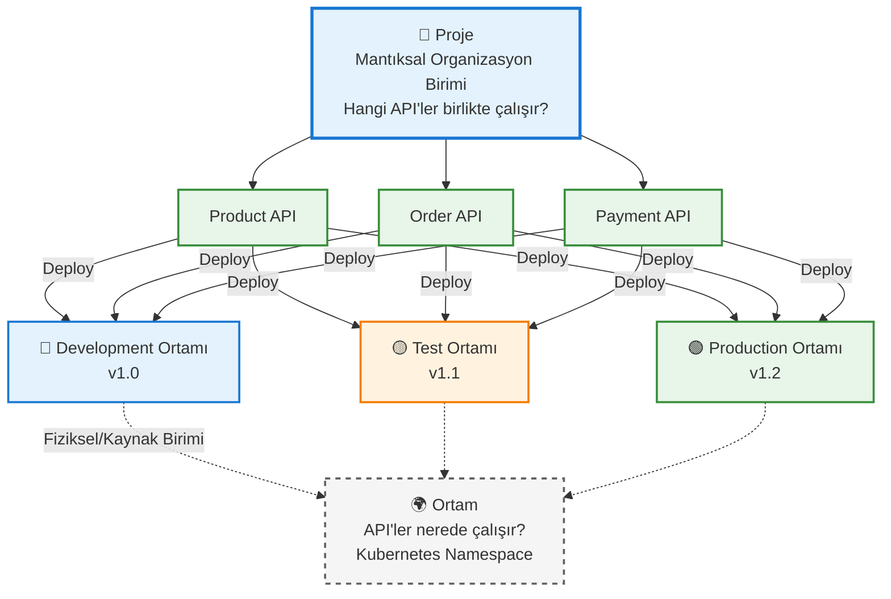

## Proje Kavramı

Proje, bir kurum içindeki farklı ekiplerin, farklı API'leri organize etmesi ve yönetmesi için kullanılan mantıksal bir kapsayıcıdır. Her proje kendi API Proxy'lerini, politikalarını, bağlantılarını ve ayarlarını içerir.

<CardGroup cols={2}>
  <Card title="Organizasyon" icon="folder">
    API Proxy'lerin mantıksal olarak gruplandırılması
  </Card>
  <Card title="Erişim Kontrolü" icon="lock">
    Proje bazlı kullanıcı ve rol yönetimi
  </Card>
  <Card title="İşbirliği" icon="users">
    Ekip üyelerinin birlikte çalışması
  </Card>
  <Card title="İzolasyon" icon="shield">
    Projeler arası veri ve ayar izolasyonu
  </Card>
</CardGroup>

## Proje Yapısı

Aşağıdaki diyagram, projenin ne içerdiğini high-level olarak gösterir:

```mermaid
flowchart TD
    Project[📁 Proje<br/>Mantıksal Organizasyon Birimi]
    
    Project --> APIProxies[API Proxy'ler<br/>API Yapılandırmaları]
    Project --> Policies[Politikalar<br/>Güvenlik, Trafik, Dönüştürme]
    Project --> Connections[Bağlantılar<br/>Veritabanı, Mesaj Kuyruğu]
    Project --> Connectors[Konnektörler<br/>Entegrasyon Bileşenleri]
    Project --> Variables[Değişkenler<br/>Ortam Değişkenleri]
    Project --> Settings[Ayarlar<br/>CORS, Timeout, Hata Mesajları]
    Project --> Members[Üyeler<br/>Project Owner, Yönetici,<br/>Geliştirici, Görüntüleyici]
    Project --> GatewayPath[Geçit Adresi<br/>Relative Path Ön-eki]
    
    style Project fill:#e3f2fd,stroke:#1976d2,stroke-width:3px
    style APIProxies fill:#e8f5e9,stroke:#388e3c,stroke-width:2px
    style Policies fill:#fff3e0,stroke:#f57c00,stroke-width:2px
    style Connections fill:#f3e5f5,stroke:#7b1fa2,stroke-width:2px
    style Connectors fill:#fce4ec,stroke:#c2185b,stroke-width:2px
    style Variables fill:#fff9c4,stroke:#f9a825,stroke-width:2px
    style Settings fill:#f5f5f5,stroke:#616161,stroke-width:2px
    style Members fill:#e1f5ff,stroke:#0277bd,stroke-width:2px
    style GatewayPath fill:#f1f8e9,stroke:#558b2f,stroke-width:2px
```



## Proje ve Ortam İlişkisi

Aşağıdaki diyagram, proje ve ortam kavramlarının ilişkisini gösterir:



## Proje Özellikleri

### Proje İçeriği

Bir proje şunları içerebilir:

* **API Proxy'ler**: Projeye ait tüm API Proxy'ler
* **Politikalar**: Projeye özel politika tanımları
* **Bağlantılar**: Veritabanı, mesaj kuyruğu vb. bağlantılar
* **Konnektörler**: Entegrasyon konnektörleri
* **Değişkenler**: Proje seviyesinde değişkenler
* **Geçit Adresi (Relative Path)**: Proje içindeki tüm API Proxy'lerin geçit adreslerinin başlayacağı ön-ek. Örneğin, proje geçit adresi "account" olduğunda API proxy geçit adresi `/account/proxy1` şeklinde görünür.
* **Ayarlar**: Projeye özgü konfigürasyonlar

<Tip>
  Apinizer, ilk kurulumda bir **Varsayılan (default)** proje sağlar. Bu Varsayılan proje düzenlenemez veya silinemez.
</Tip>

### Proje Yönetimi

<AccordionGroup>
  <Accordion title="Proje Oluşturma">
    Yeni bir proje oluştururken şu bilgiler tanımlanır:
    
    * **Proje Adı**: Projeyi tanımlayan benzersiz isim
    * **Geçit Adresi'ni Aktive Et**: Proje içerisinde yer alan tüm geçit adreslerinde ortak bir ön-ek kullanılmak isteniyorsa aktif hale getirilir
    * **Geçit Adresi (Relative Path)**: Projenin içinde tanımlanacak tüm API Proxy'lerin geçit adreslerinin başlayacağı ön-ek ifadesi. Sistem tarafından otomatik bir UUID verilir
    * **Açıklama**: Projenin amacı ve kapsamı
    * **Üyeler**: Projeye erişimi olan kullanıcılar ve rolleri
    * **Görünürlük**: Projenin görünürlük ayarları
    
    Bir proje iki şekilde oluşturulabilir:
    * **Yeni (Create)**: Yeni bir proje tanımlaması
    * **Proje Yükle (Import Project)**: Mevcut bir proje konfigürasyon dosyası üzerinden proje yükleme
    
    <Info>
      Detaylı proje oluşturma ve yönetimi için [Proje Yönetimi](/tr/admin/proje-yonetimi/proje-oluşturma) sayfasına bakabilirsiniz.
    </Info>
  </Accordion>
  
  <Accordion title="Proje Üyeleri ve Rolleri">
    Her projede farklı rollere sahip üyeler bulunabilir:
    
    * **Project Owner**: Projenin sahibi. Projeyi yönetme, düzenleme ve silme yetkisi. Eğer Project Owner rolüne sahip kullanıcı projeden silinirse, Admin kullanıcısı otomatik olarak Project Owner olur.
    * **Proje Yöneticisi**: Projeyi yönetme yetkisi
    * **Geliştirici**: API Proxy oluşturma ve düzenleme yetkisi
    * **Görüntüleyici**: Sadece görüntüleme yetkisi
    
    Bu roller, proje bazlı erişim kontrolü sağlar.
  </Accordion>
  
   
</AccordionGroup>

## Proje ve Ortam İlişkisi

Projeler ve ortamlar farklı kavramlardır:

* **Proje**: Mantıksal organizasyon birimi (hangi API'ler birlikte çalışır?)
* **Ortam**: Fiziksel/kaynak birimi (API'ler nerede çalışır?)

Bir projedeki API Proxy'ler farklı ortamlara yüklenebilir:

```
Proje: E-Ticaret API'leri
├─ Development Ortamı
│  ├─ Product API v1.0
│  └─ Order API v1.0
├─ Test Ortamı
│  ├─ Product API v1.1
│  └─ Order API v1.1
├─ Sandbox Ortamı
│  ├─ Product API v1.2
│  └─ Order API v1.2
└─ Production Ortamı
   ├─ Product API v1.2
   └─ Order API v1.2
```

Ortam oluştururken, ortamın hangi projelerde kullanılabileceği belirlenebilir. Eğer proje seçimi boş bırakılırsa, ortam tüm projelerde kullanılabilir. Proje seçilmesi durumunda sadece o proje içerisinde yer alan API Proxy'lerin bu ortama deploy edilebileceği anlamına gelir.

## Proje Kullanım Senaryoları

<CardGroup cols={2}>
  <Card title="Ekip Bazlı Organizasyon" icon="users">
    Farklı ekiplerin kendi projelerinde çalışması. Örneğin:
    * E-Ticaret Ekibi → E-Ticaret Projesi
    * Ödeme Ekibi → Ödeme Projesi
    * Raporlama Ekibi → Raporlama Projesi
  </Card>
  <Card title="Müşteri Bazlı Organizasyon" icon="building">
    Farklı müşteriler için ayrı projeler. Örneğin:
    * Müşteri A → Müşteri A Projesi
    * Müşteri B → Müşteri B Projesi
  </Card>
  <Card title="Ürün Bazlı Organizasyon" icon="box">
    Farklı ürünler için ayrı projeler. Örneğin:
    * Mobil Uygulama → Mobil API Projesi
    * Web Uygulama → Web API Projesi
  </Card>
  <Card title="Sürüm Bazlı Organizasyon" icon="code-branch">
    Farklı API versiyonları için ayrı projeler. Örneğin:
    * API v1 → API v1 Projesi
    * API v2 → API v2 Projesi
  </Card>
</CardGroup>

## Proje İşlemleri

### Proje Export/Import

Projeler export edilerek başka ortamlara veya sistemlere taşınabilir:

* **Export**: Projenin tüm içeriğini JSON/YAML formatında dışa aktarma
* **Import**: Dışa aktarılan projeyi başka bir ortama veya sisteme aktarma
* **Cross-Environment Migration**: Projelerin farklı ortamlar arasında taşınması

### Proje Şablonları

Sık kullanılan proje yapılandırmaları şablon olarak kaydedilebilir ve yeni projeler oluştururken kullanılabilir.

### Proje Silme

Proje silme işlemi, **Project Owner** veya **Sistem Yöneticisi** rolüne sahip kullanıcılar tarafından gerçekleştirilebilir.

<Warning>
  **Önemli**: Bir projeyi sildiğiniz zaman o projeye ait olan tüm varlıklar (API Proxy'ler, Bağlantı Konfigürasyonları, Kimlik Bilgileri bilgileri vs) ve konfigürasyon bilgileri silinecektir. Bu işlem geri alınamaz.
</Warning>

<Info>
  Varsayılan (default) proje silinemez veya düzenlenemez.
</Info>

## Sonraki Adımlar

<CardGroup cols={2}>
  <Card title="Ortam Nedir?" icon="server" href="/tr/apinizer-anlama/temel-kavramlar/ortam-nedir">
    Ortam kavramını öğrenin
  </Card>
  <Card title="API Proxy Nedir?" icon="network-wired" href="/tr/apinizer-anlama/temel-kavramlar/api-proxy-nedir">
    API Proxy kavramını öğrenin
  </Card>
  <Card title="Proje Yönetimi" icon="gear" href="/tr/admin/proje-yonetimi/project-creation-setup">
    Proje oluşturma ve yönetimi
  </Card>
  <Card title="Export/Import" icon="arrow-right-arrow-left" href="/tr/admin/export-import/export-project">
    Proje export/import işlemleri
  </Card>
</CardGroup>