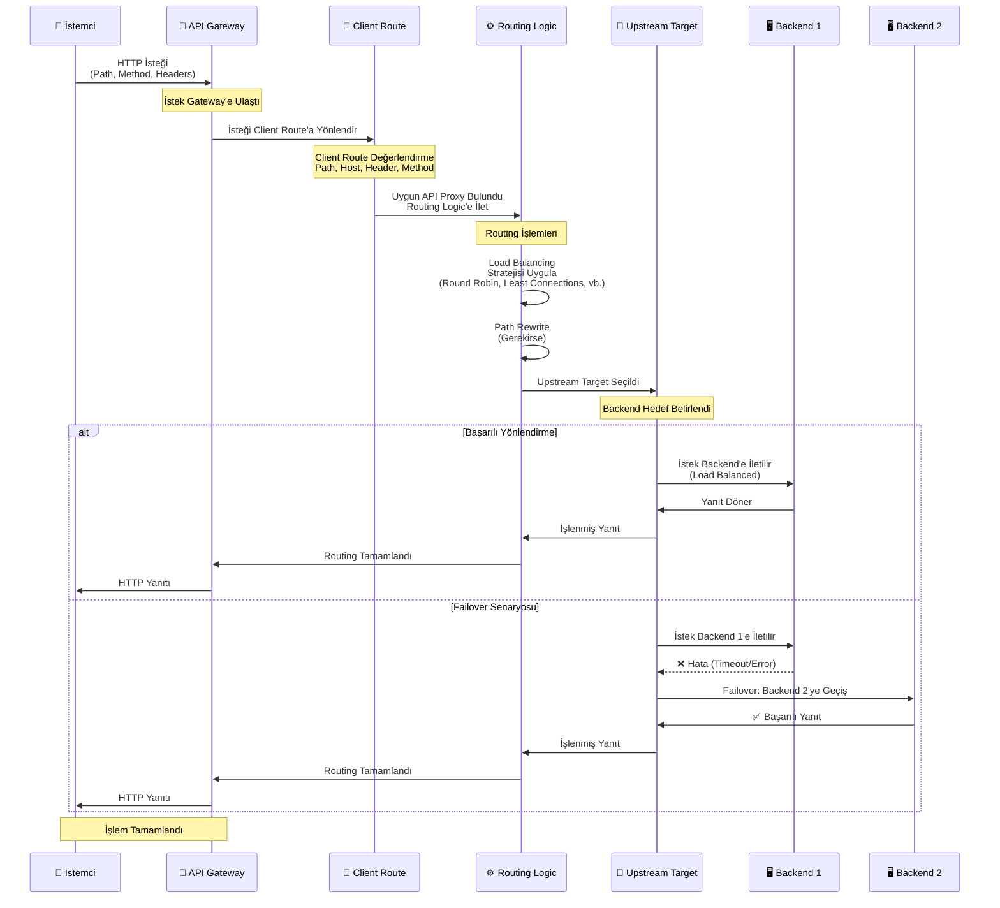

## Routing Kavramı

Routing, bir API Proxy'de iki temel bileşenden oluşur:

<CardGroup cols={2}>
  <Card title="Client Route" icon="arrow-right" href="/tr/apinizer-anlama/temel-kavramlar/client-route">
    İsteklerin API Proxy'ye girdiği nokta. İstemciler bu endpoint'e istek gönderir.
  </Card>
  <Card title="Upstream Target" icon="arrow-left" href="#upstream-target">
    İsteklerin yönlendirildiği backend API. API Proxy bu adrese istek gönderir.
  </Card>
</CardGroup>

## Routing Akışı

Aşağıdaki diyagram, istek ve yanıt akışının Gateway üzerinden Routing ve Upstream mekanizması ile nasıl gerçekleştiğini gösterir:



<CardGroup cols={1}>
  <Card title="1. İstemci İsteği" icon="arrow-right">
    İstemci API Proxy'ye istek gönderir
  </Card>
  <Card title="2. Client Route" icon="network-wired">
    İsteklerin API Proxy'ye girdiği nokta<br/>
    Path, Method, Protocol ve Port tanımları
  </Card>
  <Card title="3. Routing Logic" icon="route">
    Load Balancing, Failover ve yönlendirme mantığı uygulanır
  </Card>
  <Card title="4. Upstream Target" icon="arrow-left">
    İsteklerin yönlendirildiği backend API<br/>
    Backend adresi, protokol ve yapılandırma
  </Card>
  <Card title="5. Backend API" icon="server">
    İşlenmiş istek backend API'ye gönderilir
  </Card>
</CardGroup>

## Upstream Target

Upstream Target (Yukarı Akış Hedefi), API Proxy'de istemcilerden gelen isteklerin yönlendirildiği backend API'nin adresidir. Upstream Target, API Proxy'nin backend ile iletişim kurduğu noktadır.

### Upstream Target Genel Bakış

Upstream ve target kavramları, API Proxy'lerde backend servislere yönlendirme yapılırken kullanılan temel kavramlardır. Upstream Target, backend API'nin fiziksel veya mantıksal adresini temsil eder. API Proxy, Client Route'dan gelen istekleri bu hedefe yönlendirir.

<CardGroup cols={2}>
  <Card title="Backend Adresi" icon="server">
    Backend API'nin URL'i veya IP adresi
  </Card>
  <Card title="Protokol" icon="globe">
    HTTP, HTTPS, gRPC, WebSocket protokolleri
  </Card>
  <Card title="Yük Dengeleme" icon="scale-balanced">
    Birden fazla backend instance'ı arasında yük dengeleme
  </Card>
  <Card title="Failover" icon="heart-pulse">
    Hata durumunda alternatif backend'e geçiş
  </Card>
</CardGroup>

### Upstream ve Target

**Upstream**: API Proxy'nin istekleri yönlendirdiği backend servislerin tanımlandığı yapılandırmadır. Bir upstream birden fazla target içerebilir.

**Target**: Upstream içinde tanımlanan backend servis adresleridir. Her target bir URL ve gerekli yapılandırma bilgilerini içerir.

### Upstream Target Yapısı

Bir Upstream Target şu bilgileri içerir:

```
http://backend-service:8080/api/products
│     │                │    │
│     │                │    └─ Backend Path
│     │                └─ Port
│     └─ Host/Service Name
└─ Protocol
```

### Örnek Upstream Target'lar

<CardGroup cols={2}>
  <Card title="HTTP Target" icon="globe">
    ```
    http://product-service:8080
    ```
  </Card>
  <Card title="HTTPS Target" icon="lock">
    ```
    https://api.backend.com/v1
    ```
  </Card>
  <Card title="gRPC Target" icon="network-wired">
    ```
    grpc://backend-service:50051
    ```
  </Card>
  <Card title="WebSocket Target" icon="plug">
    ```
    ws://websocket-service:8080
    ```
  </Card>
</CardGroup>

### Upstream Target Yapılandırması

Bir Upstream Target oluştururken şu bilgiler tanımlanır:

<AccordionGroup>
  <Accordion title="Temel Yapılandırma">
    * **URL**: Backend API'nin adresi
    * **Protocol**: HTTP, HTTPS, gRPC, WebSocket
    * **Host**: Backend sunucu adı veya IP
    * **Port**: Backend port numarası
    * **Path**: Backend path'i (opsiyonel)
    * **Path Rewrite**: Backend path'ini değiştirme (opsiyonel)
  </Accordion>
  
  <Accordion title="Path Rewrite">
    Upstream Target'da path rewrite yapılabilir:
    
    ```
    Client Route: /api/v1/products
       │
       ▼ (Path Rewrite)
    Upstream Target: /products
       │
       ▼
    Backend API: http://backend:8080/products
    ```
    
    **Path Rewrite Örnekleri:**
    * `/api/v1/products` → `/products` (prefix removal)
    * `/api/v1/products` → `/v2/products` (version change)
    * `/api/products/{id}` → `/products/{id}` (path simplification)
  </Accordion>
  
  <Accordion title="Timeout Ayarları">
    * **Connection Timeout**: Bağlantı zaman aşımı
    * **Read Timeout**: Okuma zaman aşımı
    * **Write Timeout**: Yazma zaman aşımı
  </Accordion>
</AccordionGroup>

### Upstream Target Türleri

<CardGroup cols={2}>
  <Card title="Single Target" icon="server">
    Tek bir backend instance:
    ```
    http://backend:8080
    ```
  </Card>
  <Card title="Multiple Targets" icon="layer-group">
    Birden fazla backend instance (Load Balanced):
    ```
    http://backend1:8080
    http://backend2:8080
    http://backend3:8080
    ```
  </Card>
  <Card title="Dynamic Target" icon="arrows-rotate">
    Dinamik olarak belirlenen backend:
    ```
    Variable-based target selection
    ```
  </Card>
</CardGroup>

## Routing Türleri

Apinizer platformu farklı protokoller için routing desteği sağlar:

<CardGroup cols={3}>
  <Card title="HTTP Routing" icon="globe" href="#http-routing">
    HTTP/HTTPS protokolü için routing. REST API'ler için kullanılır.
  </Card>
  <Card title="gRPC Routing" icon="network-wired" href="#grpc-routing">
    gRPC protokolü için routing. Microservice mimarileri için kullanılır.
  </Card>
  <Card title="WebSocket Routing" icon="plug" href="#websocket-routing">
    WebSocket protokolü için routing. Gerçek zamanlı iletişim için kullanılır.
  </Card>
</CardGroup>

## HTTP Routing

HTTP Routing, HTTP/HTTPS protokolü kullanan REST API'ler için routing desteğidir.

### HTTP Routing Özellikleri

<CardGroup cols={2}>
  <Card title="Protokol Desteği" icon="globe">
    * HTTP/1.1
    * HTTP/2
    * HTTPS (TLS/SSL)
  </Card>
  <Card title="Method Desteği" icon="code">
    * GET, POST, PUT, DELETE
    * PATCH, HEAD, OPTIONS
    * Custom methods
  </Card>
  <Card title="Content-Type" icon="file">
    * application/json
    * application/xml
    * application/x-www-form-urlencoded
    * multipart/form-data
  </Card>
  <Card title="Özellikler" icon="star">
    * Path matching (exact, prefix, regex)
    * Query parameter handling
    * Header manipulation
    * Body transformation
    * Host bazlı routing
    * Method bazlı routing
  </Card>
</CardGroup>

### HTTP Routing Yapılandırması

```yaml
client_route:
  path: /api/v1/*
  method: GET, POST, PUT, DELETE
  protocol: https
  port: 443

upstream_target:
  url: http://backend-service:8080
  protocol: http
```

### HTTP Routing Kullanım Senaryoları

* **REST API Gateway**: REST API'lerin yönetimi
* **API Versioning**: API versiyonlama
* **Legacy System Integration**: Eski sistemlerle entegrasyon
* **Public API Exposure**: Dış dünyaya API açma

Detaylı bilgi için [HTTP Yönlendirme](/tr/gelistirici/yonlendirme/http-yonlendirme) sayfasına bakın.

## gRPC Routing

gRPC Routing, gRPC protokolü kullanan microservice'ler için routing desteğidir.

### gRPC Routing Özellikleri

<CardGroup cols={2}>
  <Card title="Protokol Desteği" icon="network-wired">
    * gRPC (HTTP/2 üzerinde)
    * gRPC-Web
    * TLS/SSL desteği
  </Card>
  <Card title="Service Definition" icon="file-code">
    * Protocol Buffers (Protobuf)
    * Service definition
    * Method routing
  </Card>
  <Card title="Özellikler" icon="star">
    * Unary calls
    * Server streaming
    * Client streaming
    * Bidirectional streaming
  </Card>
  <Card title="Load Balancing" icon="scale-balanced">
    * gRPC-aware load balancing
    * Failover
  </Card>
</CardGroup>

### gRPC Routing Yapılandırması

```yaml
client_route:
  path: /com.example.ProductService/*
  protocol: grpc
  port: 50051

upstream_target:
  url: grpc://backend-service:50051
  protocol: grpc
  service: com.example.ProductService
```

### gRPC Routing Kullanım Senaryoları

* **Microservice Communication**: Microservice'ler arası iletişim
* **High Performance APIs**: Yüksek performans gereksinimleri
* **Streaming APIs**: Gerçek zamanlı veri akışı
* **Internal APIs**: İç sistem API'leri

Detaylı bilgi için [gRPC Yönlendirme](/tr/gelistirici/yonlendirme/grpc-yonlendirme) sayfasına bakın.

## WebSocket Routing

WebSocket Routing, WebSocket protokolü kullanan gerçek zamanlı uygulamalar için routing desteğidir.

### WebSocket Routing Özellikleri

<CardGroup cols={2}>
  <Card title="Protokol Desteği" icon="globe">
    * WebSocket (ws://)
    * Secure WebSocket (wss://)
    * HTTP Upgrade
  </Card>
  <Card title="Bağlantı Yönetimi" icon="plug">
    * Connection establishment
    * Connection persistence
    * Connection pooling
  </Card>
  <Card title="Mesaj İşleme" icon="message">
    * Text messages
    * Binary messages
    * Message routing
  </Card>
  <Card title="Özellikler" icon="star">
    * Subprotocol support
    * Ping/Pong frames
    * Connection timeout
  </Card>
</CardGroup>

### WebSocket Routing Yapılandırması

```yaml
client_route:
  path: /ws/*
  protocol: wss
  port: 443

upstream_target:
  url: ws://backend-service:8080
  protocol: ws
  subprotocol: chat
```

### WebSocket Routing Kullanım Senaryoları

* **Real-time Chat**: Gerçek zamanlı sohbet uygulamaları
* **Live Updates**: Canlı güncellemeler
* **Gaming**: Oyun uygulamaları
* **IoT**: IoT cihazları ile iletişim

Detaylı bilgi için [WebSocket Yönlendirme](/tr/gelistirici/yonlendirme/websocket-yonlendirme) sayfasına bakın.

## Protokol Karşılaştırması

| Özellik | HTTP | gRPC | WebSocket |
|---------|------|------|------------|
| **Protokol** | HTTP/1.1, HTTP/2 | HTTP/2 | WebSocket |
| **Veri Formatı** | JSON, XML | Protobuf | Text, Binary |
| **İletişim** | Request-Response | Request-Response, Streaming | Bidirectional |
| **Performans** | Orta | Yüksek | Yüksek (persistent) |
| **Kullanım** | REST API'ler | Microservices | Real-time apps |
| **Browser Desteği** | ✅ | ⚠️ (gRPC-Web) | ✅ |

## Protokol Seçim Kılavuzu

<AccordionGroup>
  <Accordion title="Ne Zaman HTTP Kullanılmalı?">
    * REST API'ler için
    * Browser tabanlı uygulamalar için
    * Geniş uyumluluk gereksinimleri için
    * JSON/XML veri formatları için
  </Accordion>
  
  <Accordion title="Ne Zaman gRPC Kullanılmalı?">
    * Microservice mimarileri için
    * Yüksek performans gereksinimleri için
    * Streaming gereksinimleri için
    * İç sistem API'leri için
  </Accordion>
  
  <Accordion title="Ne Zaman WebSocket Kullanılmalı?">
    * Gerçek zamanlı iletişim için
    * Canlı güncellemeler için
    * Bidirectional iletişim için
    * Düşük latency gereksinimleri için
  </Accordion>
</AccordionGroup>

## Load Balancing Strategies

Backend'de birden fazla instance varsa, yük dengeleme stratejileri kullanılır. Yük dengeleme, trafiğin eşit dağıtılmasını, yüksek erişilebilirliği ve performans artışını sağlar.

### Load Balancing Stratejileri

<CardGroup cols={3}>
  <Card title="Round Robin" icon="rotate">
    İstekler sırayla tüm backend instance'larına dağıtılır. Basit ve anlaşılır bir stratejidir, tüm backend'lerin benzer kapasitede olduğu durumlar için uygundur.
  </Card>
  <Card title="Least Connections" icon="users">
    En az bağlantıya sahip backend'e istek gönderilir. Yükü daha iyi dağıtır ve uzun süren istekler için uygundur.
  </Card>
  <Card title="Weighted Round Robin" icon="scale-balanced">
    Backend'lere ağırlık atanır ve buna göre istek dağıtılır. Farklı kapasiteli backend'ler için uygundur.
  </Card>
</CardGroup>

### Strateji Karşılaştırması

| Strateji | Yük Dağılımı | Karmaşıklık | Kullanım |
|----------|--------------|-------------|----------|
| **Round Robin** | Eşit | Düşük | Genel kullanım |
| **Least Connections** | İyi | Orta | Değişken süreler |
| **Weighted Round Robin** | Ağırlıklı | Orta | Farklı kapasiteler |


### Best Practices

<AccordionGroup>
  <Accordion title="Strateji Seçimi">
    * Backend kapasitelerine göre strateji seçin
    * Trafik desenlerini analiz edin
    * İstek sürelerini değerlendirin
  </Accordion>
  
  <Accordion title="Monitoring">
    * Backend yük dağılımını izleyin
    * Performans metriklerini takip edin
    * Backend durumlarını düzenli kontrol edin
  </Accordion>
</AccordionGroup>


## Routing Yapılandırması

### Client Route Yapılandırması

Client Route, istemcilerden gelen isteklerin karşılandığı endpoint'i tanımlar:

<CardGroup cols={2}>
  <Card title="Path" icon="link">
    `/api/v1/products`
  </Card>
  <Card title="Method" icon="code">
    GET, POST, PUT, DELETE, vb.
  </Card>
  <Card title="Protocol" icon="globe">
    HTTP, HTTPS
  </Card>
  <Card title="Port" icon="network-wired">
    443, 80, vb.
  </Card>
</CardGroup>

### Upstream Target Yapılandırması

Upstream Target, backend API'nin adresini tanımlar:

<CardGroup cols={2}>
  <Card title="URL" icon="link">
    `http://backend-service:8080`
  </Card>
  <Card title="Protocol" icon="globe">
    HTTP, HTTPS, gRPC, WebSocket
  </Card>
  <Card title="Timeout" icon="clock">
    İstek zaman aşımı
  </Card>
</CardGroup>

## Routing Özellikleri

### Dinamik Yönlendirme

Apinizer'ın Client Route özelliği sayesinde dinamik yönlendirme yapılabilir:

<CardGroup cols={2}>
  <Card title="Host Bazlı Routing" icon="globe">
    Host header değerine göre farklı proxy'lere yönlendirme:
    ```
    Host: api.example.com → Proxy A
    Host: test.example.com → Proxy B
    ```
  </Card>
  <Card title="Header Bazlı Routing" icon="file-lines">
    HTTP header değerlerine göre yönlendirme:
    ```
    X-Environment: production → Proxy A
    X-Environment: test → Proxy B
    ```
  </Card>
  <Card title="Method Bazlı Routing" icon="code">
    HTTP method'a göre yönlendirme:
    ```
    GET /api/products → Proxy A
    POST /api/products → Proxy B
    ```
  </Card>
  <Card title="Kombinasyon Bazlı Routing" icon="puzzle-piece">
    Host, header ve method kombinasyonlarına göre yönlendirme
  </Card>
</CardGroup>

### Yönlendirme Öncelik Sırası

Gateway, gelen istekleri aşağıdaki öncelik sırasına göre değerlendirir:

<CardGroup cols={4}>
  <Card title="1. Relative Path" icon="1">
    En yüksek öncelik
  </Card>
  <Card title="2. Hosts" icon="2">
    Host header kontrolü
  </Card>
  <Card title="3. Headers" icon="3">
    Header kontrolü
  </Card>
  <Card title="4. Methods" icon="4">
    En düşük öncelik
  </Card>
</CardGroup>

<Info>
  **Eşleştirme Mantığı:**
  * **Hosts**: Birden fazla host tanımlandığında **OR** mantığı ile çalışır (herhangi biri eşleşirse yeterli)
  * **Headers**: Birden fazla header tanımlandığında **AND** mantığı ile çalışır (tümü eşleşmeli)
</Info>

<AccordionGroup>
  <Accordion title="Path Matching">
    * Exact match: Tam eşleşme
    * Prefix match: Önek eşleşmesi (daha spesifik path'ler önceliklidir)
    * Regex match: Düzenli ifade eşleşmesi
    
    **Path Önceliği:**
    ```
    /api/v1/products/{id} → Daha spesifik (öncelikli)
    /api/v1/products      → Daha genel
    ```
  </Accordion>
  
  <Accordion title="Method Matching">
    * HTTP method kontrolü (GET, POST, PUT, DELETE)
    * Method bazlı routing
    * Method override desteği
    * Method tanımlanmazsa tüm method'lar kabul edilir
  </Accordion>
  
  <Accordion title="Header Matching">
    * Header bazlı routing
    * Content-Type bazlı routing
    * Custom header bazlı routing
    * **AND mantığı**: Tüm header'lar eşleşmeli
  </Accordion>
  
  <Accordion title="Host Matching">
    * Host header bazlı routing
    * Wildcard hostname desteği (*.example.com, example.*)
    * **OR mantığı**: Herhangi bir host eşleşirse yeterli
  </Accordion>
  
  <Accordion title="Query Parameter Matching">
    * Query parametresi bazlı routing
    * Parametre değeri bazlı routing
  </Accordion>
</AccordionGroup>

## Failover ve Retry

### Failover

Backend instance'larından biri hata verdiğinde:

<CardGroup cols={3}>
  <Card title="Automatic Failover" icon="arrows-rotate">
    Otomatik olarak başka bir instance'a geçiş
  </Card>
  <Card title="Circuit Breaker" icon="shield">
    Hata durumunda geçici olarak devre dışı bırakma
  </Card>
</CardGroup>

### Retry

Geçici hatalar için retry mekanizması:

<CardGroup cols={3}>
  <Card title="Retry Count" icon="repeat">
    Tekrar deneme sayısı
  </Card>
  <Card title="Retry Delay" icon="clock">
    Tekrar deneme aralığı
  </Card>
  <Card title="Retry Conditions" icon="list-check">
    Hangi hatalar için retry yapılacağı
  </Card>
</CardGroup>


## Kullanım Senaryoları

<CardGroup cols={2}>
  <Card title="Load Balancing" icon="scale-balanced">
    Birden fazla target tanımlanarak yük dengeleme yapılabilir
  </Card>
  <Card title="Farklı Upstream'ler" icon="layer-group">
    Farklı upstream'ler farklı backend servislere yönlendirme yapmak için kullanılabilir
  </Card>
  <Card title="Path Rewrite" icon="arrows-rotate">
    Path rewrite ile API versiyonlama ve path dönüşümleri yapılabilir
  </Card>
  <Card title="Failover" icon="heart-pulse">
    Failover mekanizmaları ile yüksek erişilebilirlik sağlanabilir
  </Card>
</CardGroup>

## Sonraki Adımlar

<CardGroup cols={2}>
  <Card title="Client Route" icon="arrow-right" href="/tr/apinizer-anlama/temel-kavramlar/client-route">
    Client Route kavramını öğrenin
  </Card>
  <Card title="HTTP Yönlendirme" icon="globe" href="/tr/gelistirici/yonlendirme/http-yonlendirme">
    HTTP Routing yapılandırması
  </Card>
  <Card title="Mesaj İşleme ve Politika Uygulama" icon="diagram-project" href="/tr/apinizer-anlama/temel-kavramlar/mesaj-isleme-ve-politika-uygulama">
    Mesaj akışı ve politika uygulama sürecini öğrenin
  </Card>
</CardGroup>

