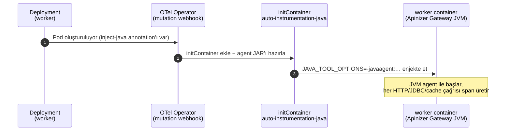
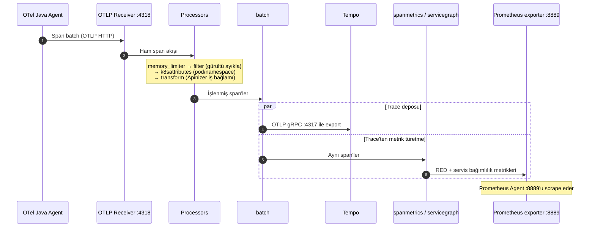

import {Card, CardGroup} from '@site/src/components/Card';
import {Steps, Step} from '@site/src/components/Steps';
import {Accordion, AccordionGroup} from '@site/src/components/Accordion';
import {Frame} from '@site/src/components/Frame';

:::info Seri Hakkında
Bu yazı, Apinizer API Gateway ve OpenTelemetry üzerine dört bölümlük serinin ilk bölümü. Bu bölümde entegrasyonun mimarisini, kurulumunu ve doğrulamasını birlikte ele alacağız.

1. **OpenTelemetry Apinizer API Gateway entegrasyonu:** mimari, kurulum, doğrulama (bu bölüm)
2. **Grafana'da üç dashboard:** APM/RED, Collector Health, Tempo Ops
3. **SLI/SLO tanımları:** error budget ve alert
4. **Service graph:** trace/metric/log korelasyonu
:::

## Neden Observability, Neden OpenTelemetry?

Şu senaryo tanıdık gelecektir: bir alert düşüyor, p95 gecikme 800 ms'ye fırlamış. Dashboard'a bakıyorsunuz; evet, yavaşlama var. Ama *nerede*? Upstream mi yavaşladı, cache mi ıskalıyor, yoksa sorun gateway'in kendisinde mi? Klasik monitoring bu soruya cevap veremiyor, çünkü yalnızca metrik topluyor: "saniyede kaç istek", "hata oranı yüzde kaç", "p95 kaç ms". Bu veriler bir sorunun olduğunu söylüyor ama nerede olduğunu söylemiyor.

API Gateway, trafiğin geçtiği en kritik nokta: her istek buradan geçiyor, her yavaşlama ve her hata önce burada görünür oluyor. OpenTelemetry (OTel) tam da bu boşluğu distributed tracing ile kapatıyor. CNCF çatısı altındaki bu vendor-neutral observability standardı, tek bir standartla üç sinyali (trace, metrik, log) topluyor ve istediğiniz backend'e taşıyor.

<CardGroup cols={2}>
  <Card title="Kod değiştirmeden enstrümantasyon" icon="magic">
    OpenTelemetry Operator, gateway pod'una bir Java agent enjekte eder. Gelen istekler, upstream çağrıları, cache erişimleri ve veritabanı sorgularının tümü, tek satır kod yazılmadan otomatik olarak span'e dönüşür.
  </Card>
  <Card title="Vendor bağımsızlık" icon="unlock">
    Telemetri verisi tek bir ürüne kilitlenmez. Bugün Tempo + Prometheus kullanır, yarın farklı bir backend'e geçersiniz; agent ve Collector katmanı aynı kalır.
  </Card>
  <Card title="CNCF standardı (OTLP)" icon="certificate">
    OTLP protokolü, W3C Trace Context propagation'ı ve semantic convention'lar endüstri genelinde kabul görür. Ekipler arası ortak bir observability dili sağlar.
  </Card>
  <Card title="Trace'ten metriğe köprü" icon="exchange-alt">
    Collector, trace verisinden RED metriklerini (Rate, Errors, Duration) ve service graph'ı üretir; ayrı bir APM aracına duyulan ihtiyacı azaltır.
  </Card>
</CardGroup>

:::note Apinizer'ın native metrikleri ile OpenTelemetry birbirini tamamlıyor
Apinizer gateway'i `:9091` portunda kendi iş metriklerini (istek sayısı, hata oranı, API proxy etiketleri) yayınlamaya devam ediyor. OpenTelemetry ise bir isteğin içindeki adımları (upstream çağrısı, cache erişimi, DB sorgusu) span düzeyinde görünür kılıyor. Bu entegrasyonda Collector her iki kaynağı da topluyor; ikisi birbirinin yerine değil, tamamlayıcısı olarak çalışıyor.
:::

## Trace Nedir, Neden Bu Kadar Önemli?

Metrik "ne kadar?" sorusuna cevap verir. Trace ise "neden yavaş?" ve "hangi adımda kırıldı?" sorularına. Bir trace, tek bir isteğin sistem içindeki yolculuğunun tam kaydı; bu yolculuktaki her adım da bir span.

| Kavram | Anlamı | Örnek |
| --- | --- | --- |
| **Trace** | Tek bir isteğin uçtan uca kaydı | Bir API çağrısının gateway → cache → upstream yolculuğu |
| **Span** | Trace içindeki tek bir adım | `GET /orders` için SERVER span'i, upstream'e giden CLIENT span'i |
| **Trace ID** | Tüm span'leri birleştiren kimlik | `traceparent` header'ındaki 32 karakterlik değer |
| **Context propagation** | Trace ID'nin adımlar arası taşınması | Gateway'den upstream'e giden `traceparent` header'ı |
| **Attribute** | Span'e eklenen anahtar-değer | `apinizer.correlation_id`, `http.status_code`, `peer.service` |

Trace olmadan elimizde sadece "p95 gecikme 800 ms" bilgisi var. Trace ile bu 800 ms'nin nereye gittiğini tek ekranda görüyoruz: 650 ms upstream'e, 100 ms cache miss'e, 50 ms gateway pipeline'ına. Bu ayrıştırma, root cause analysis (RCA) süresini saatlerden dakikalara indiriyor.

<Frame caption="Tek bir isteğin span dökümü: 800 ms'lik gecikmenin waterfall üzerindeki dağılımı">
  
</Frame>

Yukarıdaki tüm span'ler aynı Trace ID altında birleşiyor; toplam gecikmenin dağılımını tek bir waterfall üzerinde bu sayede görebiliyoruz.

## OpenTelemetry Aslında Nasıl Çalışıyor?

OpenTelemetry'yi, sorumlulukları net ayrılmış üç katman olarak düşünebiliriz. Bu ayrım "veriyi üreten" ile "veriyi depolayan" tarafları birbirinden bağımsız kılıyor; asıl vendor bağımsızlığını sağlayan da bu.

<Frame caption="OpenTelemetry'nin üç katmanı: enstrümantasyon, toplama/işleme ve depolama/görselleştirme">
  
</Frame>

OpenTelemetry üç sinyal üretiyor:

- **Traces:** isteğin yolculuğu (bu yazının odağı)
- **Metrics:** zaman serisi sayısal veriler (RED, JVM, Apinizer native metrikleri)
- **Logs:** yapılandırılmış log kayıtları (bu kurulumda devre dışı; ayrı bir log backend'i kullanmıyoruz)

Bu sinyaller OTLP (OpenTelemetry Protocol) ile taşınıyor. Standart portlar: HTTP için `:4318`, gRPC için `:4317`.

Collector ise mimarinin kalbi ve dört tip bileşenden oluşan bir pipeline:

| Bileşen | Görevi |
| --- | --- |
| **Receiver** | Veriyi içeri alır (OTLP ile gelen span'ler, scrape edilen Prometheus metrikleri) |
| **Processor** | Veriyi dönüştürür (gürültü ayıklama, k8s etiketleri ekleme, iş bağlamı zenginleştirme, batch'leme) |
| **Connector** | Bir sinyalden başka bir sinyal üretir (trace'ten metrik: `spanmetrics`, `servicegraph`) |
| **Exporter** | Veriyi dışarı yazar (Tempo'ya trace, `:8889` portunda Prometheus metrikleri) |

## Büyük Resim: Apinizer Entegrasyon Mimarisi

Aşağıdaki diyagram, bir API isteğinin gateway'den girip Tempo ve merkezi Prometheus'a ulaşana kadar izlediği yolun tamamını gösteriyor. Gateway'in çalıştığı namespace ortamdan ortama değişebilir; diyagramda ve komutlarda bunu `<worker-namespace>` olarak göstereceğiz.

<Frame caption="Apinizer OpenTelemetry entegrasyon mimarisi: trace ve metrik pipeline'ları">
  
</Frame>

Veri iki ayrı pipeline üzerinden ilerliyor ve Grafana'da buluşuyor:

- **Trace pipeline'ı:** Gateway → Java agent → OTLP → Collector → Tempo → Grafana (Explore)
- **Metrik pipeline'ı:** Gateway native `:9091` ve trace'ten türetilen metrikler → Collector `:8889` → Prometheus Agent (scrape) → `remote_write` → Merkezi Prometheus → Grafana

### Kim Ne İş Yapıyor?

| Bileşen | Namespace | Görevi |
| --- | --- | --- |
| **OTel Operator** | `monitoring` | Instrumentation CR'ı okur, gateway deployment'ına Java agent init container'ı enjekte eder |
| **OTel Java Agent** | `<worker-namespace>` (worker pod) | Gateway kodunu değiştirmeden HTTP/JDBC/cache çağrılarını span'e dönüştürür |
| **OTel Collector** | `monitoring` | Span'leri işleyip Tempo'ya yazar; trace'ten RED/service graph metriği üretir; native `:9091` metriklerini toplar; hepsini `:8889`'da yayınlar |
| **Tempo** | `monitoring` | Trace deposu (WAL + bloklar); Grafana Explore'un trace kaynağı |
| **Prometheus Agent** | `monitoring` | Collector `:8889`'u scrape eder, `remote_write` ile merkezi Prometheus'a iletir (yerelde TSDB tutmaz) |
| **Central Prometheus** | Merkezi/uzak | Metrik TSDB; `remote_write` alıcısı; Grafana'nın metrik kaynağı |
| **Grafana** | Merkezi/uzak | Trace (Tempo) ve metrik (Prometheus) görselleştirme |

### Agent, Gateway Pod'una Nasıl Giriyor?

İşin güzel tarafı şu: OpenTelemetry Operator, gateway'in yanına ayrı bir sidecar container bile eklemiyor. Bunun yerine, pod başlamadan önce çalışan bir init container enjekte ediyor. Bu init container agent JAR'ını paylaşımlı bir volume'a yazıyor ve worker container'ına gerekli JVM ayarlarını geçiriyor.



Peki tüm bu mekanizmayı tetikleyen ne? Deployment'ın pod template'ine eklenen tek bir annotation:

```yaml
metadata:
  annotations:
    instrumentation.opentelemetry.io/inject-java: "apinizer-instr"
```

:::warning
Annotation mutlaka `spec.template.metadata.annotations` altında olmalı. Deployment'ın en üst `metadata` alanına yazılırsa webhook pod'u mutasyona uğratmaz ve agent enjekte edilmez.
:::

### Bir Span, Collector'ın İçinde Neler Yaşıyor?

Gateway'den çıkan her span, Collector'ın traces pipeline'ından geçiyor. Aşağıdaki diyagram, tek bir span'in receiver'dan Tempo'ya ve türev metriklere kadar olan yolculuğunu gösteriyor.



Traces pipeline'ındaki her processor'ın bir rolü var:

| Processor | Ne yapar? | Apinizer'da neden gerekli? |
| --- | --- | --- |
| `memory_limiter` | Collector belleğini korur, OOM'u önler | Yük altında gateway saniyede binlerce span üretebilir |
| `filter/drop_mongo_polling` | MongoDB polling ve management endpoint span'lerini eler | Gürültüyü azaltır; gerçek API trafiğine odaklanırsınız |
| `k8sattributes` | Pod, namespace, node, deployment etiketleri ekler | Hangi pod'un yavaş olduğunu trace'ten görürsünüz |
| `resourcedetection` | Host/OS bilgisi ekler | Ortam bazlı filtreleme |
| `transform/apinizer-traces` | Apinizer iş bağlamını span attribute'larına yazar | Correlation ID, API proxy adı, upstream adresi |
| `batch` | Span'leri gruplayıp toplu gönderir | Ağ maliyetini azaltır, Tempo'ya verimli yazım sağlar |

Connector'lar ise span'leri dışarı aktarmadan aynı Collector içinde metrik üretiyor:

- **`spanmetrics`:** her span'den istek sayısı, hata sayısı ve süre histogramı (RED metrikleri) türetir.
- **`servicegraph`:** CLIENT→SERVER span ilişkilerinden servis bağımlılık metrikleri üretir; Grafana Service Graph bunları kullanır.

## Başlamadan Önce

Kuruluma geçmeden elimizde şunların olması gerekiyor:

<CardGroup cols={2}>
  <Card title="Kubernetes cluster" icon="server">
    `kubectl` ve `helm`'i yönetici erişimiyle kullanabildiğiniz bir cluster.
  </Card>
  <Card title="Apinizer Gateway" icon="network-wired">
    Bir namespace'te çalışan gateway (worker) deployment'ı.
  </Card>
  <Card title="Merkezi Prometheus & Grafana" icon="chart-line">
    `remote_write` alıcısı açık bir merkezi Prometheus ve ona bağlı bir Grafana.
  </Card>
  <Card title="Depolama" icon="database">
    Tempo için statik PV/PVC veya bir StorageClass.
  </Card>
</CardGroup>

:::tip Namespace isimlendirmesi
Observability bileşenlerini `monitoring` namespace'ine kuruyoruz. Gateway ise kendi namespace'inde çalışıyor; komutlarda bunu `<worker-namespace>` olarak göstereceğiz. Uygularken bu değeri kendi gateway namespace'inizle değiştirmeyi unutmayın.
:::

## Kuruluma Geçelim

Buraya kadar mimariyi konuştuk; şimdi elimizi kirletme zamanı. Yedi adımda tüm zinciri ayağa kaldırıyoruz.

<Steps>
  <Step title="Önce monitoring namespace'i">

```bash
kubectl create namespace monitoring
```

  </Step>
  <Step title="OpenTelemetry Operator (Helm ile)">

Cluster'da cert-manager yoksa dert değil; webhook sertifikasını Helm'in kendisine ürettirebiliyoruz:

```bash
helm repo add open-telemetry https://open-telemetry.github.io/opentelemetry-helm-charts
helm repo update

helm install opentelemetry-operator open-telemetry/opentelemetry-operator \
  --namespace monitoring \
  --set admissionWebhooks.certManager.enabled=false \
  --set admissionWebhooks.autoGenerateCert.enabled=true \
  --set admissionWebhooks.autoGenerateCert.recreate=true
```

Operator pod'u `Running` olana ve CRD'ler gelene kadar bekleyelim:

```bash
kubectl get pods -n monitoring -l app.kubernetes.io/name=opentelemetry-operator
kubectl get crd | grep opentelemetry
```

  </Step>
  <Step title="Sıra Tempo'da">

Tempo, trace'leri kalıcı bir diskte saklıyor. Aşağıdaki manifest statik PV/PVC kullanıyor ve `hostPath` izin sorununu (yazının sonundaki sorunlar kısmında detayı var) bir initContainer ile baştan çözüyor.

<Accordion title="tempo.yaml (tam manifest)">

```yaml
apiVersion: v1
kind: PersistentVolume
metadata:
  name: tempo-pv
spec:
  capacity:
    storage: 5Gi
  accessModes: [ReadWriteOnce]
  persistentVolumeReclaimPolicy: Retain
  storageClassName: ""
  hostPath:
    path: /data/tempo
---
apiVersion: v1
kind: PersistentVolumeClaim
metadata:
  name: tempo-pvc
  namespace: monitoring
spec:
  accessModes: [ReadWriteOnce]
  storageClassName: ""
  resources:
    requests:
      storage: 5Gi
  volumeName: tempo-pv
---
apiVersion: v1
kind: ConfigMap
metadata:
  name: tempo-config
  namespace: monitoring
data:
  tempo.yaml: |
    server:
      http_listen_port: 3200
      grpc_listen_port: 9095
    distributor:
      receivers:
        otlp:
          protocols:
            grpc:
              endpoint: 0.0.0.0:4317
            http:
              endpoint: 0.0.0.0:4318
    ingester:
      max_block_duration: 5m
    compactor:
      compaction:
        block_retention: 48h
    storage:
      trace:
        backend: local
        wal:
          path: /var/tempo/wal
        local:
          path: /var/tempo/blocks
    usage_report:
      reporting_enabled: false
---
apiVersion: apps/v1
kind: Deployment
metadata:
  name: tempo
  namespace: monitoring
  labels: { app: tempo }
spec:
  replicas: 1
  strategy:
    type: Recreate
  selector:
    matchLabels: { app: tempo }
  template:
    metadata:
      labels: { app: tempo }
    spec:
      securityContext:
        fsGroup: 10001
        runAsUser: 10001
        runAsGroup: 10001
      initContainers:
        - name: init-chown
          image: busybox:1.36
          command:
            - sh
            - -c
            - mkdir -p /var/tempo/wal /var/tempo/blocks && chown -R 10001:10001 /var/tempo
          securityContext:
            runAsUser: 0
          volumeMounts:
            - { name: storage, mountPath: /var/tempo }
      containers:
        - name: tempo
          image: grafana/tempo:2.7.1
          args: ["-config.file=/etc/tempo/tempo.yaml"]
          ports:
            - { containerPort: 3200, name: http }
            - { containerPort: 4317, name: otlp-grpc }
            - { containerPort: 4318, name: otlp-http }
          volumeMounts:
            - { name: config, mountPath: /etc/tempo }
            - { name: storage, mountPath: /var/tempo }
      volumes:
        - name: config
          configMap: { name: tempo-config }
        - name: storage
          persistentVolumeClaim:
            claimName: tempo-pvc
---
apiVersion: v1
kind: Service
metadata:
  name: tempo
  namespace: monitoring
  labels: { app: tempo }
spec:
  selector: { app: tempo }
  ports:
    - { name: http, port: 3200, targetPort: 3200 }
    - { name: otlp-grpc, port: 4317, targetPort: 4317 }
    - { name: otlp-http, port: 4318, targetPort: 4318 }
```

</Accordion>

```bash
kubectl apply -f tempo.yaml
kubectl get pvc -n monitoring
kubectl get pods -n monitoring -l app=tempo
```

  </Step>
  <Step title="Mimarinin kalbi: OpenTelemetry Collector">

Collector, bu kurulumun en çok iş yapan parçası: gateway'den gelen span'leri işliyor, iş bağlamı ekliyor, trace'leri Tempo'ya yazıyor, span'lerden RED/service graph metrikleri üretiyor ve gateway native `:9091` metriklerini toplayıp hepsini Prometheus için `:8889` portunda yayınlıyor.

<Accordion title="otel-collector.yaml (tam manifest)">

```yaml
apiVersion: opentelemetry.io/v1beta1
kind: OpenTelemetryCollector
metadata:
  name: otel
  namespace: monitoring
spec:
  image: ghcr.io/open-telemetry/opentelemetry-collector-releases/opentelemetry-collector-contrib:0.153.0
  mode: deployment
  replicas: 1
  config:
    connectors:
      servicegraph:
        dimensions: [server.address, http.request.method]
        latency_histogram_buckets: [10ms, 50ms, 100ms, 250ms, 1s, 5s]
      spanmetrics:
        dimensions:
          - name: apinizer.apiproxy.name
          - name: server.address
          - name: peer.service
          - name: apinizer.span.role
          - name: http.request.method
        exemplars: { enabled: true }
        histogram:
          explicit:
            buckets: [10ms, 25ms, 50ms, 100ms, 250ms, 500ms, 1s, 2s, 5s]
        metrics_flush_interval: 15s
        namespace: apinizer.trace
    receivers:
      otlp:
        protocols:
          grpc: { endpoint: 0.0.0.0:4317 }
          http: { endpoint: 0.0.0.0:4318 }
      prometheus/apinizer-native:
        config:
          scrape_configs:
            - job_name: apinizer-worker-native
              scrape_interval: 15s
              kubernetes_sd_configs:
                - role: pod
                  namespaces:
                    names: [<worker-namespace>]
              relabel_configs:
                - action: keep
                  regex: "9091"
                  source_labels: [__meta_kubernetes_pod_container_port_number]
                - source_labels: [__meta_kubernetes_namespace]
                  target_label: k8s_namespace
                - source_labels: [__meta_kubernetes_pod_name]
                  target_label: k8s_pod
    processors:
      batch: { send_batch_size: 1024, timeout: 5s }
      memory_limiter: { check_interval: 1s, limit_percentage: 80, spike_limit_percentage: 25 }
      resourcedetection: { detectors: [env, system], timeout: 5s }
      k8sattributes:
        auth_type: serviceAccount
        extract:
          metadata: [k8s.namespace.name, k8s.pod.name, k8s.node.name, k8s.deployment.name]
      filter/drop_mongo_polling:
        error_mode: ignore
        traces:
          span:
            - IsRootSpan() and (attributes["db.system"] == "mongodb" or attributes["db.system.name"] == "mongodb")
            - IsMatch(attributes["http.route"], "^/apinizer/management")
      transform/apinizer-traces:
        error_mode: ignore
        trace_statements:
          - context: span
            statements:
              - set(attributes["apinizer.correlation_id"], attributes["http.response.header.apinizer-correlation-id"][0]) where attributes["http.response.header.apinizer-correlation-id"] != nil
              - set(attributes["apinizer.correlation_id"], attributes["http.request.header.apinizer-correlation-id"][0]) where attributes["apinizer.correlation_id"] == nil and attributes["http.request.header.apinizer-correlation-id"] != nil
              - set(attributes["apinizer.correlation_id"], attributes["http.response.header.apinizer_correlation_id"][0]) where attributes["apinizer.correlation_id"] == nil and attributes["http.response.header.apinizer_correlation_id"] != nil
              - set(attributes["apinizer.apiproxy.name"], attributes["http.response.header.x-apinizer-apiproxy-name"][0]) where attributes["http.response.header.x-apinizer-apiproxy-name"] != nil
              - set(attributes["apinizer.apiproxy.path"], attributes["url.path"]) where attributes["url.path"] != nil
              - set(attributes["apinizer.routing.address"], attributes["url.full"]) where kind == SPAN_KIND_CLIENT and attributes["url.full"] != nil
              - set(attributes["peer.service"], attributes["server.address"]) where kind == SPAN_KIND_CLIENT and attributes["server.address"] != nil
              - set(attributes["apinizer.span.role"], "elasticsearch-logging") where kind == SPAN_KIND_CLIENT and IsMatch(attributes["server.address"], ".*(elastic|9200).*")
              - set(attributes["apinizer.span.role"], "upstream-routing") where kind == SPAN_KIND_CLIENT and attributes["apinizer.span.role"] == nil
    exporters:
      debug: { verbosity: basic }
      otlp/tempo:
        endpoint: tempo.monitoring.svc.cluster.local:4317
        tls: { insecure: true }
      prometheus:
        enable_open_metrics: true
        endpoint: 0.0.0.0:8889
        resource_to_telemetry_conversion: { enabled: true }
    service:
      telemetry:
        logs: { level: info }
        metrics:
          readers:
            - pull:
                exporter:
                  prometheus: { host: 0.0.0.0, port: 8888 }
      pipelines:
        traces:
          receivers: [otlp]
          processors: [memory_limiter, filter/drop_mongo_polling, k8sattributes, resourcedetection, transform/apinizer-traces, batch]
          exporters: [otlp/tempo, spanmetrics, servicegraph]
        metrics:
          receivers: [otlp, prometheus/apinizer-native, spanmetrics, servicegraph]
          processors: [memory_limiter, batch]
          exporters: [prometheus]
```

</Accordion>

:::note
Manifest'teki `prometheus/apinizer-native` receiver'ının `namespaces.names` alanına gateway'inizin namespace'ini (`<worker-namespace>`) yazmayı unutmayın. Operator bu manifest'ten `otel-collector` adında bir servis üretiyor; agent ve Prometheus Agent bu servise bağlanacak.
:::

```bash
kubectl apply -f otel-collector.yaml
kubectl get pods -n monitoring -l app.kubernetes.io/name=otel-collector
```

  </Step>
  <Step title="Instrumentation CR'ı">

Bu kaynak, agent'a telemetriyi nereye göndereceğini söylüyor. OTLP HTTP portu `4318` kullanıyoruz ve log sinyalini kapatıyoruz (log deposu yoksa gereksiz 404 gürültüsünü baştan önlemiş oluyoruz). CR'ı gateway'in çalıştığı namespace'te oluşturuyoruz.

```yaml
# instrumentation.yaml
apiVersion: opentelemetry.io/v1alpha1
kind: Instrumentation
metadata:
  name: apinizer-instr
  namespace: <worker-namespace>
spec:
  exporter:
    endpoint: http://otel-collector.monitoring.svc.cluster.local:4318
  propagators: [tracecontext, baggage]
  sampler:
    type: parentbased_traceidratio
    argument: "1"
  env:
    - name: OTEL_LOGS_EXPORTER
      value: "none"
```

```bash
kubectl apply -f instrumentation.yaml
kubectl get instrumentation -n <worker-namespace>
```

:::warning traceparent header'ı backend'e giden isteklere de ekleniyor
Agent devreye girdikten sonra gateway'in yaptığı giden çağrılarda şuna benzer bir header görürsünüz:

```text
traceparent: 00-062ad6a79d1b48e4372ac9a5c042e8e7-c3feb0b529b5ed40-03
```

Bu, Instrumentation CR'ındaki `propagators: [tracecontext, baggage]` ayarının sonucu ve W3C Trace Context standardının kendisi. Amacı context propagation: trace ID'yi upstream'e taşımak, böylece backend de enstrümante ise oradaki span'ler gateway'in trace'iyle aynı kayıt altında birleşiyor. Formatı `version-traceId-parentSpanId-flags` şeklinde okunur; son kısım sampling gibi flag'leri taşır.

Backend enstrümante değilse header zararsızdır ve genellikle yok sayılır. Yine de dikkat: katı header validasyonu yapan servisler, header whitelist'i uygulayan WAF/proxy'ler veya header'ları imza hesabına katan legacy servisler bu beklenmedik header yüzünden isteği reddedebilir. Böyle bir durumla karşılaşırsanız `propagators` listesini daraltabilir ya da sorunlu backend'e giden isteklerde header'ı gateway tarafında bir politika ile kaldırabilirsiniz.
:::

  </Step>
  <Step title="Gateway'e injection annotation'ı">

Agent enjeksiyonunu tetiklemek için tek gereken, deployment'ın pod template'ine annotation'ı eklemek:

```bash
kubectl patch deployment worker -n <worker-namespace> --type merge -p \
'{"spec":{"template":{"metadata":{"annotations":{"instrumentation.opentelemetry.io/inject-java":"apinizer-instr"}}}}}'

kubectl rollout status deployment worker -n <worker-namespace>
```

:::warning
Annotation mutlaka `spec.template.metadata.annotations` altında olmalı; deployment'ın en üst `metadata` alanına eklenirse enjeksiyon gerçekleşmez.
:::

  </Step>
  <Step title="Son halka: Prometheus Agent (ServiceMonitor ile)">

Gateway metriklerini yerelde depolamadan merkezi Prometheus'a iletmek için Prometheus'u agent modunda çalıştırıyoruz. Hedef keşfini `scrape_configs` yerine declarative bir `ServiceMonitor` ile yapıyoruz; bu, Prometheus Operator'ün CRD'lerini gerektiriyor. Cluster'ınızda `kube-prometheus-stack` kuruluysa bu CRD'ler zaten mevcut; değilse Prometheus Operator'ü ayrıca kurmanız gerekiyor.

Önce agent için servis hesabı ve RBAC:

<Accordion title="prometheus-agent-rbac.yaml">

```yaml
apiVersion: v1
kind: ServiceAccount
metadata:
  name: prometheus-agent
  namespace: monitoring
---
apiVersion: rbac.authorization.k8s.io/v1
kind: ClusterRole
metadata:
  name: prometheus-agent
rules:
  - apiGroups: [""]
    resources: [nodes, nodes/metrics, services, endpoints, pods]
    verbs: [get, list, watch]
  - nonResourceURLs: ["/metrics"]
    verbs: [get]
---
apiVersion: rbac.authorization.k8s.io/v1
kind: ClusterRoleBinding
metadata:
  name: prometheus-agent
roleRef:
  apiGroup: rbac.authorization.k8s.io
  kind: ClusterRole
  name: prometheus-agent
subjects:
  - kind: ServiceAccount
    name: prometheus-agent
    namespace: monitoring
```

</Accordion>

Ardından PrometheusAgent CR'ı ve Collector'ı keşfeden ServiceMonitor:

```yaml
# prometheus-agent.yaml
apiVersion: monitoring.coreos.com/v1alpha1
kind: PrometheusAgent
metadata:
  name: gateway-agent
  namespace: monitoring
spec:
  replicas: 1
  serviceAccountName: prometheus-agent
  externalLabels:
    cluster: apinizer-gw          # merkezi Prometheus'ta bu cluster'ı ayırt etmek için
  serviceMonitorSelector:
    matchLabels:
      release: gateway-agent      # aşağıdaki ServiceMonitor bu etiketle eşleşir
  remoteWrite:
    - url: http://<merkezi-prometheus-host>:9090/api/v1/write
      # gerekiyorsa:
      # basicAuth: { username: {...}, password: {...} }
---
apiVersion: monitoring.coreos.com/v1
kind: ServiceMonitor
metadata:
  name: otel-collector
  namespace: monitoring
  labels:
    release: gateway-agent
spec:
  namespaceSelector:
    matchNames: [monitoring]
  selector:
    matchLabels:
      app.kubernetes.io/name: otel-collector   # collector servisinin etiketi
  endpoints:
    - port: prometheus            # Collector'ın :8889 portunun adı
      interval: 15s
```

```bash
kubectl apply -f prometheus-agent-rbac.yaml
kubectl apply -f prometheus-agent.yaml
kubectl get pods -n monitoring -l app.kubernetes.io/name=prometheus-agent
```

:::warning Merkezi Prometheus'ta remote-write receiver açık olmalı
Prometheus varsayılan olarak `remote_write` kabul etmez. Merkezi Prometheus `--web.enable-remote-write-receiver` bayrağıyla başlatılmazsa agent her gönderimde `404` alır. Detayı aşağıda, karşılaştığımız sorunlar kısmında anlatıyoruz.
:::

:::tip ServiceMonitor hedefini kontrol etmekte fayda var
`spec.selector.matchLabels` ve `endpoints.port`, Collector servisinin gerçek etiketleriyle ve port adıyla eşleşmeli. Kontrol için: `kubectl get svc -n monitoring --show-labels` ve `kubectl get svc otel-collector -n monitoring -o yaml` çıktısındaki `:8889` port adına bakabilirsiniz.
:::

  </Step>
</Steps>

## Her Şey Gerçekten Çalışıyor mu?

Kurulum bitti ama işimiz henüz bitmedi; zinciri dört noktadan test ediyoruz: agent enjeksiyonu, export sağlığı, Tempo'da trace ve merkezi Prometheus'a metrik akışı.

### 1. Agent gerçekten enjekte edildi mi?

```bash
# initContainer görünmeli (opentelemetry-auto-instrumentation-java)
kubectl describe pod -n <worker-namespace> -l app=worker | grep -A3 -i "init container"

# worker container env'inde agent ayarları olmalı
kubectl exec -n <worker-namespace> deploy/worker -c worker -- env | grep -i -E "otel_exporter|java_tool"
```

Beklediğimiz çıktı şuna benziyor:

```text
JAVA_TOOL_OPTIONS=-javaagent:/otel-auto-instrumentation-java/agent.jar
OTEL_EXPORTER_OTLP_ENDPOINT=http://otel-collector.monitoring.svc.cluster.local:4318
OTEL_LOGS_EXPORTER=none
```

### 2. Export'lar sağlıklı mı?

```bash
kubectl logs -n <worker-namespace> deploy/worker -c worker | grep -i -E "otel.javaagent|Failed to export"
```

Log'da `opentelemetry-javaagent` banner'ı görünmeli; `Failed to export spans` veya `Failed to export logs ... 404` satırları ise görünmemeli.

### 3. Tempo'da trace'ler geliyor mu?

Gateway üzerinden birkaç istek gönderelim, ardından Grafana'da Explore → Tempo ekranını açalım:

```
{resource.service.name="worker"}
```

Her satır, bir isteğin uçtan uca trace kaydı. Bir satıra tıkladığımızda span'ler waterfall olarak açılıyor; her span bir iş adımını temsil ediyor:

| Span türü | Ne gösterir? |
| --- | --- |
| **SERVER** span | Gateway'in isteği alıp işlemesi (politika, routing pipeline) |
| **CLIENT** span | Gateway'in upstream, cache veya Elasticsearch'e yaptığı giden çağrı |
| **INTERNAL** span | JVM içi işlemler (serialization, thread pool) |

### 4. Metrikler merkezi Prometheus'a ulaşıyor mu?

Prometheus Agent'ın metrikleri gerçekten uzağa ilettiğini iki noktadan doğruluyoruz.

**a) Agent tarafında `remote_write` sağlığı:** Agent'ın kendi `/metrics` endpoint'indeki `remote_storage` sayaçlarına bakalım:

```bash
kubectl port-forward -n monitoring pod/prometheus-gateway-agent-0 9090:9090
# başka bir terminalde:
curl -s localhost:9090/metrics | grep -E "prometheus_remote_storage_(samples_failed_total|sent_batch_duration_seconds_count|queue_highest_sent_timestamp_seconds)"
```

Sağlıklı bir çıktıda:

- `prometheus_remote_storage_sent_batch_duration_seconds_count` artıyor olmalı (gönderim sürüyor),
- `prometheus_remote_storage_samples_failed_total` sabit kalmalı (artmayan sayaç = kalıcı reddetme yok),
- `queue_highest_sent_timestamp_seconds` güncel zamana yakın olmalı (lag yok).

**b) Merkezi Prometheus tarafında kesin teyit:** `externalLabels` ile eklediğimiz `cluster` etiketiyle sorgulayalım:

```promql
up{cluster="apinizer-gw"}
count by (job) ({cluster="apinizer-gw"})
traces_service_graph_request_total{cluster="apinizer-gw"}
```

`up{cluster="apinizer-gw"} == 1` dönüyor ve `traces_service_graph_*` metrikleri geliyorsa, gateway metrikleri merkezi Prometheus'a ulaşıyor demektir; entegrasyon uçtan uca çalışıyor.

:::note Geldiğimiz nokta
Bu kurulumun sonunda: gateway kod değişikliği olmadan enstrümante oldu, her API isteğinin trace'i Tempo'da görünüyor, gateway metrikleri Prometheus Agent ile toplanıp `remote_write` üzerinden merkezi Prometheus'a yazılıyor. `samples_failed_total`'ın sabit kalması ve merkezi Prometheus'ta `up{cluster="apinizer-gw"} == 1` dönmesi, metrik akışının sağlıklı olduğunun kesin kanıtı.
:::

## Collector Konfigürasyonuna Yakından Bakalım

Manifest'teki `service.pipelines` bloğu, mimari diyagramdaki Collector iç yapısını YAML'a döküyor:

```yaml
pipelines:
  traces:
    receivers: [otlp]
    processors: [memory_limiter, filter/drop_mongo_polling, k8sattributes, resourcedetection, transform/apinizer-traces, batch]
    exporters: [otlp/tempo, spanmetrics, servicegraph]
  metrics:
    receivers: [otlp, prometheus/apinizer-native, spanmetrics, servicegraph]
    processors: [memory_limiter, batch]
    exporters: [prometheus]
```

Traces pipeline yalnızca span akışını yönetiyor. `spanmetrics` ve `servicegraph` burada exporter gibi görünse de aslında birer connector: span'leri dışarı aktarmadan metrik üretip metrics pipeline'a besliyorlar.

Metrics pipeline ise dört kaynaktan besleniyor:

| Kaynak | Ne sağlar? |
| --- | --- |
| `prometheus/apinizer-native` | Gateway'in `:9091` portundaki native Apinizer metrikleri |
| `spanmetrics` (connector) | Trace'lerden türetilen RED metrikleri |
| `servicegraph` (connector) | Servis bağımlılık metrikleri |
| `otlp` | Agent'tan gelen doğrudan metrikler (varsa) |

Tüm metrikler `prometheus` exporter ile `:8889` portunda yayınlanıyor; Prometheus Agent bu portu ServiceMonitor üzerinden scrape ediyor.

### Span'lere İş Bağlamı Katan Transform'lar

`transform/apinizer-traces` processor'ı, ham span'lere Apinizer'a özgü anlam katıyor. Böylece trace araması, dashboard'lar ve service graph iş anlamlı hale geliyor:

<AccordionGroup>
  <Accordion title="Correlation ID nasıl belirleniyor?">
    İlk üç ifade, bir `apinizer.correlation_id` değerini öncelik sırasıyla oluşturur: önce response header, yoksa request header, yoksa alt çizgili header varyantı. Böylece bir isteği iş kimliğiyle bulabilirsiniz.
  </Accordion>
  <Accordion title="API proxy adı ve yolu">
    `apinizer.apiproxy.name` özel bir response header'dan, `apinizer.apiproxy.path` ise istek yolundan türetilir. Bu sayede metrikleri ve trace'leri API proxy bazında kırabilirsiniz.
  </Accordion>
  <Accordion title="Upstream adresi ve peer service">
    Giden (CLIENT) span'lerde `apinizer.routing.address` tam hedef adresi, `peer.service` ise downstream servis düğümünü işaretler. `peer.service`, service graph ve span metriklerinde bağımlılık düğümü olarak kullanılır.
  </Accordion>
  <Accordion title="Span rolü (log mu, routing mi?)">
    Elasticsearch'e giden çağrılar `elasticsearch-logging`, kalan tüm CLIENT çağrılar `upstream-routing` olarak etiketlenir. Böylece log yazma trafiğini gerçek backend trafiğinden ayırabilirsiniz.
  </Accordion>
</AccordionGroup>

## Yolda Karşılaştığımız Sorunlar (ve Çözümleri)

Bu entegrasyonu kurarken dört klasik tuzağa denk geldik; siz de büyük ihtimalle en az birine denk geleceksiniz. Buraya not ediyoruz:

<AccordionGroup>
  <Accordion title="Span üretiliyor ama Tempo'da görünmüyor (OTLP port/protokol)">
    OpenTelemetry Java agent'ının varsayılan OTLP protokolü http/protobuf'tur ve HTTP portu 4318'i bekler. Endpoint'i gRPC portu 4317'ye verirseniz agent bağlanır ama her export başarısız olur ve log'da `port is likely incorrect for protocol version "http/protobuf"` uyarısı görürsünüz. Çözüm: Instrumentation CR'ında endpoint'i 4318 olarak verin (ya da protokolü gRPC'ye ayarlayıp 4317'de bırakın).
  </Accordion>
  <Accordion title="Loglar için sürekli HTTP 404 uyarıları">
    Agent varsayılan olarak log sinyalini de gönderir. Collector'da bir `logs` pipeline'ı yoksa `/v1/logs` isteği 404 döner ve log akışında sürekli `Failed to export logs ... 404 Not Found` uyarısı oluşur. Trace ve metrikler bundan etkilenmez. Log deposu kullanmıyorsanız Instrumentation CR'ına `OTEL_LOGS_EXPORTER=none` ekleyerek bu gürültüden kurtulursunuz.
  </Accordion>
  <Accordion title="Tempo başlamıyor: mkdir /var/tempo/blocks permission denied">
    `grafana/tempo` imajı root olmayan bir kullanıcıyla (uid 10001) çalışır. `hostPath` volume'larda kubelet, `fsGroup`'a göre otomatik sahiplik ataması yapmaz; dolayısıyla node'daki dizin root'a aitse Tempo yazamaz. Çözüm: dizini root olarak `chown` eden bir initContainer eklemek (yukarıdaki manifest'te hazır geliyor) veya node üzerinde `chown -R 10001:10001 /data/tempo` çalıştırmak.
  </Accordion>
  <Accordion title="remote_write başarısız: 404 remote write receiver needs to be enabled">
    Agent loglarında şu satırı görürsünüz: `server returned HTTP status 404 Not Found: remote write receiver needs to be enabled with --web.enable-remote-write-receiver`. Bu, hatanın agent'ta değil, merkezi Prometheus'ta olduğunu söyler: remote-write receiver endpoint'i (`/api/v1/write`) kapalıdır. Prometheus varsayılan olarak remote-write almaz. Çözüm: merkezi Prometheus'u `--web.enable-remote-write-receiver` bayrağıyla başlatın (deployment'ın container `args` listesine ekleyin). Bayrak eklenince `samples_failed_total` artışı durur ve merkezi tarafta `up{cluster="apinizer-gw"}` verisi görünür.
  </Accordion>
</AccordionGroup>

:::note
`remote_write` verisi güncel görünse bile (`queue_highest_sent_timestamp` ilerliyor gibi), kesin doğruluk kaynağı agent logları. Timestamp yanıltıcı olabilir; log'daki `non-recoverable error` satırı gerçek durumu söyler.
:::

## Grafana Tarafını Bağlayalım

Grafana'da iki data source tanımlıyoruz:

- **Tempo:** Connections → Data sources → Add data source → Tempo, URL: `http://tempo.monitoring.svc.cluster.local:3200`. Trace'leri Explore ekranından sorguluyoruz.
- **Prometheus:** merkezi Prometheus'unuzun adresi. Metrikler agent tarafından `remote_write` ile buraya yazıldığı için tüm dashboard ve service graph sorguları bu kaynaktan çalışıyor (agent modundaki yerel Prometheus sorgulanamıyor).

## Toparlayalım

Bu bölümde önce OpenTelemetry'nin neden ve nasıl çalıştığını konuştuk: üç sinyal, Collector'ın receiver/processor/connector/exporter yapısı ve trace'in metrikten farkı. Ardından Apinizer API Gateway'i Operator ile kod değiştirmeden enstrümante ettik, trace'leri Collector üzerinden Tempo'ya akıttık ve gateway metriklerini bir Prometheus Agent ile toplayıp `remote_write` üzerinden merkezi Prometheus'a ilettik. Son olarak kurulumu dört noktadan doğruladık ve yolda karşılaştığımız tipik sorunları (OTLP port/protokol, log 404, Tempo izinleri, remote-write receiver) çözdük.

Bir sonraki bölümde bu veriyi görünür kılıyoruz: Grafana'da APM/RED dashboard'ları, Collector sağlık paneli ve Tempo operasyonel metrikleri. Görüşmek üzere!

## Kaynaklar

- [OpenTelemetry Operator](https://opentelemetry.io/docs/kubernetes/operator/)
- [OpenTelemetry Collector](https://opentelemetry.io/docs/collector/)
- [Grafana Tempo](https://grafana.com/docs/tempo/latest/)
- [Prometheus remote write](https://prometheus.io/docs/practices/remote_write/)
- [Prometheus Operator: PrometheusAgent & ServiceMonitor](https://prometheus-operator.dev/docs/)
