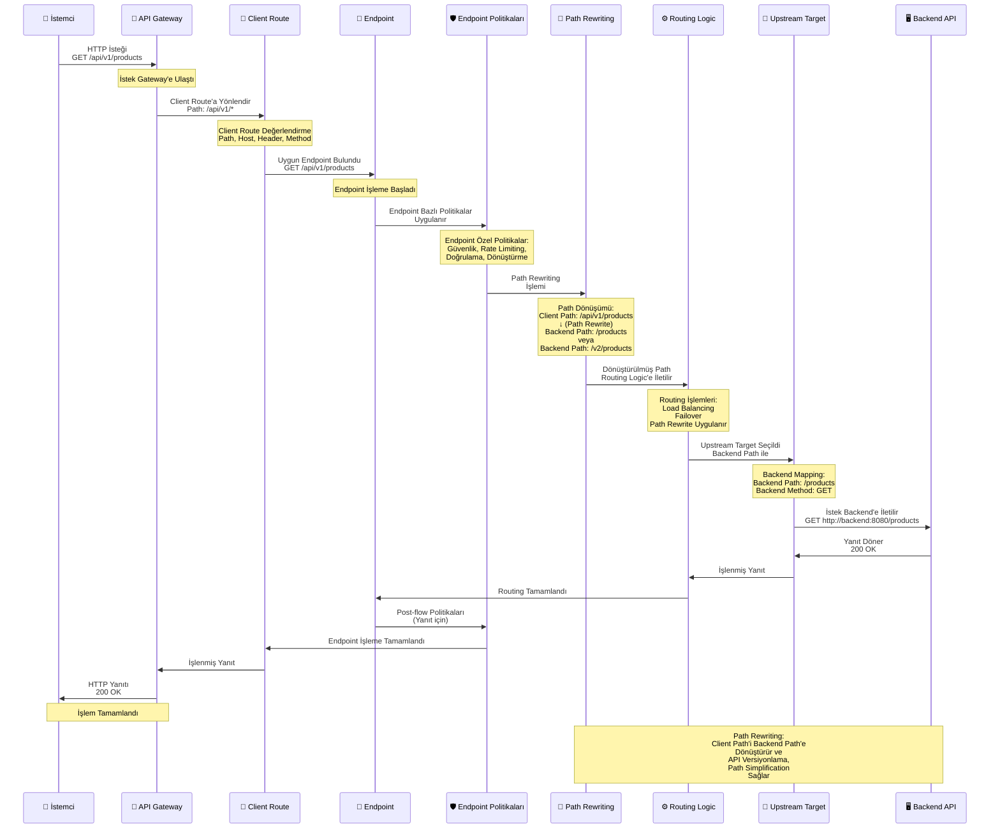

## Endpoint Özellikleri

<CardGroup cols={2}>
  <Card title="Path" icon="route">
    Endpoint'in URL yolu. Örneğin: `/api/v1/products`
  </Card>
  <Card title="Method" icon="code">
    HTTP method. GET, POST, PUT, DELETE, PATCH vb.
  </Card>
  <Card title="Operation" icon="gear">
    Endpoint'in gerçekleştirdiği işlem. Örneğin: "Ürün listesi getir"
  </Card>
  <Card title="Backend Mapping" icon="arrow-right">
    Endpoint'in backend'deki karşılığı
  </Card>
</CardGroup>

## Endpoint İşleme Akışı

Aşağıdaki diyagram, endpoint'in istek ve yanıt akışında nasıl çalıştığını ve path rewriting işlemini gösterir:



## Endpoint Yapısı

Bir endpoint şu bilgileri içerir:

```
GET /api/v1/products
│   │   │  │
│   │   │  └─ Resource (Kaynak)
│   │   └─ Version (Versiyon)
│   └─ Base Path (Temel Yol)
└─ HTTP Method (HTTP Metodu)
```

### Örnek Endpoint'ler

<CardGroup cols={2}>
  <Card title="GET /api/v1/products" icon="list">
    Ürün listesi getir
  </Card>
  <Card title="GET /api/v1/products/{id}" icon="eye">
    Tek ürün detayı getir
  </Card>
  <Card title="POST /api/v1/products" icon="plus">
    Yeni ürün oluştur
  </Card>
  <Card title="PUT /api/v1/products/{id}" icon="pencil">
    Ürün güncelle
  </Card>
  <Card title="DELETE /api/v1/products/{id}" icon="trash">
    Ürün sil
  </Card>
</CardGroup>

## Endpoint ve Client Route İlişkisi

Endpoint'ler Client Route'un altında tanımlanır:

```
Client Route: /api/v1/*
│
├─ GET /api/v1/products
├─ GET /api/v1/products/{id}
├─ POST /api/v1/products
├─ PUT /api/v1/products/{id}
└─ DELETE /api/v1/products/{id}
```

<Info>
Client Route, endpoint'lerin üst seviye yapılandırmasıdır. Bir Client Route altında birden fazla endpoint tanımlanabilir. Endpoint'ler, Client Route'un path'i içinde spesifik path ve method kombinasyonlarıdır.
</Info>

## Endpoint Yapılandırması

Bir endpoint oluştururken şu bilgiler tanımlanır:

<AccordionGroup>
  <Accordion title="Temel Bilgiler">
    * **Path**: Endpoint'in URL yolu
    * **Method**: HTTP method (GET, POST, PUT, DELETE, vb.)
    * **Operation ID**: Endpoint'in benzersiz tanımlayıcısı
    * **Description**: Endpoint'in açıklaması
  </Accordion>
  
  <Accordion title="Parametreler">
    * **Query Parameters**: URL'deki query string parametreleri
    * **Path Parameters**: URL path'indeki dinamik parametreler (örn: `{id}`)
    * **Header Parameters**: HTTP header parametreleri
  </Accordion>
  
  <Accordion title="Request ve Response">
    * **Request Body**: İstek gövdesi şeması (JSON, XML, vb.)
    * **Response**: Yanıt şeması ve status code'ları
    * **Content-Type**: İstek ve yanıt içerik tipleri
  </Accordion>
  
  <Accordion title="Backend Mapping">
    * **Backend Path**: Backend'deki karşılık gelen path
    * **Backend Method**: Backend'deki HTTP method
    * **Path Rewrite**: Path dönüşüm kuralları
  </Accordion>
</AccordionGroup>

## Endpoint Türleri

<CardGroup cols={2}>
  <Card title="REST Endpoint" icon="code">
    REST API'ler için endpoint'ler
    
    JSON formatında veri alışverişi. RESTful tasarım prensiplerine uygun endpoint'ler.
  </Card>
  <Card title="SOAP Endpoint" icon="file-code">
    SOAP Web Servisleri için endpoint'ler
    
    XML formatında veri alışverişi. WSDL tanımları ile yapılandırılır.
  </Card>
  <Card title="gRPC Endpoint" icon="network-wired">
    gRPC servisleri için endpoint'ler
    
    Protobuf formatında veri alışverişi. Yüksek performanslı RPC çağrıları.
  </Card>
  <Card title="WebSocket Endpoint" icon="globe">
    WebSocket bağlantıları için endpoint'ler
    
    Gerçek zamanlı iletişim. İki yönlü veri alışverişi sağlar.
  </Card>
</CardGroup>

## Endpoint ve Politika İlişkisi

Endpoint'lere özel politikalar uygulanabilir:

<CardGroup cols={2}>
  <Card title="Endpoint Bazlı Güvenlik" icon="shield">
    Her endpoint için farklı güvenlik politikaları
    
    OAuth2, JWT, API Key gibi güvenlik mekanizmaları endpoint bazında yapılandırılabilir.
  </Card>
  <Card title="Endpoint Bazlı Rate Limiting" icon="gauge">
    Her endpoint için farklı rate limit
    
    Endpoint bazında istek sayısı ve bant genişliği limitleri tanımlanabilir.
  </Card>
  <Card title="Endpoint Bazlı Dönüştürme" icon="arrows-rotate">
    Her endpoint için farklı dönüştürme kuralları
    
    JSON ↔ XML dönüşümü, veri mapping ve transformation endpoint bazında yapılabilir.
  </Card>
  <Card title="Endpoint Bazlı Doğrulama" icon="check-circle">
    Her endpoint için farklı doğrulama kuralları
    
    Request/Response validation, schema doğrulama endpoint bazında yapılandırılabilir.
  </Card>
</CardGroup>

## Endpoint Versiyonlama

Endpoint'ler versiyonlanabilir:

<CardGroup cols={3}>
  <Card title="Version 1" icon="1">
    `/api/v1/products`
    
    İlk versiyon. Temel işlevsellik.
  </Card>
  <Card title="Version 2" icon="2">
    `/api/v2/products`
    
    Geliştirilmiş versiyon. Yeni özellikler.
  </Card>
  <Card title="Version 3" icon="3">
    `/api/v3/products`
    
    En son versiyon. Güncel API.
  </Card>
</CardGroup>

<AccordionGroup>
  <Accordion title="Geriye Dönük Uyumluluk">
    Geriye dönük uyumluluk korunur. Eski versiyonlar çalışmaya devam eder ve yeni versiyonlar eski versiyonları etkilemez.
  </Accordion>
  
  <Accordion title="Kademeli Geçiş">
    Kademeli geçiş yapılabilir. İstemciler kendi hızlarında yeni versiyona geçebilir.
  </Accordion>
  
  <Accordion title="Versiyon Yönetimi">
    Farklı versiyonlar farklı ortamlara deploy edilebilir ve aynı anda çalışabilir. Versiyonlama sayesinde API yaşam döngüsü yönetilebilir.
  </Accordion>
</AccordionGroup>

## Endpoint ve Routing İlişkisi

Endpoint'ler, Client Route ve Upstream Target arasında köprü görevi görür:

```
İstemci İsteği
   │
   ▼
Client Route (/api/v1/*)
   │
   ▼
Endpoint (GET /api/v1/products)
   │
   │ Routing Logic
   │ (Load Balancing, Failover)
   │
   ▼
Upstream Target (http://backend:8080/products)
   │
   ▼
Backend API
```

<Info>
Endpoint, Client Route'dan gelen istekleri Upstream Target'a yönlendirirken, routing mantığı ve politikaları uygular.
</Info>

## Sonraki Adımlar

<CardGroup cols={2}>
  <Card title="Client Route" icon="arrow-right" href="/tr/concepts/temel-kavramlar/client-route">
    Client Route kavramını öğrenin
  </Card>
  <Card title="Routing ve Upstream" icon="route" href="/tr/concepts/temel-kavramlar/routing-ve-upstream">
    Routing ve Upstream kavramlarını öğrenin
  </Card>
  <Card title="API Proxy Oluşturma" icon="plus" href="/tr/develop/api-proxy-olusturma/rest-api-proxy-olusturma">
    API Proxy oluşturma
  </Card>
  <Card title="Politikalar" icon="shield" href="/tr/concepts/temel-kavramlar/politika-nedir">
    Politika kavramını öğrenin
  </Card>
</CardGroup>
