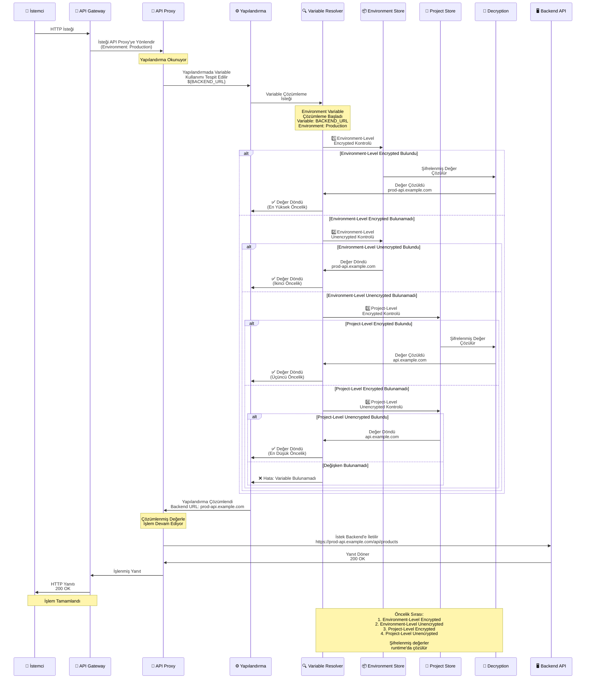

## Environment Variable Kavramı

Ortam değişkenleri, hassas bilgileri (şifreler, API anahtarları, sertifikalar) veya yapılandırma değerlerini güvenli bir şekilde saklamak için kullanılır. Apinizer'da ortam değişkenleri proje seviyesinde tanımlanır ve iki tipte olabilir:

* **Global (Tüm Ortamlar)**: Tüm ortamlarda aynı değeri kullanır
* **Environment-Specific (Ortam Özelinde)**: Her ortam için farklı değerler tanımlanabilir

<CardGroup cols={2}>
  <Card title="Şifreleme Desteği" icon="lock">
    Hassas bilgiler şifrelenmiş olarak saklanabilir
  </Card>
  <Card title="Seviye Bazlı" icon="layer-group">
    Ortam veya proje seviyesinde tanımlanabilir
  </Card>
  <Card title="Güvenlik" icon="shield">
    Şifrelenmiş değişkenler güvenli bir şekilde saklanır
  </Card>
  <Card title="Yeniden Kullanım" icon="recycle">
    Birden fazla API Proxy veya Task Flow'da kullanılabilir
  </Card>
</CardGroup>

## Environment Variable Çözümleme Akışı

Aşağıdaki diyagram, environment variable'ların runtime'da nasıl çözümlendiğini ve environment'a göre değerlerin nasıl alındığını gösterir:

## Environment Variable Türleri

<CardGroup cols={2}>
  <Card title="Şifrelenmiş (Encrypted)" icon="lock">
    Hassas bilgiler için kullanılır
    
    Şifreler, API anahtarları, sertifikalar, token'lar gibi hassas bilgiler şifrelenmiş olarak saklanır.
    
    <Warning>
    **Önemli**: Şifrelenmiş değişkenler geri dönüştürülemez şekilde şifrelenir. Değerler sadece kullanım sırasında çözülür.
    </Warning>
  </Card>
  
  <Card title="Şifrelenmemiş (Unencrypted)" icon="unlock">
    Yapılandırma değerleri için kullanılır
    
    URL'ler, port numaraları, flag'ler ve diğer yapılandırma değerleri şifrelenmeden saklanır.
  </Card>
</CardGroup>

<AccordionGroup>
  <Accordion title="Şifrelenmiş Değişkenler">
    * **Şifreler**: Veritabanı şifreleri, API anahtarları
    * **Sertifikalar**: SSL/TLS sertifikaları
    * **Token'lar**: OAuth token'ları, JWT secret'ları
    * **Diğer Hassas Bilgiler**: Güvenlik gerektiren tüm değerler
  </Accordion>
  
  <Accordion title="Şifrelenmemiş Değişkenler">
    * **URL'ler**: Backend API URL'leri
    * **Port Numaraları**: Port değerleri
    * **Flag'ler**: Boolean değerler
    * **Diğer Yapılandırmalar**: Genel yapılandırma değerleri
  </Accordion>
</AccordionGroup>

## Environment Variable Seviyeleri

<CardGroup cols={2}>
  <Card title="Environment-Level (Ortam Seviyesi)" icon="server">
    Belirli bir ortamda (Environment) geçerlidir
    
    O ortamdaki tüm API Proxy'ler ve Task Flow'lar tarafından kullanılabilir. Proje seviyesi değişkenlerden daha yüksek önceliğe sahiptir.
  </Card>
  
  <Card title="Project-Level (Proje Seviyesi)" icon="folder">
    Belirli bir projede (Project) geçerlidir
    
    O projedeki tüm API Proxy'ler ve Task Flow'lar tarafından kullanılabilir. Ortam seviyesi değişkenlerden daha düşük önceliğe sahiptir.
  </Card>
</CardGroup>

<AccordionGroup>
  <Accordion title="Environment-Level Kullanım Senaryoları">
    * Ortam bazlı backend URL'leri
    * Ortam bazlı API anahtarları
    * Ortam bazlı yapılandırma değerleri
    * Ortam bazlı veritabanı bağlantı bilgileri
  </Accordion>
  
  <Accordion title="Project-Level Kullanım Senaryoları">
    * Proje bazlı yapılandırma değerleri
    * Proje bazlı API anahtarları
    * Proje bazlı genel ayarlar
    * Proje bazlı ortak değerler
  </Accordion>
</AccordionGroup>

## Environment Variable Öncelik Sırası

Değişken çözümleme sırası (yüksekten düşüğe):

<CardGroup cols={2}>
  <Card title="1. Environment-Level Encrypted" icon="lock" color="#e74c3c">
    En yüksek öncelik
    
    Ortam seviyesinde şifrelenmiş değişkenler.
  </Card>
  <Card title="2. Environment-Level Unencrypted" icon="unlock" color="#f39c12">
    İkinci öncelik
    
    Ortam seviyesinde şifrelenmemiş değişkenler.
  </Card>
  <Card title="3. Project-Level Encrypted" icon="lock" color="#3498db">
    Üçüncü öncelik
    
    Proje seviyesinde şifrelenmiş değişkenler.
  </Card>
  <Card title="4. Project-Level Unencrypted" icon="unlock" color="#95a5a6">
    En düşük öncelik
    
    Proje seviyesinde şifrelenmemiş değişkenler.
  </Card>
</CardGroup>

<Info>
**Not**: Aynı isimde bir değişken hem ortam hem de proje seviyesinde tanımlıysa, ortam seviyesindeki değişken kullanılır.
</Info>

## Çalışma Mantığı

<CardGroup cols={3}>
  <Card title="1. Tanımlama" icon="plus-circle">
    Ortam değişkenleri proje seviyesinde tanımlanır
    
    * **Global**: Tüm ortamlarda aynı değer
    * **Environment-Specific**: Her ortam için farklı değer
  </Card>
  
  <Card title="2. Kullanım" icon="code">
    Yapılandırma alanlarında `${variableName}` formatında kullanılır
    
    * Backend adresi: `${BACKEND_URL}`
    * Veritabanı: `jdbc:mysql://${DB_HOST}:${DB_PORT}/${DB_NAME}`
    * API anahtarı: `${API_KEY}`
  </Card>
  
  <Card title="3. Runtime Çözümleme" icon="play">
    API Proxy çalışırken otomatik çözümlenir
    
    * Değişken ifadeleri tespit edilir
    * Ortam değeri alınır
    * Secret'lar decrypt edilir
    * Gerçek değerle değiştirilir
  </Card>
</CardGroup>

<AccordionGroup>
  <Accordion title="Örnek Senaryo">
    **Yapılandırma:**
    * Development: `BACKEND_URL = dev-api.example.com`
    * Production: `BACKEND_URL = api.example.com`
    * Yapılandırmada: `${BACKEND_URL}`
    
    **Runtime Sonuçları:**
    * Development ortamında: `dev-api.example.com`
    * Production ortamında: `api.example.com`
  </Accordion>
</AccordionGroup>

## Environment Variable Kullanım Formatı

Ortam değişkenleri, yapılandırma alanlarında özel bir format kullanılarak referans edilir.

### Format Yapısı

| Format | Açıklama | Örnek |
|--------|----------|-------|
| `${variableName}` | Temel kullanım formatı | `${BACKEND_URL}` |
| `text${variableName}` | Metin ile birleştirme | `https://${API_HOST}` |
| `${variableName}text` | Metin ile birleştirme | `${API_PORT}/api` |
| `text${variable1}text${variable2}` | Birden fazla değişken | `jdbc:mysql://${DB_HOST}:${DB_PORT}/${DB_NAME}` |

### Format Kuralları

<CardGroup cols={2}>
  <Card title="Başlangıç Karakteri" icon="arrow-right">
    `${` ile başlamalıdır
  </Card>
  <Card title="Bitiş Karakteri" icon="arrow-left">
    `}` ile bitmelidir
  </Card>
  <Card title="Değişken Adı" icon="tag">
    Ortada değişken adı yer alır (boşluk olmadan)
  </Card>
  <Card title="Büyük/Küçük Harf" icon="text-height">
    Değişken adı büyük/küçük harf duyarlıdır
  </Card>
</CardGroup>

## Environment Variable Kullanım Yerleri

Ortam değişkenleri Apinizer platformunda çeşitli yapılandırma alanlarında kullanılabilir. **Environment Variable Seçim Dialog'u** sadece belirli alanlarda mevcuttur.

<CardGroup cols={3}>
  <Card title="API Proxy - Routing" icon="route">
    Upstream Routing adresleri
    
    **Konum:** API Proxy > Upstream/Routing Tab > Define Address(es)
    
    Backend API adreslerinde ortam bazlı yönlendirme için kullanılır.
  </Card>
  
  <Card title="Database Connection" icon="database">
    Veritabanı bağlantı yapılandırması
    
    **Konum:** Administration > Connection Management > Database Connection Pool
    
    JDBC URL, Username, Password alanlarında ortam bazlı yönetim.
  </Card>
  
  <Card title="LDAP Connection" icon="users">
    LDAP bağlantı yapılandırması
    
    **Konum:** Administration > Connection Management > LDAP Connection Pool
    
    LDAP URL, Bind DN, Bind Password alanlarında ortam bazlı yönetim.
  </Card>
</CardGroup>

<AccordionGroup>
  <Accordion title="API Proxy - Routing Detayları">
    | Özellik | Açıklama |
    |---------|----------|
    | **Konum** | API Proxy > Upstream/Routing Tab > Define Address(es) |
    | **Alan** | Backend API adresi input alanı |
    | **Kullanım** | Backend API adreslerinde ortam bazlı yönlendirme |
    | **Erişim** | Adres input alanının sağındaki liste ikonu butonuna tıklanarak |
    
    **Kullanım Senaryosu:** Farklı ortamlarda farklı backend adresleri kullanmak için
  </Accordion>
  
  <Accordion title="Database Connection Detayları">
    | Özellik | Açıklama |
    |---------|----------|
    | **Konum** | Administration > Connection Management > Connection Pool Def DB |
    | **Alanlar** | JDBC URL, Username, Password |
    | **Kullanım** | Veritabanı bağlantı bilgilerinde ortam bazlı yönetim |
    | **Dialog Erişimi** | Her alanın sağındaki liste ikonu butonuna tıklanarak |
    | **Secret Kullanımı** | Password alanı mutlaka secret olarak işaretlenmelidir |
    
    **Kullanım Senaryosu:** Farklı ortamlarda farklı veritabanı bağlantı bilgileri kullanmak için
  </Accordion>
  
  <Accordion title="LDAP Connection Detayları">
    | Özellik | Açıklama |
    |---------|----------|
    | **Konum** | Administration > Connection Management > Connection Pool Def LDAP |
    | **Alanlar** | LDAP URL, Bind DN, Bind Password |
    | **Kullanım** | LDAP bağlantı bilgilerinde ortam bazlı yönetim |
    | **Dialog Erişimi** | Her alanın sağındaki liste ikonu butonuna tıklanarak |
    | **Secret Kullanımı** | Bind Password mutlaka secret olarak işaretlenmelidir |
    
    **Kullanım Senaryosu:** Farklı ortamlarda farklı LDAP bağlantı bilgileri kullanmak için
  </Accordion>
</AccordionGroup>

## Kullanım Senaryoları ve Örnekler

<AccordionGroup>
  <Accordion title="Backend API Adresi Yönetimi">
    **Problem:** Farklı ortamlarda farklı backend API adresleri kullanılıyor.
    
    **Çözüm:**
    
    **Ortam Değişkeni Oluşturma:**
    * Key Name: `BACKEND_API_URL`
    * Type: Environment-Specific
    * Development: `https://dev-api.example.com`
    * Test: `https://test-api.example.com`
    * Production: `https://api.example.com`
    
    **Routing'de Kullanım:**
    * Address: `${BACKEND_API_URL}`
    
    **Sonuç:**
    * Development ortamında istekler `https://dev-api.example.com` adresine gider
    * Test ortamında istekler `https://test-api.example.com` adresine gider
    * Production ortamında istekler `https://api.example.com` adresine gider
  </Accordion>
  
  <Accordion title="Veritabanı Bağlantı Yönetimi">
    **Problem:** Her ortamda farklı veritabanı kullanılıyor.
    
    **Çözüm:**
    
    **Ortam Değişkenleri:**
    * `DB_HOST`: Development=`dev-db.example.com`, Production=`prod-db.example.com`
    * `DB_PORT`: Global=`3306`
    * `DB_NAME`: Development=`dev_db`, Production=`prod_db`
    * `DB_USER`: Development=`dev_user`, Production=`prod_user`
    * `DB_PASSWORD`: Development=`dev_pass`, Production=`prod_pass` (Secret)
    
    **Connector'da Kullanım:**
    * Connection String: `jdbc:mysql://${DB_HOST}:${DB_PORT}/${DB_NAME}`
    * Username: `${DB_USER}`
    * Password: `${DB_PASSWORD}`
    
    **Sonuç:**
    * Development: `jdbc:mysql://dev-db.example.com:3306/dev_db`
    * Production: `jdbc:mysql://prod-db.example.com:3306/prod_db`
  </Accordion>
  
  <Accordion title="API Anahtarı Yönetimi">
    **Problem:** Dış servisler için farklı API anahtarları kullanılıyor.
    
    **Çözüm:**
    
    **Ortam Değişkeni:**
    * Key Name: `EXTERNAL_SERVICE_API_KEY`
    * Type: Environment-Specific
    * Development: `dev-key-abc123` (Secret)
    * Production: `prod-key-xyz789` (Secret)
    
    **Policy'de Kullanım:**
    * Header Name: `X-API-Key`
    * Header Value: `${EXTERNAL_SERVICE_API_KEY}`
    
    **Sonuç:**
    * Development: `X-API-Key: dev-key-abc123`
    * Production: `X-API-Key: prod-key-xyz789`
  </Accordion>
</AccordionGroup>

## Environment Variable Oluşturma

Ortam değişkeni oluşturma adımları:

<AccordionGroup>
  <Accordion title="Adım 1: Yeni Ortam Değişkeni Ekleme">
    * **Ortam Değişkenleri** sayfasına gidin
    * Sağ üst köşedeki **"Oluştur" (Create)** butonuna tıklayın
    * Ortam Değişkeni düzenleme penceresi açılır
  </Accordion>
  
  <Accordion title="Adım 2: Temel Bilgileri Girme">
    * **Key Name (Değişken Adı)**:
      * Zorunlu alan
      * Proje içinde benzersiz olmalıdır
      * İsim kontrolü otomatik yapılır
      * Geçerli isim: Yeşil onay işareti
      * Mevcut isim: Kırmızı uyarı işareti
      
    * **Açıklama **:
      * İsteğe bağlı alan
      * Değişkenin ne için kullanıldığını açıklar
  </Accordion>
  
  <Accordion title="Adım 3: Tip Seçimi">
    * **Environment-Specific (Ortam Özelinde)**:
      * Her ortam için farklı değer tanımlanabilir
      * Yeni kayıt oluştururken seçilir
      * Kayıt oluşturulduktan sonra değiştirilemez
      
    * **Global (Tüm Ortamlar)**:
      * Tüm ortamlarda aynı değer kullanılır
      * Yeni kayıt oluştururken seçilir
      * Kayıt oluşturulduktan sonra değiştirilemez
    
    <Info>
    **Önemli**: Tip seçimi sadece yeni kayıt oluştururken yapılabilir. Mevcut kayıtların tipi değiştirilemez.
    </Info>
  </Accordion>
  
  <Accordion title="Adım 4: Değer Tanımlama">
    **Environment-Specific Değişkenler İçin:**
    
    * **Ortam Ekleme**: "Ortam Ekle" butonuna tıklayarak yeni ortam ekleyin
    * **Ortam Seçimi**: Her değer için bir ortam seçin
      * Mevcut ortamlar listeden seçilir
      * "Custom..." seçeneği ile özel ortam adı girilebilir
    * **Değer Girme**: Her ortam için değer girin
    * **Secret Ayarlama**: Hassas bilgiler için "Secret" checkbox'ını işaretleyin
      * Secret değerler kaydedildikten sonra maskelenir (`***********`)
      * Secret değerler şifrelenerek saklanır
      * Güncelleme sırasında değer değiştirilmemişse mevcut değer korunur
    
    **Global Değişkenler İçin:**
    
    * **Global Değer**: Tek bir değer girin (tüm ortamlar için geçerli)
    * **Secret Ayarlama**: Hassas bilgiler için "Secret" checkbox'ını işaretleyin
  </Accordion>
  
  <Accordion title="Adım 5: Kaydetme ve Deployment">
    * **Form Kontrolü**: Tüm zorunlu alanlar doldurulmalı ve isim geçerli olmalı
    * **"Kaydet ve Deploy"** butonuna tıklayın
    * **Onay Dialog'u**:
      * Değişken adını tekrar girmeniz istenir (güvenlik için)
      * Etkilenecek bileşenler listelenir:
        * API Proxy Routing ayarları
        * Policy Configuration ayarları
        * Connector ayarları
        * Diğer yapılandırma ayarları
    * **Deployment Sonucu**:
      * Tüm çalışan ortamlara (Environments) otomatik olarak deploy edilir
      * Deployment sonuçları gösterilir
    
    <Warning>
    **Önemli**: Secret olarak işaretlenen değerler kaydedildikten sonra bir daha görüntülenemez.
    </Warning>
  </Accordion>
</AccordionGroup>

## Environment Variable Düzenleme

### Düzenleme Modal'ının Açılması

Düzenleme modal'ı aşağıdaki yollarla açılabilir:

| Yöntem | Açıklama |
|--------|----------|
| **Liste'den Tıklama** | Ortam değişkeni adına tıklanır |
| **Menü'den Seçim** | Satır sonundaki menüden "Edit" seçilir |

### Düzenleme Modal'ındaki Farklılıklar

| Özellik | Yeni Kayıt | Düzenleme |
|---------|------------|-----------|
| **Modal Başlığı** | "Add Environment Variable" | "Edit Environment Variable" |
| **Type Seçimi** | Aktif (değiştirilebilir) | Pasif (değiştirilemez) |
| **Secret Değerler** | Normal görünür | Maskelenmiş görünür (`***********`) |
| **Secret Checkbox** | Aktif | Kaydedilmiş secret'lar için pasif |

## Best Practices

<AccordionGroup>
  <Accordion title="Güvenlik">
    * Hassas bilgileri mutlaka şifrelenmiş olarak saklayın
    * Şifreler, API anahtarları, sertifikalar için encrypted kullanın
    * Düzenli olarak şifreleri değiştirin
  </Accordion>
  
  <Accordion title="Organizasyon">
    * Değişken isimlerini tutarlı bir şekilde adlandırın
    * Ortam ve proje seviyesi değişkenleri doğru şekilde ayırın
    * Dokümantasyon oluşturun
  </Accordion>
  
  <Accordion title="Yönetim">
    * Kullanılmayan değişkenleri temizleyin
    * Değişken kullanımını düzenli olarak gözden geçirin
    * Versiyon kontrolü yapın
  </Accordion>
</AccordionGroup>

## Sonraki Adımlar

<CardGroup cols={2}>
  <Card title="Variable" icon="code" href="/tr/concepts/temel-kavramlar/variable">
    Variable kavramını öğrenin
  </Card>
  <Card title="Environment Variables" icon="gear" href="/tr/develop/environment-variables">
    Environment Variables yönetimi
  </Card>
  <Card title="Secret Manager" icon="lock" href="/tr/admin/secrets-management/sertifikalar">
    Secret Manager kullanımı
  </Card>
  <Card title="API Proxy Yapılandırması" icon="network-wired" href="/tr/develop/api-proxy-konfigurasyonu/settings">
    API Proxy yapılandırması
  </Card>
</CardGroup>