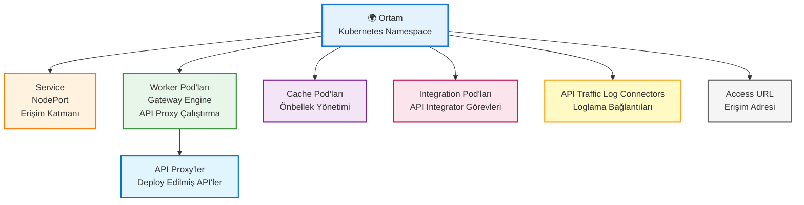

## Ortam Kavramı

Ortam, Kubernetes bağlamında **Namespace** ifadesine karşılık gelir. Kubernetes kümeleri büyük miktarda bağlantısız iş yüklerini eş zamanlı olarak yönetebilir. Kubernetes, küme içindeki nesnelerin karmaşasını gidermek için Namespace adı verilen bir kavramdan faydalanır.

<Info>
  **Namespace'ler** nesnelerin birbirleriyle gruplanmasına ve bu grupların bir birim olarak filtrelenip kontrol edilmesine olanak sağlar. Böylece özelleştirilmiş erişim kontrol politikalarını uygulamak ya da bir test ortamı için tüm birimleri birbirlerinden ayırmak için gruplamalar yapmak gibi amaçlarla kullanılabilir.
</Info>

## Ortam Özellikleri

<CardGroup cols={2}>
  <Card title="İzolasyon" icon="lock">
    Her ortam diğer ortamlardan tamamen izole edilmiştir. Bir ortamdaki API Proxy'ler diğer ortamlardaki API Proxy'lerle doğrudan iletişim kuramaz.
  </Card>
  <Card title="Kaynak Tahsisi" icon="server">
    Her ortamın kendisine ayrılmış CPU ve RAM gibi kaynakları vardır. Bu kaynaklar diğer ortamlarla paylaşılmaz.
  </Card>
  <Card title="Erişim Adresi" icon="globe">
    Her ortamın kendisine ait bir erişim adresi (URL) vardır. Bu adres üzerinden ortamdaki API Proxy'lere erişilebilir.
  </Card>
  <Card title="Ayarlar" icon="gear">
    Her ortamın kendisine özgü ayarları vardır. Bu ayarlar diğer ortamlardan bağımsızdır.
  </Card>
</CardGroup>

## Ortam Yapısı

Aşağıdaki diyagram, ortamın ne içerdiğini high-level olarak gösterir:



## Neden Birden Fazla Ortam Kullanılır?

İki temel nedenle birden çok ortam kullanılması tavsiye edilmektedir:

### 1. Yaşam Döngüsü Yönetimi

Geliştirme (Development), Test, Sandbox ve Üretim (Production) gibi farklı amaca yönelik ortamlar oluşturarak API yaşam döngüsünü yönetmek.

<CardGroup cols={2}>
  <Card title="Development" icon="code">
    Geliştirme ortamı. Yeni özelliklerin geliştirildiği ve test edildiği ortam.
  </Card>
  <Card title="Test" icon="flask">
    Test ortamı. Geliştirilen özelliklerin kapsamlı testlerinin yapıldığı ortam. Donanımdaki kaynakların yeterliliğini ölçmek için de kullanılır.
  </Card>
  <Card title="Sandbox" icon="box">
    Sandbox ortamı. Ürün bitmiş ve son kullanıcıya çıkmadan önce gerçek kullanıcıyı simüle etmek için kullanılır. Production sürecini etkilemeden ve üretim sürecine yakın olarak güvenli test yapabilme imkanı sağlar.
  </Card>
  <Card title="Production" icon="rocket">
    Üretim ortamı. Canlı sistemin çalıştığı ortam. Son kullanıcıların kullanımı için tasarlanmıştır ve istemcilerin yükünü taşıyabilecek şekilde yapılandırılır.
  </Card>
</CardGroup>

<Warning>
  **Önemli Farklar:**

  - **Test environment ve sandbox environment** arasındaki fark: Ürün (API Proxy ya da Uygulama), geliştirme sürecinde test etmek için **test environment**, ürün bitmiş ve son kullanıcıya çıkmadan önce gerçek kullanıcıyı simüle etmek için **sandbox environment** üzerinde etkin hale getirilir.
  - API Proxy'nin kullanım amacına göre ilgili roldeki ortama kurulum gerçekleştirilir. Aynı API Proxy farklı amaçlar için farklı ortamlar üzerinde etkinleştirilebilir.
  - Her bir ortam diğerlerinden bağımsız olarak çalışır.
</Warning>

### 2. Kaynak İzolasyonu

Çok kaynak tüketen API'leri gruplandırarak izole çalışmalarını sağlamak, böylece diğer API'lerin performansının kötü etkilenmesine engel olmak.

<Info>
  Örneğin, yüksek trafikli API'ler bir ortamda, düşük trafikli API'ler başka bir ortamda çalıştırılabilir. Bu sayede kaynak kullanımı optimize edilir.
</Info>

## Ortam Bileşenleri

Bir ortamda aşağıdaki bileşenler bulunur:

<AccordionGroup>
  <Accordion title="Namespace" icon="folder">
    Apinizer Platformu'ndaki ortam kavramı, Kubernetes ortamındaki Namespace kavramına karşılık gelmektedir. Her ortam Kubernetes'te bir Namespace olarak oluşturulur.
  </Accordion>

  <Accordion title="Worker Pod'ları (Gateway Engine)" icon="server">
    API Proxy'lerin çalıştığı pod'lar. Apinizer Platformu'nun çekirdek (core) modülüdür, tüm API isteklerinin Backend API'ye yönlendirilmesinden sorumludur ve Policy Enforcement Point olarak çalışır.
  </Accordion>

  <Accordion title="Cache Pod'ları" icon="database">
    Dağıtılmış önbellek pod'ları. Apinizer'da gerek duyulan cache değerlerinin tutulduğu ortamdır.
  </Accordion>

  <Accordion title="Integration Pod'ları" icon="network-wired">
    API Integrator görevlerinin çalıştığı pod'lar. Entegrasyon işlemlerini yönetir.
  </Accordion>

  <Accordion title="Service (Servis)" icon="globe">
    Environment Service (Ortam servisi), Environment Deployment'da yer alan Apinizer Worker pod'una erişebilmek için oluşturulur. Servis, tüm podlara gelen istekleri karşılayan katmandır. Konum olarak podların önünde yer alır. Varsayılan olarak NodePort kullanılmakta ve bunun haricindeki servis tipleri Apinizer tarafından desteklenmemektedir.
  </Accordion>

  <Accordion title="API Traffic Log Connectors" icon="file-lines">
    Oluşturulan ortamdaki tüm API Trafiğinin ve isteklerin loglanacağı log sunucularına (örneğin Elasticsearch kümesi) bağlantı sağlayan konnektörlerdir.
  </Accordion>

  <Accordion title="Access URL (Erişim Adresi)" icon="link">
    Access URL, Proxy'nin dış erişim adresidir. `https://<your-IP-address>` şeklinde belirtilir. Dışarıdan erişim adres bilgisi kullanılarak Proxy'lere mesaj gönderilebilir.
  </Accordion>
</AccordionGroup>

## Ortam Türleri ve Protokoller

### Ortam Türleri

Bir ortam oluştururken **Test** veya **Üretim (Production)** türlerinden biri seçilir. Bu tür, lisans yönetimi ve kaynak tahsisi açısından önemlidir.

### İletişim Protokolü Türleri

Ortam oluştururken aşağıdaki iletişim protokollerinden biri seçilebilir:

* **HTTP**: Standart HTTP protokolü
* **gRPC**: Yüksek performanslı RPC protokolü
* **HTTP+WebSocket**: HTTP ve WebSocket protokollerinin birlikte kullanımı

## Ortam Erişim Adresi

Bir API Proxy'e, dağıtıldığı ortamın erişim adresi üzerinden erişilebilir.

### Erişim Adresi Yapısı

Bir API Proxy'nin erişim adresi şu şekildedir:

```
http://demo.apinizer.com/apigateway/myproxy
```

| Bileşen | Açıklama |
|---------|----------|
| `http://demo.apinizer.com/` | Ortam Erişim Adresi |
| `apigateway/` | Root Context |
| `myproxy` | API Proxy Relative Path |

### Erişim Adresi Yapılandırması

Ortam için tanımlanacak erişim adresi genelde, WAF veya Nginx gibi bir load balancer'da tanımlanan DNS adresidir. Apinizer'da tanımlanan ortamlar Kubernetes'te bir namespace'e karşılık gelmektedir. Namespace içinde çalışan Apinizer Worker'larına erişim için Apinizer tarafından otomatik bir NodePort tipinde Kubernetes servisi oluşturulmaktadır.

## Ortam Yönetimi

### Ortam Oluşturma

Yeni bir ortam oluştururken şu bilgiler tanımlanır:

* **Tür **: Test veya Üretim (Production)
* **İletişim Protokolü Türü**: HTTP, gRPC veya HTTP+WebSocket
* **Ortam Adı **: Ortamı tanımlayan benzersiz isim (Kubernetes'teki namespace'e karşılık gelir)
* **Anahtar (Key)**: Ortama özgü kısaltılmış bir anahtar
* **Node Listesi**: Ortamın hangi Kubernetes sunucularında çalışacağı
* **Proje (Project)**: Ortamın kullanılabileceği projeler (boş bırakılırsa tüm projelerde kullanılabilir)
* **Erişim URL Adresi (Access URL)**: Ortam içinde çalışan API Proxy'lerin dış erişim adresi
* **Gateway Sunucusu Erişim URL'si**: Apinizer Yönetim konsolunda yapılan konfigürasyonların Gateway Pod'larına yüklenebilmesi için gerekli olan nodeport veya ingress tipindeki servis erişim adresi
* **Kaynak Limitleri**: CPU ve RAM limitleri
* **Ayarlar**: Ortama özgü konfigürasyonlar
* **Açıklama**: Yönetim kolaylığı ve önemli notlar için kullanılabilir

<Info>
  Detaylı ortam oluşturma ve yönetimi için [Ortam Yönetimi](/tr/admin/server-management/ag-gecidi-ortamlari) sayfasına bakabilirsiniz.
</Info>

### API Proxy Yükleme

API Proxy'ler, bir veya birden fazla ortam üzerine yüklenebilir. Aynı API Proxy farklı ortamlarda farklı versiyonlarıyla çalışabilir.

<Warning>
  **Önemli Notlar:**
  
  - İstemcinin API Proxy'e erişebilmesi için en az bir ortama dağıtılmış  olması gerekir.
  - Kurulumu yapılan ortam ya da ortamların hepsi bir küme (cluster) içinde yer alır ve Apinizer Platformu'nun kurulu olduğu sunucular üzerinde çalışır.
</Warning>

## Proje ve Ortam İlişkisi

Projeler ve ortamlar farklı kavramlardır:

* **Proje**: Mantıksal organizasyon birimi (hangi API'ler birlikte çalışır?)
* **Ortam**: Fiziksel/kaynak birimi (API'ler nerede çalışır?)

Bir projedeki API Proxy'ler farklı ortamlara yüklenebilir:

```
Proje: E-Ticaret API'leri
├─ Development Ortamı
│  ├─ Product API v1.0
│  └─ Order API v1.0
├─ Test Ortamı
│  ├─ Product API v1.1
│  └─ Order API v1.1
├─ Sandbox Ortamı
│  ├─ Product API v1.2
│  └─ Order API v1.2
└─ Production Ortamı
   ├─ Product API v1.2
   └─ Order API v1.2
```

Ortam oluştururken, ortamın hangi projelerde kullanılabileceği belirlenebilir. Eğer proje seçimi boş bırakılırsa, ortam tüm projelerde kullanılabilir.

## Ortam ve Kubernetes Namespace İlişkisi

Apinizer Platformu ile oluşturulan tüm ortamlar Kubernetes altyapısında çalışmaktadır. Her ortam, Kubernetes'te bir Namespace'e karşılık gelir:

```
Apinizer Ortamı → Kubernetes Namespace
├─ Development → apinizer-dev
├─ Test → apinizer-test
├─ Sandbox → apinizer-sandbox
└─ Production → apinizer-prod
```

Bu yapı sayesinde:
* Ortamlar arası izolasyon sağlanır
* Kaynak kullanımı kontrol edilir
* Erişim kontrolü yapılabilir
* Ölçeklendirme yönetilebilir

## Sonraki Adımlar

<CardGroup cols={2}>
  <Card title="Proje Nedir?" icon="folder" href="/tr/concepts/temel-kavramlar/proje-nedir">
    Proje kavramını öğrenin
  </Card>
  <Card title="API Proxy Nedir?" icon="network-wired" href="/tr/concepts/temel-kavramlar/api-proxy-nedir">
    API Proxy kavramını öğrenin
  </Card>
  <Card title="Ortam Yönetimi" icon="gear" href="/tr/admin/server-management/ag-gecidi-ortamlari">
    Ortam oluşturma ve yönetimi
  </Card>
  <Card title="Deployment Modelleri" icon="sitemap" href="/tr/concepts/deployment/deployment-modelleri">
    Deployment modellerini inceleyin
  </Card>
</CardGroup>