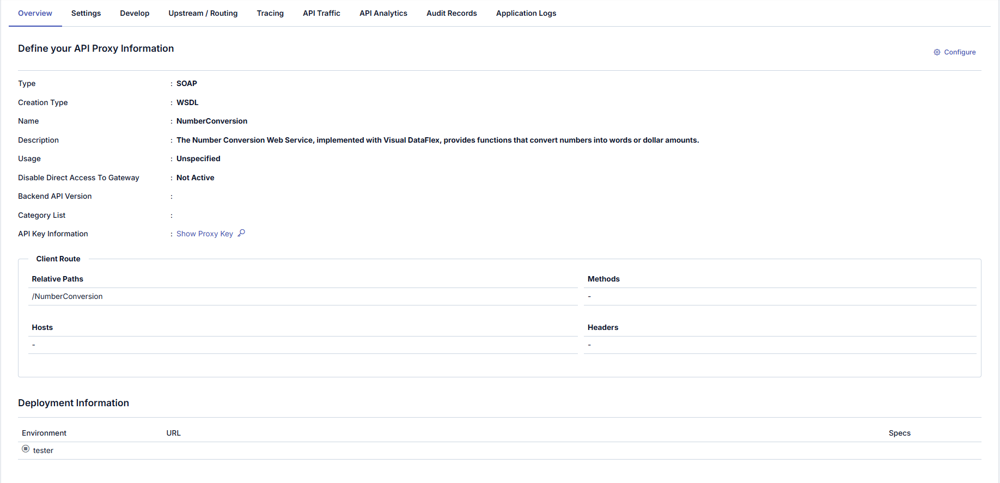
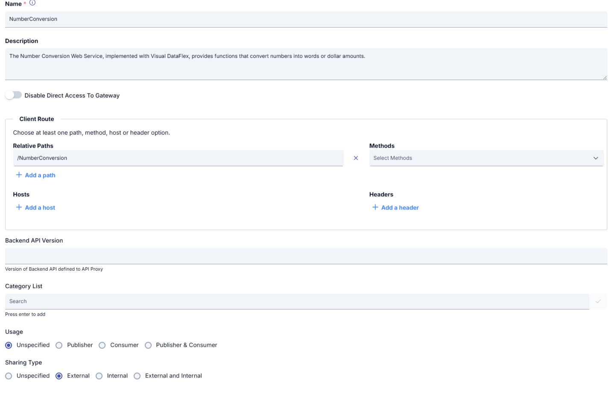
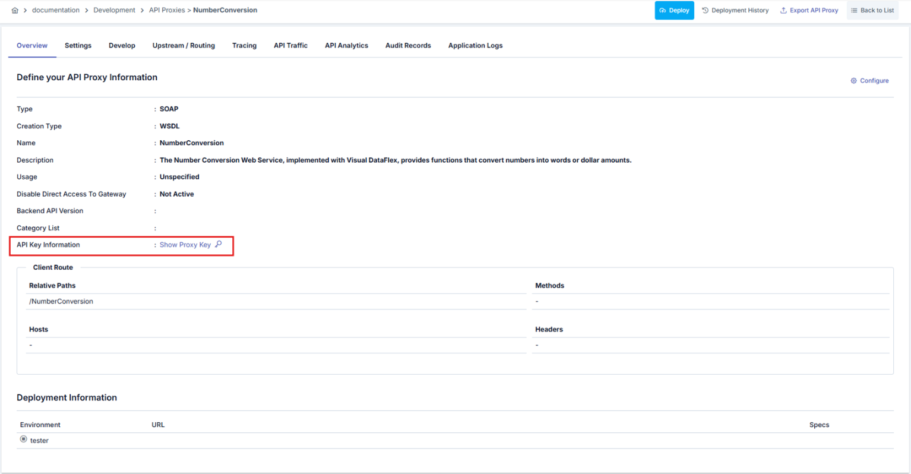
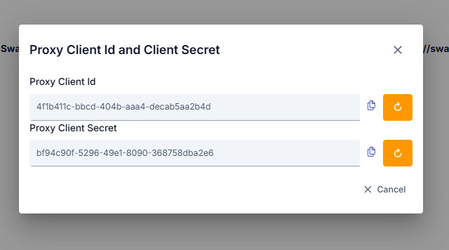

## Genel Bilgi Sekmesi

Bu sekmede, seçilen [API Proxy](/tr/concepts/temel-kavramlar/api-proxy-nedir) ile ilgili genel ayarlar bulunur.

<Info>
Eğer ilgili API Proxy bir Gruba dahilse, **API Proxy Grup Etkin** _(API Proxy Group Enabled)_ linkine tıklayarak API Proxy'nin ait olduğu Grup ekranına gidilebilir.
</Info>

## Yapılandırma

**Yapılandır** _(Configure)_ butonuna tıklayarak açılan dialog ekranında API Proxy'nin temel bilgileri yapılandırılabilir.

### Yapılandırma Alanları

| Alan | Açıklama |
|---|---|
| **Adı**  | API Proxy'ye kullanıcı tarafından verilen isimdir. Bu değer [proje](/tr/concepts/temel-kavramlar/proje-nedir) genelinde tekil (unique) olmalıdır. |
| **Açıklama**  | API Proxy'nin açıklama metnidir. Proxy'nin amacı, iş mantığı veya sağladığı fonksiyonlara ilişkin bilgi buraya yazılır. |
| **Gateway'e Doğrudan Erişimi Devre Dışı Bırak** _(Disable Direct Access To Gateway)_ | Bu seçenek etkinleştirildiğinde, Backend servisine doğrudan erişim engellenir. Servise yalnızca API Proxy üzerinden erişilebilir. |
| **Client Route** | API'ye gelen isteklerin hangi yoldan, hangi yöntemle ve hangi kriterlere göre yönlendirileceğini belirleyen bölümdür. Detaylı bilgi için [Client Route](/tr/concepts/temel-kavramlar/client-route) sayfasına bakabilirsiniz. |
| **Backend API Versiyon** _(Backend API Version)_ | API Proxy'nin hangi Backend API versiyonuna karşılık geldiğinin girildiği alandır. Bu değer bilgilendirme ve versiyon yönetimi açısından önemlidir. |
| **Kategori Listesi** _(Category List)_ | API Proxy'leri sınıflandırmak için kullanılır. Örneğin: Finans, CRM, Bildirim, Entegrasyon. Kategori seçimi API Portal kullanıcılarının API'leri daha kolay bulmasını sağlar. |
| **Kullanım Şekli** _(Usage)_ | API Proxy'nin kullanım tipini belirtir. Seçenekler: • Unspecified • Publisher (Yalnızca üreten taraf) • Consumer (Yalnızca tüketen taraf) • Publisher & Consumer (Her iki kullanım da)  Bu değer API'nin proje içindeki rolünü belirtmek için kullanılır. |
| **Paylaşım Tipi** _(Sharing Type)_ | API Proxy'nin proje içinde veya dışında nasıl paylaşıldığını belirleyen alandır. Seçenekler: • Unspecified • External • Internal • External and Internal |

<Info>
**Detaylı Bilgi İçin Bakınız**: [API Proxy Client Route Kullanım Kılavuzu](/tr/develop/api-proxy-konfigurasyonu/client-route)
</Info>

## Örnek Yapılandırma Akışı

1. Proxy adı ve açıklaması girilir.
2. Client Route bölümünden yol (Relative Path) tanımlanır.
3. Gerekirse yöntem, host veya header kısıtları eklenir.
4. Güvenlik ayarları yapılır (Disable Direct Access To Gateway vb.)
5. Kategoriler seçilir.
6. Kullanım ve paylaşım tipi belirlenir.

## Proxy Anahtarını Göster

API Proxy'nin erişim anahtarlarının yönetildiği bölümdür. Erişim anahtarları OAuth2 Kimlik Doğrulama Politikası için kullanılır.

Client Id ve Client Secret değerleri otomatik olarak oluşturulur ve kullanıcı yenilerinin oluşturulmasını isteyebilir. Yüklenmiş bir API Proxy için anahtarlardan herhangi birisi yeniden oluşturulursa, anahtarların geçerli olabilmesi için API Proxy'nin yeniden yüklenmesi gerekir.

**Proxy Anahtarını Göster** butonuna tıklandığında açılan dialog:

**Client ID** veya **Secret** alanlarının yanındaki yenileme butonuna tıklandığında açılan onay dialogu:

<Warning>
Bu dialog, Client ID veya Secret yenileme işleminin geri alınamaz ve kritik bir işlem olduğunu hatırlatır. İşlemi onaylamak için API Proxy'nin adını yazmanız ve anahtar oluşturma tipini (Automatic veya Manual) seçmeniz gerekir.
</Warning>

**Automatic** seçeneğinde sistem otomatik olarak yeni değer oluşturur, **Manual** seçeneğinde ise kendi değerinizi girebilirsiniz.

## Yükleme ve Tanım Dosyası Bilgileri (Deployment and Specification Information)

Yükleme bilgileri bölümü, API Proxy'in hangi ortamlara yüklendiğinin ve bu ortamdaki erişim adresinin görüntülendiği bölümdür. Bir API Proxy, aynı anda birden fazla ortama yüklenebilir.

Eğer API Proxy'den bir API Proxy Group oluşturulmuşsa o gruba ait bilgiler de bu alanda görüntülenir.

Yükleme bölümünü içeren görsele aşağıda yer verilmiştir:

Yükleme bölümü konfigürasyonu için kullanılan alanlar aşağıdaki tabloda görülmektedir.

| Alan | Açıklama |
|---|---|
| **Ortam**  | API Proxy'nin yüklenmiş olduğu Ortam bilgisidir. |
| **Erişim Tipi**  | API Proxy'nin erişim tipinin bilgisidir. |
| **URL**  | API Proxy'nin erişim adresidir. Geçit Adresi ve yüklenen Ortamın erişim adresi kullanılarak otomatik olarak üretilir. |
| **Tanım Dosyaları** | API Proxy'nin Tanım dosyalarıdır. Her API Proxy için Swagger ve OpenAPI formatlarında tanım dosyaları üretilir. Eğer API Proxy'nin tipi SOAP ise WSDL ve XSD tanım dosyaları da üretilecektir. Herhangi bir ortam için Göster (Show) bağlantısına tıklandığında, API Proxy'nin o ortam için geçerli olan API Tanım Dosyaları görüntülenir. |

Göster (Show) butonuna tıklandığında farklı tip ve formattaki API Proxy tanımlarını gösteren dialoga aşağıda yer verilmiştir:

## Sonraki Adımlar

<CardGroup cols={2}>
  <Card title="Yükleme ve Tanım Dosyası Bilgileri" icon="info-circle" href="/tr/develop/api-proxy-konfigurasyonu/yukleme-ve-tanim-dosyasi-bilgileri">
    API Proxy yükleme ve tanım dosyası bilgileri
  </Card>
  <Card title="Settings" icon="gear" href="/tr/develop/api-proxy-konfigurasyonu/settings">
    API Proxy ayarları
  </Card>
  <Card title="Design" icon="pencil" href="/tr/develop/api-proxy-konfigurasyonu/design">
    API Proxy tasarım sekmesi
  </Card>
  <Card title="Endpoint Konfigürasyonu" icon="link" href="/tr/develop/api-proxy-konfigurasyonu/endpoint-konfigurasyonu">
    REST endpoint konfigürasyonu
  </Card>
  <Card title="SOAP Metod Konfigürasyonu" icon="code" href="/tr/develop/api-proxy-konfigurasyonu/soap-metod-konfigurasyonu">
    SOAP metod konfigürasyonu
  </Card>
  <Card title="Yönlendirme" icon="route" href="/tr/develop/yonlendirme/http-yonlendirme">
    Client Route detaylı yapılandırması
  </Card>
</CardGroup>
