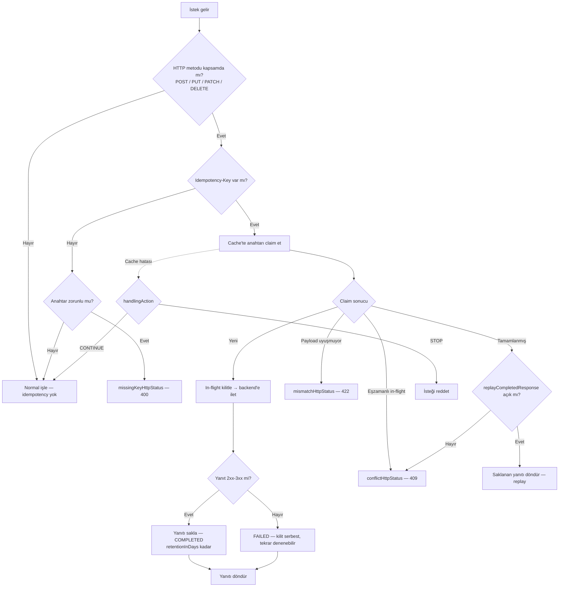

import {Card, CardGroup} from '@site/src/components/Card';

## Ayarlar Sekmesi

[API Proxy](/tr/concepts/temel-kavramlar/api-proxy-nedir) için CORS, Cache, XML Hata Mesaj Şablonları, İletilen IP Başlık Parametreleri, ProCrypt Entegrasyonu, API Tanım Dosyası Erişim Kontrolü ve Bakım Modu ayarlarının yapıldığı bölümdür. Bu ayarlar [mesaj işleme ve politika uygulama](/tr/concepts/temel-kavramlar/mesaj-isleme-ve-politika-uygulama) sürecinde kullanılır.

**Not:** API trafik günlüğü (log) alanları bu sekmede değil, API Proxy ekranındaki **Log Ayarları** sekmesinde yönetilir.

:::info

Eğer ayarların üzerinde "Global Ayarlar aktif" şeklinde bir uyarı yer alıyorsa bu API Proxy'nin bir Global Settings kaydına bağlı olduğunu ve bu paneldeki ayarların ilgili Global Settings üzerinden yönetildiğini ifade eder. Uyarının üzerine tıklandığında ilgili ayara gidilir.

:::

## CORS Ayarları

[CORS (Cross-Origin Resource Sharing)](https://en.wikipedia.org/wiki/Cross-origin_resource_sharing) ayarlarının yapıldığı bölümdür.

Bu alan aktifleştirildiğinde **Yapılandır** _(Configure)_ butonu aktif olur ve ilgili ayarları içeren ekranın açılmasını sağlar.

### CORS Ayarları Alanları

| Alan | Açıklama |
|---|---|
| **İstek Başlıkları** _(Request Headers)_ | |
| Origin | Preflight isteğin gönderildiği orijin (domain, protocol, port) bilgisi yer alır. |
| Access-Control-Request-Method | Preflight isteği ile asıl istekte gönderilecek olan HTTP metodu belirtilir. |
| Access-Control-Request-Headers | Preflight isteği ile asıl istekte gönderilecek olan HTTP başlıkları belirtilir. |
| Access-Control-Max-Age | Preflight isteğine ait cevabın başka bir preflight isteği göndermeden ne kadar süre önbellekte kalacağı saniye olarak verilir. |
| Access-Control-Allow-Headers | API Proxy'nin erişim için izin verdiği başlık değerleri girilir. Eğer preflight istekte Access-Control-Request-Headers belirtilmiş ise cevap üzerinde bu başlık yer alır. Asıl istekte hangi HTTP başlıklarının kullanılabileceği bilgisini içerir. |
| Access-Control-Allow-Methods | Sunucuya erişim gerçekleştirilirken izin verilen HTTP metodu veya metotları yer alır. API Proxy'nin erişim için izin verdiği metotlar listeden işaretlenerek seçilir: GET, POST, PUT, HEAD, OPTIONS, DELETE, PATCH, TRACE, ALL, QUERY |
| **Yanıt Başlıkları** _(Response Headers)_ | |
| Access-Control-Allow-Origin | API Proxy'nin izin verdiği orijin değerleri girilir. Eğer bu alana `*` değeri girilirse tüm orijinler istek gönderebilir. |
| Access-Control-Allow-Credentials | Asıl istekte kimlik bilgilerinin olup olmadığı değeri girilir. |
| Access-Control-Expose-Headers | İstemcilerin erişebileceği diğer başlıklar girilir. |

:::info

Ön tanımlı mevcut olan Orijin ve Başlık değerlerine yenilerine eklemek için [CORS Orijin Değerleri](/tr/admin/system-settings/on-tanimli-degerler/cors-orijin-degerleri) ve [CORS Başlıkları](/tr/admin/system-settings/on-tanimli-degerler/cors-basliklari) sayfalarını ziyaret edebilirsiniz.

:::

## Önbellek Ayarları

API Proxy'den dönen yanıtlar ön belleğe alınarak istemciden gelen istekler Backend API'ye gönderilmeden önbellekten yanıtlanabilir. Buna ilişkin ayarların yönetildiği bölümdür. Önbellek anahtarı oluştururken [variable](/tr/concepts/temel-kavramlar/variable) kullanılabilir.

:::note
Yalnızca başarılı yanıtlar önbelleğe alınır: durum kodu `400` ve üzerindeki (4xx/5xx) hata yanıtları hiçbir zaman önbelleğe alınmaz, her istekte Backend API'den taze olarak üretilir.
:::

### Önbellek Ayarları Alanları

| Alan | Açıklama |
|---|---|
| **Sadece HTTP Get İsteklerini Önbelleğe Al** _(Cache only HTTP Get Requests)_ | Bu seçenek aktifleştirilirse yalnızca HTTP Get isteklerinin yanıtları önbelleğe alınır. |
| **Önbellek Anahtar Tipi** _(Cache Key Type)_ | Önbellek Anahtar Tipi için iki seçenek vardır:  • **Query Parametreleri Kullan** _(Use Query Params)_: Önbelleğe alma işlemi için oluşturulacak olan anahtarın istekteki HTTP Query parametrelerine göre belirlenmesi için kullanılır. Örneğin sorgu parametresi `/metodAdı?param1=value1&param2=value2` şeklinde olduğunda önbellekte tutulacak anahtar `param1=value1&param2=value2` değerinden oluşur ve bir daha istek bu şekilde geldiğinde önbellekteki sonuç döner.  • **Özel Anahtar Oluştur** _(Create Custom Key)_: Önbelleğe alma işlemi için oluşturulacak olan anahtarın istekteki seçilecek alanlar ile oluşturulması için kullanılır. Bu değer seçildiğinde "Değişken Listesi" tablosunda belirtilecek alanlar ile anahtar oluşturulur. |
| **Kapasite** _(Capacity)_ | Önbellekte saklanabilecek maksimum yanıt sayısıdır. Bu alan zorunludur. |
| **Önbellek Geçersizleme İçin Yetki Gerekir** _(Invalidation Requires Authn)_ | Header'da Cache-Control anahtarına `no-cache`, `no-store` veya `max-age=0` değerlerinden biri gönderilerek, mevcut önbellek geçersiz hale getirilebilir. Önbelleği geçersiz kılmak için yetkilendirme gerekiyorsa bu alan seçilir. |
| **Yetkisiz İsteklerin Ele Alınması** _(Handling Action)_ | Önbelleği geçersiz kılmak için yetkilendirme gerekiyorsa yetkisiz istekler için yapılacak işlem seçilir:  • **DEVAM ET** _(Continue)_: Bu seçenek seçilirse, Cache-Control başlık bilgisinde `no-cache`, `no-store` veya `max-age=0` değerlerinden biri gönderildiğinde eğer gönderen kişi yetkilendirilmemiş ise bu değer gönderilmemiş gibi çalışmasına devam eder.  • **DUR** _(Stop)_: Bu seçenek seçilirse, Cache-Control başlık bilgisinde `no-cache`, `no-store` veya `max-age=0` değerlerinden biri gönderildiğinde eğer gönderen kişi yetkilendirilmemiş ise akışı durdurur ve hata mesajı döner.  Bu alan "Önbellek Geçersizleme İçin Yetki Gerekir" seçeneği işaretlendiğinde aktif hale gelir. |
| **Depolama Tipi** _(Storage Type)_ | Önbellek verilerinin saklanma şeklini belirler:  • **Local** _(Yerel)_: Önbellek verileri sadece ilgili Gateway node'unda saklanır.  • **Distributed** _(Dağıtık)_: Önbellek verileri tüm Gateway node'ları arasında paylaşılır ve senkronize edilir.  Bu alan zorunludur. |
| **TTL (saniye)** _(TTL - seconds)_ | Önbelleğe alınan yanıtın geçerli olacağı süre saniye olarak girilir. Bu alan zorunludur. |
| **Null/Boş Değerleri Önbelleğe Al** _(Cache Null Value)_ | Boş değerlerin de önbelleğe alınması isteniyorsa işaretlenir. |

## Idempotency Ayarları

Idempotency (eş-etkinlik), bir istemcinin durum değiştiren bir isteği iki kez uygulanma riski olmadan güvenle yeniden denemesini sağlar. İstemci istekle birlikte benzersiz bir **`Idempotency-Key`** gönderir; Apinizer bu anahtarı dağıtık önbelleğe kaydeder, ilk isteği iletir, yanıtını saklar ve aynı anahtarı taşıyan sonraki istekler için Backend'e gitmek yerine saklanan yanıtı döndürür. Böylece ağ tekrarları, çift tıklama veya istemci-tarafı retry'lardan kaynaklanan mükerrer gönderimlere karşı koruma sağlanır.

:::note
Idempotency yalnızca yapılandırılan HTTP metotlarına uygulanır (varsayılan `POST`, `PUT`, `PATCH`, `DELETE`). Yalnızca başarılı yanıtlar (`2xx`–`3xx`) tamamlanmış olarak saklanır; `4xx`/`5xx` sonuç anahtarı serbest bırakır, böylece istek yeniden denenebilir.
:::

### Bir istek nasıl ele alınır

### Idempotency Ayarları Alanları

| Alan | Açıklama |
|---|---|
| **Idempotency Aktif** _(Idempotency Active)_ | Ana anahtar. Kapalıyken (varsayılan) hiçbir idempotency işlemi çalışmaz. |
| **Anahtar Tipi** _(Key Type)_ | Idempotency anahtarının kaynağı: **Header** (varsayılan, aşağıdaki başlıktan okunur) veya **Custom** (seçilen istek değişkenlerinden birleştirilerek üretilir). |
| **Başlık Adı** _(Header Name)_ | Anahtar Tipi = Header iken anahtarı taşıyan istek başlığı. Varsayılan `Idempotency-Key`. |
| **Değişken Listesi** _(Variable List)_ | Anahtar Tipi = Custom iken anahtarı oluşturan istek değişkenleri. |
| **Anahtar Zorunlu** _(Key Required)_ | Açıkken anahtarsız istek *Eksik Anahtar HTTP Durumu* ile reddedilir. Kapalıyken anahtarsız istekler idempotency olmadan geçer. |
| **Eksik Anahtar HTTP Durumu** _(Missing Key HTTP Status)_ | Anahtar zorunlu ama yokken dönen durum. Varsayılan `400`. |
| **Kapsamdaki HTTP Metotları** _(Applicable HTTP Methods)_ | Idempotency'nin uygulandığı metotlar. Varsayılan `POST`, `PUT`, `PATCH`, `DELETE`. |
| **Payload Hash** _(Payload Hash)_ | Açıkken (varsayılan) istek gövdesi hash'lenip anahtarla saklanır; aynı anahtarı **farklı** gövdeyle yeniden kullanan istek uyuşmazlık olarak reddedilir. |
| **İşleme Zaman Aşımı (saniye)** _(Processing Timeout)_ | In-flight kilidinin terk edilmiş sayılmadan önce tutulma süresi. Varsayılan `60`. |
| **Saklama Süresi (gün)** _(Retention in Days)_ | Tamamlanmış yanıtın replay için saklanma süresi (1–30, varsayılan `7`). |
| **Depolama Tipi** _(Storage Type)_ | **Local** (yalnız bu Gateway node'u) veya **Distributed** (node'lar arası paylaşılır, varsayılan). |
| **Cache Bağlantı Zaman Aşımı (saniye)** _(Cache Connection Timeout)_ | Idempotency önbelleğine bağlanma zaman aşımı. Varsayılan `3`. |
| **Cache Hatası Aksiyonu** _(Cache Error Action)_ | Önbelleğe ulaşılamadığında: **Devam Et** isteği idempotency olmadan geçirir, **Dur** reddeder. |
| **Conflict HTTP Durumu** _(Conflict HTTP Status)_ | Aynı anahtar hâlâ işlenirken (eşzamanlı mükerrer) dönen durum. Varsayılan `409`. |
| **Mismatch HTTP Durumu** _(Mismatch HTTP Status)_ | Anahtar farklı payload ile yeniden kullanıldığında dönen durum. Varsayılan `422`. |
| **Tamamlanan Yanıtı Replay Et** _(Replay Completed Response)_ | Açıkken (varsayılan) tamamlanmış bir isteğin mükerreri saklanan yanıtı alır. Kapalıyken mükerrer istek *Conflict HTTP Durumu* ile reddedilir. |
| **Özel Hata Gövdeleri** _(Custom Error Bodies)_ | Eksik-anahtar, conflict ve mismatch durumları için yanıt gövdesi ve content type özelleştirilebilir; her gövde ayrıca kapatılıp yalnız durum kodu döndürülebilir. |

## XML Hata Yanıt Şablonunu Özelleştirme

:::info

Hata yanıt şablonlarının çok katmanlı yapılandırma sistemi içindeki yeri, öncelik sırası ve senaryo örnekleri için [Hata Mesajı Yapılandırma Rehberi](/tr/concepts/temel-kavramlar/hata-mesaji-yapilandirma) sayfasına bakın.

:::

API Proxy'den istemciye herhangi bir hata döndürüleceği zaman kullanılacak olan yanıt şablonlarının hazırlanması için kullanılır.

Herhangi bir şablon aktifleştirildiğinde varsayılan şablon görüntülenir ve istenirse özelleştirilebilir.

Bu alan aktifleştirildiğinde **Yapılandır** _(Configure)_ butonu aktif olur ve ilgili ayarları içeren ekranın açılmasını sağlar.

### XML Hata Yanıt Şablonu Ayarları

| Alan | Açıklama |
|---|---|
| **Yanıt Mesajında Özel Karakterlere İzin Ver** _(Permit Special Chars in Response Message)_ | Yanıtın hata mesajının içinde bulunabilecek özel karakterler XML mesaj yapısını bozabilir. Bunlara izin verilip verilmeyeceğini belirler. |
| **XML** | XML tipindeki hata şablonu bu alanda düzenlenebilir. |
| **İçerik Tipi** _(Content Type)_ | Döndürülecek yanıtın içerik tipidir. |

## JSON Hata Yanıt Şablonunu Özelleştirme

Aktifleştirildiğinde, istemci, döndürülen hatayı verilen JSON yanıt şablonunda görüntüler.

Bu alan aktifleştirildiğinde **Yapılandır** _(Configure)_ butonu aktif olur ve ilgili ayarları içeren ekranın açılmasını sağlar.

### JSON Hata Yanıt Şablonu Ayarları

| Alan | Açıklama |
|---|---|
| **Yanıt Mesajında Özel Karakterlere İzin Ver** _(Permit Special Chars in Response Message)_ | Yanıtın hata mesajının içinde bulunabilecek özel karakterler JSON mesaj yapısını bozabilir. Bunlara izin verilip verilmeyeceğini belirler. |
| **JSON** | JSON tipindeki hata şablonu bu alanda düzenlenebilir. |
| **İçerik Tipi** _(Content Type)_ | Döndürülecek yanıtın içerik tipidir. |

### Yer Tutucular (Placeholders)

Yanıt şablonlarının içerisinde `#...#` şeklindeki değerler, hata mesajının ilgili kısmının koyulacağı yer tutucular _(placeholders)_ olarak kullanılır.

| Yer Tutucu | Açıklama |
|---|---|
| `#CORRELATIONID#` | Apinizer, gelen her istek için biricik (unique) bir anahtar oluşturarak isteğin akış boyunca izlenebilmesini sağlar. Bu anahtarı kullanılarak örneğin uygulamaların log kayıtları ile Apinizer üzerindeki log kayıtlarının ilişkilendirilerek takip edilmesi mümkün hale gelir. |
| `#FAULTCODE#` | İstemciye döndürülecek hata kodunun yanıt mesajı içinde koyulacağı yeri belirler. |
| `#FAULTMESSAGE#` | İstemciye döndürülecek hata iletisinin yanıt mesajı içinde koyulacağı yeri belirler. |
| `#FAULTMESSAGE_FIRSTLINE#` | İstemciye döndürülecek hata iletisinin ilk satırı veya ilk 150 karakteri alınarak, yanıt mesajı içine koyulur. |
| `#FAULTSTATUSCODE#` | İstemciye döndürülecek HTTP Durum Kodunun yanıt mesajı içinde koyulacağı yeri belirler. |
| `#RESPONSEFROMAPI#` | Backend API'den dönen bir yanıt varsa, bu yanıtın istemciye döndürülecek yanıt mesajı içinde koyulacağı yeri belirler. |
| `#RESPONSEFROMAPI_FIRSTLINE#` | Backend API'den dönen bir yanıtın ilk satırı veya ilk 150 karakteri alınarak, istemciye döndürülecek yanıt mesajı içine koyulur. |

:::info

İstenirse her iki şablon da aktifleştirilebilir. Her iki şablon da aktifse hangisinin kullanılacağına şu kriterlere göre karar verilir:

1. Content-Type başlığının içeriği JSON ise JSON Hata Yanıt Şablonu kullanılır.
2. Content-Type başlığının içeriği boş ve API Proxy'nin tipi REST ise JSON Hata Yanıt Şablonu kullanılır.
3. Bunların geçerli olmadığı durumda XML Hata Yanıt Şablonu kullanılır.

:::

:::warning

Eğer her iki şablon da aktifleştirilmemişse ya da hatanın nedeni API Proxy'nin bulunamamış olması ise (adres yanlış olabilir, API Proxy yüklenmemiş olabilir) bu durumda, `text/plain;charset=utf-8` başlığı ile şu yanıt gövdesi döner:

`[#CORRELATIONID#],[#FAULTCODE#],[#FAULTMESSAGE#],[#FAULTSTATUSCODE#],[#RESPONSEFROMAPI#]`

:::

:::info

Eğer API Proxy'nin [Yönlendirme (Routing)](/tr/develop/yonlendirme/http-yonlendirme) sekmesinde, "Hedef API'den Hata Dönmesi Durumunda Yanıt Şablonunu Uygulama (Ignore Error Response Template In Case Of Error On Backend API)" seçeneği işaretlenmiş ise bu bölümde tanımlanmış olan şablonlar kullanılmaz, Backend API'nin hata yanıtı olduğu gibi istemciye gönderilir.

:::

## İletilen IP Başlık Ayarı

Eğer API Proxy bir Yük Dengeleyici (Load Balancer) ya da Vekil Sunucunun (Proxy Server) arkasındaysa, istemciden gelen istek API Proxy'e bu katman tarafından yönlendirileceği için istemcinin IP değeri API Proxy ya da Backend API tarafından bilinemez. Bu nedenle, Yük Dengeleyici ya da Vekil Sunucular, orijinal istemcinin IP değerini bir başlık ile iletebilirler. İletilen IP Başlık Parametreleri ayarı, yazılım/donanıma göre değişiklik gösterebilen bu başlığın adının belirtilerek istemci IP'sinin API Proxy ve Backend API tarafından erişilebilir olmasını sağlar.

**İletilen IP Başlığı Ayarlarını Yapılandırma ekranına ait görsele aşağıda yer verilmiştir:**

### İletilen IP Başlığı Ayarları

| Alan | Açıklama |
|---|---|
| **İletilen IP Başlığı** _(Forwarded IP Header Parameter)_ | Eğer istemci bir Yük Dengeleyici ya da Geçit Sunucu arkasındaysa, bu parametre kullanılarak istemcinin gerçek IP numarasına ulaşılır. |
| **Kullanılacak IP** _(IP to Use)_ | İstek birden fazla vekilden geçmiş ise XFF değeri içinde birden fazla IP adresi birikebilir. Bu durumda hangi adresin alınacağına bu alan ile karar verilir. |

## API Tanım Dosyası Erişim Kontrolü

API Proxy'nin dış erişim adresi üzerinden API Tanım dosyasına (WSDL, OpenAPI, XSD) erişimi dört farklı seviyede kontrol edebilirsiniz. Bu ayarın Yönetim Konsolu üzerinden gözüken tanım dosyaları için bir etkisi yoktur.

| Erişim Türü | Açıklama |
|---|---|
| **Herkese Açık** | Herkes kimlik doğrulaması olmadan tanım dosyasına erişebilir. |
| **Kimlik Doğrulama Gerekli** | Tanım dosyasına erişmek için geçerli bir kullanıcı adı ve şifre ile Basic Auth kimlik doğrulaması gerekir. Tarayıcıdan erişildiğinde otomatik olarak kimlik bilgisi giriş ekranı açılır. |
| **Gizli** | Tanım dosyasına erişim tamamen engellenir. |
| **Backend Proxy** | Tanım dosyasına erişim isteği Backend API'ye yönlendirilerek gerçek tanım dosyası Backend API üzerinden sunulur. |

:::info

**Kimlik Doğrulama Gerekli** seçeneğinde ek olarak **İstemci için ACL Kontrol Et** seçeneğini etkinleştirebilirsiniz. Bu durumda yalnızca ilgili API Proxy'ye erişim izni olan istemciler tanım dosyasını görüntüleyebilir.

:::

:::warning

API Proxy bir Proxy Grup içinde ise ve erişim türü **Gizli** olarak ayarlanmışsa, Proxy Grup tanım dosyasında bu API Proxy'nin tanımı gözükmez. Proxy Gruptaki tüm API Proxy'lerin erişim türü Gizli ise kullanıcı erişim hatası alır.

:::

:::info

API Proxy tanım dosyalarına erişim için [Genel Bilgi Sekmesi](/tr/develop/api-proxy-konfigurasyonu/overview) sayfasını ziyaret edebilirsiniz.

:::

## API Bakım Modu

Bakım Modu özelliği, etkinleştirildiğinde, API şu anda bakımda olduğunu belirten bir mesaj döndürecektir. API önceden tanımlanmış bir HTTP durum kodu ve mesaj yapısı ile yanıt verir.

**Bakım Modu Ayarlarını Yapılandırma ekranına ait görsele aşağıda yer verilmiştir:**

### Bakım Modu Ayarları

| Alan | Açıklama |
|---|---|
| **HTTP Durum Kodu** _(HTTP Status Code)_ | Varsayılan HTTP durum kodudur. |
| **Mesaj** _(Message)_ | Mesaj şablonu bu alanda düzenlenebilir. |
| **İçerik Tipi** _(Content Type)_ | Döndürülecek yanıtın içerik tipidir. |

## Sonraki Adımlar

<CardGroup cols={2}>
  <Card title="Genel Bilgi Sekmesi" icon="info-circle" href="/tr/develop/api-proxy-konfigurasyonu/overview">
    API Proxy genel bilgileri
  </Card>
  <Card title="Design" icon="pencil" href="/tr/develop/api-proxy-konfigurasyonu/design">
    API Proxy tasarım sekmesi
  </Card>
  <Card title="Endpoint Konfigürasyonu" icon="link" href="/tr/develop/api-proxy-konfigurasyonu/endpoint-konfigurasyonu">
    REST endpoint konfigürasyonu
  </Card>
  <Card title="SOAP Metod Konfigürasyonu" icon="code" href="/tr/develop/api-proxy-konfigurasyonu/soap-metod-konfigurasyonu">
    SOAP metod konfigürasyonu
  </Card>
  <Card title="API Trafik Log Ayarları" icon="database" href="/tr/develop/api-proxy-konfigurasyonu/api-trafik-log-ayarlari">
    API Proxy trafik log ayarları
  </Card>
</CardGroup>
