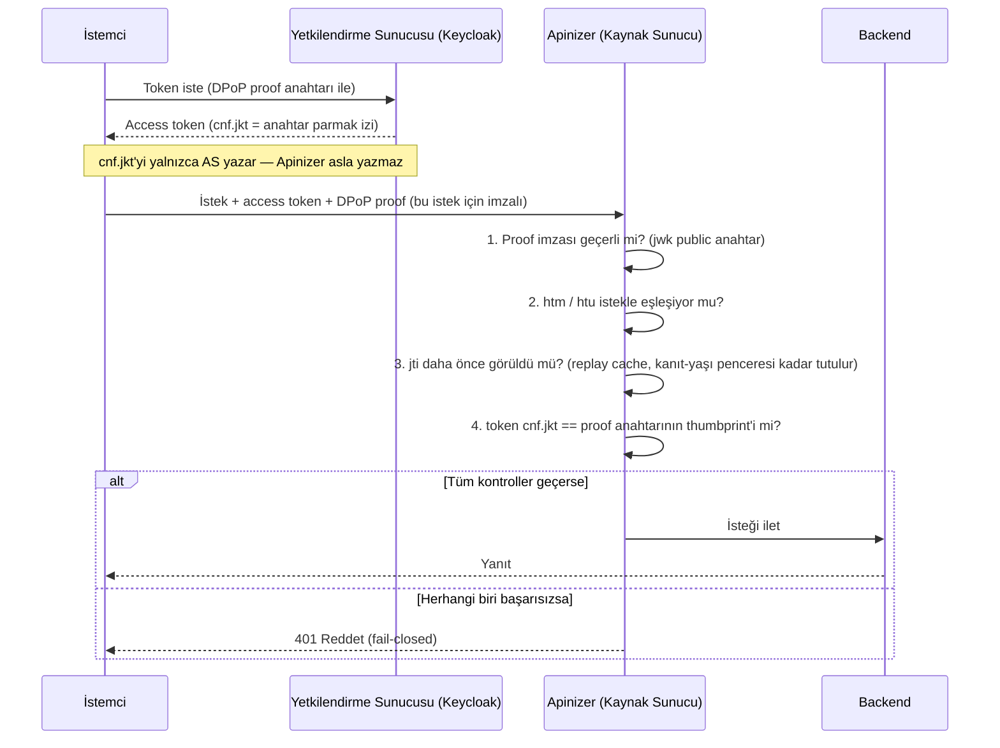

:::tip

Bu doküman spesifik bir politikanın detaylı kullanımını anlatır. Eğer Apinizer politika yapısını ilk kez kullanıyorsanız veya politikaların genel çalışma prensiplerini öğrenmek istiyorsanız, öncelikle [Politika Nedir?](/tr/concepts/temel-kavramlar/politika-nedir) sayfasını okumanızı öneririz.

:::

## Genel Bakış

### Amacı Nedir?

- API Proxy (API Vekil Sunucusu) akışına giren JOSE/JWT tokenlarını doğrulayarak kimlik bilgilerinin güvenilirliğini garanti altına almak üzere tasarlanmıştır.
- Belirlenen issuer, audience ve claim kurallarını zorunlu tutarak yetkisiz erişimlerin önüne geçer ve hassas endpoint'lerin korunmasını sağlar.
- Şifrelenmiş JWE içeriklerini güvenli şekilde çözerek aşağı akış servislerine temizlenmiş veri aktarımı sunar.
- Kimlik ve rol bilgisini header seviyesinde yayarak downstream servislerde merkezi yetkilendirme politikaları ile entegre çalışır.

### Çalışma Prensibi

1. **İstek Gelişi**: API Gateway'e gelen her HTTP/HTTPS isteği için, istemin kaynak IP adresi tespit edilir.
2. **Politika Kontrolü**: JOSE Doğrulama politikası aktif ise, sistem aşağıdaki sırayla kontrol yapar:
- Condition (koşul) tanımlı mı? Varsa koşul sağlanıyor mu?
- Politika aktif mi (active=true)?
- Variable kullanılıyor mu yoksa Apinizer default mı?
3. **JOSE İçeriği Çözümleme**: Token belirlenen kaynaktan (body, Authorization header veya değişken) okunur; gerekiyorsa seçilen anahtar kaynağına (Gömülü JWK veya Dinamik HTTP) göre şifre çözümü yapılır ve claim seti doğrulamaya hazırlanır.
4. **Karar Verme**:
- **Eşleşme Var**: İmza/şifreleme geçerli ise, claim ve audience kuralları sağlanırsa ve issuer ACL onaylanırsa istek akışa devam eder, gerekirse kullanıcı bilgisi header'a eklenir.
- **Eşleşme Yok**: Token çözülemezse, imza doğrulanamazsa, claim kuralları ihlal edilirse veya ACL reddi oluşursa istek politika tarafından sonlandırılır.
5. **Hata İşleme**: Politika kuralına uymayan istekler için özelleştirilebilir HTTP durum kodu ve hata mesajı döndürülür.

## Özellikler ve Yetenekler

### Temel Özellikler

- **Esnek JOSE Hedefi**: Token; gövde (Gövde), Authorization başlığı (Authorization Başlığı) veya seçilen değişkenden (Değişkenden Seç) okunabilir; değişken senaryolarında değişken seçici ile atanır.
- **İstemci Kaynağı (Client Source)**: Issuer/istemci bilgisinin okunacağı kaynak: Başlık, Claim'ler veya Değişken. Değişken seçiliyse Client Source Variable zorunlu; aksi halde Client Fieldname (JSON Path veya claim adı, örn. `iss`) zorunludur.
- **Granüler Claim Doğrulaması**: Accepted audience listesi, Exact Match Claim (anahtar-tür-değer), Required Claim ve Prohibited Claim listeleri ile çok katmanlı doğrulama kurgulanır.
- **Kimlik ve Rol Yayılımı**: İstekten çıkarılan kullanıcı kimliği Add User to Header ile header’a eklenebilir (User Header Name zorunlu); merkezi yetki kontrolü desteklenir.
- **Aktif/Pasif Durum Kontrolü**: Politikanın aktif veya pasif durumunu kolayca değiştirme (active/passive toggle). Pasif durumda politika uygulanmaz ancak yapılandırması saklanır.
- **Koşul Bazlı Uygulama**: Query Builder ile karmaşık koşullar oluşturarak politikanın ne zaman uygulanacağını belirleme (örn: sadece belirli endpoint'lere veya header değerlerine göre).

### İleri Düzey Özellikler

- **Anahtar Kaynağı Modu (Key Source Mode)**: İmza doğrulama ve şifre çözme için anahtar **Gömülü** (Secret Manager’daki JWK) veya **Dinamik HTTP** (HTTP isteği ile uzaktan anahtar çekme) olarak seçilebilir.
- **Dinamik Anahtar Çekme (Dynamic Key Fetching)**: Dinamik HTTP seçildiğinde HTTP İstek Yapılandırması (Test Console), Anahtar Çıkarma Değişkeni (Key Extraction Variable), Anahtar Formatı, Anahtar Algoritması, Kid (Key ID), önbellek ayarları (Uygula Kriteri, Kapasite, TTL, Önbellek Depolama Tipi, Cache Geçersiz Kılma Başlıklarına Uy, Bağlantı Zaman Aşımı, Cache Hata İşleme Tipi), Anahtar Hatasında Tekrar Dene, Doğrulama Hatasında Cache'i Geçersiz Kıl ve **Yanıtı Ayrıştır (Try It)** butonu ile test edilebilir. Aynı HTTP isteğinde **Settings** sekmesinden güvenli bağlantı (mTLS/SSL) ayarlarını açıp **Yapılandır** ile düzenleyebilirsiniz; alan ayrıntıları [Test Console](/tr/develop/test-debug-araclari/test-console#ayarlar) ile uyumludur.
- **JWK Yaşam Döngüsü Yönetimi**: Gömülü modda imza ve şifreleme anahtarları Secret Manager üzerinden seçilir veya yeni anahtar oluşturulur; gerekli roller yeni anahtar tanımlayabilir.
- **Issuer ACL ve IP Kontrolü**: Validate ACL for Issuer ile issuer bazlı izin listesi; Check Client IP Address ile isteği yapan istemci IP doğrulaması (politika listesi türü ve validateACLforIssuer açıkken görünür).
- **Claim Decode ve Yeniden Yazma**: Strip and Decode (Yok, Tümü, Kısmi) ile JWT/JWE payload’u yalıtılıp decode edilebilir; PARTIAL ise Decode Edilecek Claim (jwtClaimsToDecode) zorunlu. Decoded Claims Target (Gövde, Authorization Başlığı, Değişkenden Seç) ve gerekirse Decoded Claims Target Variable ile çıktı yönlendirilir.
- **Yetkilendirme Yapılandırması**: Politika listesi türü Request, politika global değil ve Validate ACL for Issuer açıkken **Authorization Configuration** bileşeni görünür; rol bazlı erişim ve method access yapılandırılır.
- **Export/Import Özelliği**: Politika yapılandırmasını ZIP dosyası olarak export etme. Farklı ortamlara (Geliştirme, Test, Canlı Ortam) import etme. Versiyon kontrolü ve yedekleme imkanı.
- **Policy Group ve Proxy Group Desteği**: Birden fazla politikayı Policy Group içinde yönetme. Proxy Group'lara toplu politika atama. Merkezi güncelleme ve deploy işlemleri.
- **Deploy ve Versiyonlama**: Politika değişikliklerini canlı ortama deploy etme. Hangi API Proxy'lerde kullanıldığını görme (Policy Usage). Proxy Group ve Policy Group kullanım raporları.
- **DPoP ile Gonderen-Kisitli Dogrulama (RFC 9449)**: Access token'in yalnizca onu ureten istemci tarafindan kullanilmasini saglar; calinan bir token baska istemci tarafindan kullanilamaz. Ayrinti icin [DPoP Dogrulamasi](#dpop-dogrulamasi-gonderen-kisitli-erisim) bolumune bakin.

## Kullanım Senaryoları

| Senaryo | Durum | Çözüm (Politika Uygulaması) | Beklenen Davranış / Sonuç |
|---------|-------|----------------------------|---------------------------|
| Mobil JWT Doğrulama | Mobil uygulama Authorization header'da JWT taşır | `joseTarget=Authorization Başlığı`, `validateSign=true`, issuer JWKS veya Embedded JWK kullan | Geçerli token kabul edilir, hatalı imzalar 401 döndürür |
| IoT JWE Çözümü | IoT cihazları şifreli payload gönderir | `decrypt=true`, `decryptByIssuer=false`, Key Source Mode ile Gömülü veya Dinamik HTTP, encryption JWK seç | Payload çözülür, içerik downstream servislere aktarılır |
| Issuer Beyaz Listeleme | Belirli issuer değerleri dışında erişim istenmez | `clientSourcePart=CLAIMS`, `clientFieldname=iss`, exact match map ile liste | Uyumsuz issuer istekleri 403 ile engellenir |
| Audience Segmentasyonu | Mikroservisler farklı audience bekler | `acceptedAudienceList` ortam bazlı doldur | Yanlış audience içeren istekler özelleştirilmiş hata alır |
| Kullanıcı Header Enjeksiyonu | Downstream servisler kimlik header'ı ister | `addUserToHeader=true`, `userHeaderName=X-Authenticated-UserId` | Kimlik bilgisi güvenli şekilde başlıkta iletilir |
| Yetkilendirme Entegrasyonu | Rol bazlı erişim denetimi gerekir | `enableAuthorization=true`, Authorization Configuration bileşeninde method access yapılandır | İstek, rol eşleşmesi sağlanmazsa politika tarafından durdurulur |
| Uzaktan Anahtar ile Doğrulama/Şifre Çözme | Anahtar bir HTTP endpoint’ten alınacak | Key Source Mode = DYNAMIC_HTTP, HTTP Request ve Key Extraction Variable tanımlanır, Try It ile test edilir | Çalışma anında anahtar uzaktan çekilir ve cache’lenebilir |
| Policy Group Senkronizasyonu (opsiyonel) | Aynı kurallar çoklu API Proxy'de kullanılacak | Global politika oluştur, Policy Group'a ekle | Tek değişiklikle tüm API Proxy'lerde politika güncellenir |
| DPoP ile Gonderen-Kisitli Token | Calinan token'in baska istemcide kullanilmasi engellenmek istenir | `enableDpop=true`, `dpopValidateCnfBinding=true` | Kanit ve token bagi dogrulanir; eslesmeyen veya yeniden oynatilan kanitlar 401 dondurur |

## Politika Parametrelerini Yapılandırma

Bu adımda, kullanıcı **yeni bir politika oluşturabilir** ya da **mevcut politika parametrelerini yapılandırarak** erişim kurallarını belirleyebilir. Tanımlanan parametreler, politikanın çalışma şeklini (hangi kaynaktan token okunacağı, claim/audience kuralları, imza/şifre çözme kaynağı, ACL ve yetkilendirme vb.) doğrudan etkiler. Bu sayede politika hem kuruma özel gereksinimlere göre özelleştirilebilir hem de merkezi olarak yönetilebilir.

### Yeni JOSE Doğrulama Politikası Oluşturma

### Yapılandırma Adımları

| Adım | Açıklama / İşlem |
|------|------------------|
| **Adım 1: Oluşturma Sayfasına Gitme** | - Sol menüden **Development → Global Settings → Global Policies → JOSE Doğrulama Politikası** bölümüne gidin. - Sağ üstteki **[+ Create]** butonuna tıklayın. |
| **Adım 2: Temel Bilgileri Girme (Definition sekmesi)** | **Policy Status (Politika Durumu):** Aktif veya Pasif durumu gösterir. Yeni politikalar varsayılan olarak aktiftir. Toggle ile değiştirilebilir.  **Name (Ad) — Zorunlu:** Örnek: `Production_JOSEValidation`. Benzersiz isim girin; boşlukla başlamaz; max 255 karakter. Sistem otomatik kontrol eder: yeşil tik = kullanılabilir, kırmızı çarpı = mevcut isim.  **Description (Açıklama):** Örnek: "JWT imza ve şifreleme doğrulaması yapar." Maks. 1000 karakter; politikanın amacını açıklar. |
| **Adım 3: Variable Kullanımı** | - Sayfanın üst kısmındaki işlem butonları alanında, **[&lt;&gt; Variable]** butonunu kullanarak dinamik değer seçebilirsiniz. - Context/global variable ifadeleri sayesinde politika parametrelerini sabit değer yerine değişken tabanlı yönetebilirsiniz. - Bu kullanım, değişen değerlerde manuel güncelleme ihtiyacını azaltır ve operasyonel kolaylık sağlar. - Detaylı bilgi için [Dinamik Değişkenler](/tr/concepts/temel-kavramlar/dinamik-degiskenler) sayfasını inceleyebilirsiniz. |
| **Adım 4: Politika Yapılandırması — JOSE Kaynağı ve İstemci Bilgisi** | **JOSE Target (Doğrulama/Şifre Çözme için Hedef) — Zorunlu:** Token'ın nereden okunacağını belirler. Gövde = istek gövdesinden, Authorization Başlığı = `Authorization` header'ından, Değişkenden Seç = bir proje değişkeninden okunur. Kullanım senaryonuza göre birini seçin; örn. çoğu JWT `Authorization: Bearer <token>` ile gelir, bu durumda Authorization Başlığı seçilir.  **JOSE Target Variable — Koşullu (sadece Hedef = Değişkenden Seç iken):** Token değerinin tutulduğu proje değişkenini işaret eder; politika çalışırken token bu değişkenden okunur. Başka bir politika veya akış önceden token'ı bu değişkene yazmış olmalıdır. Değişken Seç ile proje değişkeni atayın; Güncelle ile değişken tanımını düzenleyebilirsiniz.  **Client Source Part — Zorunlu:** Issuer/istemci kimliğinin nereden alınacağını seçersiniz: Başlık = HTTP header'dan, Claim'ler = JWT içindeki claim'den, Değişken = proje değişkeninden. Multi-tenant’ta genelde Claim'ler ve `iss` kullanılır.  **Client Source Variable — Koşullu (sadece Client Source Part = Değişken iken):** Issuer bilgisinin hangi değişkenden okunacağını belirtir. Bu değişkenin değeri (örn. issuer URL’si) ACL ve anahtar eşleştirmede kullanılır. Proje değişkeni seçin.  **Client Fieldname — Koşullu (Client Source Part = Başlık veya Claim'ler iken):** Issuer bilgisinin hangi alan adıyla okunacağını tanımlar. JWT kullanıyorsanız genelde `iss` yazın; token’daki `iss` claim’i okunur. Header’dan okuyacaksanız header adını (örn. `X-Tenant-Id`) veya JSON Path (örn. `$.header.tenant_id`) girebilirsiniz. Bu değer, doğrulama ve issuer bazlı anahtar/ACL seçiminde kullanılır. |
| **Adım 5: Claim Doğrulama Ayarları (Claim paneli)** | **Accepted Audience List:** Token’daki `aud` claim’inin bu listedeki değerlerden en az biriyle eşleşmesini zorunlu kılar; eşleşmezse doğrulama başarısız olur. Metin kutusuna örn. `https://api.sizin-alan.com` yazıp onaylayın; chip olarak eklenir. Birden fazla audience ekleyebilirsiniz. Boş bırakırsanız audience kontrolü yapılmaz.  **Exact Match Claim Map:** Belirli claim adları için tam eşleşme (anahtar + tip + değer) zorunlu kılar; token’da bu claim’ler aynı değerde olmalıdır. **+** ile satır ekleyin; Key = claim adı (örn. `role`), Value Type = STRING/NUMBER/BOOLEAN vb., Value = beklenen değer. İstekte bu claim yoksa veya değer farklıysa doğrulama reddedilir.  **Required Claim List:** Bu listedeki claim’lerin token’da mutlaka bulunmasını ister; yoksa doğrulama başarısız olur. Değer kontrolü yapılmaz, sadece varlık kontrolü. Claim adını yazıp ekleyin (örn. `sub`, `email`).  **Prohibited Claim List:** Bu listedeki claim’ler token’da bulunmamalıdır; bulunursa doğrulama reddedilir. Güvenlik veya şema kısıtı için kullanılır. Yasaklamak istediğiniz claim adlarını chip olarak ekleyin. |
| **Adım 6: JWE Şifre Çözme Ayarları (Decrypt paneli)** | **Decrypt (Şifre Çöz):** Toggle; JWE şifre çözme açılır/kapanır.  **Decrypt by Issuer (İstemci JWK'sı ile Şifre Çöz):** Toggle; sadece Decrypt açıkken görünür; issuer tarafında şifre çözme kullanılır.  Aşağıdaki alanlar sadece **Decrypt** açık ve **Decrypt by Issuer** kapalı iken görünür:  **Key Source Mode (Anahtar Kaynağı Modu) — Zorunlu:** Gömülü veya Dinamik HTTP.  **— Gömülü seçiliyse:** • **Şifre Çözme için JWK (jwkIdForDecryptionAndEncryption) — Zorunlu:** Açılır liste (Secret Manager’daki şifreleme JWK’ları), Temizle ve Yeni butonları. Seçilen JWK tabloda gösterilir.  **— Dinamik HTTP seçiliyse:** **HTTP İstek Yapılandırması:** Anahtarın alınacağı URL ve istek; Test Console’da girin (URL zorunlu). **Key Extraction Variable:** HTTP yanıtından anahtarın nereden çıkarılacağını tanımlayan proje değişkeni; değişkende JSONPath (örn. `$.keys[0]`) ile yanıt gövdesindeki anahtar alanı işaret edilir. Çalışma anında yanıt bu ifadeyle işlenir, çıkan veri anahtar olarak kullanılır. **Key Format / Key Algorithm:** Yanıt formatı ve algoritma; NONE + **Try It** ile otomatik algılanabilir. **Kid (Key ID) — İsteğe bağlı:** JWKS/yanıtta birden fazla anahtar varsa hangisinin kullanılacağını belirtir. **Enable Cache** ve **Apply By:** Önbellek açıksa **Apply By** ile önbellek hangi değere göre anahtarlanır (örn. issuer değişkeni); aynı değer için anahtar tekrar çekilmez. **Yanıtı Ayrıştır (Try It):** Kaydetmeden test; başarılıysa format/algoritma otomatik atanır (aşağıda Try It bölümüne bakın).  **Settings sekmesi (Dinamik HTTP isteği):** **Settings** sekmesinde zaman aşımı ve güvenli bağlantı özetini görebilir; **Yapılandır** ile TrustStore, KeyStore, isteğe bağlı PEM sertifikası, TLS protokolleri ve hostname doğrulayıcıyı ayarlarsınız. Ayrıntılar için [Test Console — Ayarlar](/tr/develop/test-debug-araclari/test-console#ayarlar) bölümüne bakabilirsiniz. |
| **Adım 7: JWS Doğrulama Ayarları (Validation paneli)** | **Validate Expiration Time:** Açıksa token’daki `exp` kontrol edilir; süresi geçmişse doğrulama reddedilir.  **Validate Sign:** İmza doğrulama aç/kapat. Açıksa JWS imzası doğrulanır; anahtar Gömülü JWK veya Dinamik HTTP’den alınır (Validate by Issuer kapalıysa).  **Validate by Issuer:** Açıksa anahtar issuer’ın JWKS endpoint’inden alınır; kapalıysa sizin tanımladığınız anahtar kaynağı kullanılır.  **Key Source Mode** (Validate Sign açık, Validate by Issuer kapalı iken): **Gömülü** veya **Dinamik HTTP** — imza doğrulama anahtarının nereden geleceğini seçersiniz.  **— Gömülü:** **Doğrulama için JWK** ile Secret Manager’dan imza JWK seçin. Her gelen imzalı token bu anahtarla doğrulanır.  **— Dinamik HTTP:** Adım 5’teki ile aynı mantık: **HTTP İstek Yapılandırması** (URL zorunlu), **Key Extraction Variable** (yanıttan anahtar çıkaran değişken; JSONPath ile alan işaret edilir), **Key Format** (yanıt formatı), **Key Algorithm** (NONE + Try It ile otomatik algılanabilir), **Kid** (çoklu anahtar varsa hangisi), **Enable Cache** ve **Apply By** (önbellek hangi değere göre; örn. issuer değişkeni). **Yanıtı Ayrıştır (Try It)** ile kaydetmeden test edebilirsiniz.  **Settings sekmesi (Dinamik HTTP isteği):** **Settings** sekmesinden güvenli bağlantıyı yapılandırabilirsiniz; Adım 6’daki Dinamik HTTP paragrafındaki **Settings** açıklamasına bakın. |
| **Adım 8: ACL Ayarları (Authentication paneli)** | **Set Resolved Identity to Context (Çözümlenen Kimliği İstek Bağlamına Yaz):** Bu politikanın çözümlediği kimliğin (kullanıcı/anahtar) isteğin kimliği olarak kaydedilip kaydedilmeyeceğini belirler. Açık (varsayılan) iken bu kimlik trafik loglarında ve sonraki politikalar ile scriptlerde görünür. Kapalı iken kimlik yalnızca gerekli iç doğrulamalar (credential, ACL, issuer bazlı anahtar) için kullanılır, isteğin kalıcı kimliği olarak tutulmaz.  **Add User to Header:** Doğrulama sonrası kullanıcı kimliği bir HTTP header’a yazılır. Toggle; doğrulama sonrası kullanıcı kimliği header’a eklenir.  **User Header Name:** Kimliğin ekleneceği header adı; örn. `X-Authenticated-UserId`. Sadece Add User to Header açıkken zorunludur.  **Validate ACL for Issuer:** Issuer bazlı erişim listesi (ACL) kontrolü; issuer izin listesinde yoksa istek reddedilir.  **Check Client IP Address:** İstemci IP’sinin ACL’deki IP listesiyle uyumlu olmasını zorunlu kılar. Sadece politika listesi türü Request ve Validate ACL for Issuer açıkken görünür. |
| **Adım 9: Data Manipülasyonu (Data Manipülasyonu paneli)** | **Strip and Decode (JWT/JWE Payload'u Yalıt ve Decode Et):** Yok, Tümü veya Kısmi. Yok ise decode/yönlendirme yok; Tümü veya Kısmi ise aşağıdaki alanlar kullanılır.  **JWT Claims to Decode (Decode Edilecek Claim) — Koşullu, zorunlu:** Sadece Strip and Decode = Kısmi iken görünür; bu modda yalnızca belirttiğiniz claim decode edilir. Decode edilecek claim adı (örn. `data`).  **Decoded Claims Target (Target for Decoded Claims) — Koşullu, zorunlu:** Sadece Strip and Decode ≠ Yok iken görünür. Gövde, Authorization Başlığı veya Değişkenden Seç.  **Decoded Claims Target Variable — Koşullu, zorunlu:** Sadece Strip and Decode ≠ Yok ve Target = Değişkenden Seç iken görünür; decode edilmiş claim'ler bu değişkende saklanır. Decode edilmiş claim’lerin yazılacağı proje değişkeni. |
| **Adım 10: Yetkilendirme Yapılandırması — Koşullu** | Sadece **politika listesi türü Request**, politika **global değil** ve **Validate ACL for Issuer** açıkken **Authorization Configuration** bileşeni görünür. Rol bazlı erişim, method access ve yetkilendirme servisi ayarları bu bileşenden yapılır. |
| **Adım 11: Koşul Tanımlama (Condition sekmesi) — İsteğe bağlı** | **Condition** sekmesine geçin. Query Builder ile koşul kuralları tanımlayın. Örnekler: Ortam bazlı `Header = X-Environment, Equals, production`; API Key `Header = X-API-Key, Starts With = PROD-`; Endpoint `Path = /api/admin/*`. Koşul tanımlanmazsa politika her zaman uygulanır. |
| **Adım 12: Hata Mesajı Özelleştirme (Error Message Customization sekmesi) — İsteğe bağlı** | **Error Message Customization** sekmesine gidin. Erişim reddedildiğinde dönecek HTTP durum kodu ve mesajı özelleştirin. Varsayılan: `{ "statusCode": 403, "message": "[Default hata mesajı]" }`. Özel: `{ "statusCode": 403, "errorCode": "[CUSTOM_ERROR_CODE]", "message": "[Özel mesaj]" }`. |
| **Adım 13: Kaydetme** | Sağ üstteki **[Save]** butonuna tıklayın.  **Kontrol listesi:** Benzersiz isim; JOSE Target ve (Değişkenden Seç ise) JOSE Target Variable; Client Source Part; (Değişken ise) Client Source Variable, (değilse) Client Fieldname; Add User to Header ise User Header Name; Strip and Decode ≠ Yok ise Decoded Claims Target ve (Değişkenden Seç ise) Decoded Claims Target Variable; Validate Sign açıksa ve Validate by Issuer kapalıysa Key Source Mode’a göre JWK veya Dinamik HTTP (URL, Key Extraction Variable, Key Format); Decrypt açıksa ve Decrypt by Issuer kapalıysa aynı JWK/Dynamic HTTP kuralları.  **Sonuç:** Politika listeye eklenir; API’lere bağlanabilir; global politikaysa otomatik uygulanır. |

**Sekmeler:** Definition, Condition, Error Message Customization; sayfa modunda ayrıca **API Proxies Using Policy** ve **API Proxy Groups Using Policy** sekmeleri görünür.

**Koşullar** ve **Hata Mesajı Özelleştirme** panellerinin açıklaması için [Politika Nedir?](/tr/concepts/temel-kavramlar/politika-nedir) sayfasındaki [Koşullar](/tr/concepts/temel-kavramlar/politika-nedir#koşullar) ve [Hata Mesajı Özelleştirme (Error Message Customization)](/tr/concepts/temel-kavramlar/politika-nedir#hata-mesajı-özelleştirme-error-message-customization) bölümlerini inceleyebilirsiniz.

Hata mesajı yapılandırmasının tüm katmanları, öncelik sırası ve senaryo örnekleri için [Hata Mesajı Yapılandırma Rehberi](/tr/concepts/temel-kavramlar/hata-mesaji-yapilandirma) sayfasına bakın.

## DPoP Proof Doğrulama (RFC 9449) {#dpop-dogrulamasi-gonderen-kisitli-erisim}

DPoP (Demonstrating Proof-of-Possession, RFC 9449), gelen **access token'lerin çalınma riskini ortadan kaldırır**. İstemci her istekte yalnızca kendi özel anahtarıyla imzaladığı bir kanıt (proof) gönderir; platform bu kanıtın access token'a bağlı olduğunu doğrular. Böylece token çalınsa bile saldırgan eşleşen kanıtı üretemedikleri için token'ı kullanamaz.

:::info Apinizer'ın yeri: kaynak sunucu rolü (RFC 9449)
DPoP üç rol tanımlar: **istemci** kanıtı üretir, **yetkilendirme sunucusu (IdP)** access token'ı istemcinin anahtarına `cnf.jkt` claim'iyle bağlayarak üretir ve **kaynak sunucu** kanıtı bu bağa karşı doğrular. Bu politika **kaynak sunucu** rolünü uygular — Apinizer kanıtı doğrular ve `cnf.jkt` bağını kontrol eder; ancak token **üretmez** ve `cnf.jkt`'yi yazmaz. Bu claim, token üretimi sırasında **yetkilendirme sunucunuz** tarafından yazılmalıdır; dolayısıyla **IdP'nizin DPoP'u desteklemesi gerekir** (örneğin Keycloak destekler). Bağlama doğrulaması açıkken access token `cnf.jkt` taşımıyorsa istek reddedilir (fail-closed). Apinizer, DPoP-bound token üreten bir yetkilendirme sunucusu olarak davranmaz.
:::

:::info
DPoP doğrulaması, mevcut JWS/claim doğrulamasının **yerine geçmez, üzerine eklenir**. Access token yine imza (Validate Sign) ve claim (Validate Expiration Time vb.) kurallarından geçer; DPoP ek olarak kanıtı doğrular ve token'a bağlar. Saat farkı toleransı her iki katman tarafından paylaşılır.
:::

### DPoP Doğrulama Ayarları

**DPoP Validation Settings** panelinde aşağıdaki ayarlar yer alır:

| Ayar | Açıklama |
|------|----------|
| **Proof Doğrulamasını Etkinleştir** | DPoP kanıt doğrulamasını açar/kapatır. Kapalıyken (varsayılan) hiçbir DPoP kontrolü yapılmaz; politika önceki davranışıyla çalışır. |
| **Proof Header Adı** | Kanıtın taşındığı HTTP başlığı; varsayılan `DPoP`. |
| **Maksimum Kanıt Yaşı** | Kanıtın `iat` değerine göre kabul edileceği tazelik penceresi (varsayılan 60 saniye). Saat farkı toleransı ayrıca eklenir. Çok eski veya gelecek tarihli kanıtlar reddedilir. |
| **htm Doğrulaması** | Kanıttaki `htm` (HTTP metodu) değerinin isteğin HTTP metoduyla eşleşmesini zorunlu kılar. |
| **htu Doğrulaması** | Kanıttaki `htu` (istek adresi) değerinin istek adresiyle eşleşmesini zorunlu kılar. |
| **Beklenen htu Değeri** | Boş bırakılırsa platformun gördüğü adres kullanılır. Ters proxy/yük dengeleyici arkasında TLS sonlandırması yapılıyorsa istemcinin çağırdığı genel adresi buraya yazın. Değişken destekler. |
| **Access Token Bağlaması Doğrulaması** | **DPoP'un asıl korumasıdır:** Access token'daki `cnf.jkt` bağının, kanıt anahtarının parmak iziyle eşleştiğini kontrol eder. Kapatılırsa çalınan token korunaksız kalır. Bu kontrol, JOSE hedefinin (Gövde, Authorization Başlığı veya Değişken) gösterdiği access token'a karşı çalışır. |
| **Access Token Hash Doğrulaması** | Kanıttaki `ath` (access token özeti) değerinin access token özetiyle eşleştiğini kontrol ederek kanıtı yalnızca o token'a bağlar (varsayılan kapalı). Kanıt, JOSE hedefinden okunan access token'a bağlanır; herhangi bir hedefle çalışır. |
| **Yeniden Oynatma Koruması** | Görülen kanıt kimliklerini (`jti`) dağıtık önbellekte tutarak aynı kanıtın ikinci kez kullanılmasını engeller. |
| **jti Saklama Süresi** | Boş bırakılırsa maksimum kanıt yaşı ile saat farkı toleransının toplamı kullanılır. |
| **Cache Bağlantı Zaman Aşımı** | Yeniden-oynatma önbelleğine bağlanma zaman aşımı (saniye). |
| **Cache Hatası Aksiyonu** | Önbelleğe ulaşılamadığında: **Devam Et** ile istek geçer ancak o istek için yeniden oynatma koruması uygulanmaz; **Reddet** ile istek reddedilir. Fail-open (Devam Et) takası, cache down ise yeniden oynatma korumasının sessizce devre dışı kalması riskini taşır. |

:::tip Kanıt İmzalaması
DPoP kanıtı, **JWS Uygulama Ayarları** bölümünde seçtiğiniz imza anahtarıyla imzalanır. Asimetrik (RSA/EC/EdDSA) anahtar zorunludur; simetrik anahtar reddedilir. Kanıt, JOSE hedefinden okunan access token'a bağlıdır ve doğrulama sırasında her iki bileşen (kanıt + token) bir bütün olarak değerlendirilir.
:::

:::warning cnf.jkt ve Çekirdek Koruma
DPoP'un güvenliğinin temeli **Access Token Bağlaması Doğrulaması** (cnf.jkt) alanıdır. Bu alan kapatılırsa çalınan bir token saldırgan tarafından kendi kanıtıyla kullanılabilir; çekirdek koruma ortadan kaldırılır. Üretim ortamında mutlaka açık tutulmalıdır. Ek olarak **htm/htu doğrulaması** ile kanıtın yalnızca belirli istek türü/adresine bağlanması sağlanır; uyuşmazlık bulunması durumunda istek 401 ile reddedilir. **Cache fail-open:** Yeniden-oynatma önbelleğine erişilemezse (ağ sorunu, cache down), Cache Hatası Aksiyonu'na göre hareket eder; Devam Et seçiliyse yeniden oynatma koruması o istek için atlanır ve risk altına girer. Devam Et'i yalnızca cache nispeten güvenilir olduğunda kullanın; kritik ortamlarda Reddet tercih edilmelidir.
:::

Doğrulama başarısız olursa istek şu iki sonuctan biriyle **401** ile reddedilir: kanıt geçersizse (eksik, hatalı veya yeniden oynatılmış) veya access token kanıt anahtarına bağlı değilse. Dönen mesajlar **Error Message Customization** sekmesinden özelleştirilebilir.

### Uçtan uca senaryo (DPoP destekleyen bir IdP ile)

Yetkilendirme sunucusu olarak Keycloak ile tipik gönderen-kısıtlı akış:

1. İstemci geçici bir anahtar çifti üretir ve **Keycloak**'tan bir DPoP proof sunarak token ister. Keycloak, `cnf.jkt` claim'i istemcinin public anahtarının SHA-256 parmak izi olan bir access token üretir. **`cnf.jkt`'yi yalnızca yetkilendirme sunucusu yazar.**
2. Her API çağrısında istemci access token'ı **ve** yeni bir DPoP proof gönderir — özel anahtarıyla imzalanmış, `htm`, `htu`, `iat`, `jti` (ve isteğe bağlı `ath`) taşıyan kısa ömürlü bir JWT.
3. Apinizer (kaynak sunucu) aşağıdaki kontrolleri çalıştırır ve isteği ya iletir ya da **401 ile reddeder (fail-closed)** — tek bir kontrol bile başarısız olursa istek bloklanır.

`htm`, `htu`, `ath`, replay (`jti`) ve bağlama (`cnf.jkt`) kontrolleri tek tek açılıp kapatılabilir; bağlama kontrolü çekirdek korumadır ve üretimde açık kalmalıdır.

## Politikayı Silme

Bu politikanın silme adımları ve kullanımdayken uygulanacak işlemler için [Politika Yönetimi](/tr/develop/api-proxy-konfigurasyonu/politika-yonetimi) sayfasındaki [Akıştan Politika Kaldırma](/tr/develop/api-proxy-konfigurasyonu/politika-yonetimi#akıştan-politika-kaldırma) bölümüne bakabilirsiniz.

## Politikayı Dışa/İçe Aktarma

Bu politikanın dışa aktarma (Export) ve içe aktarma (Import) adımları için [Export/Import](/tr/admin/secrets-management/export-import) sayfasına bakabilirsiniz.

## Politikayı API'ye Bağlama

Bu politikanın API'lere nasıl bağlanacağına ilişkin süreç için [Politika Yönetimi](/tr/develop/api-proxy-konfigurasyonu/politika-yonetimi) sayfasındaki [Politikayı API'ye Bağlama](/tr/develop/api-proxy-konfigurasyonu/politika-yonetimi#akışa-politika-ekleme) bölümüne bakabilirsiniz.

## İleri Düzey Özellikler

| Özellik | Açıklama ve Adımlar |
|---------|---------------------|
| **Dinamik JWK Entegrasyonu (Embedded)** | İmza veya şifreleme panelinde Key Source Mode = Gömülü iken ilgili JWK seçicisini açın. Var olan anahtarı seçin veya **New** ile Secret Manager’a gidin. Kaydedilen JWK değişiklikleri politika ile otomatik eşleştirilir. |
| **Dynamic HTTP ile Anahtar Çekme** | Key Source Mode = DYNAMIC_HTTP seçin. HTTP İstek Yapılandırması (Test Console) ile URL ve istek, Key Extraction Variable (zorunlu), Key Format, Key Algorithm belirleyin; cache açacaksanız Apply By, Capacity, TTL ve diğer cache alanlarını doldurun. **Settings** sekmesinde güvenli bağlantıyı **Yapılandır** ile tanımlayın ([Test Console](/tr/develop/test-debug-araclari/test-console#ayarlar) ile aynı mantık). **Yanıtı Ayrıştır (Try It)** ile test edin; başarılıysa algılanan format/algoritma otomatik atanabilir. |
| **Issuer ACL ve IP Doğrulaması** | Validate ACL for Issuer’ı etkinleştirin. Issuer bazlı ACL kurallarını güvenlik servisi üzerinden güncelleyin. Politika listesi Request ve validateACLforIssuer açıkken Check Client IP Address ile gelen isteğin IP’sini doğrulayın. |
| **Claim Decode & Rewrite** | Strip and Decode’u **ALL** veya **PARTIAL** yapın. PARTIAL ise Decode Edilecek Claim (jwtClaimsToDecode) girin. Decoded Claims Target ile çıktıyı BODY, header veya değişkene yönlendirin; CHOOSE_FROM_VARIABLE ise Decoded Claims Target Variable atayın. Diğer politikalarında aynı değişkeni kullanın. |
| **Yetkilendirme Yapılandırması** | Politika Request türünde, global değil ve Validate ACL for Issuer açıkken görünen Authorization Configuration bileşeninde enableAuthorization, addRolesToHeader, rolesHeaderName ve method access ayarlarını yapılandırın. |

## Best Practices

### Yapılması Gerekenler ve En İyi Uygulamalar

| Kategori | Açıklama / Öneriler |
|----------|---------------------|
| **Audience Yönetimi** | **Kötü:** Accepted audience boş bırakmak. **İyi:** Her mikroservis için ayrı audience değeri tanımlamak. **En İyi:** Ortam bazlı audience listelerini (Geliştirme/Test/Canlı Ortam) ayrı politikalarla yönetmek. |
| **İmza Doğrulama** | **Kötü:** `validateSign` kapalı çalıştırmak. **İyi:** Issuer JWKS endpoint'ini `validateByIssuer` ile kullanmak veya Gömülü JWK seçmek. **En İyi:** Issuer olmayan senaryolarda merkezi JWK kasasını veya Dynamic HTTP cache’i zorunlu kılmak. |
| **Şifreleme Yönetimi** | **Kötü:** Şifreli tokenlarda `decrypt` kapalı bırakmak. **İyi:** Decrypt by Issuer veya Gömülü JWK ile çözümlemeyi etkinleştirmek. **En İyi:** Her issuer için ayrı encryption anahtarı tanımlayıp periyodik anahtar döndürmek; Dynamic HTTP’de Try It ve cache kullanmak. |
| **Claim Politikaları** | **Kötü:** Claim listelerini tanımsız bırakmak. **İyi:** Required ve Prohibited claim listelerini belirlemek. **En İyi:** Exact Match Claim haritası ile değer-tip doğrulaması yapmak. |
| **Header Entegrasyonu** | **Kötü:** Kullanıcı kimliğini downstream servislere iletmemek. **İyi:** `addUserToHeader` ile kimlik header’ı eklemek. **En İyi:** Rol header’larını güvenlik log’larıyla eşleyip denetlemek. |

### Güvenlik En İyi Uygulamaları

| Güvenlik Alanı | Açıklama / Uyarılar |
|----------------|---------------------|
| **Anahtar Yönetimi** | Embedded modda JWK’ları Secret Manager’da saklayın; Dynamic HTTP’de endpoint güvenliği ve cache erişim kısıtları önemlidir. |
| **Issuer Güveni** | Issuer whitelist’ini düzenli güncelleyin; şüpheli issuer’ları derhal kaldırın. |
| **Token Ömrü** | `validateExpirationTime` daima açık olmalı; uzun süreli tokenları kısıtlayın. |
| **Header Sertliği** | Eklenen kimlik/rol header’larını yalnızca HTTPS üzerinden iletin; loglarda maskelenmesini sağlayın. |
| **Hata Mesajları** | Hata mesajlarında içsel detay paylaşmayın; generik mesaj + hata kodu kombinasyonu kullanın. |

### Kaçınılması Gerekenler

| Kategori | Açıklama / Uyarılar |
|----------|---------------------|
| **Statik Gömülü JWK** | **Neden kaçınılmalı:** Kod içine gömülen anahtarlar sızıntıya açıktır. **Alternatif:** Secret Manager (Gömülü) veya Dinamik HTTP ile güvenli anahtar tedariki kullanın. |
| **Belirsiz Claim Kuralları** | **Neden kaçınılmalı:** Tüm claim’leri kabul etmek güvenlik açığı yaratır. **Alternatif:** Required ve Prohibited listelerini tanımlayın. |
| **Decode Edilmeyen Şifreli Veri** | **Neden kaçınılmalı:** Şifreli veri doğrulanmadan geçer. **Alternatif:** `decrypt` ayarını zorunlu tutup uygun JWK veya Dynamic HTTP’yi bağlayın. |
| **İzlenmeyen Header Ekleri** | **Neden kaçınılmalı:** Denetlenmeyen header’lar kötüye kullanılabilir. **Alternatif:** Header kullanımını loglayın ve erişim kontrolü uygulayın. |

### Performans İpuçları

| Kriter | Öneri / Etki |
|--------|--------------|
| **JWK Önbelleği** | Sık kullanılan JWK’leri Secret Manager cache’i (Gömülü) veya Dinamik HTTP Enable Cache ile paylaşın. İmza doğrulama süresi düşer. |
| **Claim Kuralı Sayısı** | Gereksiz claim kontrollerini temizleyin. Politika yürütme süresi kısalır. |
| **Decode Seçenekleri** | Yalnızca ihtiyaç duyulan claim’leri decode edin (PARTIAL + jwtClaimsToDecode). Bellek ve CPU tüketimi azalır. |
| **Global vs Local Kullanım** | Aynı kuralları paylaşan API’lerde global politika tercih edin. Yönetim ve deploy süreleri kısalır. |
| **Koşul Sadeleştirme** | Query Builder’da gereksiz koşulları kaldırın. İstek başına koşul değerlendirme süresi azalır. |
| **Dynamic HTTP Cache** | Enable Cache açık, Capacity ve TTL uygun değerlerde olsun. Uzak anahtar tekrarlı çekilmez; gecikme azalır. |

## Sık Sorulan Sorular (SSS)

| Kategori | Soru | Cevap |
|----------|------|--------|
| **Genel** | Politika hangi token türlerini doğrular? | JOSE standartlarını (JWS/JWE) destekler; JSON Web Signature/Encryption kurallarına göre doğrulama yapar. |
| **Genel** | Politika birden fazla API Proxy için paylaşılabilir mi? | Evet, global tanımlandıysa Policy Group aracılığıyla birden fazla API Proxy ile paylaşılır. |
| **Teknik** | Issuer kendi JWKS endpoint'ini sunuyorsa nasıl yapılandırılır? | **Validate by Issuer (İstemci JWK'sı ile Doğrula)** seçeneğini etkinleştirerek gateway'in issuer JWKS'inden anahtar almasını sağlayın. |
| **Teknik** | Şifrelenmiş JWE içeriği nasıl çözümlenir? | **Decrypt** seçeneğini açın; **Decrypt by Issuer** kapalıysa Key Source Mode ile Embedded (JWK seçin) veya Dinamik HTTP (URL, Key Extraction Variable, Key Format, Key Algorithm ve isteğe bağlı cache) yapılandırın. Çözülen payload belirlenen hedefe yazılır. |
| **Teknik** | Dynamic HTTP ile anahtar nasıl kullanılır? | Key Source Mode = Dinamik HTTP seçin; HTTP İstek Yapılandırması (Test Console), Key Extraction Variable (zorunlu), Key Format, Key Algorithm tanımlayın. **Yanıtı Ayrıştır (Try It)** ile test edin. |
| **Kullanım** | Kullanıcı kimliğini header'a eklemek güvenli midir? | HTTPS üzerinde iletin, header adını (User Header Name) maskeyin ve sadece yetkili servislerin okumasına izin verin. |
| **Kullanım** | Claim kurallarını ortam bazında nasıl ayırabilirim? | Her ortam için ayrı politika kopyası oluşturun veya **Condition** sekmesinde ortam header'ına göre koşul tanımlayın. |
| **Kullanım** | Check Client IP Address ne zaman görünür? | Politika listesi türü **Request** ve **Validate ACL for Issuer** açıkken ACL Ayarları panelinde bu toggle görünür. |
