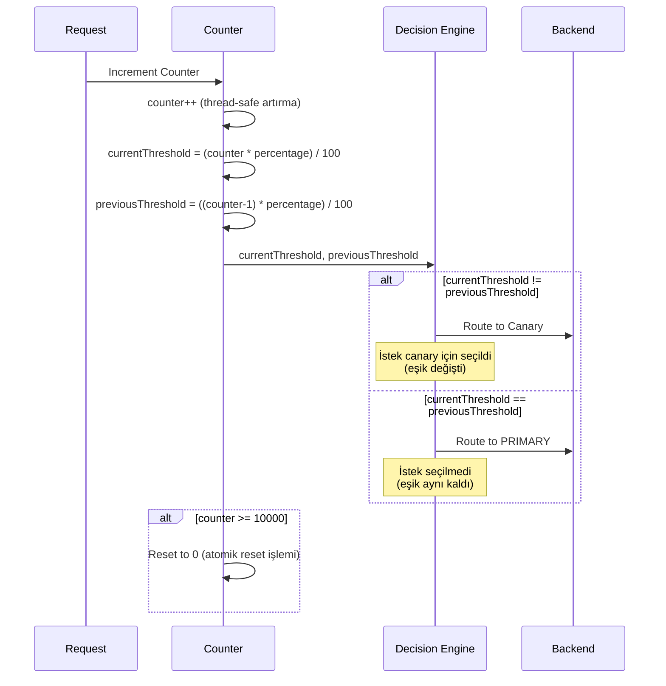
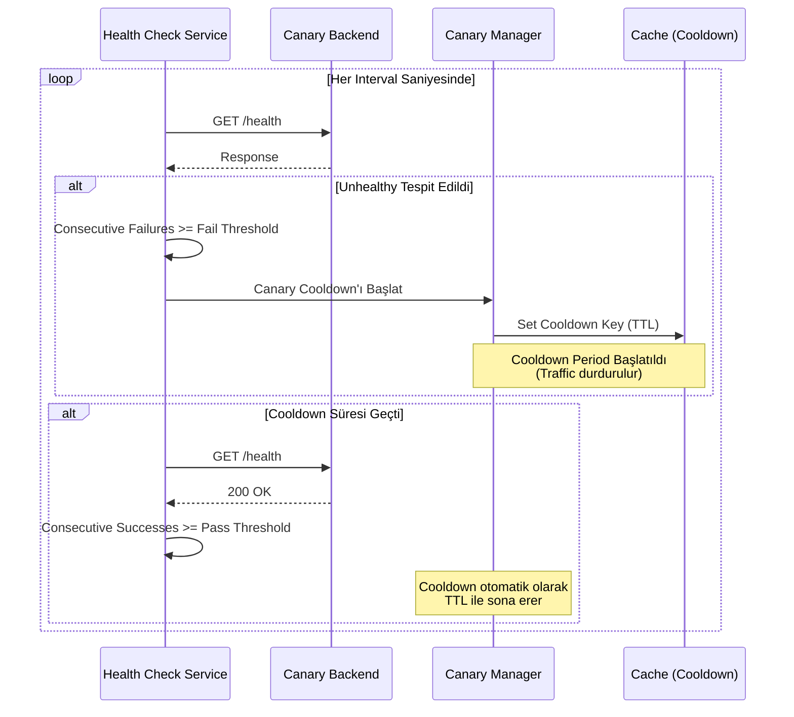
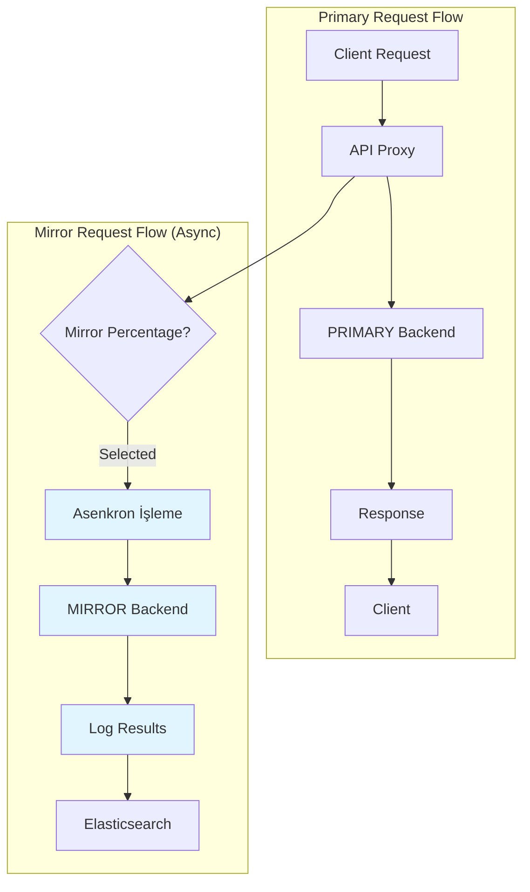
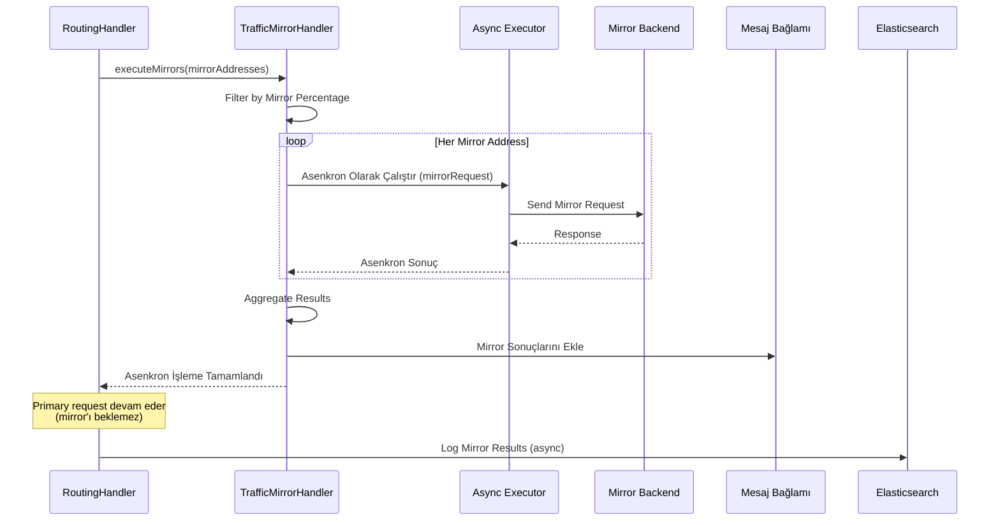

<Warning>
Bu özellikler sadece HTTP tipindeki API Proxy'ler için kullanılabilir. gRPC ve WebSocket tipindeki API Proxy'ler için bu ayarlar geçerli değildir.
</Warning>

## Canary Release

**Canary Release**, yeni bir backend sürümünü küçük bir trafik yüzdesiyle canlıya alarak riski minimize etmek için kullanılan bir deployment stratejisidir. Bu sayede yeni sürümün performansını ve kararlılığını gerçek trafik üzerinde test edebilirsiniz.

### Canary Release Nasıl Çalışır?

Canary release mekanizması şu şekilde çalışır:

1. **Traffic Percentage:** Belirli bir yüzdedeki trafik (örn: %10) canary backend'ine yönlendirilir
2. **Counter-Based Routing:** Deterministic routing için counter kullanılır (mod 100 ile)
3. **Health Check Entegrasyonu:** Canary backend unhealthy olduğunda otomatik olarak cooldown period başlatılır
4. **Cooldown Period:** Cooldown süresince canary'ye trafik gönderilmez, tüm trafik stable backend'e yönlendirilir

### Canary Release Parametreleri

| Parametre | Açıklama |
|-----------|----------|
| **Traffic Percentage** | Canary backend'ine yönlendirilecek trafik yüzdesi (0-100). |
| **Cooldown Period (Saniye)** | Canary backend unhealthy olduğunda, trafiğin durdurulacağı süre. Varsayılan: 300 saniye (5 dakika). |

### Canary Routing Karar Akışı

Canary routing karar mekanizması şu adımlarla çalışır:

1. **İstek geldiğinde**, canary release aktif mi kontrol edilir:
   - Canary release aktif değilse: İstek doğrudan PRIMARY backend'e yönlendirilir

2. **Canary release aktifse**, cooldown period kontrol edilir:
   - Cooldown period aktifse: Tüm trafik PRIMARY backend'e yönlendirilir (canary'ye trafik gönderilmez)
   - Cooldown period aktif değilse: Trafik dağıtımına geçilir

3. **Trafik dağıtımı** (Bresenham-style distribution algoritması):
   - Her istek için counter artırılır
   - Dağıtım eşiği hesaplanır: `floor(counter * percentage / 100)`
   - Eğer eşik önceki istekten farklıysa: İstek CANARY backend'e yönlendirilir
   - Eğer eşik aynı kalmışsa: İstek PRIMARY backend'e yönlendirilir
   - Bu sayede istekler eşit dağıtılır (örn: %50 için: 1.→PRIMARY, 2.→CANARY, 3.→PRIMARY, 4.→CANARY, ...)

4. **Canary backend'e yönlendirme sonrası**:
   - İstek başarılıysa: İşlem tamamlanır
   - İstek başarısızsa: Otomatik olarak PRIMARY backend'e failover yapılır

### Bresenham-Style Distribution Algoritması

Canary release, trafiği istekler arasında eşit dağıtmak için **Bresenham-style distribution** kullanır:

#### Bresenham Dağıtımı Nasıl Çalışır?

Basit modulo tabanlı yaklaşımların oluşturduğu trafik patlamalarının aksine (örn: ilk 50 istek canary'ye, sonraki 50 istek primary'ye), Bresenham dağıtımı eşit aralıklarla dağıtım sağlar:

**%50 trafik için örnek:**
- 1. istek → PRIMARY
- 2. istek → CANARY
- 3. istek → PRIMARY
- 4. istek → CANARY
- ... (dönüşümlü desen devam eder)

**%33 trafik için örnek:**
- 1., 2. → PRIMARY
- 3. → CANARY
- 4., 5. → PRIMARY
- 6. → CANARY
- ... (eşit aralıklı desen devam eder)

#### Algoritma Detayları

1. **Counter Artırma:** Her istek için counter artırılır (thread-safe atomik sayaç kullanılarak)
2. **Eşik Hesaplama:** 
   - Mevcut eşik = `floor(counter × yüzde / 100)`
   - Önceki eşik = `floor((counter-1) × yüzde / 100)`
3. **Karar Verme:** Mevcut eşik ≠ önceki eşik ise canary'ye yönlendir
4. **Overflow Önleme:** Counter 10.000'e ulaştığında otomatik olarak 0'a reset edilir

<Info>
**Neden Bresenham?** Bu algoritma, bilgisayar grafiklerinde kullanılan Bresenham çizgi algoritmasından adını alır. Kümeleme olmadan eşit dağıtım sağlar, test ve izleme için ideal olan düzgün bir trafik dağıtım deseni sunar.
</Info>

#### Dağıtım Kalitesi

Bresenham dağıtımı şunları sağlar:
- **Eşit Aralık:** İstekler eşit dağıtılır, kümelenmez
- **Deterministik:** Aynı counter değeri her zaman aynı kararı üretir
- **Thread-Safe:** Çok iş parçacıklı ortamlarda doğru çalışır
- **Hassas:** Herhangi bir 100 istek penceresinde, tam olarak belirtilen yüzde canary'ye yönlendirilir

### Health Check ile Otomatik Failback

Canary backend'in sağlık durumu, active health check mekanizması ile sürekli izlenir:

- **Unhealthy Tespiti:** Health check fail threshold'u aşıldığında, canary backend unhealthy olarak işaretlenir
- **Cooldown Başlatma:** Unhealthy tespit edildiğinde, otomatik olarak cooldown period başlatılır
- **Trafik Durdurma:** Cooldown süresince canary'ye trafik gönderilmez
- **Otomatik Recovery:** Cooldown süresi geçtikten sonra, health check tekrar başarılı olursa canary tekrar aktif hale gelir

## Traffic Mirroring

**Traffic Mirroring**, canlı trafiğin bir kopyasını test ortamına göndermek için kullanılan bir mekanizmadır. Mirror request'ler asenkron olarak çalışır ve ana request'i etkilemez.

### Traffic Mirroring Nasıl Çalışır?

Traffic mirroring mekanizması şu şekilde çalışır:

1. **Ana İstek:** Normal şekilde PRIMARY backend'e gönderilir
2. **Mirror İstek:** Belirli bir yüzdedeki trafiğin kopyası MIRROR backend'ine asenkron olarak gönderilir
3. **Asenkron İşleme:** Mirror request'ler ana request'i bloke etmez
4. **Sonuç Etkisizliği:** Mirror request'lerin başarı/başarısızlığı ana request'i etkilemez

### Traffic Mirroring Parametreleri

| Parametre | Açıklama |
|-----------|----------|
| **Traffic Mirror Enabled** | Traffic mirroring'in aktif edilip edilmeyeceği. |
| **Mirror Percentage** | Mirror yapılacak trafik yüzdesi (0-100). Counter-based routing ile belirlenir. |

### Traffic Mirroring Mimarisi

### Asenkron Mirror İşleme

Mirror request'ler asenkron olarak işlenir:

1. **Asenkron Görev Oluşturma:** Her mirror adresi için bir asenkron görev oluşturulur
2. **Asenkron Çalıştırma:** Mirror request'ler async executor üzerinde çalıştırılır
3. **Sonuç Toplama:** Tüm mirror sonuçları toplanır ve mesaj bağlamına eklenir
4. **Logging:** Mirror sonuçları Elasticsearch'e loglanır (LogHandler tarafından)

<Warning>
Mirror request'lerin başarısız olması durumunda ana request etkilenmez. Mirror sonuçları sadece loglama ve izleme amaçlı kullanılır.
</Warning>

### Percentage-Based Router

Hem Canary Release hem de Traffic Mirroring, trafik dağıtımı için aynı `PercentageBasedRouter` utility sınıfını kullanır.

#### Counter Yönetimi

- **Local Counter:** Her pod'da bağımsız counter tutulur (thread-safe harita kullanılarak)
- **Thread-Safety:** Atomik sayaç kullanılarak thread-safe işlemler yapılır
- **Overflow Önleme:** Counter 100'e ulaştığında atomik reset işlemi ile 0'a reset edilir

#### Counter Reset Mekanizması

Counter reset mekanizması Long overflow'u önler:

1. **Counter 10.000'e ulaştığında**, atomik işlem ile 0'a reset edilir

2. **Atomik reset işlemi**:
   - Counter değeri 10.000 ise, `compareAndSet` kullanarak 0'a reset edilmeye çalışılır
   - Reset işlemi başarılı olursa: Counter 0 olur ve dağıtım devam eder
   - Reset işlemi başarısız olursa (başka bir thread zaten reset etmişse): Dağıtım mevcut değerle devam eder

3. **Neden 10.000?**: Bu eşik şunları sağlar:
   - Hassas yüzde dağıtımı için yeterli aralık
   - Long.MAX_VALUE overflow'a karşı koruma
   - Reset işlemlerinden minimal performans yükü

Bu mekanizma sayesinde Long overflow asla oluşmaz ve hassas trafik dağıtımı korunur.

### Lifecycle Yönetimi

API Proxy deploy, update veya undeploy edildiğinde, canary ve mirror counter'ları otomatik olarak temizlenir:

- **Deploy/Update:** Counter'lar reset edilir (fresh start)
- **Undeploy:** Tüm counter'lar temizlenir

<Note>
Counter'ların reset edilmesi, yeni konfigürasyonla tutarlı bir başlangıç sağlar. Örneğin, traffic percentage değiştiğinde counter'ların sıfırlanması gerekir.
</Note>

## Canary vs Mirror Karşılaştırması

| Özellik | Canary Release | Traffic Mirroring |
|---------|---------------|-------------------|
| **Amaç** | Yeni sürümü küçük trafikle test etmek | Canlı trafiği test ortamına kopyalamak |
| **Backend Tipi** | CANARY | MIRROR |
| **Trafik Etkisi** | Seçilen trafik canary'ye gider | Ana trafik PRIMARY'ye, kopya MIRROR'a gider |
| **Başarısızlık Etkisi** | Canary başarısız olursa PRIMARY'ye failover | Mirror başarısız olsa bile ana request etkilenmez |
| **Health Check** | Canary unhealthy ise cooldown başlatılır | Mirror için health check yapılmaz |
| **Senkronizasyon** | Senkron (ana request canary'yi bekler) | Asenkron (ana request mirror'ı beklemez) |

## İlgili Konular

- [Tekrar Deneme ve Yük Devretme](/tr/develop/yonlendirme/tekrar-deneme-ve-yuk-devretme) - Health check ve circuit breaker entegrasyonu
- [Yük Dengeleme](/tr/develop/yonlendirme/http-yonlendirme#yuk-dengeleme) - Backend adresleri arasında yük dağıtımı

