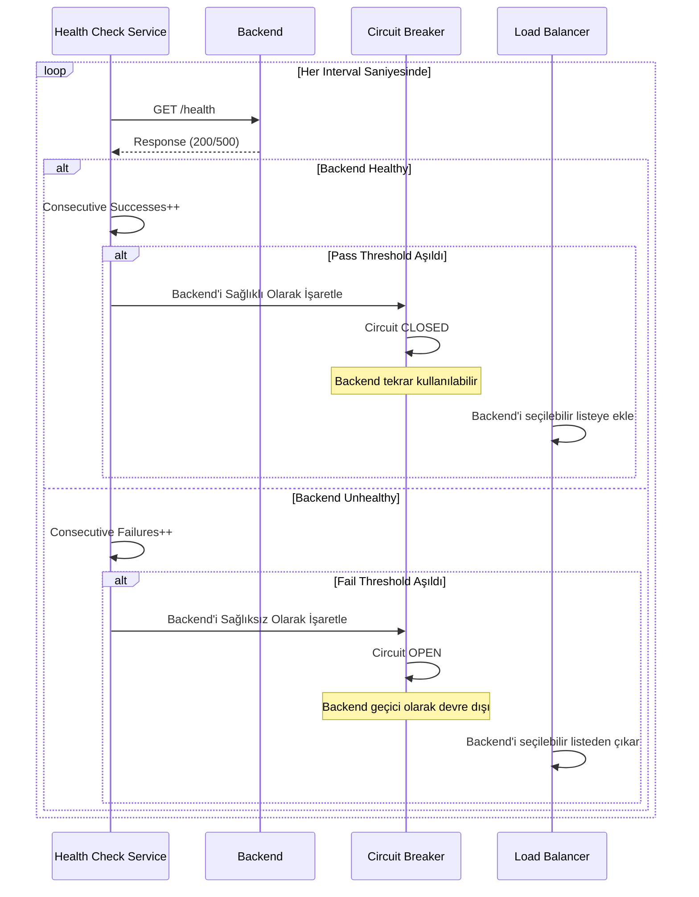

<Note>
API tipi HTTP ise, bu sekme görünür.
</Note>

## Yönlendirme/Upstream Ayarlarının Etkinleştirilmesi

Yönlendirme/upstream ayarlarının etkinleştirme ayarlarını içeren görsele aşağıda yer verilmiştir:

Yönlendirme/upstream ayarlarının etkinleştirilmesi için kullanılan parametreler aşağıda görülmektedir.

| Alan | Açıklama |
|------|----------|
| **Etkinleştirildiğinde, istek mesajının yönlendirileceği adres ayarları yapılır** *(If enabled, the routing/upstream settings can be made.)* | Bu ayarı etkinleştirerek trafiğin nasıl yönlendirileceği yönetilir. Kapalıysa istek backend'e gitmez, açıksa gidecek olan backend bilgileri girilebilir. |
| **Etkinleştirilirse, yansıtma etkinleştirilir; aksi takdirde, tanım dosyasındaki örnek yanıt döndürülür** *(If enabled, mirroring is activated; otherwise, sample response from the specification is returned.)* | Sadece üstteki ayar pasif ise yani istek herhangi bir backend'e gitmiyorsa bu ayar gözükür. Bu ayar ile mock verilerin dönmesi veya isteğin yanıta kopyalanarak dönmesi sağlanabilir. Etkinleştirildiğinde, istek mesajı yanıt mesajına kopyalanır ve yanıt hattı işletilir; devre dışı bırakıldığında ise tanım dosyasındaki 200 kodunda dönmesi beklenen sonuç döndürülür. |

Yönlendirme Sekmesi ayarlarını içeren görsele aşağıda yer verilmiştir:

## Backend API Adreslerinin Yönetilmesi

API Proxy oluşturulurken Backend API'nin erişim adresi farklı şekillerde alınabilir:

* Eğer bir API Tanım Dosyası kullanılmışsa bu dosyanın içindeki adres ya da adreslerden en az biri kullanıcı tarafından seçilir.
* Eğer No-Spec API seçeneği ile API Proxy oluşturuluyorsa (örneğin code-first yaklaşımla geliştirilmiş bir Backend API için), Backend API'nin adresi kullanıcı tarafından girilir.
* Eğer API Creator (DB-2-API, Mock API ya da Script-2-API) ile oluşturulan bir API için API Proxy oluşturuluyorsa adres istenmez, Apinizer tarafından yönetilir. Bu tip API'ler için Yönlendirme Sekmesi kapalıdır.

Oluşturma aşamasında alınan adres bilgisi daha sonra değiştirilebilir, yeni adresler tanımlanabilir ya da var olanlar silinebilir. Bunun için Yönlendirme Sekmesi'ndeki **Adresler (Addresses)** bölümü kullanılır.

### Yeni Adres Ekleme

Yapılandır butonuyla açılan pencerenin en sağındaki kolon başlığı bölgesindeki ➕ tuşuna tıklandığında açılan pencereden yeni bir adres eklenebilir.

**Yeni adres ekleme penceresinde:**

* Adres alanına backend API adresi girilir veya ortam değişkeni kullanılır
* Adres alanının sağındaki liste ikonu butonuna tıklanarak Ortam Değişkenleri Seçim Dialog'u açılabilir
* Seçilen ortam değişkeni panoya kopyalanır ve adres alanına yapıştırılır
* Koşul  bölümü ile koşullu yönlendirme tanımlanabilir

### Adresi Güncelleme

Adresleri gösteren tablonun **Adres (Address)** kolonundaki **Yapılandır (Configure)** tuşuna tıklandığında açılan pencerede adres güncellenebilir.

Eğer bu değer otomatik olarak bulunduğu ortama göre değişmesi isteniyorsa Ortam Değişkenleri (Environment Variable) içinden seçim yapılabilir.

Adres giriş alanının sağında bulunan liste ikonu butonuna tıklandığında Ortam Değişkenleri Seçim Dialog'u açılır. Bu dialog üzerinden projede tanımlı tüm ortam değişkenleri (Environment Variables) görüntülenebilir ve seçilebilir.

Adres giriş alanının sağında bulunan liste ikonu butonuna tıklandığında Ortam Değişkenleri Seçim Dialog'u açılır. Bu dialog üzerinden projede tanımlı tüm ortam değişkenleri (Environment Variables) görüntülenebilir ve seçilebilir.

**Ortam Değişkenleri Seçim Dialog'unda:**

* Tüm ortam değişkenleri listelenir (Global ve Environment-Specific)
* Arama kutusu ile değişken adı veya açıklamasına göre filtreleme yapılabilir
* Her değişken için Key Name, Açıklama , Tip  bilgileri görüntülenir
* Kopyala (Copy) butonu ile seçilen değişkenin formatı (`${variableName}`) otomatik olarak panoya kopyalanır
* Kopyalanan değer adres alanına yapıştırılarak kullanılabilir

**Örnek Kullanım:**

* Ortam değişkeni: `BACKEND_URL = dev-api.example.com` (Development ortamı için)
* Ortam değişkeni: `BACKEND_URL = api.example.com` (Production ortamı için)
* Adres alanına girilen değer: `${BACKEND_URL}`
* Runtime'da Development ortamında: `dev-api.example.com`
* Runtime'da Production ortamında: `api.example.com`

<Info>
Eğer API Proxy'nin tipi SOAP ise; bu kısımda eklenen/düzenlenen SOAP Type bilgisi WSDL'da port bilgisine yansıtılır.
</Info>

### Koşullu Yönlendirme 

Adres güncelleme ya da ekleme işlemleri için açılan penceredeki **Koşul ** bölümü, istemciden gelen mesajların bu adrese gönderilmesi için koşul tanımlama olanağı verir. Böylece örneğin özel bir başlık ya da parametre değeri ile gelmeyen isteklerin tanımlı adreslerden sadece belirli bir ya da daha fazlasına yönlendirilmesi sağlanabilir.

Pratik bir kullanım senaryosu örneği, "test=true" parametresi ile gelen isteklerin test sunucusuna, bu parametreyi içermeyen isteklerin ise production sunucusuna yönlendirilmesi olabilir. Bir başka senaryo, isteklerin IP değerine göre farklı bölgelerdeki sunuculara yönlendirilmesi olarak düşünülebilir.

### Adres Silme

Silinmek istenen adresin satır sonundaki açılır menüsünden **Kaldır ** seçeneği seçilerek adres silinir.

<Warning>
API Proxy'nin yönlendirme yapabilmesi için en az bir adres olması gerekir. Bu nedenle en son adres için silindikten sonra kaydet butonu pasif olur ve kaydetmeye izin vermez.
</Warning>

## Yük Dengeleme 

Backend API'deki yükün artması durumunda, aynı API/Web Servis başka bir sunucuya daha yüklenerek yükün dağıtılması mümkündür.

Yeni sunucunun istemcilerin erişimine açılması için herhangi bir ağ ayarı yapılmasına gerek yoktur, Apinizer üzerindeki **Adresler (Addresses)** kesimine eklenmesi yeterlidir. Apinizer, eğer bir Backend API için birden çok adres tanımlanmış ise bu adresler arasında yükü dağıtır.

Yük dengeleme için kullanılabilecek algoritmalardan hangisinin kullanılacağı kullanıcı tarafından belirlenebilir.

| Algoritma | Açıklama |
|----------|----------|
| **Round Robin** | İstek mesajları listedeki adreslere sıra ile gönderilir. Listenin sonuna gelindiğinde listenin başına dönülür ve aynı döngü devam eder. |
| **LRU** | İstek mesajları listedeki adresler arasındaki en uzun süre kullanılmayan sunucuya yönlendirir. |
| **Ağırlıklı** | Kullanıcı tarafından adreslere ağırlıklar atanır. Bu ağırlık değerleri dikkate alınarak istekler sunuculara sırayla yönlendirilir. Örneğin; iki adresten birinin ağırlığı 1 diğerinin ağırlığı 2 ise ağırlığı 1 olan adrese 1 istek yönlendirilirken, ağırlığı 2 olan adrese 2 istek yönlendirilir. |
| **Rastgele** | İstek mesajları rastgele seçilen adreslere yönlendirilir. |
| **Yük Dengeleme Tipi**  | Apinizer, her bir [Ortam](/tr/concepts/temel-kavramlar/ortam-nedir)'da birden çok Worker çalışacak şekilde biçimlendirilebilir. Böylece o Ortam'daki API Proxy'ler arasında yük dağıtılmış olur. Bu durumda, her bir Worker üzerindeki API Proxy'ler, Backend API adreslerini bilmek zorundadır. **Yük Dengeleme Tipi** parametresi, Backend API adresleri arasında yük dengeleme yapılırken hangisine kaç kez ya da en son gidildiği bilgisinin nasıl tutulacağını belirler. Eğer **Basit (Single)** seçilmişse, her Worker yük dengeleme adresini diğer Worker'lardan bağımsız olarak işletirken, **Dağıtılmış (Distributed)** seçildiği durumda Worker'lar dağıtılmış önbellek kullanarak aynı ve tek bir erişim verisi üzerinden yük dengeleme yaparlar. Buna göre **Basit (Single)** daha hızlı çalışırken, **Dağıtılmış (Distributed)** yük dengeleme algoritmasının doğru işletildiğini garanti edecek şekilde çalışmaktadır. |

## Sticky Session

**Sticky Session** mekanizması, aynı istemcinin her zaman aynı backend'e yönlendirilmesini sağlar. Bu mekanizma, session state, cache locality veya backend-specific data consistency gibi senaryolarda kullanılabilir.

Apinizer üç farklı sticky session tipini destekler: **COOKIE_ONLY**, **IP_HASH** ve **HYBRID**. Cookie-based sticky session, HMAC-SHA256 ile imzalanmış güvenli cookie'ler kullanır ve circuit breaker ile entegre çalışarak unhealthy backend'leri otomatik olarak atlar.

<Info>
Detaylı bilgi için [Kalıcı Oturum (Sticky Session)](/tr/develop/yonlendirme/kalici-oturum) sayfasına bakabilirsiniz.
</Info>

## Bağlantı Ayarları Tanımlama

Bağlantı ayarları konfigürasyonu için kullanılan parametreler aşağıda görülmektedir.

| Alan | Açıklama |
|------|----------|
| **Bağlantı Zaman Aşımı**  | Backend API'ye bağlanıp istek mesajını gönderebilmek için belirlenen azami bekleme süresidir. Saniye olarak verilir. Bu süre boyunca Backend API'ye erişilemez ise; **Yeniden Deneme Sayısı (Retry Count)** ve **Başarısızlıkta Deneme Sayısı (Failover Retry Count)** parametrelerinin değerlerine göre aynı adrese ya da varsa listedeki diğer adreslere yeni istek gönderilebilir, istemciye hata döndürülebilir. |
| **Okuma Zaman Aşımı**  | Backend API'den yanıt mesajını almak için belirlenen azami bekleme süresidir. Saniye olarak verilir. Bu süre boyunca Backend API'den yanıt alınamaz ise; **Yeniden Deneme Sayısı (Retry Count)** ve **Başarısızlıkta Deneme Sayısı (Failover Retry Count)** parametrelerinin değerlerine göre aynı adrese ya da varsa listedeki diğer adreslere yeni istek gönderilebilir, istemciye hata döndürülebilir. |
| **Bağlantı İsteği Zaman Aşımı**  | Bağlantı yöneticisinden bağlantı istenirken kullanılan zaman aşımı süresidir. Milisaniye olarak verilir. |
| **Yeniden Yönlendirmeyi Aktive Et**  | Zaman aşımı sürelerinin aşılması ya da Backend API'den hata dönmesi durumunda istemciye hemen hata dönülmesi yerine aynı adrese ya da diğer adreslere tekrar istek gönderilerek işlemin başarılı olması sağlanmaya çalışılır. |
| **Göreceli Yeniden Yönlendirmeyi Aktive Et**  | Bu özellik etkinleştirildiğinde, yeniden yönlendirme işlemleri göreceli adreslere yapılır. |
| **Maks. Yeniden Yönlendirme Sayısı** | Maksimum yeniden yönlendirme sayısı belirlenir. |
| **İçerik Sıkıştırmayı Kapat**  | İçerik sıkıştırma kapatılır. |
| **Değeri Sıfır Olan Content-Length Başlığını Yönlendirmeyin** | Eğer Content-Length değeri sıfır ise, back-end sunucusuna Content-Length başlığı gönderilmez. |
| **Yeniden Deneme Sayısı**  | Backend API'ye gönderilen istek ya da beklenen yanıt mesajı için zaman aşımı oluşursa veya Backend API'den hata dönerse, istemciye hata mesajı dönülmeden önce **Yeniden Deneme Sayısı (Retry Count)** parametresinin değeri kontrol edilir. Eğer bu değer 0'dan büyükse, Backend API'ye yeniden istek gönderilir. Bu işlem, bu parametrenin değeri kez yenilenir. |
| **Hata Alınması Durumunda Deneme Sayısı**  | Backend API'ye **Yeniden Deneme Sayısı (Retry Count)** kez mesaj gönderildiği halde hala zaman aşımı oluşuyor ya da Backend API'den hata mesajı dönüyorsa, **Başarısızlıkta Deneme Sayısı (Failover Retry Count)** parametresinin değeri kontrol edilir. Eğer bu değer 0'dan büyükse, diğer Backend API adreslerine istek gönderilir. Farklı adresleri deneme işlemi bu parametrenin değeri kez yenilenir. Her yeni adres için tek bir deneme yapılarak eğer başarılı sonuç alınamazsa bir sonraki adrese geçilir. Eğer tanımlı adres sayısı **Başarısızlıkta Deneme Sayısı (Failover Retry Count)** parametresinin değerinden küçükse, denenecek yeni adres kalmadığı için işlem sonlandırılır ve istemciye hata döndürülür. |
| **Backend API'den Hata Alınması Durumunda Yanıt Şablonunu Uygulama**  | Bir API Proxy için [Genel Bakış](/tr/develop/api-proxy-konfigurasyonu/overview) sekmesinde **XML/JSON Hata Yanıt Şablonu** bölümünde yapılan konfigürasyon ile, hata durumlarında istemciye nasıl bir hata mesajı döndürüleceğini belirleyen şablonlar tanımlanabilir. Bu hata şablonları, uygulanan politikalarla ilgili hataların da ele alınarak özelleştirilmesine imkan verir. Bununla birlikte, bazen Backend API'den dönen hata mesajı, istemci için anlamlı veri içerebilir ve dolayısıyla bu mesajın istemciye olduğu gibi döndürülmesi istenebilir. Böyle bir durumda **Hedef API'den Hata Dönmesi Durumunda Yanıt Şablonunu Uygulama (Ignore Error Response Template In Case Of Error On Backend API)** parametresinin kutusu işaretlenir. Bu parametre işaretlendiği zaman, Hata Yanıt Şablonu bölümünde tanımlanan şablonlar yalnızca Backend API'den hatalı mesaj dönmesi durumunda işleme alınmaz. Ancak örneğin herhangi bir politikadan kaynaklanan hata yanıtları için bu şablonlar kullanılacaktır. |
| **Hata İşleme Türü**  | Hata İşleme Backend adresinden dönen sonucun Başarılı mı yoksa Hatalı mı değerlendirileceğini belirlemek için kullanılır. Mesajın durumuna karar vermek için üç seçenek bulunur; **varsayılan ayarlar (default settings),** **gelişmiş ayarlar (advanced settings)** ve **durum kodu listesi (status code list)**. Varsayılan ayarlar seçilirse, bu durumda dönen mesajın durumu "HTTP durum kodu >= 400" mü diye kontrol edilir. Koşul sağlanmış ise mesajın durumu hatalı olarak değerlendirilir. Gelişmiş ayarlar seçilirse, bu durumda dönen mesajın üzerinde belirtilen koşul sağlanıyor mu diye kontrol edilir. Koşul sağlanmış ise mesajın durumu hatalı olarak değerlendirilir. Örneğin; "(HTTP durum kodu = 500 or HTTP durum kodu = 501) and (mesaj gövdesi contains "error") ..vb" şeklinde koşul yazılabilir. Durum kodu listesi seçilirse, bu durumda dönen mesajın HTTP durum kodu, belirtilen liste içerisinde yer alıyor mu diye kontrol edilir. Koşul sağlanmış ise mesajın durumu hatalı olarak değerlendirilir. <Warning> Beklenmeyen durumlar (yani hata koşuluna uyan dönüşler) için yanıt hattındaki politikalar çalıştırılmaz. </Warning> |
| **Bağlantı Havuzu Yönetim Türü** | Bağlantı Havuz Yönetimi seçenekleri: **Genel (General)**: Bulunduğu Ortam(Environment) için mevcut Genel Bağlantı Havuzu ayarları uygulanır. **Özelleştir (Custom)**: Bu API Proxy'e özel Bağlantı Havuzu oluşturmak için kullanılır. **Hiçbiri (None)**: Eğer Hiçbiri seçeneği seçilirse Bağlantı Havuzu oluşturulmaz. |
| **SOAP Action ve Namespace bilgisini düzelt** | SOAP ve Rest2Soap servislerde aktif olan bu seçenek ile SOAP action ve namespacelerinin WSDL'a göre varsayılan olarak düzeltilmesi işlemi gerçekleştirilir. Daha detaylı bilgi için [bu sayfayı](#) ziyaret edebilirsiniz. Ayarın devre dışı bırakılması durumunda istemcinin gönderdiği istek üzerinde bir değişiklik yapılmaz. |
| **Silinecek Hop-by-hop başlıklar** | İstemciden backend'e gönderilen istek sırasında gelen başlık bilgileri içerisinden silinecek olan bilgiyi belirler. |
| **User Agent'i Backend'e Gönder**  | Backend'e istek gönderilirken User Agent bilgisinin gönderileceği bilgisidir. Bu seçenek etkinleştirildiğinde, User-Agent değeri özelleştirilebilir. |
| **SSL/TLS Doğrulamasını Devre Dışı Bırak**  | Backend'e istek gönderilirken sunucu sertifikası doğrulanmaz. |

## Devre Kesici

İstemcilerden API'lere yapılan istekler yavaş ağ bağlantıları, zaman aşımları ve kaynakların aşırı yüklenmesi veya geçici olarak devre dışı bırakılması gibi geçici hatalardan dolayı başarısız olabilir. Bu gibi hataların nedenleri kısa sürede kendiliğinden ortadan kalkabilir. Ancak hataların nedenlerinin ortadan kalkabilmesi için sunuculara zaman tanınması gerekir. Bir mikro servis mimari şablonu (microservice architecture pattern) olan **Devre Kesici (Circuit Breaker)** bu amaca hizmet eder.

Devre Kesici, yük dağılımı yapılan bir sistemde mevcut uç noktaları izleyerek, uç nokta cevaplarında herhangi bir anormallik olması durumunda ilgili uç noktaya erişimi bir süreliğine durdurur.

Devre Kesicinin kullanılabilmesi için adresler bölümünde Backend API için en az iki adres tanımlanmış olmalıdır.

Devre Kesici konfigürasyonu için kullanılan parametreler aşağıda görülmektedir.

| Alan | Açıklama |
|------|----------|
| **Devre Kesiciyi Aktive Et**  | Devre Kesiciyi aktif hale getirerek konfigürasyon parametrelerini girilebilmesinin sağlar. |
| **Hata Penceresi**  | Backend API adreslerinin hatalar için izlenme süresini belirtir. Saniye olarak girilir. |
| **Hata Eşiği Değeri**  | Takip edilen süre içerisinde ne kadar hatanın kabul edileceğini belirtir. Hata eşiği aşıldığında o Backend API adresine **Uyuma Penceresi** parametresi ile belirtilen süre boyunca yeni istek gönderilmez. |
| **Hata Eşiği Tipi**  | Hata sayısının nasıl ele alınacağını belirtir. **Hata Penceresi** süresince oluşan hataların sayısı: HS **Hata Penceresi** süresince gelen toplam mesaj sayısı: TMS **Hata Eşiği Değeri**: HED olsun. Buna göre, SAYI (COUNT): HS >= HED durumu kontrol edilir. YÜZDE (PERCENT): HS >= (TMS * HED) / 100 durumu kontrol edilir. |
| **Uyuma Penceresi**  | Hata alınan ve **Hata Eşiği Değeri** aşılan Backend API adresine ne kadar süre ile yeni bir istek gönderilmeyeceğini belirtir. Bu süre boyunca gelen istekler diğer adres ya da adreslere yönlendirilir. Süre bitiminde bu adrese de yeniden istek göndermeye başlanır. |
| **Yarı Açığı Aktive Et**  | Bu seçenek işaretlenirse, **Uyuma Penceresi** parametresi ile belirtilen süre geçtikten sonra ilgili adrese 1 adet istek gönderilerek o adresteki sorunun ortadan kalkıp kalkmadığına bakılır. Dönen sonuç hatalı ise bu adres **Uyuma Penceresi** süresi boyunca tekrar yeni isteklere kapatılır. Bu seçenek işaretlenmezse, **Uyuma Penceresi** parametresi ile belirtilen süre geçtikten sonra ilgili adresin değerleri sıfırlanır ve bu adres için **Hata Penceresi** süresince izleme yeniden başlar. |

Devre Kesici her adres için ayrı ayrı uygulanır. Hata eşiği ve süresi aşıldığında devre kesici yalnızca ilgili adresteki uç noktaya erişimi engeller.

## Health Check ile Otomatik Failback

**Active Health Check** mekanizması, backend'lerin sağlık durumunu periyodik olarak kontrol eder ve circuit breaker ile entegre çalışarak otomatik yük devretme sağlar. Bu mekanizma sayesinde unhealthy backend'ler otomatik olarak trafikten çıkarılır ve sağlıklı hale geldiklerinde tekrar trafiğe dahil edilir.

### Health Check Nasıl Çalışır?

Health check mekanizması şu şekilde çalışır:

1. **Periyodik Kontrol:** Her backend için belirlenen interval süresinde (varsayılan: 30 saniye) health check endpoint'ine istek gönderilir
2. **Sağlık Durumu Takibi:** Her health check sonucuna göre backend'in sağlık durumu takip edilir
3. **Unhealthy Tespiti:** Ardışık başarısızlık sayısı fail threshold'u (varsayılan: 3) aştığında backend unhealthy olarak işaretlenir
4. **Otomatik Devre Dışı Bırakma:** Unhealthy backend'ler circuit breaker ile otomatik olarak trafikten çıkarılır
5. **Otomatik Recovery:** Ardışık başarı sayısı pass threshold'u (varsayılan: 2) aştığında backend tekrar healthy olarak işaretlenir ve trafiğe dahil edilir

### Health Check Parametreleri

Health check parametreleri routing seviyesinde yapılandırılır ve tüm backend adresleri için geçerlidir:

| Parametre | Açıklama |
|-----------|----------|
| **Health Path** | Backend'in health check endpoint'i. Her adres için adres seviyesinde belirtilmelidir. Tam URL olarak belirtilmelidir (örn: `https://backend.example.com/health`). |
| **Interval (Saniye)** | Health check'lerin ne sıklıkla yapılacağı. Varsayılan: 30 saniye. |
| **Timeout (Saniye)** | Health check isteğinin zaman aşımı süresi. Varsayılan: 5 saniye. |
| **Fail Threshold** | Backend'in unhealthy olarak işaretlenmesi için gereken ardışık başarısızlık sayısı. Varsayılan: 3. |
| **Pass Threshold** | Backend'in healthy olarak işaretlenmesi için gereken ardışık başarı sayısı. Varsayılan: 2. |

<Info>
Health Path boş veya null ise, ilgili backend için health check yapılmaz ve backend sağlık durumu izlenmez. Health check sadece PRIMARY ve FAILOVER_ONLY tipindeki adresler için yapılır (failover aktifse). CANARY tipindeki adresler için canary release aktifse health check yapılır. MIRROR tipindeki adresler için health check yapılmaz.
</Info>

### Health Check → Circuit Breaker Koordinasyonu

Health check mekanizması, circuit breaker ile koordineli çalışarak backend'lerin otomatik olarak devre dışı bırakılmasını ve tekrar aktif hale getirilmesini sağlar:

- **Backend Unhealthy:** Health check fail threshold'u aştığında, circuit breaker otomatik olarak OPEN durumuna geçer ve backend trafikten çıkarılır
- **Backend Healthy:** Health check pass threshold'u aştığında, circuit breaker otomatik olarak CLOSED durumuna geçer ve backend tekrar trafiğe dahil edilir
- **Load Balancing Entegrasyonu:** Load balancing sırasında sadece healthy backend'ler seçilir, unhealthy backend'ler otomatik olarak filtrelenir

### Health Check Lifecycle Yönetimi

API Proxy deploy, update veya undeploy edildiğinde, health check kayıtları otomatik olarak yönetilir:

- **Deploy/Update:** Yeni backend'ler eklenir, silinen backend'ler kaldırılır, değişmeyen backend'lerin config'i güncellenir (health status korunur)
- **Undeploy:** Tüm backend'lerin health check kayıtları temizlenir

## Tekrar Deneme ve Yük Devretme

Backend API'ye gönderilen isteklerin başarısız olması durumunda otomatik olarak tekrar deneme ve yük devretme mekanizmaları devreye girer. Bu mekanizmalar sayesinde geçici hatalar otomatik olarak yönetilir ve yüksek erişilebilirlik sağlanır.

### Tekrar Deneme (Retry) Mekanizması

**Tekrar Deneme (Retry)** mekanizması, backend'e gönderilen isteklerin başarısız olması durumunda aynı backend adresine belirli sayıda tekrar deneme yapılmasını sağlar.

#### Retry Parametreleri

| Parametre | Açıklama |
|-----------|----------|
| **Yeniden Deneme Sayısı (Retry Count)** | Backend API'ye gönderilen istek başarısız olduğunda, bu parametre kadar tekrar deneme yapılır. Değer 0 ise retry yapılmaz. |
| **Retry Delay Tipi** | Retry denemeleri arasındaki bekleme süresi tipi. NO_DELAY, FIXED_DELAY veya EXPONENTIAL_BACKOFF seçenekleri mevcuttur. |
| **Retry Fixed Delay (ms)** | Sabit delay kullanılıyorsa, her retry denemesi arasında beklenen süre (milisaniye). |
| **Retry Initial Delay (ms)** | Exponential backoff kullanılıyorsa, ilk retry denemesi için beklenen süre (milisaniye). |
| **Retry Max Delay (ms)** | Exponential backoff kullanılıyorsa, maksimum delay süresi (milisaniye). |
| **Retry Backoff Multiplier** | Exponential backoff çarpanı (örn: 2.0 = her denemede delay 2 katına çıkar). |

#### Retry Akışı

Retry mekanizması şu durumlarda devreye girer:

- **Zaman Aşımı:** Bağlantı zaman aşımı veya okuma zaman aşımı oluştuğunda
- **Hata Kodları:** Backend'den HTTP hata kodları (4xx, 5xx) döndüğünde
- **Bağlantı Hataları:** UnknownHostException, MalformedURLException gibi bağlantı hatalarında

Retry mekanizması şu adımlarla çalışır:

1. **İlk istek gönderilir** ve sonuç kontrol edilir:
   - İstek başarılıysa: İşlem tamamlanır
   - İstek başarısızsa: Retry mekanizmasına geçilir

2. **Retry mekanizması**:
   - Retry count 0 ise: Failover mekanizmasına geçilir
   - Retry count 0'dan büyükse: Retry döngüsüne girilir

3. **Retry döngüsü** (i = 1'den retry count'a kadar):
   - Retry delay aktifse: Belirtilen süre beklenir (exponential backoff veya fixed delay)
   - İstek tekrar gönderilir
   - İstek başarılıysa: İşlem tamamlanır
   - İstek başarısızsa ve i < retry count ise: i artırılır ve döngü devam eder
   - İstek başarısızsa ve i = retry count ise: Failover mekanizmasına geçilir

### Yük Devretme (Failover) Mekanizması

**Yük Devretme (Failover)** mekanizması, bir backend adresinin başarısız olması durumunda isteğin otomatik olarak diğer backend adreslerine (FAILOVER_ONLY tipindeki adresler) yönlendirilmesini sağlar.

#### Failover Mantığı

Failover mekanizması basit ve net bir mantıkla çalışır:

1. **İlk İstek:** PRIMARY adreslere gönderilir (load balancing ile)
2. **Başarısızlık Durumu:** İlk istek başarısız olursa ve `failoverOnlyEnabled=true` ise
3. **Failover Adresleri:** FAILOVER_ONLY tipindeki adreslere sırayla istek gönderilir
4. **Failover Retry:** Her failover adresi için `failoverRetryCount` kadar deneme yapılır

<Warning>
`failoverOnlyEnabled=false` veya `null` ise failover mekanizması devreye girmez. Bu durumda retry mekanizması tamamlandıktan sonra istemciye hata döndürülür.
</Warning>

#### Failover Akışı

Failover mekanizması şu adımlarla çalışır:

1. **PRIMARY backend'e istek gönderilir** ve retry count kadar deneme yapılır:
   - İstek başarılıysa: İşlem tamamlanır
   - Tüm denemeler başarısızsa: Failover kontrolüne geçilir

2. **Failover kontrolü**:
   - `failoverOnlyEnabled = false` veya `null` ise: Hata döndürülür
   - `failoverOnlyEnabled = true` ise: FAILOVER_ONLY tipindeki adreslere geçilir

3. **FAILOVER_ONLY adresleri** (sırayla denenir):
   - İlk failover adresi seçilir (health check ile filtrelenmiş healthy adresler arasından)
   - Failover retry count kadar deneme yapılır
   - İstek başarılıysa: İşlem tamamlanır
   - İstek başarısızsa: Sonraki failover adresine geçilir

4. **Tüm failover adresleri denenene kadar**:
   - Her failover adresi için failover retry count kadar deneme yapılır
   - Başarılı olan ilk adres kullanılır ve işlem tamamlanır
   - Tüm failover adresleri başarısız olursa: Hata döndürülür

#### Adres Tipleri

| Adres Tipi | Açıklama |
|------------|----------|
| **PRIMARY** | Normal trafik için kullanılan backend adresleri. İlk istek bu adreslere gönderilir. |
| **FAILOVER_ONLY** | Sadece failover durumunda kullanılan adresler. `failoverOnlyEnabled=true` olduğunda devreye girer. |
| **CANARY** | Canary release için kullanılan adresler. Failover mekanizmasına dahil edilmez. |
| **MIRROR** | Traffic mirroring için kullanılan adresler. Failover mekanizmasına dahil edilmez. |

<Info>
Detaylı bilgi için [Tekrar Deneme ve Yük Devretme](/tr/develop/yonlendirme/tekrar-deneme-ve-yuk-devretme) sayfasına bakabilirsiniz.
</Info>

## Server Side Streaming (SSE)

Yanıt ayarlarında Server Side Streaming özelliği aktive edildiğinde, özellikle OpenAI, Claude, Gemini gibi HTTP yanıtlarını Stream olarak dönen API'lerin yanıtının istemciye toplu olarak değil parça parça iletilebilmesi sağlanır. Bu yöntemle istemci, yanıtı daha hızlı ve kesintisiz şekilde alabilir.

SSE özelliği etkinleştirildiğinde bağlantı havuzu (Connection Pool) ve yeniden deneme (Retry) mekanizmaları devre dışı kalır. Ayrıca, yanıt hattında gönderilen parçalı veriler log trafiğinde kayıt altına alınmaz ve görüntülenemez.

SSE uzun süreli açık bağlantılar oluşturduğundan, bağlantı zaman aşımı ayarları dikkatle yapılandırılmalıdır.

## İndirme

API Proxy'nin sonucunda dönecek olan verinin indirilebilir olması istenirse bu özellik aktif hale getirilir.

Hangi yanıt mesajının indirilebilir olduğuna dönüş değerindeki Content-Type başlık değerine bakılarak karar verilir. Buradaki değerler sistem ayarlarında yer alan Byte Array Content Types sayfasındaki listede yer alıyorsa dönen değerin indirilebilir olduğuna karar verilir.

İndirme seçeneği aktifleştirilmişse:

* Eğer erişilen uç noktanın yanıt içerik tipi (response content type) indirilebilir içerik ise dosya olarak indirilir.
* Eğer erişilen uç noktanın yanıt içerik tipi indirilebilir içerik değil ise istek bundan etkilenmez, normal akış devam eder.

İndirme seçeneği aktifleştirilmemişse:

* Eğer erişilen uç noktanın yanıt içerik tipi indirilebilir içerik ise, içerik Base64 ile kodlanarak String olarak döndürülür.
* Eğer erişilen uç noktanın yanıt içerik tipi indirilebilir içerik değil ise istek bundan etkilenmez, normal akış devam eder.

## Proxy Sunucu

Bazı durumlarda Backend API adresi bir vekil sunucunun arkasında olabilir. Böyle bir senaryoda gerekli olan Proxy sunucusu ayarları, Yönlendirme sekmesinin Proxy Sunucu bölümünden yapılır.

Proxy Sunucu konfigürasyonu için kullanılan parametreler aşağıda görülmektedir.

| Alan | Açıklama |
|------|----------|
| **Proxy Sunucu Kullan** | Proxy Sunucu ayarlarını aktif hale getirerek konfigürasyon parametrelerinin girilebilmesini sağlar. |
| **Bilgiyi istek mesajının başlığından al** | Proxy sunucu için **"X-Proxy-Host"** ve **"X-Proxy-Port"** başlıkları, yetkilendirme gerekiyorsa **"Proxy-Authorization"** başlığı kullanılır. **"Proxy-Authorization"** başlığı proxy sunucuya bağlanmak için kullanılan kullanıcının yetkilendirmesinde kullanılır. Kullanıcı adı ve şifrenin iki nokta ile birleştirilip Base64 ile kodlanması ile oluşturulur. |
| **Host** | Proxy sunucunun adı ya da IP'si girilir. |
| **Port** | Proxy sunucunun portu girilir. |
| **Proxy Sunucu İçin Yetkilendirme Gerekli** * | Proxy sunucu erişimi için yetkilendirme gerekiyorsa aktifleştirilir. |
| **Kullanıcı Adı** | Proxy sunucuya erişim yetkisi olan kullanıcı adı girilir. |
| **Parola** | Proxy sunucuya erişim yetkisi olan kullanıcı adının parolası girilir. |

## mTLS Ayarı

Bu ayar etkinleştirildiğinde seçili mTLS ayarları isteğe uygulanır.

Böylece Apinizer'dan hedef hizmete gönderim yapacak olan Apinizer istemcisi, hedef hizmetin sertifikasını doğrular ve kendisinin de bir sertifikası olduğunu ve hedef hizmet tarafından doğrulanması gerektiğini belirtir.

Hedef hizmet de istemcinin sertifikasını doğrular ve bu sayede istemci ile güvenli bir iletişim kurulmuş olur.

mTLS konfigürasyonu için kullanılan parametreler aşağıda görülmektedir.

| Alan | Açıklama |
|------|----------|
| **Keystore** | Keystore, istemci tarafının kimliğini doğrulamak için kullanılır. Keystore içeriğinde şunlar olmalıdır: Eğer server adresinde mTLS doğrulaması yoksa boş olmalıdır. Eğer server adresinde mTLS doğrulaması varsa: client privatekey, İstemci sertifikası (public key ile birlikte), Sertifika zinciri (varsa intermediate ve root CA sertifikaları) bulunmalıdır. |
| **Truststore** | Truststore sunucu sertifikasını doğrulamak için kullanılır. Truststore içeriğinde şunlar olmalıdır: Hedef sunucunun root CA sertifikası, Intermediate CA sertifikaları (varsa) bulunmalıdır. |
| **Desteklenen Protokol Listesi**  | Desteklenen protokoller seçilir. Seçenekler: TLSv1.3, TLSv1.2, TLSv1.1, TLSv1, SSLv3 |
| **Hostname Doğrulama Tipi**  | **Noop Hostname Doğrulama**, SSL/TLS bağlantılarında güvenlik riski oluşturabilecek hostname doğrulamasını devre dışı bırakır. Bir saldırganın SSL/TLS iletişimini kesebileceği ve sunucunun kimliğine bürünebileceği man-in-the-middle (MITM) saldırılarını önlemek için sunucunun hostname'ini doğrulamak önemlidir. Noop Hostname Doğrulama kullanmak yerine, Apache HttpComponents istemci çerçevesi tarafından sağlanan aşağıdaki hostname doğrulama uygulamalarından birini kullanabilirsiniz: **Default Hostname Doğrulama**: Bu uygulama, standart hostname doğrulamasını RFC 2818 ve RFC 6125'te tanımlanan kurallara göre gerçekleştirir. Hostname'in eşleştiğinden emin olmak için sunucu sertifikasının ortak adını (CN) ve konu alternatif adlarını (SAN'lar) kontrol eder. **Strict Hostname Doğrulama**: Bu uygulama, Default Hostname Doğrulama'dan daha sıkı bir hostname doğrulaması gerçekleştirir. Hostname ile sunucu sertifikasının CN veya SAN'ları arasında tam bir eşleşme gerektirir. Ayrıca, hostname'in tam nitelikli bir etki alanı adı (FQDN) olup olmadığını ve bir IP adresi veya joker etki alanı adı olmadığını da kontrol eder. **Browser Compat Hostname Doğrulama**: Bu uygulama, popüler web tarayıcıları tarafından kullanılan kurallara dayalı olarak rahat bir hostname doğrulaması gerçekleştirir. Bir joker alan adının, alan adının herhangi bir alt alan adıyla eşleşmesine izin verir ve hostname'in büyük/küçük harf duyarlılığını yok sayar. |

<Info>
mTLS ayarları etkin olduğunda routing'de var olan, ortam ayarlarında değerleri belirtilen "http connection pool" devre dışı bırakılır.
</Info>

## NTLM Ayarı

Bu ayar etkinleştirildiğinde seçili NTLM ayarları isteğe uygulanır.

NTLM konfigürasyonu için kullanılan parametreler aşağıda görülmektedir.

| Alan | Açıklama |
|------|----------|
| **Domain** | NTLM ayarına ait domain bilgisidir. |
| **Kullanıcı Adı**  | NTLM ayarına ait kullanıcı adı bilgisidir. |
| **Şifre**  | NTLM ayarına ait password bilgisidir. |
| **Workstation** | NTLM ayarına ait workstation bilgisidir. |

## Hata Mesajlarını Özelleştirin 

Poliçelerden hata fırlatıldığında Apinizer, kullanıcıya özelleştirilme yapılmamış ise varsayılan hata mesajını gönderir. Hata mesajlarının özelleştirilmesi hakkında daha fazla bilgi almak için tıklayınız.

## Önemli Notlar

* İstemciden gelen Content-Encoding, Transfer-Encoding başlıkları "gzip,deflate,br,zstd,compress" değerlerinden birini içeriyorsa, mesaj gövdesi ilk bulunan algoritma ile açılır ve tüm istek hattı politikaları uygulandıktan sonra Backend API'ye yine ilk bulunan sıkıştırma algoritması uygulanarak gönderilir.
* Backend API'den dönen Content-Encoding, Transfer-Encoding yanıt başlıkları "gzip,deflate,br,zstd,compress" değerlerinden birini içeriyorsa, mesaj gövdesi ilk bulunan algoritma ile açılır ve tüm yanıt hattı politikaları uygulandıktan sonra yine ilk bulunan sıkıştırma algoritması uygulanarak istemciye gönderilir.
* Böylece politikaların çalışması sıkıştırılmamış veri üzerinde olur.
