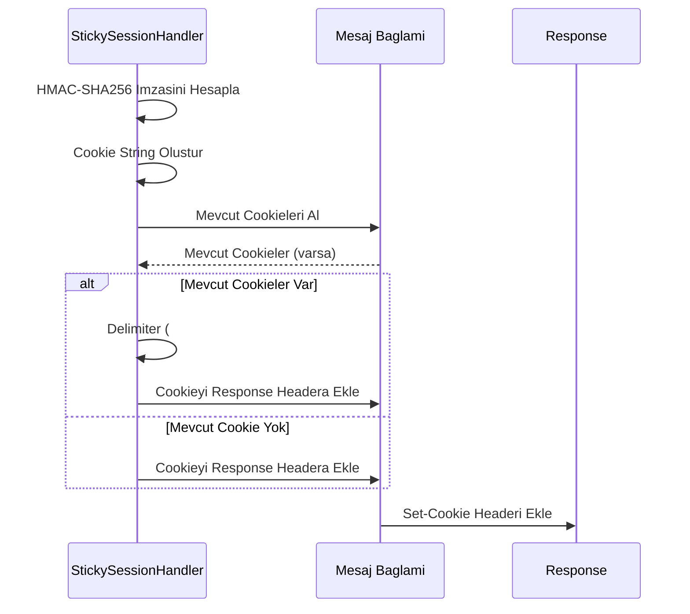
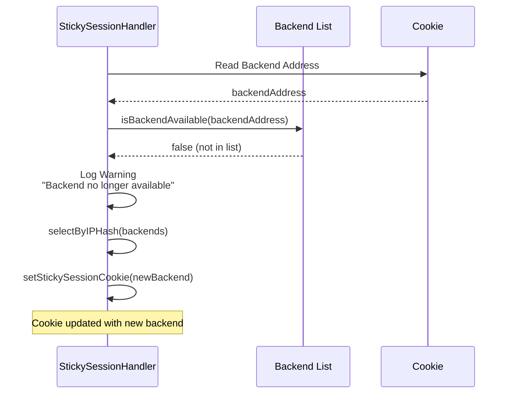
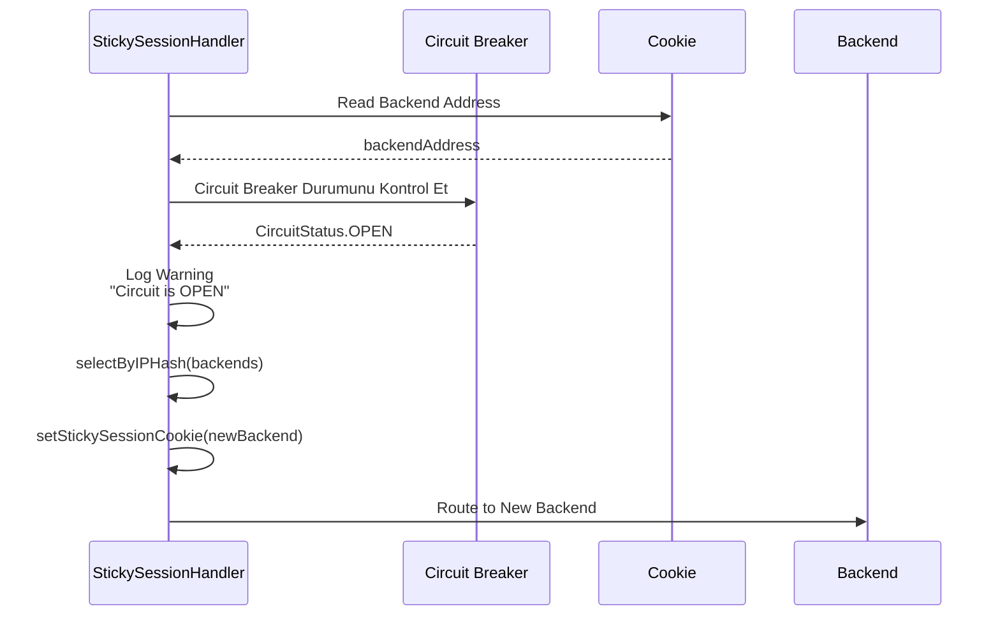

<Warning>
Bu özellikler sadece HTTP tipindeki API Proxy'ler için kullanılabilir. gRPC ve WebSocket tipindeki API Proxy'ler için bu ayarlar geçerli değildir.
</Warning>

## Kalıcı Oturum (Sticky Session) Nedir?

**Kalıcı Oturum (Sticky Session)**, aynı client'ın her zaman aynı backend'e yönlendirilmesini sağlayan bir mekanizmadır. Bu sayede session state, cache locality veya backend-specific veri tutarlılığı gibi senaryolarda kullanılabilir.

### Kullanım Senaryoları

- **Session State:** Backend'de session state tutuluyorsa, aynı client her zaman aynı backend'e yönlendirilmelidir
- **Cache Locality:** Backend'de client-specific cache varsa, cache hit oranını artırmak için sticky session kullanılabilir
- **Backend-Specific Veri:** Backend'de client'a özel veri tutuluyorsa, tutarlılık için sticky session gerekebilir

## Sticky Session Tipleri

Apinizer, üç farklı sticky session tipi destekler:

| Tip | Açıklama |
|-----|----------|
| **COOKIE_ONLY** | Sadece cookie kullanılır. Cookie yoksa veya geçersizse IP hash ile fallback yapılır. |
| **IP_HASH** | Sadece client IP'sine göre consistent hash kullanılır. Cookie kullanılmaz. |
| **HYBRID** | Önce cookie kontrol edilir, yoksa veya geçersizse IP hash kullanılır. |

### Sticky Session Akışı

Sticky session mekanizması şu adımlarla çalışır:

1. **İstek geldiğinde**, sticky session tipi kontrol edilir:
   - **IP_HASH** ise: Doğrudan IP hash ile backend seçilir ve istek gönderilir (cookie set edilmez)
   - **COOKIE_ONLY veya HYBRID** ise: Cookie kontrolüne geçilir

2. **Cookie kontrolü** (COOKIE_ONLY veya HYBRID için):
   - Cookie yoksa veya geçersizse: IP hash ile backend seçilir ve cookie set edilir
   - Cookie varsa: Cookie okunur ve doğrulanır

3. **Cookie doğrulaması sonrası**:
   - Cookie'deki backend adresi mevcut backend listesinde yoksa: Uyarı loglanır, IP hash ile yeni backend seçilir ve cookie güncellenir
   - Cookie'deki backend'in circuit breaker durumu OPEN ise: Uyarı loglanır, IP hash ile yeni backend seçilir ve cookie güncellenir
   - Cookie'deki backend geçerli ve sağlıklı ise: Cookie'deki backend kullanılır

4. **Backend seçimi tamamlandıktan sonra**:
   - Sticky type IP_HASH değilse: Cookie set edilir
   - İstek seçilen backend'e gönderilir

## Cookie Yönetimi

Cookie-based sticky session, HMAC-SHA256 ile imzalanmış güvenli cookie'ler kullanır.

### Cookie Formatı

Cookie formatı şu şekildedir:

```
Cookie: sticky-session-name=base64(backendAddress:signature)
```

- **backendAddress:** Backend URL adresi
- **signature:** HMAC-SHA256 ile hesaplanmış imza
- **Encoding:** Base64 URL-safe encoding (padding yok)

### Cookie Validation

Cookie validation süreci:

1. **Cookie Okuma:** Request header'dan cookie değeri okunur
2. **Base64 Decode:** Cookie değeri decode edilir
3. **Signature Verification:** HMAC-SHA256 ile signature doğrulanır
4. **Backend Address Extraction:** Geçerli cookie'den backend adresi çıkarılır

<Warning>
Cookie signature validation başarısız olursa, cookie geçersiz kabul edilir ve IP hash fallback yapılır. Bu, cookie manipulation saldırılarını önler.
</Warning>

### Cookie Set Etme

Cookie, response header yönetim mekanizması kullanılarak response header'a eklenir:



<Info>
Response header yönetim mekanizması sayesinde, birden fazla cookie (örneğin PolicyOIDC ve StickySession) aynı anda response'a eklenebilir. Mevcut cookie'ler korunur.
</Info>

### Cookie Parametreleri

| Parametre | Açıklama |
|-----------|----------|
| **Sticky Cookie Name** | Cookie'nin adı. Varsayılan değer yok, belirtilmelidir. |
| **Sticky Cookie TTL** | Cookie'nin geçerlilik süresi (saniye). Belirtilmezse session cookie olur. |
| **Sticky Cookie HttpOnly** | Cookie'nin JavaScript'ten erişilebilir olup olmayacağı. |
| **Sticky Cookie Secure** | Cookie'nin sadece HTTPS üzerinden gönderilip gönderilmeyeceği. |
| **Sticky Hash Secret** | HMAC-SHA256 imza için kullanılan secret key. Belirtilmezse varsayılan değer kullanılır. |

## Backend Availability ve Circuit Breaker

Sticky session, backend availability ve circuit breaker durumlarını kontrol eder.

### Backend Availability Kontrolü

Cookie'deki backend adresi, mevcut backend listesinde yoksa:

1. **Uyarı Loglanır:** Backend artık mevcut değil uyarısı
2. **IP Hash Fallback:** Yeni backend IP hash ile seçilir
3. **Cookie Güncellenir:** Yeni backend adresi cookie'ye yazılır



### Circuit Breaker Entegrasyonu

Cookie'deki backend'in circuit breaker durumu kontrol edilir:

- **Circuit CLOSED:** Backend sağlıklı, cookie'deki backend kullanılır
- **Circuit OPEN:** Backend unhealthy, yeni backend seçilir ve cookie güncellenir



<Note>
Circuit breaker kontrolü, cookie validation ve backend availability kontrolünden sonra yapılır. Bu sayede unhealthy backend'lere istek gönderilmez.
</Note>

## IP Hash Fallback

Cookie yoksa, geçersizse veya backend mevcut değilse, IP hash ile backend seçilir.

### Consistent Hashing

IP hash, client IP'sine göre consistent hashing yapar:

1. **IP Hash Hesaplama:** `Math.abs(clientIp.hashCode())`
2. **Backend Seçimi:** `hash % backends.size()`
3. **Consistency:** Aynı IP her zaman aynı backend'e yönlendirilir

<Info>
IP hash, client IP'si değişmediği sürece aynı backend'i seçer. Bu, cookie olmadan da sticky session benzeri davranış sağlar.
</Info>

## Sticky Session ve Load Balancing

Sticky session, load balancing algoritmaları ile birlikte kullanılabilir:

- **İlk İstek:** Load balancing algoritması (Round Robin, Weighted, LRU, Random) ile backend seçilir
- **Sonraki İstekler:** Cookie'deki backend kullanılır (availability ve circuit breaker kontrolünden sonra)

<Warning>
Sticky session aktifken, load balancing sadece ilk istek için geçerlidir. Sonraki istekler cookie'deki backend'e yönlendirilir.
</Warning>

## İlgili Konular

- [Yük Dengeleme](/tr/develop/yonlendirme/http-yonlendirme#yuk-dengeleme) - İlk istek için backend seçimi
- [Tekrar Deneme ve Yük Devretme](/tr/develop/yonlendirme/tekrar-deneme-ve-yuk-devretme) - Circuit breaker ve health check mekanizmaları

