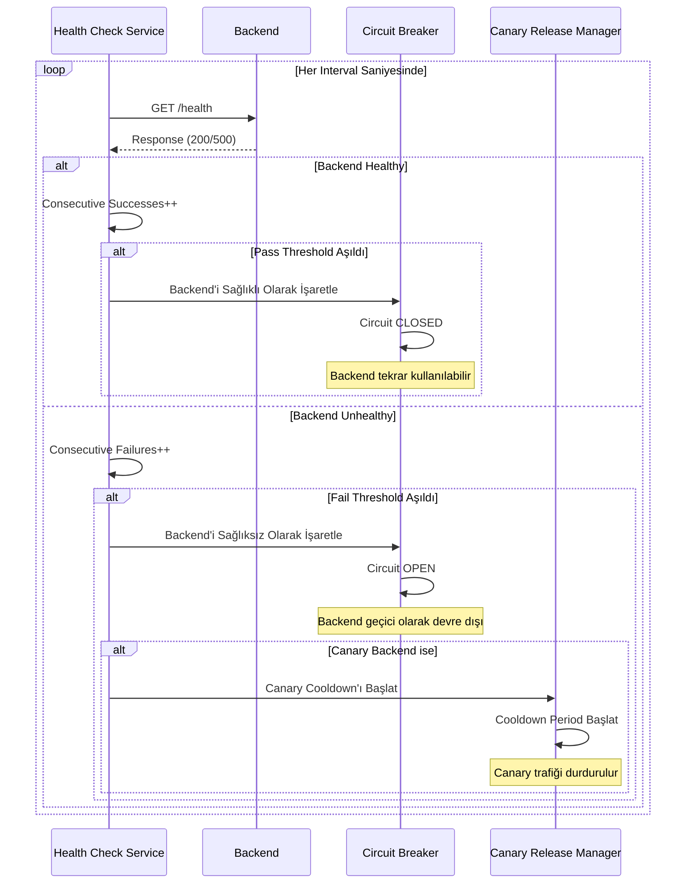
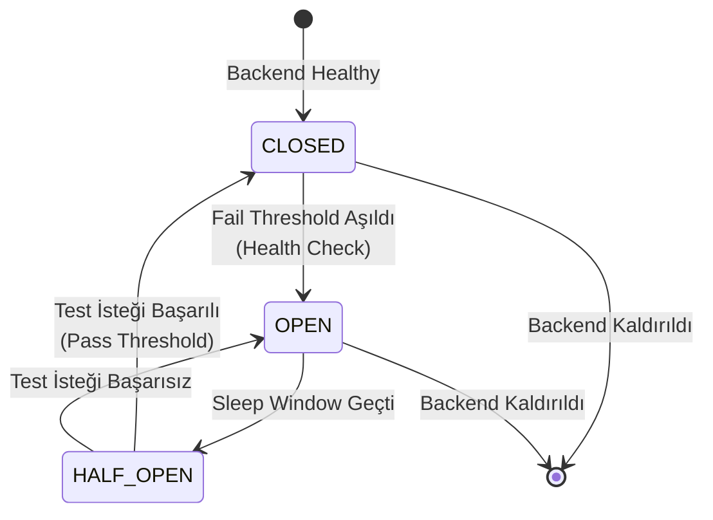

<Warning>
Bu özellikler sadece HTTP tipindeki API Proxy'ler için kullanılabilir. gRPC ve WebSocket tipindeki API Proxy'ler için bu ayarlar geçerli değildir.
</Warning>

## Tekrar Deneme (Retry) Mekanizması

Backend API'ye gönderilen istekler zaman aşımı, bağlantı hataları veya geçici hatalar nedeniyle başarısız olabilir. **Tekrar Deneme (Retry)** mekanizması, bu tür geçici hataların otomatik olarak tekrar denenmesini sağlar.

### Retry Parametreleri

| Parametre | Açıklama |
|-----------|----------|
| **Yeniden Deneme Sayısı (Retry Count)** | Backend API'ye gönderilen istek başarısız olduğunda, bu parametre kadar tekrar deneme yapılır. Değer 0 ise retry yapılmaz. |
| **Retry Delay** | Her retry denemesi arasında bekleme süresi. Exponential backoff veya sabit delay kullanılabilir. |

### Retry Akışı

Retry mekanizması şu durumlarda devreye girer:

- **Zaman Aşımı:** Bağlantı zaman aşımı veya okuma zaman aşımı oluştuğunda
- **Hata Kodları:** Backend'den HTTP hata kodları (4xx, 5xx) döndüğünde
- **Bağlantı Hataları:** UnknownHostException, MalformedURLException gibi bağlantı hatalarında

Retry mekanizması şu adımlarla çalışır:

1. **İlk istek gönderilir** ve sonuç kontrol edilir:
   - İstek başarılıysa: İşlem tamamlanır
   - İstek başarısızsa: Retry mekanizmasına geçilir

2. **Retry mekanizması**:
   - Retry count 0 ise: Hata döndürülür
   - Retry count 0'dan büyükse: Retry döngüsüne girilir

3. **Retry döngüsü** (i = 1'den retry count'a kadar):
   - Retry delay aktifse: Belirtilen süre beklenir
   - İstek tekrar gönderilir
   - İstek başarılıysa: İşlem tamamlanır
   - İstek başarısızsa ve i < retry count ise: i artırılır ve döngü devam eder
   - İstek başarısızsa ve i = retry count ise: Failover mekanizmasına geçilir

## Yük Devretme (Failover) Mekanizması

**Yük Devretme (Failover)** mekanizması, bir backend adresinin başarısız olması durumunda isteğin otomatik olarak diğer backend adreslerine yönlendirilmesini sağlar.

### Failover Mantığı

Failover mekanizması basit ve net bir mantıkla çalışır:

1. **İlk İstek:** PRIMARY adreslere gönderilir (load balancing ile)
2. **Başarısızlık Durumu:** İlk istek başarısız olursa ve `failoverOnlyEnabled=true` ise
3. **Failover Adresleri:** FAILOVER tipindeki adreslere sırayla istek gönderilir
4. **Failover Retry:** Her failover adresi için `failoverRetryCount` kadar deneme yapılır

<Warning>
`failoverOnlyEnabled=false` veya `null` ise failover mekanizması devreye girmez. Bu durumda retry mekanizması tamamlandıktan sonra istemciye hata döndürülür.
</Warning>

### Failover Akışı

Failover mekanizması şu adımlarla çalışır:

1. **PRIMARY backend'e istek gönderilir** ve retry count kadar deneme yapılır:
   - İstek başarılıysa: İşlem tamamlanır
   - Tüm denemeler başarısızsa: Failover kontrolüne geçilir

2. **Failover kontrolü**:
   - `failoverOnlyEnabled = false` veya `null` ise: Hata döndürülür
   - `failoverOnlyEnabled = true` ise: FAILOVER adreslerine geçilir

3. **FAILOVER adresleri** (sırayla denenir):
   - İlk failover adresi seçilir
   - Failover retry count kadar deneme yapılır
   - İstek başarılıysa: İşlem tamamlanır
   - İstek başarısızsa: Sonraki failover adresine geçilir

4. **Tüm failover adresleri denenene kadar**:
   - Her failover adresi için failover retry count kadar deneme yapılır
   - Başarılı olan ilk adres kullanılır ve işlem tamamlanır
   - Tüm failover adresleri başarısız olursa: Hata döndürülür

### Adres Tipleri

| Adres Tipi | Açıklama |
|------------|----------|
| **PRIMARY** | Normal trafik için kullanılan backend adresleri. İlk istek bu adreslere gönderilir. |
| **FAILOVER** | Sadece failover durumunda kullanılan adresler. `failoverOnlyEnabled=true` olduğunda devreye girer. |
| **CANARY** | Canary release için kullanılan adresler. Failover mekanizmasına dahil edilmez. |
| **MIRROR** | Traffic mirroring için kullanılan adresler. Failover mekanizmasına dahil edilmez. |

## Active Health Check

**Active Health Check** mekanizması, backend'lerin sağlık durumunu periyodik olarak kontrol eder ve circuit breaker ile entegre çalışarak otomatik yük devretme sağlar.

### Health Check Parametreleri

| Parametre | Açıklama |
|-----------|----------|
| **Health Path** | Backend'in health check endpoint'i. Tam URL olarak belirtilmelidir (örn: `https://backend.example.com/health`). |
| **Interval (Saniye)** | Health check'lerin ne sıklıkla yapılacağı. Varsayılan: 30 saniye. |
| **Timeout (Saniye)** | Health check isteğinin zaman aşımı süresi. Varsayılan: 5 saniye. |
| **Fail Threshold** | Backend'in unhealthy olarak işaretlenmesi için gereken ardışık başarısızlık sayısı. Varsayılan: 3. |
| **Pass Threshold** | Backend'in healthy olarak işaretlenmesi için gereken ardışık başarı sayısı. Varsayılan: 3. |

<Info>
Health Path boş veya null ise, ilgili backend için health check yapılmaz ve backend sağlık durumu izlenmez.
</Info>

### Health Check → Circuit Breaker Koordinasyonu

Health check mekanizması, circuit breaker ile koordineli çalışarak backend'lerin otomatik olarak devre dışı bırakılmasını ve tekrar aktif hale getirilmesini sağlar.

### Health Check Lifecycle Yönetimi

API Proxy deploy, update veya undeploy edildiğinde, health check kayıtları otomatik olarak yönetilir:

- **Deploy/Update:** Yeni backend'ler eklenir, silinen backend'ler kaldırılır, değişmeyen backend'lerin config'i güncellenir (health status korunur)
- **Undeploy:** Tüm backend'lerin health check kayıtları temizlenir

## Circuit Breaker Entegrasyonu

Circuit breaker, health check mekanizması ile entegre çalışarak backend'lerin sağlık durumuna göre otomatik olarak devreye girer veya çıkar.

### Circuit Breaker Durumları

### Circuit Breaker Parametreleri

| Parametre | Açıklama |
|-----------|----------|
| **Hata Penceresi (Error Window)** | Backend'in hatalar için izlenme süresi. Saniye olarak belirtilir. |
| **Hata Eşiği Değeri** | Hata penceresi süresince kabul edilecek maksimum hata sayısı veya yüzdesi. |
| **Hata Eşiği Tipi** | Hata sayısının nasıl hesaplanacağı (COUNT veya PERCENT). |
| **Uyuma Penceresi (Sleep Window)** | Circuit açıldıktan sonra backend'e istek gönderilmeyeceği süre. |
| **Yarı Açık (Half-Open)** | Uyuma penceresi geçtikten sonra test isteği gönderilerek backend'in durumu kontrol edilir. |

### Circuit Breaker ve Health Check Koordinasyonu

Health check mekanizması, circuit breaker'ı otomatik olarak yönetir:

- **Backend Unhealthy:** Health check fail threshold'u aştığında, circuit breaker otomatik olarak OPEN durumuna geçer
- **Backend Healthy:** Health check pass threshold'u aştığında, circuit breaker otomatik olarak CLOSED durumuna geçer

<Note>
Circuit breaker, health check ile koordineli çalışır. Health check aktif değilse, circuit breaker sadece gerçek isteklerdeki hatalara göre çalışır.
</Note>

## Rollback Mekanizması

Retry ve failover işlemleri sırasında, message context'in durumu korunması için rollback mekanizması kullanılır.

### Rollback Mantığı

Rollback mekanizması basit bir mantıkla çalışır:

- **İlk İstek (Primary):** Rollback yapılmaz
- **Retry İstekleri (i > 1):** Her retry öncesi rollback yapılır
- **Failover İstekleri:** Her failover adresi için rollback yapılır (çünkü önceki adresten sonra geliyoruz)

Bu sayede her yeni deneme, temiz bir message context ile başlar.

## İlgili Konular

- [Yük Dengeleme](/tr/develop/yonlendirme/http-yonlendirme#yuk-dengeleme) - Backend adresleri arasında yük dağıtımı
- [Canary Release](/tr/develop/yonlendirme/canary-ve-traffic-mirroring#canary-release) - Health check ile entegre canary release mekanizması
- [Devre Kesici](/tr/develop/yonlendirme/http-yonlendirme#devre-kesici) - Circuit breaker detaylı konfigürasyonu

