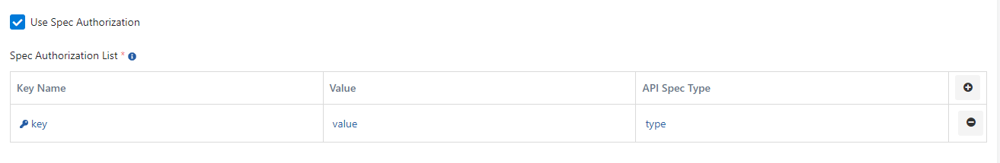
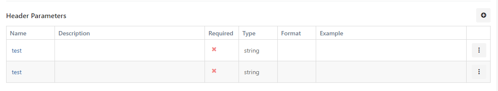
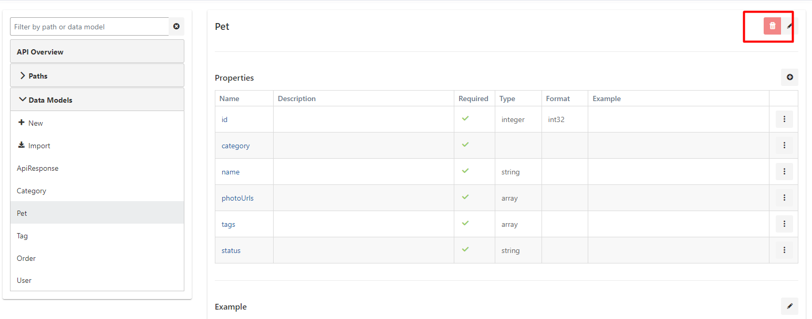
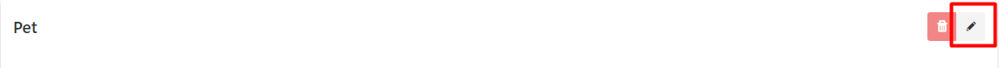
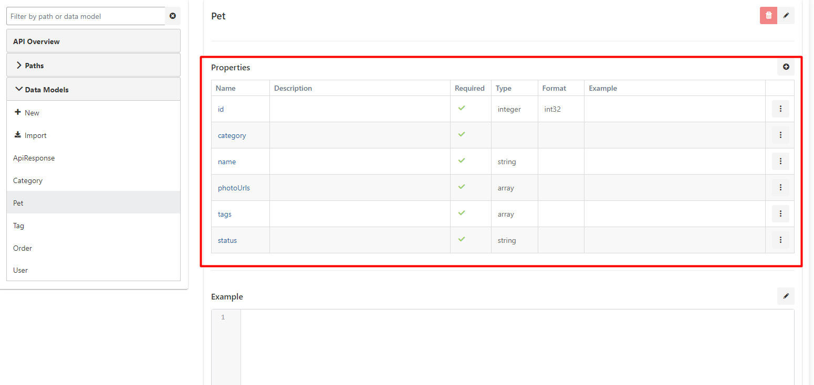
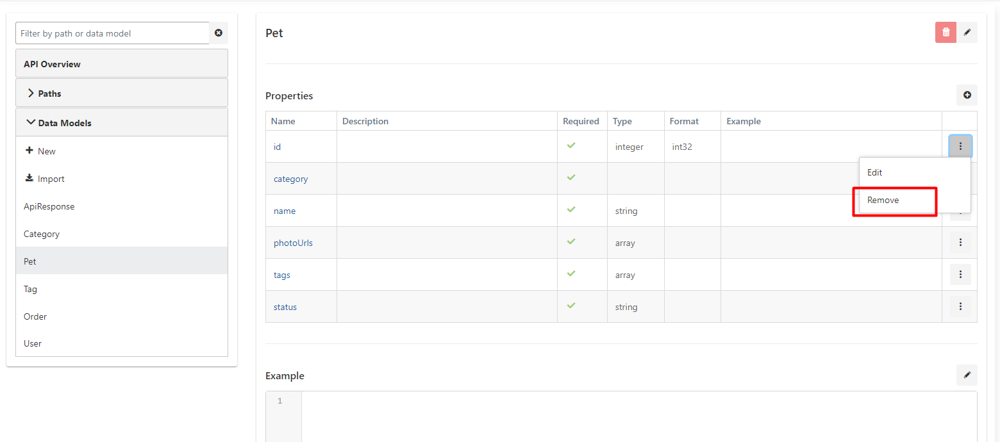

Spec Tasarım Editörü, formlar üzerinden veri girişi yaparak yeni bir API Tanım Belgesi (API Spec) oluşturulmasına ya da var olan API Tanım Belgelerinin içe aktarılarak kullanılmasına izin verir. Bu API Tanım Belgeleri daha sonra API Proxy oluşturmak için kullanılabilir.

<Info>
  API Spec Editörü üzerinden girilen bilgilerin detaylı açıklaması için [OpenAPI Spesifikasyonu](https://swagger.io/specification/) adresine bakabilirsiniz.
</Info>

## API Tanım Belgesi Listesi

Ana menüden **Spec Tasarım Editörü (Spec Designer)** bağlantısına tıklandığında API Tanım Belgesi Listesi görüntülenir.

Listenin üst kısmında filtre alanları bulunur. Filtre alanları güncellendiği zaman liste içeriği de filtreye uygun olarak güncellenir.

## API Tanım Belgesi Oluşturma

Var olmayan bir API'nin tasarlanması ya da code-first yaklaşımla geliştirilmiş ve herhangi bir tanım belgesi olmayan API'lerin dokümantasyonunu oluşturmak amacıyla kullanılır.

Liste arayüzünün sağ üst kısmındaki **+ Yeni (Create)** tuşuna tıklanarak yeni bir API Tanım Belgesi oluşturulabilir.

Yeni API Tanım Belgesi oluşturulurken iki seçenek bulunmaktadır.

### Form Doldurarak API Tanım Belgesi Oluşturma

Yeni API Tanım Belgesi arayüzü açıldığında, var olan iki seçenekten **Boş API (Blank API)** seçeneğinin varsayılan olarak seçili geldiği görülür.

Yeni API Tanım Belgesi arayüzü için kullanılan alanlar aşağıdaki tabloda görülmektedir.

| Alan | Açıklama |
|------|----------|
| **Başlık** _(Title)_ | API Tanım Dosyasının listede görünen başlığı/adıdır. Zorunludur ve proje bazında biricik (unique) olmalıdır. |
| **Açıklama** _(Description)_ | API Tanım Dosyasına ilişkin açıklamadır. Girilmesi isteğe bağlıdır. |
| **Sunucular** _(Servers)_ | API'nin hizmet verdiği/vereceği sunucuların listesidir. |
| **Sunucu - URL** | API'ye erişilebilecek adrestir. Zorunludur. |
| **Sunucu - Açıklama** _(Description)_ | Bu sunucuya ilişkin açıklamadır. Girilmesi isteğe bağlıdır. |

**Başlık (Title)** alanı doldurulup **Sunucular (Servers)** bölümünde en az bir sunucu kaydı oluşturduktan sonra sağ üstteki **Oluştur (Create)** tuşu tıklanabilir hale gelir ve bu tuşa basılarak tanım dosyası kaydedilebilir. Tanım dosyası kaydedildikten sonra yapılabilecek işlemler [API Tanım Belgesi Güncelleme](#api-tanım-belgesi-güncelleme) kısmında açıklanmıştır.

### Var olan API Tanım Belgesini İçe Aktarma

Yeni API Tanım Belgesi oluşturmak için kullanılabilecek ikinci seçenek, var olan bir API Tanım Belgesinin içeri aktarılmasıdır. Bunun için **API Tanım Belgesini İçe Aktar (Import API Spec)** seçeneği seçilir.

İçe aktarılmak üzere iki standart desteklenmektedir. Bunlar [OpenAPI 3.0.x](https://swagger.io/specification/) ve [OpenAPI 2.x (Swagger)](https://swagger.io/specification/v2/) standartlarıdır.

Seçilen standarda uygun dosyanın içeri aktarılabilmesi için **URL Girme (Enter URL)** ve **Dosya Yükleme (Upload File)** seçenekleri bulunmaktadır.

#### Spec Authorization Kullan (Use Spec Authorization)

Bazı tanım dosyaları, içeriklerinin görüntülenebilmesi için istemcinin yetkilendirilmiş olduğunu kontrol eder. Bunun için HTTP isteği içerisinde kimlik doğrulama verilerinin gönderilmesi gerekir. Eğer erişilecek URL'deki tanım dosyası böyle bir dosya ise, bu kutu işaretlenerek kimlik bilgilerini girilir.

**Spec Authorization Kullan** seçeneği işaretlenirse aşağıdaki tablo gelir ve yetkilendirme için gerekli olan anahtarlar eklenir.

#### URL Girme

Var olan API Tanım Dosyasına erişilebilecek adres **URL** alanına girilerek **Ayrıştır (Parse)** tuşuna tıklanır.

#### Dosya Yükleme

Yükleme tuşuna tıklanıp var olan API Tanım Dosyası seçilerek **Ayrıştır (Parse)** tuşuna tıklanır.

Her iki yöntemde de ayrıştırma işleminin sonucunda Başlık (Title), Açıklama (Description) ve Sunucular (Servers) alanları gelir. Boş API oluşturmadan farklı olarak bu alanların değerleri içe aktarılan API Tanım Dosyası içinden alınır. Bu aşamadan sonra sağ üstteki **Oluştur (Create)** tuşu tıklanabilir hale gelir ve bu tuşa basılarak tanım dosyası kaydedilebilir.

## API Tanım Belgesi Güncelleme

API Tanım Belgesi listesinde bir kaydın Başlık kolonundaki değere tıklandığında ya da o kaydın en sağdaki kolonunda bulunan menü tuşuna tıklanıp **Güncelle (Edit)** seçeneği seçildiğinde, API Tanım Dosyası güncelleme arayüzü açılır.

**API Tanım Belgesinin ayarlarını içeren görsele aşağıda yer verilmiştir:**

### Genel Bakış (API Overview)

Güncelleme arayüzü ilk açıldığında **Genel Bakış (API Overview)** açılır. Genel Bakış bağlantısı arayüzün sol tarafındadır.

### Adresler (Paths)

Genel Bakış bağlantısının hemen altında **Adresler (Paths)** bölümü vardır.

**Adres (Path)**, bir API'nin istek gönderilebilecek adreslerinden her birine verilen isimdir.

#### Adres Ekleme

API'nin adreslerine bir yenisini eklemek için, Adresler bölümünün başlığının altındaki **+ Yeni** tuşuna tıklanır.

Açılan pencerede eklenmek istenen adres girilerek **Kaydet (Save)** tuşuna tıklanır.

#### Adres Silme

Listedeki adreslerden herhangi birine tıklandığında o adres seçilmiş olur ve sağ tarafta o adrese ilişkin detayların yönetilebileceği bir bölüm görüntülenir. Bu bölümün sağ üst kısmındaki **Sil (Delete)** tuşuna tıklanarak adres silinebilir.

#### Adres Güncelleme

Listedeki adreslerden herhangi birine tıklandığında o adres seçilmiş olur ve sağ tarafta o adrese ilişkin detayların yönetilebileceği bir bölüm görüntülenir.

##### Adresi Değiştirme

Sağ tarafta en üstte adres bir bağlantı olarak görüntülenir. Bu bağlantının yanındaki **Düzenle (Edit)** butonuna tıklandığında, açılan pencereden adres güncellenebilir.

**Adres düzenleme ayarlarını içeren görsele aşağıda yer verilmiştir:**

##### İşlemler (Operations)

Bir **Adres** seçildiği zaman arayüzün sağ tarafında o adrese tanımlanmış olan **İşlemler (Operations)**'in yönetilebileceği bir bölüm gelir.

**İşlem (Operation)**: Bir API'nin, tanımlı adresleri üzerinden istek kabul ettiği her bir geçerli HTTP Metodu ile bu metoda ilişkin kimlik ve tanımlayıcı bilgiler, parametreler, istek ve yanıt içeriklerinden oluşur.

Herhangi bir adres seçildiğinde, o adres için tanımlanmış olan **İşlem**lerden ilki seçili olarak görüntülenir.

<Warning>
  Seçilen işlem, HTTP Metot adını içeren kutucuğun alt kısmındaki ince mavi çizgi ile gösterilir.
</Warning>

Yukarıdaki görselde /pet/findByStatus adresinin kullanıcı tarafından seçilmiş olduğu, bu adreste tanımlanmış olan **Get** işleminin de otomatik olarak seçilerek detayının görüntülenmiş olduğu görülmektedir.

###### Kimlik ve Tanımlama Alanları

Kimlik ve Tanımlama Alanları için kullanılan alanlar aşağıdaki tabloda görülmektedir.

| Alan | Açıklama |
|------|----------|
| **Özet** _(Summary)_ | İşlemin ne yaptığına ilişkin kısa bilgidir. Girilmesi isteğe bağlıdır. |
| **İşlem ID** _(Operation ID)_ | İşlemin biricik anahtarıdır. • API'nin tüm işlemleri arasında benzersiz olmalıdır. • Büyük/küçük harfe duyarlıdır. • Araçlar ve kitaplıklar bir işlemi benzersiz şekilde tanımlamak için bu değeri kullanabileceğinden, yaygın programlama adlandırma kurallarına uyulması **ÖNERİLİR**. |
| **Açıklama** _(Description)_ | İşlem davranışının ayrıntılı bir açıklamasıdır. Girilmesi isteğe bağlıdır. |
| **Etiketler** _(Tags)_ | Etiketler, işlemlerin kaynaklara veya diğer niteleyicilere göre mantıksal olarak gruplandırılması için kullanılabilir. Girilmesi isteğe bağlıdır. Birden çok eklenebilir. |

###### Başlık Parametreleri (Header Parameters)

Bu, İşleme gönderilebilecek başlıkların yönetildiği bölümdür.

###### Sorgu Parametreleri (Query Parameters)

Bu, İşlemin alabileceği sorgu parametrelerinin yönetildiği bölümdür.

###### İstek Gövdesi (Request Body)

Bu, İşlem için örnek istek gövdelerinin yönetilebileceği bölümdür. Bir ya da daha fazla **Medya Tipi (Media Type)** için örnek istek gövdesi tanımlanabilir.

###### Yanıtlar (Responses)

Bu İşlem için döndürülebilecek **Yanıt (Response)**'ların yönetilebileceği bölümdür.

Her bir yanıt, bir **HTTP Durum Kodu (HTTP Status Code)**, o durum kodunun açıklaması ile, bir ya da daha fazla **Medya Tipi (Media Type)** için oluşturulmuş **Yanıt Gövdesi (Response Body)**'den oluşur.

<Info>
  Apinizer, bir **Medya Tipi** için birden çok muhtemel yanıt gövdesinin ve bunların hangi koşullarda döndürülebileceğinin tanımlanmasına olanak verir.
</Info>

Aşağıdaki görselde şunlar görülmektedir:
- Bu İşlem için 200 ve 400 kodları döndürülebilir.
- 200 kodu için application/json ya da application/xml olmak üzere iki farklı Medya Tipinden yanıt dönebilir.
- application/json Medya Tipi için **status** parametresinin değeri "pending" ise birinci satırdakine, "sold" ise ikinci satırdakine benzer bir yanıt gövdesi dönecektir.

###### İşlem Ekleme

Bir Adres seçildiğinde, o Adres için tanımlanmış olan İşlemler, ilgili HTTP Metotları renklendirilerek gösterilir. Renklendirilmemiş HTTP Metotları için henüz bir İşlem tanımlanmamış demektir. Bunlardan herhangi birisi için İşlem tanımlanmak istenirse, istenen HTTP Metodu seçilir. Bu seçim ile birlikte, henüz bir İşlem tanımlanmadığı görülür. İşlem **Yeni İşlem (Add Operation)** tuşuna basılarak seçilmiş olan metot için İşlem eklenebilir.

###### İşlem Silme

Bir İşlem seçildiğinde, pencerenin sağ tarafında bir **Sil (Delete)** tuşu görünür. Bu tuşa tıklanarak seçilmiş olan İşlem silinebilir. Aşağıdaki görselde, Delete işleminin seçildiği ve bu işlemin silinebilmesi için kullanılacak Sil tuşu görülmektedir.

### Veri Modelleri (Data Models)

Arayüzün sol tarafının alt kısmında bu API'nin kullandığı ve standart temel tiplerden (primitive types) olmayan veri tipleri görüntülenir.

#### Veri Modeli Ekleme

Yeni bir veri modeli eklemek için bölümün başlığının altındaki **+ Yeni** tuşuna tıklanır.

Açılan pencerede veri modelinin adı ve açıklaması girilerek **Kaydet (Save)** tuşuna tıklanır.

#### Veri Modeli Import Etme

Spec içerisindeki Veri Modellerine, Ortak Sorgu Modeli (Data Models) sayfası üzerinden eklenmiş modeller aktarılabilir.

#### Veri Modeli Silme

Herhangi bir veri modelinin üzerine tıklandığında sağ tarafta o veri modelinin detayı görüntülenir. Açılan bu bölümün sağ üst kısmındaki **Sil (Delete)** tuşuna tıklanarak veri modeli silinebilir.

#### Veri Modeli Güncelleme

Herhangi bir veri modelinin üzerine tıklandığında sağ tarafta o veri modelinin detayı görüntülenir. Bu bölümde, veri modelinin adı, açıklaması ve özellikleri (properties) bulunur.

##### Veri Modelinin Adını Değiştirme

Veri modelinin adının yanındaki **Düzenle (Edit)** simgesine tıklandığında adın güncellenebileceği bir metin kutusu açılır. İstenen değişiklik bu alanda yapılır.

##### Özellikler (Properties)

Veri modelinin alt alanlarından her birine **Özellik (Property)** adı verilir. Bir veri modeli Nesneye Yönelik Programlamadaki bir Sınıf (Class), bir özellik ise bu sınıfın içindeki özellik (property) ya da nitelik (attribute) olarak görülebilir.

###### Özellik Ekleme

Özellikleri içeren tablonun kolon başlıkları satırının en sağında bulunan **+** tuşuna tıklandığında yeni bir özellik girilebilecek bir pencere açılır.

Açılan penceredeki veri alanları doldurularak **Kaydet (Save)** tuşuna tıklanır.

Özellik eklemek için kullanılan alanlar aşağıdaki tabloda görülmektedir.

| Alan | Açıklama |
|------|----------|
| **Ad** _(Name)_ | Özelliğin adıdır. Zorunludur ve Veri Modelinin bütün Özellikleri içinde biricik (unique) olmalıdır. |
| **Açıklama** _(Description)_ | Özelliğin ne olduğuna, nasıl kullanılacağına ilişkin açıklamadır. Doldurulması isteğe bağlı alandır. |
| **Zorunlu** _(Required)_ | Bu özelliğin değerinin olmasının zorunlu olup olmadığını belirtir. |
| **Tip** _(Type)_ | Özelliğin tipidir. Temel türler ya da API içinde tanımlanmış olan tipler kullanılabilir. Zorunlu alandır. |

###### Özellik Silme

Özellikler tablosundaki her özelliğin satırının sonundaki menüden o özelliği silmek için kullanılabilecek **Kaldır (Remove)** tuşu bulunur.

###### Özellik Güncelleme

Özelliklerden herhangi birinin Ad (Name) kolonundaki değerine tıklanırsa, o özelliğin güncellenebileceği pencere açılır. Güncellemeler yapıldıktan sonra **Kaydet (Save)** tuşuna basılarak güncelleme işlemi tamamlanır.

## API Tanım Belgesi Silme

API Tanım Belgesi listesinde silinmek istenen kaydın en sağdaki kolonunda bulunan menü tuşuna tıklanıp **Kaldır (Remove)** seçilerek kayıt silinebilir.

## API Proxy Oluşturma

API Tanım Belgesi'nin güncelleme arayüzünde **API Proxy Oluştur (Create API Proxy)** tuşuna tıklanarak bu API Spec kullanılarak bir API Proxy oluşturulabilir.

<Warning>
  API Tanım Dosyası kullanılarak API Proxy oluşturulurken, tanım dosyasında bulunan tanımlar API Proxy için şablon olarak kullanılır. API Proxy oluşturulduktan sonra Spec Tasarım Editörü üzerinden tanım dosyasında yapılan değişiklikler API Proxy'i, API Proxy'nin Tasarım sekmesinden yapılan değişiklikler ise API Tanım Dosyasını etkilemez.
</Warning>

<Warning>
  Bir API Tanım Dosyası kullanılarak birden çok API Proxy oluşturulabilir.
</Warning>

## İlgili Sayfalar

- [Data Models](/tr/gelistirici/api-tasarimi/data-models) - Ortak veri modelleri oluşturma
- [API Proxy Oluşturma](/tr/gelistirici/api-proxy-olusturma) - API Tanım Belgelerinden API Proxy oluşturma
- [Quick Start](/tr/gelistirici/quick-start) - Hızlı başlangıç kılavuzu
